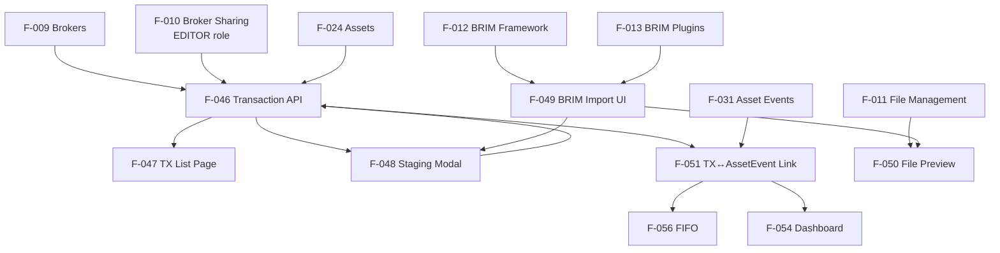

# Transaction Feature Connections

> Status: Phase 7 — **Parts 1✅, 2✅, 3✅ DONE (2026-04-25), Part 4✅ DONE (Rounds 1–5, 2026-04-30)**.
> Frontend `/transactions` page fully implemented. F-047 implemented. F-048 modals rewritten (FormModal + BulkModal + PromoteWizard) with unified batch pipeline, server-driven type rules, dual-transaction form, i18n validation errors. BRIM mode deferred to Part 5.
> See [[connections/dependency-graph]] for the full project view.

---

## Dependency Graph

---

## Phase 7 Closed-Gaps Summary

The pre-Phase-7 gap list below was the original analysis. As of 2026-04-25
(Phase 7 Part 3 closure) all 7 gaps that drove the work are resolved.

| # | Original gap | Resolved by | Notes |
|---|--------------|-------------|-------|
| 1 | `Transaction ↔ AssetEvent` link absent | F-051 — `Transaction.asset_event_id` + `POST /transactions/events/suggest` | Part 1 (column) + Part 3 (suggest endpoint) |
| 2 | Access control for GET/PATCH/DELETE not broker-filtered | F-046 — broker-scoped queries + EDITOR-role write checks | Part 3 |
| 3 | BRIM no `plugin_version` for cache invalidation | F-013 + [[decisions/brim-parser-only]] (`parse_is_stale` flag) | Part 2 |
| 4 | Frontend `/transactions` placeholder | F-047 — DataTable + always-pair-adjacent + client-side filters + staging modals | ✅ Part 4 |
| 5 | No unified Staging Area | F-048 — manual `create-many`/`edit-many` done; BRIM `create-brim` Part 5 | ⏳ Part 5 |
| 6 | BRIM no metadata UI for preview columns | F-013 / F-049 — `last-parse` cache + dynamic columns | Part 2 + Part 3 |
| 7 | Bulk TX not atomic per-broker | F-046 — see [[decisions/multi-broker-atomic-tx]] | Part 3 (multi-broker, single DEFERRABLE FK) |

Additional Phase 7 deliverables not in the original gap list:

- **Hard-400 on price/event currency mismatch** ([[decisions/price-currency-hard-reject]] — Blocco I.2)
- **HTTP 409 on `Asset.currency` PATCH with existing data** + **Policy D destructive wipe** ([[decisions/policy-d-currency-wipe]])
- **Backup router** for pre-wipe snapshots ([[entities/backup-router]])
- **2 production bugs** discovered by the BlockG coverage push:
  [[problems/assets-wipe-error-attr-mismatch]],
  [[problems/babel-currency-symbol-echo]]

---

## Cross-Layer Handoffs

| Backend | Interface | Frontend |
|---------|-----------|----------|
| [[F-046]] TX Unified Pipeline | `POST /api/v1/transactions/validate` + `/commit` | [[F-048]] Form/Bulk/Promote modals |
| [[F-046]] TX List | `GET /api/v1/transactions` | [[F-047]] Transaction List Page |
| [[F-046]] TX Type Metadata | `GET /api/v1/transactions/types` | [[F-048]] server-driven type rules |
| [[F-013]] BRIM parse | `POST /api/v1/brokers/import/files/{id}/parse` | [[F-049]] BRIM Import UI |
| [[F-013]] Last parse cache | `GET /api/v1/brokers/import/files/{id}/last-parse` | [[F-049]] Re-open Staging |
| [[F-050]] File preview | `GET /api/v1/uploads/{id}/preview` (planned) | [[F-050]] Inline preview |
| [[F-051]] Event link | embedded in TX response | [[F-047]] event indicators |

---

## Transaction Types (from V1 design, still current)

| Type | Quantity effect | Cash effect |
|------|---------------|-------------|
| `BUY` | ↑ | ↓ (BUY_SPEND) |
| `SELL` | ↓ | ↑ (SALE_PROCEEDS) |
| `DIVIDEND` | — | ↑ |
| `INTEREST` | — | ↑ |
| `TRANSFER_IN` / `TRANSFER_OUT` | ↑/↓ | — |
| `FEE` / `TAX` | — | ↓ |
| `SPLIT` | adjusted | — |

---

## Notes

- **Cash movements are auto-generated** from transactions that impact cash (not a separate user action)
- **FIFO** ([[F-056]]) requires accurate transaction history to compute cost basis on-demand
- **Phase 7 deliberately excludes** fiscal regimes (FIFO/LIFO/PMC), cash split, over-sell protection — deferred to Phase 8+

## Key source files

| Role | Path |
|------|------|
| Transaction API | `backend/app/api/v1/transactions.py` |
| Transaction service | `backend/app/services/transaction_service.py` |
| DB model (Transaction) | `backend/app/db/models.py` |
| Transaction pages | `frontend/src/routes/(app)/transactions/` |
| BRIM abstract base | `backend/app/services/brim_provider.py` |
