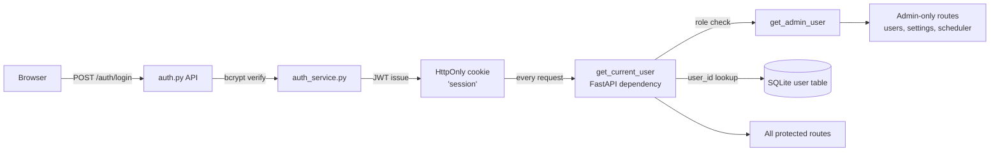

# Domain: AUTH

> LibreFolio's authentication and access control layer — ensures every request is made by a known, permitted user.

## What it does

Users log in with username/email and password. The server issues a JWT stored in an HttpOnly cookie (`session`). Every protected API endpoint validates this cookie via a FastAPI dependency (`get_current_user`) — there is no session store, no Redis, no sticky sessions. This stateless design means any number of worker processes can handle any request without coordination.

The first user to register is automatically promoted to admin. Admins manage the user list: creating, deactivating, and assigning roles. Inactive users are blocked at the dependency level with HTTP 401 before any business logic runs. Role-based access (`admin` vs `user`) gates administrative features such as global settings, scheduler configuration, and user management.

The role system also extends into the broker-sharing model (Owner / Editor / Viewer per broker), but that relationship is managed by the BROKERS domain rather than AUTH. AUTH's responsibility ends at: who are you, are you active, and what is your system role.

## Feature cluster

| Code | Feature | Layer | Role in domain | Status |
|------|---------|-------|----------------|--------|
| [[F-001]] | User Authentication & Sessions | fullstack | core — login/logout/session lifecycle | implemented |
| [[F-002]] | User Management (admin CRUD) | fullstack | support — admin creates/deactivates users | implemented |
| [[F-003]] | Multi-User Role System (admin/user) | fullstack | core — role gates admin endpoints | implemented |

## Architecture at a glance

## Key decisions that shaped this domain

- [[decisions/prod-test-data-separation]] — Auth works identically in prod and test environments; the test server runs on a separate port with its own isolated SQLite DB, so auth tests never touch prod user records.
- F-065 JWT Cookie Auth (see [[features/F-065]]) — using HttpOnly cookies (not Authorization header) avoids XSS token theft; stateless JWT avoids session store complexity in multi-worker Docker deployments.

## Known problems / limitations

No open problems. The auth domain is small, well-tested, and stable.

## What comes next

No planned features in this domain. The auth foundation is intentionally minimal — future needs (OAuth, SSO) would be additive F-NNN features, not changes to existing ones.

## Source files

| Role | Path |
|------|------|
| Primary mkdocs | `mkdocs_src/docs/developer/architecture/access_control.md` |
| Auth API endpoints | `backend/app/api/v1/auth.py` |
| Auth service | `backend/app/services/auth_service.py` |
| User service | `backend/app/services/user_service.py` |
| Auth store (frontend) | `frontend/src/lib/stores/auth.ts` |
| DB model (User, UserRole) | `backend/app/db/models.py` |
