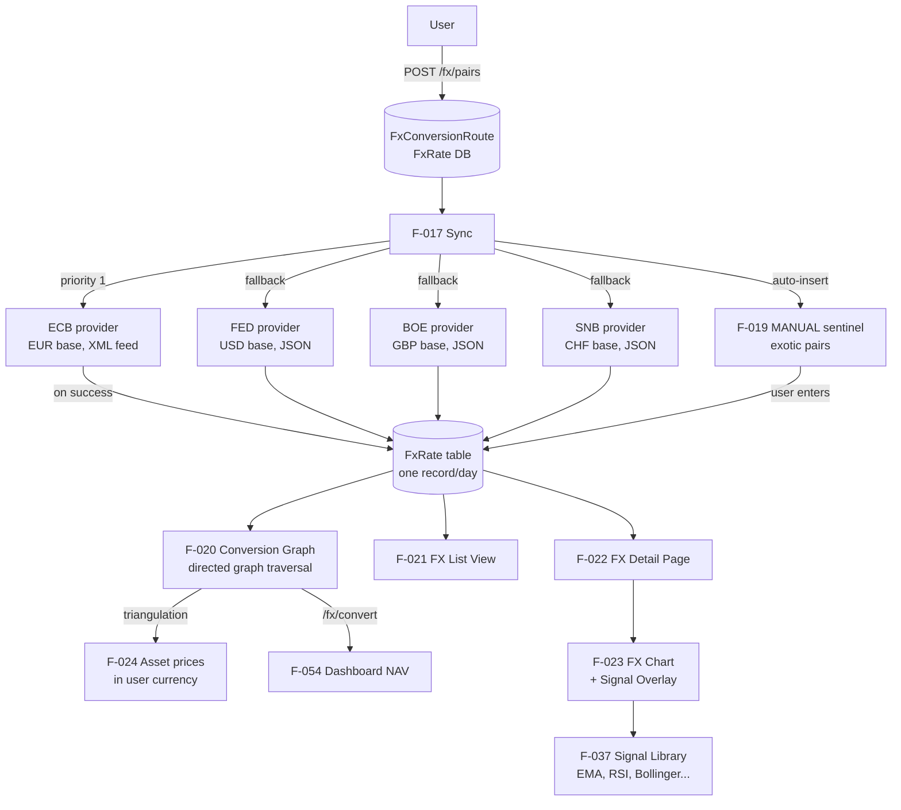

# Domain: FX (Foreign Exchange)

> LibreFolio's currency intelligence layer — tracks exchange rates from four central banks, handles any pair through triangulation, and exposes rate history as interactive charts.

## What it does

The FX domain solves a concrete problem for international investors: their assets are priced in one currency, their account is denominated in another, and they may hold assets across a dozen currencies simultaneously. LibreFolio manages this by letting users configure currency pairs (e.g. EUR/USD, USD/JPY) and sync historical rates from central bank feeds — ECB for EUR, FED for USD, BOE for GBP, SNB for CHF. Rates are stored one record per day (the daily-point policy shared with asset prices), and the full history is displayed as a chart with the same signal overlay system used by asset charts.

Multi-provider fallback means no single central bank outage breaks your data. Each pair can have multiple providers assigned with a priority ordering; sync tries them in order and moves on if one fails. Exotic pairs not covered by any central bank (e.g. SGD/SEK) can still exist in the system — the MANUAL sentinel provider is automatically assigned, allowing users to enter rates manually via the inline data editor on the FX detail page.

The most architecturally significant feature of this domain is currency triangulation. Rather than requiring an explicit pair for every combination (which would be combinatorially explosive), LibreFolio builds a directed graph from the configured pairs. If EUR/USD and USD/JPY are configured, EUR/JPY can be computed in two hops without an explicit pair. This conversion graph is the engine behind asset-price display in the user's chosen currency, portfolio NAV aggregation, and all cross-currency calculations in the CALCULATIONS domain.

## Feature cluster

| Code | Feature | Layer | Role in domain | Status |
|------|---------|-------|----------------|--------|
| [[F-015]] | FX Provider Registry (ECB, FED, BOE, SNB) | backend | core — four central bank providers auto-discovered | implemented |
| [[F-016]] | FX Pair CRUD | fullstack | core — create/list/edit/delete currency pairs | implemented |
| [[F-017]] | FX Rate Sync (fetch from central banks) | fullstack | core — pulls historical rates from configured providers | implemented |
| [[F-018]] | FX Multi-Provider Fallback (priority chain) | backend | core — resilient sync across multiple providers per pair | implemented |
| [[F-019]] | MANUAL Sentinel Provider (auto-insert/remove) | backend | support — handles exotic pairs with no real provider | implemented |
| [[F-020]] | FX Currency Conversion Graph (triangulation) | fullstack | core — enables cross-pair conversions via graph traversal | implemented |
| [[F-021]] | FX List View (dual view: card + table) | frontend | display — card grid + DataTable, toggle persisted | implemented |
| [[F-022]] | FX Detail Page (rate history, provider mgmt) | frontend | display — full history chart + inline rate editor | implemented |
| [[F-023]] | FX Chart & Signal Overlay | frontend | display — rate history chart with signal library | implemented |

## Architecture at a glance

## Key decisions that shaped this domain

- [[decisions/manual-fx-sentinel]] — MANUAL is a sentinel, not a real provider: it exists only when no real provider covers a pair, is automatically managed (inserted/removed/reinstated) by the system, and is hidden from the UI provider list. This keeps the UX simple while ensuring no pair is ever left without a mechanism for rate entry.
- [[decisions/fx-sync-pair-based]] — FX sync was redesigned from a currency-list approach (GET with query params) to a pair-based POST model. This broke backward compatibility but aligned with the data model and enabled proper multi-provider assignment per pair.

## Known problems / limitations

No open problems. The FX domain is fully implemented and stable.

## What comes next

- [[F-094]] Sync Date Range Dialog — let users choose the historical range when syncing a pair (currently syncs a fixed horizon from the provider's data).
- [[F-089]] FX Provider Per-Plugin Documentation — dedicated mkdocs pages per central bank provider, including data quality notes and coverage gaps.

## Source files

| Role | Path |
|------|------|
| Primary mkdocs | `mkdocs_src/docs/developer/backend/fx/architecture.md` |
| FX configuration mkdocs | `mkdocs_src/docs/developer/backend/fx/configuration.md` |
| FX providers list mkdocs | `mkdocs_src/docs/developer/backend/fx/providers_list.md` |
| FX plugin guide | `mkdocs_src/docs/developer/architecture/patterns/fx_plugin_guide.md` |
| Conversion chain algorithm | `mkdocs_src/docs/developer/frontend/fx-chain-algorithm.md` |
| User FX docs | `mkdocs_src/docs/user/fx/` |
| FX API | `backend/app/api/v1/fx.py` |
| FX service + abstract base | `backend/app/services/fx.py` |
| FX providers | `backend/app/services/fx_providers/` |
| DB models (FxRate, FxConversionRoute) | `backend/app/db/models.py` |
| FX pages | `frontend/src/routes/(app)/fx/` |
| FX store registry | `frontend/src/lib/stores/fxStoreRegistry.ts` |
| Currency graph store | `frontend/src/lib/stores/currencyGraphStore.ts` |
