# Domain: INFRASTRUCTURE

> The development and deployment backbone — the patterns, tools, and systems that enable every other domain but are invisible to end users.

## What it does

Infrastructure in LibreFolio is not one feature — it is the collection of architectural decisions, patterns, and tooling that makes the other 80 features possible to build, test, deploy, and maintain. It spans three layers: backend runtime patterns (provider registry, thread isolation, TTL cache), frontend architecture patterns (Zodios API client, EditBuffer, TimeSeriesStore), and project-level tooling (Docker packaging, dev.py CLI, MkDocs documentation, Playwright and pytest test suites, LLM translation pipeline, gallery screenshot automation).

The **Provider Registry Pattern** (F-059) is the backbone of extensibility across three families of plugins: FX providers, asset data providers, and BRIM broker parsers. Any class decorated with `@register_provider` is auto-discovered at import time with zero manual registration. **Thread Isolation** (F-060) makes all provider calls async-safe by running each in a dedicated thread with its own event loop, allowing providers to use synchronous I/O libraries directly. The **5-layer TTL cache** (F-061) sits between the thread-isolated provider calls and the database, with different TTLs for different data freshness requirements.

On the frontend, the **Zodios API client** (F-066) provides full TypeScript type safety and Zod runtime validation for all API calls, regenerated from the backend's OpenAPI schema with `./dev.py api sync`. The **TimeSeriesStore** (F-072) minimizes API calls by tracking gaps in the client-side cache and fetching only missing date ranges. The **EditBuffer** (F-071) provides a unified model for inline editing across three interaction modes: chart click, CSV text, and form input.

The project's single Docker image (F-062) and the `dev.py` CLI (F-063) encapsulate the full build/test/deploy lifecycle. The MkDocs documentation (F-069) is multi-language (EN/IT/FR/ES) via a suffix strategy, with translation handled by the Aphra LLM pipeline (F-070). The test suite — 276+ backend pytest tests (F-068) and 181+ Playwright E2E tests (F-067) — is the quality gate for every domain.

## Feature cluster

| Code | Feature | Layer | Role in domain | Status |
|------|---------|-------|----------------|--------|
| [[F-059]] | Provider Registry Pattern (auto-discovery via decorator) | backend | core pattern — enables all 3 provider families | implemented |
| [[F-060]] | Thread Isolation for Providers | backend | core pattern — async-safe sync I/O in providers | implemented |
| [[F-061]] | 5-layer Provider Cache | backend | core pattern — TTL cache for provider responses | implemented |
| [[F-062]] | Docker Single-Image Deploy | infra | deploy — Python backend + SvelteKit + MkDocs in one image | implemented |
| [[F-063]] | dev.py CLI (single entry point) | infra | tooling — all dev operations via one CLI | implemented |
| [[F-064]] | Data Separation prod/test (isolated SQLite) | backend | pattern — completely isolated data environments | implemented |
| [[F-065]] | JWT Cookie Auth (stateless, multi-worker) | backend | core pattern — HttpOnly cookie JWT, no session store | implemented |
| [[F-066]] | Zodios API Client (OpenAPI types + Zod validation) | frontend | core pattern — type-safe, auto-generated API client | implemented |
| [[F-067]] | Playwright E2E Tests (181+ tests) | infra | testing — full browser automation across all domains | implemented |
| [[F-068]] | Backend API Tests (276+ pytest tests) | infra | testing — REST endpoint + service layer coverage | implemented |
| [[F-069]] | MkDocs Multi-Language Documentation | infra | docs — user + admin + developer docs, 4 languages | documented |
| [[F-070]] | Aphra LLM Translation Pipeline | infra | docs — EN→IT/FR/ES translation via LLM pipeline | implemented |
| [[F-071]] | EditBuffer Pattern (bidirectional inline editor) | frontend | core pattern — click/CSV/form sync with bulk save | implemented |
| [[F-072]] | TimeSeriesStore Pattern (delta-fetching client cache) | frontend | core pattern — gap-aware client-side time-series cache | implemented |
| [[F-073]] | Backup & Restore | fullstack | ops — export and import the full SQLite database | implemented |
| [[F-074]] | E2E Test Gallery (auto-screenshots for docs) | infra | docs — Playwright generates gallery images for mkdocs | implemented |

## Architecture at a glance

```mermaid
graph TD
    subgraph "Backend Patterns"
        Registry[F-059 Provider Registry<br/>@register_provider decorator]
        ThreadIso[F-060 Thread Isolation<br/>_run_provider_in_thread]
        Cache5[F-061 5-layer TTL Cache<br/>theine timer wheel]
        JWT[F-065 JWT Cookie Auth<br/>HttpOnly, stateless]
        DataSep[F-064 Data Separation<br/>prod/test SQLite isolation]
    end

    subgraph "Frontend Patterns"
        Zodios[F-066 Zodios API Client<br/>OpenAPI → Zod → TypeScript]
        TSStore[F-072 TimeSeriesStore<br/>gap-detection delta-fetch]
        EditBuf[F-071 EditBuffer<br/>click/CSV/form → bulk save]
    end

    subgraph "Project Tooling"
        Docker[F-062 Docker Single-Image<br/>FastAPI + SvelteKit + MkDocs]
        DevPy[F-063 dev.py CLI<br/>server, db, front, api, test, mkdocs...]
        Tests[F-067 Playwright 181+<br/>F-068 pytest 276+]
        Docs[F-069 MkDocs 4-lang<br/>F-070 Aphra pipeline]
        Gallery[F-074 E2E Screenshot Gallery]
        Backup[F-073 Backup and Restore]
    end

    Registry --> FXProviders[FX Providers]
    Registry --> AssetProviders[Asset Providers]
    Registry --> BRIMPlugins[BRIM Plugins]
    ThreadIso --> Cache5
    Cache5 --> ProviderCall[Provider HTTP call]
    JWT --> AuthDep[get_current_user<br/>FastAPI dependency]
    Zodios -->|./dev.py api sync| BackendOpenAPI[Backend OpenAPI schema]
    Gallery -->|Playwright run| DocImages[mkdocs gallery images]
    DevPy --> Docker
    DevPy --> Tests
    DevPy --> Docs
```

## Key decisions that shaped this domain

- [[decisions/provider-registry-decision]] — the `@register_provider` decorator was chosen over explicit registration lists or service locator patterns. The auto-discovery model means new plugins are truly zero-touch for the existing codebase.
- [[decisions/zodios-api-client]] — Zodios was chosen over plain `fetch` or a hand-written API client because it generates TypeScript types AND Zod runtime validators from the same OpenAPI source. Type errors surface at compile time; schema violations surface at runtime.
- [[decisions/single-docker-image]] — shipping one image (FastAPI serves both the SvelteKit build and the MkDocs site as static files) simplifies deployment to a single `docker compose up` with a bind-mounted data directory.
- [[decisions/prod-test-data-separation]] — completely isolated SQLite files and data directories for prod and test prevent test runs from polluting production data, even in development.
- [[decisions/sveltekit-over-react]] — the choice of SvelteKit 2 + Svelte 5 over React + MUI shaped the entire frontend pattern stack (runes, stores, no virtual DOM overhead).

## Known problems / limitations

- [[problems/tanstack-svelte5-incompatibility]] — TanStack Table v8's official Svelte adapter is incompatible with Svelte 5 runes; a workaround is in place. [[F-075]] will address this when TanStack v9 ships a Svelte 5 adapter.
- [[problems/event-loop-blocking]] — the original provider calls (sync I/O in async handlers) froze the entire uvicorn event loop; resolved by F-060 thread isolation.

## What comes next

- [[F-075]] TanStack Table v9 Migration — resolve the Svelte 5 incompatibility in the DataTable component.
- [[F-076]] Log Level Policy & TRACE Level — structured logging policy across all services.
- [[F-091]] Multi-Worker Cache Server — Redis-backed cache to replace per-process `theine` if multi-host deployment becomes needed.
- [[F-089]] FX Provider Per-Plugin Documentation — dedicated mkdocs pages per central bank provider.

## Source files

| Role | Path |
|------|------|
| Primary mkdocs | `mkdocs_src/docs/developer/architecture/patterns/registry_pattern.md` |
| Architecture overview | `mkdocs_src/docs/developer/architecture/overview.md` |
| Async patterns | `mkdocs_src/docs/developer/architecture/patterns/async.md` |
| Test walkthrough | `mkdocs_src/docs/developer/test-walkthrough/index.md` |
| Translation pipeline | `mkdocs_src/docs/developer/docs/translation-pipeline.md` |
| Frontend state | `mkdocs_src/docs/developer/frontend/state/index.md` |
| Data editor | `mkdocs_src/docs/developer/frontend/components/ui-base/data-editor.md` |
| Provider registry | `backend/app/services/provider_registry.py` |
| Thread isolation + 5-layer cache | `backend/app/services/asset_source.py` |
| Zodios client | `frontend/src/lib/api/` |
| TimeSeriesStore | `frontend/src/lib/stores/TimeSeriesStore.ts` |
| EditBuffer | `frontend/src/lib/stores/EditBuffer.ts` |
| Dockerfile | `Dockerfile` |
| Dev CLI | `dev.py` + `scripts/` |
| E2E tests | `frontend/e2e/` |
| Backend tests | `backend/test_scripts/` |
