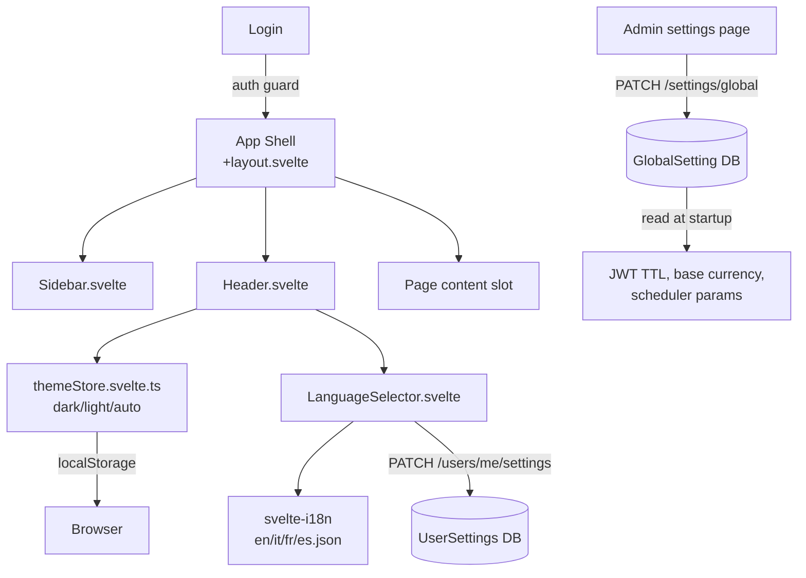

# Domain: LAYOUT & SETTINGS

> The foundational UX layer — the persistent shell, theming, language, and application configuration that frames every other domain.

## What it does

Every authenticated page in LibreFolio lives inside the same persistent shell: a collapsible sidebar listing the six main sections (Brokers, FX, Assets, Transactions, Files, Settings), a top header with the theme toggle and language selector, and a footer with the live price ticker. The shell is the first thing a user sees after logging in and the last thing they see before logging out. It enforces authentication: unauthenticated users are silently redirected to the login page before any page content loads.

Language and theme are user-level preferences, persisted both in the backend (`UserSettings`) and in `localStorage` for immediate startup without a round trip. The system supports four languages (EN, IT, FR, ES) with 840+ keys per language, all managed via the `dev.py i18n` CLI. Theme choices are dark, light, or auto (follows OS preference), implemented with Svelte 5 runes in `themeStore.svelte.ts`.

Global settings are a distinct concept from user settings: they are admin-managed, stored in a key-value table (`GlobalSetting`), and govern application-wide behaviour — session TTL, portfolio base currency, scheduler parameters, and future feature flags. Non-admin users can read the subset of global settings that affect their experience (e.g. base currency) but cannot modify them.

## Feature cluster

| Code | Feature | Layer | Role in domain | Status |
|------|---------|-------|----------------|--------|
| [[F-004]] | App Shell & Navigation (sidebar, header) | frontend | core — persistent container for all pages | implemented |
| [[F-005]] | User Settings (language, theme) | fullstack | core — per-user preferences persisted | implemented |
| [[F-006]] | Global Settings (admin-managed app config) | fullstack | core — app-wide config: base currency, session TTL, scheduler | implemented |
| [[F-007]] | Theme System (dark/light/auto) | frontend | support — CSS variables, Svelte 5 runes, localStorage | implemented |
| [[F-008]] | i18n System (EN/IT/FR/ES, 840+ keys) | frontend | core — all UI strings translated, 4 languages | implemented |

## Architecture at a glance

## Key decisions that shaped this domain

- [[decisions/i18n-key-rationalization]] — intentional key duplication between namespaces is accepted when it improves clarity; the audit tool flags duplicates but does not enforce deduplication.
- [[decisions/sveltekit-over-react]] — the SvelteKit v4 rewrite (Phase 0) established this shell architecture; earlier versions used React + MUI, which had heavier theming complexity.
- Svelte 5 runes in `themeStore.svelte.ts` — the theme store is one of the first files migrated to `$state`/`$derived`; this decision established the `*.svelte.ts` pattern for all new rune-based stores.

## Known problems / limitations

- [[problems/flag-emoji-windows]] — flag emoji in the language selector are blank on Windows unless the `Noto Color Emoji` font is loaded; resolved by explicit font loading in `app.css`.
- [[problems/liveticker-header-crash]] — LiveTicker in `Header.svelte` caused a crash on navigation in early versions; resolved by lifecycle guard.

## What comes next

- [[F-092]] Default Language/Currency for New Users — admin sets a system default that pre-fills new user preferences; small addition to the Global Settings page.
- No major structural changes planned — this domain is intentionally stable as the foundation for all other domains.

## Source files

| Role | Path |
|------|------|
| Primary mkdocs | `mkdocs_src/docs/developer/frontend/styling.md` |
| i18n mkdocs | `mkdocs_src/docs/developer/frontend/i18n.md` |
| Settings mkdocs | `mkdocs_src/docs/developer/architecture/settings.md` |
| App layout | `frontend/src/routes/(app)/+layout.svelte` |
| Header | `frontend/src/lib/components/layout/Header.svelte` |
| Sidebar | `frontend/src/lib/components/layout/Sidebar.svelte` |
| Theme store | `frontend/src/lib/stores/themeStore.svelte.ts` |
| Language store | `frontend/src/lib/stores/language.ts` |
| i18n translations | `frontend/src/lib/i18n/{en,it,fr,es}.json` |
| Global settings API | `backend/app/api/v1/settings.py` |
| Global settings service | `backend/app/services/global_settings_service.py` |
