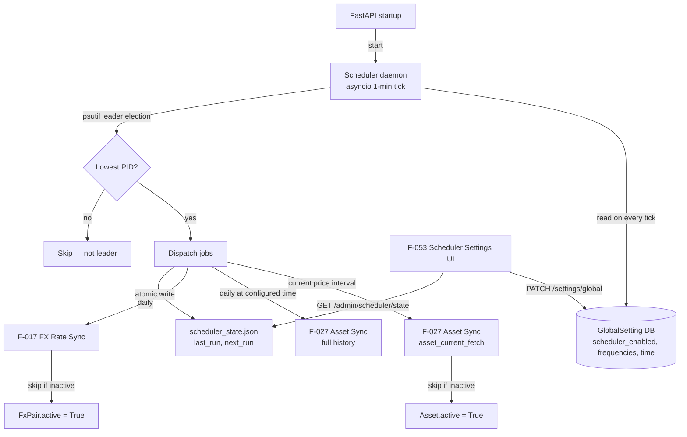

# Domain: SCHEDULER

> ⚠️ This domain is under active development (Phase 7). Content reflects design intent, not final implementation.

> Automated market data maintenance — keeps asset prices and FX rates current in the background so users never have to manually trigger syncs.

## What it does

LibreFolio's manual sync model (user clicks "Sync" on an asset or FX pair) is sufficient during initial setup but impractical for a live portfolio. The Scheduler domain adds a background daemon that automatically keeps data current: a configurable interval for current-price refresh (default 10 minutes, suitable for near-real-time monitoring) and a once-daily history sync at a configurable time (default 23:00 server time, suitable for end-of-day close prices).

The scheduler is embedded in the FastAPI process rather than being a separate service. It uses the asyncio native event loop — a 1-minute tick that checks the current time and configured schedules, then dispatches to the existing asset sync and FX sync service methods. Settings are read from `GlobalSetting` on every tick, meaning an admin can change the sync frequency or disable the scheduler without restarting the application.

Multi-worker deployment (multiple uvicorn workers) requires leader election to avoid duplicate syncs. The design uses `psutil` to enumerate running workers, elects the lowest-PID process as leader, and re-evaluates leadership on every tick. This is self-healing: if the leader process dies, the next tick's election promotes a new leader. No locks, no Redis, no external coordination.

The admin can configure and monitor the scheduler via the Scheduler Settings UI (F-053): toggle enabled/disabled, set frequencies, see the last-run time and next scheduled run for each job type. The scheduler state is written atomically to `scheduler_state.json` (write-then-rename) and survives application restarts.

## Feature cluster

| Code | Feature | Layer | Role in domain | Status |
|------|---------|-------|----------------|--------|
| [[F-052]] | Market Data Scheduler (asyncio daemon) | backend | core — background tick dispatcher, leader election | planned |
| [[F-053]] | Scheduler Settings UI (admin-managed cron config) | frontend | display — admin panel to configure and monitor scheduler | planned |

## Architecture at a glance

## Key decisions that shaped this domain

- **APScheduler rejected** — the design evaluated APScheduler but rejected it due to overhead for just two job types and the complexity of `reschedule_job()` when settings change dynamically. A simple asyncio tick with DB-read on every cycle is sufficient and more transparent.
- **Embedded in FastAPI process** — running the scheduler as a separate service (cron job, Celery worker) would require inter-process communication for settings. Embedding in the FastAPI process means settings changes take effect on the next tick without any infrastructure.
- **psutil leader election** — the lowest-PID heuristic is deterministic, self-healing, and requires no shared state beyond the process list. It is correct for the single-host Docker deployment model.

## Known problems / limitations

No open problems — this domain is not yet implemented. The design is fully specified and waiting for Phase 8 capacity.

## What comes next

This entire domain is Phase 8. The implementation order will be:
1. F-052: scheduler daemon + leader election + state file
2. Backend endpoint `GET /api/v1/admin/scheduler/state`
3. F-053: Scheduler Settings UI in the admin settings page

Once the scheduler is running, [[F-091]] Multi-Worker Cache Server (planned idea) will be re-evaluated: the current in-process cache works for single-instance deployments, but a shared cache (Redis) may be needed if multiple hosts are added.

## Source files

| Role | Path |
|------|------|
| Global settings API (scheduler config) | `backend/app/api/v1/settings.py` |
| Global settings service | `backend/app/services/global_settings_service.py` |
| Asset sync service (called by scheduler) | `backend/app/services/asset_source.py` |
| FX sync service (called by scheduler) | `backend/app/services/fx.py` |
| Scheduler module (planned) | `backend/app/scheduler.py` (not yet created) |
| Settings page (admin) | `frontend/src/routes/(app)/settings/+page.svelte` |
