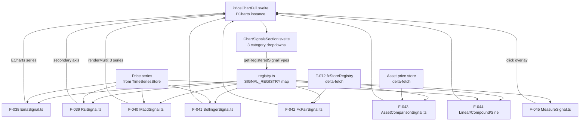

# Domain: TECHNICAL ANALYSIS (Signals)

> An extensible, purely client-side library of technical indicators, comparisons, and benchmarks that overlays any price chart — the same system powers both FX and Asset detail pages.

## What it does

When a user opens an FX pair or asset detail page, the price chart is not just a line — it is a canvas for analysis. The Signal Library provides a suite of computational overlays: technical indicators (EMA, RSI, MACD, Bollinger Bands), data comparisons (overlay another FX pair or another asset on the same chart), benchmark references (linear growth, compound growth, sine wave), and a measurement tool (click two points on the chart, read the absolute and percentage change and the number of days between them).

All signals are purely client-side: they receive the same price series already loaded for the chart and compute their output without any additional API calls (except comparison signals, which load the comparison target's price data from the backend's time-series endpoint, using the same `TimeSeriesStore` delta-fetching mechanism as the chart itself). This means signals add zero server load: the computation cost is O(N) per signal per render, paid entirely by the browser.

The framework is designed for extensibility. Every signal is a class that extends `ChartSignal`, declares its parameters via `paramDescriptors` (static field), and registers itself in a single registry file. The `ChartSettingsModal` and `ChartSignalsSection` components auto-discover all registered signals via `getRegisteredSignalTypes()` — there is no other place to update. Adding a new signal is a one-file operation plus one registry entry.

## Feature cluster

| Code | Feature | Layer | Role in domain | Status |
|------|---------|-------|----------------|--------|
| [[F-037]] | Signal Library Framework (abstract base + registry) | frontend | core — extensible base class + auto-discovery registry | implemented |
| [[F-038]] | EMA Signal | frontend | core — Exponential Moving Average (IIR 1st order) | implemented |
| [[F-039]] | RSI Signal | frontend | core — Relative Strength Index oscillator (secondary axis) | implemented |
| [[F-040]] | MACD Signal | frontend | core — composite signal (MACD + signal line + histogram) | implemented |
| [[F-041]] | Bollinger Bands Signal | frontend | core — confidence band around moving average | implemented |
| [[F-042]] | FX Pair Comparison Signal | frontend | support — overlay another FX pair's normalized rate | implemented |
| [[F-043]] | Asset Comparison Signal | frontend | support — overlay another asset's normalized price | implemented |
| [[F-044]] | Benchmark Signals (Linear, Compound, Sine) | frontend | support — reference growth curves (test/analysis) | implemented |
| [[F-045]] | Measure Tool (2-click Δabs, Δ%, days) | frontend | support — interactive measurement overlay | implemented |

## Architecture at a glance

## Key decisions that shaped this domain

- [[decisions/signal-label-unification]] — `signalLabel.ts` utility and an enriched `RenderedSignal` type were introduced to unify how signal labels are displayed across the chart legend, settings panel, and measurement tooltip. Before this, each component had its own labelling logic leading to inconsistencies.
- All signals compute in **O(N) iteratively** — no full-array passes, no recalculation on every frame. This is an explicit design constraint in the `ChartSignal` abstract base class that new signals must honour.
- `paramDescriptors` / `dynamicOptionsKey` — parameters that need runtime-resolved options (e.g. the list of configured FX pairs for the FX Pair Comparison signal) use `dynamicOptionsKey` to trigger a backend fetch at signal instantiation rather than at registration time.

## Known problems / limitations

- [[problems/tanstack-svelte5-incompatibility]] — indirectly affects this domain: the DataTable used on the signals settings page relies on a Svelte 5 workaround for TanStack Table v8; when TanStack v9 ships a Svelte 5 adapter ([[F-075]]), this workaround can be removed.

## What comes next

- [[F-080]] Candlestick Chart / Volume Bars — adding OHLCV candlestick rendering to the chart, which would provide context for many technical signals.
- [[F-087]] Smooth Signal Line Style — option to render EMA and other line signals with bezier smoothing rather than sharp point-to-point lines.
- [[F-088]] Return-over-N Chart — a new chart mode showing return percentage relative to a chosen base date rather than absolute price.
- Any new signal (e.g. Stochastic RSI, ATR) requires only one new file + one registry entry — the framework cost of a new signal is minimal.

## Source files

| Role | Path |
|------|------|
| Abstract base class | `frontend/src/lib/charts/signals/ChartSignal.ts` |
| Signal registry | `frontend/src/lib/charts/signals/registry.ts` |
| EMA | `frontend/src/lib/charts/signals/EmaSignal.ts` |
| RSI | `frontend/src/lib/charts/signals/RsiSignal.ts` |
| MACD | `frontend/src/lib/charts/signals/MacdSignal.ts` |
| Bollinger | `frontend/src/lib/charts/signals/BollingerSignal.ts` |
| FX Pair Comparison | `frontend/src/lib/charts/signals/FxPairSignal.ts` |
| Asset Comparison | `frontend/src/lib/charts/signals/AssetComparisonSignal.ts` |
| Benchmarks | `frontend/src/lib/charts/signals/LinearSignal.ts`, `CompoundSignal.ts`, `SineSignal.ts` |
| Measure Tool | `frontend/src/lib/charts/signals/MeasureSignal.ts` |
| Signals section UI | `frontend/src/lib/components/charts/ChartSignalsSection.svelte` |
| Chart settings modal | `frontend/src/lib/components/charts/ChartSettingsModal.svelte` |
| Signal label utility | `frontend/src/lib/charts/signals/signalLabel.ts` |
