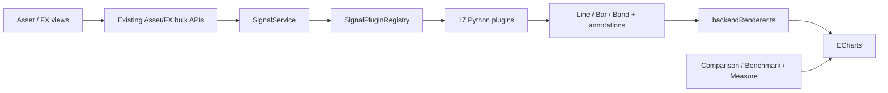

# Domain: TECHNICAL ANALYSIS (Signals)

> A shared backend plugin system for technical indicators, with a generic schema-driven frontend renderer. Comparisons, synthetic benchmarks, and Measure intentionally remain local.

## What it does

When a user opens an FX pair or Asset chart, the Signal Library provides technical indicators, comparison overlays, synthetic benchmarks, and two-point measurement. The technical catalog now contains 17 Asset-compatible plugins and 9 close-only FX-compatible plugins, including EMA, RSI, MACD, Bollinger, SMA, ROC, StochRSI, KAMA, PPO, ATR, ADX, NATR, Aroon, Donchian, CCI, OBV, and MFI.

Technical calculations run in `SignalService` through pure auto-discovered Python plugins. Asset and FX adapters load/convert data, extend warm-up once, and return canonical line/bar/band series plus status, availability, warnings, and annotations. List pages issue exactly one bulk POST for every asset/pair needing prices/rates and/or signals; computed results are page-local and never persisted.

The frontend consumes backend catalog JSON Schema to build controls and uses one signal-code-agnostic renderer for composites, dynamic axes, reference levels, value regions, and percentage transforms. FX Pair Comparison, Asset Comparison, Linear/Compound/Sine, and Measure still use `ChartSignal` locally. The previous TypeScript technical classes remain only as Gate E rollback until visual parity is approved.

## Feature cluster

| Code | Feature | Layer | Role in domain | Status |
|------|---------|-------|----------------|--------|
| [[F-037]] | Signal Library Framework (abstract base + registry) | backend + frontend | core — Python plugin registry/service + schema-driven frontend | in-progress |
| [[F-038]] | EMA Signal | backend | core — canonical price-axis line | implemented |
| [[F-039]] | RSI Signal | backend | core — bounded oscillator + levels/regions | implemented |
| [[F-040]] | MACD Signal | backend | core — flat 2-line + histogram composite | implemented |
| [[F-041]] | Bollinger Bands Signal | backend | core — canonical confidence band | implemented |
| [[F-042]] | FX Pair Comparison Signal | frontend | support — overlay another FX pair's normalized rate | implemented |
| [[F-043]] | Asset Comparison Signal | frontend | support — overlay another asset's normalized price | implemented |
| [[F-044]] | Benchmark Signals (Linear, Compound, Sine) | frontend | support — reference growth curves (test/analysis) | implemented |
| [[F-045]] | Measure Tool (2-click Δabs, Δ%, days) | frontend | support — interactive measurement overlay | implemented |

## Architecture at a glance

```mermaid
graph LR
    UI[Asset / FX views] --> Bulk[Existing Asset/FX bulk APIs]
    Bulk --> Service[SignalService]
    Service --> Registry[SignalPluginRegistry]
    Registry --> Plugins[17 Python plugins]
    Plugins --> Canonical[Line / Bar / Band + annotations]
    Canonical --> Renderer[backendRenderer.ts]
    Renderer --> Chart[ECharts]
    Local[Comparison / Benchmark / Measure] --> Chart
```

## Key decisions that shaped this domain

- [[decisions/signal-backend-plugin-architecture]] — technical math is centralized in pure Python plugins and reused by Asset, FX, AI Export, and future consumers.
- [[decisions/signal-label-unification]] — `signalLabel.ts` and enriched `RenderedSignal` metadata keep labels/tooltips consistent.
- Backend plugins own parameters, warm-up, library calls, and normalization; adapters own data retrieval and domain conversion.
- Technical controls come from catalog JSON Schema; local `dynamicOptionsKey` remains only for comparison signals.
- `ok|partial|unavailable|failed` is per instance; one bad plugin never erases prices/rates or sibling signals.
- [[problems/openapi-zod-discriminator-type-erasure]] — generated discriminated unions require the targeted codegen post-process.

## Known problems / limitations

- Gate E automated validation is complete, but manual chart review is still required before deleting the TypeScript technical fallback.
- AI Export still uses its old TypeScript technical calculations until F1.

## What comes next

- Complete Gate E visual review across Asset/FX detail and list cards.
- Migrate AI Export to observed-only backend signals and backend annotations.
- Remove the obsolete TypeScript EMA/RSI/MACD/Bollinger engine after parity approval.
- New technical signals normally require one Python plugin plus i18n/docs metadata.

## Source files

| Role | Path |
|------|------|
| Canonical contracts | `backend/app/schemas/signals.py` |
| Signal service | `backend/app/services/signal_service.py` |
| Plugin registry | `backend/app/services/provider_registry.py` |
| Production plugins | `backend/app/services/signal_plugins/` |
| Catalog + schema mapper | `frontend/src/lib/charts/signals/catalogMapper.ts`, `schemaMapper.ts` |
| Canonical renderer | `frontend/src/lib/charts/signals/backendRenderer.ts` |
| Request/result mapping | `frontend/src/lib/charts/signals/requestBuilder.ts`, `resultMapper.ts` |
| Catalog store | `frontend/src/lib/stores/signalCatalogStore.svelte.ts` |
| FX Pair Comparison | `frontend/src/lib/charts/signals/FxPairSignal.ts` |
| Asset Comparison | `frontend/src/lib/charts/signals/AssetComparisonSignal.ts` |
| Benchmarks | `frontend/src/lib/charts/signals/LinearSignal.ts`, `CompoundSignal.ts`, `SineSignal.ts` |
| Measure Tool | `frontend/src/lib/charts/signals/MeasureSignal.ts` |
| Signals section UI | `frontend/src/lib/components/charts/ChartSignalsSection.svelte` |
| Chart settings modal | `frontend/src/lib/components/charts/ChartSettingsModal.svelte` |
| Signal label utility | `frontend/src/lib/charts/signalLabel.ts` |
| Phase 0 execution plan | `LibreFolio_developer_journal/Release_2/phases/01_signalMigration/plan-phase00SignalsBackendMigrationImplementation.prompt.md` |
