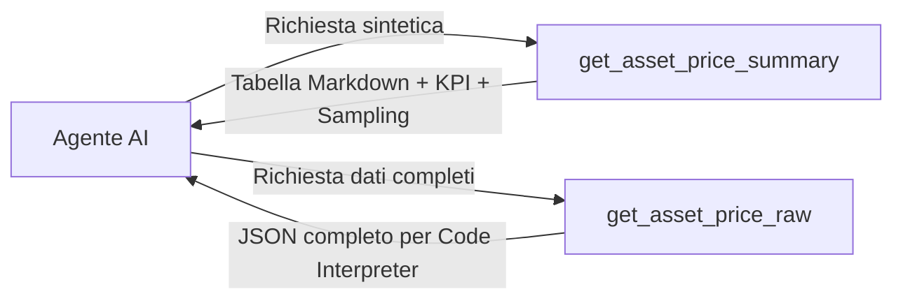

# Specifiche Architetturali: Server MCP LibreFolio (Fase 1)

Questo documento definisce l'architettura completa, la struttura dei tool, le convenzioni di inserimento, il codice di esempio, la testabilità e la strategia di unificazione tra API REST e Server MCP per LibreFolio.

---

## 1. Architettura di Sistema & Service Layer Unificato (Thin Controller Pattern)

Per garantire che le API REST (FastAPI) e il Server MCP (FastMCP) evolvano in perfetto parallelo senza alcuna duplicazione di codice o difformità nei calcoli, entrambi gli strati fungono da **interfacce sottili (thin controllers)** sopra un unico **Service Layer condiviso**.

```mermaid
graph TD
    subgraph Clients Esterni
        WebUI[Frontend SvelteKit]
        RESTClient[Client REST Terzi]
        AIClients[Cursor / Antigravity / Hermes Agent]
    end

    subgraph API Controller Layer (Sottile)
        REST[FastAPI Routers - /api/v1/...]
        MCP[FastMCP Tools - /mcp/sse o stdio]
    end

    subgraph Core Service Layer (LibreFolio Business Logic)
        PortSvc[PortfolioService - NAV & Allocation]
        TxSvc[TransactionService - Validate & Commit]
        SigSvc[SignalService - Indicatori & Warm-up]
        AssetSvc[AssetSourceManager - Prices & Providers]
    end

    subgraph Database & Persistence
        DB[(Database SQLite - Models & FIFO Engine)]
    end

    WebUI -->|HTTP / JSON| REST
    RESTClient -->|HTTP / JSON| REST
    AIClients -->|MCP Protocol| MCP

    REST --> PortSvc
    REST --> TxSvc
    REST --> SigSvc
    REST --> AssetSvc

    MCP --> PortSvc
    MCP --> TxSvc
    MCP --> SigSvc
    MCP --> AssetSvc

    PortSvc --> DB
    TxSvc --> DB
    SigSvc --> DB
    AssetSvc --> DB
```

### Regola dell'Evoluzione Congiunta
* Quando una regola di business cambia (es. una nuova validazione sulle transazioni o un nuovo indicatore tecnico in `SignalService`), la modifica avviene **esclusivamente nel Service Layer**.
* Sia l'endpoint REST `/api/v1/transactions` sia il tool MCP `add_transaction` beneficiano immediatamente della modifica senza dover riscrivere codice.

---

## 2. Modalità di Trasporto Esposte

Il server MCP risiede direttamente all'interno del backend Python di LibreFolio e offre due modalità di connessione:

1. **Stdio Transport (CLI):** Per collegamenti diretti via terminale (`python dev.py mcp-start`), ideale per Cursor, Antigravity, o script locali a latenza zero.
2. **SSE Transport (FastAPI Route):** Montato direttamente sull'app FastAPI in `/api/v1/mcp/sse`, consentendo connessioni di rete per client remoti o per l'assistente integrato futuro.

---

## 3. Inserimenti Guidati: Tagging & Raggruppamento per Batch/Conversione

Per consentire all'utente di identificare, filtrare e modificare facilmente nella UI qualsiasi operazione creata dall'AI:

1. **Identificatore di Batch / Conversione (`conversation_id` / `batch_id`):**
   * L'agente AI può passare un parametro facoltativo `conversation_id` o `batch_id` durante l'invocazione del tool.
   * Se l'agente inserisce $N$ transazioni in una singola sessione/richiesta, tutte le transazioni condivideranno lo stesso codice identificativo di gruppo (es. `TX-MCP-BATCH-0042`).
2. **Tag e Codice Incrementale:**
   * Ogni transazione inserita riceverà la nota/tag formatata: `[MCP | Batch: TX-MCP-BATCH-0042]`.
   * Verrà generato un codice leggibile per l'utente (es. `TX-MCP-00104`) visibile nella tabella transazioni.
   * Nella UI di LibreFolio sarà possibile filtrare le transazioni cercando il codice del batch, mostrando esattamente tutte le transazioni generate da quell'interazione dell'AI.
3. **Pipeline a due fasi (`Validate` $\rightarrow$ `Commit`):**
   * L'agente eseguirà sempre prima la validazione. In caso di esito positivo, procederà al commit restituendo all'utente il codice di batch per eventuale revisione manuale.

---

## 4. Come l'AI interagisce con il Server MCP & Strategia Duale (Summary vs Raw)

### A. Come l'AI invia le richieste
L'LLM **non inventa chiamate HTTP a basso livello**, ma utilizza lo standard **Tool Calling (Function Calling)**:
1. All'avvio della connessione, FastMCP invia all'LLM un catalogo JSON Schema di tutti i tool disponibili (con nomi, descrizioni dettagliate ed estatti tipi di parametri).
2. Quando l'utente chiede qualcosa in linguaggio naturale (es. *"Inserisci un acquisto di 10 azioni Apple"*), l'LLM seleziona il tool appropriato (es. `add_transaction`) e genera un oggetto **JSON strutturato** conforme allo schema del tool.

### B. Come l'AI consuma le risposte (Strategia Duale: Summary vs Raw)
Quando il tool termina, FastMCP restituisce il risultato direttamente nel contesto del modello. Se la risposta contiene migliaia di dati grezzi (es. 5 anni di prezzi giornalieri = oltre 1.200 righe JSON), questo rischia di saturare la finestra di contesto dell'LLM o rallentare il reasoning.

Per questo motivo, per i dati ad alto volume (prezzi e cronologia transazioni), implementeremo **due varianti di Tool**:



1. **Variante `Summary` (Pre-elaborata & Campionata):**
   * Formatta i dati in testo/Markdown pulito (stile AI Export attuale), includendo solo i KPI principali (min, max, media, variazione %, sampling mensile/settimanale).
   * Ideale per quando l'agente deve rispondere a domande di testo o mostrare un riepilogo rapido all'utente.
2. **Variante `Raw` (Dati Grezzi Completi):**
   * Restituisce l'array JSON completo e non filtrato.
   * Ideale per quando l'agente deve passare i dati a uno script Python (Code Interpreter) per eseguire simulazioni complesse o calcoli personalizzati.

---

## 5. Catalogo Completo dei Tool MCP (Fase 1)

### A. Dominio Portafoglio & Analisi (`Portfolio`)
* `get_portfolio_report` (Summary): NAV, gain/loss, DW-ROI, asset allocation per valuta/categoria/broker.
* `get_fifo_lots_analysis` (Raw/Summary): Dettaglio lotti FIFO aperti, prezzi di carico, WAC e minusvalenze latenti.

### B. Dominio Segnali & Mercato (`FA Prices` / `SignalService`)
* `get_asset_price_summary`: Serie storica campionata con KPI e tabella sintetizzata.
* `get_asset_price_raw`: Array completo dei prezzi storici in JSON.
* `get_technical_indicators`: EMA, RSI, MACD, Bollinger calcolati dal backend con finestra di warm-up inclusa.
* `get_asset_risk_metrics`: Volatilità annualizzata, Sharpe Ratio, Max Drawdown e CAGR.

### C. Dominio Provisioning & Asset (`FA Providers` / `FA CRUD`)
* `list_assets`: Elenco asset registrati.
* `search_external_market_data`: Cerca simboli su Yahoo/provider esterni prima dell'inserimento.
* `add_asset`: Registrazione nuovo asset con configurazione del provider.

### D. Dominio Operatività (`TX Transactions`)
* `list_transactions_summary` / `list_transactions_raw`: Consultazione cronologia transazioni.
* `validate_transaction`: Pre-verifica della transazione prima dell'inserimento.
* `add_transaction`: Inserimento definitivo con applicazione tag `[MCP]` e generazione codice `TX-MCP-BATCH-XXXX`.

### E. Dominio Estratti Conto (`BR Import Engine`)
* `parse_broker_file`: Analizza un file di estratto conto (PDF/CSV) caricato dall'utente.
* `get_import_asset_candidates`: Propone la riconciliazione tra i titoli nel file ed i titoli a sistema.

### F. Dominio Forex & Broker (`FX` / `Brokers`)
* `list_brokers` / `add_broker`: Gestione intermediari.
* `convert_currency` / `configure_fx_route`: Gestione tassi e catene di cambio forex.

---

## 6. Esempio Pratico di Implementazione in Python (FastMCP)

Ecco come apparirà la struttura del codice all'interno di `backend/app/api/v1/mcp_server.py`:

```python
"""LibreFolio FastMCP Server Definition."""

from fastmcp import FastMCP
from backend.app.db.session import async_session_factory
from backend.app.services.portfolio_service import PortfolioService
from backend.app.services.signal_service import SignalService
from backend.app.services.transaction_service import TransactionService
from backend.app.schemas.portfolio import PortfolioReportQuery

# Inizializzazione del Server MCP
mcp = FastMCP(
    name="LibreFolio Financial MCP",
    instructions=(
        "Server MCP ufficiale di LibreFolio. Consente di consultare portafogli, "
        "transazioni, calcolare indicatori tecnici ed inserire operatività nel rispetto "
        "della business logic e con tracciamento batch."
    )
)

# Tool: Report di Portafoglio (Summary)
@mcp.tool()
async def get_portfolio_report(
    target_currency: str = "EUR",
    include_allocation: bool = True,
    include_history: bool = False
) -> dict:
    """Restituisce un report dettagliato sul portafoglio dell'utente inclusi NAV, Gain/Loss e Asset Allocation."""
    async with async_session_factory() as session:
        service = PortfolioService(session)
        query = PortfolioReportQuery(
            target_currency=target_currency,
            include_allocation=include_allocation,
            include_history=include_history
        )
        report = await service.get_report(user_id=1, query=query)
        return report.model_dump()

# Tool: Indicatori Tecnici con Warm-up (Fase 0)
@mcp.tool()
async def get_technical_indicators(
    asset_id: int,
    date_from: str,
    date_to: str,
    indicators_json: list[dict]
) -> dict:
    """Calcola indicatori tecnici (EMA, RSI, MACD, Bollinger) per un asset con finestra di warm-up integrata."""
    async with async_session_factory() as session:
        signal_service = SignalService(session)
        return await signal_service.calculate_signals_with_warmup(
            asset_id=asset_id,
            date_from=date_from,
            date_to=date_to,
            indicators=indicators_json
        )

# Tool: Inserimento Transazione con Batch Tagging
@mcp.tool()
async def add_transaction(
    asset_id: int,
    broker_id: int,
    tx_type: str,
    date: str,
    quantity: float,
    price_per_unit: float,
    fee: float = 0.0,
    currency: str = "EUR",
    batch_id: str | None = None,
    notes: str = ""
) -> dict:
    """Inserisce una transazione applicando il tag [MCP] e il raggruppamento per batch/conversazione."""
    async with async_session_factory() as session:
        tx_service = TransactionService(session)
        
        # Generazione identificativo batch se non fornito
        effective_batch = batch_id or "TX-MCP-BATCH-AUTO"
        full_notes = f"[MCP | Batch: {effective_batch}] {notes}".strip()
        
        result = await tx_service.create_transaction(
            asset_id=asset_id,
            broker_id=broker_id,
            tx_type=tx_type,
            date=date,
            quantity=quantity,
            price_per_unit=price_per_unit,
            fee=fee,
            currency=currency,
            notes=full_notes
        )
        return {"success": True, "transaction_id": result.id, "batch_id": effective_batch}
```

---

## 7. MCP Prompts e Resources (Bonus Strategico)

Oltre ai **Tools** (funzioni da invocare), MCP permette di esportare:

1. **MCP Prompts (Ispirati al nostro Prompt Catalog):**
   Espongono all'LLM dei modelli di conversazione pre-strutturati direttamente nel client.
   * `prompt/rebalance_analysis`: Insegna all'agente come analizzare lo scostamento dell'asset allocation e proporre riallineamenti.
   * `prompt/monthly_summary`: Guida l'agente nella stesura di un bilancio mensile di rendimento.
2. **MCP Resources (URI read-only):**
   Risorse statiche o dinamiche che l'agente può allegare al suo contesto:
   * `resource://portfolio/summary`: Restituisce istantaneamente lo snapshot JSON del portafoglio senza dover fare chiamate tool a ripetizione.

---

## 8. Strategia di Testing & Testabilità (Pytest)

Il Server MCP basato su FastMCP è **completamente testabile tramite test automatizzati (Pytest)**.

### Come si testa un Server MCP?
1. **Unit Test dei Tool (Direct In-Memory Calling):**
   FastMCP permette di invocare direttamente le funzioni dei tool all'interno dei test senza avviare processi esterni o server di rete:
   ```python
   import pytest
   from backend.app.api.v1.mcp_server import mcp

   @pytest.mark.asyncio
   async def test_mcp_add_transaction(db_session):
       result = await mcp.call_tool("add_transaction", {
           "asset_id": 1,
           "broker_id": 1,
           "tx_type": "BUY",
           "date": "2026-07-20",
           "quantity": 10.0,
           "price_per_unit": 100.0,
           "batch_id": "TEST-BATCH-01"
       })
       assert result["success"] is True
       assert result["batch_id"] == "TEST-BATCH-01"
   ```
2. **Integration Test con FastMCP Client:**
   Possiamo simulare un vero client MCP collegato via trasporto `InMemoryTransport` per verificare l'intero ciclo JSON-RPC, la validazione degli schemi dei parametri e la gestione degli errori.
3. **Test di Parità (REST vs MCP):**
   Scriveremo test di parità per verificare che l'invocazione di una funzione tramite endpoint REST e tramite tool MCP dia esattamente lo stesso identico risultato contabile e le stesse eccezioni.

---

## 9. Documentazione ed Ispezione Interattiva (MCP Inspector)

Così come FastAPI genera automaticamente `/docs` (Swagger UI) e `/redoc` leggendo le definizioni OpenAPI, l'ecosistema MCP e FastMCP mettono a disposizione l'**MCP Inspector**.

### Come funziona l'MCP Inspector:
Avviando l'inspector (via CLI integrata o comando `npx @modelcontextprotocol/inspector`), si apre nel browser locale una **pagina web interattiva** che offre:

1. **Catalogo dei Tool (Stile Swagger/ReDoc):**
   Mostra l'elenco completo di tutti i Tool, Risorse e Prompt esposti da LibreFolio con le relative descrizioni in linguaggio naturale e gli schemi JSON dei parametri accettati.
2. **Form di Test Live:**
   Puoi inserire i parametri nei campi di testo dedicati ed **eseguire il tool direttamente dal browser con un click**, vedendo in tempo realtime la risposta del backend e il payload JSON-RPC scambiato.
3. **Visualizzatore del Protocollo:**
   Mostra i log di comunicazione e il flusso di messaggi a basso livello, utilissimo in fase di debug per verificare cosa vedrà l'LLM quando si collegherà a LibreFolio.
