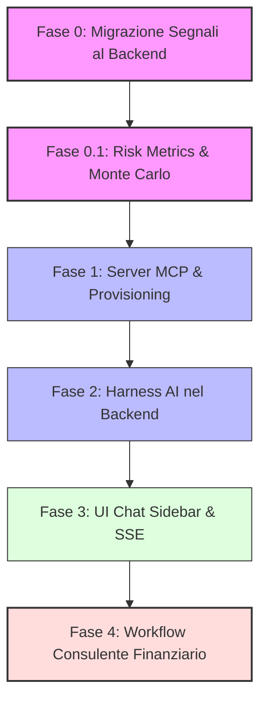

# Roadmap & Brainstorming: MCP & Spostamento dei Calcoli dei Segnali (Charts) - Final

Questo documento definisce la roadmap strategica definitiva per la **Release 2.0.0**, dettagliando tutte le fasi di sviluppo dall'unificazione dei segnali fino ai workflow di consulenza finanziaria.

---

## 1. Roadmap Strategica ad Alto Livello (Release 2.0.0)

La roadmap è organizzata in 6 fasi incrementali. Il diagramma mostra la sequenza temporale e le dipendenze dei componenti.

---

## 2. Dettaglio di Tutte le Fasi della Roadmap

> **Nota:** Per un livello di dettaglio maggiore sulle implementazioni architetturali (integrazione Riskfolio, UI Monte Carlo, Watchlist, Grafici) della Fase 0 e 0.1, consultare il documento dedicato: `phase_0_detailed_roadmap.md`.

### 🔴 Fase 0: Migrazione ed Unificazione dei Segnali al Backend
Spostamento del calcolo degli indicatori tecnici (EMA, RSI, MACD, Bollinger Bands) da TypeScript nel browser dell'utente al backend Python.

* **Risoluzione Warm-up (Segnali Scarichi):** Quando l'utente richiede un intervallo temporale (es. 1 anno), il backend interroga internamente il database per una finestra estesa (es. 1 anno + 100 giorni storici di warm-up). Il backend esegue i calcoli tecnici sull'array esteso e poi taglia (slice) l'array restituendo al frontend solo il periodo visivo richiesto, con i segnali totalmente valorizzati e stabili fin dal primo giorno visualizzato sul grafico.
* **Potenziamento del `POST /query`:** Invece di creare endpoint `GET`, estendiamo la chiamata esistente `POST /api/v1/assets/prices/query` consentendo al frontend di richiedere esplicitamente i parametri degli indicatori desiderati.
* **AI Export Migrato:** L'attuale funzionalità di esportazione dati per l'AI prenderà i dati pre-calcolati direttamente dal backend.
* **4° Sistema di Plugin:** Creazione di una classe base `SignalPlugin` per consentire agli sviluppatori di implementare nuovi indicatori in Python.

---

### 🔴 Fase 0.1: Monte Carlo & Risk Metrics Engine (Core & UI)
Implementazione dei tool matematici del rischio nel backend e relative dashboard visive, costruendo le fondamenta per le future analisi dell'agente.

* **Monte Carlo Engine:** Algoritmo in Python (NumPy/Pandas) che proietta 10.000 scenari stocastici di portafoglio basandosi su rendimento medio, inflazione e deviazione standard storica degli asset detenuti.
* **Advanced Risk Metrics Engine:** Sviluppo in backend del calcolo per metriche di rischio istituzionali:
  * **Value at Risk (VaR):** Stima della perdita massima attesa su vari orizzonti temporali.
  * **Max Drawdown Storico:** Calcolo del crollo massimo dal picco per valutare la tolleranza al rischio.
  * **Risk-Adjusted Returns:** Implementazione dello Sharpe Ratio e Sortino Ratio.
  * **Matrice di Correlazione:** Analisi della diversificazione reale del portafoglio (Beta e correlazioni interne).
  * **Stress Testing:** Simulazione dell'impatto di scenari storici avversi (es. Crisi Finanziaria 2008, COVID-19).
* **Risk Control Dashboard (UI):** Componente grafico in SvelteKit per visualizzare i risultati delle simulazioni (curve di ventaglio) e le metriche di rischio, integrato in LibreFolio indipendentemente dall'IA.

---

### 🔵 Fase 1: Server MCP LibreFolio (CLI & Provisioning)
Integrazione di `fastmcp` per esporre le funzionalità e i dati finanziari di LibreFolio ad agenti AI esterni.

* **Tool di Sola Lettura:** `get_portfolio_summary`, `list_assets`, `get_asset_history` (che include i segnali calcolati dal backend).
* **Tool di Scrittura & Provisioning:**
  * `add_transaction`: inserimento transazioni con validazione FIFO e lotti.
  * `add_asset`: creazione asset con associazione provider (es. yfinance) e parametri relativi.
  * `add_broker`: inserimento nuovo intermediario/broker.
  * `configure_fx_pair`: impostazione valute e tassi di conversione.
  * `run_monte_carlo`, `get_risk_metrics`, `run_stress_test`: esposizione dei motori di rischio sviluppati in Fase 0.1 all'agente AI.
* **Avvio CLI:** Integrazione in `dev.py` del comando `python dev.py mcp-start`.

---

### 🔵 Fase 2: Runtime Agente (Harness AI Backend)
Costruzione dell'Harness dell'agente finanziario che risiederà nel backend Python, ereditando le logiche chiave di **Hermes Agent**.

* **Memory Engine (SQLite):** Implementazione di una tabella di memoria persistente basata su SQLite FTS5 (Full-Text Search) per permettere all'agente di memorizzare, indicizzare ed interrogare lo storico delle conversazioni e le preferenze dell'utente.
* **Cron & Scheduler:** Modulo in background per consentire all'agente di eseguire operazioni pianificate in autonomia (es. verifica giornaliera degli alert di prezzo o controllo settimanale dell'asset allocation).
* **LLM Connector Engine:** Gestione dei parametri di configurazione dei modelli tramite variabili `.env`. L'Harness implementerà il connettore compatibile con API OpenAI/Claude, OpenRouter, Doubleword, ed Ollama locale.

---

### 🟢 Fase 3: UI Chat Sidebar & Integrazione SSE
Sviluppo dell'interfaccia utente finale per dialogare con l'agente all'interno della dashboard di LibreFolio.

* **Interfaccia Chat Sidebar:** Una chat reattiva e fluttuante in SvelteKit dotata di rendering in streaming dei messaggi.
* **SSE (Server-Sent Events):** Endpoint nel backend FastAPI che streamma i token generati dall'LLM al frontend.
* **Integrazione "AI Export" & Fallback:**
  * *Se l'LLM è configurato:* Il click su una voce del prompt catalog (es. "Analisi PAC" o "Rebalancing") apre automaticamente la chat sidebar integrata con il prompt inserito.
  * *Se l'LLM NON è configurato:* Il sistema mostra un alert di fallback e copia automaticamente il prompt strutturato e i dati finanziari nella clipboard dell'utente (comportamento attuale).
* **Scraping con Playwright:** Integrazione dello strumento di ricerca internet dell'agente basato su Playwright locale per scorrere articoli finanziari e catturare screenshot delle pagine esterne da inviare a modelli visivi.

---

### 🔴 Fase 4: Workflow Agentici (Il Consulente Finanziario)
Definizione di workflow agentici complessi (sub-agenti dedicati) coordinati dall'Harness centrale.

* **Rebalancing Agent:** Workflow che confronta l'allocazione attuale con il target desiderato, calcola la deviazione ed elabora un report con l'elenco esatto delle operazioni di acquisto e vendita necessarie.
* **Tax Loss Harvesting Agent:** Scorre i lotti fiscali aperti e calcola quali vendite strategiche in perdita possono compensare le plusvalenze maturate, suggerendo l'acquisto temporaneo di asset correlati per non perdere esposizione.
* **Monthly Audit Schedulato:** L'agente genera periodicamente e in autonomia un report dettagliato (Sharpe Ratio, Max Drawdown, volatilità, impatto forex) e lo rende disponibile come notifica nella chat sidebar dell'utente.

---

→ Piano Phase 0: [plan-phase00SignalsBackendMigration.prompt.md](../Phase_0/plan-phase00SignalsBackendMigration.prompt.md)
