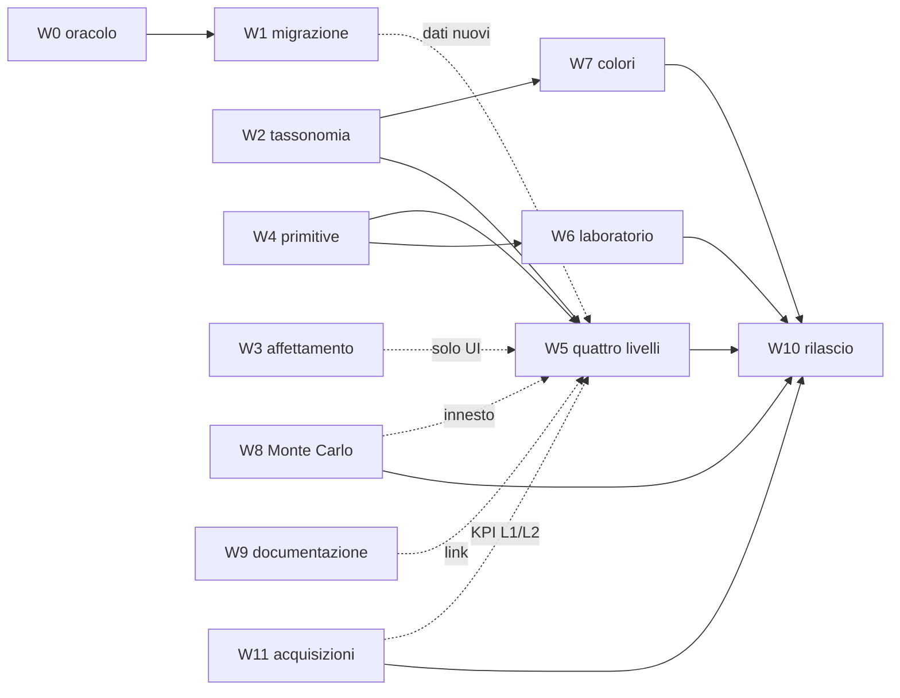

# 07 — Piano esecutivo

**Data**: 17 Settembre 2026
**Stato**: da approvare
**Presupposto**: i documenti da [`00`](./00-analisi-stato-attuale.md) a
[`06`](./06-matematica-librerie-e-reimplementazioni.md) sono chiusi, e le dodici
questioni di [`04`](./04-decisioni-e-questioni-aperte.md) §3 sono tutte risolte.

> **Questo documento non riassume gli altri.** Non ripete una decisione già scritta e
> non rimotiva una scelta già motivata: rimanda al punto esatto in cui vive. Quello che
> aggiunge — e che finora non esiste da nessuna parte — è **l'ordine**, le
> **dipendenze**, la **taglia**, i **cancelli** e gli **indirizzi**.
>
> Se leggendo una riga ci si chiede *«perché?»*, la risposta è nel link, non qui.

---

## 1. Il vincolo che viene dal fallimento precedente

La catena G6 è stata abbandonata (**D12**) per una ragione strutturale, non per
stanchezza: 23 work item in **catena singola** con cancelli umani bloccanti si fermano
tutti insieme al primo stop. Lo stato registrato in
[`00`](./00-analisi-stato-attuale.md) §3 — fermi al 7 di 23 — è la prova.

Da qui discende la regola di forma di questo piano, e non è negoziabile:

> ## 🔑 Nessuna catena. Flussi paralleli con poche dipendenze vere.
>
> Un flusso che si ferma **non deve** fermare gli altri. Ogni dipendenza va
> giustificata: se non è dimostrabile, non esiste.

Conseguenza pratica: sotto ci sono **dodici flussi**, di cui otto possono partire
subito e in parallelo. Le dipendenze reali sono **cinque**, elencate in §3 una per una
con il motivo.

---

## 2. I flussi

| # | Flusso | Natura | Fonte |
|---|---|---|---|
| **W0** | Oracolo di test su `metrics.py` | backend, solo test | [`06`](./06-matematica-librerie-e-reimplementazioni.md) §7.-1 M4 |
| **W1** | Migrazione matematica M2·M1·M3·M6·M5 | backend | [`06`](./06-matematica-librerie-e-reimplementazioni.md) §7.-1 |
| **W2** | Tassonomia e catalogo benchmark | DB + backend + frontend | [`04`](./04-decisioni-e-questioni-aperte.md) Q1, Q9, Q10, Q12 |
| **W3** | Affettamento del portafoglio per asset | backend + frontend | [`04`](./04-decisioni-e-questioni-aperte.md) D58, Q8 |
| **W4** | Promozione delle primitive e card del rischio | frontend | [`05`](./05-grammatica-visiva-e-rappresentazioni.md) §3, §4 |
| **W5** | I quattro livelli su Dashboard e Broker Detail | frontend | [`03`](./03-mappa-livelli-pagine.md) §2, [`05`](./05-grammatica-visiva-e-rappresentazioni.md) §9.1 |
| **W6** | Asset Global come laboratorio | frontend | [`05`](./05-grammatica-visiva-e-rappresentazioni.md) §8, §9.2 |
| **W7** | Gerarchia cromatica nei grafici di allocazione | frontend | [`04`](./04-decisioni-e-questioni-aperte.md) D71, D72 |
| **W8** | Rifondazione del Monte Carlo | backend + frontend | [`02`](./02-verdetti-per-strumento.md) § Monte Carlo |
| **W9** | Documentazione | mkdocs | [`04`](./04-decisioni-e-questioni-aperte.md) D55 |
| **W10** | Chiusura e rilascio | trasversale | [`04`](./04-decisioni-e-questioni-aperte.md) D46 |
| **W11** | Acquisizioni backend per L1 e L2 | backend | [`04`](./04-decisioni-e-questioni-aperte.md) D38, D45, D56 |

> ⚠️ **W11 è stato aggiunto dopo**, durante la verifica dei mandati, e va detto perché:
> **D38** (NEA e diversification ratio), **D45** (WR) e **D56** (la famiglia drawdown)
> erano decise e **assegnate a nessuno**. W1 le espelle come «acquisizioni, non
> migrazione»; W5 le assume già presenti nel payload. Verificato con `grep` su
> `backend/app`: `diversification` **zero occorrenze**, `worst_realization` **zero**,
> `herfindahl` solo dentro AI Export.
>
> **D39** (`Sharpe(rm=…)`) **resta in W1**: pretende la matrice dei rendimenti, cioè
> l'idraulica di M5.

### 2.1 Cosa non viene toccato

Va scritto perché è metà della taglia. Restano **invariati**:

- i **nove analytic** di `risk_plugins/` — nessuno cambia firma, scope o contratto.
  W3 è progettata apposta per non toccarli (**D57**, **D58**);
- i **17 plugin di analisi tecnica** (**D31**);
- i due `SpawnWorkerPool`, la cache, il catalogo scenari come meccanismo;
- il contratto matematico archiviato e il modello di qualità del dato
  ([`01`](./01-tesi-e-quattro-domande.md) §7);
- **Asset Detail** (**D8**, **D47**), che si riapre dopo W10.

---

## 3. Le dipendenze, una per una

Cinque. Nessun'altra.



| Dipendenza | Perché è vera |
|---|---|
| **W0 → W1** | Senza oracolo, M1/M3/M6 sono riscritture non verificate di formule mai confrontate con un riferimento esterno. Il CVaR dimostra cosa succede a possedere matematica non validata ([`06`](./06-matematica-librerie-e-reimplementazioni.md) §3.2) |
| **W2 → W7** | Le sfumature colorano i sottotipi. Senza sottotipi nell'enum non c'è nulla da sfumare |
| **W2 → W5** | L3 poggia sul benchmark persistente (**D13**), che è il catalogo di W2. Senza, L3 resta la domanda debole che era |
| **W4 → W5, W4 → W6** | Disegnare i livelli sopra le primitive attuali riprodurrebbe gli stessi difetti in disposizione diversa ([`05`](./05-grammatica-visiva-e-rappresentazioni.md) §3 gradino 3) |
| **W5, W6, W7, W8 → W10** | Si rilascia a catena completa (**D46**): il banner si toglie una volta sola |

Le frecce tratteggiate **non sono dipendenze**, sono innesti: W5 può essere costruita
con i dati di oggi e ricevere dopo la serie underwater e i bin dell'istogramma (W1), il
selettore di fetta (W3), il gradino simulazione (W8) e i link di documentazione (W9).
Chi costruisce W5 deve solo lasciare il posto, non aspettare.

> **Il caso più delicato è W1 → W5 e va detto chiaro.** Due delle sei rappresentazioni
> ([`05`](./05-grammatica-visiva-e-rappresentazioni.md) §7.1 e §7.2) hanno bisogno di
> campi che il backend oggi non spedisce. Non sono matematica nuova — la serie
> underwater è già in una variabile locale (**D14**, **D20**) e i bin sono
> `np.histogram` (**D21**) — ma sono **due campi di schema**, e vanno consegnati prima
> che il frontend li disegni. Sono l'unica parte di W1 che W5 aspetta davvero: tutto il
> resto di M1-M6 è invisibile alla UI.

---

## 4. L'ordine fra migrazione e UI — punto 1 di `04` §4

La domanda era: prima la migrazione invisibile o prima la UI che si vede?

**Risposta: nessuna delle due, e la domanda conteneva un presupposto falso.** Dava per
scontato che fossero in competizione per lo stesso momento. Non lo sono: W1 è backend e
W4-W5-W6 sono frontend, quindi **corrono in parallelo** e la scelta si riduce a due
soli punti di contatto.

L'ordine che conta è invece **dentro** W1, ed è vincolato:

```text
M4 ─► M2 ─► M1 ─► M3 ─► M6 ─► M5
 │     │     │
 │     │     └── priorità massima per frequenza: gira a ogni grafico
 │     └──────── unica che corregge un errore invece di spostare codice
 └────────────── rete sotto tutte le altre
```

Motivazione completa in [`06`](./06-matematica-librerie-e-reimplementazioni.md) §7.-1.
Qui si aggiunge solo la conseguenza di pianificazione: **M4 e M2 sono i due lavori che
non possono essere rimandati**, perché il primo protegge tutto e il secondo corregge un
numero sbagliato che gli utenti stanno già leggendo.

---

## 5. Dove vive l'oracolo M4 — punto 3 di `04` §4

Il punto chiedeva categoria, lane di runtime e registrazione nel catalogo. Verificato
sul codice, e la risposta ha una sorpresa che cambia la forma della consegna.

**Lo stato di fatto.** `test_risk_metrics.py` (297 righe) importa solo `math`: girato
da solo è istantaneo. È già elencato in `RISK_SERVICE_TEST_PATHS`
(`scripts/test_runner/_backend_services.py:69-81`) e raggiungibile con
`test services risk-all`, ma **non ha un selettore proprio**.

**La sorpresa, misurata.** Importare riskfolio costa, in un interprete freddo,
**4 722 ms**. Attribuito per strato:

| modulo | costo | note |
|---|---:|---|
| `numpy` | 37,8 ms | |
| `pandas` | 195,2 ms | |
| `scipy` | 6,0 ms | già tirato dentro |
| `sklearn` | 688,6 ms | riskfolio lo usa per Ledoit-Wolf e OAS |
| **`riskfolio`** | **1 404,9 ms** | sopra tutti i precedenti |

**Conseguenza sull'indirizzo.** L'oracolo **non va dentro `test_risk_metrics.py`**:
lo trasformerebbe da file istantaneo a file da svariati secondi, e quel file è la prima
cosa che si lancia quando si tocca una formula. Va in un file suo:

| Cosa | Valore |
|---|---|
| File | `backend/test_scripts/test_services/test_risk_metrics_oracle.py` |
| Categoria | `services` |
| Selettore nuovo | `risk-oracle`, via `add_test(cat, "risk-oracle", …)` in `_backend_services.py` |
| Aggiunta a | `RISK_SERVICE_TEST_PATHS`, così `risk-all` lo comprende |
| Costo già pagato | `test_risk_optimization.py` importa già riskfolio ed è nello stesso gruppo: `risk-all` non peggiora |
| Lane | **porte dalla 6240 in su** (vedi §5.1), mai `6040`, mai `6041`, mai la banda `6150+` |

Comando, con il venv condiviso:

```bash
PIPENV_CUSTOM_VENV_NAME=LibreFolio-SAUMUTtc \
  pipenv run python dev.py test --test-port 6240 --data-dir backend/data/test-risk-a \
  services risk-oracle
```

### 5.1 La banda di porte di questa ripianificazione — 6240 e oltre

Vincolo operativo, non architetturale, e va scritto perché due lane che si pestano
producono fallimenti che sembrano bug del prodotto.

| Banda | Chi | Stato |
|---|---|---|
| `6040` | backend di produzione | 🚫 mai |
| `6041` | test di default | 🚫 mai in un worktree coordinato |
| `6042` | `mkdocs serve` | 🚫 fuori dal modello di lane |
| **`6150`-`6199`** | **l'altro worktree attivo** | 🚫 **occupata** |
| **`6240`-`6250`** | **questa ripianificazione** | ✅ assegnata |

Dentro la banda: `6240`-`6249` agli undici mandati, **`6250` al coordinatore**, che la
usa solo per i gate trasversali e la revisione combinata, mai per la suite di un
figlio. Il mandato **I** non ha lane: non avvia server.

Regola di lane: **una porta e una data directory per flusso**, mai condivise, mai
riusate. L'assegnazione nominale per flusso sta in
[`implementation/README.md`](./implementation/README.md).

`configure_test_runtime` (`scripts/cli_base.py:219`) rifiuta già una porta di test
uguale a quella di produzione, e `validate_test_data_dir` (`backend/app/config.py:228`)
rifiuta una data directory che si sovrapponga a quella di produzione. Nessuna delle due
guardie sa però che `6150` è di qualcun altro: **quella distanza la teniamo noi**.

**Cosa deve contenere.** Non «dei test»: la **guardia di D40**, cioè la regola
trasversale di [`06`](./06-matematica-librerie-e-reimplementazioni.md) §7.-1 resa
eseguibile. Ogni coppia nostra/libreria del caso A va confrontata numericamente, e le
quattro trappole già trovate — `MDD_Abs`, `numBins`, Sortino, `Kurtosis` — vanno
codificate come **test che falliscono se qualcuno le scambia**, non come commenti.

---

## 6. La voce di CHANGELOG — punto 4 di `04` §4

M2 cambia un numero **già mostrato agli utenti** ([`06`](./06-matematica-librerie-e-reimplementazioni.md)
§3.2). Non è un refactor interno, quindi ha diritto a una voce.

**Dove**: capitolo `## [Unreleased]` di `CHANGELOG.md`, che oggi esiste e dichiara
*«Preparing v1.1.1»*. Sezione `### 🔄 Changed`, che in quel capitolo **non c'è ancora**
e va creata — ci sono solo `### ✨ Added` e `### 🐛 Fixed`.

**Cosa deve dire**, secondo le regole già fissate per il changelog: utente-visibile,
niente interni. Tre fatti e nessuna scusa —

1. il CVaR mostrato cambia leggermente;
2. cambia perché la stima precedente era **sistematicamente più bassa** del valore
   corretto, non perché si sia cambiata convenzione;
3. l'entità: circa lo 0,27% in valore relativo della misura.

Va scritta **una volta sola a fine catena** (**D46**), insieme al resto. Non prima:
finché il worktree non si riversa, il capitolo Unreleased descriverebbe qualcosa che
nessuno può usare.

---

## 7. La taglia — punto 2 di `04` §4

Il punto diceva: *«senza una stima, il piano esecutivo diventa una lista di desideri»*.

**Dichiarazione di metodo, perché la stima vale quanto il metodo che la produce.** Non
esistono ore misurate in questo progetto, quindi qualunque numero di ore sarebbe
inventato. Quello che **esiste** è la dimensione del codice che si tocca, e quella è
misurata. La taglia sotto è espressa in **superficie**: righe reali dei file coinvolti,
distinte fra *riscritte*, *modificate* e *nuove*.

| Flusso | File toccati | Superficie misurata | Natura | Taglia |
|---|---:|---|---|:---:|
| **W0** | 2 | `test_risk_metrics.py` 297 (invariato) + 1 file nuovo + registrazione | solo test | **S** |
| **W1** | 4 | `metrics.py` **661** · `signal_helpers.py` **166** · `correlation.py` · schemi | riscrittura interna a firme invariate | **L** |
| **W2** | ~14 | migrazione Alembic nuova · `models.py` · `schemas/assets.py` · `crud.py` · 2 YAML · `assetTypes.ts` **124** · 4 file i18n · `AssetTable.svelte` · `AssetModal.svelte` **2 427** (una sezione) · `SignalTreeSelect.svelte` **359** (generalizzazione) · `SignalAssetParamControl.svelte` **64** | trasversale, poco profondo | **L** |
| **W3** | ~5 | `schemas/risk.py` **1 126** (un campo) · `risk/service.py` **981** · UI di selezione | additivo, **zero plugin** | **M** |
| **W4** | ~6 | `KpiMetricBar` **68** + `KpiDivergingFlowBar` **55** spostati · card nuova sul modello di `KpiSection` **391** | spostamento + un componente nuovo | **M** |
| **W5** | ~12 | sostituisce `RiskAnalysisPanel.svelte` **1 271** con un pannello per livello · 4 rappresentazioni | **il grosso del lavoro** | **XL** |
| **W6** | ~6 | `CorrelationHeatmap.svelte` **124** · `AssetSetRiskPanel.svelte` **173** · colonne in `DataTable` | dossier §8 di `05` | **L** |
| **W7** | 3 | `AllocationPieChart.svelte` **383** · `AllocationHistoryChart.svelte` **740** · `colors.ts` **174** | 4 punti di colore + `hexToHsl` | **M** |
| **W8** | ~8 | worker QuantLib · plugin `simulation` · selettore modalità | bootstrap + GJR-GARCH + preset | **XL** |
| **W9** | ~15 pagine | mock di 2 righe, poi riempimento inglese, poi traduzioni in blocco | parallelo, non bloccante | **M** |
| **W10** | ~6 | rimozione banner · CHANGELOG · verifica finale | — | **S** |
| **W11** | 5 | `acquired.py` **nuovo** · `historical_kpi.py` · `risk_contribution.py` · `RiskKpiOutput` **:640-647** · `RiskContributionOutput` **:676-680** | acquisizione additiva, zero idraulica nuova | **M** |

**Totale onesto**: due **XL**, quattro **L**, **cinque** **M**, due **S**. Il frontend del
rischio conta oggi **3 138 righe** ([`00`](./00-analisi-stato-attuale.md) §2.1) e **il
40% sta in un solo file** destinato alla sostituzione (**D15**).

**Cosa questa stima non dice, e non va finto che dica.** Non contiene i test frontend,
che vanno scritti dal `test-author` e la cui taglia dipende da quanti spec E2E si
decide di coprire. Non contiene i giri di bugfix, che nella campagna precedente sono
stati la parte più lunga — l'archivio ne registra a decine. Una taglia in superficie
misura **quanto codice si tocca**, non quanto si sbaglia.

---

## 8. I flussi in dettaglio

Ogni scheda dice solo ciò che non è già scritto altrove: **contenuto** (per link),
**cancello**, e ciò che va deciso **dentro** il flusso.

### W0 — Oracolo

**Contenuto**: M4 di [`06`](./06-matematica-librerie-e-reimplementazioni.md) §7.-1.
**Indirizzo**: §5 di questo documento.
**Cancello**: ogni coppia del caso A confrontata numericamente, e le quattro trappole
nome/grandezza codificate come test che falliscono allo scambio.

### W1 — Migrazione matematica

**Contenuto**: M2, M1, M3, M6, M5 di
[`06`](./06-matematica-librerie-e-reimplementazioni.md) §7.-1, in quell'ordine.

**Il lavoro vero non è la matematica.** Vale la pena ripeterlo perché è l'unica cosa
che il documento `06` dice due volte: il rischio di M1 è la **semantica dei buchi**
(`None` contro `NaN`, e il conteggio `undefined_windows` che alimenta un avviso
utente), e il rischio di M3 è **`coverage`** sui calendari disallineati. Le formule
coincidono già; è l'indefinito che va ritradotto a mano.

**Consegna aggiuntiva, fuori da M1-M6**: i **due campi di schema** che W5 aspetta — la
serie underwater (**D14**) e i bin dell'istogramma (**D21**). Vanno spediti presto,
perché sono l'unica parte di W1 che blocca qualcun altro.

**Cancello**: W0 verde su ogni funzione toccata, `risk-all` verde, e per M1 la prova
esplicita che `undefined_windows` non è cambiato.

### W2 — Tassonomia e catalogo benchmark

**Contenuto**: Q1 chiusa (**D48**, **D49**, **D50**, **D53**, **D60**, **D64**,
**D65**, **D66**, **D68**), Q9 chiusa (**D61**, **D62**, **D67**), Q12 chiusa
(**D70**), più **D51** e **D52**.

**Una sola migrazione Alembic**, incrementale, che porta insieme: colonna booleana
benchmark su `assets`, nuovi valori di `AssetType`, backfill `INDEX → benchmark = true`
(**D53**), e la correzione del docstring bugiardo su `valuation_model` (**D51**).
Nessun backfill per i sottotipi: le righe esistenti restano `ETF`.

**Il cancello è più severo del solito, e il motivo è in D70.** Non basta aggiornare i
due YAML, `PNG_MAP`, le quattro lingue e l'elenco scritto a mano in
`AssetTable.svelte:181`. Serve **un test che leghi l'enum a quelle tabelle**, perché
tutti e tre i punti ripiegano in silenzio: `other.png` per l'icona, la chiave grezza
per l'etichetta, `UNCONFIGURED_ZERO` per lo scenario. Un buco oggi non si vede.

> Le due icone mancanti **ci sono già** (**D69**): `commodity.png` e `real-estate.png`
> sono in `frontend/static/icons/asset-types/`, non referenziate finché l'enum non
> arriva.

### W3 — Affettamento per asset

**Contenuto**: **D58** e **D59**.

**La proprietà che lo rende economico va conservata con cura**: si aggiunge un filtro
su `PortfolioRiskScope`, quindi lo scope resta `portfolio` e **tutti e nove i plugin lo
accettano senza modifiche** (**D57**). Se durante l'esecuzione si sentisse il bisogno
di toccare un plugin, è il segnale che si sta sbagliando strada.

**Cancello**: la rinormalizzazione (**D59**) dichiarata nella UI, non lasciata
intuire; e i nove analytic verdi senza una riga modificata.

### W4 — Primitive e card

**Contenuto**: [`05`](./05-grammatica-visiva-e-rappresentazioni.md) §3 e §4, **D15**.
**Cancello**: zero barre divergenti scritte a mano e zero formattatori valuta
duplicati nei componenti rischio — sono i due doppioni censiti in
[`05`](./05-grammatica-visiva-e-rappresentazioni.md) §2.1.

### W5 — I quattro livelli

**Contenuto**: [`03`](./03-mappa-livelli-pagine.md) §2 e §3,
[`05`](./05-grammatica-visiva-e-rappresentazioni.md) §9.1, le rappresentazioni §7.1,
§7.2, §7.3, §7.5, §7.6, §7.7, **D17**.

**Il flusso più grande, e l'unico dove la regola di forma rischia di saltare.** Va
tenuta ferma la conseguenza di **D10**: Dashboard e Broker Detail sono **lo stesso
componente**, non due pagine simili. Se a metà lavoro diventano due, il flusso ha
fallito anche con tutti i test verdi.

**Cancello**: ogni pannello appartiene a un livello e a uno solo
([`03`](./03-mappa-livelli-pagine.md) §3.2: *se un pannello non appartiene a un
livello, non deve esistere*), e ogni sezione può finire con la frase «non lo sapevo»
([`01`](./01-tesi-e-quattro-domande.md) §2).

### W6 — Laboratorio

**Contenuto**: [`05`](./05-grammatica-visiva-e-rappresentazioni.md) §8 per intero e
§9.2, **D19**, **D54**, più le quattro correzioni di
[`03`](./03-mappa-livelli-pagine.md) §4.

**Cancello**: la **regola dei pesi** ([`01`](./01-tesi-e-quattro-domande.md) §4) —
nessun euro compare in questa pagina, in nessun pannello, compreso `others`. È
verificabile con una ricerca, quindi va verificata.

### W7 — Gerarchia cromatica

**Contenuto**: **D71**, con **D72** come ripiego.

**Due condizioni che non sono dettagli**: l'ordinamento deve diventare **gerarchico**,
altrimenti le sfumature finiscono in punti opposti del cerchio e la parentela non si
vede; e la derivazione del primario deve essere una **mappa esplicita**, mai una
divisione sulla stringa, perché `REAL_ESTATE` è un tipo primario che contiene un
underscore. Entrambe in [`04`](./04-decisioni-e-questioni-aperte.md) Q12.

> ⚠️ **Va detto che questo flusso non è rischio.** È dashboard, ed entra nel piano solo
> perché la tassonomia di W2 lo rende possibile e, se ignorato, lo rende *sbagliato* —
> fette nuove con etichetta cruda e icona grigia. È espansione di ambito consapevole,
> non scoperta a metà strada.

### W8 — Monte Carlo

**Contenuto**: [`02`](./02-verdetti-per-strumento.md) § Monte Carlo, **D7**. Livelli
1-3 in ambito, 4-5 rinviati.

**Indipendente da tutto**, e dovrebbe partire presto proprio per questo: è l'unico
flusso XL che non aspetta nessuno. Tocca il worker QuantLib e il plugin `simulation`,
che nessun altro flusso apre.

**Cancello**: `sobol_start_index` fuori dalla UI; il selettore presenta **modalità con
l'ipotesi scritta accanto**, non parametri; il block bootstrap è il default.

### W9 — Documentazione

**Contenuto**: **D55**, nei suoi tre tempi.

**Il primo tempo va all'inizio, non alla fine**: i mock di due righe in indice rendono
`check-links` verde dal primo giorno, così la documentazione mancante si presenta come
pagina vuota invece che come collegamento rotto. È anche ciò che permette a **D4** — un
link per riga della scala L1 — di essere scritto mentre W5 è in corso.

**Cancello**: `mkdocs build` in modalità stretta e `check-links` verdi; traduzioni
**non** iniziate prima della fine.

### W10 — Chiusura

**Contenuto**: **D46**, **D47**, e §6 di questo documento per il CHANGELOG.

**Cancello**: banner rimosso da L1, L2 e L3 e mantenuto **solo sul gradino
simulazione** di L4; CHANGELOG scritto; e il riesame di Asset Detail **aperto**, non
dimenticato.

### W11 — Acquisizioni per L1 e L2

**Contenuto**: **D38** (NEA e diversification ratio), **D45** (`WR`), **D56** (MDD,
DaR, CDaR, UCI in variante `_Rel`). **D39 no**: resta in W1 come coda di M5.

**Indipendente da tutto**, e quasi gratuito nell'idraulica: il plugin `risk_contribution`
legge già `context.weights` e calcola già la covarianza, quindi NEA e diversification
ratio non richiedono un solo tubo nuovo.

⚠️ **La trappola è il segno, ed è misurata.** `WR`, `MDD_Rel`, `DaR_Rel`, `CDaR_Rel` e
`UCI_Rel` restituiscono **magnitudini positive**; `RiskKpiOutput.max_drawdown` è
dichiarato `le=0`. Il caso fortunato è che la validazione fallisca. Il caso sfortunato
è che qualcuno inverta il vincolo su **un campo solo**, e dentro lo stesso oggetto
convivano due convenzioni opposte — plausibili, coerenti ciascuna con sé stessa, e
invisibili a ogni test.

**Cancello**: una convenzione di segno per output, con un test **per ogni** campo nuovo;
`NEA == 10000 / herfindahl_index_points` verificato contro AI Export, che quella
grandezza la calcola già; e NEA **mai** esposto senza il diversification ratio, perché
da solo è cieco alla correlazione.

---

## 9. I cancelli, e perché sono pochi

La campagna precedente aveva sette cancelli in catena. Questo piano ne ha **tre**, e
solo l'ultimo blocca davvero.

| Cancello | Quando | Cosa verifica | Blocca? |
|---|---|---|:---:|
| **G-A** | fine W0 | L'oracolo copre ogni funzione che W1 toccherà | sì, ma **solo W1** |
| **G-B** | fine W2 | Il test enum ↔ tabelle esiste e passa; la migrazione gira su un DB di prova | sì, ma **solo W5 e W7** |
| **G-C** | prima di W10 | Tutti i flussi chiusi, gate di integrazione verdi | sì, per tutti |

Gli altri flussi non hanno cancelli umani: hanno **definizioni di finito**, scritte
nelle schede §8. La differenza è che un cancello ferma chi sta dietro, una definizione
di finito ferma solo sé stessa — ed è precisamente il difetto che ha ucciso G6.

---

## 10. Quello che può andare storto

Non rischi generici: i quattro punti dove **questo** piano è fragile.

| # | Rischio | Sintomo | Mitigazione già disponibile |
|---|---|---|---|
| 1 | W5 diventa un secondo monolite | Un file oltre le 600 righe | La regola di [`03`](./03-mappa-livelli-pagine.md) §3.2 è verificabile: un pannello, un livello |
| 2 | M1 perde `undefined_windows` in silenzio | Un avviso utente sparisce senza che alcun test fallisca | W0 deve coprirlo **esplicitamente**: è scritto in M1 e va trasformato in test |
| 3 | W2 si allarga fino a diventare una riforma del modello asset | La migrazione Alembic cresce di colonne | Il criterio è **D52**: si estendono solo i tipi dove la distinzione ha senso |
| 4 | W7 rende i due grafici illeggibili nel tema scuro | Sfumature indistinguibili con `PALETTE_DARK` | La condizione è già registrata in Q12: la sfumatura si calcola **rispetto al tema**, e c'è il ripiego **D72** |
| 5 | W11 introduce due convenzioni di segno nello stesso output | `max_drawdown` negativo accanto a `WR` positivo, **tutti i test verdi** | Una convenzione per output, dichiarata in K8 e affermata da un test per **ogni** campo nuovo |
| 6 | NEA del rischio diverge dall'Herfindahl di AI Export | La stessa applicazione dà due numeri sulla concentrazione dello stesso portafoglio | `NEA == 10000 / herfindahl_index_points` come test, non come intenzione. L'identità è **verificata**: 2,73972602739726 per tre vie |

---

## 11. Cosa resta fuori, e dove è registrato

Nulla di nuovo: sono i rinvii già presi, elencati qui solo perché un piano esecutivo
deve dichiarare i propri confini.

- Tracking error, information ratio, ottimizzazione di portafoglio, Monte Carlo 4-5,
  stimatori robusti di covarianza → `TODO_FUTURI.md`, tabella in
  [`04`](./04-decisioni-e-questioni-aperte.md) §2.
- **Asset Detail** → riaperto dopo W10 (**D47**).
- `SignalDomain.PORTFOLIO` → non serve per la v1 (**D18**).
- Contributi al rischio su misure non-MV → decisione rimandata a quando si ridisegna
  la card, con il blocco noto dei contributi negativi
  ([`04`](./04-decisioni-e-questioni-aperte.md) Q7).

---

## 12. Dove vive l'esecuzione

I dodici flussi diventano **undici mandati** — W0 e W1 vanno allo stesso agente — in
[`implementation/`](./implementation/). Ogni file è scritto per essere consegnato a un
sotto-agente `coordinated-workstream` come prompt di avvio, con la sua lane, i suoi
confini e i suoi contratti.

La mappa di coordinamento — lane, proprietà dei file, ordine di lancio, contratti — è
in [`implementation/README.md`](./implementation/README.md), ed è l'unico documento
della cartella che appartiene al coordinatore, non a un mandato.

---

## 13. Documenti collegati

- [`README.md`](./README.md) — indice e ordine di lettura
- [`00-analisi-stato-attuale.md`](./00-analisi-stato-attuale.md) — inventario verificato
- [`01-tesi-e-quattro-domande.md`](./01-tesi-e-quattro-domande.md) — la direzione
- [`02-verdetti-per-strumento.md`](./02-verdetti-per-strumento.md) — verdetti e lezioni
- [`03-mappa-livelli-pagine.md`](./03-mappa-livelli-pagine.md) — chi mostra cosa
- [`04-decisioni-e-questioni-aperte.md`](./04-decisioni-e-questioni-aperte.md) — D1-D72, Q1-Q12
- [`05-grammatica-visiva-e-rappresentazioni.md`](./05-grammatica-visiva-e-rappresentazioni.md) — grammatica e rappresentazioni
- [`06-matematica-librerie-e-reimplementazioni.md`](./06-matematica-librerie-e-reimplementazioni.md) — matematica e piano M1-M6
- [`implementation/`](./implementation/) — gli undici mandati di esecuzione
- [`_archive-backendFirst-G0G6/`](./_archive-backendFirst-G0G6/) — prima campagna
