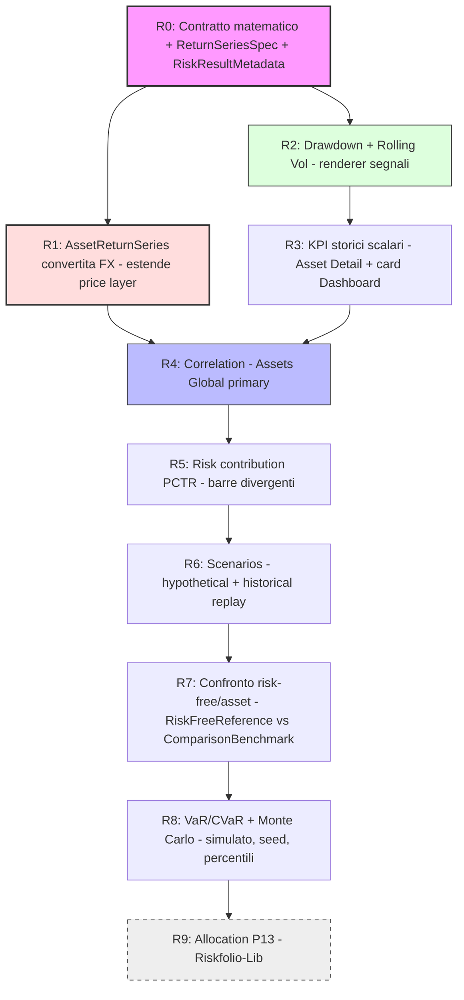

# Analisi — Modularità e Posizionamento della Risk Analysis (Fase 0.1)

> **Domanda a cui questo documento risponde:** l'analisi del rischio può essere
> resa *modulare* come il sistema dei segnali tecnici, oppure ogni metrica di
> rischio richiede necessariamente una UI costruita ad-hoc? E, di conseguenza,
> *dove* nel progetto ha senso collocarla?
>
> **Aggiornamento placement G6 — 29 Luglio 2026:** la matrice §5 recepisce l'IA
> definitiva documentata in
> [`plan-phase01Step6RiskFrontendInformationArchitecture.prompt.md`](./plan-phase01Step6RiskFrontendInformationArchitecture.prompt.md).

---

## 1. Il contesto: cosa rende modulari i "segnali"

Il sistema segnali (EMA, RSI, MACD, Bollinger, + ~15 plugin backend in
`backend/app/services/signal_plugins/`) è modulare perché tutti i segnali
condividono **la stessa forma di input e di output**:

- **Input uniforme:** una singola serie temporale `prezzo(t)`.
- **Output uniforme:** una o più serie allineate all'**asse tempo**, che si
  disegnano *sullo stesso grafico 2D tempo/prezzo* (overlay sull'asse primario,
  oppure oscillatore su un asse secondario/terziario).

Questa uniformità è ciò che permette l'auto-discovery: `ChartSignal` (frontend) e
`SignalPlugin` (backend) dichiarano `params_schema` + `output_specs`, e la UI
renderizza tutto con **un solo renderer** (il grafico a linee/istogramma).

> **Insight:** la modularità dei segnali non nasce dalla matematica, ma dal fatto
> che **l'output ha sempre la stessa forma grafica**. È la forma dell'output a
> determinare se qualcosa è "pluggable".

---

## 2. Il rischio ha output eterogenei → tassonomia degli archetipi

A differenza dei segnali, le metriche di rischio producono forme grafiche
**diverse tra loro**. Classificandole per *forma di output*, emergono **6
archetipi** (e non infiniti casi ad-hoc):

| # | Archetipo output | Esempi di metriche | Widget di rendering |
|---|------------------|--------------------|--------------------|
| **S** | **Scalare** (1 numero + banda qualitativa) | Volatilità annua, Sharpe, Sortino, Max Drawdown, VaR, CVaR, Beta, CAGR | KPI card / cella tabella + gauge |
| **T** | **Serie temporale** (allineata all'asse tempo) | Rolling volatility, Drawdown underwater, Rolling Sharpe, Rolling Beta, Rendimento rolling N-periodi | **Grafico segnali esistente** |
| **D** | **Distribuzione 1D** (istogramma / densità) | Distribuzione dei rendimenti, visualizzazione VaR, valore terminale Monte Carlo | Widget istogramma |
| **C** | **Cono / fan chart** (tempo + bande di incertezza) | Proiezione Monte Carlo, percentili P5/P50/P95 | Chart a bande (riusa il rendering Bollinger!) |
| **M** | **Matrice NxN** (heatmap) | Correlazione, covarianza, matrice beta | Heatmap |
| **F** | **Scatter 2D** (rischio/rendimento) | Frontiera efficiente (Markowitz), risk-return plot | Scatter + curva |

Sono **6 forme, non 60 casi**. Questo è il punto centrale della risposta.

---

## 3. Risposta alla domanda: né "tutto ad-hoc" né "un plugin unico"

La modularità è possibile, ma **a un livello diverso** rispetto ai segnali. Non si
rende modulare *il grafico a linee*; si rende modulare **la libreria di widget di
output** (le "widget primitives"). Ogni nuova metrica dichiara:

1. **quale archetipo di output** produce (S/T/D/C/M/F);
2. **su quale scope** opera (`asset`, `asset_set`, `portfolio + broker_ids`);
3. il proprio **`params_schema`** (orizzonte, confidence level, n. simulazioni…).

La UI **auto-seleziona il widget** dall'archetipo, esattamente come oggi
`ChartSignal` auto-seleziona il renderer dal tipo di segnale. Si passa da
"1 renderer / N segnali" a "**6 renderer / N metriche**".

### Proposta architetturale: `RiskAnalytic` plugin (ispirato a `SignalPlugin`, non identico)

`RiskAnalytic` **riprende i pattern** di auto-descrizione di `SignalPlugin`
(`params_model`, catalogo, status/warning, warmup → qui `min_observations`), ma
**non** ne condivide né il dominio (`ASSET|FX`) né l'input price-only: aggiunge
`scope`, `mode` (storico vs composizione corrente), e input come benchmark,
risk-free, pesi e le serie del Portfolio Calculation Engine. Vedi la §4 per il
motivo per cui non è un semplice `SignalPlugin` con `category:"risk"`.

```
backend/app/services/risk_plugins/          # (proposto, non ancora esistente)
├── base.py            # class RiskAnalytic(ABC)
│                      #   output_kind: OutputKind   # SCALAR|SERIES|DISTRIBUTION|CONE|MATRIX|SCATTER
│                      #   scopes: tuple[RiskScope]   # ASSET|ASSET_SET|PORTFOLIO
│                      #   portfolio may carry broker_ids for an exact subset
│                      #   modes: tuple[RiskMode]     # HISTORICAL|CURRENT_COMPOSITION
│                      #   params_model: BaseModel
│                      #   def compute(series, weights, params, ctx) -> RiskResult + RiskResultMetadata
├── volatility.py      # SCALAR + SERIES (rolling)
├── drawdown.py        # SCALAR (maxDD) + SERIES (underwater)
├── sharpe.py          # SCALAR + SERIES (rolling)  — richiede risk_free param
├── correlation.py     # MATRIX                     — richiede AssetReturnSeries
├── risk_contribution.py # SCALAR set (MCTR/CCTR/PCTR) — richiede AssetReturnSeries + pesi
├── stress_test.py     # SCALAR set (scenari, assunzioni visibili)
├── var_cvar.py        # SCALAR + DISTRIBUTION       — metodo dichiarato
├── monte_carlo.py     # CONE + DISTRIBUTION (simulato, seed)
└── efficient_frontier.py  # SCATTER   (avanzato/opzionale, Riskfolio-Lib)
```

```
frontend/src/lib/risk/widgets/              # (proposto)
├── ScalarKpi.svelte        # archetipo S  (numero + metadati: finestra/valuta/copertura)
├── RiskSeriesChart.svelte  # archetipo T  → riusa il RENDERER dei segnali (non il dominio)
├── DivergingBarChart.svelte# primitive DB (aggiuntiva, NON tra i 6 archetipi S/T/D/C/M/F)
│                           #   → contributo al rischio PCTR (pos/neg, asse a zero)
│                           #   riusa la primitive di barra divergente di PerformanceChart /
│                           #   il tipo `bar` di backendRenderer (buildBarSeries)
├── DistributionChart.svelte# archetipo D
├── ConeChart.svelte        # archetipo C  → riusa band rendering di Bollinger
├── CorrelationHeatmap.svelte# archetipo M
├── ComparisonPanel.svelte  # confronto risk-free/asset (riusa AssetSearchAutocomplete)
├── DataQualityBanner.svelte# primitive trasversale: copertura prezzi incompleta + "Sincronizza prezzi"
└── FrontierScatter.svelte  # archetipo F
```

> **Tassonomia (review-3 §5):** gli archetipi di output sono **6** — S/T/D/C/M/F
> (`SCALAR|SERIES|DISTRIBUTION|CONE|MATRIX|SCATTER`). Il **grafico a barre divergente**
> (`DivergingBarChart`) è una **primitive aggiuntiva** (etichetta `DB`), **non** un
> settimo archetipo di dominio: è la forma di rendering del contributo al rischio
> PCTR. Da **non confondere** con il *Concept B* (Monte Carlo) del brainstorm: qui
> `DB` = barre, là `B` = cono/distribuzione. Il `DataQualityBanner` è una primitive
> **trasversale** (non un archetipo), riusata da qualunque scheda con copertura
> prezzi non uniforme (contratto §2.3).

> **Regola di evoluzione congiunta** (come da `mcp_server_architecture_draft.md`):
> la matematica vive **solo nel service layer** (`RiskAnalytic.compute`), così
> REST, MCP e futura chat AI ne beneficiano senza duplicazioni. Ogni output porta
> con sé `RiskResultMetadata` (provenienza + qualità), sul modello dello status
> già esistente nei segnali. Vedi
> [`contract-phase01RiskMetricsMathematical.md`](./contract-phase01RiskMetricsMathematical.md) §4.


---

## 4. Serie temporali di rischio: riuso del *renderer*, non del *dominio*

> ⚠️ **Correzione rispetto alla prima stesura.** L'ispezione del codice
> (`backend/app/schemas/signals.py`) smentisce l'idea che basti «aggiungere
> `category:"risk"`» ai `SignalPlugin`. La stessa forma grafica **non** implica lo
> stesso dominio (review §8). Evidenze:
> - `SignalDomain` = `ASSET | FX` soltanto — **non esiste** un dominio portafoglio;
> - `SignalCategory` = `TREND | MOMENTUM | VOLATILITY | VOLUME` — **non esiste**
>   `risk`, né va introdotto forzatamente in un enum di *analisi tecnica*;
> - l'input di un `SignalPlugin` è `SignalInputRequirements.price_fields` (OHLCV) +
>   eventi: **nessuno slot** per benchmark, risk-free rate, pesi di portafoglio o
>   serie del Portfolio Calculation Engine.

Ne deriva una distinzione netta tra due sottoinsiemi dell'archetipo **T**.

> **Pivot review-4 (riuso prima di nuove astrazioni).** La stesura precedente
> preferiva `RiskAnalytic` *anche* per le metriche rolling asset-scoped. Verificato
> il contratto reale (`base.py`, `signal_service.py`), il costo/beneficio si
> ribalta: le metriche rolling **su singolo asset** entrano in `SignalPlugin` con
> **piccole estensioni**; `RiskAnalytic` resta riservato allo scope
> **portafoglio/multi-asset** (correlazione, PCTR, VaR/CVaR, stress, Monte Carlo,
> frontiera). Confine deciso qui sotto.

| Metrica | Input reale necessario | Percorso deciso (review-4) | Estensione richiesta | Evidenza |
|---------|------------------------|----------------------------|----------------------|----------|
| **Drawdown underwater (asset)** | solo `close` | ✅ **`SignalPlugin`** | nuovo valore `SignalCategory.RISK` (o riuso di `VOLATILITY`) — decisione minore di enum | fattibile **ora** (`base.py:43-46`; `SignalInputRequirements` price-only basta) |
| **Rolling volatility (asset, Nd)** | solo `close` | ✅ **`SignalPlugin`** | idem | fattibile **ora** |
| **Rendimento rolling N-periodi (asset)** | solo `close` | ✅ **`SignalPlugin`** | idem — già previsto in roadmap Fase 0 §4 | fattibile **ora** |
| **Rolling Sharpe (asset)** | `close` + risk-free | ✅ **`SignalPlugin`** | risk-free = **param scalare** del plugin; **nessun** cambio di framework | `params_model` già supporta scalari (`ema.py:37-63`) |
| **Rolling Beta vs benchmark (asset)** | 2 serie (asset + benchmark) allineate | ✅ **`SignalPlugin` con estensione di contratto** | **slot serie secondaria dichiarata** in `SignalInputRequirements` + orchestrazione in `SignalService` (fetch/convert/allineamento della 2ª serie) | oggi **assente** (`signals.py:303-318`, `:260-273`) |
| **Rischio di PORTAFOGLIO / multi-asset** (correlazione, PCTR, VaR/CVaR, stress, MC, frontiera) | serie multiple + pesi + scope | ❌ **`RiskAnalytic`** | dominio portafoglio/subset, pesi, `mode` — fuori dai segnali per costruzione | `SignalDomain=ASSET\|FX`, nessuno slot pesi/scope (`signals.py:93-96`) |

**Raccomandazione rivista (review-4 — riuso + piccole estensioni):**

1. **Metriche rolling asset-scoped → `SignalPlugin`.** Drawdown, rolling vol,
   rolling return, rolling Sharpe entrano nel sistema segnali esistente. Le prime
   tre sono price-only e **fattibili subito**; lo Sharpe aggiunge solo un **param**
   risk-free. Serve solo un valore `SignalCategory.RISK` (o il riuso di
   `VOLATILITY`) — estensione minore di enum, **non** un nuovo sottosistema.
2. **Rolling beta → `SignalPlugin` con una vera estensione di contratto.** È
   l'unica metrica rolling che richiede una **seconda serie dichiarata** come
   dipendenza. Va aggiunto uno slot "serie secondaria" in `SignalInputRequirements`
   e l'orchestrazione relativa in `SignalService` (fetch/convert/allineamento sul
   calendario congiunto, contratto §2.2/§5). La matematica del beta resta price-only
   ma richiede l'input aggiuntivo: è una **estensione**, non un nuovo dominio.
   ⚠️ Vincolo semantico: una **baseline risk-free sintetica** (varianza nulla)
   **non** può fungere da benchmark del beta (`var(r_bench)=0` → beta indefinito,
   contratto §6.5). Il beta ammette solo benchmark **variabili**.
3. **Scope portafoglio/multi-asset → `RiskAnalytic`.** Correlazione, PCTR, VaR/CVaR,
   stress, Monte Carlo e frontiera dichiarano pesi, `scope` e `mode`: restano fuori
   dal contratto segnali (che è `ASSET|FX`, price-only, senza pesi). Qui il nuovo
   contratto §3 è giustificato dal costo di dominio, non dalla forma grafica.
4. **Riuso del renderer sempre condiviso.** Entrambi i percorsi riusano lo stesso
   *renderer frontend* dell'archetipo T (`backendRenderer.ts`, `LineChart`): la
   modularità del rendering è indipendente dal dominio backend.

> Le serie di rischio consumano le **serie canoniche** già prodotte da LibreFolio
> (TWRR neutro rispetto ai flussi, NAV convertito FX). Vedi il documento
> fondazionale: [`contract-phase01RiskMetricsMathematical.md`](./contract-phase01RiskMetricsMathematical.md).

### 4.1 Utility comune di preparazione delle serie (service layer)

Sia `SignalPlugin` (rolling asset) sia `RiskAnalytic` (portafoglio) hanno bisogno
della **stessa preparazione dell'input**. Va estratta in **una utility del service
layer** — non nei plugin — coerente con l'architettura attuale, dove
`SignalService` (non il plugin) già fa il preflight: `prepare_plan()`
(`signal_service.py:118-261`), `_build_coverage()` (`:793-871`),
`_select_computation_points()` (`:923-974`), `_availability_state()` (`:986-1026`).
Il plugin riceve punti **già selezionati** e **non** tocca DB/prezzi/FX/sync
(`signal_service.py:553-558`).

| Aspetto | Responsabilità dell'utility |
|---|---|
| **Input** | scope (asset/subset/portfolio), primaria + eventuale secondaria, valuta target, finestra |
| **Output** | serie valorizzata + serie rendimenti derivati + `annualization_factor` osservato + provenienza/qualità (contratto §2.1–§2.3, §4) |
| **Riusa** | `convert_bulk` per la conversione FX batch con backward-fill e provenienza (`fx.py:1225-1411`); la logica di coverage/availability dei segnali (`signal_service.py:793-1026`); i prezzi già memorizzati |
| **Confini** | risolve serie/valuta/calendario congiunto/carried-forward/rendimenti/fattore osservato; **non** scarica prezzi, **non** converte dentro il plugin, **non** avvia sync |
| **Nuovo** | `AssetReturnSeries` canonica (gap §7): oggi il per-asset è lotto/posizione-based (`lots_analysis_service`), non prezzo→rendimento; va costruita **sopra** `convert_bulk` + prezzi, non come pipeline parallela |

> Confine con il dominio: la matematica vive nel service layer; la **modale di
> sincronizzazione** e il **banner** sono comportamento **frontend** (contratto §2.3).
> L'utility espone solo *dati di qualità*; non incorpora logica UI né trigger di refresh.

### 4.2 Inventario di riuso del backend (evidenza dal codice)

Ciò che **esiste già** e va riusato invece di reimplementato:

| Elemento | Dove | Riuso per la Risk Analysis |
|---|---|---|
| `SignalPlugin` ABC + registry auto-discovery + catalogo | `base.py:31-83`, `provider_registry.py:280-450` | ospita le metriche rolling asset (drawdown/vol/return/Sharpe/beta) |
| `params_model` scalari + `catalog_definition()` | `base.py:43,65-83` | risk-free e finestre come param dichiarati |
| Coverage/availability/warmup | `signal_service.py:793-1026`, `signals.py:288-704` | base per calendario congiunto + carried-forward + `data_quality_status` |
| `convert_bulk` (FX batch + backward-fill + provenienza) | `fx.py:1225-1411` | conversione delle serie prima del calcolo (contratto §7.1) |
| `PortfolioHistoryPoint.twrr` / dense `DailyPortfolioState` (già in valuta target) | `portfolio_engine.py:560-568,1049-1121`, `portfolio.py:434-458` | serie di portafoglio `mode:historical` (contratto §3) |
| `DataQualityReport` | `portfolio.py:224-239` | base da **estendere** con `data_quality_status`/`excluded_assets` (oggi assenti) |
| `SignalStatus`/`SignalWarningCode`/`SignalWarmupMetadata` | `signals.py:171-300` | modello per `RiskResultMetadata` (contratto §4) |
| Refresh prezzi/FX | `asset_source.bulk_refresh_prices`, `fx.sync_pairs_bulk`/`ensure_rates_multi_source` | il pulsante "Sincronizza" del banner riusa questi (contratto §2.3) |

**Estensioni backend realmente necessarie** (piccole, mirate):
1. valore `SignalCategory.RISK` (o riuso `VOLATILITY`) — enum;
2. slot **serie secondaria dichiarata** in `SignalInputRequirements`/`SignalExecutionContext` + orchestrazione in `SignalService` (solo per il **beta**);
3. campi `data_quality_status`/`excluded_assets` in `DataQualityReport` (o nel nuovo `RiskResultMetadata`);
4. serie canonica `AssetReturnSeries` (gap §7) — la più corposa, sblocca il multi-asset.

---

## 5. Matrice di posizionamento UI (per pagina, con riferimenti alla gallery)

Riferimenti agli screenshot in `mkdocs_src/docs/gallery/desktop/en/light/`.

> **Principio di riuso G6.** La stessa UI in pagine diverse non è duplicazione se
> usa lo stesso componente, lo stesso backend bulk e scope differenti. La
> posizione risponde a una domanda utente; lo scope seleziona asset/broker.
> Evitare endpoint, formule o componenti quasi-identici duplicati.

| Pagina (screenshot) | Scope naturale | Cosa collocare | Archetipi |
|---------------------|----------------|----------------|-----------|
| **Asset Detail** — accordion `Signals` + `Measures` (`assets/detail-measures.png`, `assets/detail-signals-macd.png`) | `asset` | Tab pagina **`Overview | Risk & Scenarios`**. Overview conserva chart/editor/Signals e i cinque rolling-risk come `SignalPlugin`; Risk & Scenarios offre summary, downside, confronto, correlazione asset-centrica e scenari senza duplicare il configuratore Signals. Nessuna Allocation. | T, S, C, D |
| **Dashboard** — tab Overview/Positions/Transactions (`dashboard/main.png`, `dashboard/positions-performance-map.png`) | `portfolio + broker_ids` | Tab Risk con **summary + pannelli espandibili condivisi**: rischio osservato, struttura, confronto, scenari. Ogni pannello rispetta il filtro broker toolbar. Nessuna sub-tab e nessuna UI P13 completa. | M, S, C |
| **Dashboard** — KPI cards in alto (`dashboard/allocation-charts.png`) | `portfolio` | 4ª card "Risk" (Volatilità / Max DD / Sharpe) con sparkline + link alla Risk tab | S |
| **Broker Detail** — tab Info/Positions/Transactions + FIFO (`brokers/detail.png`, `brokers/positions-performance-map.png`) | `portfolio + broker_ids=[id]` | Lo stesso componente Dashboard, con label «Rischio interno a: {broker}». Summary + pannelli espandibili; nessuna Allocation/P13. | M, S, C, DB |
| **Asset Global** — lista/griglia asset con dual-view (`assets/+page`, toolbar `PageToolbar`) | `asset_set` | Quattro tab: **`Assets | Correlation | Scenarios | Allocation`**. Correlation offre heatmap/vista asset-centrica; Scenarios ospita stress percentuale multi-asset; Allocation è l'unica casa P13 e usa lo stesso asset universe. Il broker costruisce solo il SET. | M, S, C, DB |
| **Positions holdings/performance map** (treemap) (`dashboard/positions-performance-map.png`) | `portfolio` | La treemap resta per **valore/performance**. Il **contributo al rischio (PCTR)** usa invece un **grafico a barre divergente** (PCTR può essere negativo → non rappresentabile come area treemap, review-2 §5) | DB (barre) |
| **Confronto (Risk tab + Asset Detail)** — riusa `AssetSearchAutocomplete` + `AssetComparisonSignal` | `portfolio`/`asset` | Pannello "Confronta con": baseline risk-free sintetica (Sharpe) **o** asset reale (active return, TE, IR, beta). Contratti distinti `RiskFreeReference`/`ComparisonBenchmark` (review-2 §8) | S, T |

> **Perché la "Risk tab" e non una pagina nuova:** la Dashboard ha già il pattern
> a tab (Overview/Positions/Transactions) con selettore periodo, valuta e broker
> in cima. Una tab "Risk" eredita **gratis** questi filtri (periodo → finestra di
> stima; broker → scope; valuta → base). Coerenza totale, zero navigazione nuova.

> ⚠️ **Semantica dello scope subset (review §15).** Il contratto canonico è
> `kind=portfolio` con `broker_ids` omesso o lista esplicita. Un broker singolo è
> una lista di cardinalità uno, non un `kind=broker` parallelo. Il rischio del
> sottoinsieme è **rischio interno al sottoinsieme**, non rischio complessivo
> dell'investitore. La UI lo etichetta esplicitamente.

> **Nota sul nome della tab (review §12).** «Projections» è troppo assertivo per
> output simulati. Si adotta **"Risk & Scenarios"** (asset) e **"Risk"**
> (portfolio), con i contenuti Monte Carlo etichettati «simulato», mai «previsto».

> **Correlazione = un solo contratto riusato (review-4).** La correlazione ha
> **casa primaria in Asset Global**. Heatmap e vista asset-centrica sono
> commutabili; lo stesso contratto alimenta Dashboard, Broker e Asset Detail. Il
> filtro broker/subset costruisce **solo l'insieme di asset**: quantità e pesi non
> entrano nella correlazione.

> **Stress test per scope (review-4) — una sola definizione di scenario, output diversi:**
> - **Asset Detail** → impatto **percentuale** sul singolo asset;
> - **Asset Global → Scenarios** → **confronto percentuale** multi-asset;
> - **Dashboard / Broker** → impatto **economico in €** sulla composizione (richiede
>   pesi/valorizzazione, `mode` dichiarato). La definizione dello scenario
>   (shock, categorie, assunzioni) è **unica e riusata**; cambia solo la proiezione
>   in base allo scope. Vedi contratto §6.10 e brainstorm Concept E/E-bis.

> **Allocation/P13.** `Assets Global → Allocation` è l'unica casa della UI P13 in
> G6. L'ottimizzatore costruisce una composizione ipotetica dell'asset universe e
> non usa quantità/pesi posseduti: non va quindi riproposto in Dashboard/Broker
> come se fosse una raccomandazione holdings-aware.

> **Dashboard/Broker condivisi.** Summary sempre visibile; pannelli espandibili per
> rischio osservato, struttura, confronto e scenari. Query lazy al primo open,
> risultato mantenuto durante il mount, stato locale senza URL/localStorage.
> Chiudere/riaprire same-key non rifà la query; date/scope/currency/parametri
> cambiano la request identity. Accordion state e invalidazione `riskStore` sono
> contratti distinti.

---

## 6. Cosa implementare / cosa rimandare / cosa NON mettere in UI

> Ordine rivisto secondo il valore reale e le dipendenze dati (review §9, §13),
> **non** solo il costo. Il **contributo al rischio** ha valore informativo
> elevato e precede il Monte Carlo. Prerequisito trasversale: il **contratto
> matematico** e la serie `AssetReturnSeries` (vedi documento fondazionale §7).

### 🧱 Prerequisiti (bloccanti, nessuna UI)
- **Contratto matematico + `ReturnSeriesSpec` + `RiskResultMetadata`** — fondamenta
  di ogni metrica ([`contract-...md`](./contract-phase01RiskMetricsMathematical.md)).
- **`AssetReturnSeries`** canonica (rendimenti per-asset convertiti FX), come
  estensione del price/portfolio layer — sblocca correlazione/beta/contributo.

### ✅ Prima ondata (alto valore, forma nota, consuma serie esistenti)
- **Drawdown underwater** (asset e portfolio-su-TWRR) — "dolore" storico leggibile.
- **Rolling volatility** — cambi di regime.
- **Strip KPI scalari storici** (Vol, MaxDD, Sharpe, Sortino) — `numpy`, con
  metadati di finestra/copertura/valuta.
- **Matrice di correlazione** (heatmap) — "aha moment" della diversificazione,
  con regole di data-alignment (contratto §5).
- **Risk contribution (PCTR)** — dove è *davvero* concentrato il rischio.
  **Visualizzazione: grafico a barre divergente** (asse a zero), **non** treemap:
  il PCTR può essere **negativo** (diversificazione) e l'area di una treemap non
  rappresenta valori negativi (review-2 §5, contratto §6.7).

### 🔁 Trasversale (cross-cutting, tutte le ondate)
- **Banner qualità dati + "Sincronizza prezzi"** (`DataQualityBanner`, contratto
  §2.3): compare quando la copertura prezzi non è uniforme (alcuni asset valorizzati
  con l'ultimo prezzo disponibile) o quando un asset è escluso. Mostra il dettaglio
  (asset · giorni senza nuovo prezzo · punti valorizzati con l'ultimo prezzo · ultima
  quotazione · motivo di esclusione) e un pulsante che **riusa il refresh esistente**
  del progetto — il Risk Engine **non** scarica prezzi autonomamente. **Nessun** banner
  quando il giorno è escluso perché nessun asset ha una nuova quotazione (esclusione
  normale). Vedi brainstorm §qualità dati (banner).

### 🟡 Seconda ondata (alto valore, costo medio)
- **Confronto risk-free vs asset reale** (contratto §6.11): baseline risk-free
  sintetica deterministica (Sharpe/eccesso) **vs** benchmark reale (active return,
  tracking error, IR, beta, drawdown comparato). Contratti backend **distinti**
  (`RiskFreeReference` / `ComparisonBenchmark`), mai un campo ambiguo unico. Riusa
  ricerca asset e confronto già esistenti (review-2 §8).
- **Stress test — tre famiglie con dipendenze distinte** (contratto §6.10), da non
  trattare come un blocco unico:
  - *hypothetical shock* — una dimensione, deterministico e auditabile;
  - *historical replay* — rendimenti osservati, `current_buy_and_hold`, copertura,
    proxy manuali o esclusioni esplicite; mapping/esclusioni/policy entrano
    nell'audit trail typed e nella request identity;
  - *factor shock* — richiede un **factor exposure model** assente oggi → evoluzione
    successiva; gli shock per categoria **non** sono analisi fattoriale rigorosa.
  I primi due sono distribuiti da un catalogo typed/startup-loaded e vivono nella
  tab Assets Global `Scenarios` oltre che nei pannelli shared degli altri scope.
  Il catalogo può portare `tags` opzionali/inerti per discovery futura. Editor
  hypothetical: bucket presenti nello scope + toggle `Mostra tutti`; `Other`
  sempre visibile quando richiesto.
- **VaR / CVaR** (historical simulation come default) — utile ma richiede
  disciplina interpretativa; convenzione di segno = **magnitudini positive di
  perdita** (`CVaR ≥ VaR ≥ 0`, contratto §6.8); **dopo** drawdown/correlazione/stress.
- **Monte Carlo cono + distribuzione** — ingaggiante ma massimo rischio di falsa
  precisione; richiede `ConeChart` (riusa band-rendering di Bollinger), seed,
  percentili, linguaggio "simulato".

### 🟠 Avanzato / opzionale (potente ma rischioso per il target retail)
- **Frontiera efficiente / ottimizzazione Markowitz** (Riskfolio-Lib): matematica
  soggetta a *estimation error* (soprattutto nei rendimenti attesi), facilmente
  mal interpretata. Se mantenuta: shrinkage della covarianza, vincoli sui pesi,
  analisi di sensibilità, confronto tra finestre, separazione netta tra analisi e
  raccomandazione. Mai presentare un portafoglio come oggettivamente "ottimo".
  In G6 vive solo in `Assets Global → Allocation`; solver/frontier/sensitivity e
  metadata tecnici sono in `Advanced`.

### ❌ Non mettere in UI (tenere solo backend / esporre via MCP all'AI)
- Misure di rischio esotiche (EVaR, CDaR, misure basate su kurtosi), modelli
  fattoriali, ottimizzazioni multi-vincolo. Sovradimensionate per il target;
  restano disponibili all'agente AI come tool MCP, senza inquinare la UI.
- **Punteggi sintetici opachi** (risk score / diversification score /
  semaforo): ammessi solo se interamente scomponibili e spiegabili (review §16);
  in alternativa, KPI separati.

---

## 7. Scelta della libreria: Riskfolio-Lib vs numpy/pandas

`Riskfolio-Lib` è potente ma **pesante**: trascina `cvxpy` e solver di
ottimizzazione convessa. Il suo valore reale è l'**ottimizzazione di portafoglio**
(frontiera efficiente, allocazioni ottime) e le **misure di rischio avanzate** con
plotting integrato.

| Necessità | Libreria consigliata | Motivo |
|-----------|----------------------|--------|
| KPI scalari (Vol, Sharpe, Sortino, MaxDD, VaR, CVaR, CAGR) | **`numpy`/`pandas`** | ~10 righe ciascuna, zero dipendenze pesanti |
| Serie rolling (§4) | **`pandas`** (`.rolling()`, `.pct_change()`) | Già dipendenza |
| Matrice correlazione | **`pandas`** (`.corr()`) | Nativo |
| Monte Carlo (GBM) | **`numpy`** | Vettorizzato, veloce |
| **Frontiera efficiente / ottimizzazione** | **`Riskfolio-Lib`** | Qui la libreria vale il peso |

> **Raccomandazione:** iniziare **senza** Riskfolio-Lib (tutto in numpy/pandas che
> sono già dipendenze del backend), e introdurlo **solo** quando/se si implementa
> la frontiera efficiente. Evita di appesantire il Docker single-image per feature
> che l'80% degli utenti userà.

> **Inventario verificato (review-4, ispezione reale dell'ambiente).** Installate e
> importabili: `numpy 2.5.0`, `pandas 3.0.3`, `scipy 1.18.0`, `ta-lib 0.7.1`,
> `pandas-ta-classic 0.6.52`. **Assenti** (non installate, non importabili):
> `Riskfolio-Lib` e `cvxpy`. Le due librerie TA (`talib`, `pandas_ta_classic`)
> **non** espongono alcun simbolo Monte Carlo/simulazione (ricerca
> `monte|simul|gbm|brown|random_walk` → 0 risultati). **Nessuna** libreria installata
> offre simulazione Monte Carlo pronta.
>
> **Gap colmato da numpy/scipy** (già presenti): `numpy.random.Generator.multivariate_normal`
> e `scipy.stats.multivariate_normal`/`norm` sono disponibili → un **GBM vettorizzato**
> (drift+σ stimati sullo storico, correlazione via Cholesky della covarianza) è
> implementabile senza nuove dipendenze.
>
> **Nota su Riskfolio-Lib (fonte: doc ufficiale/web):** anche se installata, **non**
> fornisce simulazione forward di percorsi; è ottimizzazione convessa su una **matrice
> di rendimenti fornita** (storica o simulata a monte). Quindi il Monte Carlo resta
> comunque numpy/scipy; Riskfolio-Lib rileva **solo** per la frontiera (R9, opzionale).
> Da installare **solo** in quel momento.
>
> **Strategia esecuzione (nessun impegno prematuro):** partire con NumPy
> **vettorizzato** in `await asyncio.to_thread(...)`. Un **process pool** va valutato
> **solo dopo benchmark** (n. path × n. asset × orizzonte) con limiti dichiarati:
> non pre-impegnarsi su infrastruttura pesante prima di misurare.

### 7.1 Policy di riuso delle librerie (review-4)

Ordine di preferenza, **fermarsi al primo che soddisfa**:
1. `numpy`/`pandas`/`scipy` già dipendenze → scalari, rolling, correlazione, GBM;
2. estensione minima di una libreria già presente;
3. nuova libreria **solo** con beneficio dimostrato e peso giustificato (es.
   Riskfolio-Lib per la sola frontiera) — installata al momento dell'uso, non prima.

### 7.2 Policy di riuso dei componenti UI custom (review-4)

Per ogni nuova UI, gerarchia **obbligatoria** (fermarsi al primo applicabile):
componente custom LibreFolio esistente → sua variante/prop → estensione compatibile
→ primitive estratta → libreria adottata → nuovo ad-hoc (ultima scelta, motivata).
I nomi semantici del contratto (`AssetReturnSeries`, `DivergingBarChart`,
`DataQualityBanner`, …) sono **requisiti di significato**, non nomi di classe
obbligatori. Mappa di riuso concreta in Concept/§9 e nel report finale (sezione H).

### ⚠️ Async safety e strategia di esecuzione (review §18)
Tutti i calcoli di rischio sono **CPU-bound sincroni**. Il pattern già usato dal
sistema segnali è `await asyncio.to_thread(...)` (`signal_service.py:260`) ed è
**sufficiente per le metriche leggere** (vol, drawdown, correlazione, KPI). Casi
che richiedono più di `to_thread`, da valutare quando si arriverà a essi:
- **Monte Carlo pesante** (molti path × molti asset): valutare process pool o job
  asincrono, con **limiti** su n. percorsi e dimensione del portafoglio;
- **ottimizzazione convessa** (frontiera): timeout e cancellazione;
- **cache** dei risultati con **invalidazione deterministica** (chiave =
  scope + finestra + valuta + versione algoritmo + seed);
- distinzione tra calcoli **interattivi** e **pianificati** (audit schedulato).
Non anticipare infrastruttura pesante; documentarne i limiti. Vedi
`.github/instructions/backend.instructions.md`.

---

## 8. Roadmap incrementale suggerita (per la Fase 0.1)

Ordine allineato a valore reale + dipendenze dati (review §13). Il collo di
bottiglia è `AssetReturnSeries` (serie rendimento per-asset convertita FX): va
prodotta presto perché sblocca correlazione, beta e contributo al rischio.



- **R0–R3** sbloccano valore con costo minimo (contratto + riuso renderer + numpy).
- **R1** (`AssetReturnSeries`) è la dipendenza dati critica delle metriche multi-asset.
- **R4** è il primo widget davvero "nuovo" (heatmap) ma ad altissimo impatto.
- **R5** (risk contribution, **barre divergenti**) precede il Monte Carlo per valore
  informativo; riusa la primitive di barra esistente (§7).
- **R6** (stress) parte dall'*hypothetical shock* deterministico; le tre famiglie
  hanno dipendenze distinte (contratto §6.10) — non è un blocco unico.
- **R7** (confronto) tiene separati risk-free sintetico e benchmark reale.
- **R8** raccoglie VaR/CVaR (segno positivo di perdita) e Monte Carlo (simulato).
- **R9** è l'unico step che introduce Riskfolio-Lib, ed è opzionale.

---

## 9. Conclusione

L'analisi del rischio **non** richiede una UI ad-hoc ogni volta. Richiede di
identificare **6 forme di output** (S/T/D/C/M/F) — più due primitive aggiuntive: le
**barre divergenti** (`DB`, per il PCTR) e il **banner qualità dati** trasversale — e
costruire una piccola libreria di **widget primitives** riusabili. Il percorso
backend è a **due binari** (review-4): le metriche **rolling asset-scoped**
(drawdown, rolling vol/return/Sharpe, e il beta con una serie secondaria dichiarata)
entrano nel **`SignalPlugin`** esistente con **piccole estensioni** (un valore di
`SignalCategory`, un param risk-free, uno slot serie-secondaria per il beta); le
metriche di **scope portafoglio/multi-asset** (correlazione, PCTR, VaR/CVaR, stress,
Monte Carlo, frontiera) passano da un contratto `RiskAnalytic` che dichiara forma +
scope + pesi + **modalità** (storico vs composizione corrente) + **metadati di
qualità**. La preparazione delle serie è **un'unica utility del service layer** (§4.1),
mai nei plugin. La modularità sta nei *widget* e nel *renderer* riusato, e nel
**riuso prima di nuove astrazioni**. Le metriche consumano le **serie
canoniche** già prodotte da LibreFolio (TWRR neutro rispetto ai flussi, NAV
convertito FX), evitando duplicazioni col Portfolio Calculation Engine. Il
posizionamento naturale è: `Overview | Risk & Scenarios` per Asset Detail;
`Assets | Correlation | Scenarios | Allocation` per Assets Global; una
**Risk tab** condivisa con summary+pannelli per Dashboard/Broker. Lo scope
`portfolio + broker_ids` è etichettato come rischio **interno al sottoinsieme**,
non come risultato `partial`. P13 vive solo in Allocation.

→ Fondamenta matematiche: [`contract-phase01RiskMetricsMathematical.md`](./contract-phase01RiskMetricsMathematical.md)
→ Concept visivi con ASCII art: [`brainstorm-phase01RiskUiConcepts.md`](./brainstorm-phase01RiskUiConcepts.md)
→ Revisione punto-per-punto: [`review-risk-analysis-feedback.md`](./review-risk-analysis-feedback.md)
