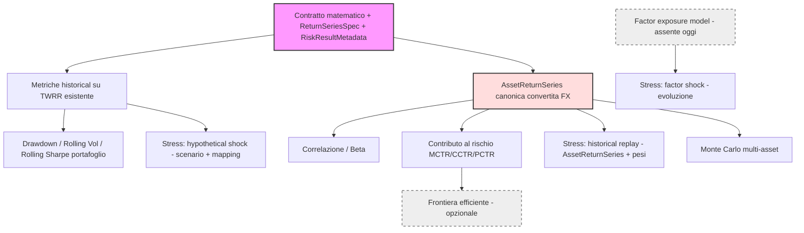

# Contratto Matematico e Semantico della Risk Analysis (Fase 0.1)

> **Documento fondazionale.** Deve essere letto **prima** dell'analisi
> architetturale e del brainstorming UI. Definisce, in modo verificabile e
> ancorato al codice reale di LibreFolio, *su quali serie* operano le metriche di
> rischio, *con quali convenzioni*, e *quali metadati* ogni risultato deve
> trasportare. Nessuna formula finanziaria vive nel frontend.
>
> Stato: contratto approvato; G0-G5 sono implementati. Le estensioni scenario
> aggiunte a §6.10 il 29 Luglio 2026 sono pianificate per G6 e non ancora
> implementate. Gli esempi di payload/interfaccia sono **illustrativi**.

Riferimenti al codice reale (ispezionato il 2026-07-26):
- `backend/app/services/portfolio_engine.py` — `PortfolioCalculationEngine`
- `backend/app/services/portfolio_service.py` — `PortfolioService.get_report()`
- `backend/app/utils/financial/roi_utils.py` — TWRR/MWRR
- `backend/app/schemas/portfolio.py` — `PortfolioHistoryPoint`, `DataQualityReport`
- `backend/app/schemas/signals.py` — contratto `SignalPlugin`, status/warning model
- `backend/app/services/fx.py`, `backend/app/db/models.py` — `FxRate`, `convert_bulk`

---

## 0. Principio guida: consumare, non reimplementare

LibreFolio possiede **già** un motore che produce serie finanziarie corrette,
convertite in valuta e neutre rispetto ai flussi di cassa. Il Risk Engine **non
deve ricostruire** rendimenti, NAV o conversioni: deve **consumare** le serie
canoniche del `PortfolioCalculationEngine` e del sistema FX.

> **Regola anti-duplicazione:** ogni volta che una metrica di rischio ha bisogno
> di una serie di valore/rendimento/valuta, la fonte è il Portfolio Calculation
> Engine o il servizio FX. Se la serie non esiste ancora in forma canonica
> (vedi §7, gap serie per-asset), va aggiunta **come estensione del motore
> esistente**, non come pipeline parallela nel Risk Engine.

---

## 1. Tassonomia delle serie finanziarie (mappata al codice reale)

Il prompt di review chiede di distinguere: prezzo grezzo, adjusted price, total
return, rendimento semplice, rendimento logaritmico, TWRR, valore patrimoniale,
performance netta da depositi/prelievi. Ecco lo stato reale in LibreFolio.

| Serie concettuale | Esiste oggi? | Fonte reale nel codice | Note |
|---|---|---|---|
| **Prezzo grezzo (close)** | ✅ | `SignalPricePoint.close`, `_price_on_date()` (backward-fill) `portfolio_engine.py:1090` | In valuta **nativa** dell'asset |
| **Adjusted price** (split/div) | ❌ | — | Non esiste una serie prezzo aggiustata per dividendi |
| **Total return price** | ❌ | — | I dividendi sono trattati come **cashflow/income**, non reinvestiti nel prezzo (`portfolio_engine.py:840`) |
| **Rendimento semplice / HPR** | ✅ (implicito) | `(V_end−V_start)/V_start` in `calculate_twrr()` `roi_utils.py:191` | Convenzione del motore = **semplice**, non log |
| **Rendimento logaritmico** | ❌ | — | Da introdurre solo se una metrica lo richiede, dichiarandolo |
| **NAV (valore patrimoniale)** | ✅ | `DailyPortfolioState.nav_value` (dense, giornaliero) `portfolio_engine.py:391,953` | Convertito in `target_currency` |
| **Capitale investito/depositato** | ✅ | `cumulative_external_cash_flow`, `net_deposited_capital` `portfolio_engine.py:410`, schema `385` | Linea separata dal NAV |
| **TWRR (serie cumulativa)** | ✅ | `calculate_twrr_series()` → `PortfolioHistoryPoint.twrr` `roi_utils.py:207`, schema `444` | **Neutra rispetto a depositi/prelievi** |
| **MWRR/XIRR** | ✅ | `calculate_mwrr()`, `mwrr_cumulative` | Money-weighted; **non** adatto a volatilità/correlazione |
| **Flussi esterni (dep/prel)** | ✅ | `external_cash_flows`, `CashFlowInput` `portfolio_engine.py:227,1473` | Segno negato per prospettiva portafoglio |

### 1.1 Regola di selezione della serie per tipo di metrica

Questa è la decisione centrale del contratto:

| Ambito della metrica | Serie di ingresso corretta | Perché |
|---|---|---|
| **Rischio di portafoglio** (volatilità, drawdown, Sharpe, VaR di portafoglio) | **serie TWRR** (`PortfolioHistoryPoint.twrr`), trasformata in rendimenti periodali | È l'unica serie che **isola la performance** dai depositi/prelievi. Un deposito **non** deve apparire come rendimento positivo — problema già risolto dal motore, da NON reintrodurre lavorando sul NAV grezzo. |
| **Rischio del singolo asset** (rolling vol/drawdown dell'asset) | **close price** in valuta scelta → rendimenti semplici | L'asset non ha flussi di deposito; la sua serie prezzo è la base naturale. Limitazione: esclude i dividendi (no total-return series). |
| **Correlazione / beta tra asset** | serie di **rendimenti per-asset** allineate e convertite (§5, §7) | Serve una serie rendimento per-asset canonica, oggi **assente** (gap §7). |
| **Contributo al rischio, ottimizzazione** | rendimenti per-asset + pesi correnti | Richiede matrice di covarianza degli asset. |

> ⚠️ **Errore da evitare esplicitamente:** calcolare volatilità/drawdown di
> portafoglio sui `nav_value` grezzi. Il NAV incorpora i flussi di cassa esterni;
> derivarne rendimenti confonderebbe versamenti con performance. Usare **sempre**
> la serie TWRR per il rischio di portafoglio.

### 1.2 Limitazione dichiarata: assenza di total-return a livello asset

Poiché non esiste una serie prezzo total-return, una serie **price-only non
rappresenta il rendimento totale dell'investitore**: **può sottostimare il
rendimento e alterare volatilità e drawdown** rispetto a una serie total-return.
Ad esempio il **drawdown price-only può risultare più profondo** quando
distribuzioni e cedole non vengono incluse. Questa asimmetria va:
1. dichiarata nei metadati con `return_basis: price_only | twrr | total_return`
   (il valore `total_return` è previsto ma non ancora producibile — vedi sotto);
2. mostrata in UI come nota metodologica;
3. considerata prima di confrontare numericamente rischio-asset e rischio-portafoglio.

> **Confronti parziali (review-2 §9):** finché LibreFolio non dispone di serie
> total-return canoniche per asset, ogni confronto basato sul solo prezzo va
> etichettato come **parziale**, non come confronto economico completo. Il campo
> `return_basis` **si propaga sempre** nei metadati, così che il consumatore sappia
> se income/cedole sono inclusi. Ciò **non blocca** necessariamente `AssetReturnSeries`
> (R1): la serie parte price-only, con `return_basis` esplicito.

### 1.3 Estrazione dei rendimenti giornalieri dalla TWRR cumulativa (review-2 §2)

`calculate_twrr_series()` (`roi_utils.py:207-245`) restituisce una serie **TWRR
cumulativa**: a ogni snapshot accumula `compound = Π_k (1+hpr_k)` e memorizza
`TWRR_t = compound_t − 1` (`roi_utils.py:242`). Quindi l'**indice di ricchezza** è:

```text
W_t = 1 + TWRR_t                         (wealth index, base W_0 = 1)
```

e il **rendimento periodale (giornaliero)** si estrae per rapporto:

```text
r_t = (1 + TWRR_t) / (1 + TWRR_{t-1}) − 1 = W_t / W_{t-1} − 1
```

**Verifica contro il codice:** questa `r_t` coincide esattamente con l'`hpr_t`
della sotto-periodo calcolato dal motore (`hpr = (v_end_pre_cf − v_start)/v_start`,
`roi_utils.py:239`), poiché `compound_t/compound_{t-1} = 1 + hpr_t`. La formula è
quindi coerente con il Portfolio Calculation Engine, **non** una re-derivazione.

Casi da gestire e documentare:

| Caso | Comportamento |
|---|---|
| **Primo punto della serie** | la serie parte da `i=1` (esclude il primo snapshot); `W_0 = 1` è la base implicita, non un rendimento |
| **Periodo senza variazione** | `hpr_t = 0 ⟹ r_t = 0` (nessun movimento reale, non escluso) |
| **`v_start = 0`** (nessun investimento pregresso) | il motore salta la sotto-periodo (`roi_utils.py:238`): `compound` invariato ⟹ `r_t = 0` |
| **Valori mancanti** | assenza di snapshot ⟹ nessun punto; mai forward-fill del rendimento |
| **Precisione numerica** | la TWRR cumulativa è **quantizzata** (`_PREC_PCT`, `roi_utils.py:242`). Differenziare cumulative arrotondate propaga errore ⟹ **preferire la derivazione dall'`hpr` di sotto-periodo** (o dal `compound` non arrotondato), non dal rapporto di due TWRR arrotondate |
| **TWRR cumulativa vs periodale** | non confondere: la cumulativa cresce monotona-in-composizione; la periodale è il rendimento del singolo giorno usato per volatilità/drawdown/Sharpe |

> Per drawdown e underwater, l'indice `W_t = 1 + TWRR_t` è la serie cumulata di
> ingresso della scheda §6.2 (nessuna ricostruzione separata necessaria).

---

## 2. `ReturnSeriesSpec` — l'oggetto di configurazione della serie (proposto)

Per rendere deterministici frequenza, calendario e annualizzazione (review §5),
si propone **un solo** oggetto di specifica, condiviso da tutte le metriche.
Evita astrazioni multiple e centralizza le convenzioni.

> **Decisione di determinismo (review-2 §1): il calcolo è SEMPRE giornaliero
> nella prima implementazione.** La frequenza **non** è una scelta libera
> dell'utente: tutte le metriche (volatilità, drawdown, Sharpe, Sortino,
> correlazione, beta, VaR/CVaR, contributo al rischio, confronti benchmark)
> consumano **rendimenti giornalieri** derivati dalle serie canoniche giornaliere
> di LibreFolio. Nessuna seconda frequenza di calcolo viene introdotta
> implicitamente. I campi `frequency`/`resample_rule` e un
> `annualization_factor` **configurabile** sono **rimossi** dalla prima
> implementazione (configurabilità prematura): la frequenza è fissa a *daily*.
> L'annualizzazione **non** è però un `365` costante: il fattore è **derivato dal
> campione realmente usato** (osservazioni incluse × 365 / giorni di calendario,
> §2.1) — deterministico, non esposto come parametro utente.

```jsonc
// ILLUSTRATIVO — non è codice applicativo (prima implementazione)
ReturnSeriesSpec = {
  "source":        "portfolio_twrr" | "asset_close" | "portfolio_nav_forbidden",
  "return_type":   "simple",                   // fisso "simple" (coerente col motore)
  // frequency: SEMPRE "daily" — non esposto come parametro (review-2 §1)
  // annualization_factor: DERIVATO dal campione (oss. incluse × 365 / giorni) — non esposto (vedi §2.1)
  "currency":      "EUR",                       // valuta della serie (vedi §7)
  "alignment":     "joint_calendar",           // multi-serie: calendario congiunto (§5, §2.2)
  "price_gap_policy": "carry_forward_price",    // §2.2 — ultimo prezzo disponibile; mai ffill dei rendimenti
  "min_observations": 20,                       // sotto soglia → risultato INSUFFICIENT
  "calendar":      "as_stored"                  // usa le date realmente presenti
}
```

> Evoluzione (seconda ondata, **non** prima implementazione): se e quando servirà
> una vista mensile/settimanale *matematica* (non solo grafica), si reintrodurrà
> `frequency`/`resample_rule` in modo esplicito e dichiarato. Finché non serve,
> resta fuori per evitare una seconda frequenza nascosta.

### 2.0 Calcolo giornaliero vs aggregazione visuale (review-2 §1)

Va tenuta una separazione rigida tra il **dominio di calcolo** e il **rendering**:

```text
Dominio di calcolo   → SEMPRE giornaliero (serie canoniche dense)
                       produce metriche, n_observations, semantica rolling

Rendering (frontend) → può ridurre i punti mostrati (downsampling per pixel,
                       bucket, aggregazioni visuali) SOLO per la visualizzazione
```

L'aggregazione visuale del frontend **non deve mai** modificare:
- il campione matematico;
- il valore delle metriche;
- il numero di osservazioni dichiarato nei metadati;
- la semantica delle finestre rolling.

> **Regola:** downsampling/bucket sono **ottimizzazioni di disegno**, non
> ricampionamento finanziario. Tooltip, help e metadati devono chiarire che le
> metriche restano calcolate **giornalmente**, anche quando il grafico mostra un
> intervallo più aggregato.

### 2.2 Calendario congiunto multi-asset: prezzi mancanti (review-3 §1)

Le serie multi-asset possono avere calendari diversi (asset 24/7 come crypto vs
asset negoziati solo nei giorni di mercato). La regola è **unica**: costruire un
**calendario congiunto**, valorizzando ogni giorno **prima** di derivarne i
rendimenti. Per ogni giorno del periodo analizzato:

| Situazione del giorno | Regola |
|---|---|
| **Tutti** gli asset hanno un nuovo prezzo | giorno **incluso** con i prezzi del giorno |
| **Almeno uno** ha un nuovo prezzo, altri no | giorno **incluso**; per gli altri si usa l'**ultimo prezzo disponibile** |
| **Nessun** asset ha un nuovo prezzo | giorno **escluso** dal campione |
| Asset senza prezzo corrente **e** senza alcun prezzo precedente | asset **escluso** dal calcolo → risultato parziale + warning |

Il rendimento è **sempre** derivato dalla serie valorizzata:

```text
r_{i,t} = P^valued_{i,t} / P^valued_{i,t-1} − 1
```

Se il prezzo valorizzato non cambia (ultimo prezzo mantenuto), il rendimento
derivato è **zero**. Questo **non** è un forward-fill del rendimento: si mantiene il
**prezzo** e poi si deriva il rendimento.

```text
Tutti gli asset hanno un nuovo prezzo   → giorno incluso (prezzi del giorno)
Almeno un asset ha un nuovo prezzo      → giorno incluso; altri = ultimo prezzo
                                          rendimento derivato dai prezzi valorizzati
Nessun asset ha un nuovo prezzo         → giorno escluso
Asset senza prezzo corrente/precedente  → asset escluso → risultato parziale → warning
```

> **Decisione (review-3 §1):** il giorno è escluso **solo** quando *nessuno* degli
> asset coinvolti ha una nuova quotazione. Se **almeno uno** ha un nuovo prezzo, il
> giorno entra nel campione e gli altri asset sono valorizzati con l'**ultimo prezzo
> disponibile** (degradazione trasparente, **non** ffill del rendimento). Questa
> regola **supera** la precedente formulazione (review-2 §2.2) che escludeva il
> giorno quando un singolo asset non aveva nuova quotazione. La copertura non
> uniforme viene **dichiarata nei metadati** e segnalata in UI (§2.3), mai
> silenziata.

> **Nota qualità (review-3 §1.4):** l'uso dell'ultimo prezzo disponibile è una
> **degradazione trasparente** che consente il calcolo, non una correzione
> statistica capace di rendere equivalenti dati completi e incompleti. Se in almeno
> un giorno incluso alcuni asset usano l'ultimo prezzo disponibile, il risultato è
> marcato con un **warning di qualità**. Nessuna strategia di imputazione
> configurabile, nessuna soglia arbitraria, nessun ricampionamento nascosto: il
> problema è presentato come problema della **sorgente dati** (§2.3).

### 2.1 Annualizzazione **osservata**, non un fattore fisso (review-3 §1.3)

Il calcolo resta **giornaliero**, ma il fattore di annualizzazione **non** è un
`365` costante: rappresenta il **numero medio di osservazioni valide per anno** nel
periodo analizzato. Poiché il campione **esclude** i giorni in cui nessun asset ha
una nuova quotazione (§2.2), applicare `√365` a un campione più corto
sovrastimerebbe la densità osservativa.

```text
A = N_included · 365 / D_calendar          (≡ N_included / (D_calendar/365))

N_included  = rendimenti giornalieri inclusi nel campione
D_calendar  = durata del periodo in giorni di calendario
A           = osservazioni effettive annualizzate
```

La volatilità annualizzata diventa:

```text
σ_annualized = σ_observed · √A
```

Esempio illustrativo:

```text
Durata del periodo:   90 giorni di calendario
Giorni inclusi:       64
Fattore annuale:      64 × 365 / 90 = 259,56
Annualizzazione:      σ × √259,56
```

Il fattore è: **deterministico** (nessuna scelta utente) · **calcolato dal campione
realmente usato** · **incluso nei metadati** (`annualization_factor`, §4) ·
**uguale per tutte le metriche** derivate dallo stesso calendario congiunto.

> **Perché non 252 né 365 fissi (evidenza dal codice):** il motore annualizza già
> su base **giorni di calendario** — `annualized_to_cumulative(rate, days)` →
> `(1+r)^(days/365)−1` (`roi_utils.py:80,92`), serie densa per giorno di calendario
> (`portfolio_engine.py:435,983`). Il `365` resta la **base temporale** (un anno di
> calendario, coerente con crypto 24/7), ma il **conteggio** delle osservazioni
> annualizzate deriva dal campione: né la convenzione borsistica `252` né un `365`
> costante applicato a un campione che esclude giorni. Effetto elegante: per un
> asset equity con ~252 giorni di mercato all'anno `A` tende naturalmente a ~252;
> per un asset 24/7 a ~365 — valori che **emergono dal campione**, non imposti.
> Ciò normalizza correttamente anche i **periodi brevi**.

> **Da non confondere (review-3 §5):** la conversione del risk-free sintetico
> `r_{f,daily} = (1+r_{f,annual})^(1/365)−1` (§6.11) resta su **giorni di
> calendario** — è una crescita deterministica per giorno di calendario. Il fattore
> osservativo `A` annualizza invece la **volatilità** in base alla densità del
> campione: sono due grandezze distinte.

### 2.3 Qualità dei dati, warning e confine di sincronizzazione (review-3 §1.4–1.6)

La copertura non uniforme è un problema della **sorgente dati**, non da correggere
con euristiche statistiche. Il contratto prevede:

- **`data_quality_status`** nei metadati: `ok` · `carried_forward` (alcuni asset
  valorizzati con l'ultimo prezzo in ≥1 giorno incluso) · `partial` (uno o più asset
  esclusi per assenza totale di prezzo utilizzabile);
- **nessun warning** quando un giorno è escluso perché **nessun** asset ha una nuova
  quotazione (esclusione normale, non degradazione);
- **warning ordinario** quando alcuni asset usano l'ultimo prezzo disponibile;
- **warning grave + risultato parziale** quando un asset è escluso perché privo di
  qualunque prezzo utilizzabile.

> **Confine di responsabilità (review-3 §1.5):** il Risk Engine **non** scarica
> prezzi, **non** introduce una propria pipeline di aggiornamento, **non** corregge
> autonomamente il database. Il banner UI (analisi §6, brainstorm §qualità dati)
> offre un pulsante «Sincronizza prezzi» che **riusa il normale sistema di refresh**
> del progetto; al termine le serie canoniche vengono ricostruite, le cache di
> rischio invalidate e le metriche ricalcolate.

> **Modale di sincronizzazione = comportamento frontend (review-4).** Il pulsante
> **apre la modale di sync comune** già esistente (`PageSyncModal`, che supporta
> **prezzi + FX** insieme), con **preselezionati** gli asset e le coppie FX
> incomplete; l'utente **avvia esplicitamente** (nessun auto-sync). Al termine
> (`onsynced`) l'invalidazione/ricalcolo è **a carico della pagina** (pattern attuale),
> non della modale né del dominio. Il contratto matematico **non** contiene logica UI:
> descrive solo *quali* dati sono incompleti (§4); l'orchestrazione della modale vive
> nel frontend (brainstorm §qualità dati).

---

## 3. Modalità: portafoglio storico vs composizione corrente

Due domande diverse, due serie diverse (review §3). Non intercambiabili, mai
implicite.

| Modalità | Domanda | Serie | Disponibilità reale |
|---|---|---|---|
| **`historical`** | «Come si è comportato il portafoglio che possedevo *davvero*?» | serie TWRR reale del motore con pesi storici effettivi | ✅ già prodotta (`get_report(history=True)`) |
| **`current_composition`** | «Come si sarebbe comportata *oggi* la composizione attuale nel passato?» | pesi correnti applicati ai rendimenti storici per-asset | ❌ richiede serie rendimento per-asset (gap §7) + logica di ricomposizione |

Rappresentazione obbligatoria della modalità:
- **dominio/servizio:** parametro `mode: RiskMode` non opzionale;
- **API:** campo esplicito nel payload;
- **metadati risultato:** `RiskResultMetadata.mode` (§4);
- **UI:** etichetta sempre visibile (es. badge "Storico reale" / "Composizione attuale — backtest").

### 3.1 Politica di evoluzione dei pesi in `current_composition` (review-2 §4)

`current_composition` **non è una sola semantica**: il modo in cui i pesi evolvono
nel tempo cambia il risultato. Va dichiarato esplicitamente. Tre politiche:

| Politica | Comportamento dei pesi | Ipotesi introdotte |
|---|---|---|
| **`current_buy_and_hold`** *(preferita 1ª impl.)* | i pesi iniziali = composizione attuale, poi **derivano liberamente** con i prezzi | minime: nessuna transazione, nessun costo/fiscalità simulati |
| `current_constant_weight` | i pesi vengono **riportati di continuo** ai valori iniziali (ribilanciamento continuo) | ribilanciamento giornaliero irrealistico, ignora costi/tasse |
| `current_periodic_rebalance` | i pesi vengono ripristinati a **intervalli** definiti (es. trimestrale) | ribilanciamento periodico, ignora costi/tasse |

> **Decisione (review-2 §4):** la prima implementazione usa
> **`current_buy_and_hold`**, perché non simula transazioni giornaliere, costi o
> fiscalità inesistenti — coerente con l'assenza di un motore di ribilanciamento
> sintetico nel progetto. Le altre due politiche sono **evoluzioni dichiarate**,
> non default. `current_composition` **non** va lasciato generico: il campo
> `composition.policy` è obbligatorio e propagato nei metadati.

> **Conseguenza roadmap:** la modalità `historical` è implementabile **subito**
> (consuma il TWRR esistente). La `current_composition` (in politica
> `current_buy_and_hold`) dipende dal gap §7 e va nella seconda ondata. Le prime
> metriche di portafoglio devono quindi dichiarare `mode: historical` per non
> promettere semantica non ancora disponibile.

---

## 4. `RiskResultMetadata` — provenienza e qualità (proposto)

Ogni risultato di rischio trasporta un blocco metadati comune, **modellato sui
pattern già esistenti** nel sistema segnali (`SignalStatus`,
`SignalAvailabilityReason`, `SignalWarningCode`, `SignalWarmupMetadata` in
`schemas/signals.py:149-176,266`) e sul `DataQualityReport` del portfolio
(`schemas/portfolio.py:224`). Non si inventa un modello nuovo: si estende quello
auditabile che LibreFolio usa già.

```jsonc
// ILLUSTRATIVO
RiskResultMetadata = {
  "analyzed_range":   {"start": "2024-01-02", "end": "2026-07-25"},
  "frequency":        "daily",
  "n_observations":   642,          // = included_observations (giorni inclusi nel campione, §2.2)
  "calendar_days":    900,          // durata del periodo in giorni di calendario (§2.1)
  "annualization_factor": 260.4,    // DERIVATO: n_observations × 365 / calendar_days (§2.1)
  "coverage":         0.97,        // osservazioni valide / attese (§5)
  "assets_with_missing_prices": ["BTC"],    // asset valorizzati con l'ultimo prezzo in ≥1 giorno incluso (§2.3)
  "carried_forward_price_points": 14,       // n. punti valorizzati con l'ultimo prezzo disponibile (§2.3)
  "data_quality_status": "carried_forward", // ok | carried_forward | partial (§2.3)
  "currency":         "EUR",
  "method":           "historical_simulation",  // per VaR/CVaR/stress
  "params":           { /* eco dei parametri usati */ },
  "benchmark":        "URTH" | null,
  "risk_free":        {"value": 0.0, "source": "config", "currency": "EUR"},
  "mode":             "historical" | "current_composition",
  "composition":      {"mode": "historical", "policy": "current_buy_and_hold", "weights_ref": "as_of_2026-07-25"},
  "return_basis":     "twrr" | "price_only" | "total_return",   // §1.2 (total_return previsto, non ancora producibile)
  "warnings":         ["short_history:BTC", "low_coverage"],
  "excluded_assets":  [{"asset_id": 42, "reason": "insufficient_history"}],
  "algo_version":     "risk-vol@1.0.0",
  "computed_at":      "2026-07-26T09:50:00Z",
  "sampling_method":  "mc",           // solo se stocastico
  "path_count":       4096,           // solo se stocastico
  "random_seed":      123456789,      // solo MC
  "sobol_start_index": null           // solo QMC; alternativo a random_seed
}
```

Regole:
- Campi **non pertinenti** a una metrica restano `null`/assenti (no rumore forzato).
- **Estensione, non invenzione (review-4):** `data_quality_status` ed
  `excluded_assets` **non** esistono oggi in `DataQualityReport`
  (`schemas/portfolio.py:224-239`, che ha `missing_price_assets`/`missing_fx_pairs`/
  `stale_prices`/`incomplete_*`): vanno **aggiunti** a quel report o al nuovo
  `RiskResultMetadata`. Il resto riusa i pattern segnali/portfolio esistenti.
- **Qualità FX oltre ai prezzi (review-4):** la degradazione non è solo prezzi
  mancanti ma anche **FX mancante/backward-filled**. `missing_fx_pairs` esiste già
  nel `DataQualityReport`; il `data_quality_status` deve considerare **anche** i punti
  FX carried-forward (`convert_bulk` espone il flag di backward-fill, `fx.py:1395-1398`),
  non solo i prezzi. Un cambio backward-filled degrada la qualità quanto un prezzo.
- L'**insufficienza dati è un risultato di dominio**, non un errore nascosto:
  status `INSUFFICIENT` con `reason`, coerente con `SignalStatus.UNAVAILABLE` e
  `SignalAvailabilityReason.INSUFFICIENT_HISTORY` già esistenti.
- La UI mostra una **sintesi** (badge copertura/valuta/finestra) e permette di
  ispezionare il dettaglio (dialog metodologico), senza mai presentare un numero
  privo di contesto.

---

## 5. Data alignment per correlazione e beta (review §6)

La heatmap di correlazione è ad alto valore ma può produrre numeri precisi su
serie poco comparabili. Regole obbligatorie:

| Aspetto | Decisione di contratto |
|---|---|
| **Allineamento date** | **Calendario congiunto** (§2.2): giorno incluso se ≥1 asset ha nuova quotazione (altri asset valorizzati con l'ultimo prezzo); giorno escluso se nessuno ha nuova quotazione. **Nessuna** union+ffill opzionale. |
| **Valori mancanti** | ultimo prezzo disponibile per la valorizzazione del giorno incluso (segnalato); asset senza alcun prezzo precedente → escluso. Mai ffill dei **rendimenti** (si mantiene il prezzo, poi si deriva). |
| **Calendario comune** | Un **unico** calendario congiunto per il calcolo interessato (§2.2). Covarianza, correlazione e PCTR **non** vanno combinati da coppie calcolate su calendari diversi. |
| **Osservazioni minime** | `min_observations` (default 20 daily); sotto soglia → coppia marcata `INSUFFICIENT`, cella grigia in heatmap. |
| **Copertura minima** | `coverage ≥ soglia` (es. 0.6) sull'intersezione, altrimenti warning. |
| **Storia breve** | Asset con storia < finestra: incluso solo sul sotto-periodo comune, con warning `short_history`. |
| **Valuta** | Correlazione calcolata **dopo** conversione alla `currency` scelta (§7): il cambio modifica le correlazioni. |
| **Benchmark beta** | Il beta richiede un benchmark valido e con copertura adeguata; senza benchmark → beta non calcolabile (non zero). **Baseline risk-free sintetica esclusa** (varianza nulla → beta indefinito, §6.5). Solo benchmark **variabili**. |
| **Serie secondaria dichiarata** | Beta e confronto benchmark introducono una **seconda serie come dipendenza di input**. Il contratto segnali attuale non ha uno slot per una serie secondaria (`SignalInputRequirements`/`SignalExecutionContext`): va aggiunto e orchestrato dal service layer sullo **stesso** calendario congiunto della primaria (§2.2). |
| **Calendari diversi** | Gestiti dall'intersezione; il numero di osservazioni comuni va **sempre** esposto. |

Estensioni consigliate (non solo correlazione del periodo):
- correlazione **rolling** per mostrarne l'instabilità;
- confronto tra due finestre;
- indicazione esplicita di `n_observations` e `coverage` per ogni cella;
- warning quando la correlazione è instabile tra sotto-periodi.

> **Linguaggio UI:** descrivere ciò che è stato **osservato nel campione** («in
> questo periodo questi asset si sono mossi insieme»), non affermare verità
> strutturali («equivalgono a una sola scommessa»).

---

## 6. Schede-contratto delle metriche (prima ondata)

Formato compatto: *domanda · formula · input · unità · finestra · limiti*.
Convenzioni comuni: rendimenti semplici, annualizzazione **osservata** (§2.1,
fattore √A dal campione), valuta da `ReturnSeriesSpec`, metadati §4.

### 6.1 Volatilità (realized)
- **Domanda:** quanto sono stati variabili i rendimenti nel campione?
- **Formula:** `σ = stdev(r_t)` ; annualizzata `σ_ann = σ · √A`, con `A` fattore osservato (§2.1).
- **Input:** serie rendimenti (portfolio TWRR o asset close).
- **Unità:** % annua. **Finestra:** configurabile, min 20 oss.
- **Limiti:** stima campionaria; non stazionaria; non è "rischio massimo".

### 6.2 Max Drawdown + Underwater
- **Domanda:** qual è stata la peggior perdita picco-valle e quanto è durata?
- **Formula:** su indice cumulato `W_t`, `DD_t = W_t/max_{s≤t}W_s − 1`;
  `MaxDD = min_t DD_t`; durata = tempo sotto il picco precedente.
- **Input:** serie cumulata (da TWRR o da prezzo).
- **Unità:** % (≤0) + giorni. **Limiti:** dipende dalla finestra; solo realizzato.

### 6.3 Rolling Sharpe
- **Domanda:** il rendimento eccedente storico è stato ampio rispetto alla sua
  variabilità, secondo le convenzioni scelte? (**Non** implica causalità né
  "fortuna vs bravura".)
- **Formula:** `Sharpe = (mean(r_t) − r_f_periodale) / stdev(r_t)`, annualizzato.
- **Input:** rendimenti + `risk_free` (§4, default 0 **dichiarato**).
- **Limiti:** instabile su finestre corte; assume simmetria implicita.

### 6.4 Sortino
- Come Sharpe ma denominatore = **downside deviation** rispetto a un `target`
  (MAR) esplicito. Richiede `target_return` dichiarato.

### 6.5 Beta (vs benchmark)
- **Formula:** `β = cov(r_asset, r_bench)/var(r_bench)` su serie allineate (§5),
  convertite nella stessa valuta.
- **Limiti:** privo di significato senza benchmark valido e copertura adeguata.
- **⚠️ Baseline sintetica esclusa (review-4):** una **`RiskFreeReference`**
  deterministica ha **varianza nulla** → `var(r_bench)=0` → beta **indefinito**
  (divisione per zero). Il beta ammette **solo benchmark variabili** (asset reale
  `ComparisonBenchmark`, §6.11). Il contratto deve rifiutare esplicitamente un
  risk-free sintetico come benchmark del beta (non restituire 0 o ∞).
- **Dipendenza di input (review-4):** il beta è l'unica metrica rolling asset-scoped
  che richiede una **seconda serie dichiarata** (asset + benchmark). Se realizzato
  come `SignalPlugin`, richiede lo **slot serie secondaria** in
  `SignalInputRequirements`/`SignalExecutionContext` (oggi assente) + orchestrazione
  in `SignalService` (fetch/convert/allineamento sul calendario congiunto §2.2).

### 6.6 Correlazione (matrice)
- **Formula:** Pearson su rendimenti allineati (§5). Celle insufficienti = grigie.
- **Output:** matrice + `n_obs`/`coverage` per coppia.

### 6.7 Contributo al rischio (§9 review) — definizione formale
Distinzione obbligatoria, con `w` = pesi, `Σ` = covarianza, `σ_p = √(wᵀΣw)`:
- **MCTR_i** (marginal) `= (Σw)_i / σ_p`;
- **CCTR_i** (component) `= w_i · MCTR_i` ; **Σ_i CCTR_i = σ_p** (additivo);
- **PCTR_i** (percentage) `= CCTR_i / σ_p` ; **Σ_i PCTR_i = 100%**.

La UI che dice «X% del rischio» si riferisce a **PCTR** e deve dichiararlo.
Casi limite:
- **cash / vol nulla:** MCTR/PCTR = 0 (contributo nullo, non errore);
- **serie insufficiente:** asset escluso, elencato in `excluded_assets`;
- **diversificazione:** PCTR può essere negativo se l'asset copre altri; va
  mostrato, non troncato a 0;
- **somma ≈ 100%:** per arrotondamento la somma può non fare esattamente 100%;
  normalizzare per la visualizzazione e dichiararlo;
- **short:** se un giorno saranno supportate posizioni short, i pesi negativi
  cambiano l'interpretazione; fuori scope prima ondata.
- **Base di rischio usata:** dichiarare che la base è `σ_p` (volatilità), non VaR.
- **Visualizzazione (review-2 §5):** poiché il PCTR **può essere negativo**
  (effetto diversificante), la rappresentazione primaria è un **grafico a barre
  divergente** con asse a zero, **non** una treemap (l'area di una treemap non
  rappresenta valori negativi). Vedi analisi §6 e brainstorm Concept F.

### 6.8 VaR / CVaR (review §10)
- **VaR** = soglia di perdita associata a una **coda** a livello `α` su orizzonte
  `h`. **NON** è la perdita massima possibile.
- **CVaR** = perdita **media condizionata** agli esiti oltre il VaR.
- **Convenzione del segno (review-2 §6): magnitudini positive di perdita.**
  Definendo la perdita `L = −R`:
  ```text
  VaR_α(L)  = Q_α(L)                       (quantile della perdita)
  CVaR_α(L) = E[L | L ≥ VaR_α(L)]          (media della coda)
  ⟹  CVaR_α ≥ VaR_α ≥ 0
  ```
  Il **payload** modella VaR/CVaR come **magnitudini positive** e distingue:
  `loss_magnitude` · `formatted_value` (opz.) · `currency` · `horizon` ·
  `confidence` · `method`. La **UI** può presentarli come impatto negativo
  (`VaR 95%: −€4.000`, `Perdita media di coda: −€6.500`), ma la formattazione del
  segno è **presentazione**, non dominio. I test si basano su `CVaR ≥ VaR ≥ 0`,
  senza dipendere da convenzioni implicite del segno.
- **Metodi supportati (dichiarati):** `historical_simulation` (default,
  auditabile), `parametric` (assume distribuzione), `monte_carlo`.
- Ogni risultato dichiara: `confidence`, `horizon`, `method`, `currency`,
  `sample`, aggregazione temporale, ipotesi distributive.
- **Priorità:** utile ma **dopo** drawdown/correlazione/stress (§13 review).

### 6.9 Monte Carlo (review §12) — scenario condizionato, non previsione
- **Modello dichiarato:** es. GBM; processo, stima di `drift`, `σ`, correlazioni,
  orizzonte, frequenza, n. percorsi, `random_seed` MC oppure
  `sobol_start_index` QMC, trattamento di costi/contributi/prelievi,
  ribilanciamento, inflazione, **limiti del modello**.
- Output: **percentili** (P5/P50/P95), non un singolo numero.
- Linguaggio: «simulato sotto il modello X», mai «probabilità oggettiva del
  futuro».

### 6.10 Stress test (review §13) — tre famiglie, dipendenze distinte
Le tre famiglie **non** sono un blocco omogeneo: hanno dipendenze diverse e vanno
schedulate separatamente (review-2 §7).

**6.10.a Hypothetical shock** *(deterministica, auditabile)*
- Ogni esecuzione usa **una sola dimensione**:
  `asset_class` **oppure** `sector` **oppure** `geography`. Intersezioni quali
  `Equity AND Financials AND Italy` non fanno parte del contratto iniziale.
- Metadata canonici:
  - `asset_class` → un solo valore;
  - `sector` → distribuzione percentuale completata da `Other`;
  - `geography` → distribuzione percentuale completata da `Other`.
- Applicazione:
  ```text
  asset_class: shock_asset = shock(asset_class)
  sector:      shock_asset = Σ(exposure_sector × shock_sector)
  geography:   shock_asset = Σ(exposure_geo × shock_geo_effettivo)
  ```
- Se sector/geography non sono disponibili, la policy canonica è
  `Other = 100%`: nessuna inferenza dal nome, nessuna esclusione automatica,
  nessun bucket `Unclassified` aggiuntivo e nessuno stato `partial` causato dalla
  sola applicazione di questa policy. Il risultato resta completato con warning
  metodologico esplicito.
- Ogni scenario sector/geography deve definire `Other`.
- Il gruppo geografico versionato dell'Unione Europea usa ID stabile
  `european_union`. Precedenza:
  ```text
  Paese specifico > european_union > Other
  ```
  Shock di Paese e gruppo non si sommano. La membership UE è versionata e
  verificata da test.
- **Dipendenze:** definizione scenario · metadata canonici degli strumenti ·
  composizione oggetto dell'analisi.
- Ogni risultato espone per asset e bucket: esposizione usata, shock candidato,
  regola di precedenza/fallback, shock effettivo e assunzioni. «Tassi +200bps →
  bond −8%» è un **input dello scenario**, non una legge finanziaria.
- L'editor può mostrare di default solo i bucket con esposizione nello scope e
  offrire `Mostra tutti`. Questa scelta è solo presentazione: non modifica la
  configurazione effettiva, le formule o l'audit. `Other` resta sempre visibile
  per sector/geography.

**6.10.b Historical replay**
- Usa per ogni asset i rendimenti **realmente osservati** nel periodo selezionato:
  prezzi storici → FX storico verso la target currency → rendimenti giornalieri.
  Non usa shock hardcoded per settore, geografia o asset class.
- Per portfolio e broker applica l'intervallo alla composizione corrente con
  `composition_policy = current_buy_and_hold` (§3.1). Il risultato dichiara che
  la composizione corrente è stata applicata al passato: non rappresenta il
  portafoglio realmente posseduto allora.
- Se un asset non ha copertura sufficiente, l'utente sceglie esplicitamente:
  1. un asset proxy;
  2. oppure l'esclusione.
- Per portfolio/broker, il peso di un asset escluso resta nella composizione come
  **residuo a rendimento zero**: non viene rinormalizzato sugli asset rimanenti.
  La policy preserva NAV/pesi originali e deve essere dichiarata nell'audit.
- Nessun proxy automatico o sostituzione silenziosa. Il proxy deve essere diverso
  dall'originale, coprire il periodo, essere convertibile nella target currency e
  soddisfare la qualità richiesta.
- Il proxy fornisce **solo la serie dei rendimenti**. Identità, peso e valore
  corrente restano quelli dell'asset originale. Risposta e UI espongono il mapping
  `asset originale → serie fornita dal proxy`.
- Request e cache identity includono mapping proxy ed esclusioni. La risposta
  espone sempre un audit trail serializzabile con:
  - numero proxy;
  - mapping `asset_id → proxy_asset_id`;
  - numero/lista asset esclusi e motivo/policy;
  - policy effettiva per asset senza storia;
  - trattamento del peso escluso (`zero_return_residual`);
  - `composition_policy` effettiva.
  Liste vuote e contatori zero sono espliciti. Un proxy invalido genera errore,
  non esclusione silenziosa.
- `RiskResultMetadata` contiene summary, mapping, esclusioni e policy di
  esecuzione; `DataQualityReport` conserva qualità/copertura della serie originale
  o proxy. La UI mostra summary e dettaglio per-asset: l'audit non può esistere
  soltanto nei log o nello stato client.
- Le associazioni proxy non sono persistite nella prima implementazione.
- **Dipendenze:** `AssetReturnSeries` (§7) · pesi correnti · politica dei pesi ·
  copertura storica · proxy/esclusioni espliciti · qualità/FX.

**6.10.c Factor shock** *(evoluzione successiva — richiede modello di esposizione)*
- Shock a fattori: azionario · tassi · spread · FX · inflazione.
- **Dipendenza dura:** un vero factor shock richiede **esposizioni o proxy
  esplicite** (factor exposure model). La sola matrice di correlazione **non è
  sufficiente**.
- LibreFolio **non dispone** oggi di un factor exposure model → dichiarato come
  **evoluzione successiva**. Semplici shock per categoria **non** vanno presentati
  come analisi fattoriale rigorosa (sono `hypothetical shock`, non `factor shock`).

**6.10.d Catalogo e configurazione effettiva**
- Il catalogo YAML statico/versionato fornisce definizione, valori iniziali,
  limiti e descrizioni localizzate; non cambia le formule sopra e non è un form
  engine arbitrario.
- Può includere `tags` opzionali: slug machine-readable, univoci e bounded,
  con vocabolario aperto. I tag sono metadata di discovery senza semantica
  finanziaria, non sono copy localizzato e non partecipano alla cache identity del
  calcolo. G6 non introduce filtri/search API o UI basati sui tag.
- L'utente può modificare i parametri consentiti prima dell'esecuzione. Request,
  risultato e metadata riportano la **configurazione effettivamente usata**, non
  soltanto i default del preset.
- Proiezione per scope:
  - `asset` → impatto percentuale sul singolo asset;
  - `asset_set` → confronto percentuale multi-asset;
  - `portfolio + broker_ids` → impatto sulla composizione corrente selezionata.

### 6.11 Confronto: baseline risk-free sintetica vs asset reale (review-2 §8)

La UI **non deve confondere** quattro concetti distinti: rendimento privo di
rischio · benchmark reale · asset alternativo · fattore di rischio. Serve **una UI
generica di confronto** ma con **modalità e metriche semanticamente distinte** e
**due contratti backend separati**.

**Modalità A — Asset sintetico risk-free (`RiskFreeReference`)**
- Baseline **deterministica** con tasso annuo impostato dall'utente (**default
  0%**, modificabile). **Nessuna volatilità, nessuna serie Monte Carlo.**
- Trasformazione al giornaliero su **giorni di calendario** (crescita deterministica,
  **non** legata al fattore osservativo §2.1):
  ```text
  r_{f,daily} = (1 + r_{f,annual})^(1/365) − 1
  ```
- Serie deterministica e **riproducibile**; valuta e tasso nei metadati; ogni
  modifica del tasso **invalida** la cache dei risultati.
- Alimenta le metriche che richiedono un vero risk-free, in particolare lo
  **Sharpe** e il rendimento eccedente.
- **Vincolo:** non aggiungere varianza/volatilità configurabile — con varianza non
  sarebbe più risk-free ma uno scenario stocastico (→ Monte Carlo, non 1ª impl.).
- **Wording UI:** «asset sintetico deterministico con rendimento annuo impostato
  dall'utente», **non** uno strumento reale né un rendimento garantito.

**Modalità B — Confronto con asset reale (`ComparisonBenchmark`)**
- L'utente seleziona un asset già noto (riuso del sistema di ricerca/comparazione
  esistente, keyed per `asset_id`). Quando si sceglie un asset reale **non** si
  parla più di risk-free e **non** si calcola uno Sharpe usando quell'asset come se
  fosse privo di rischio.
- Metriche di **relative performance** (serie giornaliere, stessa valuta target,
  intersezione coerente delle osservazioni, `n_obs`/coverage/esclusioni/warning):
  ```text
  A_t = R_{p,t} − R_{b,t}                 (active return giornaliero)
  TE  = σ(A_t)                            (tracking error)
  IR  = E[A_t] / σ(A_t)                   (information ratio)
  β   = Cov(R_p, R_b) / Var(R_b)          (beta vs benchmark)
  ```
  più: rendimento cumulato comparato · correlazione · drawdown comparato ·
  differenziale di rendimento · eventuale alpha (solo se formalizzato + guardrail).

**Interpretazione per tipo di asset (cambia la spiegazione, non il renderer):**
- **BTP/obbligazione:** «come si è comportato il portafoglio rispetto a questa
  alternativa obbligazionaria?» — **mai** definita automaticamente risk-free;
  limitazione price-only sulle cedole dichiarata (§1.2), confronto **incompleto**.
- **ETF World / S&P 500:** distinguere «benchmark coerente col mandato» da
  «alternativa scelta dall'utente»; informativo purché non presentato come
  confronto "equo" o universalmente corretto.
- **Coppia FX:** **non** risk-free né benchmark generale di default; usata come
  **fattore/esposizione valutaria** (correlazione col cambio, beta valutario,
  differenza rendimento nativo vs target). **Direzione esplicita** (per un
  investitore EUR: «Valore in EUR di 1 USD»), per evitare interpretazioni opposte
  tra EUR/USD e USD/EUR.

> **Contratti backend distinti (review-2 §8):** modellare `RiskFreeReference` e
> `ComparisonBenchmark` come contratti separati. **Non** usare un unico campo
> ambiguo `benchmark_or_risk_free`. Sharpe (Modalità A) e Information Ratio
> (Modalità B) restano metriche **distinte**. Nessun benchmark universale
> hard-coded. La UI riusa lo stesso **contenitore** e parte dei renderer, ma
> output e spiegazioni sono guidati dalla **domanda dell'utente**, non dal tipo di
> grafico.

---

## 7. Valuta e rischio (review §4) + gap serie per-asset

La valuta target **non** è un filtro di presentazione: per un investitore in EUR,
un asset in USD incorpora il comportamento EUR/USD (salvo hedge).

Stato reale:
- La conversione avviene nel **service layer**, per-transazione/per-data, con FX
  preload (`convert_bulk`, `portfolio_engine.py:1081`); il NAV/TWRR di portafoglio
  è **già** nella `target_currency`. ✅
- FX mancante → backward-fill all'ultima data disponibile, altrimenti
  `RateNotFoundError`; staleness esposta via `BackwardFillInfo`; portafoglio
  espone `missing_fx_pairs`. ✅
- **Nessun** concetto di strumento *currency-hedged* nel modello dati. ❌ →
  trattare tutti gli asset come non-hedged e **dichiararlo**; l'hedging esplicito
  è fuori scope.

**Gap identificato (importante):** non esiste una **serie di rendimento
per-asset convertita** in forma canonica (il per-asset esistente è
posizione/lotto-based in `lots_analysis_service`, non prezzo-rendimento).
Correlazione, beta e contributo al rischio la richiedono.

> **Decisione:** introdurre una serie canonica `AssetReturnSeries(asset_id, spec)`
> come **estensione del motore/price layer**, che riusa `FxRate`/`convert_bulk`
> per la conversione e i prezzi già memorizzati. **Non** reimplementare FX o
> valorizzazione nel Risk Engine. Questa è la principale dipendenza tecnica delle
> metriche multi-asset e va schedulata **prima** di correlazione/contributo.

### 7.1 Pipeline operativa e separazione valorizzazione/rendimento (review-2 §3)

**Ordine obbligatorio** (la conversione avviene sul *prezzo*, non sul rendimento):

```text
Prezzo nativo P^native_{i,t}
        ↓  × FX_{native→target, t}   (stesso giorno t)
Prezzo convertito P^target_{i,t}
        ↓  serie giornaliera del prezzo convertito
AssetValuationSeries
        ↓  r_{i,t} = P^target_{i,t} / P^target_{i,t-1} − 1
AssetReturnSeries
```

Formalmente:

```text
P^target_{i,t} = P^native_{i,t} · FX_{native→target, t}
r_{i,t}        = P^target_{i,t} / P^target_{i,t-1} − 1
```

> ⚠️ **Errore da evitare (review-2 §3):** calcolare prima un rendimento in valuta
> nativa e poi "convertirlo". Il rendimento non è un importo convertibile: va
> derivato **dopo** aver convertito il prezzo alla data corrispondente.

**Due concetti distinti** (nomenclatura definitiva da allineare al progetto):

| Concetto | Contenuto |
|---|---|
| **`AssetValuationSeries`** | prezzo giornaliero **convertito** + provenance FX + qualità |
| **`AssetReturnSeries`** | rendimenti giornalieri **derivati** da `AssetValuationSeries` |

La separazione tiene distinti quattro livelli: **valorizzazione giornaliera →
trasformazione in rendimenti → allineamento multi-serie (§5) → calcolo metrica**.

La serie canonica convertita deve **conservare, dove disponibili**, per ogni punto:
`valuation_date` (data del giorno valorizzato) · `effective_price_date` (data
dell'ultima quotazione reale usata) · `is_carried_forward` (bool) · prezzo nativo ·
valuta nativa · tasso FX usato · prezzo convertito · valuta target · provenienza del
prezzo · eventuale backward-fill/staleness FX · warning di qualità.

I rendimenti sono derivati in modo **deterministico** e **mai forward-filled**
(coerente con §2.2): si mantiene il **prezzo** (ultimo disponibile) e si deriva il
rendimento. I giorni in cui **nessun** asset coinvolto ha una nuova quotazione sono
esclusi dal campione (§2.2); nei giorni inclusi un asset valorizzato con l'ultimo
prezzo ha rendimento derivato **zero** (non un ffill del rendimento).

Distinzioni da rappresentare: rischio in valuta nativa vs target; contributo del
cambio (differenza tra le due); comportamento con FX mancante (copertura ridotta,
warning); correlazioni calcolate **dopo** conversione.

---

## 8. Guardrail interpretativi (vincolanti per la UI)

1. Nessuna metrica presentata senza finestra, valuta, n. osservazioni, copertura.
2. VaR/CVaR **non** sono "perdita massima".
3. Sharpe/Sortino **non** distinguono "fortuna da bravura": confrontano
   rendimento eccedente storico e variabilità secondo convenzioni date.
4. Monte Carlo = **simulato**, mai "previsto"; percentili, non certezze.
5. Stress test = **input di scenario**, non leggi universali.
6. Nessun punteggio sintetico opaco (§16 review): se un indice composito esiste,
   deve essere interamente scomponibile e spiegabile; in alternativa, KPI separati.
7. Scope `portfolio + broker_ids` = «rischio **interno** al sottoinsieme», non
   rischio complessivo dell'investitore (§15 review).
8. Nessuna raccomandazione operativa implicita (niente "portafoglio ottimo").
9. **Confronti (review-2 §8):** nessun asset reale (ETF, BTP, obbligazione, coppia
   FX) va trattato **automaticamente come risk-free**. Il risk-free è solo la
   baseline sintetica deterministica (§6.11). Sharpe e Information Ratio sono
   metriche **distinte**; nessun benchmark universale hard-coded.
10. **Frontiera efficiente (review-2 §10):** nessuna formulazione assertiva
    («ottimo», «potresti ottenere lo stesso rendimento con meno rischio»). Usare
    linguaggio condizionato: «massimo Sharpe **stimato nel campione**», «nel modello
    stimato sulla finestra selezionata **esiste** una combinazione con rendimento
    atteso simile e volatilità stimata inferiore». Sempre esplicito che il risultato
    dipende da campione · finestra · stima dei rendimenti · matrice di covarianza ·
    vincoli · modello · estimation error.

---

## 9. Determinismo, riproducibilità, async

- Calcoli **deterministici** dove possibile; per gli stocastici controllo di
  sequenza esplicito e non ambiguo nei metadati: `random_seed` per MC,
  `sobol_start_index` per QMC. I due campi sono mutuamente esclusivi;
  `sobol_start_index` è un offset di sequenza, non uno scramble seed.
- Coerente col motore: base temporale a **giorni di calendario** (365) ma fattore di
  annualizzazione **osservato** dal campione (§2.1); calendario congiunto (§2.2);
  ultimo prezzo disponibile per la valorizzazione, mai ffill dei rendimenti.
- **Async:** i calcoli sono CPU-bound. Il pattern esistente per i segnali è
  `asyncio.to_thread` (`signal_service.py:260`). Per metriche leggere è
  sufficiente; per Monte Carlo pesante / ottimizzazione convessa valutare
  process pool, timeout e limiti (n. percorsi, dimensione portafoglio), con
  cache invalidata deterministicamente. Non anticipare infrastruttura pesante,
  ma documentarne i limiti (vedi analisi §7 async).

---

## 10. Riepilogo delle dipendenze (cosa sblocca cosa)



> **Nessuna dipendenza `Correlazione → factor stress`:** la sola matrice di
> correlazione non costituisce un factor exposure model e non abilita un vero factor
> shock (review-3 §3). Lo *hypothetical shock* dipende dallo scenario e dal mapping
> (implementabile subito su `historical`); l'*historical replay* dipende da
> `AssetReturnSeries` + pesi; il *factor shock* richiede un factor exposure model
> **oggi assente** ed è un'evoluzione successiva.

`AssetReturnSeries` (rosso) è il collo di bottiglia delle metriche multi-asset:
va costruita presto, riusando FX + price layer esistenti.

---

→ Torna a: [`analysis-phase01RiskModularityAndPlacement.md`](./analysis-phase01RiskModularityAndPlacement.md)
· [`brainstorm-phase01RiskUiConcepts.md`](./brainstorm-phase01RiskUiConcepts.md)
· [`review-risk-analysis-feedback.md`](./review-risk-analysis-feedback.md)
