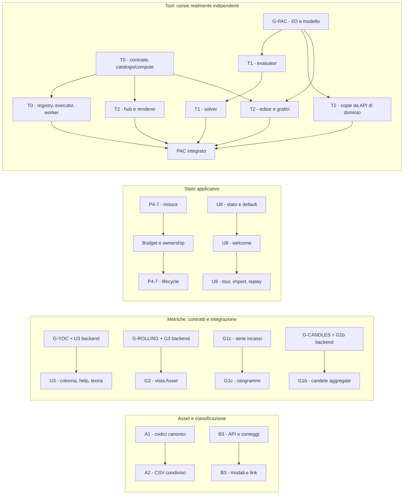

# 06 - Analisi del backlog e piano a sprint

**Data analisi e decisioni:** 2026-09-07

**Baseline:** branch `dev_release2`, commit `a9138140`.

**Stato dell'analisi al 2026-09-07:** proposta pubblicata, senza avvio del codice.

**Coordinamento aggiornato, 2026-09-08 11:30 CEST:** il dev autorizza la ripresa delle
attivita sbloccate dopo il cambio postazione. E continua i fix urgenti import/asset/FX,
diagnostica multiriga E7, cronologia E8 e UX U1/U5/U4/U7/U9 ereditata da A.
Nella stessa data si aggiunge E9: nightly `1.0.1-114` segnalata come aggiornata
rispetto a stable `1.1.0`, con richiesta di mostrare nel banner la versione online
realmente rilevata. Causa da investigare, nessun deploy o accesso al server del dev.
C e D riprendono contratti, minimo pilota PAC `analyze`, dettagli numerici e ASCII;
nessuna approvazione implicita dei gate o avvio delle implementazioni ancora bloccate.
A non riapre i task ceduti; B ha codice pronto nel proprio worktree e attende review
operativa del dev. E conserva la coda esclusiva runtime/build/suite/API sync e i writer
runner/i18n. About/supporto segue E -> C; nessun accesso a produzione `6040`.

**Autorizzazioni successive, 2026-09-08 15:48/15:51:** il dev autorizza C completa sui
file indipendenti, hub/About con link locale-aware, diagnostics sanitizzati per tutti
gli autenticati, job atomico per item e metriche temporali. Niente nuova dipendenza
`jsonschema`: fonte e validazione Pydantic/TypeAdapter. D può implementare schema/core
iniziale P1 e test backend dopo approvazione N1/devC1/X1, non UI/solver/copiedati/Broker.
Questi mandati superano la precedente pausa di codice C/D, non la riserva del server E.
La review manuale E continua; verifiche realmente PURE e writer dei runner vengono
assegnati separatamente, una suite alla volta e senza setup DB o server impliciti.

**Integrazione E, 2026-09-09:** E1-E9 e U1/U4/U5/U7/U9 sono completati e il
pacchetto verificato e' stato applicato al checkout locale `dev_release2`.
La review indipendente ha aperto e chiuso il Round 5 sul challenge pubblico GHCR.
Manifest e prove: [14_feedbackImportUrgent](../14_feedbackImportUrgent/manifest-integrazione-E.md).
Integrazione committata in `ef722b552433028c051ccb1207c84f1072e51bb7`;
sessione/worktree E archiviati localmente il 2026-09-10. L'eventuale spostamento
versionato del piano resta separato. U2, U3, U8, gli sprint non inclusi e
F-MC-1/2/3 restano aperti.

**Infrastruttura di parallelismo, 2026-09-09:** prima di riallineare B/C/D e'
stato aperto il piano
[15_parallelRuntimeIsolation](../15_parallelRuntimeIsolation/plan-phase00ParallelRuntimeIsolation.prompt.md).
Il gate richiede porta e data directory uniche per ogni worktree; la sola porta
non separa SQLite, upload, log e report broker. I default storici restano
invariati. Il gate e' stato consegnato nel commit
`916f12bddf3eb9b8e834e4b9033eb52ce4bde25a` il 2026-09-10; B/C/D stanno
preparando i checkpoint locali prima dell'incorporazione manuale della nuova base.

**Integrazione C+D, 2026-09-10:** la piattaforma Tool C e il PAC D non entrano
separatamente in `dev_release2`. C completa il layer generico e viene fusa dentro
D; D aggiunge plugin/renderer PAC e consegna il pilot `pac-analyze` end-to-end.
Solo la branch combinata D verra' proposta al target. Solver avanzato, copia
portfolio, migrazione Broker e UI dedicata restano fuori da questo pilot.

I worktree C/D sono allineati a `4a73f5f6`; i loro piani devono distinguere contratti
approvati, scelte residue e codice non ancora autorizzato. Il pilota manuale non aspetta
solver completo, copie portfolio o migrazione Broker fractional. Le implementazioni e
i relativi piani di avanzamento restano nei worktree owner fino a integrazione esplicita:
questa nota non importa codice nel checkout principale.

**Integrazione Gruppo B, 2026-09-10:** Contracts/Runes e Round 1 sono stati
riconciliati con E/runtime nel merge `d9e8f6d3`; la review UI reale ha richiesto
un solo compattamento del feedback FX, consegnato in `00c469c3`. La branch B
finale e' entrata in `dev_release2` con il merge `514582a4`. Registro,
contratti, prove e validazione combinata vivono nel
[piano esecutivo](../11_feedbackContractsRunes/plan-phase00FeedbackContractsRunes.prompt.md)
e nel [Round 1](../11_feedbackContractsRunes/plan-phase00FeedbackContractsRunesBugfixRound1.prompt.md).
Gate automatici combinati verdi nella lane B isolata `6151` +
`/tmp/librefolio-r2-b`; nessun terzo sync asset o vecchia ownership runtime B
e' stato ripristinato. Sessione e worktree B archiviati localmente il
2026-09-10; la cronologia resta nel repository.

**Revisione 2026-09-07, confronto successivo:** YOC a 365 giorni e policy del trattino, documentazione/tooltip, estensione esplicita del CSV condiviso, catalogo Tool completo senza endpoint schema/prefill dedicati, mappa di parallelismo e gate UX prima/dopo realizzazione.

**Indice:** [README](README.md). Fonti operative: [00](00_backlog_strutturale_P4.md), [01](01_ux_dashboard.md), [02](02_grafici_avanzati.md), [03](03_asset_dati_classificazione.md), [04](04_brim_import.md), [05](05_pac_allocation_tool.md).

Questo documento distingue quanto esiste realmente, quanto resta da fare e quanto e stato ridefinito con l'utente durante l'analisi. I report archiviati sono fonti storiche, non certificazioni dello stato corrente. Le righe sotto appartengono alla baseline indicata; insieme alla riga viene riportato il simbolo per ritrovare il codice dopo eventuali spostamenti.

Nell'analisi del 2026-09-07 `TODO_FUTURI.md` restava fuori dal lavoro. Il mandato successivo del 2026-09-08 autorizza solo l'aggiunta dei tre temi futuri F-MC-1/2/3, non la loro esecuzione. Non si riaprono regime fiscale, matching LIFO/HIFO, nuove strategie d'investimento o altri rinvii deliberati.

## 1. Come leggere dimensioni, stati e dipendenze

Le dimensioni misurano complessita e ampiezza del cambiamento, **non durata**.

| Taglia | Significato |
|---|---|
| XS | Riconciliazione documentale o modifica locale senza nuova semantica. |
| S | Flusso circoscritto, contratti esistenti, poche superfici adiacenti. |
| M | Piu componenti o un passaggio backend/API/frontend, con casi limite definiti. |
| L | Catena applicativa ampia, orchestrazione, disponibilita dati o modello finanziario da precisare. |
| XL | Nuovo sottosistema, ottimizzazione combinatoria, integrazione trasversale o pipeline finanziaria critica. |

**Gia consegnato** non significa che ogni dettaglio di una vecchia proposta sia stato implementato letteralmente. **Parziale** indica fondazioni riusabili, non una feature pronta. **Gate** indica una decisione o evidenza necessaria prima dell'implementazione interessata.

Dipendenza **hard**: senza quel contratto/dato il task non e implementabile correttamente. Dipendenza di **sequenza**: stessi file o contesto, da modificare ordinatamente; non giustifica bloccare tutta la roadmap.

Abbreviazioni dei percorsi: `B/` = `backend/app/`; `F/` = `frontend/src/`; `T/` = `backend/test_scripts/`; `R/` = `scripts/test_runner/`; `J/` = `LibreFolio_developer_journal/`. I percorsi indicati come **proposti** non esistono ancora.

## 2. Correzioni emerse subito

| Voce | Stato reale e conseguenza |
|---|---|
| Grafico guadagni per transazione | **Gia consegnato** come analisi lotti: `LotsAnalysisPanel`, `LotComparisonChart`, `UnifiedLotsTable`. Non creare un secondo grafico dalla proposta di febbraio. |
| FEE/TAX, presunta Fase 2 mancante | **Allocazione economica e metriche nette gia consegnate in FIFO v4.** `B/services/fifo_lot_engine.py:1038,1199,1281`; `lots_analysis_service.py:616,1335-1393`. Il WAC lordo separato non dimostra che i costi siano ignorati. |
| S6 6.3, quattro `aggregate_*` | **Chiuso per rimozione**, non per adozione. Il report `02_services_core.md:139-142,172-173` registra la decisione; il report 14 e il nuovo backlog l'hanno riportata erroneamente aperta. |
| S6 6.12, fusione settings services | **Risolto con decisione opposta alla fusione:** `SETTINGS_REGISTRY` unico, servizi separati per responsabilita. `settings_service.py:1-16`; piano P2, Lane H4. |
| `mode='duplicate'` | Rimozione confermata. Azioni principali create/edit/clone/delete nella bulk; FormModal usato per view e editing locale del workspace. |
| Sample eToro | **Le righe esistono:** `sample_reports/etoro-export.csv:6-8`. Withdraw Fee vale zero; Withdrawal Conversion Fee ha Amount `-1.36`, ma Realized Equity Change zero. La correttezza di un ulteriore addebito resta da stabilire. |
| Rolling return | Segnale backend gia esistente; finestra in **osservazioni**, non giorni di calendario. La vista principale richiesta non esiste. |
| Cache frontend | Coordinamento di sessione gia presente; registri prezzi non completamente collegati. Pool worker limitato a 8: il rischio non e un numero illimitato di worker. |
| CSV riusabile | `CsvEditor` e `DataImportModal` impongono oggi `date`; non sono importatori arbitrari `name,weight` utilizzabili senza adattamento. |
| Supporto About | About contiene sito/repository/licenza, ma **non ancora la sezione caffe** descritta nel backlog. Va creata insieme all'alternativa social. |
| Marker e Runes | Marker attuali **25**, non 26. Runes legacy nei tre target: **24 + 9 + 10 = 43**, non 42. |

La wiki ha fornito contesto utile su FIFO v4, batch e DataEditor; il grafo dichiara commit `c2f805ce`, data 2026-09-02, 1.618 nodi / 2.278 archi. Le conclusioni sopra vengono dai sorgenti attuali, non dalla freschezza del grafo.

## 3. Decisioni prese con l'utente durante questa analisi

| Area | Decisione che prevale sul backlog iniziale |
|---|---|
| Privacy | **Globale**, con lucchetto aperto/chiuso nell'header autenticato. Nasconde importi e quantita personali; lascia visibili prezzi pubblici, cambi, percentuali e rapporti. |
| Presentazione privacy | Meccanismo condiviso vicino ai campi sensibili. Patina sopra segnaposto, non blur dei numeri reali. Tooltip concettuali invariati; importi personali nei tooltip finanziari coperti. Non e un sistema di autorizzazione o redazione dei log. |
| Header mobile | Nuova voce: scorrendo in basso scompare, scorrendo in alto ricompare. Desktop invariato. |
| Onboarding | Pagina di benvenuto dedicata, preferenze dai default amministratore; poi tour breve in overlay e guida contestuale all'import. |
| Skip e replay | Benvenuto e tour skippabili senza riproposta automatica; riavvio manuale da Settings. Nessun dato demo o salvataggio finanziario automatico. |
| YOC | Distribuzioni lorde per quota nei 365 giorni fino alla data finale del report / WAC unitario residuo. UI `-` sia per nessun reddito sia per storia insufficiente, con motivo distinto; zero noto diverso da dato mancante. |
| Help YOC | Nuova pagina EN nella teoria finanziaria e tooltip nell'header della colonna, condivisa da dashboard e broker. |
| CSV distribuzioni | `weight` in percentuale **0-100**, senza inferenza automatica 0-1. |
| F8a | P&L cumulato gia presente nello storico, non ricalcolo sul solo intervallo selezionato. |
| F8b | **Candele sintetiche/ipotetiche**, non escursioni simultanee osservate. Somma dei contributi OHLC valorizzati con quantita storiche di fine giornata, nella valuta del grafico. Nessun volume. |
| Aggregazione F8b | Compatibilita con daily/weekly/monthly, filtri, zoom e cambio di risoluzione esistenti. Prima aggregazione giornaliera fra asset; poi aggregazione temporale OHLC. |
| Hub Tool | Voce sotto Transazioni nel primo blocco della sidebar; pagina `/tools` con card, predisposta per altri tool. |
| Piattaforma Tool | Plugin backend, endpoint comuni e bulk, autenticazione obbligatoria. Contratti riusabili dal futuro MCP; nessun server MCP in questo round. |
| UI Tool | **Custom-first**, schemi input/output completi e descriptor estensibile. UI standard automatica rinviata a un secondo caso reale. |
| Allocatore | Un unico modello per PAC puro, ribilanciamento e PAC ribilanciante. Il PAC puro parte da patrimonio iniziale zero. |
| Vendite | Supportate come opzione, con limiti per singolo titolo. |
| Aggregazione input | Stesso asset aggregato fra broker; liquidita aggregata **per valuta**, non convertita automaticamente in una sola cassa. |
| Nuova liquidita | Lista di contributi aggiuntivi, uno per valuta, separati dalla liquidita gia esistente. |
| FX nel tool | Conversioni fra casse valutarie proponibili come opzione esplicita. |
| Copia dal portafoglio | Pulsanti espliciti per situazione iniziale, prezzi e distribuzione corrente da usare come punto di partenza del target. Snapshot modificabili, non collegamenti live che sovrascrivono il lavoro. |
| API Tool, revisione | Schemi e parametri necessari alla UI nel catalogo; nessun endpoint schema separato o prefill Tool. Letture dalle API di dominio esistenti, estese solo se manca davvero un dato. |
| Compute eterogeneo | Stesso tool ammesso in piu item con correlation ID distinti. Una richiesta bulk, non necessariamente un solo calcolo; riuso/deduplica solo quando semanticamente sicuri. |
| Parallelismo | I 16 sprint restano riferimenti di scope, non una catena obbligatoria. Task indipendenti in parallelo, file/integrazione/runtime condivisi con ownership esplicita. |
| Confronto UI | Nuove UI o modifiche importanti: viste ASCII approvate dal dev prima della realizzazione; dopo, walkthrough operativo e feedback registrato prima della chiusura. |

## 4. Analisi 00 - debito strutturale

### P4-1 - Scissione di `asset_source.py`

**Stato:** 🟡 in implementazione su K/SP08; monolite ancora presente alla
baseline di avvio. **Taglia:** L. Il file attuale ha 5.106 righe, non 5.162.
`AssetMetadataService` e `compute_metadata_diff` non esistono piu: non ricrearli
per seguire una vecchia mappa.

**Superfici:** `B/services/asset_source.py`: infrastruttura/cache/thread `144-263`; contratto provider e guardia OHLC `271-962`; assegnazioni/metadata `990-1423`; scritture prezzi/eventi `1430-1973`; probe `1980-2129`; query/segnali `2236-2781`; refresh `2788-3364`; quote correnti `3371-3608`; eventi `3615-3906`; CRUD/merge `3914-4680`; ricerca `4688-5106`. Caller: API assets, scheduler, risk, AI Export e provider concreti.

**Approccio:** moduli per responsabilita, non un generico contenitore "bulk" che assorbirebbe quasi tutto. Possibile destinazione **proposta** `B/services/asset_sources/`, con facciata compatibile o migrazione coordinata degli import. Una sola identita per cache, eccezioni e helper di thread.

**Dipendenze:** nessuna hard su altri P4. Sequenziare con B3 delete e S6 6.4, che toccano lo stesso file. Distinguere spostamento meccanico da riscrittura algoritmica.

**Rischi / DoD:** preservare import cycle evitati, auto-discovery, wrapping OHLC una sola volta, query DB-only, quote correnti con write-back, chunk commit, transazioni del merge e invalidazioni. I provider continuano a eseguire I/O sincrono nel thread isolato del manager. Spostare una funzione non basta a chiudere il suo marker C901. Adattare consapevolmente i test che monkeypatchano simboli del vecchio modulo.

### P4-2 - `TransactionService.execute_batch`

**Stato:** 🟡 in implementazione su L/SP16. **Taglia:** XL, non un semplice
dispatch per verbo. `B/services/transaction_service.py:937-1573`: 637 righe,
C901 115 alla misura storica.

**Superfici:** servizio, helper di WAC `1579-1739`, `B/api/v1/transactions.py:83-183`, `B/schemas/transactions.py:704-718`, chiamanti interni di promozione e depositi iniziali del broker.

**Ordine reale da conservare:** parse leniente, autorizzazione, delete, **split prima di update**, create, promote, link, WAC, controlli cost basis, replay saldi, decisione. `commit=True` nel servizio non esegue il commit DB: la transazione resta al chiamante.

**Approccio:** contesto esplicito del batch e stage ordinati; dispatch tabellare solo dove rappresenta davvero queste dipendenze. Non validare/salvare ogni verbo isolatamente.

**Dipendenze:** nessuna hard su scissione asset o nuovo FIFO. S6 6.8 e un alias dello stesso task.

**Rischi / DoD:** preview sempre rollback; commit fallito senza scritture parziali; indici originali, coppie/link UUID, promozioni di righe nuove, errori multipli e WAC stabili. Conservare distinzione `success`/`simulated` e significato di `success_count`, che non equivale sempre a righe persistite. Coprire batch misti, ordine split/update, riferimenti creati nello stesso batch e chiamanti interni.

### P4-3 - Helper BRIM / Credit Agricole

**Stato:** ✅ integrato e developer-accepted con G/SP09. La descrizione seguente
resta la baseline storica usata per caratterizzazione ed estrazione. **Taglia:**
L per il primo provider; M per adozioni successive realmente equivalenti.

**Superfici:** `B/services/brim_providers/broker_credit_agricole.py:929-1620`, `_parse_account_movements`: 692 righe e nove funzioni locali. `_classify_account_row` e gia estratto a `871`. `_brim_io.py` e gia usato da Credit Agricole, Directa, Fineco e Intesa; base `brim_provider.py:387,461`.

I 35 siti C901 BRIM attuali sono 34 nei broker e uno in `_brim_io`, non 35 parser annidati identici. Il valore 71 del parser e una misura storica; la struttura corrente e confermata, senza presentare quel numero come rimisurato.

**Approccio:** prima contesto e fasi locali: prepass identita/nominali, risoluzione trade, redditi/ritenute, emissione/notices. Promuovere in helper comune solo semantica realmente condivisa e con secondo utilizzatore. Il codice attuale usa fake ID **positivi alti e decrescenti** (`schemas/brim.py:42-49`): conservare il contratto reale.

**Dipendenze:** caratterizzazione completa dell'output prima dell'estrazione. Nessuna dipendenza hard da eToro o da FEE/TAX gia consegnati. S6 6.14 vieta la campagna indiscriminata, non questo refactor mirato.

**Rischi / DoD:** parita di transazioni, valuta, numeri verbatim, ordine, fake ID, `tx_index`, evidenze e notice; layout titoli e movimenti distinti; niente FX nel parser. Version bump solo se cambia output. La rifattorizzazione migliora testabilita, ma i test di errore esistenti dimostrano che non e una precondizione per qualunque nuova copertura.

### P4-4 - Yahoo `get_history_value`

**Stato:** 🟡 in implementazione su K/SP08. **Taglia:** M.
`B/services/asset_source_providers/yahoo_finance.py:284-482`, C901 31 alla
baseline. `_sync_fetch_history` e citato in commenti, non e un helper implementato.

**Superfici:** fetch/retry `79-113,329-368`; mapping DataFrame `370-425`; dividendi/split `428-472`; costruzione risultato/errori `474-482`.

**Approccio:** separare acquisizione, conversione punti e parsing eventi, mantenendo `_yf_with_retry` comune.

**Dipendenze:** nessuna hard; coordinare gli import con P4-1, non attendere la sua conclusione.

**Rischi / DoD:** `min` resta `period="max"`; date inclusive, NaN, valuta fallback, errori tipizzati e eventi best-effort invariati. Niente nuovo `to_thread` dentro il provider gia isolato. I test offline esistenti sono la base; non serve dipendere dalla disponibilita live di Yahoo per dimostrare la parita del refactor.

### P4-5 - Migrazione Runes mirata

**Stato:** ✅ integrato tramite B/SP05 (`514582a47`), incluse le correzioni di
review nel [piano dedicato](../11_feedbackContractsRunes/plan-phase00FeedbackContractsRunes.prompt.md).
**Taglia:** M.

| Target reale | Legacy alla baseline | Punti sensibili |
|---|---:|---|
| `F/lib/components/brokers/BrokerSharingPanel.svelte` | 24 `$:` | Props `43-50`, derivati `112-146`, reload `202`, save e `await tick()` `392-402`. |
| `F/lib/components/settings/tabs/PreferencesTab.svelte` | 9 `$:` | Dirty/default `114-125`, save/undo/reset `155-271`. |
| `F/lib/components/settings/tabs/GlobalSettingsTab.svelte` | 10 `$:` | Locale `307`, modifiche `335-344`, categorie `360-383`, cleanup `390-407`. |

**Dipendenze:** precedere o coordinare l'estrazione dei controlli per onboarding. Nessuna migrazione generale di tutti i componenti legacy.

**Rischi / DoD:** zero `$:` nei tre target, stessi binding/callback, permessi e reload; nessun loop di fetch da dipendenze accidentali degli effetti. Preservare chiusura dopo salvataggio, self-leave/ultimo owner, risultati parziali e applicazione di lingua/tema solo secondo il comportamento previsto.

### P4-6 - Matrice dichiarativa `SignalResult`

**Stato:** ✅ integrato tramite B/SP04 (`514582a47`) nel
[piano dedicato](../11_feedbackContractsRunes/plan-phase00FeedbackContractsRunes.prompt.md).
**Taglia:** M. Baseline: `B/schemas/signals.py:1050-1115`, C901 32; stati a `194-199`.

**Superfici:** validatore, `SignalAvailability`, costruzione risultati in `signal_service.py:791-1127`, test schema/servizio. Consumatori Asset, FX, risk e AI Export.

**Approccio:** tabella di presenza/assenza piu predicati semantici nominati. Conservare sottomatrice FAILED precompute/runtime, eccezione `PARTIAL_UNDEFINED_METRIC`, allineamento serie e coppia `risk_metadata`/`data_quality`. Non sostituire gli if con un dizionario opaco di lambda.

**Dipendenze:** nessuna hard da un nuovo stato; la nuova vista rolling offre vicinanza di contesto. S6 6.7 e lo stesso task.

**Rischi / DoD:** stesse combinazioni ammesse/rifiutate, controllo ordinato prima dei dereference, errori utili e isolamento plugin invariati. Nessun cambio agli enum o all'omissione dei risultati indisponibili.

### P4-7 - Ciclo di vita cache frontend

**Stato:** parziale; ritenzione presente, dimensione del problema non ancora misurata. **Taglia:** L, separando diagnosi/policy e implementazione.

**Superfici:** `assetPriceStoreRegistry.ts:39,64,89-116`; `fxStoreRegistry.ts:119`; `core/TimeSeriesStore.ts`; `workers/priceProcessingPool.ts:23,66,97`; `workerPool.ts:119-139`; `stores/app/clientSession.ts`; `stores/portfolio/portfolioStore.svelte.ts:130-206`.

**Gia esiste:** confine di sessione, generazioni e reset in diversi store; rimozione FX al delete; pool al massimo 8 worker. `invalidateCurrencyGraph` e stato eliminato perche il grafo delle capacita e statico: non ripristinarlo.

**Dipendenze:** misurare entry, punti, intervalli, richieste e riferimenti trattenuti prima di scegliere budget/LRU o altro criterio. Coordinare uso condiviso tra lista, dettaglio, confronti e segnali.

**Rischi / DoD:** cancellare una entry non invalida oggetti gia referenziati; una risposta tardiva puo ripopolare lo store dopo logout; distruggere il pool all'unmount di un consumatore interrompe gli altri. Definire ownership, guardie di generazione e rilascio con promesse sempre risolte/rifiutate. Non cancellare preferenze persistenti insieme ai dati effimeri. Il limite va applicato anche alla crescita di una singola serie, non solo al numero di asset.

### P4-8 - Coda S6, deduplicata

| Voce | Stato / taglia | Superfici, dipendenze e rischio principale |
|---|---|---|
| S6 6.2 `is_chain` / `providers_used` | Parziale, M | Proprieta DB `models.py:899-911`; DTO `schemas/fx.py:400-439`; API `fx.py:719-849`; frontend FX `+page.svelte:310-316`, `[pair]/+page.svelte:676-682`. Esporre dato derivato senza renderlo input obbligatorio; `providers_used` set non sostituisce la sequenza ordinata con ripetizioni `CHAIN:MOCKFX+MOCKFX`. Distinguere membership, percorso e MANUAL. Hard handoff schema -> API sync -> consumer. Nessuna migrazione DB. |
| S6 6.3 quattro `aggregate_*` | Gia chiuso, XS documentale | Rimossi per decisione P1. `DerivedViewsBuilder.build_data_quality_report`, `portfolio_engine.py:1656`; caller arricchiti `portfolio_service.py:1209,2047`. Non reintrodurre helper che perderebbero politiche di qualita/metadati. |
| S6 6.4 `bulk_refresh_prices` | Aperto, L | `asset_source.py:2788-3364`: prepare, fetch, confronto cambiamenti, persist esistono come closure, non come fasi estratte. C901 62; `_fetch_single` 22. Coordinare con P4-1. Preservare sessione distinta per persist, resume/min, cache, timeout, filtro valuta, risultati parziali e commit a chunk; non promettere atomicita che oggi non c'e. |
| S6 6.7 | Alias P4-6 | Nessun secondo task o seconda stima. |
| S6 6.8 | Alias P4-2 | Nessun secondo task o seconda stima. |
| S6 6.11 assert AI Export | Aperto, S | 17 assert strutturali, su 51 totali; 34 contestuali fuori scope. Elenco sotto. Nessun cambio cataloghi/versioni/dataset. |
| S6 6.12 settings services | Gia risolto, XS documentale | Decisione P2-9: non fondere. `schemas/settings.py:286-360` registry; `settings_service.py:1-16` responsabilita; `global_settings_service.py:1-19` accessor. Conservare typed user settings vs chiavi globali. |
| S6 6.14 BRIM generale | Non attivare come campagna | Consolidato nei limiti di P4-3: un provider alla volta, nessuna astrazione universale dedotta dai soli C901. |
| TRY003 | Congelato | `pyproject.toml:71-102` non abilita TRY/TRY003. Non aggiungere ignore inutile, non abilitare la famiglia per questo lavoro. |

**S6 6.11 - siti strutturali esatti**, relativi a `B/services/ai_export/`: `components/catalog.py:219-221` (3); `components/asset_fx_registry.py:140-143` (4); `components/portfolio_broker_registry.py:146-148` (3); `datasets/catalog.py:867,973` (2); `analyses/catalog.py:241` (1); `temporal/policy.py:80-81` (2); `dependencies.py:112-113` (2).

**DoD S6 6.11:** tutti i 17 invarianti continuano a fallire anche con Python `-O`; stessa precocita di errore, eccezioni del layer corretto, nessun ciclo di import nuovo. Le 34 asserzioni contestuali non diventano una campagna collaterale. Usare istruzioni/skill AI Export pertinenti in esecuzione, senza lanciare indiscriminatamente probe di prompt per un refactor di invarianti.

## 5. Analisi 01 - UX, shell e onboarding

### U1 - Reset "Testa configurazione"

**Stato:** bug confermato nel flusso di stato; non e in `resolveProviderError`. **Taglia:** S-M per includere le risposte tardive, non solo cancellare una label.

**Superfici:** `ProviderAssignmentSection.svelte:102-105,264-294,352-393,448-452`; `AssetModal.svelte:674-738,870-898,943-1099,1987-1996`; helper `providerProbe.ts` e test dei due componenti.

Il figlio conserva `testResults`/durata; il parent conserva un altro `providerTestStatus`. Cambio provider manuale azzera alcuni campi, cambio parametri o assegnazione programmatica dalla ricerca no. Auto-probe e metadata partono parallelamente dalla selezione e possono applicare risultati di A quando e gia selezionato B.

**Dipendenze:** nessuna backend. **Approccio:** identita completa della configurazione e generazione del draft; invalidazione comune di stato, dettagli e durata su ogni mutazione rilevante. Ignorare risposte obsolete in entrambi i probe e nella metadata concorrente, senza cambiare classificazione soft/real errors.

**Rischi / DoD:** A -> B, A -> B -> A, modifica parametri, assenza provider, chiusura/riapertura e risposta fuori ordine non mostrano stato o URL del contesto precedente. Il gate "Save without testing" rimane allineato all'esito corrente. Correggere la race metadata nello stesso cambio, non avviare una riscrittura del form.

### U2 - Privacy globale

**Stato:** assente; scope ampliato dall'utente rispetto a dashboard-only. **Taglia:** XL per copertura globale corretta, non S-M per un toggle cosmetico.

**Superfici esistenti:** `layout/Header.svelte`; `stores/app/clientSession.ts`, `auth.ts`, `utils/storage.ts`; componenti numerici come `TweenedValue`, `CompactCashCell`; DataTable e celle di transazioni/posizioni/lotti; chart e tooltip; pagine dashboard, broker, transazioni, dettagli con dati personali e nuovo Tool.

**Proposta:** store globale per sessione/account e primitive **proposte** `SensitiveValue` / `SensitiveRegion`; classificazione esplicita dei campi. WAC, prezzi di esecuzione personali, controvalori, incassi, cash e quantita sono sensibili; quotazioni pubbliche, FX, percentuali, rapporti, date e conteggi non lo sono per definizione del solo valore numerico.

Patina decorativa sopra segnaposto di forma stabile. Non mantenere il numero reale sotto CSS blur, in `title`, testo screen-reader o attributi accessibili. Non serve randomizzare cifre finanziarie reali. I grafici monetari personali richiedono rendering protetto o sostituzione esplicita della regione, non solo un overlay sopra il canvas originale.

**Dipendenze:** inventario delle superfici prima di esporre il lucchetto; integrare anche PAC e nuove viste P&L. Riusare il confine account esistente. Attenzione: il primo `ClientSessionState.transition` non esegue resetter; osservare anche l'identita iniziale. `getUserStorage` legge lo store auth, che puo essere ancora il precedente account durante la transizione: id del nuovo confine prima di idratare la preferenza.

**Rischi / DoD:** nessun flash iniziale del dato con privacy persistita; niente recupero tramite tooltip finanziari o colonne opzionali; invalidare tooltip ECharts gia aperti e portali su `document.body`. Coprire lotti, risk monetario, modali e input sensibili senza renderizzare il valore sotto patina. Azioni di modifica/rivelazione devono avere comportamento esplicito. Prezzi pubblici e FX restano utilizzabili. Nessuna promessa di protezione contro DevTools, API, allegati, log o export grezzi: la UI deve chiarire questo confine.

**Gate UX:** prima viste ASCII di lucchetto, campi/regioni mascherati, input e modali in desktop/mobile; approvazione dev. Dopo integrazione, walkthrough dei percorsi protetti e raccolta feedback secondo G-UX-DESIGN/G-UX-REVIEW.

### U3 - Yield on Cost

**Stato 2026-09-11:** ✅ **IMPLEMENTATO, VERIFICATO E DEVELOPER-ACCEPTED**
nel checkpoint H `74afcebce`; il merge target e' in corso. Contratto,
storyboard, correzioni review ed evidenze nel
[piano H dedicato](../19_yieldOnCost/plan-phase00YieldOnCost.prompt.md).
**Taglia:** M backend + S UI/docs, con hard handoff cache FX dal workstream F.

**Superfici:** `B/schemas/portfolio.py`; `portfolio_service.py`; nuovo servizio
YOC; eligibility/replay FIFO; `F/lib/components/dashboard/ExposureTable.svelte`
e relativo test. F resta owner di `portfolio_engine.py`.

`asset_income` e `cash_yield` dei lotti sono cumulativi; l'annualized return
corrente include P&L e costi. Nessuno e' YOC. Gli income importati via BRIM
contano quando sono Transaction asset-linked e seguono lo stesso replay D-1.

**Contratto finale 2026-09-10:** fonte esclusiva sono le Transaction
asset-linked DIVIDEND/INTEREST, i cui importi sono lordi. TAX/FEE, provider e
AssetEvent income non entrano. Scope `(asset_id, broker_id)`, quantita' LONG
eleggibile EOD D-1, paying-broker e transfer-aware. Finestra mobile di
**365 giorni**, dal giorno `T - 364` a `T` inclusi, indipendente dal
`date_from`.

$$
\operatorname{YOC}_{a,b}(T)=
\frac{\sum_i
\operatorname{FX}(A_i,d_i)/
\left(Q^-_{a,b}(d_i)\prod_{d_i\le s\le T}r_s\right)}
{\operatorname{WAC}_{a,b}(T)}
$$

Ogni incasso e' normalizzato alla quantita' che lo ha generato; split e FX lo
portano all'unita'/valuta del WAC residuo. Same-day BUY escluso, same-day SELL
incluso. Nessun carry income automatico verso il broker destination.

**Disponibilita:** DTO nested typed `available | no_income | unavailable`, con
provenance transaction-ledger, finestra e actual FX rate date.

| Condizione | Contratto numerico | Cella / spiegazione |
|---|---|---|
| Income validi, eligibility/split/FX/WAC validi | Frazione YOC non negativa | Percentuale a 2 decimali, senza `+`; income registrato a zero espone `0.00%` + `net_zero`. |
| Nessun income e prima tx coppia `<= T-364` | Zero noto, `no_income` | `-`, nessuna icona problema. |
| Nessun income e coppia piu' giovane | `unavailable/insufficient_history` | `-` + custom info Tooltip. |
| Orphan/replay/split/FX/WAC non valido | `unavailable` con reason | `-` + custom info Tooltip; mai partial/fallback. |

L'age usa la prima transaction storica della coppia e non si resetta dopo
close/rebuy. Ogni holding e' applicabile, inclusi crypto/manual; nessun
`not_applicable`.

**Dipendenza verificata:** F ha integrato
`compute_portfolio_fx_cache_identity(db, scope_broker_ids, target_currency, date_to) -> str`
nella L1. H invoca la stessa funzione e riusa la string identity nella L2 per
tutti i report portfolio, aggiungendo solo dipendenze ledger/split YOC.
Nessuna seconda helper o separazione rate/route. Il follow-up integrato in
`b5ed1a623` aggiunge `Transaction.cost_basis_currency` alla dependency identity
e copre identity/L1 con una terza valuta presente solo nel CBO.

**Rischi / DoD:** D-1 identico al FIFO, vendite parziali non gonfiano il
rapporto, transfer/split/FX fail-closed, cache non stale. Colonna **visibile di
default**, accanto ad Annualized; l'override DataTable user-scoped resta
condiviso fra Dashboard e Broker.

**Documentazione e help:** pagina EN implementata
`mkdocs_src/docs/financial-theory/technical-analysis/performance-metrics/portfolio-engine/yield-on-cost.en.md`
tramite docs-writer, indici/nav/guide posizioni, senza traduzione automatica.

Tooltip header: formula transaction-ledger/D-1 e teoria. Solo genuine
unavailable mostrano info icon di cella con custom Tooltip accessibile; il
normale no-income non appare come errore.

**Gate UX:** storyboard desktop/mobile v1 **APPROVED 2026-09-10**; review
operativa Dashboard/Broker, persistence, mobile/dark, tooltip e gesture guida
completata e accettata dal developer il 2026-09-11.

### U4 - Filtro utente Files

**Stato:** UI mancante, API sufficiente gia disponibile. **Taglia:** S.

**Superfici:** `routes/(app)/files/+page.svelte:50-58,193-210,732-766`; `components/files/FilesTable.svelte:25-44,182-200`; `FileGrid`; `utils/urlFilters`; `UserSearchSelect.svelte`; `utils/colors.getIndexColor`.

`GET /api/v1/admin/users` non esiste, ma **non serve aggiungerlo**: `B/api/v1/users.py:22-40`, `/users/search?q=`, elenca utenti attivi con campi minimi. `user_service.py:362-416` conferma il comportamento. `uploaded_by_user_id` e gia in upload statici e report BRIM (`schemas/uploads.py:24`, `schemas/brim.py:150`).

**Dipendenze:** nessuna nuova API/DB. Filtrare l'**uploader**, non il proprietario del broker; solo i file gia visibili secondo i permessi correnti.

**Rischi / DoD:** dropdown e colonna nel contesto multiutente; badge stabili per id; stessa selezione in lista/griglia e URL deep-link, refresh e cambio tab. Uploader disattivati/sconosciuti/null non fanno sparire file: voce esplicita per id/non disponibile. Non introdurre una nuova policy di accesso ai file, non usare il parametro `admins=true` per popolare il normale elenco utenti.

**Confronto UI:** microvista ASCII della toolbar/colonna utente prima del cambiamento; dopo, percorso operativo per provare lista, griglia e filtri con piu uploader.

### U5 - Tooltip "Valuta"

**Stato:** mancante. **Taglia:** XS-S.

**Superfici:** `AssetModal.svelte:1735-1749`; `Tooltip.svelte`; chiave i18n in quattro lingue.

**Dipendenze:** nessuna. **DoD:** spiega valuta delle quotazioni/negoziazione del provider, distinta da denominazione e valuta di visualizzazione del portafoglio/FX. Non confonderla con `quote_base_quantity`. Help accessibile anche su mobile; nessuna modifica al comportamento di cambio valuta.

### U6 - Duplicate-mode

**Stato:** gia consegnato. **Taglia residua:** XS documentale.

**Evidenze:** `TransactionFormModal.svelte:94` contiene create/edit/view; `transactions/+page.svelte:195-200,618-629,783-803` apre bulk con intent; broker `+page.svelte:81,756-764`; dashboard `+page.svelte:785` monta FormModal in view.

**Dipendenze/rischi:** nessuna nuova feature. Non rimuovere il FormModal vivo per interpretare troppo letteralmente "tutto passa dalla bulk".

**DoD:** voce confermata chiusa, rimandi corretti; eliminare la nota duplicate copiata per errore in fondo alla sezione onboarding.

### U7 - Supporto: caffe e social

**Stato:** caffe nel popup gia esistente; area About e social da aggiungere. **Taglia:** S.

**Superfici:** `components/auth/DonationPopupModal.svelte:1-82`; `settings/tabs/AboutTab.svelte:255-290`; nuovo blocco riusabile **proposto** di support actions; i18n. Trigger backend `auth.py:111` e `donation_popup_service` invariati.

**Contratto:** caffe + X + Reddit esclusivamente nel popup post-login e in About. Header, HelpMenu e pagina pubblica di login **non ricevono social**. URL di condivisione verso sito/repository pubblico, mai hostname locale dell'istanza o dati di portafoglio. Testo nella lingua attiva al click; URL encoding.

**Dipendenze:** nessuna backend. Coordinare popup con onboarding, senza cambiare la cadenza donazioni.

**Rischi / DoD:** un componente condiviso evita testi/hook divergenti; azioni social aprono una bozza sulla piattaforma, non pubblicano automaticamente. Preservare regole di chiusura volontaria del popup e definire esplicitamente dismiss sulle nuove azioni. Quattro lingue, `noopener noreferrer`, nessun nuovo tracking o caricamento social automatico.

**Gate UX:** viste ASCII dei due host, popup e About, prima della realizzazione; review dopo con istruzioni per raggiungere About e mostrare il popup in ambiente di sviluppo, senza alterare la cadenza reale.

### U8 - Onboarding: specifica ora delineata con l'utente

**Stato:** non implementato. La vecchia stima M e stata sospesa prima del confronto; **taglia raffinata L** dopo le decisioni, con tre incrementi distinti.

**Fondazioni:** `settings_service.py:58-77` crea preferenze dai default globali; `settings.py:67-99,107-130` espone lettura/scrittura; `UserSettings` e una tabella a colonne, non JSON libero (`models.py:330-356`). `auth.py:111,138-145` gestisce contatori login e restituisce settings eventualmente assenti. `user_service.create_user:146-160` non crea le preferenze.

**Superfici:** nuova route benvenuto **proposta**, guardia `(app)/+layout.svelte:83-119,137-162`, auth/settings/session store, modelli/schema/stato onboarding e migrazione incrementale; `SettingSelect`, `SettingCurrency`, `ImagePickerWrapper`; Settings per replay; nuovo controller/overlay del tour; hook del wizard import.

**Benvenuto:** saluto, lingua e valuta dai default amministratore; avatar opzionale con fallback corrente dell'app. Non esiste un default globale avatar da inventare. Tema eredita il default gia supportato. Non montare GlobalSettingsTab nel welcome: carica amministrazione e scheduler. Non riusare senza adattamento il salvataggio immediato avatar del ProfileTab se il nuovo form e staged.

**Tour breve proposto, basato sulla guida:** Transazioni/Importa come percorso iniziale; Broker per conti e condivisione; Asset per catalogo e provider; Dashboard per leggere il risultato. Punto finale su help/Settings e replay. La voce Tool puo essere introdotta quando la piattaforma e effettivamente disponibile, senza bloccare l'onboarding.

**Mini-tour import:** avvio dal primo uso del wizard, caricamento e broker creato sul posto, selezione/parser, analisi, eventuali unificazione/correzioni/duplicati, risoluzione asset, consegna alla bulk e significato di Save All. Passi basati sulle sezioni realmente presenti, non indici fissi. Non richiedere un report per terminare il tour breve; niente file demo, click automatici su Import/Save All o transazioni generate dal tour.

**Persistenza:** distinguere benvenuto, tour introduttivo e tour import, con stato/versione e skip esplicito. Non dedurre completamento dal contatore login. Nuovi utenti entrano automaticamente; utenti esistenti non vengono forzati a rifare setup, ma possono avviarlo manualmente. Il piano esecutivo deve fissare la migrazione di questa distinzione.

**Dipendenze:** controlli preferenze e confine account; sequenza con P4-5 e U9. Coordinamento dei popup donation/update per non sovrapporre overlay.

**Rischi / DoD:** skip persistente e replay richiesti; errore di salvataggio non segna completato; refresh, deep-link e cambio account non perdono/trasferiscono lo stato. Target reali `data-testid`, attesa di disponibilita e navigazione, focus/tastiera/reduced-motion/mobile; nessuna attesa cieca. Header/sidebar ancorati quando il tour li indica.

Guide lette e da riallineare in esecuzione: [Getting Started](../../../../mkdocs_src/docs/user/getting-started.en.md), [Import how-to](../../../../mkdocs_src/docs/user/transactions/import/how-to.en.md), [Preferences](../../../../mkdocs_src/docs/user/settings/preferences.en.md), [Profile](../../../../mkdocs_src/docs/user/settings/profile.en.md).

**Gate UX:** storyboard ASCII di welcome, tour breve, passi import condizionali, skip/replay ed errori, anche mobile. Il dev approva prima delle UI; dopo riceve istruzioni per account nuovo, replay, refresh e interruzioni e registra feedback operativo.

### U9 - Header mobile auto-hide, nuova richiesta

**Stato:** comportamento richiesto assente. **Taglia:** S-M.

**Evidenza:** `layout/Header.svelte:16-24` dichiara intenzionalmente header mobile in flusso normale, dopo problemi di flicker di un precedente toggle scroll; desktop `lg:sticky`. Il problema segnalato e coerente col codice.

**Superfici:** Header, layout per stato menu/overlay, eventuale action/helper scroll **proposto**, verifiche mobile. Nessun cambio desktop.

**Dipendenze:** coordinare lo stesso header con privacy e tour. **Rischi / DoD:** header sticky mobile con trasformazione, direzione e isteresi, senza saltare il layout; subito visibile tornando in alto o cambiando pagina; mantenuto visibile durante focus/menu/tour. Gestire resize, safe-area, scroll annidati e pulizia listener. Non ripristinare il vecchio flicker, non nascondere controlli che hanno focus.

**Gate UX:** ASCII dei due stati e delle eccezioni menu/focus/tour; approvazione prima. Review dopo con pagina lunga, gesti giu/su e viewport mobile, non soltanto una schermata statica.

## 6. Analisi 02 - grafici e rendimenti

### G1a / F8a - Vista P&L assoluto

**Stato:** presentazione mancante, dato gia presente. **Taglia:** S.

**Superfici:** `GrowthChart.svelte:53,154-162,309-333,431-508,732-744`; `B/schemas/portfolio.py:413-437`, `DerivedViewsBuilder.build_history:1543-1570`. La serie `total_pnl` e gia nello storico e nel tooltip.

**Dipendenze:** nessuna nuova fonte. Usare il P&L cumulato concordato. **Rischi / DoD:** terza vista senza residui cash/NAV/costo, asse e tooltip coerenti, valori zero/negativi, filtri broker/valuta/date, daily/weekly/monthly e zoom invariati. Non rebasare al primo punto visibile. Componente condiviso compatibile con il suo mount broker, senza duplicarlo.

**Gate UX:** ASCII di toolbar/nuovo modo e assi, feedback prima; dopo walkthrough del selettore P&L e delle risoluzioni con confronto operativo del dev.

### G1b / F8b - Candele sintetiche P&L

**Stato:** mancante; richiesta **ridefinita e approvata come sintetica**. **Taglia:** L. Non richiede una nuova piattaforma intraday; non puo essere venduta come intervallo realmente osservato del portafoglio.

**Superfici:** storico portfolio `schemas/portfolio.py:413-437`, `portfolio_engine.py:445,1543-1570,2047-2110`, resolver/preparazione prezzi e serializer report; `GrowthChart`; `timeSeriesAggregation.ts:94-195`; cache/tooltip/controlli di risoluzione del grafico.

**Contratto finanziario:** per ogni giornata usare quantita detenute a fine giornata, con ownership, quote-base e valuta corretti; valorizzare aperture/massimi/minimi/chiusure dei componenti e sommarli. Mantenere la chiusura coerente con il P&L canonico, usando le componenti non-prezzo del report come offset comune. Il piano esecutivo deve specificare questa ancora e la politica FX giornaliera: non trasformare NAV in P&L dimenticando costo, cashflow o redditi.

Per posizioni negative gli estremi devono essere orientati correttamente; non moltiplicare due volte per il peso una quantita gia scalata. I cambi giornalieri non forniscono estremi FX intraday. OHLC assenti, prezzi da ultimo trade, quote stale o serie sintetiche richiedono copertura/stato espliciti, non zeri o invenzioni silenziose.

**Compatibilita aggregata obbligatoria:** prima candela giornaliera cross-asset, poi bucket temporali. `aggregateOHLCV` mantiene prima apertura, massimo high, minimo low, ultima chiusura; volume sempre assente/null. Non sommare giorni, non aggregare ogni asset sull'intera settimana prima della composizione giornaliera.

Conservare settimane ISO e mesi UTC, `bucketStart`, `bucketEnd`, `representativeDate`, range logico, cache di risoluzione e auto daily/weekly/monthly basata su viewport. Il cambio serie deve preservare zoom e cancellare tooltip ECharts obsoleti (`GrowthChart.svelte:513-563`).

**Dipendenze hard:** contratto sintetico e dati OHLC per le giornate richieste. Il refactor P4-1 non e una precondizione. Riuso della riduzione temporale frontend come presentazione; composizione economica giornaliera nel backend.

**Rischi / DoD:** label e spiegazione "sintetico/ipotetico" in tutte le risoluzioni; nessun volume, nessun uso implicito come volatilita statistica, intraday reale o input risk/AI fattuale. Fixture con massimi di asset in giorni diversi per proteggere l'ordine di aggregazione; quantita mutate, short, split, FX, bucket parziali, zoom/resize/theme e cambio account. Richiesta on-demand e chiave cache coerente, senza appesantire ogni report che non usa le candele.

**Gate UX:** ASCII di candele/legenda/label sintetica, viewport aggregata, tooltip e caso senza OHLC, desktop/mobile. Dopo: percorso per selezionare il modo, cambiare risoluzione/zoom e verificare gli stati degradati insieme al dev.

### G1c / F8c - Istogrammi dividendi/interessi

**Stato:** totali gia presenti, serie temporale richiesta assente. **Taglia:** M.

**Superfici:** `KpiSection.svelte:144-147,275`; `PortfolioSummary.period_income`; `portfolio_engine.py:925-944`; `portfolio_service.py:1482-1511`; schema report e chart.

**Dipendenze:** serie backend di incassi contabilizzati, distinti per tipo e data, con stesso scope e FX del report. I marker income dei lotti non coprono incassi senza asset; `cash_from_generated_returns` non e un sinonimo.

**Rischi / DoD:** dividendi e interessi separati; somma nel periodo riconciliata col KPI `period_income`; assetless, ownership, storni/correzioni e FX coerenti. Nei bucket i flussi si **sommano**, non si prende l'ultimo valore come per NAV/P&L. Aggregazione economica backend e calendario compatibile con i grafici. Distinguere zero da dato indisponibile. Privacy globale rispettata.

**Gate UX:** ASCII delle barre/legenda e dei casi zero/missing prima; review dopo con istruzioni per periodo, tipo di reddito, aggregazione e lettura del risultato.

### G2 - Guadagni per transazione

**Stato:** gia consegnato nello scopo funzionale. **Taglia residua:** XS documentale.

**Superfici reali:** `LotsAnalysisPanel.svelte:158-189,225-241,478`; `LotComparisonChart.svelte:926-1085,1390-1451`; `UnifiedLotsTable.svelte:434-648`; mount dashboard `:723-724`, broker `:588`.

Esistono tabella dei buy/lotti, valore residuo, incassi da vendite, redditi, confronto valore/rendimento abs/%, area aggregata, linee per piu lotti e marker buy/sell. Metriche nette sono in tabella, custody e tooltip Gantt.

**Differenze dalla vecchia proposta:** non un unico grafico doppio asse; con un lotto la sola area aggregata; niente selettore LIFO/HIFO. WAC/PMC esiste come altra metrica, non come metodo selezionabile di matching.

**Residui non promossi:** curve nette parallele nel comparison chart, esplicitamente rinviate dal piano v4; disegno letterale delle doppie frecce. Non trasformarli tacitamente in un nuovo sprint. Il test E2E che cerca `lots-value-presentation-filter` e ritorna se assente non dimostra l'esistenza di quel vecchio controllo.

### G3 - Rendimento a N giorni in Asset

**Stato:** parziale. **Taglia:** M, con gate sul lookback calendario.

**Superfici:** `B/services/signal_plugins/rolling_return.py:37-125`, `risk/signal_helpers.py:69-84`, `series_preparation.py:236-299`; `F/routes/(app)/assets/[id]/+page.svelte:166-167,609-636,816,1113-1178,1942-1966,2062-2092`.

`RISK_ROLLING_RETURN` e gia asset-only, finestra 1-500, warm-up e asse percentuale; conta osservazioni. Anche ROC conta punti, non risolve automaticamente il requisito calendario.

**Approccio:** vista principale alternativa che usa il contratto segnali backend. Preservare i segnali esistenti a osservazioni; introdurre semantica calendario esplicita per la nuova richiesta. Definire ricerca del prezzo alla data N giorni prima, lookback prima del range, staleness e indisponibilita.

**Dipendenze:** dati anteriori e contratto di disponibilita; vicinanza a P4-6, non obbligo di riscrivere tutta la piattaforma.

**Rischi / DoD:** rendimento price-only, non prezzo ne YOC/total return; nessuna formula finanziaria nuova in TypeScript. Nessun rebase al cambio zoom e nessuna doppia trasformazione con il normale modo percentuale (`priceChartHelpers.ts:178`). Ritorni non modificabili come prezzi; missing/zero reference non diventa zero rendimento. Aggregazione visuale coerente col profilo del segnale.

**Gate UX:** ASCII della vista alternativa, selettore N, asse e indisponibilita; dopo istruzioni dal dettaglio Asset per attivarla, cambiare finestra e confrontare prezzo/rendimento con il dev.

## 7. Analisi 03 - classificazione e CSV

### A1 - Settori Corporate / Governativi

**Stato:** mancanti. **Taglia:** S; M se si estende l'inferenza oltre mapping espliciti.

**Superfici:** `B/utils/sector_fin_utils.py:14-91`; `schemas/assets.py:473-530`; `api/v1/utilities.py:71-93`; `portfolio_engine.py:65-80`; `F/lib/utils/assetTypes.ts:97-123`, `stores/reference/sectorStore.ts`, `DistributionEditor`; quattro lingue.

Il backend elenca 12 settori incluso Other; esiste un fallback frontend da aggiornare. Due mappe emoji vivono in utilities e portfolio. Borsa Italiana mappa gia tipologie governative e corporate a **Financials** (`borsa_italiana.py:223-249`): aggiungere solo il selettore lascerebbe l'auto-metadata incoerente.

**Approccio:** nuove chiavi canoniche e alias; mapping delle tipologie esplicite Borsa. JustETF passa gia le distribuzioni al normalizzatore; Yahoo usa il settore disponibile. Non dedurre corporate/governativo dal solo `AssetType.BOND`, non riclassificare tutti i vecchi Financials in massa. Sovranazionali e casi ambigui restano fuori dall'inferenza automatica non approvata.

**Dipendenze:** precede A2 per nomi canonici. **Rischi / DoD:** enum/lista, fallback, i18n, selettore, emoji e allocazione coerenti; metadata nuovi corretti, dati manuali conservati. Nessuna migrazione di colonne DB; eventuali aggiornamenti dati solo espliciti.

### A2 - Import CSV geografico/settoriale

**Stato:** mancante; pattern riusabile solo in parte. **Taglia:** M, non semplice wrapper.

**Superfici:** `DistributionEditor.svelte:46-60,129-165`; `CsvEditor.svelte:37-40,113-145`; `DataImportModal.svelte:70-78,150-157,268-273`; `PriceDataImportModal`; `assetPayload`; normalizzatori/schema distribuzioni.

**Contratto concordato:** colonne `name,weight`, percentuali 0-100; preview con codice canonico e peso; applicazione alla sola distribuzione selezionata del draft. Salvataggio persistente rimane quello dell'asset.

**Decisione di riuso, precisata il 2026-09-07:** **estendere il `CsvEditor.svelte` gia condiviso** da prezzi/eventi Asset e tassi FX, insieme a `DataImportModal.svelte`. Niente secondo editor/parser indipendente per la classificazione. Una wrapper di dominio puo configurare i componenti condivisi, non duplicarli.

Rendere configurabili colonna/identita primaria e validazione: `date` rimane il default delle serie temporali; `name` e la chiave del formato distribuzioni. Preservare i tipi/garanzie dei caller dated invece di rendere indiscriminatamente opzionale `ParsedRow.date`. Riusare header, separatori, testo, file drop, preview e discard; nessuna data fittizia.

La modalita distribuzioni applica validazione nomi/pesi/duplicati e blocca l'import se restano errori. I default e il comportamento corrente dei tre domini dated restano invariati; la nuova policy non deve rendere tacitamente strict tutti gli altri import. Copertura di regressione su prezzi Asset, eventi Asset e tassi FX oltre ai nuovi casi `name,weight`.

**Dipendenze:** A1 e cataloghi settori/paesi caricati. Nomi sconosciuti e duplicati canonici sono errori espliciti; non usare il fallback backend a Other come validazione di un nome CSV.

**Rischi / DoD:** input malformato, numeri parziali/non finiti/negativi, BOM/separatori/quote, duplicati, nomi locali e codici paese; nessuna sostituzione finche la preview non e valida. Il totale frontend verde usa 0,005 punti percentuali, mentre il backend oggi accetta scarto fino all'1% e rinormalizza (`schemas/assets.py:353-433`), non la tolleranza descritta dalla sua docstring. Fissare accettazione e arrotondamenti dell'import coerenti col totale verde, senza cambiare silenziosamente il contratto legacy. Eventuale bilanciamento deve essere richiesto esplicitamente.

**Gate UX:** ASCII di apertura/import, mapping, preview valida, errori/duplicati e totale, prima di realizzare la UI. Dopo, walkthrough da Edit Asset sulle due distribuzioni e giro dei tre import dated per raccogliere feedback operativo.

## 8. Analisi 04 - BRIM e cancellazione asset

### B1 - eToro fee scartate

**Stato:** scarto confermato; correttezza economica della modifica bloccata su evidenza. **Taglia:** XS-S se documentazione dello scarto intenzionale; S-M se import corretto di addebiti aggiuntivi.

**Superfici:** `broker_etoro.py:20,62-77,233-235,289-310`; sample `etoro-export.csv:6-8`; `test_brim_providers`; guida eToro.

**Gate:** riconciliare Amount, Realized Equity Change, prelievo associato e valuta di regolamento. Il sample non-zero Conversion Fee non prova un secondo addebito; Withdraw Fee zero non e una FEE valida con cash negativo. Serve esempio non-zero del prelievo commissionale e conferma della semantica contabile, non necessariamente un intero export personale.

**Dipendenze:** nessuna da P4-3. **Rischi / DoD:** un solo conteggio del costo reale; import verbatim, valuta e segno corretti, zero/refund definiti, versione parser cambiata solo se output cambia. Docstring e guida allineate. La ricognizione mirata degli altri skip list non ha confermato altri bug dello stesso tipo: nessuna campagna speculativa.

### B2 - FEE/TAX e motori lotti

**Stato:** allocazione economica e metriche nette gia consegnate. **Taglia residua:** XS documentale.

**Superfici:** `fifo_lot_engine.py:1038-1332`; `lots_analysis_service.py:616,1335-1393,1710-1725,1795-1811`; `schemas/portfolio.py:506-543`; `wac_utils.py:65`; `portfolio_engine.py:925-944`.

**Contratto esistente:** FEE cerca trade stesso giorno, precedente, holdings, poi orphan; TAX cerca prima redditi; niente D+1. Costi assetless restano al livello portfolio/broker. Quantita, frammenti e closure non vengono mutati dall'allocazione economica. WAC di acquisizione lordo e metriche nette restano distinti.

**Dipendenze/rischi:** nessuna nuova Fase 2 da implementare. Capitalizzare automaticamente ritenute, custodia e rateo acquistato nel WAC sarebbe un'altra policy, con rischio doppia sottrazione. Non pianificarla come bugfix. Il nuovo YOC non deve ereditare fallback FX non affidabili presenti in altre metriche.

**DoD:** correggere il backlog con rimando al [piano FIFO v4](../../../RoadmapV4_UI/fifo-engine/v4-fee_tax_integration/implementation-plan-v5.md), senza riscrivere i motori.

### B3 - Conteggio e link nella delete modal

**Stato:** mancante, con difetti strettamente accoppiati. **Taglia:** M.

**Superfici:** `B/schemas/assets.py:794-809`, `common.py:606-610`; `asset_source.py:4167-4257`; `api/v1/assets.py:299-343`; `F/routes/(app)/assets/+page.svelte:830-913,1605-1632`; `ConfirmModal.svelte:42-49,84-101`; dettaglio asset e `transactions/filterState.ts:66-87`.

Non esiste un componente autonomo AssetDeleteModal: si usa ConfirmModal. La cancellazione singola oggi chiude la modale anche quando bloccata; quella bulk mostra solo testo per risultato. Il dettaglio asset non ha il collegamento richiesto.

**Coupling backend da includere:** ramo NOT_FOUND senza `deleted_count` richiesto; rollback per singolo errore che puo annullare cancellazioni precedenti gia dichiarate riuscite; commit finale fallito soltanto loggato. Non basta aggiungere `transaction_count`.

**Approccio:** conteggi batch/precheck, isolamento coerente con risultati parziali e verita del commit; FK resta guardia per race. Modale mantiene il risultato bloccato con azione-link tipizzata, non HTML raw dal backend. Riutilizzare builder URL con solo `asset_id`, senza trascinare filtri precedenti.

**Permessi:** `tx_count` globale e gia visibile per policy (`assets.py:769-773`, `test_assets_crud.py:1034`); lista transazioni mostra solo broker accessibili. Il conteggio bloccante puo quindi superare righe visibili. `tx_count_own` non equivale a accessibilita VIEWER/EDITOR. Messaggio onesto, nessun nuovo accesso ai record altrui.

**Dipendenze:** API sync prima UI; sequenza prima di P4-1. **DoD:** batch valid/missing/blocked in piu ordini, verificando persistenza reale; risultati/count veritieri; link singolo/bulk e dettaglio; zero cancellazioni di transazioni per sbloccare l'asset.

**Gate UX:** ASCII degli esiti bloccati singolo/bulk e del link nel dettaglio prima di modificare le viste; dopo walkthrough con asset eliminabile/bloccato e destinazione filtrata, raccogliendo feedback senza usare dati reali da cancellare.

## 9. Analisi 05 - piattaforma Tool e allocatore

### T0 - Piattaforma Tool backend, estensione approvata

**Piano C attivo:** [Piattaforma Tool atomica](../16_toolPlatform/plan-phase00ToolPlatform.prompt.md).
Il merge runtime, i gate backend, codec e frontend generici C sono completati.
Il [contratto PAC per D](../16_toolPlatform/handoff-pac-D.md) definisce il primo
plugin/renderer reale, che resta condizione di chiusura del pilot.

**Stato:** nuova. **Taglia:** L per piattaforma custom-first; non richiede UI generica schema-driven.

**Non confondere con cio che esiste:** PAC Planning in AI Export e una richiesta di analisi, non un solver; optimizer risk calcola pesi continui da rendimenti storici; Scheduled Investment e pricing di strumenti a rendimento programmato. Nessuno implementa questo tool.

**Riuso reale:** `provider_registry.py:42,53,95,137,475` offre `AbstractPluginRegistry`; Signal/Risk usano specializzazioni rigorose. `signal_plugins/base.py:62,97,285` espone modelli/descriptor; `risk/service.py:110,292` valida e isola item bulk; `risk.py:43,66` offre precedente API autenticata. Il DSL `params_schema` asset non e JSON Schema e il mapper UI dei segnali supporta solo un sottoinsieme scalare.

**Scelta adottata:** custom-first con input/output JSON Schema completi. Backend descrive `tool_code`, versioni contratto/implementazione, modelli, capacita, limiti e `component_key`; metadata UI separati dagli input finanziari. Frontend associa la chiave a componenti compilati/import letterali, mai a codice, percorsi o URL arbitrari inviati dal server.

**Percorsi proposti:** `B/services/tools/` (contratti, registry, executor e adapter worker); `B/services/tool_plugins/pac_allocator.py`; `B/schemas/tools.py`; `B/api/v1/tools.py`; `F/lib/features/tools/` (UI e coordinamento copie attraverso i client di dominio); `/tools` e `/tools/[tool_code]`.

**API proposta, tutta autenticata; revisione 2026-09-07:**

| Endpoint | Responsabilita |
|---|---|
| `GET /api/v1/tools/catalog` | Catalogo completo: identita/versioni, schemi input/output, default, vincoli, capacita/limiti e descriptor UI. |
| `POST /api/v1/tools/compute` | Batch anche eterogeneo; un item per normale utilizzo UI. |
| `GET /api/v1/tools/diagnostics` | Diagnostica tecnica read-only per tutti gli utenti autenticati, senza dati degli scenari o log grezzi; decisione 2026-09-08 che supera admin-only. |

**Catalogo come contratto di popolamento UI/MCP:** ogni entry contiene `tool_code`, versioni, nome/descrizione e chiavi i18n, icona/categoria, capacita, `input_schema` e `output_schema` completi con riferimenti locali, parametri/default/enum/unita/vincoli necessari alla configurazione, limiti operativi e descriptor `custom`/`component_key`/versione UI. I default non sono snapshot personali o prezzi correnti. Il catalogo popola hub e selettori e configura la UI custom registrata; non promette di generare automaticamente il complesso editor PAC.

**Nessun endpoint schema separato in questo round**: il contenuto e gia nel catalogo. **Nessun prefill sotto `/tools`**: i pulsanti della UI interrogano gli endpoint Asset/Portfolio/Broker/FX gia esistenti. Un dato o un'aggregazione mancante va aggiunto alla relativa API di dominio, non a un secondo percorso Tool che duplica l'accesso al portafoglio.

Ogni compute item porta correlation id, tool/version e parametri. Envelope invalido o ID duplicati rifiutati come richiesta; errore plugin/parametri/output di un item non annulla gli altri. Ordine/cardinalita stabili, errore e risultato mutuamente esclusivi. Un risultato finanziariamente infeasible non e un crash di esecuzione.

**Batch e atomicita, decisione 2026-09-08:** lo stesso `tool_code` puo comparire piu volte, con parametri uguali o diversi e correlation ID distinti. Dati gia preconfezionati e un worker per item, con parallelismo reale entro i limiti dichiarati: in questa versione niente accorpamento fisico degli item identici, superando la proposta precedente di deduplica `analyze`. Figli/processi/thread del plugin devono terminare con il job. Un esito per ogni item originario, con ID/stato e tempi backend misurati e definiti, mostrati anche nel frontend; fasi non misurate non diventano zeri fittizi. Nessuna cache cross-user, fusione di scenari o futura orchestrazione stateful/service-layer introdotta ora.

**Diagnostics in concreto, proposta:** stato plugin caricato/scartato/non disponibile; errori di import/discovery, codice duplicato o schema/descriptor non valido; versioni e capacita dichiarate; disponibilita/configurazione del pool, lavori attivi/in coda e limiti effettivi. Riutilizzare i dati di `AbstractPluginRegistry.get_discovery_errors` e l'infrastruttura di esecuzione, non creare un sistema di monitoraggio separato. L'esempio di errore e "plugin scartato per input schema non valido", non "mostra l'ultimo input finanziario dell'utente".

L'endpoint non avvia calcoli, probe, download prezzi, reset o riparazioni; non restituisce parametri, risultati personali, credenziali o log grezzi dei job. Con piu processi backend, le statistiche sono esplicitamente riferite al worker interrogato, non presentate come totali di istanza. Compatibilita del `component_key` con il bundle frontend verificata dalla UI, non inventata dal backend. Pannello nella sezione Plugin diagnostics di About per gli utenti autenticati, con link documentali secondo la lingua frontend e destinazioni/fallback effettivi. Mount About dopo il passaggio E, non durante la sua review.

**Confine puro:** plugin calcola da dati espliciti e modelli validati; niente DB session, FastAPI, utente dichiarato nei parametri, provider calls, ordini o scritture finanziarie. La UI orchestra le letture di dominio autorizzate e copia i risultati nel draft; le aggregazioni finanziarie restano backend. Il futuro MCP puo usare le stesse letture di dominio e lo stesso compute con principal autenticato, senza copiare il solver o nascondere prefill dentro il calcolo.

**Tipi/versioni:** JSON Schema nel catalogo non genera da solo tipi TypeScript del PAC. Integrare i modelli bundled nella pipeline `api sync`/generazione, validare il payload prima di affidarlo al renderer. Fonte e validazione Pydantic/TypeAdapter, schemi sempre derivati: il dev non autorizza una nuova dipendenza `jsonschema` o schemi plugin manuali. Restano controlli su export supportato, riferimenti locali, strictness e descriptor. Output finanziari Decimal/string; convertire in number solo per coordinate/formattazione, non per calcolare allocazioni.

**Discovery/risorse:** registry rigoroso, collisioni e plugin mancanti visibili; non ereditare il fallback del costruttore che riprova senza argomenti dopo qualunque TypeError (`provider_registry.py:78`). La diagnostica Tool non va aggiunta al route pubblico system senza auth. Worker CPU dedicato ai Tool, con meccanica riusabile del pool in `risk/quant/spawn_worker.py:309-453`, ma coda/budget/lifecycle distinti. Timeout su un thread non lo uccide: un solver pesante richiede isolamento terminabile.

**Dipendenze:** contratto piattaforma prima dell'integrazione del primo plugin; il suo nucleo matematico puo procedere su I/O concordato senza attendere le route. Nessuna dipendenza da scissione asset, execute_batch o installazione MCP. **DoD:** auth su catalogo/compute/diagnostics, autorizzazione sulle API di dominio usate per la copia, isolamento per item, limiti dichiarati, crash/cancel/timeout/backpressure espliciti, output validato, cleanup worker/figli, tempi osservabili, UI incompatibile dichiarata e tracker principale ancora usabile in caso di problema Tool.

**Gate UX C, aggiornato 2026-09-08:** piattaforma completa e hub/About approvati dal dev con la correzione dei link secondo lingua frontend. Dopo implementazione resta il walkthrough operativo delle condizioni di errore. Questo non approva implicitamente la UI PAC D, BC01 o le viste del solver.

### T1 - Unico allocatore PAC / ribilanciamento / PAC ribilanciante

**Stato, aggiornato 2026-09-08:** implementazione del solo schema/core iniziale P1 autorizzata a D; allocatore completo, solver, copie e UI estesa non ancora implementati. **Taglia:** XL nello scope ampliato. La vecchia M-L per un PAC euro buy-only non e piu una stima dell'intero requisito.

**Studio letto:** [guida PAC multi-ETF](../../guida_allocazione_pac_multi_etf.md), 1.167 righe. La parte aggiunta modifica pesi d'esempio, budget e gerarchia obiettivi. Nessun ticker, peso o calendario personale dello studio diventa una costante di prodotto.

**Evidenza numerica:** esempi originari spendono 3.484,14 e 3.493,24 su 3.500, ma non sono oracoli di ottimalita del criterio aggiornato. Floor seguito solo da acquisti aggiuntivi non esplora tutte le soluzioni: a volte serve ridurre una quantita iniziale per comprare meglio un'altra.

**Input concordati:** posizioni iniziali anche zero; distribuzione target; prezzi/valute; quote intere o frazionarie con passo esplicito; input in quantita o valori chiaramente denominati; vendite opzionali e limiti per titolo; liquidita esistente aggregata per valuta; lista nuovi contributi per valuta; conversioni FX opzionali; costi e margini espliciti.

**Raccordo decisioni D, 2026-09-08:** input e target separati per riga asset/broker, anche per lo stesso asset su piu broker. Chiave di riga opaca/stabile e identita strumento esplicita per l'esclusione globale buy/sell; non aggregare i target fra broker o dedurre identita dai nomi. Il core non interpreta broker/ruoli/DB. L'input manuale resta possibile senza asset ID DB.

**Casse separate:** disponibilita EUR e USD non sono una cassa unica. Acquisti/vendite alimentano la valuta pertinente; contributi nuovi non entrano due volte nello snapshot. Con FX disabilitato, una valuta in eccesso non finanzia automaticamente un'altra. Con FX abilitato, mostrare conversione proposta, importi debitati/accreditati, tasso, costi/margini e cassa finale per valuta. Nessun vincolo di instradamento per broker richiesto.

**Gate numerico prima del solver:** congelare unita dei min/max di acquisto/vendita, minimo obbligatorio vs minimo se si opera, commissioni, riserve, passi frazionari, valuta di valutazione dei target, bande, ordine degli obiettivi e precisione. Quantita, valore e percentuali non sono intercambiabili senza prezzo e totale iniziale. Posizioni frazionarie pregresse non vanno arrotondate al passo intero delle nuove operazioni.

**Passo monetario operativo, chiarimento 2026-09-08:** parametro decimale positivo generico nella valuta della soglia interessata. `0.01`, `0.1`, `1`, `10`, `100`, `1000` e oltre sono esempi, non enum, sole potenze di dieci o tetto implicito. Riguarda soglie usate dal calcolo, non display o passo delle quote; non si deduce dai decimali ISO della valuta. D deve precisare campi e scope della configurazione senza arrotondare indistintamente prezzi, FX, cash, quantita o limiti. Eventuali limiti tecnici di rappresentazione/costo vanno dichiarati, non spacciati per policy valutaria.

**Conservazione:** nessuna vendita oltre l'inventario, nessuno short/leva implicito, niente acquisto e vendita simultanei dello stesso titolo per gonfiare l'obiettivo. Costi e margini non contano come capitale investito. Conservazione di ogni cassa prima/dopo operazioni e FX, con riconciliazione separata nella valuta di reporting. Tassi manuali/cicli di conversione non devono permettere arbitraggio artificiale creato dal modello.

**Gerarchia approvata e riconfermata, 2026-09-08:** A minimizza il peggior scostamento delle righe target in punti percentuali, poi l'errore quadratico complessivo. B massimizza l'investito nel problema condizionale con A conservata come baseline immutabile, buy non decrescenti, sell congelate e vincoli hard originari. Alternative valutate separatamente dal medesimo stato iniziale, non ordini sequenziali con fee doppie; il soft score di A non diventa un vincolo hard nascosto di B. Il dev accetta per difetto o HALF_DOWN se rispettano questi obiettivi: il solver deve considerare valori operativamente ammissibili, non arrotondare a posteriori e dichiarare ottimalita. Restano da formalizzare spareggi, limiti, costi, FX e prove; nessun coefficiente o rilassamento implicito.

**Minimo pilota separato:** `analyze` dello stato iniziale non emette ordini, soglie operative o settlement e non dichiara fattibilita/ottimalita del solver. Il suo contratto esatto e ASCII possono avanzare senza attendere questa griglia operativa completa, la migrazione Broker fractional o le copie dal portafoglio. Nessun formatter monetario globale modificato da questa decisione.

**Stati onesti:** valido/no-trade, ottimo provato, fattibile non provato, infeasible provato, limite senza soluzione e guasto/unsupported distinti. La definizione esatta dell'enum e del supporto best-effort e parte del gate numerico, non lasciata alla libreria solver. Ogni candidato viene ricontrollato da un evaluator Decimal indipendente.

### T2 - Snapshot dal portafoglio e UI custom

**Stato:** primitive esistenti, integrazione nuova. **Taglia:** M per snapshot autorizzati + L per editor/report/grafici dello scope completo.

**Superfici riusabili:** `schemas/portfolio.py:257-290,347-377`; `portfolio_service.py:1885-1893`; `broker_service.py:356-394,438,493`; quote DB `api/v1/assets.py:740-753`; `AssetSelect`, `CompactCashCell`, DataTable. Sidebar `:36-43` e il punto di inserimento del nuovo hub.

**Flusso dati chiarito:** il bottone richiama tramite i client esistenti il report portfolio con le sole sezioni necessarie, il riepilogo broker se serve quella base, query metadata/prezzi Asset e conversioni FX. La UI presenta lo snapshot e copia i campi scelti; non fa somme economiche, normalizzazione dei target o conversioni finanziarie nuove. Se gli endpoint non offrono righe asset/broker, casse per valuta o scope esatto sufficienti, estendere i relativi servizi/DTO/endpoint di dominio con un contratto riusabile. Non creare `tools/prefill`, non far conoscere al plugin matematico la provenienza HTTP degli input.

**Fonte scelta nel raccordo D, 2026-09-08:** solo broker con ruolo OWNER, incluso OWNER0; quota di possesso mostrata, quantita/cash a custodia intera senza scala di ownership. Il report esistente puo usare una proiezione diversa: non copiarla come equivalente e non cambiare il comportamento dashboard. Validare ogni broker richiesto, senza intersezione silenziosa che riduce lo scope; cash una sola volta per broker/valuta. Prezzi report sono gia convertiti; `quote_base_quantity` dei bond e obbligatorio. Non usare come refresh automatico `/assets/prices/current`, che puo persistere OHLC odierno.

**Target copiato:** e distribuzione osservata come punto di partenza, non raccomandazione strategica. Ricavare i pesi delle righe asset/broker dai valori non arrotondati e indicare denominatore/esclusioni; non fondere i target dello stesso asset su broker diversi. La UI attuale arrotonda pesi a due decimali. Missing FX/prezzo non diventa zero e non causa esclusione silenziosa di titoli.

**UI proposta:** hub con card da catalogo; editor per stato iniziale, target, casse/contributi, vincoli, frizioni e policy; sezioni avanzate progressive. Pulsanti indipendenti di copia, preview dei campi sostituiti e protezione delle modifiche intervenute durante il fetch. Risultato precedente marcato stale dopo edit. Calcoli/anteprime economiche dal backend, non duplicati nel browser.

**Output completo:** per riga asset/broker identita, input normalizzati, prezzo/fonte/data/valuta, target, quantita iniziale, acquisti, vendite, quantita finale, nozionali/costi, pesi prima/target/dopo, scostamenti, vincoli attivi. Per valuta cassa iniziale, contributo, ricavi, spesa, fee, conversioni, riserva/residuo. Metadati con policy/versione, assunzioni, disponibilita, limiti e prova di ottimalita.

**Grafici:** allocazione prima/target/dopo, bande/scostamenti, operazioni buy/sell e flussi di cassa/FX, tutti accompagnati da tabella leggibile. Privacy globale applicata a patrimonio, budget e operazioni personali; prezzi pubblici restano visibili. Nessun pulsante di esecuzione ordini.

**Dipendenze hard:** contratti del catalogo/compute T0 e I/O numerico T1 per sviluppare il client; backend operativo e solver per l'integrazione finale. Copia e UI possono avanzare contro fixture di contratto mentre il solver viene realizzato. **DoD:** stessi input normalizzati danno stesso risultato nei tre preset; funzionamento manuale senza portafoglio; copia scope-safe e non distruttiva; oracolo esaustivo indipendente su casi piccoli, inclusi FX e limiti; budget sotto una quota, cash multi-valuta, stesso asset su piu broker con target distinti, no-op, limiti incompatibili e input non finiti; output e UI non spacciano un incumbent per ottimo.

**Gate UX:** storyboard ASCII di editor, input manuali/copiati, vincoli, contributi per valuta, risultati, grafici e stati invalid/infeasible/busy/stale, desktop/mobile; feedback misurato e approvazione del dev prima delle viste. Dopo implementazione, walkthrough da Tool fino a scenario manuale, copia, calcolo e lettura del risultato; raccolta feedback operativo e giro di correzione prima della chiusura.

## 10. Piano a sprint - dal circoscritto al complesso

**Nota storica:** l'avvio iniziale autorizzava solo SP04-SP05. Lo stato corrente
prevale nella tabella seguente: B, E, F, G, H, Tool platform e I10 sono integrati;
D/I/J/K/L mantengono workstream attivi e non vanno dichiarati consegnati prima
dei rispettivi checkpoint, review e merge.

L'ordine ordina **rischio e ampiezza**, non inventa dipendenze. Il primo sprint e deliberatamente minimo: un solo flusso asset, nessuna API nuova, nessuna migrazione, nessuna libreria. Ogni sprint sotto ha un proprio risultato chiudibile; i sotto-step finanziari o di policy non autorizzano una soluzione implicita quando il gate resta aperto. **I 16 sprint non cambiano con questa revisione**: la sezione 11 li apre in task e corsie parallelizzabili. Per le UI indicate, il DoD comprende anche approvazione ASCII e review operativa della sezione 12.

| Sprint | Obiettivo / task | Perche insieme e ordine interno | Definition of done |
|---|---|---|---|
| **SP01 - Form asset affidabile** | U1, U5 | Stesso AssetModal/provider config. Prima reset + generazione delle risposte, poi tooltip valuta. | Cambio A/B e risposte obsolete non contaminano il form; gate test/save coerente; help valuta nelle quattro lingue. Nessun altro refactor entra nel primo sprint. |
| **SP02 - Accesso e navigazione leggera** | U7, U9, U4 | Interventi frontend circoscritti su shell autenticata e contesto utente, senza nuove fonti finanziarie. Supporto condiviso -> header mobile -> filtro uploader. | Social solo popup/About; caffe presente in About; mobile header senza flicker; Files filtro/URL/lista-griglia coerenti, permessi invariati. |
| **SP03 - Dati e operazioni asset** | A1, A2, B3 | Stessa famiglia asset/classificazione/CRUD e componenti DataEditor/ConfirmModal. Catalogo settori -> CSV -> delete affidabile e link. | Settori lungo tutta la pipeline; CSV strict nel draft; batch delete con persistenza/count veri e link contestuali. Nessuna riscrittura del monolite. |
| **SP04 - Contratti dichiarativi** | S6 6.11, S6 6.2, P4-6 | Layer di cataloghi/schema/API e validazione, con un handoff client controllato. Assert strutturali -> flag FX -> matrice segnali. | Invarianti anche con `-O`; API FX non richiede campi derivati in input; sequenza provider preservata; matrice segnali equivalente. Alias S6 deduplicati. |
| **SP05 - Runes nei tre target** | P4-5 | Componenti gia coperti da harness dedicati; prepara i controlli settings prima del tour. Preferences -> GlobalSettings -> BrokerSharing. | Tutti e tre migrati senza alterare dirty/save/reset/permessi e senza loop di caricamento. |
| **SP06 - Redditi e rendimenti calendario** | U3, G3, G1c | Tre incrementi separati. U3 e' implementato e developer-accepted nel [checkpoint H](../19_yieldOnCost/plan-phase00YieldOnCost.prompt.md): gross income transaction-ledger/D-1 -> YOC. G3 e G1c restano separati. | U3 consegnato: YOC asset+broker su 365 giorni, age pair, split/FX/WAC e stati typed; G3: N calendario; G1c: income series riconciliata. Nessun calcolo duplicato frontend. |
| **SP07 - P&L assoluto e candele sintetiche** | G1a, G1b | Stessa serie `PortfolioHistory`, stesso `GrowthChart` e stesso owner portfolio/chart. Prima terza vista P&L cumulato gia disponibile; poi contratto OHLC sintetico backend; infine rendering e aggregazione. | P&L-only non ribasato sul periodo; candele esplicitamente ipotetiche, quantita storiche EOD, offset/FX/short/missing policy firmati, chiusura coerente col P&L, zero volume; composizione giornaliera prima di daily/weekly/monthly, zoom e viewport invariati. |
| **SP08 - Pricing e confini del servizio** | P4-4, P4-1, S6 6.4 | Un'unica famiglia provider/manager; evita spostamenti concorrenti di asset_source. Yahoo locale -> mappa import/cache -> moduli -> fasi refresh nella destinazione scelta. | Parita provider e manager, ownership cache/thread/sessioni, sentinelle, chunk e risultati preservati. Nessun refactor FX/portfolio aggiuntivo. |
| **SP09 - BRIM mirato** | B1 condizionale, P4-3 | Parsing broker e output di review. Risolvere gate eToro se disponibile -> caratterizzazione Credit Agricole -> estrazione locale -> eventuale secondo consumer. | Costi eToro riconciliati oppure blocco motivato mantenuto; output completo Credit Agricole equivalente. Nessuna falsa chiusura eToro per far risultare verde lo sprint. |
| **SP10 - Cache con ownership** | P4-7 | Registry, serie e pool condividono confine di sessione e consumer chart. Misura -> decisione budget/policy -> implementazione -> rilascio/late responses. | Limiti motivati, oggetti e richieste realmente rilasciabili, cambio account sicuro, nessuna preferenza cancellata e nessun consumer interrotto arbitrariamente. |
| **SP11 - Benvenuto e tour** | U8 | Auth, preferenze e overlay sono una sola catena UX. Analisi/stato/storyboard possono partire subito; implementazione di layout, replay e guida import segue il freeze delle superfici Tool/PAC e DataImport attive. Stato/migrazione -> welcome -> tour breve -> guida import -> replay/skip. | Nuovo utente guidato senza scritture finanziarie automatiche; default admin rispettati; skip/replay/refresh/account e overlay compatibili, guide riallineate. |
| **SP12 - Piattaforma Tool** | T0, hub iniziale T2 | Contratto plugin/executor e catalogo con schemi completi. Registry -> API auth/bulk -> worker -> tipi/renderer -> hub. | Catalogo/compute/diagnostics protetti, riuso bulk corretto, errori/limiti onesti; nessun endpoint schema/prefill Tool e nessun PAC fittizio dichiarato funzionante. |
| **SP13 - Modello e snapshot allocatore** | Gate T1, evaluator T1, copia T2 | Congela il significato dei parametri prima di cercare ottimi. Policy numerica -> normalizzazione/evaluator -> casse e FX -> copie da API di dominio -> preview. | Quantita/valori/target e casse per valuta riconciliati; semantica limiti/costi/FX firmata nel piano dedicato; input manuali e copie equivalenti. Nessun risultato chiamato ottimo senza solver. |
| **SP14 - Allocatore e UI completa** | Solver T1, custom UI T2 | Un solo solver buy/sell/FX e le sue spiegazioni. Oracle piccolo -> ricerca/limiti -> risultato typed -> editor avanzato/grafici -> integrazione end-to-end. | PAC, rebalancing e PAC rebalancing realmente supportati; limiti vendite e conversioni opzionali, contributi per valuta, proof/status e tabelle completi; nessuna esecuzione ordini. |
| **SP15 - Privacy globale completa** | U2 | Trasversale; il contratto/inventario e la primitive possono essere analizzati prima, ma l'integrazione attende le nuove superfici SP07/SP14/F. Tre gate: U2-core -> adapter per owner UI -> audit/release globale. | Solo classi sensibili mascherate, prezzi/FX pubblici invariati, nessun dato reale sotto patina nelle superfici protette, nessun flash; confine visuale/log/export esplicito. |
| **SP16 - Scomposizione batch transazioni** | P4-2 | Refactor strutturale, non nuova UX: dividere le ~637 righe di `TransactionService.execute_batch` negli otto stage oggi sequenziali (parse leniente, accesso, delete, update, create, link, balance walk, esito commit/rollback) con contesto esplicito. Ownership esclusiva di `transaction_service.py`; nessun cambio di contratto/policy. | Preview/commit/rollback e raccolta completa errori equivalenti; ordine e atomicita multi-broker invariati; link/promote/split, WAC e saldi equivalenti; commit ancora al chiamante, nessun commit interno ai nuovi stage. |

### Stato esecutivo dei 16 sprint — 2026-09-11

| Sprint | Stato corrente |
|---|---|
| SP01–SP03 | ✅ Integrati e revisionati (E/F). |
| SP04–SP05 | ✅ Integrati tramite B. |
| SP06 | 🟡 U3/YOC + I10 integrati; I60/follow-up attivi su I; G1c aperto. |
| SP07 | ⏸️ I20–I50 non iniziati. |
| SP08 | 🟡 K autorizzato e in implementazione. |
| SP09 | ✅ G integrato, developer-accepted e archiviato. |
| SP10 | ⏸️ Differito. |
| SP11 | 🟡 J Round 3 in implementazione; nessuna integrazione target finché manca review finale. |
| SP12 | ✅ Tool platform integrata. |
| SP13–SP14 | 🟡 D Round 2 completo in implementazione; solver ancora aperto. |
| SP15 | ⛔ Bloccato da SP07 + SP11 + SP14. |
| SP16 | 🟡 L autorizzato e in implementazione. |

**Sequenza non significa blocco artificiale:** SP12-14 non dipendono da SP08/09/16. Possono essere anticipati se cambia la priorita di prodotto, senza fingere che il PAC richieda prima rifare FIFO o asset_source. Il presente ordine mantiene prima il lavoro circoscritto, poi catene L, infine il nuovo solver e le integrazioni XL.

**Raffinamento finale 2026-09-10 — YOC:** fonte transaction-ledger lorda,
asset+broker e D-1; nessun provider/AssetEvent income o migration. L'age della
coppia distingue `no_income=0` da `insufficient_history`; split/FX/WAC e replay
restano fail-closed. `PortfolioHolding.wac_per_unit` e `ExposureTable` sono
fondazioni esistenti. Stima confermata: **M backend + S UI/docs**. Stato
✅ [IMPLEMENTATO, VERIFICATO E DEVELOPER-ACCEPTED](../19_yieldOnCost/plan-phase00YieldOnCost.prompt.md)
nel checkpoint H `74afcebce`; baseline `b22998f`, Gate 0 incluso
`cost_basis_currency`, contratto non-negativo con recorded-zero `net_zero`,
UI/docs/gate completati. Sequenza sui file portfolio condivisi: H prima, I20+
dopo.

**Gia consegnati, fuori dagli sprint di codice:** U6, G2, B2, S6 6.3, S6 6.12. La pubblicazione di questa analisi riconcilia le rispettive voci. TRY003 resta congelato; S6 6.14 non genera uno sprint autonomo.

## 11. Gate, dipendenze e gestione dei conflitti

| Gate | Da chiudere prima di | Esito richiesto |
|---|---|---|
| G-ETORO | Modificare mapping/scarti B1 | Prova del movimento di cassa e valuta, soprattutto nonzero Withdraw Fee; decisione anti-doppio-conteggio. In assenza: task resta bloccato. |
| G-YOC | Implementare il valore U3 | ✅ COMPLETE nel checkpoint H `74afcebce`: contratto/storyboard, Gate 0 post-F, replay D-1/split/FX, DTO fail-closed, UI/docs e review developer. |
| G-ROLLING | Nuovo modo G3 | Calendario/reference lookup, lookback e limiti di staleness senza cambiare i segnali a osservazioni esistenti. |
| G-CANDLES | Nuovo DTO/calcolo G1b | Ancora P&L/non-prezzo, conversione giornaliera, posizioni negative e politica OHLC mancante. Natura sintetica, EOD e aggregazione gia approvate. |
| G-CACHE | Scegliere eviction/rilascio P4-7 | Misura reale, budget e ownership documentati; nessun LRU o numero massimo scelto per intuito. |
| G-ONBOARDING | Migrazione e guardia U8 | Stato/versione distinto per welcome/tour/import, gestione utenti esistenti, errori e resume. Formato/skip/replay gia approvati. |
| G-PAC | Implementare solver T1 | Valute dei vincoli, cash/FX, cap min/max, quantum, fee/buffer, target/turnover, precisione, limiti e stati esatti. Perimetro funzionale gia approvato. |
| G-PRIVACY | Mostrare il lucchetto globale U2 | Inventario campi/regioni, comportamento input/rivelazione ed export, idratazione per account; nessuna pubblicazione di copertura parziale spacciata per globale. |
| G-UX-DESIGN | Realizzare UI nuova o modificata pesantemente | Viste ASCII degli stati/viewport, interazioni annotate, feedback misurato e approvazione del dev; regola nella sezione 12. |
| G-UX-REVIEW | Dichiarare finita la relativa UI | Walkthrough del percorso reale, scenari/risultati attesi, feedback operativo e chiusura dei rilievi o rinvio esplicitamente accettato. |

**Conflitti da serializzare:** U1/U5/A2 su AssetModal; A1/U3/G1b/c su schema/report portfolio; B3/P4-1/S6 6.4 su asset_source; P4-5/U8 su preferenze; U9/U2/U8 su shell/header; G1a/b/c/U2 su GrowthChart; Tool/schema generation e altre API nello stesso handoff client. Non avviare agenti che riscrivono contemporaneamente questi stessi file.

### 11.1 Mappa delle dipendenze, non ordine obbligatorio degli sprint

Frecce piene: prerequisiti di contratto/dati o dell'**integrazione funzionante**. Un frontend puo essere sviluppato su I/O concordato e fixture mentre il backend procede; la freccia non vieta quel parallelismo. Prima del codice delle viste resta G-UX-DESIGN. Test e review di chiusura richiedono invece il percorso reale integrato.

**Nessun arco hard** collega il Tool ai refactor asset_source, BRIM o execute_batch. Nemmeno YOC deve attendere una nuova integrazione FEE/TAX, gia consegnata. Runes, Yahoo, flag FX e assert AI Export hanno corsie autonome. Le relazioni di file sotto sono vincoli di integrazione, non nuove dipendenze finanziarie.

### 11.2 Corsie parallelizzabili ad alto livello

| Corsia / owner logico | Task | Quando puo avanzare e confini |
|---|---|---|
| Form asset | U1 + U5; poi host A2 | Subito per i fix; un solo writer di AssetModal/ProviderAssignment. Il nucleo CsvEditor puo avanzare separatamente. |
| Supporto | U7 | Dopo ASCII approvato; DonationPopup/About distinti da Preferences/GlobalSettings. Coordinare soltanto eventuali cambi di coordinamento popup con U8. |
| Files | U4 | Indipendente da form, supporto e backend Tool; riusa API utenti esistente. |
| Header | U9; raccordo U2 | Dopo ASCII; un writer Header/layout coinvolto. Non impedisce di progettare in parallelo le primitive privacy. |
| Settings/Rune | P4-5; raccordo U8 | Migrazione in parallelo a supporto e backend onboarding; replay/controlli su Preferences si integrano dopo il raccordo. |
| Asset dati/CRUD | A1, B3 API/UI, A2 dominio | Catalogo stabilizzato prima di chiudere A2; ownership unica di schemas/assets e dei cambi CRUD. A2 core e B3 UI possono separarsi se non toccano gli stessi host. |
| Contratti indipendenti | S6 6.2; P4-6; S6 6.11 | Tre owner possibili: FX, matrice segnali, assert AI Export. Nessuna sequenza obbligatoria fra loro; handoff API/i18n centralizzato. |
| Pricing | P4-4; P4-1 + S6 6.4 | Yahoo puo procedere mentre si definisce lo split, a facciata/import congelati. Scissione e refresh sono un'unica corsia; integrare prima B3 nel monolite. |
| BRIM | P4-3; B1 solo se gate risolto | Indipendente da Tool, Runes e metriche. Refactor e adozioni in `_brim_io` sotto un owner; eToro non blocca Credit Agricole se resta in attesa di evidenza. |
| Redditi/rendimenti | U3; G3; G1c | Un solo contratto temporale/completeness, ma tre superfici separabili: YOC in holding snapshot, rolling calendario nel dettaglio Asset, incassi personali nel report storico. Coordinare FX/split/bucket; non forzare un unico file owner. |
| P&L/candele backend | G1a; G1b | `PortfolioHistory`/engine/schema sotto un owner. G1a usa `total_pnl` gia presente; G1b aggiunge composizione OHLC giornaliera prima dell'aggregazione calendario. |
| Chart frontend | G1a + G1b su `GrowthChart`; G1c su `GrowthChart`; G3 su dettaglio Asset | P&L/candele hanno un owner unico. L'istogramma redditi entra ordinatamente nello stesso chart ma appartiene a SP06. G3 resta separabile dopo il raccordo F/B3 sul dettaglio Asset. Ogni vista richiede ASCII prima del codice. |
| Cache | P4-7 | Misura/policy in parallelo alle specifiche; implementazione su registry/pool con interfacce consumer stabili e confine sessione concordato. |
| Onboarding | U8 | Analisi backend e storyboard subito; implementazione dopo il freeze D/F. Welcome/tour su contratto concordato. Root layout/header/Preferences/ImportWizard con un solo integratore, non agenti concorrenti sugli stessi file. |
| Piattaforma Tool | T0 backend; T2 hub | Dopo contratto catalogo/compute condiviso, backend e hub possono avanzare separati. Non attendere il solver. |
| Allocatore | T1 modello/evaluator/solver; T2 copie/UI | Dopo G-PAC, nucleo matematico e adapter/UI su fixture possono avanzare in parallelo. Client copie separato dal renderer; integrazione finale su API/solver reali. |
| Privacy | U2-core; adapter nelle corsie UI; U2-release | Analisi e inventario anticipabili; evitare ora l'implementazione per non rincorrere Tool/PAC, DataImport e i nuovi chart. Primitive/store precedono gli adapter; il lucchetto diventa rilasciabile solo dopo copertura completa. |
| Batch transazioni | P4-2 | Corsia autonoma ad ampio rischio, con ownership esclusiva di transaction_service; non blocca il calcolatore puro. Verifica d'integrazione nella coda condivisa. |

La tabella descrive indipendenza logica, **non suggerisce di avviare un agente per ogni riga**. Un primo insieme compatibile puo essere U1/U5, U7, U4, P4-5, S6 6.11 e contratti T0/G-PAC, con G-UX-DESIGN rispettato dove applicabile. Ampliare solo in presenza di owner, contratti e capacita di integrare/revisionare i risultati.

### 11.3 Risorse da assegnare a un solo writer o a una sola coda

| Risorsa | Task che possono collidere | Regola di coordinamento |
|---|---|---|
| AssetModal / ProviderAssignment | U1, U5, A2 host | Fix e tooltip insieme; integrazione CSV dopo o dal medesimo owner. |
| `schemas/assets.py` / `asset_source.py` / API assets | A1, B3, P4-1, S6 6.4; eventuali estensioni quote | Non fare contemporaneamente trasloco e modifica del corpo. B3 prima del trasloco; una sola implementazione refresh. |
| Portfolio service/engine/schema | A1 emoji, U3, G1b, G1c, eventuali estensioni dati T2 | Specifiche separabili; un integratore dei cambi ai file condivisi. Helper nuovi separati non eliminano il bisogno del raccordo finale. |
| GrowthChart / aggregazione | G1a, G1b, G1c, U2 | Un owner del renderer; i backend delle serie possono procedere altrove. |
| Dettaglio Asset | B3 link, G3, eventuali adapter privacy | Integrazione ordinata nel file pagina, anche quando i backend sono indipendenti. |
| Header / root layout / auth / Preferences | U9, U8, U2; P4-5 su Preferences | Prenotazione per **file realmente modificato**, non lock su tutta la cartella settings. About/supporto non deve attendere una migrazione di Preferences. |
| Registry/pool/sessione | P4-7, U2-core, copia T2 | Concordare identita/generazioni; evitare modifiche concorrenti del coordinatore condiviso. |
| Router backend / lifespan | T0 e nuove route/migrazioni | Un integratore di mount, startup/shutdown e catena delle migrazioni. |
| Client generato | B3, U3, G1b/c, G3, FX, U8, T0 e dati T2 | Un solo handoff `api sync` per insieme integrato di contratti; niente rigenerazioni concorrenti. |
| Quattro cataloghi i18n | Tutte le UI | Un writer tramite CLI i18n; gli owner forniscono gruppi di chiavi, non riscrivono contemporaneamente i JSON. |
| Catalogo test / nav MkDocs / indice journal | Piu task | Un integratore delle registrazioni e degli indici; file di test/docs indipendenti possono essere preparati dai relativi specialisti. |
| Backend/DB/test condivisi | Tutte le corsie | **Una coda di esecuzione**: mai due suite contemporanee, niente reset/migrazioni/riavvii mentre un'altra verifica usa il runtime. Coordinare anche review manuali che mutano i dati di test. |

Checkout separati, se autorizzati dal dev, isolano i file: **non dimostrano isolamento di DB, backend o porte**. Non crearli automaticamente sulla base di questa mappa. In un checkout condiviso le scritture sui file prenotati restano seriali; nessun commit/push/rebase automatico.

**Cadenza operativa senza bloccare tutto:** contratti + ASCII in parallelo; implementazioni sui file assegnati; integrazione dei punti condivisi; una verifica runtime alla volta; review dev della UI pronta. Un task `awaiting_dev_review` non e finito, ma le altre corsie indipendenti possono proseguire.

## 12. Definition of done comune ed evidenze da usare in esecuzione

Ogni incremento mantiene API/versioni e UI coerenti, comportamento di errore esplicito, accessibilita/mobile/dark mode, i18n EN/IT/FR/ES e documentazione direttamente collegata. Nessuna trasformazione finanziaria nuova duplicata nel frontend.

### 12.1 Gate UX prima e dopo la realizzazione

**G-UX-DESIGN - prima del codice delle viste:** nel piano dedicato produrre viste **ASCII art** desktop/mobile, con zone e controlli identificabili, gerarchia, etichette indicative, azioni e passaggi. Includere gli stati rilevanti: vuoto/loading, successo, errore, dati mancanti, modificato/non salvato; per Tool anche infeasible/busy/stale, per privacy mascherato/rivelato, per tour target assente/skip/replay. Annotare cosa cambia rispetto alla UI attuale e cosa resta identico.

Il dev deve poter indicare una zona/controllo/stato preciso e ottenere una revisione confrontabile. Registrare feedback e decisione sulla versione dell'ASCII; **non iniziare la realizzazione della relativa UI senza approvazione**. Mockup e specifiche possono procedere mentre un'altra corsia implementa il backend. Un coordinatore/agente non sostituisce l'approvazione del dev senza delega esplicita.

| Topic | Visita/prototipo minimo prima | Review operativa dopo |
|---|---|---|
| U2 privacy | Header + campi/regioni, modali/input, desktop/mobile nei due stati | Attivazione, persistenza, percorsi protetti e prezzi pubblici ancora visibili. |
| U3 YOC | Microvista colonna/header-tooltip e percentuale/`-` con motivi | Attivazione dall'occhio su dashboard/broker, teoria EN e casi no-income/giovane/missing. |
| U4 Files | Microvista toolbar/colonna e stato filtrato | Uploader, lista/griglia, URL e utenti non risolvibili. |
| U7 supporto | Popup e About con le azioni | Come raggiungere entrambe le superfici e provare lingua/link/dismiss. |
| U8 onboarding | Welcome, overlay, import condizionale, skip/replay | Nuovo account, interruzione/refresh e replay da Settings senza scritture finanziarie automatiche. |
| U9 header | Stati scroll e pin per menu/focus/tour | Pagina lunga e gesti reali mobile, ritorno in alto e cambio route. |
| G1a/b/c, G3 | Modi/controlli, assi/legenda, aggregazione e stati mancanti | Entry point, selettori, intervalli, zoom e lettura del risultato. |
| A2 CSV | File/testo, preview, mapping, errori/duplicati/totale | Edit Asset geo/settore e compatibilita dei tre import dated esistenti. |
| B3 delete | Risultati bloccati singolo/bulk e link dettaglio | Fixture eliminabile/bloccata, conteggio, navigazione filtrata e limiti di accesso. |
| T0/T2 hub e PAC | Card, incompatibilita, editor/constraint, copie e report/grafici | Sidebar Tool, scenari manuali/copiati, calcolo, stati errore e lettura delle proposte. |

U1/U5, A1 e i refactor senza cambiamento visivo non richiedono un redesign artificiale. Se l'implementazione introduce comunque nuove viste o altera pesantemente quelle esistenti, entra nello stesso gate. P4-5 deve dichiarare parita visiva, non sfruttare la migrazione Runes per ridisegnare le tab.

**G-UX-REVIEW - dopo implementazione integrata:** consegnare al dev un breve runbook riferito alla revisione/build corrente: ambiente e ruolo/dati di test necessari, come avviare o raggiungere la pagina, percorso di click reale, scenari riproducibili e risultato atteso. Includere desktop/mobile, stati di errore/indisponibilita e limiti noti pertinenti; non limitarsi a "i test passano" o a una pagina senza istruzioni.

Raccogliere feedback con ID, vista/stato, azione, atteso/osservato, priorita e decisione/fix. Il piano resta `awaiting_dev_review`; con rilievi diventa `changes_requested`, apre il giro di correzione cross-linkato e ripropone gli scenari interessati. Chiudere solo dopo esito del dev o rinvio esplicitamente accettato dei rilievi non bloccanti. Questa fase e distinta dalle verifiche automatiche e non autorizza test o cancellazioni sui dati reali.

### 12.2 Verifiche e documentazione in esecuzione

Test nuovi o riparati tramite **test-author**. Runner `pipenv run python dev.py test ...`; **mai due suite in parallelo** sul backend/DB condiviso. Eventuale parallelismo interno resta quello dichiarato nel catalogo. Se una verifica fallisce per causa non evidente, usare test-triage; nessuna dichiarazione "flaky" senza evidenza.

| Area | Basi esistenti per verifiche mirate |
|---|---|
| Probe, supporto, settings | `AssetModal.test.ts`, `ProviderAssignmentSection.test.ts`, `DonationPopupModal.test.ts`, `AboutTab.test.ts`, `PreferencesTab.test.ts`, `GlobalSettingsTab.test.ts`, `BrokerSharingPanel.test.ts`; catalogo `front-utility component-unit`. |
| Navigazione/Files | `frontend/e2e/files.spec.ts`, `settings.spec.ts`, `auth.spec.ts`; aggiungere casi del nuovo header senza selettori testuali tradotti. |
| Settori/CSV | `T/test_utilities/test_sector_normalization.py`, `test_schemas/test_asset_schemas.py`, test editor prezzi/FX e nuovi casi non-dated. |
| Delete | `T/test_api/test_assets_crud.py:502-620,1034`; `api assets-crud`, `api asset-merge`. Integrare letture di persistenza, non soli contatori response. |
| Yahoo/asset manager | `test_yahoo_finance_errors.py`, `test_asset_source.py`, `test_asset_source_refresh.py`, `test_asset_source_upsert_guards.py`; `services provider-errors`, `asset-source`, `asset-source-refresh`, `asset-source-guards`; `utils provider-core-cache`. |
| FX e matrice segnali | `test_fx_api_unit.py`, `test_fx_sync_service.py`, `test_signal_schemas.py:1060-1254`, `test_signal_service.py`; cataloghi `api fx-unit`, `services fx-sync-service`, `schemas signals`, `services signal-service`. |
| Assert AI Export | Cataloghi dataset/analisi, integrazione componenti, temporal e import fresh-process; azione `services ai-export`, non sostituirla con `ai-export-pure` che copre un altro sottoinsieme. |
| Finanza e grafici | `test_portfolio_service.py`, `test_portfolio_engine_vnext.py`, `test_risk_signal_plugins.py`, `test_asset_signals.py`; `ExposureTable.test.ts`; `timeSeriesAggregation.test.ts`; E2E dashboard, asset-detail e broker detail. |
| Cache/sessione | `assetPriceStoreRegistry.test.ts`, `fxStoreRegistry.test.ts`, `TimeSeriesStore.test.ts`, `workerPool.test.ts`, `clientSession.test.ts`, `portfolioStore.test.ts`. |
| BRIM/FIFO gia consegnato | `test_brim_providers.py`; `test_fifo_lot_engine.py:717,964,1003`; `test_lots_analysis_service.py:1035`. Parita del parser sull'intero output, non solo numero transazioni. |
| Tool nuovi | Precedenti registry `test_signal_registry.py`, bulk `test_risk_service.py`, auth `test_risk_api.py`, worker `test_risk_spawn_worker.py`; **nuove unita da registrare**, non suite gia esistenti per il PAC. |
| Batch | `test_transaction_service.py`, `test_transactions_validate.py`, `test_transactions_batch_split_promote.py`, `test_tx_balance_walk.py`, `test_wac_inline.py` e API multiutente. |

API modificata -> `pipenv run python dev.py api sync`; i18n esclusivamente tramite `pipenv run python dev.py i18n ...`; modelli DB modificati -> migrazione incrementale. Test/lint/build solo mirati e gia previsti dal progetto; le suite non sono prova di una feature soltanto per il loro nome.

Docs MkDocs in esecuzione tramite **docs-writer**: inglese, pipeline di traduzione solo su richiesta esplicita. Changelog per cambiamenti osservabili, non per meri spostamenti interni.

## 13. Tracciamento nel journal

La pubblicazione di questo documento aggiorna README e aggiunge note datate per ogni voce nei file 00-05; non significa che i task aperti siano implementati.

Primo piano preso in carico: [SP04-SP05 - Contratti e Runes](../11_feedbackContractsRunes/plan-phase00FeedbackContractsRunes.prompt.md), approvato dal dev il 2026-09-07. I backlink dal piano 11 puntano a questo master e al backlog strutturale. Stato operativo e note per-step non vengono duplicati qui.

**Pianificazione SP06/SP07 autorizzata, 2026-09-10:** il
[piano performance charts](../20_performanceCharts/plan-phase00PerformanceCharts.prompt.md)
registra il contratto chiuso per G3/G1a/G1b/G1c, gli storyboard ASCII v2 e lo
split per owner. Stato **PLANNED / implementation frozen**: il refresh tecnico
post-F e' registrato su `0af66da5`; il dev ha autorizzato e I ha completato la
sola slice I10 backend signal, ora in attesa di integrazione. H/YOC precede I
su service/schema/test portfolio; UI G3 e I20+ restano congelati e I dovra'
rileggere il target post-H. Il link non marca gli altri task implementati.

All'avvio effettivo di uno sprint: scegliere il prossimo `<NN_area>` libero in `Phase_0/`, aprire il piano `.prompt.md`, cross-linkare il task originale e marcare la presa in carico secondo la regola del backlog. Non creare oggi sedici piani vuoti. Dopo ogni step eseguito, aggiornare immediatamente quel piano con stato, data, nota di implementazione ed eventuale fuori pista.

Per ogni corsia registrare anche owner, file prenotati, contratti concordati, dipendenze residue, versione dei mockup ASCII approvata e stato della review operativa. Non confondere la presa in carico nel backlog con il completamento di una UI ancora in attesa di feedback.

Le chiusure gia dimostrate rimandano al codice/piano storico, non a nuove implementazioni immaginarie. Nessun commit/push automatico. `TODO_FUTURI.md` riceve soltanto le nuove voci F-MC-1/2/3 autorizzate il 2026-09-08; il futuro preesistente resta invariato.

## 14. Integrazione dei worktree, chiusura e riallineamento

**Policy operativa formalizzata il 2026-09-09 su richiesta del dev.** La destinazione
del round e `refs/heads/dev_release2` nel checkout principale, non `main`.
Promozione a `main`, tag, push e deploy sono operazioni successive e separate.
Questa policy non avvia oggi un merge e non chiude task ancora in review.

### 14.1 Stati distinti e responsabilita

| Stato | Significato |
|---|---|
| In corso / correzioni richieste | Sorgenti, verifiche o feedback ancora aperti. |
| Pronto nel worktree | Consegna tecnica identificata; non implica accettazione del dev. |
| Accettato / pronto da integrare | Feedback pertinente chiuso, pacchetto congelato e completo. |
| Integrato | Codice e documentazione riconciliati sul target, con revisione ed evidenze del risultato integrato. |
| Archiviato | Catena documentale chiusa e indicizzata; nessun lavoro residuo nascosto. |

Un vecchio `✅` di **presa in carico** non significa "implementato e integrato".
Le note finali dichiarano lo stato per esteso. Per ogni consegna si registrano owner,
commit di partenza, revisione sorgente, revisione target, task inclusi/esclusi,
feedback ricevuto e motivi degli eventuali rinvii. Prima dei commit si usano manifest
e fingerprint del diff; non si inventa lo SHA di una revisione ancora non creata.

Il coordinatore prepara contenuti, risoluzioni, controlli e comandi; **commit, merge,
rebase e push restano operazioni del dev**, secondo le regole del repository.
Nessuno stash, reset o cambio di base automatico per liberare una working tree sporca.

### 14.2 Pacchetto di consegna: niente copia indiscriminata

1. Congelare il set di file della consegna al checkpoint dell'owner, inclusi nuovi
   file non tracciati, test, piani e dipendenze. Fermare i writer su quel set; gli
   altri lavori indipendenti possono continuare.
2. Separare sorgenti e documentazione da build, cache, DB, uploads, CSV personali,
   log e backup privati. Questi ultimi **non entrano nel merge del codice**.
3. Raccogliere piano esecutivo, tutti i round di correzione, esiti pertinenti,
   accettazioni e limiti residui. Portare nel journal gli artifact necessari alla
   comprensione, senza link indispensabili a cartelle di sessione locali.
4. Leggere anche le modifiche gia presenti nel checkout principale. Note del
   coordinatore e modifiche dell'utente non sono una base da sovrascrivere con il
   README o il master piu vecchio del worktree.
5. Preparare un checkpoint versionato e revisionabile per il dev. Un normale merge
   porta **commit**, non modifiche ancora locali: al controllo del 2026-09-09 tutti
   i worktree erano ancora a `4a73f5f6`, con il lavoro nei rispettivi diff.

Il target deve avere le modifiche locali salvaguardate e una situazione Git adatta
all'integrazione prima dell'operazione. Niente `git add .` indiscriminato o ripristino
di file per "fare pulizia". Un backup privato protegge dati e recupero, ma non sostituisce
il checkpoint Git necessario a un merge riproducibile.

### 14.3 Integrazione di un pacchetto alla volta

Il percorso ordinario e un merge locale tracciabile del branch di consegna, eseguito
dal dev dopo la preparazione; non copie integrali di directory o cherry-pick duplicati.
Il coordinatore riconcilia i contenuti a tre vie senza scegliere globalmente
`ours`/`theirs`: preservare entrambe le intenzioni, non soltanto eliminare i marker.

**Un merge senza conflitti testuali non prova la compatibilita.** Rileggere i punti
di contatto: callback/props, lifecycle e richieste tardive, payload/API, permessi,
errori/toast, chiavi i18n, registrazioni, imports e link documentali. I file generati
si rigenerano dai contratti integrati, non si fondono manualmente per farli compilare.

La validazione copre il risultato sul target: casi del pacchetto e regressioni dei
punti condivisi, con build/API sync quando necessari e una sola coda runtime.
La review nel worktree non sostituisce quella del risultato combinato. Usare TEST,
proteggendo lo stato manuale prima di setup distruttivi; nessun accesso a produzione.
Un controllo rosso pertinente lascia l'integrazione aperta, senza falsa chiusura.

Codice e chiusura documentale costituiscono **la stessa consegna**. Le annotazioni
"integrato" e lo SHA effettivo si finalizzano dopo il passaggio riuscito; possono
richiedere un commit documentale successivo, non uno SHA futuro scritto in anticipo.

### 14.4 Chiusura documentale obbligatoria

| Superficie | Aggiornamento richiesto nella consegna |
|---|---|
| Piano esecutivo e round | Stato per ogni step, data, `Note implementazione`, eventuale `Fuori pista`, feedback e revisione a cui si riferiscono le evidenze. Non cancellare la cronologia dei problemi risolti. |
| Piani/ASCII sorgente dell'agente | Rimandi avanti/indietro al lavoro effettivo; rendere espliciti trasferimenti e proposte superate. A non risulta implementatore del lavoro poi consegnato da E. |
| Backlog `09_feedbackJobs` | Aggiornare le sole voci consegnate, il relativo report, questo master e README: esito reale, data e link al piano/commit. Nessuna chiusura degli altri sprint per vicinanza di file. |
| `TODO_Completati.md` | Aggiungere o aggiornare le voci effettivamente completate, con richiesta originale, risultato e riferimenti; evitare doppioni o sole promesse. |
| `TODO_FUTURI.md` | Lasciare invariati i rinvii deliberati, inclusi F-MC-1/2/3. Spostamenti o nuovi rinvii richiedono una decisione esplicita e il relativo rimando. |
| `CHANGELOG.md` | Riconciliare gli effetti visibili nel capitolo in preparazione senza doppioni. Preparare `1.1.1` non significa pubblicarla: data/tag di release separati. |
| MkDocs e devWiki | Documentazione coerente col codice; decisioni e problemi non banali conservati tramite gli specialisti pertinenti. MkDocs EN, traduzioni solo se richieste; fonti wiki realmente esistenti, niente log/dati privati. |
| Indici e link | Niente piani orfani, link rotti o riferimenti operativi al worktree che verra rimosso. Annotare la nuova baseline per gli owner rimanenti. |

**Per E:** `14_feedbackImportUrgent` e tutti i round, report urgente
`07_feedback_import_critici.md`, U1/U4/U5/U7/U9 nel file `01`, SP01/SP02, README e
task E1-E9 sono riconciliati nel checkout target. Privacy, YOC, onboarding e i temi
multicurrency futuri restano aperti. Il pacchetto e' committato in `ef722b55`;
sessione/worktree E sono archiviati localmente. L'archivio documentale versionato
resta un passo distinto.

### 14.5 Aggiornare gli altri worktree senza perdere il loro lavoro

1. Dopo l'integrazione, comunicare agli owner lo **SHA locale effettivo di
   `dev_release2`**, manifest e punti di contatto. Non usare implicitamente una
   remote-tracking ref che puo essere indietro.
2. Ogni owner raggiunge un checkpoint e conserva il proprio delta, inclusi file
   nuovi. Il dev crea il checkpoint necessario prima del riallineamento. Non si
   mergea sopra modifiche non protette, non si cancella il lavoro incompleto e non
   si distribuiscono copie del checkout principale sopra i worktree.
3. Il percorso ordinario e far confluire la nuova base locale nel branch di lavoro
   con un merge eseguito dal dev. Niente rebase/reset/stash automatici. Risolvere
   soltanto i conflitti reali, mantenendo le estensioni non ancora integrate.
4. Raccordare anche i conflitti semantici e gli handoff gia applicati a mano:
   non duplicare la patch dei tre initializer condivisa da D e C, le registrazioni
   o le chiavi i18n. Il delta residuo deve descrivere soltanto il lavoro ancora proprio.
5. Aggiornare nel piano del worktree baseline, contratti ricevuti, dipendenze chiuse
   e controlli da ripetere. Conservare gli esiti precedenti con la loro revisione:
   non presentarli come esiti della nuova combinazione.

**Ordine attuale:** E e candidato al primo rientro dopo R4. Poi B va riconciliato
con il nuovo AssetModal senza perdere loader/payload di E o le aggiunte create/FX
di B; C integra About dopo il supporto definitivo E; D conserva nucleo P1 e propri
limiti di scope, con future modifiche Broker raccordate al codice consolidato.
B/C/D possono continuare sui file indipendenti: non devono attendere tutti il merge
E per lavorare. L'ordine delle consegne successive dipende da prontezza e dipendenze,
non implica autorizzazione automatica a UI/solver/migrazioni ancora esclusi.

### 14.6 Archiviazione soltanto dopo il rientro

Applicare la skill `plan-archive` dopo completamento/integrazione e chiusura dei link.
Per Release 2 un workstream concluso conserva il proprio nome sotto
`LibreFolio_developer_journal/Release_2/phases/`, non dentro `Phase_0/phases/`.
Per E la destinazione prevista e `Release_2/phases/14_feedbackImportUrgent/`;
aggiornare README del workstream e `phases/00-index.md`, risolvendo i link dopo
gli spostamenti versionati. `Phase_0` nel suo complesso resta attiva finche vi sono
altre corsie aperte.

L'archiviazione della **sessione/worktree** e un passo distinto: solo dopo che ogni
delta da conservare e persistito nel target, non restano writer/processi o handoff
necessari e i dati manuali/ignorati sono preservati fuori dal worktree. Non eliminare
branch o worktree per nascondere un residuo non integrato. La prova finale e la
presenza nel target della revisione consegnata e l'assenza di modifiche da perdere,
non la sola scomparsa dei conflitti.

## Appendice A - I 25 marker attuali, senza allargare il backlog

| # | Simbolo / file:riga | Relazione con il round |
|---|---|---|
| 1 | `B/services/transaction_service.py:937` `execute_batch` | P4-2 / S6 6.8. |
| 2 | `B/services/asset_source.py:2236` `get_prices_bulk` | Spostamento P4-1; riscrittura interna completa non automaticamente inclusa. |
| 3 | `B/services/asset_source.py:2788` `bulk_refresh_prices` | S6 6.4. |
| 4 | `B/services/asset_source.py:2955` `_fetch_single` | Stesso S6 6.4. |
| 5 | `B/services/fx.py:778` `sync_pairs_bulk` | S6 6.2 tocca solo una parte; niente refactor completo implicito. |
| 6 | `B/services/portfolio_service.py:95` `compute_wac_iterative` | Non promosso come refactor completo. |
| 7 | `B/services/portfolio_service.py:653` `get_summary` | Superficie metriche; non refactor completo. |
| 8 | `B/services/portfolio_service.py:1417` `get_positions_contribution` | Non promosso come refactor completo. |
| 9 | `B/services/portfolio_service.py:1858` `get_report` | Superficie report; non refactor completo. |
| 10 | `B/services/portfolio_engine.py:555` `build` | Estensioni mirate possibili, non riscrittura generale. |
| 11 | `B/services/portfolio_engine.py:1250` `_compute_in_transit` | Non promosso. |
| 12 | `B/services/portfolio_engine.py:1902` `calculate` | Non promosso come refactor completo. |
| 13 | `B/services/lots_analysis_service.py:169` `get_lots_analysis` | Non promosso. |
| 14 | `B/services/brim_provider.py:1471` `detect_tx_duplicates` | Non automaticamente incluso nei parser P4-3. |
| 15 | `B/services/brim_providers/broker_credit_agricole.py:929` `_parse_account_movements` | P4-3. |
| 16 | `B/services/asset_source_providers/scheduled_investment.py:233` `_generate_schedule_values` | Non e il PAC allocator; fuori refactor Yahoo. |
| 17 | stesso file `:403` `_compute_value_at` | Non promosso. |
| 18 | `B/utils/financial/roi_utils.py:343` `calculate_mwrr_series` | Non promosso. |
| 19 | `B/services/risk/metrics.py:259` `drawdown_episodes` | Non promosso. |
| 20 | `B/services/risk_plugins/stress.py:140` `_normalize_bucket_shocks` | Non promosso. |
| 21 | `B/services/signal_series_preparation.py:235` `select_signal_computation_points` | Eventuale tocco per lookback, non refactor generale. |
| 22 | `B/services/signal_annotations.py:199` `_crossings` | Non promosso. |
| 23 | `R/_consolidate.py:297` `run_consolidated` | Runner fuori scope. |
| 24 | `R/_coverage.py:155` `_finalize_coverage` | Runner fuori scope. |
| 25 | `R/_inventory.py:107` `_collecting` | Runner fuori scope. |

Il ventiseiesimo era `compute_wac_iterative_multi_broker`, rimosso con l'implementazione in `2572b240`. Yahoo history e matrice status hanno suppressioni C901 motivate ma non quel marker: la ricerca dei TODO non e un inventario completo dei task approvati.

## Appendice B - Rimandi storici riconciliati

| Fonte | Utilizzo |
|---|---|
| [Audit 02 - servizi core](../../phases/08_newCleanAndDocumentation_audit/02_services_core.md) | Batch, WAC e chiusura aggregate. |
| [Audit 03 - pricing/FX](../../phases/08_newCleanAndDocumentation_audit/03_services_pricing_fx.md) | Mappa asset_source e refresh. |
| [Audit 04 - provider](../../phases/08_newCleanAndDocumentation_audit/04_providers.md) | BRIM e Yahoo. |
| [Audit 05 - segnali/risk](../../phases/08_newCleanAndDocumentation_audit/05_signals_risk.md) | Matrice stato. |
| [Audit 07 - schemi/utilita](../../phases/08_newCleanAndDocumentation_audit/07_schemas_utils.md) | Ipotesi originaria di fusione settings, poi superata. |
| [Audit 08 - stato frontend](../../phases/08_newCleanAndDocumentation_audit/08_frontend_state_api.md) | Cache e lifecycle. |
| [Audit 10 - chart frontend](../../phases/08_newCleanAndDocumentation_audit/10_frontend_charts.md) | Target Runes e superfici grafiche. |
| [Audit 11 - trasversale](../../phases/08_newCleanAndDocumentation_audit/11_crosscutting.md) | Complessita, Runes e ordinamento dei grandi refactor. |
| [Audit 14 - backlog/esecuzione](../../phases/08_newCleanAndDocumentation_audit/14_backlog_ed_esecuzione.md) | S6, distinguendo appendici P1 dalle chiusure successive P2. |
| [Audit 17 - stabilizzazione](../../phases/08_newCleanAndDocumentation_audit/17_stabilizzazione.md) | Priorita del parser annidato e testabilita. |
| [Piano P1 Quick Wins](../../phases/08_newCleanAndDocumentation_audit/plan-phase00P1QuickWins.prompt.md) | Inventario storico dei marker. |
| [Piano P2 Product Decisions](../../phases/08_newCleanAndDocumentation_audit/plan-phase00P2ProductDecisions.prompt.md) | Registry settings, rimozioni WAC/metadata e decisioni che il report 14 non incorpora. |
| [Vecchio backlog S6](../../phases/05_cleanAudit/14_backlog_per_complessita.md) | Limite alla campagna indiscriminata BRIM 6.14. |
| [Classificazione beta F1-F17](../../phases/06_betaTestingReportAndFixing/03_feedback_utenti_F1-F17_classificazione_e_fix.md) | F8 come feature separata, non bug rimasto aperto. |
| [Piano FIFO v4](../../../RoadmapV4_UI/fifo-engine/v4-fee_tax_integration/implementation-plan-v5.md) | Costi/net gia implementati e curve nette di confronto rinviate. |
