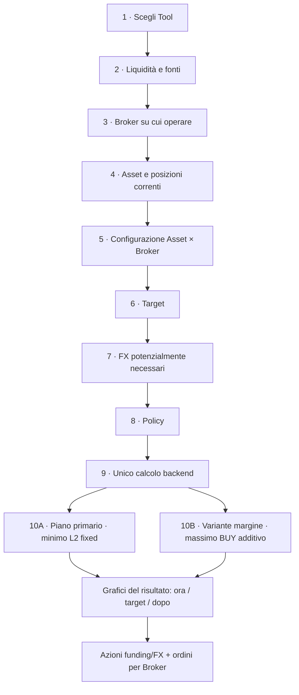
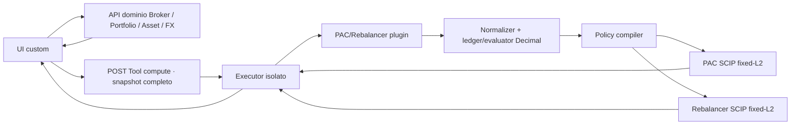

# PAC & Rebalancer — flusso end-to-end

> **ARCHIVIO:** derivazione estesa consolidata nella suite target, il cui entrypoint è
> [`../plan-phase00PacRebalancerTargetDesign.prompt.md`](../plan-phase00PacRebalancerTargetDesign.prompt.md).
> Ogni riferimento sotto a design o piano “corrente” conserva soltanto il
> contesto storico del round in cui fu scritto.

> **Autorità nel round storico:** questo fu il design prodotto normativo. Flusso end-to-end e UI erano
> approvati dal developer; checkpoint e Gate P1 sono stati ottenuti, ma Step 0
> resta congelato sul gate PySCIPOpt/SCIP, sulla capacità MIQP/MIQCP e sul payload.
> Obiettivo e semantica pubblica di proof/status sono congelati, ma non ancora
> provati entro i limiti runtime. Non è prova di consegna. Baseline combinata:
> onboarding + prototipo P1 non rilasciato, respinto
> come prodotto e destinato a sostituzione senza compatibilità legacy.
> **Legenda:** ✅ decisione confermata · 🟡 gate implementativo · ⏳ differita.
>
> **Correzione algoritmica autorevole — 2026-09-16:** PAC e Rebalancer condividono
> ora un obiettivo primario discreto a riferimento fisso:
> `L2_fixed = Σ_a(V_a_final-w_aF_ref)²`. Il PAC non discretizza una soluzione
> continua e non conserva più una base floor immutabile: il primo risultato è il
> piano globale fixed-L2; il secondo congela tutte le sue azioni, aggiunge BUY e
> massimizza l'impiego del margine, accettando un delta `L2_fixed` visibile.
> Il Rebalancer usa lo stesso nucleo, con vincoli BUY/SELL distinti.
> PySCIPOpt/SCIP è approvato come dipendenza additiva candidata, ma installazione
> e probe restano vietati fino al gate ambiente.

Catena:
[Piano iniziale](plan-phase00PacAllocator.prompt.md) →
[Round 2](plan-phase00Step2Round2-PacAllocatorUiRefinement.prompt.md) →
[Round 3](plan-phase00Step2Round3-PacAllocatorUiAcceptance.prompt.md) →
[Round 4 respinto](plan-phase00Step2Round4-PacAndRebalancerUiAcceptance.prompt.md) →
[Round 5 storico](plan-phase00Step2Round5-PacRebalancerOperationalPlanner.prompt.md) →
[Round 6 UI approvato](plan-phase00Step2Round6-PacRebalancerUiBlueprint.prompt.md) →
[Round 7 implementativo congelato](plan-phase00Step2Round7-PacRebalancerOperationalMigration.prompt.md).
Contesto P1:
[contratto](pac-allocator-contract.md),
[UX](pac-allocator-ux.md),
[evidenze](pac-allocator-evidence.md).
Estensioni escluse: [TODO_FUTURI](../../../../../TODO_FUTURI.md).

## 1. Obiettivo dei due calcolatori

| Tool | Domanda a cui risponde |
|---|---|
| **PAC** | Come distribuire la liquidità selezionata tra gli Asset target e trasformarla in azioni eseguibili sui Broker scelti? |
| **Ribilanciamento** | Quali acquisti — e, se autorizzato, quali vendite — avvicinano l’intero portafoglio ai pesi target? |

I due Tool hanno flussi UI distinti e condividono normalizzazione, modello
Broker/FX, quantizzazione, ledger, evaluator Decimal, primitive vincolo e
compilatore degli obiettivi. Restano prodotti distinti per input, modalità,
azioni ammesse, tabelle e spiegazioni.

## 2. Flusso complessivo



Il Tool segue un solo volo: **input completi → una richiesta di calcolo → output**.
Durante il wizard sono ammesse API dominio per copiare/autocompilare fatti, ma non
esistono una preview del planner, un solver intermedio o una “esecuzione” nello Step 6/7.

## 3. Wizard: input e comportamento

### Step 1 — Tool

- **PAC**: il target descrive la distribuzione della liquidità investita.
- **Ribilanciamento**: il target descrive la composizione finale dell’intero portafoglio.
- **Valuta di riferimento**: campo esplicito e modificabile, pre-popolato con la
  valuta predefinita dell’utente loggato. Serve come metro comune per target,
  confronti e grafici; non cambia le valute native di cash, ordini o trasferimenti.

### Step 2 — Liquidità e fonti

La liquidità non è “tutto il saldo dei Broker selezionati”. Ogni riga è una scelta esplicita.

#### Azioni disponibili

1. **Aggiungi nuova liquidità**
   - importo;
   - valuta;
   - etichetta sorgente opzionale.

2. **Prendi liquidità da…**
   - selezione di un conto/Broker esistente come sorgente, anche se non verrà usato
     per compravendita;
   - valuta nativa;
   - importo scelto dall’utente;
   - massimo bloccato al saldo disponibile noto.

3. **Aggiungi fonte manuale**
   - banca, conto o Broker non ancora presente nel sistema;
   - nome scenario-only;
   - valuta e saldo disponibile dichiarato;
   - importo da usare, sempre limitato al saldo dichiarato.

Un conto può quindi essere solo **sorgente di funding**: per esempio la banca dalla quale partire con il bonifico verso Directa. Se la stessa entità viene scelta anche nello Step 3 come Broker operativo, l’identità viene riusata e il cash non viene duplicato.

```text
LIQUIDITÀ
+---------------------------------------------------------------+
| + Aggiungi nuova liquidità                                    |
|   1.000,00 EUR · sorgente: Nuovo risparmio                    |
|                                                               |
| + Prendi liquidità da…                                        |
|   Banca X · EUR · disponibile 8.400 · usa [ 2.500 ]           |
|   Directa · EUR · disponibile 1.159 · usa [   800 ]           |
|   Broker Y · USD · disponibile   900 · usa [     0 ]          |
+---------------------------------------------------------------+
| Totale indicativo: 4.300 EUR equivalenti                     |
| Nota: i trasferimenti effettivi saranno calcolati dal backend. |
+---------------------------------------------------------------+
```

Il totale equivalente usa un tasso dominio con fonte/data visibili; la conversione
autorevole viene rifatta dal Tool sui fatti FX inclusi nello snapshot. Il risultato
deve produrre istruzioni come “bonifica 2.500 EUR da Banca X a Directa”, non soltanto
ordini Asset.

#### Configurazione della fonte di liquidità

Qui compaiono soltanto dati di funding:

- `source_kind`: `new_external`, `existing_account` oppure `manual_account`;
- saldo disponibile per valuta;
- importo selezionato;
- valuta nativa;
- route di trasferimento ammesse, se note;
- nome/etichetta mostrata nelle istruzioni finali.

Non compaiono fee di trading, frazionamento, PMC o policy fiscali: appartengono al ruolo
di esecuzione dello Step 3.

Le tre azioni UI costruiscono una union discriminata da `source_kind`; non generano
`is_new`, `is_existing` e `is_manual`.

### Step 3 — Broker operativi

L’utente sceglie i Broker sui quali accetta operazioni BUY/SELL. Sono disponibili due
azioni indipendenti:

1. **Scegli Broker esistente**
   - selezione fra i Broker già configurati;
   - prefill delle capability con origine e data visibili;
   - valori sempre modificabili nello scenario.

2. **+ Aggiungi Broker manuale**
   - crea un Broker scenario-only;
   - non richiede un record persistito;
   - richiede compilazione esplicita di tutte le capability necessarie;
   - non viene salvato automaticamente nelle impostazioni dell’utente.

Un Broker manuale può ricevere trasferimenti dalle fonti dello Step 2 ed essere usato
nel routing Asset×Broker esattamente come uno esistente. Un dato mancante non diventa
mai un default silenzioso.

Le due azioni costruiscono una union discriminata da `broker_kind`:
`existing_broker` oppure `manual_broker`. Non esistono booleani paralleli.

```text
BROKER SU CUI OPERARE
+---------------------------------------------------------------+
| [ Scegli Broker esistente ▼ ]  [ + Aggiungi Broker manuale ] |
+---------------------------------------------------------------+
| Directa · esistente       Configurazione precompilata [Modifica] |
| Broker PAC Demo · manuale Dati completi scenario-only [Modifica] |
+---------------------------------------------------------------+
```

#### Configurazione del Broker come luogo di investimento

Per ogni Broker operativo il dominio prova a precompilare:

- valute dei conti di trading;
- modalità FX;
- valuta di addebito predefinita;
- modalità di immissione ordine per valuta;
- passo monetario degli ordini per valuta;
- commissioni BUY e SELL;
- regime fiscale;
- minusvalenze pregresse note.

Nella v1 questi parametri operativi restano campi dello scenario: selezionare un
Broker esistente precompila soltanto i fatti già disponibili, ma non crea né
aggiorna una configurazione persistente. La persistenza del profilo operativo
Broker è un’estensione futura.

| Campo | Semantica |
|---|---|
| `fx_mode` | Esattamente `native_currency_required` oppure `auto_convert_on_buy`. |
| Valuta di addebito | Scelta esplicita per Broker auto-FX; un ordine usa un solo pool. |
| `order_instruction_kind[currency]` | Enum esclusivo `whole_quantity` oppure `monetary_amount`, valido per BUY e SELL. Il primo indica che nel Broker si inserisce una quantità intera; il secondo un notional monetario. Nessun booleano frazioni separato per lato. |
| `order_amount_step[currency]` | Richiesto soltanto con `monetary_amount`: incremento minimo dell’importo accettato dal configuratore Broker per quella valuta. Esempio: `1 EUR` consente `100`, `101`, `102`; `0,01 EUR` consente anche `100,25`. Non è precisione del prezzo né step di possesso. |
| `fee_buy` | Profilo commissionale BUY: fisso + percentuale sul controvalore, con minimo/massimo opzionali sulla componente percentuale. Tutti `0` sono validi, quindi un PAC gratuito si rappresenta senza eccezioni. |
| `fee_sell` | Profilo SELL indipendente, con la stessa struttura. Può essere normale anche quando `fee_buy=0`. |
| Regime fiscale | `amministrato` oppure `dichiarativo/libero`; determina il perimetro nel quale future policy fiscali possono compensare risultati. |
| Minusvalenze pregresse | Importo noto per Broker, default `0`, con valuta e data di riferimento esplicite. |

`withholding_kind` non è un altro controllo utente: il backend lo deriva dal
regime. Vale `broker_withheld` per `administered` e `self_reserved` per
`declarative_free`. Entrambi escludono la tax reserve dai BUY; solo
`self_reserved` resta cash fisico sul conto.

La schedule v1 è per riga SELL Asset×Broker: fee → gain positivo → rounding
tax reserve → disponibilità BUY nello stesso candidato. Non esistono netting
giornaliero, compensazione tra righe o rinvio implicito della riserva.

“Numero di titoli” e “Importo da investire” **non sono valori di input**: sono
istruzioni calcolate dal backend. Lo scenario configura però la forma accettata dal
Broker tramite `order_instruction_kind`. La risposta mantiene lo stesso discriminante:
con `whole_quantity` restituisce il numero intero di quote; con `monetary_amount`
restituisce il notional monetario quantizzato e mostra la quantità stimata solo come
informazione.

Nella prima versione le fee sono configurate per Broker, lato e valuta. Profili diversi
per mercato e formule dinamiche/degressive dipendenti dall’ordine giornaliero restano
estensioni future, non coefficienti nascosti.

`fee_buy.fixed`, `fee_buy.rate`, `fee_sell.fixed` e `fee_sell.rate` non diventano enum:
fisso e percentuale possono coesistere nello stesso profilo.

#### Enum e union: inventario normalizzato

| Concetto | Discriminante | Valori |
|---|---|---|
| Fonte liquidità | `source_kind` | `new_external`, `existing_account`, `manual_account` |
| Origine Broker operativo | `broker_kind` | `existing_broker`, `manual_broker` |
| Gestione FX Broker | `fx_mode` | `native_currency_required`, `auto_convert_on_buy` |
| Forma ordine Broker/valuta | `order_instruction_kind` | `whole_quantity`, `monetary_amount` |
| Regime fiscale | `tax_regime` | `administered`, `declarative_free` |
| Policy PAC | `pac_policy` | `proportional`, `min_fragmentation` |
| Modalità Rebalancer | `trade_mode` | `invest_only`, `invest_and_sell` |

Regola: un solo discriminante per alternativa esclusiva. I campi specifici vivono nel
relativo ramo della union; niente combinazioni impossibili di flag.

La risposta ripete `order_instruction_kind` e valorizza soltanto il ramo coerente:
quantità intera oppure importo monetario.

#### Confine campi utente / risultati backend

I dati auto-popolati diventano input soltanto dopo essere stati mostrati e
confermati nello snapshot. Variabili del solver e istruzioni operative non
appaiono nella configurazione.

| L’utente inserisce o conferma | Il backend calcola |
|---|---|
| Tool, data e valuta di riferimento | quantità titoli oppure importo cash |
| fonti, valute, disponibilità e importi da usare | quantità stimata per ordini cash |
| Broker, FX mode, valuta addebito e frazioni ammesse | funding e trasferimenti |
| step monetario e fee BUY/SELL | conversioni FX |
| Asset, prezzi, quantità correnti, PMC e aliquota fiscale | BUY/SELL e route effettive |
| Broker eleggibili, priorità e vincoli BUY/SELL per Asset | fee, riserva fiscale, addebiti/accrediti |
| target, spot/spread/buffer FX e policy | before/target/after, residui e proof/status |

### Step 4 — Asset

- Copia dal Portfolio/Asset oppure aggiunta manuale.
- Identità canonica dello strumento, mai matching per nome.
- Prezzo originale, valuta e `quote_base_quantity` conservati.
- Fonte, timestamp e staleness visibili.
- Metadati per Tipo, Settore e Geografia; quota `Unknown` esplicita se incompleti.
- Posizioni correnti separate per Broker: quantità esatta, valore, valuta e PMC.
- Il PMC è fornito per la coppia Asset×Broker, con valuta, data e provenance; non
  viene ricostruito dal nome dell’Asset né aggregato fra custodie diverse.
- Aliquota sulle plusvalenze per Asset, pre-popolata al `26%`, sempre modificabile,
  con origine del valore visibile. Nel wire è un rapporto Decimal (`0.26`), non
  una percentuale `26`.
- L’inventario frazionario già posseduto resta esatto e non viene arrotondato secondo
  la modalità dei nuovi ordini.

### Step 5 — Configurazione Asset × Broker

✅ La scelta Asset→Broker è configurazione, non policy.

Per ogni Asset:

- lista contenente soltanto i Broker sui quali l’utente è disposto a operare;
- priorità numerica per Broker;
- priorità uguali = nessuna preferenza;
- vincoli BUY e SELL con minimi e cap tipizzati;
- nessun routing fuori dalla lista;
- compatibilità con valuta, FX e modalità ordine mostrata subito.

```text
XMAW World
  Broker operativi selezionati:
  Directa       priorità [1]
  Fineco        priorità [1]  ← nessuna preferenza
  Broker Z      priorità [2]

  Esclusi dal routing: Banca X · funding-only
```

Il primario PAC cerca globalmente il piano discreto a `L2_fixed` minimo entro le
route ammesse. La priorità route non altera il target Asset-level: entra soltanto
nel tier operativo dopo `L2_fixed` e `U`. Cap, minimi, step, cash e compatibilità
restano hard constraint, non penalità.

- Con **Proporzionale**, il tier operativo preferisce route prioritarie, poi
  costi e righe.
- Con **Minima frammentazione**, minimizza Asset splittati e righe prima di route
  priority e costo, sempre dopo avere congelato `L2_fixed` e `U`.
- Future policy fiscali potranno scegliere diversamente usando PMC, regime fiscale e
  minusvalenze, senza alterare silenziosamente le policy correnti.

Ogni lato della route usa:

```text
SideOrderConstraints
├── minimum_order_notional       # condizionale se la riga esiste
├── required_min_notional?       # hard; se presente la riga è obbligatoria
└── maximum =
      NoOrderCap {cap_kind="none"}
    | QuantityOrderCap {cap_kind="quantity", quantity}
    | NotionalOrderCap {cap_kind="notional", money}
```

Un minimo condizionale può produrre un no-op; non rende il problema infeasible.
Un `required_min_notional` positivo può invece produrre
`infeasible_proven`, ma soltanto dopo il pre-pass esatto di fattibilità §4.5 e
con un conflict witness verificabile. Nessun limite cambia unità implicitamente.
Required BUY e required SELL sullo stesso Asset canonico sono input
contraddittori e producono `invalid`.

### Step 6 — Target

È l’ultimo input **allocativo** dell’utente, prima di FX finali e scelta della policy.
Non avvia calcoli, non mostra un’anteprima ideale e non produce operazioni.

#### PAC

- Percentuali della **nuova allocazione** per Asset.
- Il target descrive come si vorrebbe distribuire la liquidità selezionata.

#### Ribilanciamento

- Percentuali finali dell’**intero portafoglio investito**.
- Il backend stabilirà, dopo il submit, quali BUY/SELL sono compatibili con liquidità,
  modalità scelta e vincoli.

Il frontend qui valida soltanto forma, percentuali e completezza. Non riassegna
economicamente la liquidità: perfino il PAC deve includere quantizzazione, fee,
routing, funding e FX prima di conoscere il risultato realmente eseguibile.

### Step 7 — FX potenzialmente necessari

I dati delle fonti stanno nello Step 2, quelli dei Broker operativi nello Step 3 e le
compatibilità Asset×Broker nello Step 5. Qui compaiono soltanto le conversioni
potenzialmente necessarie date valute, funding e route ammesse. La scelta finale delle
conversioni appartiene all’unico calcolo backend.

Per ogni coppia FX necessaria:

| Campo | Comportamento |
|---|---|
| Tasso spot | Auto-popolato dal dominio FX, sempre modificabile. |
| Data/età | Mostrare fonte, timestamp e “N giorni fa”. |
| Spread aggiuntivo % | Costo di conversione; `0` valido. |
| Buffer FX % | Opzionale, default `0`: quota di cash lasciata intenzionalmente libera per assorbire oscillazione del cambio e arrotondamenti fra calcolo e inserimento dell’ordine. Non è una fee e non viene spesa. |

Per Broker `native_currency_required`, la tabella funding deve proporre una conversione preventiva. Per Broker `auto_convert_on_buy`, la conversione è parte del costo stimato dell’ordine.

**Chiarimento sul buffer FX.** Se il Tool stima un addebito di 1.000 EUR e l’utente
imposta `1%`, il calcolo non impegna anche i 10 EUR di buffer. Serve a ridurre il rischio
che una piccola variazione del cambio renda l’ordine non finanziabile. È un’opzione
esplicita, disattivata per default e resta cash nel conto.

Nomi congelati: input wire `fx_buffer_rate`, output monetario
`fx_buffer_amount`, label UI **Margine di sicurezza FX**.

### Prezzo operativo

Il prezzo Asset resta nella valuta originale. Prima del piano l’utente deve vedere anche il prezzo nella valuta di addebito del Broker.

**Confine architetturale:** la UI orchestra e mostra la conversione, ma non esegue da sola l’aritmetica economica. Chiede al backend/domain FX un prezzo convertito con tasso, fonte e data; il Tool riceve original price + FX fact e ricalcola/valida deterministicamente.

### Step 8 — Policy

#### PAC

Il primario PAC è globale e solver-backed:

1. **Proporzionale** — `L2_fixed → U → route priority → cost → rows → tie`.
2. **Minima frammentazione** —
   `L2_fixed → U → split Assets → rows → route priority → cost → tie`.

Entrambe rispettano gli stessi hard constraint su route, cash, minimi, cap,
quantum, fee, FX e buffer. La variante margine congela il piano primario e
aggiunge BUY con `U → L2_fixed → cost/rows → tie`.

#### Ribilanciamento

Queste sono modalità operative: cambiano le azioni ammissibili, non i pesi della
funzione obiettivo. Tutti gli altri vincoli e l’ordine dei risultati restano comuni.

1. **Investi soltanto** — default
   - usa nuova liquidità e cash selezionato;
   - nessuna vendita implicita;
   - restituisce la soluzione più vicina se il target esatto non è raggiungibile.

2. **Investi e vendi**
   - usa prima la liquidità verso gli Asset sotto target;
   - se non basta, vende Asset sopra target per finanziare quelli sotto target;
   - nessuna vendita oltre inventario;
   - mai buy+sell dello stesso Asset;
   - `L2_fixed → U → turnover → costi → righe/split → tie`.

Queste due modalità bastano per il primo rilascio. Con nuova liquidità `0`, “Investi e vendi” copre anche il caso di ribilanciamento finanziato solo da vendite.

### Step 9 — Calcolo

Un solo submit invia lo snapshot completo al Tool backend. Non esistono operazioni
`preview_target` o chiamate planner durante gli step precedenti.

Il backend produce due risultati nella stessa risposta, se il benchmark conferma costo ragionevole:

- **Piano primario globale**: minimo `L2_fixed`, poi minimo `U` sulla faccia
  `L2_fixed` ottima e infine i tier operativi della policy;
- **Variante margine**: congela integralmente ordini, funding, FX e SELL del
  primario, aggiunge soltanto BUY, minimizza prima `U` e poi il `L2_fixed`
  risultante.

La variante non può ridurre o spostare il piano primario. Può peggiorare
`L2_fixed` per investire cash altrimenti inattivo; investimento, `U`, score e
delta restano sempre espliciti. Se trova anche un `L2_fixed` migliore, il
candidato domina l'incumbent primario e deve essere promosso/ricalcolato, non
presentato come semplice variante.

`availability` appartiene alla risposta intera:
`ready`, `needs_input`, `invalid`, `unsupported`. Ogni soluzione ha invece il
proprio envelope:

- soluzione primaria o variante ottenuta da ricerca:
  `outcome = no_op | incumbent_found | no_incumbent | infeasible_proven`,
  `proof = optimal_proven | gap_bounded | not_proven | infeasibility_proven`,
  `stop_reason = completed | time_limit | node_limit | cancelled`.

`target_deviation`, `cash_deficit`, gap, `objective_values`, limiti e delta sono
dentro la soluzione cui si riferiscono. Così base e variante possono avere esiti
diversi, per esempio base `no_op` e residuo `incumbent_found`.

Il contratto atomico deve restare entro i limiti piattaforma già esistenti:
`131072` byte input, `262144` byte output, soft timeout `4 s`, hard timeout `5 s`.
Dominio minimo supportato: 32 Asset/target, 8 Broker operativi, 16 fonti, 64 route,
8 valute, 24 fatti FX, 64 ordini per soluzione e 256 issue. Il mancato rispetto
blocca l'implementazione; non autorizza omissioni silenziose o riduzioni implicite.

Ogni incumbent pubblicato ha `incumbent_validation=decimal_verified`: evaluator
Decimal certifica vincoli finanziari, accounting e tupla obiettivo esatta del
candidato. Questo non certifica l’assenza di un piano discreto migliore.
Un timeout con incumbent resta `incumbent_found/not_proven/time_limit`, salvo
un bound numerico pubblicabile come `gap_bounded`. Anche lo status floating
`optimal` di HiGHS/SCIP mappa al massimo a `gap_bounded`, con bound, tolleranze,
versione e settings grezzi, oppure a `not_proven`; non diventa
`optimal_proven`.

`no_op` copre, per quella soluzione, il piano vuoto fattibile, inclusi budget
sotto minimi condizionali e cash senza route utile. Per una ricerca, `no_op`
richiede `optimal_proven` ottenuto da oracle esaustivo esatto o chiusura
score-lattice coefficient-safe; un incumbent vuoto non provato resta
`incumbent_found/gap_bounded|not_proven` con `operational_change=false`.
`infeasible_proven` è ammesso soltanto quando un hard constraint esplicito, per esempio
un `required_min_notional` obbligatorio incompatibile con cash/route, rende vuoto
l'intero dominio della soluzione e produce un conflict witness Decimal
deterministico, oppure quando un oracle esatto esaurisce l’intero dominio.
Lo status floating `infeasible` da solo diventa
`no_incumbent/not_proven/completed` con evidenza solver grezza, mai
`infeasible_proven`. Input mancante resta `needs_input`; limite senza incumbent
resta `no_incumbent`, mai falsa infeasibility.

Con `availability=ready`, `base_result` è sempre presente e rappresenta il
primario. `variant_result` è presente quando il primario contiene un piano, anche
vuoto; se non esiste un incremento BUY, coincide col primario e dichiara delta
zero. Non viene eseguito dopo `base_result.infeasible_proven`. Le risposte
`needs_input`/`invalid`/`unsupported` non contengono soluzioni.

### Step 10 — Risultato, poi istruzioni

La risposta apre con la rappresentazione del **piano realmente calcolato**, non con
un’anteprima teorica:

1. EChart della distribuzione degli acquisti/vendite della soluzione;
2. confronto portafoglio **Ora / Target / Dopo il piano**;
3. card Dashboard per Tipo, Settore e Geografia, inclusa quota `Unknown`;
4. selettore fra piano primario e variante margine;
5. sotto i grafici, azioni di funding/FX e tabelle operative per Broker.

Per il PAC il primo grafico confronta target degli acquisti e acquisti realmente
proposti. Per il Rebalancer mostra l’effetto congiunto di BUY e SELL sul portafoglio
totale. Se il risultato non convince, l’utente torna agli input e rilancia un nuovo
calcolo; nessun ordine viene eseguito implicitamente.

## 4. Modello matematico

### 4.1 Notazione minima

- `a`: Asset;
- `b`: Broker operativo;
- `s`: fonte di liquidità;
- `c,d`: valute native dei ledger;
- `v`: valuta tecnica di valorizzazione;
- `w_a`: peso target;
- `V_a^(v)`: valore corrente dell’Asset nella valuta `v`;
- `P_source,a^(q)`: prezzo originale nella valuta di quotazione `q`;
- `Q_a`: `quote_base_quantity` positiva cui il prezzo sorgente si riferisce;
- `p_a^(q)=P_source,a^(q)/Q_a`: prezzo unitario normalizzato una sola volta;
- `P_ab^(mid,c)`: prezzo convertito nella valuta di addebito `c` al tasso mid;
- `P_ab^(chg,c)`: addebito stimato nella valuta `c`, incluso spread FX ma non fee;
- `P_ab^(sell,c)`: credito SELL stimato nella valuta `c`, al netto dello spread ma non delle fee;
- `Δm_bc`: passo monetario del Broker nella valuta;
- `μ_c`: minima unità contabile della valuta, dettaglio backend non configurabile;
- `u_sc`: liquidità scelta dalla sorgente;
- `t_sbc`: trasferimento dalla sorgente al Broker;
- `q_ab`: quantità intera proposta con `whole_quantity`;
- `M_ab`: importo proposto con `monetary_amount`;
- `h_ab`: quantità esatta posseduta sul Broker;
- `n_ab`: quantità venduta;
- `y_ab`: indicatore binario “esiste un ordine”.

Variabili decisionali: trasferimenti `t`, conversioni FX, `q`/`M`, `n` e `y`.
Valori target, investimenti, residui, valori finali ed esposizioni sono derivati.
Ogni vincolo di cassa vive nella valuta nativa del relativo ledger; la valuta `v`
serve soltanto per confrontare valori e obiettivi.

### 4.2 Liquidità e trasferimenti

Per ogni sorgente conosciuta:

```math
0 \le u_{s,c} \le \text{saldo disponibile}_{s,c}
```

```math
\sum_b t_{s,b,c} \le u_{s,c}
```

Per un Broker che è anche sorgente, `u_bc` è soltanto il cash esplicitamente selezionato,
mai l’intero saldo. È vietato il falso auto-trasferimento:

```math
t_{b,b,c}=0
```

La prima versione ammette trasferimenti soltanto su route dichiarate nello snapshot e
li tratta come gratuiti e immediatamente disponibili ai fini del piano. Fee, limiti e
tempi di settlement dei bonifici sono un’estensione futura. Ogni funding route
dichiara sorgente, Broker destinazione, valuta e priorità. Cash già sul Broker
destinazione precede i trasferimenti; poi valgono priorità, ID sorgente, Broker e
valuta come ordine totale, riportato nell’output.

Ogni conversione ammessa `j=(b,c→d)` ha debito sorgente `f_j≥0` e credito accoppiato:

```math
\operatorname{credito}^{(d)}_j
=
f_j R^{eff}_{c\to d}
```

Non esistono crediti FX liberi. Sono ammesse solo coppie dichiarate, un singolo hop per
percorso di funding e nessun ciclo attivo.

Per ogni Broker/valuta, dopo trasferimenti, FX, SELL, BUY, fee e riserva fiscale
buffer:

```math
\begin{aligned}
\operatorname{cashDisponibileFinale}_{b,c}
=\;&u_{b,c}
+\sum_{s\ne b}t_{s,b,c}
-\sum_{b'\ne b}t_{b,b',c}\\
&+\sum_{j:\,\cdot\to c}\operatorname{credito}^{(c)}_j
-\sum_{j:\,c\to\cdot}f_j\\
&+\sum_a\operatorname{proventoSell}^{(c)}_{a,b}
-\sum_a\operatorname{addebitoBuy}^{(c)}_{a,b}\\
&-\sum_a\operatorname{feeBuy}^{(c)}_{a,b}
-\sum_a\operatorname{feeSell}^{(c)}_{a,b}\\
&-\sum_a\operatorname{taxReserve}^{(c)}_{a,b}
-\operatorname{feeFX}^{(c)}_b
-\operatorname{fxBuffer}^{(c)}_b
\ge 0
\end{aligned}
```

La nuova liquidità è una sorgente esterna esplicita; non viene sommata due volte al
cash già presente. Cash non selezionato nello Step 2 è invisibile al planner.
Il ledger accredita il provento SELL lordo e sottrae fee SELL e tax reserve come
termini distinti. `cashNetSell` è solo un totale derivato: non viene accreditato di
nuovo.

Il buffer non è spesa:

```math
\operatorname{cashFisicoFinale}_{b,c}
=
\operatorname{cashDisponibileFinale}_{b,c}
+\operatorname{fxBuffer}^{(c)}_b
+\operatorname{selfReservedTax}^{(c)}_b
```

Il primo saldo è spendibile dal piano; il secondo è il saldo fisico atteso.
`selfReservedTax` include solo SELL `withholding_kind="self_reserved"`; una
ritenuta `broker_withheld` è già uscita dal conto.

### 4.3 Fee BUY/SELL

Per lato `h ∈ {buy, sell}`, controvalore `N`, fisso `f_h`, aliquota `r_h`,
minimo `l_h` e massimo opzionale `u_h`:

```math
\operatorname{fee}_h(N)=
\begin{cases}
0, & N=0\\
f_h+\min(\max(r_hN,l_h),u_h), & N>0
\end{cases}
```

`u_h=+∞` quando assente e `0≤l_h≤u_h`. Minimo e massimo si applicano alla componente
percentuale. La fee è per riga ordine, nella valuta di addebito, ed è zero quando
l’ordine non esiste. Un rate zero con minimo positivo applica comunque quel minimo,
non lo scarta silenziosamente. Il BUY gratuito dei piani PAC richiede
`f_buy=0`, `r_buy=0` e `l_buy=0`, mentre il SELL mantiene il proprio profilo
indipendente.

Prima versione: profilo per Broker/lato/valuta. Mercato specifico e formule
dinamiche/degressive dipendenti dal numero d’ordine giornaliero sono differiti.

### 4.4 FX

Definiamo `R_c→d` come unità di valuta `d` ricevute per una unità di `c`.

Per spread percentuale `s`:

```math
R^{eff}_{c\to d}=R_{c\to d}(1-s)
```

Per ottenere il requisito canonicalizzato
`A_d∈μ_d\mathbb{Z}_{\ge0}` nella valuta destinazione:

```math
D_c=\frac{A_d}{R^{eff}_{c\to d}}
```

`D_c` è soltanto il lower bound continuo. Il debito sorgente operativo è una
decisione sulla griglia nativa:

```math
f_j\in\mu_c\mathbb{Z}_{\ge0},
\qquad
f_j\ge
\left\lceil D_c\right\rceil_{\mu_c}
```

Il credito destinazione è il posting:

```math
A_d^{posted}
=
\operatorname{round}_{\mu_d,\mathrm{HALF\_UP}}
\left(f_jR^{eff}_{c\to d}\right)
\ge A_d
```

L’eventuale eccedenza resta cash destinazione esplicito. Con input
`fx_buffer_rate=m`, distinto dal costo:

```math
\operatorname{fxBuffer}_c
=
\operatorname{round}_{\mu_c,\mathrm{HALF\_UP}}(mf_j)
```

```math
\operatorname{cashRichiesto}_c
=
f_j+\operatorname{fxBuffer}_c+\operatorname{feeFX}_c
```

Il buffer resta nel conto sorgente: non viene convertito né sottratto due volte.
L'output monetario usa il nome `fx_buffer_amount`.
`feeFX_c` è una fee di conversione nella valuta `c`; le fee ordine restano separate.
Serve inoltre `0≤s<1`.

Per un Asset quotato in `q` e addebitato in `c`:

```math
P_{a,b}^{(mid,c)}
=
\frac{p_a^{(q)}}{R_{c\to q}}
```

```math
P_{a,b}^{(chg,c)}
=
\frac{p_a^{(q)}}{R^{eff}_{c\to q}}
```

Per un SELL accreditato in `c`:

```math
P_{a,b}^{(sell,c)}
=
p_a^{(q)}R^{eff}_{q\to c}
```

La cassa BUY usa `P^(chg,c)` e la cassa SELL usa `P^(sell,c)`; investimento e grafici
valorizzano al mid. La differenza è costo FX, mai investimento. Se `c=q`, i prezzi
coincidono e il costo FX è zero. Il normalizer verifica
`P^(sell,c)≤P^(mid,c)≤P^(chg,c)`; una quote che viola l’ordine può creare
arbitraggio sintetico ed è `invalid`.

Niente cicli FX o arbitraggio sintetico: si modellano soltanto le conversioni necessarie al funding dichiarato.

### 4.5 Nucleo corrente condiviso — riferimento fisso e `L2_fixed`

Per entrambi i Tool:

```math
\sum_a w_a=1,\qquad w_a\ge0
```

```math
F_{ref}=V_0+K_{reachable}
```

Nel PAC puro `V₀=0`; nel Rebalancer `V₀` è il valore mid corrente degli Asset.
I proventi SELL sono trasformazione interna e non aumentano `F_ref`.
`K_selected` è la somma in `valuation_currency`, ai cambi mid dello snapshot,
dei saldi esistenti selezionati e dei nuovi contributi selezionati; le due
famiglie restano righe native separate nel ledger. `K_reachable` è il
sottoinsieme di quel valore per cui esiste almeno un percorso dichiarato
source→Broker×valuta→BUY verso un Asset con peso positivo e prezzo utilizzabile,
rispettando permessi e direzione FX ma ignorando soltanto soglie dipendenti
dall'importo. Un saldo sotto minimo/fee non diventa quindi trapped: resta nel
riferimento e riemerge in `U`. Cash senza alcun percorso strutturale resta in
`K_trapped=K_selected-K_reachable`, fuori da `F_ref`. Fee, spread e buffer non
sono sottratti da `K_reachable`: sono conseguenze contabili candidate-dependent.
Il target monetario fisso di ogni Asset è:

```math
T_a=w_aF_{ref}
```

Le quantità e i valori finali devono essere non negativi:

```math
h_{a,b}^{final}
=h_{a,b}^{0}+h_{a,b}^{buy}-h_{a,b}^{sell}\ge0
\qquad\forall(a,b)
```

```math
V_a^{final}
=V_a^0+I_a^{buy}-I_a^{sell}\ge0
\qquad\forall a
```

Il Rebalancer richiede `V₀>0` prima del solve e vale
`F_final=Σ_aV_a_final>0`; uno snapshot Rebalancer senza portafoglio investito
produce `needs_input` con indicazione di usare il PAC, mai falsa infeasibility.
Il PAC può avere `F_final=0` nel no-op a budget nullo o sotto ogni minimo
condizionale.

Il residuo monetario Asset-level è:

```math
r_a=V_a^{final}-T_a
```

L'obiettivo normativo, rivalutato esattamente dall'evaluator Decimal nella
`valuation_currency`, è:

```math
L2_{fixed}
=
\sum_a r_a^2
=
\sum_a\left(V_a^{final}-w_aF_{ref}\right)^2
```

Ha unità `valuation_currency²`. Il report può esporre il diagnostico
dimensionless `L2_fixed/F_ref²` quando `F_ref>0`, ma solver, confronti e proof
conservano il valore Decimal non formattato e il riferimento dello snapshot.
Confronti fra scenari con `F_ref` o valuta diversi non sono confronti dello
stesso obiettivo.

Il capitale non trasformato in valore Asset resta:

```math
U=F_{ref}-F_{final}
```

Poiché `Σ_aT_a=F_ref`:

```math
\sum_ar_a=-U
```

e, con `n` Asset modellati, per Cauchy-Schwarz:

```math
L2_{fixed}\ge\frac{U^2}{n}
```

Quindi ridurre artificialmente il capitale investito non restringe target o
denominatore e aumenta almeno il bound quadratico in `|U|`.
Nel modello senza posting rounding, prezzi charge/sell e ledger implicano
`F_final_exact≤F_ref`. Il ledger autorevole usa però posting alla minor unit e
può ammettere un candidato con piccolo rounding favorevole:

```math
U\ge-|A_{round}|_{max},
\qquad
|A_{round}|_{max}
=
\frac12\sum_j\mu_{c_j}R_{c_j\to v}
```

Il gate contabile verifica identità e bound, non impone falsamente `U≥0`.
`U<−|A_round|max` o un'identità non riconciliata è `invalid`; un piccolo `U<0`
è un surplus di valorizzazione da rounding, non leva. Cash selezionato ma
strutturalmente intrappolato resta fuori da `F_ref` e compare nell'identità
estesa.

#### Primo e secondo risultato

Il **primario globale discreto** usa:

```text
min L2_fixed
→ min U sulla faccia L2 ottima
→ tier operativi della policy
→ tie canonico
```

Il tier `U` si attiva soltanto sulla faccia di esatto pareggio `L2_fixed`.
Prezzi e cambi Decimal rendono molti pareggi poco frequenti, ma non impossibili:
target simmetrici, quanta di pari valore, route equivalenti e posting arrotondati
possono produrre lo stesso quadrato. Il tier resta necessario per definire la
policy e un ordine totale, non perché si presume che il pareggio sia comune.

PAC:

- `proportional`: `L2_fixed → U → route priority → cost → rows → tie`;
- `min_fragmentation`:
  `L2_fixed → U → split Assets → rows → route priority → cost → tie`.

Rebalancer:

```text
L2_fixed → U → turnover → cost → rows/splits → tie
```

La **variante margine** congela esattamente tutte le azioni del primario,
inclusi funding, FX, ordini e SELL. Consente soltanto BUY addizionali finanziati
dal saldo spendibile Broker×valuta lasciato da quelle azioni congelate; non
aggiunge, amplia o sostituisce funding/FX:

```text
min U
→ min L2_fixed risultante
→ min cost/rows incrementali
→ tie canonico
```

Il tier `L2_fixed` dopo `U` non introduce una seconda penalità: sulla faccia di
massimo investimento sceglie dove allocare il margine con il minor danno target.
`ΔL2 = L2_deployment-L2_primary` è report. Se il primario è
`optimal_proven` sul dominio completo della modalità, `ΔL2≥0` perché la
variante è un punto dello stesso dominio. Se un incumbent non provato viene
dominato da una variante con `ΔL2<0`, la variante diventa nuova incumbent
primaria e la variante stale non viene pubblicata. Il calcolo ripete la fase
deployment finché non trova più un miglioramento primario o scade il limite; in
quest'ultimo caso pubblica il miglior primario `not_proven` e omette
`variant_result` con issue esplicita.

Percentuali finali effettive, `D∞pct`, `D1pct`, scostamenti firmati e
distribuzioni prima/target/dopo restano diagnostici e grafici; non governano
ordini.

#### Programma di policy ed executor

Il nucleo non è una chiamata solver monolitica:

```text
NormalizedScenario
  → PolicyCompiler
      → DeterministicProgram | SolverProgram
  → DeterministicExecutor | SolverAdapter
  → DecimalEvaluator
  → Explanation/Report
```

`SolverProgram` dichiara variabili, domini, hard constraint, tier
lessicografici, bound e proof policy. `DeterministicProgram` resta disponibile
per future policy realmente chiuse; nessuna policy PAC v1 usa più il floor
greedy come risultato primario. Entrambi riusano scenario normalizzato,
primitive vincolo, ledger ed evaluator.

Decisioni intere: tick ordine, attivazioni riga/route, quantità intere, importi
monetari e FX sulla griglia nativa. Prezzi, pesi, cambi e fee sono coefficienti
Decimal/rational; valori Asset, ledger e residui possono essere ausiliari reali
nel solver, ma vengono sempre ricostruiti in Decimal. Il primo tier `L2_fixed` è un MIQP convesso. Dopo un optimum `L2*` provato,
il sublevel `Σ_ar_a²≤L2*` coincide semanticamente con la faccia ottima e
introduce per i tier successivi un vincolo quadratico convesso: quei solve sono
MIQCP convessi, MISOCP-rappresentabili. Se il primo tier ha soltanto un incumbent
non provato, la stessa disequazione usa il suo score Decimal come tetto
non-peggiorativo, **non** come pretesa di faccia globale. Un candidato con score
inferiore riavvia la cascata dal primo tier; se il limite interrompe il ciclo,
i tier successivi restano evidenza condizionata a quel tetto e l'intera tupla è
`not_proven|gap_bounded`. Non si impone l'uguaglianza quadratica non convessa
solo per congelare un incumbent.

Vincoli non convessi o nonlinearità ulteriori restano confine futuro.
PySCIPOpt/SCIP è il backend candidato approvato, additivo e non sostitutivo
delle librerie quantitative esistenti. Installazione, lock e probe restano
bloccati fino al freeze dell'ambiente condiviso.

Prima del solve, il normalizer riduce coefficienti rational per GCD e verifica
massimo coefficiente, attività massima di riga, dynamic range, precisione della
rappresentazione solver e bound conservativo dei posting rounded. Il gate include
esplicitamente la crescita quadratica dei residui in unità minori. Un envelope
non sicuro è `unsupported`; non viene riscalato con perdita silenziosa.

Uno stesso PAC può mescolare route `whole_quantity` e `monetary_amount`.
La prima usa una quantità intera; la seconda usa un numero intero di
`order_amount_step` nella valuta nativa e deriva una quantità Asset frazionaria.
Quindi “acquisto frazionario” non significa variabile eseguibile continua: anche
con step pari alla minor unit monetaria il dominio è una griglia finita e molto
fitta. Se tutte le integrality venissero rilassate si otterrebbe un QP continuo;
con sole alcune route rilassate, un MIQP misto continuo/intero. Tale rilassamento
può fornire bound, warm start o diagnostica, ma un suo floor/rounding non è il
piano autorevole. Il candidato pubblicato deve appartenere alla griglia Broker,
passare il replay Decimal e ricevere proof soltanto sul dominio eseguibile.

### 4.5A Storico superato — floor PAC deterministico

> **SUPERATO 2026-09-16:** questa sezione conserva la specifica intermedia
> target→route→floor. Non governa più ordini, output o test. Restano riusabili
> unità, ledger, fee, FX, hard minimum, route e formule dei due instruction kind.
> L'autorità corrente è §4.5.

I pesi soddisfano:

```math
\sum_a w_a=1,\qquad w_a\ge0
```

La somma è verificata esattamente sui Decimal wire, non con una tolleranza
floating. `T_a` resta Decimal non arrotondato nel calcolo; il solo rendering
formatta la percentuale. Un target positivo senza prezzo utilizzabile resta
esplicito come `needs_input`, non viene omesso.

Il cash selezionato è un limite lordo, non investimento. `K_reachable` è il
budget lordo selezionato che può raggiungere almeno un BUY eleggibile tramite
funding/route dichiarati, valorizzato al mid; esclude cash globalmente
intrappolato e non selezionato. “Raggiungibile” è una proprietà strutturale del
percorso dichiarato: un saldo sotto minimo resta nel budget e produce residuo/
`below_min_order`, invece di sparire dal denominatore. Un BUY è eleggibile per
questa definizione soltanto se appartiene a un Asset con `w_a>0`, ha prezzo
utilizzabile e possiede una route dichiarata.

Il PAC base assegna deterministicamente a ogni Asset un envelope lordo:

```math
E_a=T_a=w_aK_{reachable}^{(v)}
```

Gli envelope sommano a `K_reachable`; non sono target per singola route. Fee BUY,
spread/fee FX e buffer consumano o riservano parte dell’envelope e del ledger, ma
non diventano investimento. Un envelope Asset non utilizzabile non viene spostato
su un altro Asset nella base: resta residuo con issue `unavailable_target`.

Per rendere ripetibile la contesa su casse native e conversioni condivise, il
normalizer costruisce un ordine pubblico e stabile:

1. Asset con peso positivo per `T_a` decrescente, poi `canonical_asset_id`
   crescente; nomi e ordine visuale non partecipano;
2. route per priorità numerica crescente;
3. a pari priorità, minor rapporto
   `costo_non_investito_incrementale / investimento_mid_incrementale` del
   prossimo quantum valido; poi minor addebito nativo equivalente in
   `valuation_currency` al mid e `broker_id` crescente. La fattibilità resta
   verificata nei ledger nativi.

Il risultato espone `base_processing_rank` e il motivo di ogni spareggio. Non è
un consiglio d’investimento né un livello obiettivo nascosto: serve soltanto a
rendere deterministico un floor quando più Asset competono per lo stesso saldo.
Il ranking della route viene calcolato una sola volta sul primo quantum
ammissibile nello stato successivo al pre-pass; non viene riordinato a ogni tick.
Una route senza quantum ammissibile va in fondo e produce il proprio issue.

Prima del floor ordinario, un pre-pass Decimal tratta ogni
`required_min_notional` come obbligo:

1. allinea il minimo al quantum della route e calcola riga, fee, FX e buffer;
2. verifica che l’addebito attribuito rientri nell’envelope lordo dell’Asset;
3. verifica simultaneamente tutte le riserve nei ledger nativi e sui soli
   percorsi single-hop dichiarati;
4. congela le quantità/importi e i costi di attivazione già riservati;
5. sottrae tali riserve da envelope e ledger prima del floor restante.

Il pre-pass è una verifica di fattibilità, non minimizza D∞/D² né riscrive i
target. `infeasible_proven` richiede enumerazione/verifica completa del dominio
di funding dichiarato e un `conflict_witness` Decimal, per esempio
`mandatory_debit > asset_envelope` oppure domanda nativa minima superiore alla
massima cassa raggiungibile. Se il dominio è compreso ma la verifica completa
non è disponibile entro il profilo supportato, l’esito è `unsupported`; un
percorso greedy fallito non prova infeasibility.

Fra più witness di funding validi il pre-pass sceglie il primo secondo l’ordine
totale dichiarato: cash già sul Broker, poi `funding_route.priority`, quindi
`source_id`, Broker destinazione e valuta. Anche questo tie-break e il witness
scelto sono restituiti nei diagnostics.

Seguendo tale ordine, per ogni Asset la base:

1. visita le route selezionate per priorità crescente;
2. usa cash già sul Broker, funding/FX single-hop dichiarati e solo saldi nativi;
3. calcola il massimo ordine allineato per difetto che rispetta envelope residuo,
   cash fisico, fee, buffer, minimi, cap e step;
4. passa alla route successiva soltanto quando la precedente non può aggiungere un
   altro tick valido;
5. conserva come residuo ogni importo sotto minimo, non allineabile o non instradabile.

Il costo non investito comprende incremento della fee ordine, spread e fee FX;
il buffer non è costo ma partecipa a fattibilità e addebito richiesto.
Trasferimenti v1 restano gratuiti. Una fee fissa di riga si attiva una sola volta per quella riga; una fee
fissa FX si attiva una sola volta per la conversione aggregata
`(broker, source_currency, target_currency)`. Il primo Asset che la attiva,
secondo l’ordine sopra, la paga nel proprio envelope; incrementi successivi
pagano soltanto costi marginali. Output e leftover ledger espongono questa
attribuzione. Nessuna fee, conversione o riserva può essere addebitata due volte.

La procedura è stateful ma non valuta combinazioni globali di quantità e non usa
D∞/D² per costruire la base. Se l’ordine consuma una cassa utile anche a un Asset
successivo, il suo envelope inutilizzato resta residuo visibile; soltanto il
post-step può riallocarlo con una ricerca globale add-only.

Ogni envelope è riconciliato in `valuation_currency` usando i tassi mid dello
snapshot, senza arrotondare i valori intermedi:

```math
E_a
=I_a^{mid}
+C_a^{attributed}
+H_a^{reserved}
+U_a^{free}
+A_a^{round}
```

`C_attributed` contiene fee ordine, spread e fee FX; `H_reserved` contiene
buffer ancora fisicamente in cassa; `U_free` è cash fisico spendibile
dell’envelope non allocato; `A_round` è la rettifica firmata dei posting
canonicalizzati, definita e bounded in §4.8.
Le cause `unavailable_target`, `below_min_order`, `quantum_leftover` e
`ledger_contention` partizionano `U_free` senza aggiungersi una seconda volta.
La somma sugli Asset riconcilia esattamente `K_reachable`; i ledger nativi
restano l’autorità sul cash fisico. Ogni `A_a^round` è attribuito alla stessa
riga/FX e allo stesso primo Asset che ne ha attivato il posting; non diventa una
quinta causa di cash libero.

Fee, righe attive e FX restano candidato-dipendenti. Il backend può esporre il
diagnostico ex-post:

```math
B_{ref}(x)
=
K_{reachable}^{(v)}
-C_{buy}^{(v)}(x)
-C_{FX}^{(v)}(x)
-H_{FX}^{(v)}(x)
```

Cash globalmente non instradabile resta residuo con issue e non entra nel
denominatore PAC. Cash assegnato a un Asset ma inutilizzabile resta invece parte del
target di quell’Asset e rende visibile lo scostamento. `B_ref(x)` non è un bound
usato per costruire la base.

#### Broker con `whole_quantity`

Per una route visitata deterministicamente, la base sceglie:

```math
q_{a,b}\in\mathbb{Z}_{\ge0}
```

```math
\operatorname{addebitoBuy}_{a,b}^{(c)}
=
\operatorname{round}_{\mu_c,\mathrm{HALF\_UP}}
\left(q_{a,b}P_{a,b}^{(chg,c)}\right)
```

La fee BUY è un termine separato del ledger. L'investimento valorizzato al mid è:

```math
I_{a,b}^{(v)}
=
q_{a,b}P_{a,b}^{(mid,c)}R_{c\to v}
```

La quantità base è il massimo intero per difetto compatibile con l’envelope Asset
residuo e col ledger della route; non esiste un parametro `quantity_step`.

#### Broker con `monetary_amount`

`M_buy,a,b` è l'importo cash, fee escluse, che l'utente inserirà nel Broker. La
base sceglie il massimo numero intero di step per difetto compatibile con
envelope Asset residuo e ledger:

```math
M_{buy,a,b}
=
\Delta m_{b,c}z_{a,b},
\qquad z_{a,b}\in\mathbb{Z}_{\ge0}
```

```math
\widehat q_{a,b}
=
\frac{M_{buy,a,b}}{P_{a,b}^{(chg,c)}}
```

```math
\operatorname{addebitoBuy}_{a,b}^{(c)}
=
\operatorname{round}_{\mu_c,\mathrm{HALF\_UP}}(M_{buy,a,b})
```

```math
I_{a,b}^{(v)}
=
\widehat q_{a,b}P_{a,b}^{(mid,c)}R_{c\to v}
```

Quindi, con spread positivo, l'investimento mid è minore di `M_buy`; la differenza
è costo FX implicito e non un secondo addebito. La fee BUY si aggiunge
separatamente. La quantità stimata è informativa; non esiste una seconda
“semantica importo”.

Witness cross-currency minimo, fee zero: prezzo `99 USD`, mid
`1 USD/EUR`, spread `1%` ⇒ prezzo charge `100 EUR`. Un ordine cash
`M_buy=100 EUR` produce quantità stimata `1`, investimento mid `99 EUR`,
costo spread `1 EUR` e addebito `100 EUR`, non `101 EUR`.

`μ_c` non è un campo UI: significa soltanto che EUR viene contabilizzato ai centesimi,
JPY alle unità, ecc. La prima versione usa Decimal e una regola backend documentata
`ROUND_HALF_UP`. Con `monetary_amount`, `M_ab` rispetta anche `Δm_bc`, che può
essere più grande della minima unità contabile ma deve appartenere a
`μ_c·ℤ_{>0}`. Uno step non rappresentabile nella valuta è `invalid`.

Il valore Decimal canonico prevale sulla proiezione floating del solver. Una
differenza di arrotondamento fino a una minor unit `μ_c` viene normalizzata al valore
Decimal e non scarta da sola il candidato. Dopo la normalizzazione restano però
rigidi saldo non negativo, inventario, minimi, cap, step e conservazione dei ledger:
la tolleranza non autorizza un centesimo di spesa non finanziata né un ordine non
eseguibile. Quantità intere e tick monetari sono discreti già nel modello, non
ottenuti arrotondando una soluzione continua.

Con minimo operativo `m_min,b,c`, una riga è nulla oppure valida:

```math
M_{a,b}\in
\{0\}\cup
\left[
\Delta m_{b,c}\left\lceil\frac{m^{min}_{b,c}}{\Delta m_{b,c}}\right\rceil,\infty
\right)
\cap \Delta m_{b,c}\mathbb{Z}
```

Per ordine intero, `q_ab=0` oppure `q_ab≥1` e
`q_ab P_ab^(chg,c)≥m_min,b,c`. Sotto minimo: nessuna riga, nessuna fee, issue
`below_min_order`.

Un `required_min_notional` sulla route è invece un hard constraint esplicito:
quando positivo, rende obbligatoria quella route e può produrre
`infeasible_proven`. Il minimo condizionale non lo fa.

#### Target e residuo Asset-level

```math
B_{actual}(x)=\sum_{a,b}I_{a,b}^{(v)}
```

```math
T_a=w_aK_{reachable}^{(v)}
```

```math
d_a^{budget}(x)=
\left|
\frac{\sum_b I_{a,b}^{(v)}-T_a}{K_{reachable}^{(v)}}
\right|
```

Per la tabella Asset esiste anche una misura descrittiva distinta:

```math
r_a^{target}(x)=
\frac{T_a-\sum_b I_{a,b}^{(v)}}{T_a},
\qquad T_a>0
```

`r_target` è firmato, normalizzato sul target della singola riga e `null` quando
`T_a=0`; non entra nell’obiettivo. D∞ e D1 usano esclusivamente
`d_budget`, quindi il KPI “massima deviazione obiettivo” e i relativi delta non
possono essere calcolati da `r_target`.

Il target e il residuo sono Asset-level, aggregati su tutti i Broker. La route
riceve soltanto un envelope operativo derivato e non inventa un nuovo target.
La base non minimizza una funzione obiettivo: applica le regole deterministiche
sopra e poi calcola `d_budget` come diagnostico. D∞, D1 e gli altri score servono a
confrontare gli incrementi del post-step, non a riscrivere la base. Fee, tax,
spread e buffer non sono investimento né denominatore.

Se `K_reachable=0`, `d_budget` resta `null` e l'esito è `no_op`. Se
`K_reachable>0` ma `B_actual=0`, per esempio sotto minimo condizionale,
`d_budget=|w_a|` e l'esito resta `no_op`. `infeasible_proven` richiede hard
constraint espliciti che rendano impossibile anche il piano vuoto.

### 4.6 Storico superato — policy PAC sul post-step additivo

> **SUPERATO 2026-09-16:** ordini e tuple seguenti descrivono la policy
> intermedia con base floor immutabile. Le due label UI restano, ma compilano i
> tier primari §4.5 e condividono la variante margine `U → L2_fixed`.

Se `y_ab = 1` quando il piano finale contiene una riga ordine sulla coppia
Asset/Broker:

```math
\text{split}(a)=\max\left(0,\sum_b y_{a,b}-1\right)
```

`y` è valutato sul piano finale, non soltanto sull’incremento: una route già
attivata dalla base conta quindi nella frammentazione. Per quantità intere:

```math
y_{a,b}\le q_{a,b}\le Q^{max}_{a,b}y_{a,b}
```

Per importo monetario, con minimo effettivo `m_eff` già allineato allo step:

```math
m^{eff}_{a,b}y_{a,b}
\le M_{a,b}\le
U_{a,b}y_{a,b}
```

`Qmax_ab` e `U_ab` sono derivati rispettivamente da cash residuo/prezzo charge
e cash residuo/step. Nessun Big-M arbitrario è ammesso; se un bound finito non è
derivabile, lo snapshot è `needs_input` o `unsupported`.

La base è identica e i vincoli economici/operativi sono comuni. Le policy cambiano
soltanto l’ordine lessicografico del post-step:

- `proportional`: massimo investimento mid aggiuntivo → minimo
  `D∞ = max_a d_a^budget` → minimo `D1 = Σ_a d_a^budget` → route priority →
  costo → righe → tie-break;
- `min_fragmentation`: massimo investimento mid aggiuntivo → minimo
  `Σ_a split(a)` → minimo `Σ_ab y_ab` → minimo D∞ → minimo D1 → route
  priority → costo → tie-break.

Il piano nullo non può vincere contro un incremento con investimento mid maggiore.
Non esiste un vincolo “non peggiora D∞/D1 base”: lo score può peggiorare per ridurre
cash inutilizzato e, con `min_fragmentation`, per evitare split/righe. Il delta viene
sempre riportato.

Nessuna combinazione di pesi nascosti: ogni livello viene ottimizzato e congelato prima
del successivo. L’ultimo spareggio è un ordine totale: vettore
`Δz_(a,b)` lessicografico sulle coppie ordinate per
`(canonical_asset_id, broker_id)`. Solver e oracle devono restituire lo stesso
vettore, non soltanto lo stesso valore obiettivo.

### 4.7 Storico superato — residuo dalla base floor

> **SUPERATO 2026-09-16:** `z=z⁰+Δz` non è più la forma del primario PAC.
> La sola monotonicità add-only corrente è fra primario globale e variante
> margine, come definita in §4.5.

Definiamo `z_ab` come decisione d’ordine nella sua unità nativa: quantità intera
quando il Broker non ammette frazioni, importo monetario quantizzato quando le
ammette. Partendo dalla
soluzione base `z⁰`:

```math
z_{a,b}=z^0_{a,b}+\Delta z_{a,b},\qquad \Delta z_{a,b}\ge0
```

Il post-step massimizza `Σ_ab ΔI_ab^(v)`. Non usa un vincolo scalare in valuta
fittizia: rivaluta integralmente la legge §4.2 su ogni ledger nativo:

```math
\operatorname{cashDisponibileFinale}_{b,c}
\left(z^0+\Delta z,t^0+\Delta t,f^0+\Delta f\right)
\ge0
\qquad\forall(b,c)
```

Trasferimenti e conversioni base non possono diminuire:
`Δt≥0`, `Δf≥0`. Il post-step può aggiungerli o ampliarli solo su percorsi già
dichiarati; paga debito sorgente, credito accoppiato, spread, buffer e ogni nuova
fee FX. Una fee di attivazione già pagata dalla base non viene riaddebitata.
Il post-step non può:

- diminuire una quantità base;
- spostare una quantità base su un’altra route;
- ridurre o sostituire funding/FX base;
- introdurre vendite;
- spendere fee/margini come se fossero investimento.

Fra i candidati ammessi massimizza prima `ΣΔI`. `proportional` minimizza quindi
D∞ e D1; `min_fragmentation` minimizza invece split e righe prima di D∞ e D1.
Può aprire una nuova riga: la policy non rende lo split un vincolo, ma lo ordina
prima della qualità allocativa soltanto nel profilo `min_fragmentation`. Output
separa `ΣΔI`, `ΣΔfee`, cash residuo e delta D∞/D1;
“residuo recuperato” non include fee. È valido che la soluzione ottimizzata coincida
con la base quando nessun tick additivo è fattibile.

### 4.8 Ribilanciamento — riferimento, score e due risultati

Richiamando la definizione corrente di §4.5:

- `V₀` il valore mid degli Asset investiti correnti in `valuation_currency`;
- `K_selected` saldi e contributi esplicitamente selezionati, valorizzati a mid
  ma ancora separati per sorgente/Broker/valuta nel ledger;
- `K_trapped` la parte selezionata senza alcun percorso strutturale verso una
  route BUY positiva;
- `K_reachable = K_selected - K_trapped`.

Il riferimento lordo fisso è sia base dell'accounting sia sorgente del target
monetario §4.5:

```math
F_{ref}=V_0+K_{reachable}
```

I proventi SELL sono trasformazione interna di Asset in cash e non vengono mai
aggiunti a `F_ref`. Per ogni candidato:

```math
V_a^{final}
=
V_a^0
+I_a^{buy}
-I_a^{sell}
```

```math
F_{final}=\sum_aV_a^{final}>0
```

Il target e lo score normativi sono:

```math
T_a=w_aF_{ref}
```

```math
L2_{fixed}
=
\sum_a(V_a^{final}-T_a)^2
```

Le percentuali investite finali effettive restano diagnostiche:

```math
p_a^{final}=\frac{V_a^{final}}{F_{final}}
```

```math
d_a^{pct}
=
\left|p_a^{final}-w_a\right|
```

```math
D_\infty^{pct}=\max_a d_a^{pct},
\qquad
D_1^{pct}=\sum_a d_a^{pct}
```

`F_final` è decision-dependent, ma non modifica il target normativo. Ciò elimina
il premio implicito alla riduzione del denominatore. `D∞pct` e `D1pct` descrivono
il piano all'utente senza governare la scelta.

#### Identità contabile di `U`

Lo shortfall di valore rispetto al riferimento, firmato solo per il bounded
rounding favorevole, è:

```math
U=F_{ref}-F_{final}
```

Dopo aver canonicalizzato ogni posting nei ledger nativi, l’evaluator deve
provare l’identità:

```math
U
=
C_{free}
+R_{physical}
+L_{economic}
+A_{round}
```

dove:

- `C_free` è il saldo spendibile finale dei ledger raggiungibili:
  include cash selezionato raggiungibile non speso ed eventuali proventi SELL
  netti rimasti; `K_trapped` resta escluso e compare solo nell’identità estesa;
- `R_physical = H_FX + T_self_reserved` è cash ancora fisicamente presente ma
  escluso dal piano per buffer FX o riserva fiscale dichiarativa;
- `L_economic` contiene soltanto valore uscito o perso: differenza
  charge/sell rispetto al mid, fee BUY/SELL, fee FX, costo spread FX e tax
  `broker_withheld`;
- `A_round` è la rettifica **firmata** prodotta esclusivamente dai singoli
  posting `ROUND_HALF_UP`.

`unavailable_target`, minimi, cap, quantum e contesa ledger classificano
`C_free`; non sono termini aggiuntivi. Tax `self_reserved` è riserva fisica,
tax `broker_withheld` è outflow. Buffer non è costo. Spread/prezzo operativo e
fee FX vengono conteggiati una sola volta: sulla conversione esplicita oppure
sulla differenza charge/sell rispetto al mid che li materializza, mai su entrambe.

La somma dei ledger nativi convertita a mid deve prima soddisfare:

```math
K_{reachable}+I^{sell}
=
I^{buy}
+C_{free}
+R_{physical}
+L_{economic}
+A_{round}
```

Poiché:

```math
F_{final}=V_0+I^{buy}-I^{sell}
```

segue per sostituzione, senza termine SELL aggiuntivo:

```math
F_{ref}-F_{final}
=
(V_0+K_{reachable})-(V_0+I^{buy}-I^{sell})
=
C_{free}+R_{physical}+L_{economic}+A_{round}
```

Ogni valore derivato che entra nel cash ledger viene canonicalizzato una sola
volta alla minor unit nativa con `ROUND_HALF_UP`. L’elenco chiuso dei posting
rounded è:

1. addebito BUY;
2. accredito lordo SELL;
3. fee BUY/SELL;
4. accredito destinazione FX;
5. fee FX;
6. buffer di sicurezza FX;
7. tax reserve.

Importi funding, trasferimenti e debiti sorgente FX sono già multipli della
minor unit validati dal normalizer; vengono postati esatti e contribuiscono zero.
Tutti i calcoli downstream riusano il posting canonicalizzato, senza secondo
rounding. Buffer FX e tax `self_reserved` sono coppie interne con lo stesso
importo canonicalizzato: debito dal saldo spendibile e credito alla riserva
fisica si annullano in `A_round`. Tax `broker_withheld` è invece un solo outflow.

Con `J_D` posting debit e `J_C` posting credit, la rettifica ha segno esplicito:

```math
A_{round}
=
\sum_{j\in J_D}
\left(x_j^{posted}-x_j^{exact}\right)R_{c_j\to v}
+
\sum_{j\in J_C}
\left(x_j^{exact}-x_j^{posted}\right)R_{c_j\to v}
```

Positivo significa valore consumato dal rounding; negativo un accredito netto
favorevole. L’indice `j` nel bound seguente percorre tutti i posting di
`J_D∪J_C`, ciascuno appartenente a una delle sette famiglie sopra:

```math
\left|A_{round}\right|
\le
\frac12
\sum_j\mu_{c_j}R_{c_j\to v}
```

e non può essere un residuo “di comodo”. Se il dettaglio posting non riconcilia
o supera il bound, il candidato è `invalid`. Il confronto obiettivo usa Decimal
non formattati; il rendering arrotonda soltanto dopo.

L’identità estesa sul cash selezionato è:

```math
V_0+K_{selected}
=
F_{final}
+U
+K_{trapped}
```

Cash non selezionato resta fuori da entrambi i lati. Cash strutturalmente
raggiungibile ma inutilizzabile per target/route/minimo resta in `C_free`.
Fee maggiori possono spostare valore da `C_free` a `L_economic`, ma non riducono
`U` a parità di `F_final`; il tier costo successivo sceglie la variante meno
onerosa.

#### Ordine lessicografico approvato

Il primario Rebalancer usa:

1. minimizzare `L2_fixed`;
2. minimizzare `U` sulla faccia `L2_fixed` ottima;
3. minimizzare turnover mid;
4. minimizzare costi espliciti;
5. minimizzare righe/split;
6. applicare il tie-break totale sul vettore decisionale canonico.

Il turnover è `Σ_a(I_a^buy+I_a^sell)` a mid. Il tier costi è
`L_economic + T_self_reserved`: riusa quindi la stessa contabilizzazione
once-only di differenze charge/sell, fee e spread, aggiungendo la tax reserve
indipendentemente da `withholding_kind`. Buffer e cash libero non sono costi.
La decomposizione `U` non cambia: il tier costo non riposta alcun valore nei
ledger.

La variante margine congela integralmente ordini, funding, FX e SELL
della soluzione primaria. Può soltanto aggiungere BUY finanziati dai saldi
spendibili Broker×valuta risultanti dal primario; non modifica né aggiunge
funding/FX:

1. minimizzare `U`, equivalente a massimizzare investimento mid aggiuntivo;
2. minimizzare il `L2_fixed` risultante;
3. minimizzare costi e righe incrementali;
4. applicare lo stesso tie-break totale.

La variante può peggiorare `L2_fixed`, `D∞pct` e `D1pct` per ridurre `U`;
mostra sempre delta di investimento, `U`, cash, costi e score. Non introduce
nuove SELL e non riduce/sposta azioni primarie.

#### Diagnostico continuo buy-only

Sia `V₀=Σ_a V_a^(v)` il solo portafoglio investito corrente, escluso il cash selezionato,
e `Σ_a w_a=1`. Nel rilassamento continuo, senza costi né quantizzazione, il valore
finale minimo che rende tutti gli acquisti non negativi è:

```math
F^*=\max_{a:w_a>0}\frac{V_a^{(v)}}{w_a}
```

Il capitale netto minimo investito è:

```math
K^*=F^*-V_0
```

Gli acquisti teorici al minimo sono:

```math
B_a^*=w_aF^*-V_a^{(v)}
```

Per un capitale netto generico `K_net≥K*`:

```math
F=V_0+K_{net}
```

```math
B_a=w_aF-V_a^{(v)}
```

Il cash lordo `K_gross` deve coprire anche costi e buffer:

```math
K_{net}
=
K_{gross}-C_{buy}(B)-C_{FX}(B)-H_{FX}(B)
```

Questa relazione viene risolta dal solver. `K_gross≥K*` è soltanto necessario; è
sufficiente esclusivamente nel rilassamento continuo, gratuito e senza vincoli.
Quantizzazione, minimi, routing e fee rendono il target esatto generalmente
irraggiungibile: il piano operativo minimizza e mostra deviazione/deficit senza
tolleranze nascoste.

Se esiste un Asset con `w_a=0` e `V_a^(v)>0`, il target esatto è impossibile senza vendita.
`F*`, `K*` e `B*` restano diagnostici backend, non una preview frontend.
Per ogni candidato discreto, il target normativo Asset-level è `w_aF_ref`; il
target actual-percentage `w_aF_final` resta diagnostico.

### 4.9 Ribilanciamento con vendite

Con holding esatto `h_ab`, lo stesso
`order_instruction_kind[currency]` governa BUY e SELL.

Con `whole_quantity`:

```math
n_{a,b}\in\mathbb{Z}_{\ge0},\qquad n_{a,b}\le\lfloor h_{a,b}\rfloor
```

Con `monetary_amount`, il SELL usa un importo `M_sell,a,b` multiplo di
`Δm_bc`; è il provento lordo richiesto. La quantità stimata
`n_ab=M_sell,a,b/P_ab^(sell,c)` è derivata e deve rispettare `n_ab≤h_ab`.
La v1 non introduce un'eccezione implicita “sell all”: se il valore dell'intera
posizione non è allineato allo step, può restare un piccolo residuo.
Non esistono flag separati per acquisto/vendita frazionaria.

Il provento lordo nella valuta `c` è:

```math
\operatorname{proventoSell}_{a,b}^{(c)}
=
n_{a,b}P_{a,b}^{(sell,c)}
```

Il valore Asset rimosso e usato da `F_final`, score e turnover è sempre mid:

```math
I_{a,b}^{sell,(v)}
=
n_{a,b}P_{a,b}^{(mid,c)}R_{c\to v}
```

La perdita prezzo/spread SELL, prima del rounding del credito lordo, è:

```math
L_{a,b}^{sell}
=
I_{a,b}^{sell,(v)}
-\operatorname{proventoSell}_{a,b}^{(c)}R_{c\to v}
\ge0
```

Entra una sola volta in `L_economic`. Il posting arrotondato di
`proventoSell` contribuisce separatamente ad `A_round`, mai a `F_final`.

Il costo fiscale della porzione venduta è:

```math
\operatorname{costBasisSold}_{a,b}^{(c)}
=n_{a,b}\operatorname{PMC}_{a,b}^{(c)}
```

Dopo la fee SELL, la plusvalenza positiva stimata è:

```math
\operatorname{taxableGain}_{a,b}^{(c)}
=
\max\left(
\operatorname{proventoSell}_{a,b}^{(c)}
-\operatorname{feeSell}_{a,b}^{(c)}
-\operatorname{costBasisSold}_{a,b}^{(c)},
0
\right)
```

Con aliquota Asset `rho_a`, pre-popolata al `26%` ma modificabile:

```math
\operatorname{taxReserve}_{a,b}^{(c)}
=
\operatorname{round}_{\mu_c,\mathrm{HALF\_UP}}
\left(
\rho_a\operatorname{taxableGain}_{a,b}^{(c)}
\right)
```

La liquidità SELL riutilizzabile è:

```math
\operatorname{cashNetSell}_{a,b}^{(c)}
=
\operatorname{proventoSell}_{a,b}^{(c)}
-\operatorname{feeSell}_{a,b}^{(c)}
-\operatorname{taxReserve}_{a,b}^{(c)}
```

Nel ledger si accredita `proventoSell` lordo e si sottraggono fee e riserva fiscale
separatamente; l'evaluator verifica l'equivalenza del saldo spendibile con
`cashNetSell` e vieta il double posting. `withholding_kind` indica se la riserva è
uscita dal conto o resta nel saldo fisico non spendibile. Solo l'equivalente netto
può finanziare BUY. Regime e minusvalenze pregresse restano fatti dello snapshot,
ma la v1 non applica compensazioni fiscali implicite.

Il PMC usato nella formula deve essere già nella valuta fiscale/ledger del SELL,
oppure accompagnato da una conversione esplicita con fonte e data. Se non è
riconciliabile, il risultato richiede input: il Tool non inventa un cambio fiscale.
Il valore finale nella valuta `v` è:

```math
V_a^{final,(v)}
=
V_a^{(v)}
+\sum_b I_{a,b}^{buy,(v)}
-\sum_b I_{a,b}^{sell,(v)}
\ge0
```

Per ogni Broker vale inoltre
`h_ab^final=h_ab^0+h_ab^buy-h_ab^sell≥0`; il bound sull'inventario e
l'evaluator Decimal vietano short e artefatti negativi di rounding.

Per vietare BUY+SELL dello stesso Asset, con `β_a∈{0,1}` e limiti distinti:

```math
\sum_b I_{a,b}^{buy,(v)}\le U_a^{buy}\beta_a
```

```math
\sum_b I_{a,b}^{sell,(v)}\le U_a^{sell}(1-\beta_a)
```

`U_a^buy` e `U_a^sell` non sono costanti arbitrarie: il primo deriva dalla
somma dei bound di cash raggiungibile sulle route; il secondo dal valore
dell'inventario effettivo.
Se non è possibile derivare un bound finito, lo snapshot non è risolvibile.

#### Sequenza e invariante anti-liquidazione

La modalità **Investi e vendi** è sequenziale:

1. calcola e congela il risultato primario `invest_only`;
2. mantiene immutabili BUY, funding e FX di quella baseline;
3. abilita SELL soltanto da Asset overweight nella baseline e senza alcun BUY
   nella baseline congelata;
4. usa il netto SELL per BUY incrementali di Asset underweight nella baseline.

Overweight e underweight sono misurati contro il target monetario fisso:

```math
V_a^{baseline}-w_aF_{ref}>0
\quad\text{oppure}\quad
V_a^{baseline}-w_aF_{ref}<0
```

Il divieto globale BUY+SELL prevale sempre sull’idoneità overweight.

La fase 2 ottimizza sul dominio ristretto baseline congelata + qualsiasi
incremento BUY ammesso dai ledger nativi, inclusi cash libero residuo e netto
SELL. La cassa è fungibile: non si attribuisce artificialmente ogni BUY a una
singola origine. Se una SELL è attiva, i controfattuali di necessità sotto devono
comunque provare che il medesimo vettore BUY non è finanziabile senza quel
quantum/riga. L'ordine resta quello primario:

```text
L2_fixed → U → turnover → costi → righe/split → tie totale
```

La variante margine parte poi dal risultato primario conclusivo
della modalità scelta.

Il piano non è un ottimo BUY/SELL globale che può scartare la baseline. Ogni
SELL deve finanziare almeno un BUY incrementale: una vendita che lascia soltanto
cash libero è vietata. Fee, tax e FX non sono investimento. Deve valere:

```math
\sum_a I_a^{sell}>0
\Longrightarrow
\sum_a I_a^{incremental\ buy}>0
```

```math
F_{final}>0
```

e nessun Asset può avere BUY e SELL nello stesso candidato. Un salto discreto
può oltrepassare marginalmente il target, ma non autorizza una vendita ulteriore
né la liquidazione del portafoglio.

#### SELL funding-only e quantum-minimal

Il quantum SELL della riga `r=(a,b)` è:

- una quota con `whole_quantity`;
- un `order_amount_step` nativo con `monetary_amount`.

Sia `s` il vettore dei SELL e `ΔB` il vettore BUY incrementale congelato per il
controllo. Una riga attiva è **localmente quantum-irriducibile** se, sottraendo
un solo quantum:

```math
s'=s-q_re_r
```

lo stesso `ΔB` non è più finanziabile. Il controfattuale deve:

- ricostruire fee fisse/variabili, tax e provento netto;
- disattivare costi di attivazione quando una riga arriva a zero;
- rifare tutti i ledger nativi;
- consentire ogni diversa assegnazione dichiarata di cash, trasferimenti e FX;
- rispettare buffer, minimi, limiti e permessi;
- vietare cicli FX e fonti non selezionate.

Quindi una semplice sottrazione dal totale SELL non è una prova. Il controllo
locale mantiene fissi gli altri SELL e riottimizza tutte le assegnazioni
non-SELL ammesse.

Ogni riga attiva deve inoltre avere `cashNetSell>0` ed essere necessaria come
riga: ponendo `s_r=0`, mantenendo gli altri SELL e riottimizzando le assegnazioni
non-SELL dichiarate, lo stesso `ΔB` deve diventare infeasible. Questo controllo
non è sostituito dal decremento di un quantum, soprattutto quando il quantum
porterebbe la riga sotto un minimo condizionale.

La proprietà locale non prova minimalità globale. Per il medesimo `ΔB`, la
minimalità globale confronta tutti i vettori SELL/funding ammissibili e
minimizza lessicograficamente:

1. valore mid lordo SELL totale in `valuation_currency`;
2. tax, fee e spread incrementali;
3. righe/split SELL;
4. vettore SELL/funding canonico.

Il risultato espone separatamente:

- `sell_minimality.local = irreducible | not_applicable`;
- `sell_minimality.global = proven | gap_bounded | not_proven | not_applicable`;
- quantum e controfattuale di ogni riga;
- bound globale disponibile e stop reason.

`local_irreducible` non viene mai presentato come ottimo globale. Se neppure il
controllo locale passa, il candidato è `invalid`, non una soluzione degradata.
L'oracle esaustivo deve replicare la sequenza baseline → `ΔB` → completamento
SELL/funding e distinguere le due nozioni.

#### Storico superato — MILP parametrico per percentuali finali

> **SUPERATO 2026-09-16:** questa costruzione dimostra perché il precedente
> obiettivo `D∞pct → D1pct` poteva essere linearizzato a soglie razionali. Non è
> il modello normativo corrente. `L2_fixed` è un MIQP diretto sul riferimento
> fisso; `D∞pct/D1pct` restano diagnostici. La sezione non autorizza più un probe
> HiGHS né una chiusura score-lattice percentuale.

Le decisioni d'ordine discrete hanno bound finiti derivati da cash,
inventario, step e limiti. Con input Decimal razionali, dopo scaling sicuro:

```math
V_a(x)=c_a+A_ax
```

```math
F(x)=\sum_aV_a(x)=c_F+A_Fx
```

sono affini razionali. Funding/FX può avere più witness operativi, ma non crea
nuovi valori di score a parità del vettore d'ordine. Il dominio dei valori
`F_final` e degli score resta quindi finito.

Sia `w_a=m_a/W`, con `W>0` denominatore comune, e:

```math
g_a(x)=WV_a(x)-m_aF(x)
```

Per una soglia razionale ridotta `t=p/q`, `p≥0`, `q>0`,
`D∞pct≤t` equivale alle righe lineari:

```math
qg_a(x)\le pWF(x)
```

```math
-qg_a(x)\le pWF(x)
```

per ogni Asset. La fattibilità è monotona: se il modello è fattibile per `t`,
lo è per ogni soglia maggiore.

Per `D1pct≤s`, con `s=p/q` e variabili `r_a`:

```math
r_a\ge g_a(x),\qquad r_a\ge-g_a(x),\qquad r_a\ge0
```

```math
q\sum_ar_a\le pWF(x)
```

Anche questa fattibilità è monotona. La ricerca D1 avviene soltanto dopo avere
congelato la faccia D∞ dimostrata o dichiarato esplicitamente che i tier
successivi sono condizionati all'incumbent D∞, non globalmente provati.

`F(x)>0` non usa epsilon. Si porta ogni valore alla griglia razionale comune
`1/Q_v` e si impone `F_int≥1`, oppure un `F_min` più forte derivato dai bound
di inventario. Se `Q_v`, `F_min` o i bound finiti non sono derivabili senza
approssimazione nascosta, lo snapshot non è nel dominio supportato.

Se `F_int≤F_max,int`, ogni score distinto D∞ o D1 ha denominatore ridotto non
maggiore di:

```math
B_{score}=W F_{max,int}
```

e due score distinti distano almeno:

```math
\delta_{score}\ge\frac{1}{B_{score}^2}
```

`δ_score` prova che l’insieme degli score è finito, ma non rende ammissibile una
bisezione razionale generica. Per stringere un intervallo arbitrario sotto
`1/B_score²`, il denominatore di una soglia può crescere nell’ordine di
`B_score²`; i coefficienti `qg_a` possono quindi superare l’envelope binary64
prima della chiusura. È un limite di rappresentazione oltre che di runtime.

Una chiusura per bound è valida soltanto se usa soglie appartenenti alla griglia
degli score raggiungibili, con denominatore non maggiore di `B_score`, e se ogni
riga risultante supera comunque il gate coefficienti/attività/dynamic range.
Come trovare tali soglie senza enumerazione e con costo accettabile è parte del
gate di capacità/chiusura score-lattice ancora aperto; la bisezione generica
fornisce al massimo un bracket bounded.

Prima di ogni chiamata MILP, il normalizer:

1. riduce numeratori/denominatori e righe per GCD;
2. verifica massimo coefficiente, attività massima di riga e dynamic range;
3. rifiuta scaling non esatto in binary64 o fuori dall'envelope documentato;
4. include nel modello un bound conservativo per tutti i posting rounded;
5. mappa l'incumbent intero nel modello Decimal canonico.

Differenze entro la minor unit dovute ai posting sono ammesse soltanto come
`A_round` ricostruibile. Un saldo nativo negativo o un vincolo violato non viene
“tollerato”: il candidato viene corretto deterministicamente in un diverso
vettore e rivalutato, oppure scartato. Nessun incumbent è pubblicato senza
ledger Decimal esatto. Un vettore corretto rientra come candidato nuovo: non
eredita proof, bound o faccia congelata del vettore respinto. Il tier viene
ristabilito oppure il risultato è `not_proven`.

Questa formulazione rende possibile una prova per bound soltanto se la ricerca
usa soglie score-lattice sicure, chiude il bracket e tutti i tier successivi
sulla faccia corretta. Non dimostra ancora capacità o prestazioni del solver di
produzione: tali gate restano separati.

#### Semantica pubblica conservativa di feasibility, bound e proof

Tre piani di evidenza restano ortogonali:

1. `incumbent_validation=decimal_verified` certifica con l’evaluator
   indipendente la fattibilità finanziaria, l’accounting e la tupla obiettivo
   Decimal esatta del solo candidato pubblicato;
2. `solver_evidence` registra senza promozione lo status floating, i bound primal
   e dual per tier, unità, scope globale o condizionato a una faccia incumbent,
   gap assoluto/relativo, tolleranze, versione e settings;
3. `proof` dichiara ciò che è matematicamente concluso sul dominio discreto.

`gap_bounded` significa che esiste evidenza numerica del solver, resa con unità e
tolleranze originali; non è una prova esatta. Se bound o mapping del tier non sono
pubblicabili in modo coerente, il risultato è `not_proven`. Il payload conserva
status, bound primal/dual, gap, tolleranze, versione e settings senza reinterpretarli.
`completed` descrive solo il motivo di stop. In particolare:

```text
floating optimal + incumbent Decimal valido
→ incumbent_found / gap_bounded|not_proven / completed

floating infeasible senza chiusura esatta
→ no_incumbent / not_proven / completed
```

`optimal_proven` richiede la chiusura di **ogni** tier della tupla lessicografica
tramite una delle sole fonti:

- `proof_source=exhaustive_oracle`, con enumerazione esatta e completa del dominio;
- `proof_source=score_lattice_closure`, con quantum raggiungibile documentato,
  bound chiuso e coefficienti sicuri che rendono matematicamente impossibile un
  vettore migliore.

Per `L2_fixed`, la lattice deve essere derivata dai coefficienti Decimal/rational
scalati dei residui monetari e dalla somma dei loro quadrati, non dalla sola
feasibility tolerance MIQP. Se quantum, bound o faccia di uno dei tier non sono
derivabili esattamente, anche uno status SCIP `optimal` resta
`gap_bounded|not_proven`.

`proof_source` è presente in un `SearchPlan` se e solo se
`proof=optimal_proven`; `gap_bounded` richiede `solver_evidence`, mentre
`not_proven` può conservarla soltanto come diagnostica non conclusiva. Le forme
exact-infeasible portano invece il `proof_source` specifico indicato sotto,
senza essere `SearchPlan`.

`infeasible_proven` richiede invece:

- `proof_source=deterministic_conflict`, con conflict witness Decimal completo; oppure
- `proof_source=exhaustive_oracle`, con dominio esatto interamente esaurito.

Le due forme sono una union: la prima porta il solo `conflict_witness`, la
seconda il solo `oracle_evidence`.

Uno status floating non è mai una `proof_source`. La stessa regola governa
`sell_minimality.global=proven`: senza oracle esatto o chiusura coefficient-safe
resta `gap_bounded` o `not_proven`. Un candidato corretto dopo il solve conserva
soltanto la nuova validazione Decimal; bound e proof del vettore originario sono
rimossi.

### 4.10 Card Tipo / Settore / Geografia

Sia `α_ak` l’esposizione dell’Asset `a` alla categoria `k`:

```math
\alpha_{a,Unknown}
=
1-\sum_{k\ne Unknown}\alpha_{a,k}\ge0
```

```math
E_k^{ora}
=
\frac{\sum_a V_a^{(v)}\alpha_{a,k}}{\sum_a V_a^{(v)}}
```

```math
E_k^{target}=\sum_a w_a\alpha_{a,k}
```

```math
E_k^{dopo}
=
\frac{\sum_a V_a^{final,(v)}\alpha_{a,k}}{\sum_a V_a^{final,(v)}}
```

Tutti i valori usano la stessa valuta `v`, gli stessi fatti FX e la stessa data. Le
quote mancanti confluiscono in `Unknown`; non si rinormalizza il sottoinsieme noto.
`Ora`, `Target` e `Dopo` usano sempre lo stesso denominatore: valore investito negli
Asset, cash escluso. Cash selezionato, trasferito, convertito, investito, riservato e
residuo usa un grafico/KPI funding separato; non si aggiunge Cash a una sola serie.

### 4.11 Risultato lordo schematico per Broker, non base imponibile

Per posizione Asset×Broker, con quantità venduta `n_ab`, prezzo operativo `p_ab` e
PMC unitario `k_ab` espressi nella stessa valuta fiscale/di calcolo, la prima stima
lorda del risultato è:

```math
G_{a,b}=n_{a,b}(p_{a,b}-k_{a,b})
```

`G_ab>0` indica plusvalenza lorda; `G_ab<0` minusvalenza lorda. Prezzo e PMC devono
essere allineati secondo le date e valute fiscali dichiarate. `G` non è una base
imponibile: servono categoria dello strumento, compensabilità, scadenza e regole
applicabili.

- In **regime amministrato**, una futura policy considera il bacino minus del singolo
  Broker/intermediario.
- In **regime dichiarativo/libero**, una futura policy può lavorare sul perimetro
  fiscale dichiarato dall’utente tra Broker compatibili.

PMC, regime e minus pregresse sono comunque consegnati al planner fin dalla prima
versione. Le policy iniziali non li trasformano però in un obiettivo fiscale nascosto.

### 4.12 Audit matematico indipendente — 15 settembre 2026

Revisione read-only affidata a sotto-agente matematico. Verdetto:

- corrette, sotto precondizioni esplicite: quantizzazione intera/monetaria, formula FX
  diretta, `split(a)`, rilassamento continuo `F* / K* / B*`, esposizioni ponderate,
  risultato lordo PMC e aritmetica della tabella Directa;
- inizialmente bloccanti: budget non netto dei costi, unità multi-valuta, crediti FX
  non accoppiati, proventi SELL assenti dalla cassa, SELL non vincolati per custodia,
  falsa sufficienza di `K≥K*`, obiettivo frammentazione degenerabile a zero e
  post-ottimizzazione auto-contraddittoria;
- corretti in questo artifact tramite ledger nativi, prezzi mid/charge/sell, cash law
  completa, fee piecewise, inventario Asset×Broker, linking `y`, obiettivi
  lessicografici e status/proof ortogonali.

La successiva correzione developer chiude il blocker sulla ritenuta SELL:
fee SELL → plusvalenza positiva rispetto al PMC → aliquota Asset → riserva fiscale
prima del riuso della liquidità.

Una seconda review read-only ha inoltre corretto:

- semantica cash BUY/SELL frazionaria e witness spread;
- `B_ref` circolare, ora solo diagnostico candidato-dipendente;
- tolleranze `epsilon` nascoste, eliminate;
- confine `no_op`/`infeasible_proven`;
- double posting SELL lordo/netto;
- `withholding_kind` derivato e distinzione saldo spendibile/fisico;
- nomenclatura `fx_buffer_rate`/`fx_buffer_amount`;
- target/residui Asset-level separati dalle tabelle Broker;
- denominatore comune dei grafici;
- output riga ordine completo;
- SELL frazionario e residuo senza eccezione implicita;
- upper bound derivati, mai Big-M arbitrari;
- semantica sequenziale Rebalancer e relativo oracle;
- cash intrappolato fuori dal denominatore PAC.

La correzione developer del 2026-09-15 aveva separato temporaneamente il PAC in
base deterministica e post-step add-only. La decisione successiva del 2026-09-16
la supera: PAC e Rebalancer usano il primario globale `L2_fixed`; la variante
margine congela il primario e aggiunge BUY secondo `U → L2_fixed`. La storia
resta utile per spiegare perché non si usa un QP continuo seguito da floor.

## 5. Output operativo

Ogni soluzione contiene almeno due famiglie di tabelle.

### 5.1 Funding, trasferimenti e FX

| Azione | Da | A | Valuta | Importo | FX | Spread | Buffer FX | Motivo |
|---|---|---|---:|---:|---|---:|---:|---|
| Bonifico | Banca X | Directa | EUR | 2.500,00 | — | — | — | Funding ordini Directa |
| Auto-FX acquisto | Directa EUR | Directa USD | USD | 420,00 | 1,1732 | 0,50% | 1,00% buffer | Acquisto Asset USD |
| Nessuna azione | Fineco | Fineco | EUR | 0,00 | — | — | — | Liquidità non selezionata |

### 5.2 Allocazione Asset e ordini per Broker

La tabella storica resta un utile witness aritmetico, ma la sua “soglia per riga”
è corretta soltanto quando esiste un unico Broker. Con più Broker il target appartiene
all'Asset; il solver distribuisce il piano sulle route ammesse e il report separa:

#### Allocazione Asset — esempio illustrativo

Il witness usa `F_ref=3.659` e pesi Decimal esatti
`70,05% / 12,71% / 12,24% / 5,00%`.

| ETF | Target fisso | Valore finale mid | Residuo monetario | Costi attrib. | Buffer | Cash libero |
|---|---:|---:|---:|---:|---:|---:|
| **XMAW World** | **2.563,1295 €** | 2.561,730 € | **-1,3995 €** | 0 € | 0 € | **1,400 €** |
| **XDWF Financials** | **465,0589 €** | 464,585 € | **-0,4739 €** | 0 € | 0 € | **0,470 €** |
| **XDWI Industrials** | **447,8616 €** | 446,820 € | **-1,0416 €** | 0 € | 0 € | **1,040 €** |
| **HEAL Healthcare Innovation** | **182,9500 €** | 182,140 € | **-0,8100 €** | 0 € | 0 € | **0,810 €** |
| **Totale** | **3.659 €** | **3.655,275 €** | **Σr -3,725 €** | **0 €** | **0 €** | **3,720 €** |

Con fee/FX/buffer non nulli, `Target - Investimento mid` non è tutto cash
riutilizzabile: si scompone in costi attribuiti, buffer riservato e cash libero.
In questo witness senza fee, `C_free=3,720`, `A_round=+0,005` sul posting BUY
e quindi `U=3,725`; target residual, cash spendibile e rounding restano colonne
distinte.
Il dettaglio espone `L2_fixed`, il suo valore normalizzato diagnostico,
percentuali finali, `D∞pct/D1pct`, partizione causale del cash libero e
priorità route applicate; il ledger nativo riconcilia il saldo fisico.

#### Ordini Directa — esempio illustrativo

| ETF | Lato | Prezzo | Istruzione Broker | Quantità | Valore mid | Fee | Addebito/accredito |
|---|---|---:|---:|---:|---:|---:|---:|
| **XMAW World** | BUY | 50,230 € | 51 titoli | 51 esatta | 2.561,730 € | 0 € | 2.561,73 € |

Ogni riga ordine reale contiene Asset, Broker, lato, currency, istruzione
`whole_quantity | monetary_amount`, quantità esatta/stimata, prezzi originale/mid/
charge/sell con provenance, `asset_target_notional` come riferimento aggregato
non sommabile, notional operativo e mid, fee, costo FX, tax reserve e
`withholding_kind`,
`order_cash_amount` rounded, `total_cash_debit` BUY oppure
`gross_cash_credit`/`net_cash_credit` SELL, issue e vincoli attivi. Il
target/residuo viene riportato nel summary Asset, non duplicato sulle route.
Se il target Asset è zero, il relativo rapporto di residuo è `null`, non
infinito o non finito.

I valori storici sono notional analitici a tre decimali. La cassa reale usa minor
unit e rounding backend: **Addebito/accredito Broker** resta distinto da “Valore mid”
e riconcilia il funding. Per ordini monetari la quantità è informativa; il valore da
inserire nel Broker è l'importo quantizzato.

Con un solo Broker le due tabelle possono essere presentate nello stesso gruppo
visivo, purché target e residuo restino totalizzati una volta sola.

### 5.3 Due risultati sempre confrontabili

```text
[ Piano primario · minimo L2 fixed ]
  Funding/FX per Broker
  Ordini per Broker
  L2 fixed e U
  Allocazione prima/target/dopo

[ Variante margine · massimo BUY additivo ]
  Stesse tabelle
  Delta evidenziati
  Capitale aggiuntivo investito
  Residuo recuperato
  Delta L2 fixed, D∞/D1 e costi
```

Gli esempi storici non sono golden di ottimalità: servono soltanto a verificare l’aritmetica sotto assunzioni dichiarate.

## 6. Backend: situazione reale e cambi richiesti

### 6.1 Oggi

- `ToolService` e `ToolPlugin.compute(tool_code, parameters, context)` sono il confine plugin (`backend/app/services/tools/base.py:44-75`).
- Catalogo e schema derivano da Pydantic/registry (`backend/app/services/tools/registry.py:96-128`; `backend/app/services/tools/catalog.py:37-50`).
- Le API applicano limiti e delegano all’executor (`backend/app/api/v1/tools.py:76-106,123-164`).
- PAC e Rebalancer condividono `operation="analyze"`, `report_currency`, target, cash, contributi e tassi (`backend/app/schemas/pac_allocator.py:82-143`).
- Il plugin espone due servizi ma calcola solo analisi P1 (`backend/app/services/tool_plugins/pac_allocator.py:43-89`).
- Il pipeline attuale è normalize → evaluate → report (`backend/app/services/pac_allocator/__init__.py:28-55`).
- Il frontend copia dati dal Portfolio report e costruisce localmente il draft P1 (`frontend/src/lib/features/tools/pac-allocator/allocationSource.ts:182-197`; `editorTypes.ts:73-99`).

Oggi non esistono routing, trasferimenti, fee, FX di esecuzione, solver o tabelle ordine.

### 6.2 Confini da conservare



- Il worker Tool non riceve sessione DB, principal, provider o autorità Portfolio.
- Le API dominio raccolgono fatti autorizzati **prima** del calcolo.
- La UI usa tali API soltanto per precompilare/suggerire, poi prepara uno snapshot
  completo, modificabile e protetto da risposte stale.
- Identificatori di Asset/Broker restano per tracciabilità, mai come riferimenti che il
  worker debba risolvere.
- `compute()` valida, normalizza, valuta e risolve usando esclusivamente il payload.
- Nessuna query DB, chiamata Portfolio/Asset/Broker/FX, fetch provider o altro service
  lookup durante il calcolo.
- Il solo contesto runtime ammesso nel nucleo è il checkpoint di cancellazione/limite.
- A parità di snapshot e limiti, il risultato numerico è deterministico.
- Tutti i calcoli economici restano backend.

### 6.3 Contratto proposto

✅ Mantenere i due `tool_code` e sostituire integralmente il prototipo respinto. Poiché
LibreFolio non è ancora stato rilasciato, il contratto pubblico finale resta `1.0.0`:
non esiste una versione legacy da preservare né serve un major `2.0.0`.

Operazioni esplicite:

```text
pac_allocator
  plan

portfolio_rebalancer
  plan
```

Ogni Tool riceve un solo `plan` per ciclo input→calcolo→output.

Radici concettuali comuni:

```text
PlanningScenario
├── valuation_currency          # numeraire tecnico, non valuta ordine
├── as_of
├── funding_sources[]
├── selected_liquidity[]
├── trading_brokers[]
│   ├── broker_kind
│   ├── order_instruction_kind by currency
│   ├── fee_buy / fee_sell
│   ├── tax_regime
│   ├── carried_losses
│   ├── order/currency capabilities
│   └── order_amount_step by currency
├── assets[]
│   ├── capital_gains_tax_rate  # input, prefill 0.26, modificabile
│   ├── holdings_by_broker[]    # quantità + PMC + valuta
│   └── broker_routes[]         # route selezionate + priorità + hard min
├── fx_quotes[]                 # rate/source/date/staleness/spread/fx_buffer_rate
├── target[]
└── policy
```

Ogni prezzo, saldo, holding, PMC, aliquota, fee, capability, FX e metadato necessario
è materializzato nel payload con unità/provenance. Un campo assente produce issue
`needs_input`/`unsupported`, mai `infeasible_proven`; non innesca lookup dal worker.

Input specifici:

```text
PacPlanInput
├── operation = "plan"
└── pac_policy = proportional | min_fragmentation

RebalancePlanInput
├── operation = "plan"
└── trade_mode = invest_only | invest_and_sell
```

Primario e variante margine fanno parte dello stesso output quando il dominio
dichiarato è computabile; non sono controllati da un booleano utente. Entrambi
i Tool mantengono due risultati con status indipendenti:
`base_result` compila la policy `L2_fixed` e `variant_result` congela il
primario e aggiunge BUY secondo `U → L2_fixed`. La semantica proof è congelata;
capacità e payload restano gate separati prima dell'implementazione.

Output:

```text
PlanOutput
├── availability
├── base_result
│   ├── method
│   ├── outcome / proof? / stop_reason? / limits?
│   ├── incumbent_validation?  # decimal_verified per ogni incumbent pubblicato
│   ├── solver_evidence?       # status/bound/gap/tolleranze/versione/settings grezzi
│   ├── proof_source?          # solo exact oracle/score-lattice/conflict
│   ├── objective_values / target_deviation / cash_deficit / gap?
│   │   # L2_fixed, U, tier operativi; D∞pct/D1pct diagnostici
│   ├── accounting_reference? / uninvested_capital_breakdown?
│   ├── sell_minimality?       # local/global claim e controfattuali per SELL
│   ├── conflict_witness?       # solo infeasible_proven
│   ├── exact_proof_evidence? / oracle_evidence?
│   └── solution?
│       ├── funding_actions[]
│       ├── fx_actions[]
│       ├── asset_plan_summaries[]
│       │   # target fisso, valore finale, residuo, percentuali, costi e cash
│       ├── broker_plans[]
│       │   └── orders[]        # istruzione/costi/cash/status completi
│       ├── residuals[]
│       └── current_target_planned_exposure
├── variant_result?             # BUY additivo dal primario congelato
│   ├── method / outcome / proof / stop_reason / limits
│   ├── incumbent_validation? / solver_evidence? / proof_source?
│   ├── exact_proof_evidence? / oracle_evidence? / conflict_witness?
│   ├── objective_values / target_deviation / cash_deficit / gap
│   ├── accounting_reference? / uninvested_capital_breakdown?
│   └── solution?               # stessa forma + delta_from_primary; SELL congelati
└── issues[]
```

La forma concreta di ogni risultato di ricerca è una union discriminata per
`outcome/proof`: exact-optimal richiede `proof_source + exact_proof_evidence`;
bounded richiede `solver_evidence + objective_bounds + gap`; unproven non porta
mai `proof_source`; le due forme exact-infeasible richiedono rispettivamente il
solo conflict witness o il solo oracle evidence. Queste combinazioni non sono
record opzionali componibili arbitrariamente.

### 6.4 Cosa eliminare dal prototipo P1

| Prototipo P1 attuale | Contratto finale `1.0.0` |
|---|---|
| `report_currency` P1 | `valuation_currency` scelta dall’utente, prefill dalla valuta predefinita; ordini sempre in valuta Broker |
| cash aggregato per valuta | cash selezionato per sorgente/Broker/valuta |
| contributo + `monetary_step` | nuove fonti + `order_amount_step` per Broker/valuta |
| `buy_grid` sulla riga Asset | enum Broker/valuta `order_instruction_kind = whole_quantity | monetary_amount`; stesso discriminante nell’output |
| nessun profilo lato ordine | `fee_buy` e `fee_sell` indipendenti, con fisso/%/min/max |
| nessun dato fiscale operativo | PMC Asset×Broker + regime + minus pregresse esplicite |
| `valuation_rates` | FX fact con source/date/staleness + spread + buffer opzionale |
| gap descrittivo | funding, FX, BUY/SELL e residui eseguibili |
| un solo risultato P1 | base + ottimizzazione residuo |

Questa tabella è un inventario di sostituzione, non una matrice di compatibilità.
Implementazione futura:

- elimina operation `analyze`, `report_currency`, vecchi schema/renderer e percorsi
  diventati inutili;
- aggiorna direttamente schema, plugin, UI custom, codec generati, test e docs;
- non mantiene endpoint, union, adapter, feature flag o fallback per P1;
- non espone due versioni dello stesso Tool;
- rimuove test e chiavi i18n che verificano solo comportamento scartato.

Compatibilità all’indietro non richiesta: il prodotto pubblico `1.0.0` non è ancora
uscito.

### 6.5 API dominio realisticamente necessarie

- Broker: identità, accesso, conti e saldi nativi già disponibili. Capability,
  fee, regime e minus mancanti sono input per-run nella v1.
- Portfolio: holdings per identità canonica e custodia Broker, incluso PMC con valuta/provenance.
- Asset: prezzo originale, valuta, quote basis, Tipo/Settore/Geografia con provenance;
  aliquota plusvalenze per-run prefill 26%.
- FX: tassi spot/range, fonte, timestamp, staleness e quotazione convertita.
- Funding source: conto/Broker sorgente, saldo autorizzato, valuta; eventuale banca manuale.

Niente `/tools/prefill`: se manca un’aggregazione riusabile, si estende il dominio corretto.
Nessuna nuova tabella o migrazione planner nella v1. Persistenza del profilo operativo
Broker e dell’aliquota Asset resta in `TODO_FUTURI.md`.

## 7. Perché serve una valuta tecnica comune

Non è la valuta con cui si compra. Serve soltanto come **metro comune** per sommare
Asset espressi in valute diverse e calcolare percentuali.

Esempio:

```text
Asset A = 5.000 EUR
Asset B = 5.000 USD
Tasso usato per valorizzare: 1 USD = 0,85 EUR

Asset A = 5.000 EUR
Asset B = 4.250 EUR equivalenti
Totale  = 9.250 EUR

Peso A = 54,05%
Peso B = 45,95%
```

Senza conversione comune, confrontare `5.000 EUR` e `5.000 USD` come se fossero
entrambi `5.000` produrrebbe un falso 50/50.

Restano tre concetti distinti:

- **Valuta di quotazione**: valuta del prezzo originale dell’Asset.
- **Valuta di addebito**: valuta/importo da inserire nel Broker.
- **Valuta tecnica di valorizzazione**: unità usata soltanto da target, confronto e
  grafici.

Decisione UX aggiornata: nello Step 1 esiste il campo **Valuta di riferimento**,
pre-popolato con la valuta predefinita dell’utente loggato e sempre modificabile.
La scelta entra esplicitamente nello snapshot: il worker non legge preferenze utente.
Nei risultati compare “Pesi calcolati in EUR usando i tassi del …”. Ordini, saldi,
trasferimenti e FX restano sempre nelle rispettive valute native.

## 8. Policy fiscali e strategie future

Per il primo rilascio Rebalancer bastano `invest_only` e `invest_and_sell`.

Non serve una strategia separata “sell-only”: è `invest_and_sell` con nuova liquidità pari a zero. “Minimo turnover”, “minimo costo” e “minimo numero ordini” possono essere spareggi dichiarati, non nuove modalità.

✅ Strategie ed estensioni differite registrate il 15 settembre 2026 in
`TODO_FUTURI.md`:

- minimizzare plusvalenze imponibili;
- assorbire minusvalenze pregresse con plus compensabili;
- tax-loss harvesting;
- minimizzare realizzo fiscale;
- chiusura Broker;
- consolidamento custodia;
- vendita proporzionale tra Broker;
- fee/tempi/vincoli dei trasferimenti;
- margini dinamici per Asset/volatilità;
- profili commissioni per mercato;
- formule dinamiche/degressive basate sul numero e ordine degli eseguiti, incluso il
  caso Directa.

PMC per Asset×Broker, regime e minus pregresse entrano nello snapshot fin dalla prima
versione. Le prime due policy non fingono però un’ottimizzazione fiscale. Future policy
richiedono anche compensabilità per strumento, categorie, scadenze e regole del regime;
senza tali dati devono risultare disabilitate, non simulate.

## 9. Cosa è davvero aperto

La lista precedente mescolava decisioni prodotto, assunzioni della prima versione,
dettagli implementativi e miglioramenti futuri. Non sono sette blocchi da discutere.

### Decisioni prodotto

La funzione obiettivo prodotto è congelata per entrambi i Tool:
`L2_fixed → U → tier operativi → tie`; la variante margine usa
`U → L2_fixed → tier incrementali → tie`.
La semantica pubblica proof/status è congelata: ogni incumbent è
`decimal_verified`; un solver floating fornisce al massimo `gap_bounded` o
`not_proven`; `optimal_proven` richiede oracle esaustivo o chiusura score-lattice
coefficient-safe; `infeasible_proven` richiede conflict witness deterministico o
oracle esaustivo.

Restano aperti prima del codice solver:

- update dipendenza PySCIPOpt/SCIP, eseguito dal developer soltanto dopo il
  freeze coordinato dell'ambiente condiviso;
- probe e benchmark dei tier MIQP/MIQCP convessi nel dominio supportato;
- risultato object-only entro `262144` byte.

`F_ref` determina il target monetario fisso. `D∞pct/D1pct` e percentuali finali
sono diagnostici. PySCIPOpt/SCIP è additivo; Riskfolio e SciPy restano invariati.
La modalità `invest_and_sell` usa soltanto SELL funding-only e quantum-minimal.

La liquidità SELL viene resa disponibile solo dopo fee SELL e riserva fiscale
calcolata sulla plusvalenza positiva rispetto al PMC, con aliquota Asset esplicita.

### Assunzioni già congelate per `1.0.0`

- banche e conti manuali sono scenario-only, non persistiti;
- parametri operativi dei Broker restano scenario-only nella v1; la persistenza è
  differita;
- trasferimenti ammessi soltanto sulle route dichiarate, trattati come gratuiti e
  immediati;
- minusvalenze pregresse come singolo importo per Broker, default `0`;
- `fx_buffer_rate` disponibile ma default `0`, quindi non blocca il calcolo;
- nessuna tolleranza target scelta dall’utente: primario e variante riportano la
  deviazione prodotta dalla granularità; scarti floating entro una minor unit
  vengono canonicalizzati in Decimal senza rilassare i vincoli fisici;
- primario e variante richiesti nello stesso run, con status/metriche separati.

### Non sono decisioni prodotto

- timeout, dominio massimo e benchmark solver: gate implementativi;
- persistenza futura delle fonti manuali: evoluzione UX;
- profilo operativo Broker persistito e aliquota plusvalenze persistita
  sull’Asset: evoluzioni dati;
- fee, tempi e minimi dei bonifici: estensione del modello trasferimenti;
- bucket di minusvalenze per categoria/scadenza: estensione delle policy fiscali;
- margini dinamici e profili commissionali per mercato: backlog futuro.

Una nuova review matematica resta gate obbligatorio se cambiano input, vincoli,
semantica delle fee/FX o obiettivi del solver.

## 10. Criteri di correttezza non negoziabili

- Non usare più cash di quanto selezionato dall’utente.
- Il worker usa soltanto lo snapshot: nessuna query DB/service/provider durante `compute`.
- Non omettere Broker, Asset, cash o FX mancanti.
- Budget e cassa includono fee, spread, rounding, buffer e riserva fiscale prima di dichiarare
  il piano finanziabile.
- Ogni credito FX è accoppiato al relativo debito; ogni provento SELL entra nel ledger
  corretto.
- Nessuna vendita implicita.
- Nessuna vendita oltre inventario.
- Nessun buy+sell dello stesso Asset.
- Nessun short, leva o saldo negativo inventato.
- Nessun ciclo FX/arbitraggio.
- Fee, spread e buffer FX non sono investimento.
- Pesi PAC Decimal sommano esattamente a uno; step monetario è multiplo della
  minor unit.
- Hard minimum PAC sono hard constraint del programma globale; solo un conflict
  witness completo permette `infeasible_proven`.
- Fee BUY e SELL restano separate; PAC BUY gratuito non azzera implicitamente SELL.
- Un solo enum per Broker/valuta dichiara la forma ordine
  `whole_quantity | monetary_amount`, valida per BUY e SELL; nessun booleano
  frazioni, `quantity_step` o `order_entry_mode` parallelo.
- Fee SELL viene sottratta prima di calcolare la plusvalenza positiva; l’aliquota
  Asset produce una riserva fiscale sottratta prima del riuso dei proventi.
- Inventario esistente non viene arrotondato alla modalità dei nuovi ordini.
- Primario e variante restano confrontabili; la seconda non riscrive il primo e
  mostra investimento, cash, `ΔL2_fixed` e delta diagnostici.
- `V_a_final≥0` e `h_ab_final≥0` per ogni Asset e Broker; nessun artefatto
  negativo viene sanato nel rendering.
- `L2_fixed` usa target `w_aF_ref` e unità `valuation_currency²`; percentuali,
  `D∞pct` e `D1pct` sono diagnostici.
- Availability è plan-level; esito, prova, metriche e motivo di stop sono per
  soluzione.
- Ogni incumbent pubblicato è `decimal_verified`; questa validazione non prova
  l’ottimalità. Status floating `optimal/infeasible` non vengono mai promossi a
  `optimal_proven/infeasible_proven`.
- Bound, gap, tolleranze, versione e settings del solver restano evidenza grezza;
  proof esatta richiede la fonte chiusa dichiarata dal contratto.
- Provenance, timestamp, staleness e override utente sempre visibili.
- Valori personali protetti; nessun ordine realmente eseguito.
- Nessun adattatore o fallback P1: prima del rilascio il contratto scartato viene rimosso.
