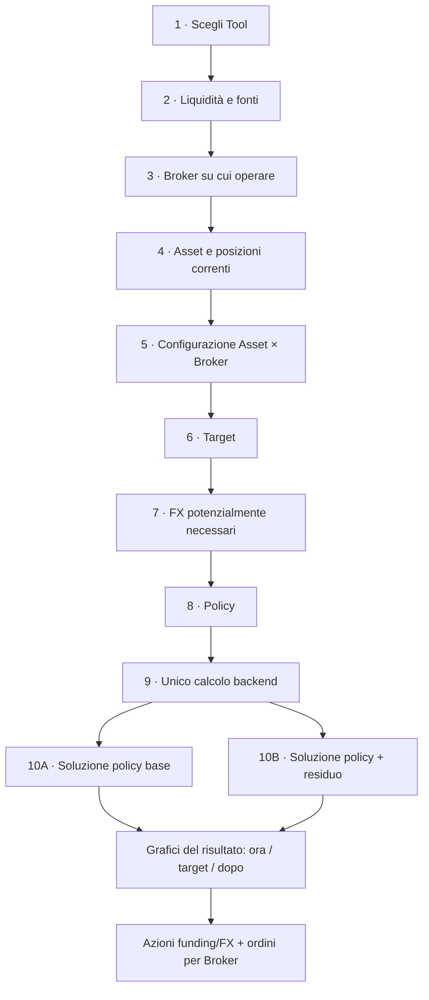
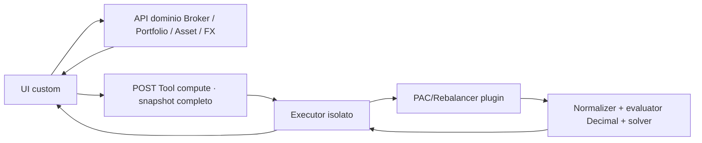

# PAC & Rebalancer — flusso end-to-end

> **Autorità:** design prodotto normativo corrente. Flusso end-to-end e UI sono
> approvati dal developer; implementazione resta separatamente congelata fino al
> checkpoint coordinatore e alla successiva autorizzazione Gate P1. Non è prova di
> consegna. Baseline combinata: onboarding + prototipo P1 non rilasciato, respinto
> come prodotto e destinato a sostituzione senza compatibilità legacy.
> **Legenda:** ✅ decisione confermata · 🟡 gate implementativo · ⏳ differita.

Catena:
[Piano iniziale](plan-phase00PacAllocator.prompt.md) →
[Round 2](plan-phase00Step2Round2-PacAllocatorUiRefinement.prompt.md) →
[Round 3](plan-phase00Step2Round3-PacAllocatorUiAcceptance.prompt.md) →
[Round 4 respinto](plan-phase00Step2Round4-PacAndRebalancerUiAcceptance.prompt.md) →
[Round 5 storico](plan-phase00Step2Round5-PacRebalancerOperationalPlanner.prompt.md) →
[Round 6 UI approvato](plan-phase00Step2Round6-PacRebalancerUiBlueprint.prompt.md) →
[Round 7 implementativo congelato](plan-phase00Step2Round7-PacRebalancerOperationalMigration.prompt.md).
Contesto P1:
[contratto](pac-allocator-contract.md),
[UX](pac-allocator-ux.md),
[evidenze](pac-allocator-evidence.md).
Estensioni escluse: [TODO_FUTURI](../../../../TODO_FUTURI.md).

## 1. Obiettivo dei due calcolatori

| Tool | Domanda a cui risponde |
|---|---|
| **PAC** | Come distribuire la liquidità selezionata tra gli Asset target e trasformarla in azioni eseguibili sui Broker scelti? |
| **Ribilanciamento** | Quali acquisti — e, se autorizzato, quali vendite — avvicinano l’intero portafoglio ai pesi target? |

I due Tool hanno flussi UI distinti, ma condividono normalizzazione, modello Broker/FX, quantizzazione, evaluator e solver.

## 2. Flusso complessivo



Il Tool segue un solo volo: **input completi → una richiesta di calcolo → output**.
Durante il wizard sono ammesse API dominio per copiare/autocompilare fatti, ma non
esistono una preview del planner, un solver intermedio o una “esecuzione” nello Step 6/7.

## 3. Wizard: input e comportamento

### Step 1 — Tool

- **PAC**: il target descrive la distribuzione della liquidità investita.
- **Ribilanciamento**: il target descrive la composizione finale dell’intero portafoglio.
- **Valuta di riferimento**: campo esplicito e modificabile, pre-popolato con la
  valuta predefinita dell’utente loggato. Serve come metro comune per target,
  confronti e grafici; non cambia le valute native di cash, ordini o trasferimenti.

### Step 2 — Liquidità e fonti

La liquidità non è “tutto il saldo dei Broker selezionati”. Ogni riga è una scelta esplicita.

#### Azioni disponibili

1. **Aggiungi nuova liquidità**
   - importo;
   - valuta;
   - etichetta sorgente opzionale.

2. **Prendi liquidità da…**
   - selezione di un conto/Broker esistente come sorgente, anche se non verrà usato
     per compravendita;
   - valuta nativa;
   - importo scelto dall’utente;
   - massimo bloccato al saldo disponibile noto.

3. **Aggiungi fonte manuale**
   - banca, conto o Broker non ancora presente nel sistema;
   - nome scenario-only;
   - valuta e saldo disponibile dichiarato;
   - importo da usare, sempre limitato al saldo dichiarato.

Un conto può quindi essere solo **sorgente di funding**: per esempio la banca dalla quale partire con il bonifico verso Directa. Se la stessa entità viene scelta anche nello Step 3 come Broker operativo, l’identità viene riusata e il cash non viene duplicato.

```text
LIQUIDITÀ
+---------------------------------------------------------------+
| + Aggiungi nuova liquidità                                    |
|   1.000,00 EUR · sorgente: Nuovo risparmio                    |
|                                                               |
| + Prendi liquidità da…                                        |
|   Banca X · EUR · disponibile 8.400 · usa [ 2.500 ]           |
|   Directa · EUR · disponibile 1.159 · usa [   800 ]           |
|   Broker Y · USD · disponibile   900 · usa [     0 ]          |
+---------------------------------------------------------------+
| Totale indicativo: 4.300 EUR equivalenti                     |
| Nota: i trasferimenti effettivi saranno calcolati dal backend. |
+---------------------------------------------------------------+
```

Il totale equivalente usa un tasso dominio con fonte/data visibili; la conversione
autorevole viene rifatta dal Tool sui fatti FX inclusi nello snapshot. Il risultato
deve produrre istruzioni come “bonifica 2.500 EUR da Banca X a Directa”, non soltanto
ordini Asset.

#### Configurazione della fonte di liquidità

Qui compaiono soltanto dati di funding:

- `source_kind`: `new_external`, `existing_account` oppure `manual_account`;
- saldo disponibile per valuta;
- importo selezionato;
- valuta nativa;
- route di trasferimento ammesse, se note;
- nome/etichetta mostrata nelle istruzioni finali.

Non compaiono fee di trading, frazionamento, PMC o policy fiscali: appartengono al ruolo
di esecuzione dello Step 3.

Le tre azioni UI costruiscono una union discriminata da `source_kind`; non generano
`is_new`, `is_existing` e `is_manual`.

### Step 3 — Broker operativi

L’utente sceglie i Broker sui quali accetta operazioni BUY/SELL. Sono disponibili due
azioni indipendenti:

1. **Scegli Broker esistente**
   - selezione fra i Broker già configurati;
   - prefill delle capability con origine e data visibili;
   - valori sempre modificabili nello scenario.

2. **+ Aggiungi Broker manuale**
   - crea un Broker scenario-only;
   - non richiede un record persistito;
   - richiede compilazione esplicita di tutte le capability necessarie;
   - non viene salvato automaticamente nelle impostazioni dell’utente.

Un Broker manuale può ricevere trasferimenti dalle fonti dello Step 2 ed essere usato
nel routing Asset×Broker esattamente come uno esistente. Un dato mancante non diventa
mai un default silenzioso.

Le due azioni costruiscono una union discriminata da `broker_kind`:
`existing_broker` oppure `manual_broker`. Non esistono booleani paralleli.

```text
BROKER SU CUI OPERARE
+---------------------------------------------------------------+
| [ Scegli Broker esistente ▼ ]  [ + Aggiungi Broker manuale ] |
+---------------------------------------------------------------+
| Directa · esistente       Configurazione precompilata [Modifica] |
| Broker PAC Demo · manuale Dati completi scenario-only [Modifica] |
+---------------------------------------------------------------+
```

#### Configurazione del Broker come luogo di investimento

Per ogni Broker operativo il dominio prova a precompilare:

- valute dei conti di trading;
- modalità FX;
- valuta di addebito predefinita;
- modalità di immissione ordine per valuta;
- passo monetario degli ordini per valuta;
- commissioni BUY e SELL;
- regime fiscale;
- minusvalenze pregresse note.

Nella v1 questi parametri operativi restano campi dello scenario: selezionare un
Broker esistente precompila soltanto i fatti già disponibili, ma non crea né
aggiorna una configurazione persistente. La persistenza del profilo operativo
Broker è un’estensione futura.

| Campo | Semantica |
|---|---|
| `fx_mode` | Esattamente `native_currency_required` oppure `auto_convert_on_buy`. |
| Valuta di addebito | Scelta esplicita per Broker auto-FX; un ordine usa un solo pool. |
| `order_instruction_kind[currency]` | Enum esclusivo `whole_quantity` oppure `monetary_amount`, valido per BUY e SELL. Il primo indica che nel Broker si inserisce una quantità intera; il secondo un notional monetario. Nessun booleano frazioni separato per lato. |
| `order_amount_step[currency]` | Richiesto soltanto con `monetary_amount`: incremento minimo dell’importo accettato dal configuratore Broker per quella valuta. Esempio: `1 EUR` consente `100`, `101`, `102`; `0,01 EUR` consente anche `100,25`. Non è precisione del prezzo né step di possesso. |
| `fee_buy` | Profilo commissionale BUY: fisso + percentuale sul controvalore, con minimo/massimo opzionali sulla componente percentuale. Tutti `0` sono validi, quindi un PAC gratuito si rappresenta senza eccezioni. |
| `fee_sell` | Profilo SELL indipendente, con la stessa struttura. Può essere normale anche quando `fee_buy=0`. |
| Regime fiscale | `amministrato` oppure `dichiarativo/libero`; determina il perimetro nel quale future policy fiscali possono compensare risultati. |
| Minusvalenze pregresse | Importo noto per Broker, default `0`, con valuta e data di riferimento esplicite. |

`withholding_kind` non è un altro controllo utente: il backend lo deriva dal
regime. Vale `broker_withheld` per `administered` e `self_reserved` per
`declarative_free`. Entrambi escludono la tax reserve dai BUY; solo
`self_reserved` resta cash fisico sul conto.

La schedule v1 è per riga SELL Asset×Broker: fee → gain positivo → rounding
tax reserve → disponibilità BUY nello stesso candidato. Non esistono netting
giornaliero, compensazione tra righe o rinvio implicito della riserva.

“Numero di titoli” e “Importo da investire” **non sono valori di input**: sono
istruzioni calcolate dal backend. Lo scenario configura però la forma accettata dal
Broker tramite `order_instruction_kind`. La risposta mantiene lo stesso discriminante:
con `whole_quantity` restituisce il numero intero di quote; con `monetary_amount`
restituisce il notional monetario quantizzato e mostra la quantità stimata solo come
informazione.

Nella prima versione le fee sono configurate per Broker, lato e valuta. Profili diversi
per mercato e formule dinamiche/degressive dipendenti dall’ordine giornaliero restano
estensioni future, non coefficienti nascosti.

`fee_buy.fixed`, `fee_buy.rate`, `fee_sell.fixed` e `fee_sell.rate` non diventano enum:
fisso e percentuale possono coesistere nello stesso profilo.

#### Enum e union: inventario normalizzato

| Concetto | Discriminante | Valori |
|---|---|---|
| Fonte liquidità | `source_kind` | `new_external`, `existing_account`, `manual_account` |
| Origine Broker operativo | `broker_kind` | `existing_broker`, `manual_broker` |
| Gestione FX Broker | `fx_mode` | `native_currency_required`, `auto_convert_on_buy` |
| Forma ordine Broker/valuta | `order_instruction_kind` | `whole_quantity`, `monetary_amount` |
| Regime fiscale | `tax_regime` | `administered`, `declarative_free` |
| Policy PAC | `pac_policy` | `proportional`, `min_fragmentation` |
| Modalità Rebalancer | `trade_mode` | `invest_only`, `invest_and_sell` |

Regola: un solo discriminante per alternativa esclusiva. I campi specifici vivono nel
relativo ramo della union; niente combinazioni impossibili di flag.

La risposta ripete `order_instruction_kind` e valorizza soltanto il ramo coerente:
quantità intera oppure importo monetario.

#### Confine campi utente / risultati backend

I dati auto-popolati diventano input soltanto dopo essere stati mostrati e
confermati nello snapshot. Variabili del solver e istruzioni operative non
appaiono nella configurazione.

| L’utente inserisce o conferma | Il backend calcola |
|---|---|
| Tool, data e valuta di riferimento | quantità titoli oppure importo cash |
| fonti, valute, disponibilità e importi da usare | quantità stimata per ordini cash |
| Broker, FX mode, valuta addebito e frazioni ammesse | funding e trasferimenti |
| step monetario e fee BUY/SELL | conversioni FX |
| Asset, prezzi, quantità correnti, PMC e aliquota fiscale | BUY/SELL e route effettive |
| Broker eleggibili, priorità e vincoli BUY/SELL per Asset | fee, riserva fiscale, addebiti/accrediti |
| target, spot/spread/buffer FX e policy | before/target/after, residui e proof/status |

### Step 4 — Asset

- Copia dal Portfolio/Asset oppure aggiunta manuale.
- Identità canonica dello strumento, mai matching per nome.
- Prezzo originale, valuta e `quote_base_quantity` conservati.
- Fonte, timestamp e staleness visibili.
- Metadati per Tipo, Settore e Geografia; quota `Unknown` esplicita se incompleti.
- Posizioni correnti separate per Broker: quantità esatta, valore, valuta e PMC.
- Il PMC è fornito per la coppia Asset×Broker, con valuta, data e provenance; non
  viene ricostruito dal nome dell’Asset né aggregato fra custodie diverse.
- Aliquota sulle plusvalenze per Asset, pre-popolata al `26%`, sempre modificabile,
  con origine del valore visibile. Nel wire è un rapporto Decimal (`0.26`), non
  una percentuale `26`.
- L’inventario frazionario già posseduto resta esatto e non viene arrotondato secondo
  la modalità dei nuovi ordini.

### Step 5 — Configurazione Asset × Broker

✅ La scelta Asset→Broker è configurazione, non policy.

Per ogni Asset:

- lista contenente soltanto i Broker sui quali l’utente è disposto a operare;
- priorità numerica per Broker;
- priorità uguali = nessuna preferenza;
- vincoli BUY e SELL con minimi e cap tipizzati;
- nessun routing fuori dalla lista;
- compatibilità con valuta, FX e modalità ordine mostrata subito.

```text
XMAW World
  Broker operativi selezionati:
  Directa       priorità [1]
  Fineco        priorità [1]  ← nessuna preferenza
  Broker Z      priorità [2]

  Esclusi dal routing: Banca X · funding-only
```

La divisione dello stesso Asset fra più Broker non ha una regola globale separata:
dipende dalla policy selezionata. A parità completa di fattibilità, target, policy e
priorità, lo spareggio minimizza le fee stimate; un identificatore stabile del Broker
serve soltanto come ultimo tie-break deterministico.

- Con **Minima frammentazione**, evitare lo split è parte dell’obiettivo.
- Con **Base proporzionale**, lo split è ammesso quando migliora il risultato dichiarato;
  a score identico prevale il costo minore.
- Future policy fiscali potranno scegliere diversamente usando PMC, regime fiscale e
  minusvalenze, senza alterare silenziosamente le policy correnti.

Ogni lato della route usa:

```text
SideOrderConstraints
├── minimum_order_notional       # condizionale se la riga esiste
├── required_min_notional?       # hard; se presente la riga è obbligatoria
└── maximum =
      NoOrderCap {cap_kind="none"}
    | QuantityOrderCap {cap_kind="quantity", quantity}
    | NotionalOrderCap {cap_kind="notional", money}
```

Un minimo condizionale può produrre un no-op; non rende il problema infeasible.
Un `required_min_notional` positivo può invece produrre
`infeasible_proven`. Nessun limite cambia unità implicitamente.
Required BUY e required SELL sullo stesso Asset canonico sono input
contraddittori e producono `needs_input`.

### Step 6 — Target

È l’ultimo input **allocativo** dell’utente, prima di FX finali e scelta della policy.
Non avvia calcoli, non mostra un’anteprima ideale e non produce operazioni.

#### PAC

- Percentuali della **nuova allocazione** per Asset.
- Il target descrive come si vorrebbe distribuire la liquidità selezionata.

#### Ribilanciamento

- Percentuali finali dell’**intero portafoglio investito**.
- Il backend stabilirà, dopo il submit, quali BUY/SELL sono compatibili con liquidità,
  modalità scelta e vincoli.

Il frontend qui valida soltanto forma, percentuali e completezza. Non riassegna
economicamente la liquidità: perfino il PAC deve includere quantizzazione, fee,
routing, funding e FX prima di conoscere il risultato realmente eseguibile.

### Step 7 — FX potenzialmente necessari

I dati delle fonti stanno nello Step 2, quelli dei Broker operativi nello Step 3 e le
compatibilità Asset×Broker nello Step 5. Qui compaiono soltanto le conversioni
potenzialmente necessarie date valute, funding e route ammesse. La scelta finale delle
conversioni appartiene all’unico calcolo backend.

Per ogni coppia FX necessaria:

| Campo | Comportamento |
|---|---|
| Tasso spot | Auto-popolato dal dominio FX, sempre modificabile. |
| Data/età | Mostrare fonte, timestamp e “N giorni fa”. |
| Spread aggiuntivo % | Costo di conversione; `0` valido. |
| Buffer FX % | Opzionale, default `0`: quota di cash lasciata intenzionalmente libera per assorbire oscillazione del cambio e arrotondamenti fra calcolo e inserimento dell’ordine. Non è una fee e non viene spesa. |

Per Broker `native_currency_required`, la tabella funding deve proporre una conversione preventiva. Per Broker `auto_convert_on_buy`, la conversione è parte del costo stimato dell’ordine.

**Chiarimento sul buffer FX.** Se il Tool stima un addebito di 1.000 EUR e l’utente
imposta `1%`, il solver non impegna anche i 10 EUR di buffer. Serve a ridurre il rischio
che una piccola variazione del cambio renda l’ordine non finanziabile. È un’opzione
esplicita, disattivata per default e resta cash nel conto.

Nomi congelati: input wire `fx_buffer_rate`, output monetario
`fx_buffer_amount`, label UI **Margine di sicurezza FX**.

### Prezzo operativo

Il prezzo Asset resta nella valuta originale. Prima del piano l’utente deve vedere anche il prezzo nella valuta di addebito del Broker.

**Confine architetturale:** la UI orchestra e mostra la conversione, ma non esegue da sola l’aritmetica economica. Chiede al backend/domain FX un prezzo convertito con tasso, fonte e data; il Tool riceve original price + FX fact e ricalcola/valida deterministicamente.

### Step 8 — Policy

#### PAC

1. **Base proporzionale**
   - divisione secondo target;
   - quantizzazione secondo il Broker;
   - residuo lasciato fermo.

2. **Minima frammentazione degli acquisti**
   - non riduce il capitale da investire;
   - minimizza prima gli Asset comprati su più Broker;
   - poi minimizza il numero totale di righe ordine;
   - vincoli restano rigidi e la tupla obiettivo base non può peggiorare.

In entrambi i casi, a parità completa dello score della policy e delle priorità
Asset×Broker, il solver minimizza `fee_buy`.

#### Ribilanciamento

1. **Investi soltanto** — default
   - usa nuova liquidità e cash selezionato;
   - nessuna vendita implicita;
   - restituisce la soluzione più vicina se il target esatto non è raggiungibile.

2. **Investi e vendi**
   - usa prima la liquidità verso gli Asset sotto target;
   - se non basta, vende Asset sopra target per finanziare quelli sotto target;
   - nessuna vendita oltre inventario;
   - mai buy+sell dello stesso Asset;
   - minimo turnover/costi/numero ordini come spareggi deterministici.

Queste due modalità bastano per il primo rilascio. Con nuova liquidità `0`, “Investi e vendi” copre anche il caso di ribilanciamento finanziato solo da vendite.

### Step 9 — Calcolo

Un solo submit invia lo snapshot completo al Tool backend. Non esistono operazioni
`preview_target` o chiamate planner durante gli step precedenti.

Il backend produce due risultati nella stessa risposta, se il benchmark conferma costo ragionevole:

- **Soluzione policy base**;
- **Soluzione policy con ottimizzazione residuo**.

Il secondo passaggio non può ridurre o spostare il piano base. Può soltanto aggiungere acquisti ammissibili, preservando policy, target, priorità, cash, FX, fee e margini.

Esito numerico separa tre dimensioni:

- `availability`: `ready`, `needs_input`, `invalid`, `unsupported`;
- `outcome`: `no_op`, `infeasible_proven`, `incumbent_found`, `no_incumbent`;
- `proof`: `optimal_proven`, `gap_bounded`, `not_proven`;
- `stop_reason`: `completed`, `time_limit`, `node_limit`, `cancelled`.

Il contratto atomico deve restare entro i limiti piattaforma già esistenti:
`131072` byte input, `262144` byte output, soft timeout `4 s`, hard timeout `5 s`.
Dominio minimo supportato: 32 Asset/target, 8 Broker operativi, 16 fonti, 64 route,
8 valute, 24 fatti FX, 64 ordini per soluzione e 256 issue. Il mancato rispetto
blocca l'implementazione; non autorizza omissioni silenziose o riduzioni implicite.

`target_deviation`, `cash_deficit` e gap sono numeri separati, non status. Un timeout
con incumbent resta `incumbent_found/not_proven/time_limit`; “optimal” compare soltanto
con prova e specifica se vale sul problema base o sul post-step ristretto.

`no_op` copre il piano vuoto fattibile quando nessuna operazione ammessa migliora
l'obiettivo, inclusi budget sotto minimi condizionali e cash senza route utile.
`infeasible_proven` è ammesso soltanto quando un hard constraint esplicito, per esempio
un `required_min_notional` obbligatorio incompatibile con cash/route, rende vuoto
l'intero dominio. Input mancante resta `needs_input`; limite senza incumbent resta
`no_incumbent`, mai falsa infeasibility.

`base_solution` e `residual_optimized_solution` sono entrambe presenti per
`no_op` e `incumbent_found`; senza delta utile la seconda coincide con la prima
e dichiara delta zero. Sono assenti per `needs_input`, `unsupported`,
`infeasible_proven` e `no_incumbent`.

### Step 10 — Risultato, poi istruzioni

La risposta apre con la rappresentazione del **piano realmente calcolato**, non con
un’anteprima teorica:

1. EChart della distribuzione degli acquisti/vendite della soluzione;
2. confronto portafoglio **Ora / Target / Dopo il piano**;
3. card Dashboard per Tipo, Settore e Geografia, inclusa quota `Unknown`;
4. selettore fra soluzione base e soluzione con ottimizzazione residuo;
5. sotto i grafici, azioni di funding/FX e tabelle operative per Broker.

Per il PAC il primo grafico confronta target degli acquisti e acquisti realmente
proposti. Per il Rebalancer mostra l’effetto congiunto di BUY e SELL sul portafoglio
totale. Se il risultato non convince, l’utente torna agli input e rilancia un nuovo
calcolo; nessun ordine viene eseguito implicitamente.

## 4. Modello matematico

### 4.1 Notazione minima

- `a`: Asset;
- `b`: Broker operativo;
- `s`: fonte di liquidità;
- `c,d`: valute native dei ledger;
- `v`: valuta tecnica di valorizzazione;
- `w_a`: peso target;
- `V_a^(v)`: valore corrente dell’Asset nella valuta `v`;
- `P_source,a^(q)`: prezzo originale nella valuta di quotazione `q`;
- `Q_a`: `quote_base_quantity` positiva cui il prezzo sorgente si riferisce;
- `p_a^(q)=P_source,a^(q)/Q_a`: prezzo unitario normalizzato una sola volta;
- `P_ab^(mid,c)`: prezzo convertito nella valuta di addebito `c` al tasso mid;
- `P_ab^(chg,c)`: addebito stimato nella valuta `c`, incluso spread FX ma non fee;
- `P_ab^(sell,c)`: credito SELL stimato nella valuta `c`, al netto dello spread ma non delle fee;
- `Δm_bc`: passo monetario del Broker nella valuta;
- `μ_c`: minima unità contabile della valuta, dettaglio backend non configurabile;
- `u_sc`: liquidità scelta dalla sorgente;
- `t_sbc`: trasferimento dalla sorgente al Broker;
- `q_ab`: quantità intera proposta con `whole_quantity`;
- `M_ab`: importo proposto con `monetary_amount`;
- `h_ab`: quantità esatta posseduta sul Broker;
- `n_ab`: quantità venduta;
- `y_ab`: indicatore binario “esiste un ordine”.

Variabili decisionali: trasferimenti `t`, conversioni FX, `q`/`M`, `n` e `y`.
Valori target, investimenti, residui, valori finali ed esposizioni sono derivati.
Ogni vincolo di cassa vive nella valuta nativa del relativo ledger; la valuta `v`
serve soltanto per confrontare valori e obiettivi.

### 4.2 Liquidità e trasferimenti

Per ogni sorgente conosciuta:

```math
0 \le u_{s,c} \le \text{saldo disponibile}_{s,c}
```

```math
\sum_b t_{s,b,c} \le u_{s,c}
```

Per un Broker che è anche sorgente, `u_bc` è soltanto il cash esplicitamente selezionato,
mai l’intero saldo. È vietato il falso auto-trasferimento:

```math
t_{b,b,c}=0
```

La prima versione ammette trasferimenti soltanto su route dichiarate nello snapshot e
li tratta come gratuiti e immediatamente disponibili ai fini del piano. Fee, limiti e
tempi di settlement dei bonifici sono un’estensione futura.

Ogni conversione ammessa `j=(b,c→d)` ha debito sorgente `f_j≥0` e credito accoppiato:

```math
\operatorname{credito}^{(d)}_j
=
f_j R^{eff}_{c\to d}
```

Non esistono crediti FX liberi. Sono ammesse solo coppie dichiarate, un singolo hop per
percorso di funding e nessun ciclo attivo.

Per ogni Broker/valuta, dopo trasferimenti, FX, SELL, BUY, fee e riserva fiscale
buffer:

```math
\begin{aligned}
\operatorname{cashDisponibileFinale}_{b,c}
=\;&u_{b,c}
+\sum_{s\ne b}t_{s,b,c}
-\sum_{b'\ne b}t_{b,b',c}\\
&+\sum_{j:\,\cdot\to c}\operatorname{credito}^{(c)}_j
-\sum_{j:\,c\to\cdot}f_j\\
&+\sum_a\operatorname{proventoSell}^{(c)}_{a,b}
-\sum_a\operatorname{addebitoBuy}^{(c)}_{a,b}\\
&-\sum_a\operatorname{feeBuy}^{(c)}_{a,b}
-\sum_a\operatorname{feeSell}^{(c)}_{a,b}\\
&-\sum_a\operatorname{taxReserve}^{(c)}_{a,b}
-\operatorname{feeFX}^{(c)}_b
-\operatorname{fxBuffer}^{(c)}_b
\ge 0
\end{aligned}
```

La nuova liquidità è una sorgente esterna esplicita; non viene sommata due volte al
cash già presente. Cash non selezionato nello Step 2 è invisibile al solver.
Il ledger accredita il provento SELL lordo e sottrae fee SELL e tax reserve come
termini distinti. `cashNetSell` è solo un totale derivato: non viene accreditato di
nuovo.

Il buffer non è spesa:

```math
\operatorname{cashFisicoFinale}_{b,c}
=
\operatorname{cashDisponibileFinale}_{b,c}
+\operatorname{fxBuffer}^{(c)}_b
+\operatorname{selfReservedTax}^{(c)}_b
```

Il primo saldo è spendibile dal piano; il secondo è il saldo fisico atteso.
`selfReservedTax` include solo SELL `withholding_kind="self_reserved"`; una
ritenuta `broker_withheld` è già uscita dal conto.

### 4.3 Fee BUY/SELL

Per lato `h ∈ {buy, sell}`, controvalore `N`, fisso `f_h`, aliquota `r_h`,
minimo `l_h` e massimo opzionale `u_h`:

```math
\operatorname{fee}_h(N)=
\begin{cases}
0, & N=0\\
f_h, & N>0\land r_h=0\\
f_h+\min(\max(r_hN,l_h),u_h), & N>0\land r_h>0
\end{cases}
```

`u_h=+∞` quando assente e `0≤l_h≤u_h`. Minimo e massimo si applicano alla componente
percentuale. La fee è per riga ordine, nella valuta di addebito, ed è zero quando
l’ordine non esiste. Il BUY gratuito dei piani PAC è `f_buy=0` e `r_buy=0`, mentre il
SELL mantiene il proprio profilo indipendente.

Prima versione: profilo per Broker/lato/valuta. Mercato specifico e formule
dinamiche/degressive dipendenti dal numero d’ordine giornaliero sono differiti.

### 4.4 FX

Definiamo `R_c→d` come unità di valuta `d` ricevute per una unità di `c`.

Per spread percentuale `s`:

```math
R^{eff}_{c\to d}=R_{c\to d}(1-s)
```

Per ottenere `A_d` nella valuta destinazione:

```math
D_c=\frac{A_d}{R^{eff}_{c\to d}}
```

Il debito convertito è `D_c`. Con input `fx_buffer_rate=m`, distinto dal costo:

```math
\operatorname{fxBuffer}_c=mD_c
```

```math
\operatorname{cashRichiesto}_c
=
D_c+\operatorname{fxBuffer}_c+\operatorname{feeFX}_c
```

Il buffer resta nel conto sorgente: non viene convertito né sottratto due volte.
L'output monetario usa il nome `fx_buffer_amount`.
`feeFX_c` è una fee di conversione nella valuta `c`; le fee ordine restano separate.
Serve inoltre `0≤s<1`.

Per un Asset quotato in `q` e addebitato in `c`:

```math
P_{a,b}^{(mid,c)}
=
\frac{p_a^{(q)}}{R_{c\to q}}
```

```math
P_{a,b}^{(chg,c)}
=
\frac{p_a^{(q)}}{R^{eff}_{c\to q}}
```

Per un SELL accreditato in `c`:

```math
P_{a,b}^{(sell,c)}
=
p_a^{(q)}R^{eff}_{q\to c}
```

La cassa BUY usa `P^(chg,c)` e la cassa SELL usa `P^(sell,c)`; investimento e grafici
valorizzano al mid. La differenza è costo FX, mai investimento. Se `c=q`, i prezzi
coincidono e il costo FX è zero.

Niente cicli FX o arbitraggio sintetico: si modellano soltanto le conversioni necessarie al funding dichiarato.

### 4.5 PAC — budget raggiungibile, ordini e target

I pesi soddisfano:

```math
\sum_a w_a=1,\qquad w_a\ge0
```

Il cash selezionato è un limite lordo, non il capitale investibile.
`K_reachable` è il budget lordo che può raggiungere almeno un BUY eleggibile,
entro route/cap dichiarati e valorizzato al mid; esclude cash intrappolato.
Fee fisse, min/max, numero di righe e FX dipendono invece dal candidato: non
esiste un singolo `B_ref` calcolabile prima delle decisioni. Il solver lavora
direttamente sui ledger. Per un candidato `x`, il backend può esporre soltanto
il diagnostico:

```math
B_{ref}(x)
=
K_{reachable}^{(v)}
-C_{buy}^{(v)}(x)
-C_{FX}^{(v)}(x)
-H_{FX}^{(v)}(x)
```

Cash selezionato ma non instradabile resta residuo con issue e non entra nel
denominatore PAC. `B_ref(x)` non è un bound usato per costruire `x`.

#### Broker con `whole_quantity`

La decisione BUY è:

```math
q_{a,b}\in\mathbb{Z}_{\ge0}
```

```math
\operatorname{addebitoBuy}_{a,b}^{(c)}
=
\operatorname{round}_{\mu_c,\mathrm{HALF\_UP}}
\left(q_{a,b}P_{a,b}^{(chg,c)}\right)
```

La fee BUY è un termine separato del ledger. L'investimento valorizzato al mid è:

```math
I_{a,b}^{(v)}
=
q_{a,b}P_{a,b}^{(mid,c)}R_{c\to v}
```

La quantità è intera per definizione; non esiste un parametro `quantity_step`.

#### Broker con `monetary_amount`

`M_buy,a,b` è l'importo cash, fee escluse, che l'utente inserirà nel Broker:

```math
M_{buy,a,b}
=
\Delta m_{b,c}z_{a,b},
\qquad z_{a,b}\in\mathbb{Z}_{\ge0}
```

```math
\widehat q_{a,b}
=
\frac{M_{buy,a,b}}{P_{a,b}^{(chg,c)}}
```

```math
\operatorname{addebitoBuy}_{a,b}^{(c)}
=
\operatorname{round}_{\mu_c,\mathrm{HALF\_UP}}(M_{buy,a,b})
```

```math
I_{a,b}^{(v)}
=
\widehat q_{a,b}P_{a,b}^{(mid,c)}R_{c\to v}
```

Quindi, con spread positivo, l'investimento mid è minore di `M_buy`; la differenza
è costo FX implicito e non un secondo addebito. La fee BUY si aggiunge
separatamente. La quantità stimata è informativa; non esiste una seconda
“semantica importo”.

Witness cross-currency minimo, fee zero: prezzo `99 USD`, mid
`1 USD/EUR`, spread `1%` ⇒ prezzo charge `100 EUR`. Un ordine cash
`M_buy=100 EUR` produce quantità stimata `1`, investimento mid `99 EUR`,
costo spread `1 EUR` e addebito `100 EUR`, non `101 EUR`.

`μ_c` non è un campo UI: significa soltanto che EUR viene contabilizzato ai centesimi,
JPY alle unità, ecc. La prima versione usa Decimal e una regola backend documentata
`ROUND_HALF_UP`. Con `monetary_amount`, `M_ab` rispetta anche `Δm_bc`, che può
essere più grande della minima unità contabile.

Con minimo operativo `m_min,b,c`, una riga è nulla oppure valida:

```math
M_{a,b}\in
\{0\}\cup
\left[
\Delta m_{b,c}\left\lceil\frac{m^{min}_{b,c}}{\Delta m_{b,c}}\right\rceil,\infty
\right)
\cap \Delta m_{b,c}\mathbb{Z}
```

Per ordine intero, `q_ab=0` oppure `q_ab≥1` e
`q_ab P_ab^(chg,c)≥m_min,b,c`. Sotto minimo: nessuna riga, nessuna fee, issue
`below_min_order`.

Un `required_min_notional` sulla route è invece un hard constraint esplicito:
quando positivo, rende obbligatoria quella route e può produrre
`infeasible_proven`. Il minimo condizionale non lo fa.

#### Target e residuo Asset-level

```math
B_{actual}(x)=\sum_{a,b}I_{a,b}^{(v)}
```

```math
T_a=w_aK_{reachable}^{(v)}
```

```math
d_a(x)=
\left|
\frac{\sum_b I_{a,b}^{(v)}-T_a}{K_{reachable}^{(v)}}
\right|
```

Il target e il residuo sono Asset-level, aggregati su tutti i Broker. Non si
fabbrica una “soglia” per route quando lo split è decisione del solver.
`proportional` ottimizza lessicograficamente: minimo `max_a d_a`, minimo
`sum_a d_a²`, minimo fee/priorità secondo policy, tie-break stabile. Il secondo
livello è esatto: una formulazione che lo sostituisce con L1, approssimazioni o
semplice `not_proven` non soddisfa il contratto. Se SciPy/HiGHS non può rappresentarlo
esattamente nel dominio supportato, l'implementazione si ferma per nuova decisione
dipendenza. Fee, tax, spread e buffer non sono investimento né denominatore.

Se `K_reachable=0`, `d_a` resta `null` e l'esito è `no_op`. Se
`K_reachable>0` ma `B_actual=0`, per esempio sotto minimo condizionale,
`d_a=|w_a|` e l'esito resta `no_op`. `infeasible_proven` richiede hard
constraint espliciti che rendano impossibile anche il piano vuoto.

### 4.6 Policy “Minima frammentazione”

Se `y_ab = 1` quando esiste un ordine:

```math
\text{split}(a)=\max\left(0,\sum_b y_{a,b}-1\right)
```

`y` deve essere legato all’ordine. Per quantità intere:

```math
y_{a,b}\le q_{a,b}\le Q^{max}_{a,b}y_{a,b}
```

Per importo monetario, con minimo effettivo `m_eff` già allineato allo step:

```math
m^{eff}_{a,b}y_{a,b}
\le M_{a,b}\le
U_{a,b}y_{a,b}
```

`Qmax_ab` e `U_ab` sono derivati rispettivamente da cash raggiungibile/prezzo
charge e cash raggiungibile/step. I bound SELL derivano dall'inventario esatto.
Nessun Big-M arbitrario è ammesso; se un bound finito non è derivabile, lo snapshot
è `needs_input` o `unsupported`.

Sia `B_base` il capitale investito dalla soluzione proporzionale e `d_a` la deviazione
dal target. La policy di minima frammentazione applica vincoli espliciti
`B_actual≥B_base` e non può peggiorare la tupla obiettivo Decimal della soluzione
proporzionale (`max d_a`, poi `sum d_a²`); il piano nullo non può quindi vincere.

Ordine lessicografico:

1. rispettare cassa e vincoli operativi senza peggiorare la tupla base;
2. non investire meno della soluzione proporzionale;
3. minimizzare `Σ_a split(a)`;
4. minimizzare `Σ_ab y_ab`;
5. minimizzare `Σ_ab π_ab y_ab`, con `π_ab` priorità dichiarata;
6. minimizzare fee a score invariato;
7. usare un identificatore Broker stabile come ultimo spareggio deterministico.

Nessuna combinazione di pesi nascosti: ogni livello viene ottimizzato e congelato prima
del successivo.

### 4.7 Ottimizzazione del residuo

Definiamo `z_ab` come decisione d’ordine nella sua unità nativa: quantità intera
quando il Broker non ammette frazioni, importo monetario quantizzato quando le
ammette. Partendo dalla
soluzione base `z⁰`:

```math
z_{a,b}=z^0_{a,b}+\Delta z_{a,b},\qquad \Delta z_{a,b}\ge0
```

Il post-step massimizza `Σ_ab ΔI_ab^(v)`. Il cash residuo paga sia investimento sia
incremento delle fee:

```math
\sum_{a,b}
\left(
\Delta\operatorname{addebitoBuy}_{a,b}
+\Delta\operatorname{feeBuy}_{a,b}
\right)
\le
\operatorname{cashResiduo}
```

Il confronto è applicato per ledger/valuta, non dopo una somma valutaria fittizia.
Il post-step non può:

- diminuire una quantità base;
- introdurre vendite;
- peggiorare la tupla obiettivo base;
- aumentare `split(a)` con la policy “Minima frammentazione”;
- spendere fee/margini come se fossero investimento.

Fra i candidati ammessi massimizza prima `ΣΔI`, poi minimizza fee/righe
incrementali e usa tie-break stabile. Può aprire una nuova riga soltanto quando
non crea uno split vietato e non peggiora la tupla obiettivo base. Output separa
`ΣΔI` e `ΣΔfee`; “residuo recuperato” non include fee. È valido che la soluzione
ottimizzata coincida con la base.

### 4.8 Ribilanciamento — rilassamento continuo buy-only

Sia `V₀=Σ_a V_a^(v)` il solo portafoglio investito corrente, escluso il cash selezionato,
e `Σ_a w_a=1`. Nel rilassamento continuo, senza costi né quantizzazione, il valore
finale minimo che rende tutti gli acquisti non negativi è:

```math
F^*=\max_{a:w_a>0}\frac{V_a^{(v)}}{w_a}
```

Il capitale netto minimo investito è:

```math
K^*=F^*-V_0
```

Gli acquisti teorici al minimo sono:

```math
B_a^*=w_aF^*-V_a^{(v)}
```

Per un capitale netto generico `K_net≥K*`:

```math
F=V_0+K_{net}
```

```math
B_a=w_aF-V_a^{(v)}
```

Il cash lordo `K_gross` deve coprire anche costi e buffer:

```math
K_{net}
=
K_{gross}-C_{buy}(B)-C_{FX}(B)-H_{FX}(B)
```

Questa relazione viene risolta dal solver. `K_gross≥K*` è soltanto necessario; è
sufficiente esclusivamente nel rilassamento continuo, gratuito e senza vincoli.
Quantizzazione, minimi, routing e fee rendono il target esatto generalmente
irraggiungibile: il piano operativo minimizza e mostra deviazione/deficit senza
tolleranze nascoste.

Se esiste un Asset con `w_a=0` e `V_a^(v)>0`, il target esatto è impossibile senza vendita.
`F*`, `K*` e `B*` restano diagnostici backend, non una preview frontend.
Per ogni candidato discreto, il target notional Asset-level è
`w_a * sum_a V_a_final`; la deviazione confronta il valore finale con tale
target e non usa il budget PAC `K_reachable`.

### 4.9 Ribilanciamento con vendite

Con holding esatto `h_ab`, lo stesso
`order_instruction_kind[currency]` governa BUY e SELL.

Con `whole_quantity`:

```math
n_{a,b}\in\mathbb{Z}_{\ge0},\qquad n_{a,b}\le\lfloor h_{a,b}\rfloor
```

Con `monetary_amount`, il SELL usa un importo `M_sell,a,b` multiplo di
`Δm_bc`; è il provento lordo richiesto. La quantità stimata
`n_ab=M_sell,a,b/P_ab^(sell,c)` è derivata e deve rispettare `n_ab≤h_ab`.
La v1 non introduce un'eccezione implicita “sell all”: se il valore dell'intera
posizione non è allineato allo step, può restare un piccolo residuo.
Non esistono flag separati per acquisto/vendita frazionaria.

Il provento lordo nella valuta `c` è:

```math
\operatorname{proventoSell}_{a,b}^{(c)}
=
n_{a,b}P_{a,b}^{(sell,c)}
```

Il costo fiscale della porzione venduta è:

```math
\operatorname{costBasisSold}_{a,b}^{(c)}
=n_{a,b}\operatorname{PMC}_{a,b}^{(c)}
```

Dopo la fee SELL, la plusvalenza positiva stimata è:

```math
\operatorname{taxableGain}_{a,b}^{(c)}
=
\max\left(
\operatorname{proventoSell}_{a,b}^{(c)}
-\operatorname{feeSell}_{a,b}^{(c)}
-\operatorname{costBasisSold}_{a,b}^{(c)},
0
\right)
```

Con aliquota Asset `rho_a`, pre-popolata al `26%` ma modificabile:

```math
\operatorname{taxReserve}_{a,b}^{(c)}
=
\operatorname{round}_{\mu_c,\mathrm{HALF\_UP}}
\left(
\rho_a\operatorname{taxableGain}_{a,b}^{(c)}
\right)
```

La liquidità SELL riutilizzabile è:

```math
\operatorname{cashNetSell}_{a,b}^{(c)}
=
\operatorname{proventoSell}_{a,b}^{(c)}
-\operatorname{feeSell}_{a,b}^{(c)}
-\operatorname{taxReserve}_{a,b}^{(c)}
```

Nel ledger si accredita `proventoSell` lordo e si sottraggono fee e riserva fiscale
separatamente; l'evaluator verifica l'equivalenza del saldo spendibile con
`cashNetSell` e vieta il double posting. `withholding_kind` indica se la riserva è
uscita dal conto o resta nel saldo fisico non spendibile. Solo l'equivalente netto
può finanziare BUY. Regime e minusvalenze pregresse restano fatti dello snapshot,
ma la v1 non applica compensazioni fiscali implicite.

Il PMC usato nella formula deve essere già nella valuta fiscale/ledger del SELL,
oppure accompagnato da una conversione esplicita con fonte e data. Se non è
riconciliabile, il risultato richiede input: il Tool non inventa un cambio fiscale.
Il valore finale nella valuta `v` è:

```math
V_a^{final,(v)}
=
V_a^{(v)}
+\sum_b I_{a,b}^{buy,(v)}
-\sum_b I_{a,b}^{sell,(v)}
```

Per vietare BUY+SELL dello stesso Asset, con `β_a∈{0,1}` e limite valido `U_a`:

```math
\sum_b I_{a,b}^{buy,(v)}\le U_a\beta_a
```

```math
\sum_b I_{a,b}^{sell,(v)}\le U_a(1-\beta_a)
```

`U_a` non è una costante arbitraria: per BUY deriva dalla somma dei bound di
cash raggiungibile sulle route; per SELL dal valore dell'inventario effettivo.
Se non è possibile derivare un bound finito, lo snapshot non è risolvibile.

La modalità **Investi e vendi** è sequenziale: congela prima il miglior piano
invest-only; abilita SELL sopra target soltanto per ridurre il gap residuo. Costi,
riserva fiscale e proventi netti entrano nella stessa conservazione di cassa.
Non è un ottimo BUY/SELL globale che può scartare la migliore fase invest-only;
l'oracle esaustivo deve replicare la stessa sequenza.

### 4.10 Card Tipo / Settore / Geografia

Sia `α_ak` l’esposizione dell’Asset `a` alla categoria `k`:

```math
\alpha_{a,Unknown}
=
1-\sum_{k\ne Unknown}\alpha_{a,k}\ge0
```

```math
E_k^{ora}
=
\frac{\sum_a V_a^{(v)}\alpha_{a,k}}{\sum_a V_a^{(v)}}
```

```math
E_k^{target}=\sum_a w_a\alpha_{a,k}
```

```math
E_k^{dopo}
=
\frac{\sum_a V_a^{final,(v)}\alpha_{a,k}}{\sum_a V_a^{final,(v)}}
```

Tutti i valori usano la stessa valuta `v`, gli stessi fatti FX e la stessa data. Le
quote mancanti confluiscono in `Unknown`; non si rinormalizza il sottoinsieme noto.
`Ora`, `Target` e `Dopo` usano sempre lo stesso denominatore: valore investito negli
Asset, cash escluso. Cash selezionato, trasferito, convertito, investito, riservato e
residuo usa un grafico/KPI funding separato; non si aggiunge Cash a una sola serie.

### 4.11 Risultato lordo schematico per Broker, non base imponibile

Per posizione Asset×Broker, con quantità venduta `n_ab`, prezzo operativo `p_ab` e
PMC unitario `k_ab` espressi nella stessa valuta fiscale/di calcolo, la prima stima
lorda del risultato è:

```math
G_{a,b}=n_{a,b}(p_{a,b}-k_{a,b})
```

`G_ab>0` indica plusvalenza lorda; `G_ab<0` minusvalenza lorda. Prezzo e PMC devono
essere allineati secondo le date e valute fiscali dichiarate. `G` non è una base
imponibile: servono categoria dello strumento, compensabilità, scadenza e regole
applicabili.

- In **regime amministrato**, una futura policy considera il bacino minus del singolo
  Broker/intermediario.
- In **regime dichiarativo/libero**, una futura policy può lavorare sul perimetro
  fiscale dichiarato dall’utente tra Broker compatibili.

PMC, regime e minus pregresse sono comunque consegnati al solver fin dalla prima
versione. Le policy iniziali non li trasformano però in un obiettivo fiscale nascosto.

### 4.12 Audit matematico indipendente — 15 settembre 2026

Revisione read-only affidata a sotto-agente matematico. Verdetto:

- corrette, sotto precondizioni esplicite: quantizzazione intera/monetaria, formula FX
  diretta, `split(a)`, rilassamento continuo `F* / K* / B*`, esposizioni ponderate,
  risultato lordo PMC e aritmetica della tabella Directa;
- inizialmente bloccanti: budget non netto dei costi, unità multi-valuta, crediti FX
  non accoppiati, proventi SELL assenti dalla cassa, SELL non vincolati per custodia,
  falsa sufficienza di `K≥K*`, obiettivo frammentazione degenerabile a zero e
  post-ottimizzazione auto-contraddittoria;
- corretti in questo artifact tramite ledger nativi, prezzi mid/charge/sell, cash law
  completa, fee piecewise, inventario Asset×Broker, linking `y`, obiettivi
  lessicografici e status/proof ortogonali.

La successiva correzione developer chiude il blocker sulla ritenuta SELL:
fee SELL → plusvalenza positiva rispetto al PMC → aliquota Asset → riserva fiscale
prima del riuso della liquidità.

Una seconda review read-only ha inoltre corretto:

- semantica cash BUY/SELL frazionaria e witness spread;
- `B_ref` circolare, ora solo diagnostico candidato-dipendente;
- tolleranze `epsilon` nascoste, eliminate;
- confine `no_op`/`infeasible_proven`;
- double posting SELL lordo/netto;
- `withholding_kind` derivato e distinzione saldo spendibile/fisico;
- nomenclatura `fx_buffer_rate`/`fx_buffer_amount`;
- target/residui Asset-level separati dalle tabelle Broker;
- denominatore comune dei grafici;
- output riga ordine completo;
- SELL frazionario e residuo senza eccezione implicita;
- upper bound derivati, mai Big-M arbitrari;
- semantica sequenziale Rebalancer e relativo oracle;
- cash intrappolato fuori dal denominatore PAC.

## 5. Output operativo

Ogni soluzione contiene almeno due famiglie di tabelle.

### 5.1 Funding, trasferimenti e FX

| Azione | Da | A | Valuta | Importo | FX | Spread | Buffer FX | Motivo |
|---|---|---|---:|---:|---|---:|---:|---|
| Bonifico | Banca X | Directa | EUR | 2.500,00 | — | — | — | Funding ordini Directa |
| Auto-FX acquisto | Directa EUR | Directa USD | USD | 420,00 | 1,1732 | 0,50% | 1,00% buffer | Acquisto Asset USD |
| Nessuna azione | Fineco | Fineco | EUR | 0,00 | — | — | — | Liquidità non selezionata |

### 5.2 Allocazione Asset e ordini per Broker

La tabella storica resta un utile witness aritmetico, ma la sua “soglia per riga”
è corretta soltanto quando esiste un unico Broker. Con più Broker il target appartiene
all'Asset e lo split è una decisione del solver. L'output separa quindi:

#### Allocazione Asset — esempio illustrativo

| ETF | Target Asset | Valore aggregato | Residuo target | Residuo % |
|---|---:|---:|---:|---:|
| **XMAW World** | **2.563 €** | 2.561,730 € | **1,270 €** | **0,050%** |
| **XDWF Financials** | **465 €** | 464,585 € | **0,415 €** | **0,089%** |
| **XDWI Industrials** | **448 €** | 446,820 € | **1,180 €** | **0,263%** |
| **HEAL Healthcare Innovation** | **183 €** | 182,140 € | **0,860 €** | **0,470%** |
| **Totale** | **3.659 €** | **3.655,275 €** | **3,725 €** | **0,102%** |

#### Ordini Directa — esempio illustrativo

| ETF | Lato | Prezzo | Istruzione Broker | Quantità | Valore mid | Fee | Addebito/accredito |
|---|---|---:|---:|---:|---:|---:|---:|
| **XMAW World** | BUY | 50,230 € | 51 titoli | 51 esatta | 2.561,730 € | 0 € | 2.561,73 € |

Ogni riga ordine reale contiene Asset, Broker, lato, currency, istruzione
`whole_quantity | monetary_amount`, quantità esatta/stimata, prezzi originale/mid/
charge/sell con provenance, `asset_target_notional` come riferimento aggregato
non sommabile, notional operativo e mid, fee, costo FX, tax reserve e
`withholding_kind`,
`order_cash_amount` rounded, `total_cash_debit` BUY oppure
`gross_cash_credit`/`net_cash_credit` SELL, issue e vincoli attivi. Il
target/residuo viene riportato nel summary Asset, non duplicato sulle route.
Se il target Asset è zero, il relativo rapporto di residuo è `null`, non
infinito o non finito.

I valori storici sono notional analitici a tre decimali. La cassa reale usa minor
unit e rounding backend: **Addebito/accredito Broker** resta distinto da “Valore mid”
e riconcilia il funding. Per ordini monetari la quantità è informativa; il valore da
inserire nel Broker è l'importo quantizzato.

Con un solo Broker le due tabelle possono essere presentate nello stesso gruppo
visivo, purché target e residuo restino totalizzati una volta sola.

### 5.3 Due risultati sempre confrontabili

```text
[ Soluzione policy base ]
  Funding/FX per Broker
  Ordini per Broker
  Residuo totale
  Allocazione prima/target/dopo

[ Soluzione policy con ottimizzazione residuo ]
  Stesse tabelle
  Delta evidenziati
  Capitale aggiuntivo investito
  Residuo recuperato
```

Gli esempi storici non sono golden di ottimalità: servono soltanto a verificare l’aritmetica sotto assunzioni dichiarate.

## 6. Backend: situazione reale e cambi richiesti

### 6.1 Oggi

- `ToolService` e `ToolPlugin.compute(tool_code, parameters, context)` sono il confine plugin (`backend/app/services/tools/base.py:44-75`).
- Catalogo e schema derivano da Pydantic/registry (`backend/app/services/tools/registry.py:96-128`; `backend/app/services/tools/catalog.py:37-50`).
- Le API applicano limiti e delegano all’executor (`backend/app/api/v1/tools.py:76-106,123-164`).
- PAC e Rebalancer condividono `operation="analyze"`, `report_currency`, target, cash, contributi e tassi (`backend/app/schemas/pac_allocator.py:82-143`).
- Il plugin espone due servizi ma calcola solo analisi P1 (`backend/app/services/tool_plugins/pac_allocator.py:43-89`).
- Il pipeline attuale è normalize → evaluate → report (`backend/app/services/pac_allocator/__init__.py:28-55`).
- Il frontend copia dati dal Portfolio report e costruisce localmente il draft P1 (`frontend/src/lib/features/tools/pac-allocator/allocationSource.ts:182-197`; `editorTypes.ts:73-99`).

Oggi non esistono routing, trasferimenti, fee, FX di esecuzione, solver o tabelle ordine.

### 6.2 Confini da conservare



- Il worker Tool non riceve sessione DB, principal, provider o autorità Portfolio.
- Le API dominio raccolgono fatti autorizzati **prima** del calcolo.
- La UI usa tali API soltanto per precompilare/suggerire, poi prepara uno snapshot
  completo, modificabile e protetto da risposte stale.
- Identificatori di Asset/Broker restano per tracciabilità, mai come riferimenti che il
  worker debba risolvere.
- `compute()` valida, normalizza, valuta e risolve usando esclusivamente il payload.
- Nessuna query DB, chiamata Portfolio/Asset/Broker/FX, fetch provider o altro service
  lookup durante il calcolo.
- Il solo contesto runtime ammesso nel nucleo è il checkpoint di cancellazione/limite.
- A parità di snapshot e limiti, il risultato numerico è deterministico.
- Tutti i calcoli economici restano backend.

### 6.3 Contratto proposto

✅ Mantenere i due `tool_code` e sostituire integralmente il prototipo respinto. Poiché
LibreFolio non è ancora stato rilasciato, il contratto pubblico finale resta `1.0.0`:
non esiste una versione legacy da preservare né serve un major `2.0.0`.

Operazioni esplicite:

```text
pac_allocator
  plan

portfolio_rebalancer
  plan
```

Ogni Tool riceve un solo `plan` per ciclo input→calcolo→output.

Radici concettuali comuni:

```text
PlanningScenario
├── valuation_currency          # numeraire tecnico, non valuta ordine
├── as_of
├── funding_sources[]
├── selected_liquidity[]
├── trading_brokers[]
│   ├── broker_kind
│   ├── order_instruction_kind by currency
│   ├── fee_buy / fee_sell
│   ├── tax_regime
│   ├── carried_losses
│   ├── order/currency capabilities
│   └── order_amount_step by currency
├── assets[]
│   ├── capital_gains_tax_rate  # input, prefill 0.26, modificabile
│   ├── holdings_by_broker[]    # quantità + PMC + valuta
│   └── broker_routes[]         # route selezionate + priorità + hard min
├── fx_quotes[]                 # rate/source/date/staleness/spread/fx_buffer_rate
├── target[]
└── policy
```

Ogni prezzo, saldo, holding, PMC, aliquota, fee, capability, FX e metadato necessario
è materializzato nel payload con unità/provenance. Un campo assente produce issue
`needs_input`/`unsupported`, mai `infeasible_proven`; non innesca lookup dal worker.

Input specifici:

```text
PacPlanInput
├── operation = "plan"
└── pac_policy = proportional | min_fragmentation

RebalancePlanInput
├── operation = "plan"
└── trade_mode = invest_only | invest_and_sell
```

Base e ottimizzazione residuo fanno parte obbligatoria dello stesso output quando il
dominio dichiarato è computabile; non sono controllate da un booleano utente.

Output:

```text
PlanOutput
├── availability
├── outcome / proof / stop_reason
├── target_deviation / cash_deficit / gap
├── base_solution
│   ├── funding_actions[]
│   ├── fx_actions[]
│   ├── asset_plan_summaries[]  # target/value/residual Asset-level
│   ├── broker_plans[]
│   │   └── orders[]            # istruzione/costi/cash/status completi
│   ├── residuals[]
│   └── current_target_planned_exposure
├── residual_optimized_solution
│   └── stessa forma + delta_from_base
├── proof / limits / objective_values
└── issues[]
```

### 6.4 Cosa eliminare dal prototipo P1

| Prototipo P1 attuale | Contratto finale `1.0.0` |
|---|---|
| `report_currency` P1 | `valuation_currency` scelta dall’utente, prefill dalla valuta predefinita; ordini sempre in valuta Broker |
| cash aggregato per valuta | cash selezionato per sorgente/Broker/valuta |
| contributo + `monetary_step` | nuove fonti + `order_amount_step` per Broker/valuta |
| `buy_grid` sulla riga Asset | enum Broker/valuta `order_instruction_kind = whole_quantity | monetary_amount`; stesso discriminante nell’output |
| nessun profilo lato ordine | `fee_buy` e `fee_sell` indipendenti, con fisso/%/min/max |
| nessun dato fiscale operativo | PMC Asset×Broker + regime + minus pregresse esplicite |
| `valuation_rates` | FX fact con source/date/staleness + spread + buffer opzionale |
| gap descrittivo | funding, FX, BUY/SELL e residui eseguibili |
| un solo risultato P1 | base + ottimizzazione residuo |

Questa tabella è un inventario di sostituzione, non una matrice di compatibilità.
Implementazione futura:

- elimina operation `analyze`, `report_currency`, vecchi schema/renderer e percorsi
  diventati inutili;
- aggiorna direttamente schema, plugin, UI custom, codec generati, test e docs;
- non mantiene endpoint, union, adapter, feature flag o fallback per P1;
- non espone due versioni dello stesso Tool;
- rimuove test e chiavi i18n che verificano solo comportamento scartato.

Compatibilità all’indietro non richiesta: il prodotto pubblico `1.0.0` non è ancora
uscito.

### 6.5 API dominio realisticamente necessarie

- Broker: identità, accesso, conti e saldi nativi già disponibili. Capability,
  fee, regime e minus mancanti sono input per-run nella v1.
- Portfolio: holdings per identità canonica e custodia Broker, incluso PMC con valuta/provenance.
- Asset: prezzo originale, valuta, quote basis, Tipo/Settore/Geografia con provenance;
  aliquota plusvalenze per-run prefill 26%.
- FX: tassi spot/range, fonte, timestamp, staleness e quotazione convertita.
- Funding source: conto/Broker sorgente, saldo autorizzato, valuta; eventuale banca manuale.

Niente `/tools/prefill`: se manca un’aggregazione riusabile, si estende il dominio corretto.
Nessuna nuova tabella o migrazione planner nella v1. Persistenza del profilo operativo
Broker e dell’aliquota Asset resta in `TODO_FUTURI.md`.

## 7. Perché serve una valuta tecnica comune

Non è la valuta con cui si compra. Serve soltanto come **metro comune** per sommare
Asset espressi in valute diverse e calcolare percentuali.

Esempio:

```text
Asset A = 5.000 EUR
Asset B = 5.000 USD
Tasso usato per valorizzare: 1 USD = 0,85 EUR

Asset A = 5.000 EUR
Asset B = 4.250 EUR equivalenti
Totale  = 9.250 EUR

Peso A = 54,05%
Peso B = 45,95%
```

Senza conversione comune, confrontare `5.000 EUR` e `5.000 USD` come se fossero
entrambi `5.000` produrrebbe un falso 50/50.

Restano tre concetti distinti:

- **Valuta di quotazione**: valuta del prezzo originale dell’Asset.
- **Valuta di addebito**: valuta/importo da inserire nel Broker.
- **Valuta tecnica di valorizzazione**: unità usata soltanto da target, confronto e
  grafici.

Decisione UX aggiornata: nello Step 1 esiste il campo **Valuta di riferimento**,
pre-popolato con la valuta predefinita dell’utente loggato e sempre modificabile.
La scelta entra esplicitamente nello snapshot: il worker non legge preferenze utente.
Nei risultati compare “Pesi calcolati in EUR usando i tassi del …”. Ordini, saldi,
trasferimenti e FX restano sempre nelle rispettive valute native.

## 8. Policy fiscali e strategie future

Per il primo rilascio Rebalancer bastano `invest_only` e `invest_and_sell`.

Non serve una strategia separata “sell-only”: è `invest_and_sell` con nuova liquidità pari a zero. “Minimo turnover”, “minimo costo” e “minimo numero ordini” possono essere spareggi dichiarati, non nuove modalità.

✅ Strategie ed estensioni differite registrate il 15 settembre 2026 in
`TODO_FUTURI.md`:

- minimizzare plusvalenze imponibili;
- assorbire minusvalenze pregresse con plus compensabili;
- tax-loss harvesting;
- minimizzare realizzo fiscale;
- chiusura Broker;
- consolidamento custodia;
- vendita proporzionale tra Broker;
- fee/tempi/vincoli dei trasferimenti;
- margini dinamici per Asset/volatilità;
- profili commissioni per mercato;
- formule dinamiche/degressive basate sul numero e ordine degli eseguiti, incluso il
  caso Directa.

PMC per Asset×Broker, regime e minus pregresse entrano nello snapshot fin dalla prima
versione. Le prime due policy non fingono però un’ottimizzazione fiscale. Future policy
richiedono anche compensabilità per strumento, categorie, scadenze e regole del regime;
senza tali dati devono risultare disabilitate, non simulate.

## 9. Cosa è davvero aperto

La lista precedente mescolava decisioni prodotto, assunzioni della prima versione,
dettagli implementativi e miglioramenti futuri. Non sono sette blocchi da discutere.

### Decisioni prodotto

Non resta un blocker prodotto aperto. La liquidità SELL viene resa disponibile solo
dopo fee SELL e riserva fiscale calcolata sulla plusvalenza positiva rispetto al PMC,
con aliquota Asset esplicita. Una revisione matematica resta obbligatoria se cambiano
queste formule o i campi.

### Assunzioni già congelate per `1.0.0`

- banche e conti manuali sono scenario-only, non persistiti;
- parametri operativi dei Broker restano scenario-only nella v1; la persistenza è
  differita;
- trasferimenti ammessi soltanto sulle route dichiarate, trattati come gratuiti e
  immediati;
- minusvalenze pregresse come singolo importo per Broker, default `0`;
- `fx_buffer_rate` disponibile ma default `0`, quindi non blocca il calcolo;
- nessuna tolleranza scelta dall’utente: il solver minimizza e riporta la deviazione
  prodotta dalla granularità degli ordini;
- soluzione base e ottimizzazione residuo richieste nello stesso run.

### Non sono decisioni prodotto

- timeout, dominio massimo e benchmark solver: gate implementativi;
- persistenza futura delle fonti manuali: evoluzione UX;
- profilo operativo Broker persistito e aliquota plusvalenze persistita
  sull’Asset: evoluzioni dati;
- fee, tempi e minimi dei bonifici: estensione del modello trasferimenti;
- bucket di minusvalenze per categoria/scadenza: estensione delle policy fiscali;
- margini dinamici e profili commissionali per mercato: backlog futuro.

Una nuova review matematica resta gate obbligatorio se cambiano input, vincoli,
semantica delle fee/FX o obiettivi del solver.

## 10. Criteri di correttezza non negoziabili

- Non usare più cash di quanto selezionato dall’utente.
- Il worker usa soltanto lo snapshot: nessuna query DB/service/provider durante `compute`.
- Non omettere Broker, Asset, cash o FX mancanti.
- Budget e cassa includono fee, spread, rounding, buffer e riserva fiscale prima di dichiarare
  il piano finanziabile.
- Ogni credito FX è accoppiato al relativo debito; ogni provento SELL entra nel ledger
  corretto.
- Nessuna vendita implicita.
- Nessuna vendita oltre inventario.
- Nessun buy+sell dello stesso Asset.
- Nessun short, leva o saldo negativo inventato.
- Nessun ciclo FX/arbitraggio.
- Fee, spread e buffer FX non sono investimento.
- Fee BUY e SELL restano separate; PAC BUY gratuito non azzera implicitamente SELL.
- Un solo enum per Broker/valuta dichiara la forma ordine
  `whole_quantity | monetary_amount`, valida per BUY e SELL; nessun booleano
  frazioni, `quantity_step` o `order_entry_mode` parallelo.
- Fee SELL viene sottratta prima di calcolare la plusvalenza positiva; l’aliquota
  Asset produce una riserva fiscale sottratta prima del riuso dei proventi.
- Inventario esistente non viene arrotondato alla modalità dei nuovi ordini.
- Base e ottimizzata restano confrontabili; la seconda non riscrive la prima.
- Esito, prova e motivo di stop restano ortogonali; ottimalità soltanto con prova.
- Provenance, timestamp, staleness e override utente sempre visibili.
- Valori personali protetti; nessun ordine realmente eseguito.
- Nessun adattatore o fallback P1: prima del rilascio il contratto scartato viene rimosso.
