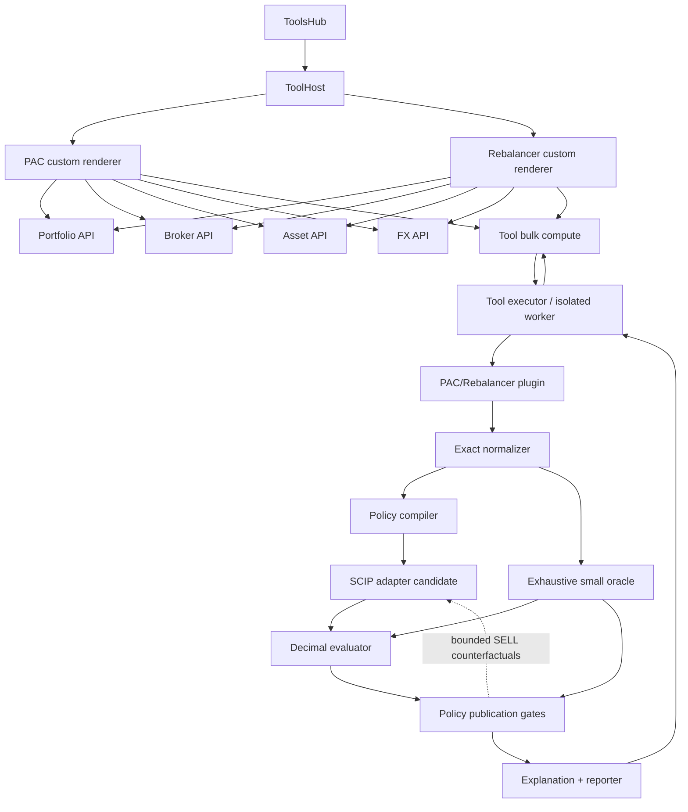

# PAC & Rebalancer — architettura target

**Stato:** TARGET CORRENTE — architettura logica approvata; rilievi della
review indipendente incorporati il 2026-09-16. Contratti file-per-file rinviati
al piano implementativo.
**Tipo:** specifica architetturale backend/frontend e boundary di dominio.
**Implementazione:** non autorizzata da questo documento.

**Suite target:** [master](plan-phase00PacRebalancerTargetDesign.prompt.md) ·
[nucleo matematico](plan-phase00PacRebalancerMathematicalCore.prompt.md) ·
[policy, obiettivi e vincoli](plan-phase00PacRebalancerPolicies.prompt.md) ·
[UI completa](plan-phase00PacRebalancerUiTarget.prompt.md).

> Questo piano definisce responsabilità e flussi, non nomi finali di ogni DTO o
> file. Il futuro piano implementativo dovrà materializzare i contratti senza
> spostare calcoli fra layer o duplicare la piattaforma Tool del gruppo C.

---

## 1. Principi architetturali

1. **Backend owns economics:** normalizzazione, allocazione, ledger, fee, tax,
   FX, quantità, fattibilità, proof e spiegazioni sono backend.
2. **Frontend owns interaction:** draft, copy esplicite, validazione locale di
   forma, rendering, filtri e grafici.
3. **Worker is pure:** nessun DB, provider, principal o HTTP durante `compute`.
4. **Snapshot is complete:** ogni fatto necessario viaggia nel payload.
5. **Domain APIs own facts:** Portfolio/Broker/Asset/FX raccolgono dati
   autorizzati prima del compute.
6. **One math truth:** normalizer, policy compiler, solver ed evaluator condividono
   lo stesso scenario; nessuna formula duplicata fra PAC e Rebalancer.
7. **Independent verification:** solver propone, evaluator Decimal certifica il
   candidato.
8. **No legacy branch:** il prototipo P1 non rilasciato viene sostituito.
9. **Product-shaped output:** il wire serve le viste approvate, non un dump
   completo dello stato interno.
10. **Extension by explicit policy:** nessun coefficiente o fallback nascosto.

---

## 2. Topologia



---

## 3. Confine con la piattaforma Tool

### 3.1 Proprietà del gruppo C

La piattaforma generale già esistente possiede:

- `ToolPlugin`/service abstraction;
- registry/discovery;
- catalogo autenticato;
- descriptor e schema completi;
- bulk compute con item isolati;
- correlation ID;
- executor/worker;
- timeout, cancellation e cleanup;
- diagnostics sanitizzati;
- validazione output;
- fingerprint/versione renderer;
- route API generiche.

Il PAC non crea:

- un secondo registry;
- un secondo executor;
- route `/tools/prefill`;
- endpoint schema separati;
- formato diagnostics parallelo;
- fallback non validato.

### 3.2 Proprietà del workstream PAC/Rebalancer

Il workstream possiede:

- due identità Tool stabili;
- input/output di dominio;
- normalizer;
- scenario interno;
- constraint primitives;
- policy compiler;
- adapter solver;
- evaluator Decimal;
- oracle;
- explanation/report;
- renderer custom;
- orchestrazione copy dalle API dominio;
- test e documentazione specifici.

### 3.3 Identità Tool

```text
pac_allocator
  operation = plan

portfolio_rebalancer
  operation = plan
```

Sono servizi separati nel catalogo. Condividono moduli interni, non un mode
pubblico unico.

### 3.4 Handshake richiesto

Il piano implementativo dovrà congelare con C:

- versioni Tool/API;
- `tool_code`;
- renderer key/version;
- export schema;
- worker entry;
- codec/generator;
- codici error/issue;
- limit/cancel interface;
- formato diagnostics;
- responsabilità registry/shared writer.

Nessun file generic-platform viene modificato senza gap concreto e ownership
esplicita.

---

## 4. Flusso dei dati

### 4.1 Fase interattiva

```text
open Tool
  -> initialize empty local draft
  -> optional explicit copies from domain APIs
  -> user edits/overrides
  -> local shape validation
  -> review immutable snapshot
  -> one compute request
```

La UI non invia richieste solver durante gli step.

### 4.2 Fase compute

```text
validated wire input
  -> normalize exact
  -> static conflicts
  -> compile selected policy
  -> solve lexicographic stages
  -> Decimal replay
  -> optional exact oracle/proof
  -> report primary
  -> compile frozen-action deployment
  -> solve/replay deployment
  -> serialize product result
```

### 4.3 Fase risultato

Il frontend riceve:

- stato;
- soluzione primaria;
- variante coerente opzionale;
- tabelle autorevoli;
- KPI e diagnostici;
- explanation/issue;
- solver/proof evidence compatta;
- provenance.

Non riceve un programma solver serializzato.

---

## 5. API dominio e copy

### 5.1 Portfolio

Responsabilità:

- Asset canonici;
- holding complete per Asset×Broker;
- quantità custodita;
- quota economica personale separata;
- PMC/WAC con valuta e provenance;
- native Broker cash autorizzato;
- data snapshot.

Regole:

- OWNER al `0%` non perde la custodia;
- nessun accesso a Broker non autorizzato;
- nessuna aggregazione per nome;
- riuso di `compute_wac_iterative`;
- nessun cambio FIFO/WAC.

### 5.2 Broker

Responsabilità v1:

- identità autorizzata;
- nome/icona;
- conti/valute disponibili già di dominio.

Capability operative ancora mancanti restano input per-run:

- instruction kind;
- order step;
- fee BUY/SELL;
- regime;
- minus;
- route funding/FX.

Non si introduce un modello DB planner parziale.

### 5.3 Asset

Responsabilità:

- identità canonica;
- quote originale;
- valuta;
- `quote_base_quantity`;
- data/fonte/staleness;
- Tipo/Settore/Geografia;
- missing facts espliciti.

La tax rate Asset è prefill scenario `0.26`, modificabile; persistenza futura.

### 5.4 FX

Responsabilità:

- coppia/direzione;
- rate salvato;
- source;
- timestamp/data;
- staleness.

Spread, buffer e fee operative sono scenario input. La copia non esegue una
conversione di planner.

### 5.5 Prezzi correnti

La copia non deve chiamare automaticamente un endpoint mutante come
`/assets/prices/current` se questo può scrivere OHLC. Serve una lettura dominio
read-only oppure azione utente esplicita separata.

### 5.6 Regole comuni copy

- azioni indipendenti;
- preview prima di sostituire dati modificati;
- provenance visibile;
- nessun live binding;
- stale guard;
- request sequence;
- account generation;
- draft revision;
- abort su cambio account/unmount;
- nessuna omissione silenziosa.

---

## 6. Public wire boundary

### 6.1 Principi

- Pydantic/TypeAdapter è fonte;
- JSON Schema derivato;
- object schemas, non tuple positional;
- `extra="forbid"`;
- Decimal finiti e posting monetari come stringhe;
- derivati non terminanti con rappresentazione object lossless
  `ExactRatio`/scaled-integer, mai Decimal troncato;
- enum discriminati;
- tutte le unità esplicite;
- schema completo nel catalogo;
- generated TypeScript tramite pipeline ufficiale;
- output validato prima del renderer.

### 6.2 Famiglie input concettuali

```text
PlanningScenario
├── operation
├── as_of
├── valuation_currency
├── funding_sources[]
├── selected_liquidity[]
├── trading_brokers[]
├── assets[]
│   ├── quote/provenance
│   ├── holdings_by_broker[]
│   └── routes[]
│       └── execution_price_margins
├── fx_quotes[]
├── targets[]
└── policy
```

Il contratto concreto sarà definito nel piano implementativo. Questa forma
stabilisce solo ownership e completezza.

Ogni route dichiara separatamente margine prudenziale/spread esecuzione BUY e
SELL. Questi coefficienti valgono anche quando quotazione e ledger hanno la
stessa valuta; non vengono confusi con spread o buffer FX.

### 6.3 Union esplicite

Esempi:

```text
FundingSource =
  NewExternalFunding
| ExistingAccountFunding
| ManualAccountFunding

TradingBroker =
  ExistingTradingBroker
| ManualTradingBroker

OrderInstruction =
  WholeQuantityInstruction
| MonetaryAmountInstruction
```

Nessuna combinazione di booleani paralleli.

### 6.4 Missing fact

Il wire distingue:

- assente ma richiesto;
- esplicitamente `null` quando semantico;
- zero valido;
- stringa vuota invalida;
- stale con conferma;
- unsupported.

Nessun default finanziario implicito viene aggiunto dal worker.

---

## 7. Modello interno normalizzato

### 7.1 Obiettivo

Convertire il wire orientato alla UX in dataclass/record immutabili:

```text
NormalizedScenario
├── canonical_assets
├── brokers
├── native_ledgers
├── funding_edges
├── fx_edges
├── buy_routes
├── sell_routes
├── exact_ratio_coefficients
├── target_weights
├── policy_key
├── finite_bounds
└── provenance_index
```

### 7.2 Responsabilità normalizer

- parsing Decimal;
- conversione lossless di ogni Decimal finito in `ExactRatio`;
- validazione finitezza;
- ISO currency/minor units;
- uniqueness ID;
- cross-reference;
- unità constraint;
- canonical Asset grouping;
- price basis;
- reachability/trapped classification;
- finite bound derivation;
- coefficient envelope;
- status `needs_input/invalid/unsupported`.

### 7.3 Divieti

Il normalizer non:

- sceglie route;
- ottimizza;
- legge DB;
- interroga provider;
- applica policy nascoste;
- elimina elementi non risolvibili;
- converte un input mancante in zero.

---

## 8. Constraint primitives

Le primitive condivise rappresentano una regola una volta:

```text
CashConservation
FundingCapacity
FxCoupling
OrderActivation
ConditionalMinimum
RequiredMinimum
TypedCap
InventoryLimit
NoBuySellSameAsset
FinalNonNegative
FeeSchedule
TaxReserve
RoundingEnvelope
SellFundsIncrementalBuy
```

Ogni primitiva espone:

```text
ConstraintSpec
├── code
├── scope
├── parameters
├── unit
├── finite_bound_source
├── solver_builder
├── decimal_predicate
└── explanation_builder
```

PAC e Rebalancer riusano la stessa primitiva. La policy cambia activation/domain,
non formula il ledger una seconda volta.

`SellFundsIncrementalBuy` è un vincolo inline. La quantum-minimalità SELL non
finge di essere un singolo `decimal_predicate`: è un
`SellLocalIrreducibilityGate` post-solve con:

```text
CounterfactualGateSpec
├── code
├── candidate_scope
├── counterfactual_builder
├── max_subproblems
├── exact_closure_requirements
└── unresolved_reason
```

---

## 9. Policy compiler

### 9.1 Input

- `NormalizedScenario`;
- product key;
- policy/mode.

### 9.2 Output

```text
SolverProgram
├── variables
├── finite_bounds
├── hard_constraints
├── primary_stages
├── deployment_stages
├── canonical_tie
├── post_solve_gates
├── evidence_requirements
└── explanation_metadata
```

### 9.3 Stage

```text
ObjectiveStage
├── code
├── direction
├── unit
├── exact_evaluator
├── solver_expression
├── freeze_strategy
└── report_projection
```

Il compiler non esegue il solve e non manipola cash. L'ordine completo delle
policy è nel piano dedicato.

### 9.4 Estensione

Una nuova policy:

- registra un compiler;
- riusa primitive;
- dichiara stage;
- aggiunge explanation;
- aggiunge oracle cases.

Non aggiunge `if policy == ...` sparsi in evaluator/reporter.

---

## 10. Solver adapter

### 10.1 Backend candidato

PySCIPOpt/SCIP è additivo:

- MIQP convesso per $L2_{fixed}$;
- MIQCP/MISOCP convesso per sublevel e tier successivi;
- variabili discrete/activation;
- bound e gap;
- callback/checkpoint.

Riskfolio e SciPy restano nei rispettivi domini.

### 10.2 Responsabilità

- tradurre `SolverProgram`;
- applicare bound derivati;
- impostare limiti;
- eseguire stage lessicografici separati;
- estrarre quantum interi/binari;
- eseguire sottoproblemi controfattuali richiesti dai publication gate entro il
  budget residuo;
- raccogliere raw evidence;
- rispettare cancellation;
- non promuovere proof.

### 10.3 Cascade

```text
for stage in stages:
    build stage expression
    solve within remaining budget
    extract candidates
    Decimal replay
    rank exact prefix
    add non-worsening ceiling
    checkpoint time/cancel
```

Un candidato che migliora un tier precedente riavvia la cascade.

### 10.4 Resource boundary

Il futuro gate misura:

- import/wheel;
- cold start;
- MIQP;
- MIQCP;
- warm starts;
- node/time limit;
- RSS;
- cancellation;
- child cleanup;
- packaging Docker;
- supported cardinality.

Nessun probe/install prima del freeze ambiente autorizzato.

---

## 11. Decimal evaluator

Il nome resta “Decimal evaluator” perché wire, posting monetari e ledger sono
Decimal. Le divisioni non terminanti e i confronti obiettivo usano però il
kernel `ExactRatio` definito dal nucleo matematico; nessun context Decimal
implicito decide tie, freeze o proof.

### 11.1 Input

- scenario normalizzato;
- vettore di azioni discrete;
- policy/program;
- eventuale raw solver evidence solo come metadata.

### 11.2 Output

```text
EvaluatedCandidate
├── validity
├── constraint_results
├── native_postings
├── ledgers
├── holdings
├── objective_tuple
├── diagnostics
├── explanations
└── conflict fragments
```

### 11.3 Responsabilità

- derivare quantità da instruction;
- postare BUY/SELL;
- calcolare fee;
- calcolare tax;
- calcolare FX;
- riconciliare spendable/physical;
- verificare rounding;
- verificare holdings;
- calcolare $F_{ref}$, target, $L2$, $U$;
- calcolare diagnostici;
- applicare ogni `ConstraintSpec`;
- produrre reason code.

### 11.4 Divieti

- nessun import solver;
- nessun repair finanziario;
- nessun epsilon implicito;
- nessun lookup;
- nessuna formattazione che perda precisione;
- nessuna dichiarazione di ottimalità.

---

## 12. Oracle

### 12.1 Scopo

L'oracle:

- enumera domini piccoli completi;
- usa evaluator indipendente;
- ordina con la stessa policy;
- produce proof exact soltanto nel dominio dichiarato.

### 12.2 Indipendenza

Non deve:

- chiamare SCIP;
- copiare branch-and-bound production;
- usare la stessa euristica add-only;
- saltare funding/FX;
- assumere una sola valuta/Broker.

### 12.3 Evidenza

```text
OracleEvidence
├── domain_definition
├── enumerated_candidate_count
├── feasible_candidate_count
├── best_exact_tuple
├── tied_best_count
└── exhaustive=true
```

### 12.4 `SellIrreducibilityVerifier`

È il proprietario unico della quantum-minimalità SELL. Riceve un candidato
Decimal-valido e il programma ristretto `invest_and_sell`; per ogni riga SELL
attiva costruisce al massimo:

1. il caso con un quantum in meno;
2. il caso con riga azzerata.

Congela il BUY incrementale, riapre soltanto funding/FX dichiarati mutabili e
delega la ricerca al solver adapter. Ogni controesempio passa dall'evaluator.
L'assenza di controesempio è accettata soltanto con conflict witness Decimal
completo o oracle esaustivo del sottodominio finito.

Il limite è quindi `2 × active_sell_rows`, con early exit e checkpoint
time/cancel fra sottoproblemi. Se una closure manca, il gate non “passa per
timeout”: quel candidato SELL non viene pubblicato. Il reporter conserva
l'ultimo candidato verificato, almeno la baseline `invest_only`, come
`incumbent_found/not_proven` e allega
`SELL_IRREDUCIBILITY_UNRESOLVED`; usa `no_incumbent` soltanto se nessun
candidato verificato esiste. L'evaluator resta solver-free.

---

## 13. Reporter ed explanation

### 13.1 Regola

Il reporter proietta fatti già calcolati. Non ricalcola economia.

### 13.2 Output product-shaped

```text
PlanResult
├── availability
├── primary_result
├── deployment_result?
├── compact issues
└── shared provenance/catalog references
```

Ogni soluzione include soltanto ciò che serve alle viste:

- summary Asset completa;
- ordini Broker;
- funding;
- FX;
- ledger/summaries autorevoli;
- esposizioni;
- objective/diagnostics;
- proof/status/evidence compatta;
- delta fra piani.

Tre famiglie non possono essere fuse:

| Famiglia autorevole | Granularità | Campi economici minimi |
|---|---|---|
| `AssetSummaryRow` | Asset canonico | target fisso, valore finale mid, residuo $r_a$, peso prima/target/dopo |
| `BrokerOrderRow` | route/ordine | lato, instruction, quantità/importo, prezzo mid/charge/sell, valore mid, addebito/accredito, fee/buffer |
| `BrokerLedgerRow` | Broker×valuta | saldo iniziale, funding, FX, BUY/SELL, fee/tax/riserve, cash spendibile/fisico finale |

`C_free` deriva dai `BrokerLedgerRow` e non viene attribuito a un Asset. Un
`budget_route` esiste soltanto se il backend definisce davvero un envelope
operativo distinto; non può essere ricostruito dal target Asset né introdotto
dal renderer. La v1 target non ne richiede uno.

### 13.3 Nessun audit dossier duplicato

Il precedente witness da `289436 B` duplicava massimi simultanei:

- 2×64 ordini completi;
- 2×64 ledger;
- 48 FX;
- 224 esposizioni;
- 256 issue;
- stringhe tutte massime.

Non è il contratto prodotto. Il nuovo witness nasce dalle UI approvate e deve
restare entro il limite Tool `262144 B` senza:

- tuple non supportate;
- compression/base64;
- paginazione/second lookup;
- omissione di fatti finanziari;
- ricostruzione frontend.

Evidenza solver interna può essere sintetizzata/hashata, previa review.

---

## 14. Mapping status

Forme discriminated, non record con opzionali arbitrari:

```text
PlanningInputFailure
  needs_input | invalid | unsupported

SearchExactOptimalPlan
SearchBoundedPlan
SearchUnprovenPlan
SearchDeterministicInfeasible
SearchOracleInfeasible
SearchNoIncumbent
```

Campi semantici comuni:

```text
availability =
  needs_input | invalid | unsupported | ready

outcome, solo se availability=ready =
  no_op | incumbent_found | infeasible_proven | no_incumbent

proof =
  optimal_proven | gap_bounded | not_proven | infeasibility_proven

proof_source, presente solo per proof esatta =
  exhaustive_oracle | score_lattice_closure | deterministic_conflict

stop_reason =
  completed | time_limit | node_limit | cancelled | resource_limit
```

Le union discriminated restringono le combinazioni:

- `no_op|incumbent_found` → `optimal_proven|gap_bounded|not_proven`;
- `infeasible_proven` → `infeasibility_proven`;
- `no_incumbent` → `not_proven`;
- `deterministic_conflict` vale soltanto per `infeasibility_proven`;
- `score_lattice_closure` vale soltanto per `optimal_proven`.

Regole:

- piano pubblicato → `decimal_verified`;
- exact optimal → proof source obbligatoria;
- bounded → solver evidence obbligatoria;
- deterministic infeasible → conflict witness;
- oracle infeasible → oracle evidence;
- unproven → nessuna proof source;
- crash/cleanup/serialization → Tool error, non result success-shaped.

---

## 15. Frontend information architecture

### 15.1 Route

```text
/tools/pac_allocator
/tools/portfolio_rebalancer
```

Ogni route monta wrapper sottile e shell condivisa.

### 15.2 Struttura concettuale

```text
pac-allocator/
├── PacAllocatorTool
├── PortfolioRebalancerTool
├── planner/
│   ├── OperationalPlannerShell
│   ├── step navigation / summary
│   ├── scenario
│   ├── funding
│   ├── brokers
│   ├── assets/holdings
│   ├── routing
│   ├── target
│   ├── fx
│   ├── strategy
│   ├── review
│   ├── result shell
│   ├── charts/tables
│   ├── draft state
│   ├── dependency graph
│   ├── source copies
│   └── result selectors
├── pac/
└── rebalancer/
```

I nomi finali verranno verificati contro il codice; i confini shared/specific
sono normativi.

### 15.3 Shared shell ownership

La shell possiede:

- nove step;
- step state;
- dependency invalidation;
- confirm distruttivo;
- account generation;
- request sequence;
- renderer identity;
- draft revision;
- copy/compute abort;
- immutable review snapshot;
- busy/cancel/error/stale;
- primary/deployment selection.

Gli step non lanciano solve. I risultati non modificano il draft.

### 15.4 Draft

```text
local editable draft
  -> review snapshot
  -> immutable digest/revision
  -> compute owner
  -> result bound to snapshot revision
```

Una modifica dopo il compute:

- non ricalcola;
- non modifica il risultato;
- marca il risultato stale;
- conserva il risultato consultabile.

### 15.5 Copy concurrency

Ogni copy registra:

- account generation;
- component instance;
- request ID;
- draft revision at start;
- target section.

La risposta si applica soltanto se tutti coincidono. Altrimenti viene scartata o
presentata come conflitto esplicito.

---

## 16. Component reuse

Riutilizzare/generalizzare:

| Funzione | Componente/pattern |
|---|---|
| denaro+valuta | `CompactCashCell` |
| Decimal | `ExactDecimalInput` |
| quantità | estrazione da `TransactionFormModal` |
| Asset | `AssetSelect`, gallery, modal, icon |
| Broker | `BrokerSearchSelect`, modal, icon |
| valuta/data | `CurrencySearchSelect`, `SingleDatePicker` |
| conferma | `ConfirmModal` |
| tabelle | `DataTable`, `ColumnVisibilityToggle` |
| geografia | `GeographyMap` |
| grafici | lifecycle ECharts esistente |
| KPI | `KpiCard` |

Gate quantità:

1. confrontare input esatti esistenti;
2. estrarre un componente shared;
3. migrare la Transaction modal senza regressione;
4. riusare nel planner;
5. vietare parser planner-locali.

---

## 17. Frontend math boundary

Il frontend può:

- conservare stringhe esatte;
- validare required/range locali;
- sommare target Decimal per feedback form;
- formattare output;
- calcolare coordinate grafiche da valori backend.

Il frontend non può:

- allocare;
- scegliere route;
- calcolare fee/tax/FX;
- calcolare quantità;
- ricostruire ledger;
- applicare delta della variante;
- dichiarare fattibilità/proof;
- trasformare missing in zero.

---

## 18. UI result architecture

```text
PlannerResultView
├── OutcomeSummary
├── SolutionSelector
├── SolutionComparison
├── AssetAllocationMatrix
├── ExposureComparison
│   ├── Type ribbons
│   ├── Sector ribbons
│   └── Geography maps
├── AssetPlanDataTable
├── OperationalPlan
│   ├── FundingActions
│   ├── FxActions
│   ├── BrokerOrders
│   └── MoneyFlowSankey
└── SolverDiagnostics
```

Desktop usa DataTable; mobile proietta le stesse righe in card/accordion.
Nessun secondo DTO mobile.

---

## 19. Accessibilità e responsive

- Svelte 5 Runes;
- `data-testid`;
- keyboard navigation;
- focus summary error;
- focus trap modali;
- `aria-expanded`;
- unità associate ai campi;
- reduced motion;
- grafici con tabella equivalente;
- stati non distinti dal solo colore;
- BUY/SELL testuali;
- no core action nel solo context menu;
- dark mode.

Tutte le ASCII e le decisioni visuali sono nel piano UI completo.

---

## 20. Privacy e sicurezza

### 20.1 Auth

- catalog/compute/diagnostics autenticati;
- copie dominio autorizzate;
- worker privo di principal perché riceve snapshot già autorizzato;
- Broker non autorizzato fallisce chiuso;
- nessuna intersezione silenziosa.

### 20.2 Data minimization

- nessun payload personale nei log;
- diagnostics sanitizzati;
- nessun dato in URL;
- nessuna analytics finanziaria;
- fixture/esempi sintetici;
- result in memoria UI, non persistenza automatica;
- reset completo su cambio account.

### 20.3 Manual scenario

Asset, Broker e fonte manuali:

- funzionano senza DB;
- restano scenario-only;
- non vengono salvati implicitamente;
- devono fornire tutti i fatti richiesti.

---

## 21. Async I/O

Le API dominio possono essere `async`, ma ogni libreria sync che fa I/O usa:

```python
await asyncio.to_thread(...)
```

Il worker compute è sincrono/puro e isolato dal request event loop. Nessun
provider sync viene chiamato dentro handler async senza offload.

---

## 22. Cancellation e lifecycle

### 22.1 Client

`AbortController`:

- interrompe l'attesa;
- invalida owner/request;
- non promette che un processo CPU sia già terminato.

### 22.2 Executor

La piattaforma:

- checkpoint fra stage;
- timeout soft per chiamata;
- limite globale item;
- termina worker/figli posseduti;
- verifica cleanup;
- isola crash.

### 22.3 Result

Un cancel/limit:

- conserva incumbent Decimal valido;
- riporta stop reason;
- non promuove proof;
- senza incumbent produce `no_incumbent`.

---

## 23. Determinismo

A parità di:

- snapshot;
- versione;
- policy;
- limiti;
- solver settings dichiarati;

il piano pubblicato deve avere:

- stessa tupla esatta `ExactRatio`/scaled-integer;
- stesso tie-break;
- stesse explanation;
- stesso status salvo evidenza runtime dichiarata.

Parallelismo interno non può cambiare la scelta canonica fra tie.

---

## 24. Persistenza

Nessun modello DB planner v1.

Per-run:

- capability Broker;
- fee;
- regime/minus;
- tax rate;
- route;
- fonti manuali;
- FX assumptions.

Future persistence:

- profilo Broker;
- tax metadata Asset;
- fonti manuali salvabili;
- policy avanzate.

Richiedono piano/migrazione separati.

---

## 25. Generated surfaces e writer condivisi

Un solo integratore futuro scrive:

- plugin registration;
- generated API client;
- generated Tool codec;
- contract map/fingerprint;
- i18n catalogues;
- runner catalogue;
- MkDocs nav;
- CHANGELOG.

Workstream paralleli non editano simultaneamente questi file.

---

## 26. Failure boundaries

| Layer | Failure | Risposta |
|---|---|---|
| copy API | unauthorized | fail closed; draft invariato |
| copy API | stale/missing | preview/issue; nessun omissione |
| normalizer | missing | `needs_input` |
| normalizer | contradiction | `invalid` |
| compiler | domain unsupported | `unsupported` |
| solver | limit + incumbent | bounded/unproven result |
| solver | limit no incumbent | `no_incumbent` |
| evaluator | candidate violation | discard/invalid internal |
| exact precheck | complete conflict | `infeasible_proven` |
| worker | crash/cleanup | Tool error |
| reporter | oversize/invalid schema | Tool error; non truncate |
| frontend | stale response | ignore/mark conflict |

Nessun broad catch produce un risultato “successo” vuoto.

---

## 27. Confini del futuro piano implementativo

Il piano implementativo dovrà definire:

- file reali;
- DTO concreti;
- schema cardinalities;
- codici issue;
- test catalogue;
- workstream ownership;
- dipendenze fra slice;
- runtime lane;
- generated writer;
- docs/runbook.

Non dovrà decidere nuovamente:

- fixed reference/L2;
- pipeline policy;
- ledger;
- proof semantics;
- nove step;
- due Tool separati;
- worker pure;
- frontend no-math;
- no DB planner v1.

---

## 28. Gate architetturali

1. review suite completa;
2. conferma handshake con C;
3. result schema product-shaped sotto cap;
4. dependency/packaging SCIP;
5. benchmark worker/cancel/cleanup;
6. domain API gap analysis;
7. generated client round-trip;
8. authorization matrix;
9. privacy review;
10. manual UI walkthrough dopo implementazione.
