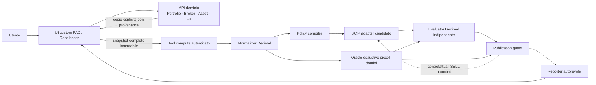

# PAC & Rebalancer — piano maestro target

**Stato:** TARGET MASTER — rilievi della review matematica/editoriale
indipendente incorporati il 2026-09-16; bundle implementativo approvato per il
checkpoint planning-only.
**Tipo:** indice e visione end-to-end; non sostituisce i quattro piani
specialistici e non è un contratto wire definitivo.
**Scope:** SP13–SP14.
**Baseline di pianificazione:** `202e4056f2b915c055eeb8436eae765023201918`.
**Implementazione:** non autorizzata da questo documento.

> Questo è l'entrypoint della suite target nella root `13_pacAllocator/`.
> La specifica autorevole è composta da questo master e dai quattro piani
> specialistici elencati sotto. La catena precedente resta consultabile
> nell'[indice delle bozze](drafts/README.md), ma non è autorità concorrente.
>
> I dettagli di schema Pydantic/JSON, nomi finali dei componenti, cardinalità,
> file ownership, task Fleet, runner e selettori di test sono pianificati nel
> [bundle implementativo](implementation/README.md) e verranno congelati ai
> relativi gate. Questo documento stabilisce **che cosa** deve fare il prodotto
> e quali invarianti non possono cambiare.

---

## 0. Mappa della suite target

| Piano | Contenuto normativo |
|---|---|
| **Questo master** | obiettivo prodotto, flusso end-to-end, lettura coordinata e gate |
| [UI target completa](plan-phase00PacRebalancerUiTarget.prompt.md) | tutte le ASCII desktop/mobile approvate, stati, grafici, tabelle, accessibilità e privacy |
| [Nucleo matematico](plan-phase00PacRebalancerMathematicalCore.prompt.md) | notazione, ledger, FX, fee/tax, fixed reference, L2, rounding, solver/proof |
| [Policy, obiettivi e vincoli](plan-phase00PacRebalancerPolicies.prompt.md) | constraint comuni, pipeline lessicografiche, ragioni, controesempi e modalità |
| [Architettura target](plan-phase00PacRebalancerArchitecture.prompt.md) | confini Tool/dominio, normalizer/compiler/solver/evaluator/reporter, frontend e lifecycle |

L'esecuzione è descritta separatamente nell'[indice dei piani
implementativi](implementation/README.md); quei piani non sono autorità
concorrente sul prodotto.

Ordine di lettura consigliato:

```text
Master
  -> Policy e vincoli
  -> Nucleo matematico
  -> Architettura
  -> UI completa
```

Il master offre una vista compatta, non una sostituzione dei dettagli. Se una
formula, una pipeline o una schermata non è ripetuta qui, resta normativa nel
rispettivo piano specialistico.

---

## 1. Obiettivo prodotto

LibreFolio espone due Tool distinti:

| Tool | Domanda | Azioni |
|---|---|---|
| **PAC Allocator** | Come distribuire liquidità selezionata fra Asset target e Broker ammessi? | funding, FX e BUY |
| **Portfolio Rebalancer** | Come avvicinare l'intero portafoglio ai pesi target? | funding, FX, BUY e SELL solo se autorizzati |

I due Tool condividono il nucleo fixed-reference/fixed-L2, ma non diventano un
unico prodotto con un selettore interno. Restano separati per:

- route, testo introduttivo e flusso di ingresso;
- presenza o assenza di holding iniziali;
- modalità/policy disponibili;
- dominio BUY/SELL;
- tabelle, grafici e spiegazioni finali.

### 1.1 Cosa produce il Tool

Un calcolo produce, quando possibile:

1. un **piano primario** che minimizza lo scostamento monetario quadratico dal
   target fisso;
2. una **variante margine** che congela tutte le azioni primarie e usa soltanto
   BUY addizionali finanziabili;
3. trasferimenti di funding;
4. eventuali conversioni FX;
5. ordini BUY/SELL per Broker;
6. ledger nativi riconciliati;
7. confronto prima/target/dopo;
8. stato, limiti, validazione Decimal e livello di prova separati.

Il Tool non invia ordini, non scrive transazioni, non modifica il portafoglio e
non interpreta il piano come consulenza finanziaria.

### 1.2 Non-obiettivi v1

- short, leva, debito o cash negativo;
- routing Broker implicito;
- BUY e SELL simultanei dello stesso Asset;
- vendita oltre inventario;
- lookup DB/provider durante il calcolo;
- modifica di FIFO, WAC/PMC o regime fiscale;
- sostituzione di Riskfolio o SciPy;
- tax-loss harvesting, compensazione minus, chiusura/consolidamento Broker;
- FX multi-hop o cicli di arbitraggio;
- profili planner persistenti;
- esecuzione automatica degli ordini;
- calcoli economici autorevoli nel frontend;
- compatibilità col prototipo P1 non rilasciato.

---

## 2. Flusso end-to-end e confini



Principi:

- la UI copia fatti dalle API di dominio e li rende modificabili;
- ogni copia è indipendente: portafoglio/holding, prezzi e distribuzione corrente
  non sono un unico prefill;
- nessuna copia crea binding live;
- una risposta tardiva non può sovrascrivere un draft più recente;
- il submit contiene tutti i fatti necessari;
- il worker usa soltanto snapshot e checkpoint di cancellazione;
- il frontend presenta risultati backend, non ricostruisce denaro nascosto;
- dati mancanti, stale o non autorizzati restano espliciti;
- il calcolo puro funziona anche con Asset/Broker manuali non presenti nel DB.

### 2.1 Identità e aggregazioni

- Un Asset economico è aggregato tramite identità canonica, mai per nome.
- La custodia resta distinta per coppia Asset×Broker.
- La quota economica personale e la quantità intera custodita sono concetti
  separati.
- Cash e contributi restano righe native per sorgente/Broker/valuta.
- Nuovi contributi non vengono sommati due volte al cash esistente.
- La valuta di valorizzazione è un numeraire tecnico; non sostituisce le valute
  native di ordini e ledger.

---

## 3. Esperienza utente target

### 3.1 Ingresso

`/tools` mostra due card:

```text
+--------------------------------------+--------------------------------------+
| PAC Allocator                        | Portfolio Rebalancer                 |
| Liquidità selezionata -> BUY         | Portafoglio -> BUY / SELL opzionali |
| [Apri PAC]                           | [Apri Rebalancer]                    |
+--------------------------------------+--------------------------------------+
```

La card sceglie già il Tool. Nel wizard non compare un secondo selettore
PAC/Rebalancer.

### 3.2 Wizard comune in nove step

| # | Step | PAC | Rebalancer |
|---:|---|---|---|
| 1 | Scenario | data e valuta di valorizzazione | data e valuta di valorizzazione |
| 2 | Liquidità | contributi e cash selezionato | contributi e cash selezionato |
| 3 | Broker | luoghi ammessi per BUY | luoghi ammessi per BUY/SELL |
| 4 | Asset | target, quantità iniziale zero | Asset, holding e PMC per Broker |
| 5 | Routing | route BUY e vincoli | route BUY/SELL e vincoli |
| 6 | Target | pesi della nuova allocazione | pesi finali dell'intero portafoglio |
| 7 | FX | coppie potenziali, spread, buffer e fee | stesso contratto |
| 8 | Strategia | `proportional` / `min_fragmentation` | `invest_only` / `invest_and_sell` |
| 9 | Rivedi | snapshot completo e immutabile | snapshot completo e immutabile |

Il risultato è fuori dallo stepper.

### 3.3 Shell desktop

```text
+--------------------------------------------------------------------------------------------------+
| <- Tools                    PAC Allocator                                      [Docs] [Aggiorna] |
+-------------------+------------------------------------------------------+-----------------------+
| PASSI             | STEP ATTIVO                                          | RIEPILOGO             |
| > 1 Scenario      | titolo + spiegazione                                 | Scenario              |
| v 2 Liquidità     |                                                      | Liquidità             |
| ! 3 Broker        | controlli progressivi / DataTable / editor            | Broker                |
| ○ 4 Asset         |                                                      | Asset                 |
| ○ 5 Routing       | nessuna preview economica                             | Target                |
| ○ 6 Target        |                                                      | Completezza           |
| ○ 7 FX            |                                                      | Provenance/stale      |
| ○ 8 Strategia     |                                                      |                       |
| ○ 9 Rivedi        |                                                      |                       |
+-------------------+------------------------------------------------------+-----------------------+
| [Indietro]                                                           [Continua]                  |
+--------------------------------------------------------------------------------------------------+
```

- desktop: rail step a sinistra, contenuto centrale, summary rail a destra;
- tablet: progress orizzontale compatto e summary collassabile;
- mobile: progress, card/accordion e summary bottom sheet;
- avanti/indietro conserva il draft;
- una modifica strutturale mostra un `ConfirmModal` con i dati dipendenti che
  verranno rimossi;
- “completo” significa forma locale valida, non fattibilità economica.

### 3.4 Shell mobile

```text
+------------------------------------------+
| PAC Allocator                 [Riepilogo] |
| Passo 5 di 9 · Routing                   |
| [=================---------------------] |
+------------------------------------------+
| Asset 2 di 4 · XMAW World                |
| [BUY]                                    |
|                                          |
| +--------------------------------------+ |
| | Directa · EUR · quantità intera     | |
| | Priorità 1 · min/cap dichiarati     | |
| | [Modifica vincoli]                  | |
| +--------------------------------------+ |
|                                          |
+------------------------------------------+
| [Indietro]                    [Continua] |
+------------------------------------------+
```

Mobile non riduce il contratto: una tabella diventa card/accordion, non un
secondo modello dati.

### 3.5 Copy/autofill

Azioni indipendenti:

- copia liquidità/cash;
- copia holding correnti;
- copia prezzi;
- usa la distribuzione corrente come **base modificabile** del target;
- copia Broker e capability note;
- copia FX salvati.

Ogni fatto copiato mostra dominio, data/timestamp, staleness e stato modificato.
Il refresh richiede azione esplicita e preview delle sovrascritture. Nessun dato
personale finisce in URL, log browser, analytics, fixture o screenshot.

### 3.6 Input operativi chiave

Per Broker×valuta:

```text
order_instruction_kind =
  whole_quantity
| monetary_amount
```

- `whole_quantity`: istruzione in numero intero di quote;
- `monetary_amount`: istruzione in multipli interi di
  `order_amount_step`;
- l'inventario frazionario esistente resta esatto;
- quantità, importi e vincoli dichiarano sempre unità e lato;
- minimo condizionale e minimo obbligatorio sono distinti;
- cap BUY e SELL sono distinti e tipizzati.

---

## 4. Linguaggio matematico

### 4.1 Insiemi, indici e unità

| Simbolo | Significato | Dominio/unità |
|---|---|---|
| $A,a$ | insieme Asset canonici / un Asset | ID finito |
| $B,b$ | Broker autorizzati / un Broker | ID finito |
| $C,c,d$ | valute native | codice valuta |
| $S,s$ | fonti di liquidità selezionate | ID finito |
| $R,r$ | route ordine Asset×Broker×lato×valuta | insieme finito |
| $J,j$ | conversioni FX dirette autorizzate | grafo diretto aciclico |
| $v$ | valuta di valorizzazione | una valuta |
| $\mu_c$ | minor unit della valuta $c$ | valuta nativa |
| $\rho_{c\to d}$ | cambio approvato | valuta $d$/valuta $c$ |
| $w_a$ | peso target dell'Asset | Decimal adimensionale |
| $h^0_{ab}$ | quantità iniziale Asset×Broker | quantità Asset |
| $V^0_a$ | valore mid iniziale in $v$ | valuta $v$ |

### 4.2 Variabili decisionali

| Variabile | Significato | Dominio |
|---|---|---|
| $t_{sbc}$ | funding da sorgente a Broker | multipli interi di $\mu_c$ |
| $f_j$ | debito sorgente di una conversione FX | multipli interi della minor unit sorgente |
| $x_r^{BUY}$ | quantum BUY sulla route | intero non negativo |
| $x_r^{SELL}$ | quantum SELL sulla route | intero non negativo |
| $y_r^{BUY},y_r^{SELL}$ | attivazione riga/lato | binario |

Con `whole_quantity`, il quantum è una quota intera. Con
`monetary_amount`, il quantum è uno `order_amount_step` nativo. Non esistono
azioni finanziarie floating autorevoli.

### 4.3 Valori derivati

| Simbolo | Definizione |
|---|---|
| $h^{final}_{ab}$ | quantità iniziale + BUY - SELL |
| $V^{final}_a$ | valore mid finale dell'Asset in $v$ |
| $F_{ref}$ | riferimento contabile fisso |
| $T_a$ | target monetario fisso dell'Asset |
| $r_a$ | residuo monetario firmato |
| $F_{final}$ | valore investito finale totale |
| $U$ | shortfall contabile rispetto a $F_{ref}$ |
| $L2_{fixed}$ | somma dei residui monetari quadratici |

### 4.4 Sintassi lessicografica

La freccia `→` significa **stage successivo solo a parità del precedente**. Non
è una somma pesata:

$$
x^\star=
\operatorname*{argmin}_{\mathrm{lex},\,x\in X}
\left(f_1(x),f_2(x),\ldots,f_k(x)\right).
$$

L'esecutore:

1. minimizza $f_1$;
2. rivaluta esattamente l'incumbent con Decimal;
3. congela il miglior valore precedente tramite un bound non peggiorativo;
4. minimizza $f_2$;
5. continua fino al tie-break canonico.

Nessun coefficiente nascosto trasforma la pipeline in una singola funzione
pesata. Se un valore precedente non è provato globale, i tier successivi sono
condizionati al suo ceiling e l'esito resta non provato.

Ogni Decimal finito viene convertito lossless in un rapporto intero ridotto.
Le divisioni non terminanti restano `ExactRatio`; ranking, freeze e proof non
dipendono dal context Decimal. Soltanto i posting monetari vengono quantizzati
alla minor unit, sempre con `ROUND_HALF_UP`. La definizione completa è nel
[nucleo matematico](plan-phase00PacRebalancerMathematicalCore.prompt.md).

---

## 5. Riferimento fisso e obiettivo comune

### 5.1 Capitale di riferimento

$$
F_{ref}=V_0+K_{reachable}.
$$

- PAC: $V_0=0$.
- Rebalancer: $V_0$ è il valore mid degli Asset investiti correnti.
- $K_{reachable}$ è il cash selezionato che possiede almeno una route
  strutturale verso un BUY di Asset a peso positivo.
- Cash sotto un minimo operativo resta reachable e riappare in $U$.
- Cash senza alcun percorso strutturale è $K_{trapped}$ e resta fuori da
  $F_{ref}$.
- Fee, spread, tax e buffer non vengono sottratti in anticipo: dipendono dal
  candidato.
- I proventi SELL sono trasferimenti interni e non aumentano $F_{ref}$.

Con pesi Decimal esatti:

$$
\sum_{a\in A}w_a=1,\qquad w_a\ge0,
$$

il target fisso è:

$$
T_a=w_aF_{ref}.
$$

### 5.2 Residuo e obiettivo

$$
r_a=V^{final}_a-T_a,
$$

$$
L2_{fixed}=\sum_{a\in A}r_a^2.
$$

$L2_{fixed}$ ha unità valuta-di-valorizzazione al quadrato. L'evaluator usa
Decimal non formattati; il report può mostrare anche
$L2_{fixed}/F_{ref}^2$ quando $F_{ref}>0$.

Il quadrato è una scelta di policy: a parità di scala, penalizza maggiormente
uno scostamento concentrato rispetto a più scostamenti piccoli. È tornato
normativo perché il target è ora fisso: non crea una frazione decision-dependent.
Il primo stage è quindi un MIQP convesso.

Percentuali finali, $D_\infty$ e $D_1$ restano diagnostici:

$$
p_a^{final}=\frac{V_a^{final}}{F_{final}},
$$

$$
D_\infty=\max_a|p_a^{final}-w_a|,
\qquad
D_1=\sum_a|p_a^{final}-w_a|.
$$

Non governano gli ordini.

### 5.3 Capitale non trasformato in Asset

$$
F_{final}=\sum_aV_a^{final},
\qquad
U=F_{ref}-F_{final}.
$$

Poiché $\sum_aT_a=F_{ref}$:

$$
\sum_ar_a=-U,
$$

e, per Cauchy-Schwarz:

$$
L2_{fixed}\ge\frac{U^2}{|A|}.
$$

Il modello non può migliorare lo score liquidando o riducendo il denominatore:
il target non si restringe insieme a $F_{final}$.

La decomposizione contabile autorevole è:

$$
U=C_{free}+R_{physical}+L_{economic}+A_{round}.
$$

- $C_{free}$: cash raggiungibile e spendibile rimasto;
- $R_{physical}$: buffer FX e tax `self_reserved`;
- $L_{economic}$: fee, spread, tax trattenuta e perdite charge/sell once-only;
- $A_{round}$: rettifica firmata dei posting alla minor unit.

Un piccolo $U<0$ è ammesso solo entro il bound deterministico del rounding
favorevole; non rappresenta leva. Identità o bound non riconciliati rendono il
candidato invalido.

---

## 6. Ledger, prezzi, FX, fee e tax

### 6.1 Ledger nativi

Per ogni Broker×valuta:

```text
spendable_final =
    selected_initial_cash
  + inbound_transfers
  + coupled_fx_credits
  + gross_sell_proceeds
  - outbound_transfers
  - coupled_fx_debits
  - buy_notional
  - buy_fees
  - sell_fees
  - broker_withheld_tax
  - self_reserved_tax
  - fx_fees
  - fx_buffer_amount
>= 0
```

```text
physical_final =
  spendable_final
  + fx_buffer_amount
  + self_reserved_tax
```

Il provento SELL lordo viene accreditato una volta; fee e tax reserve vengono
sottratte una volta. `cashNetSell` è un derivato, mai un secondo accredito.

### 6.2 Prezzi

- prezzo sorgente, valuta e `quote_base_quantity` restano espliciti;
- il prezzo unitario mid è normalizzato una volta;
- valore Asset e obiettivo usano il mid;
- il BUY usa un charge price comprensivo di spread FX e margine esecuzione BUY
  route esplicito;
- il SELL usa un credit price al netto di spread FX e margine esecuzione SELL
  route esplicito;
- i margini esecuzione valgono anche in stessa valuta; zero è un input
  esplicito, non un default nascosto;
- deve valere `sell <= mid <= charge`;
- prezzo/FX mancanti o incoerenti non causano omissioni silenziose.

### 6.3 FX

Per una conversione autorizzata $j:c\to d$ con spread $s_j$:

$$
\rho^{eff}_{c\to d}=\rho_{c\to d}(1-s_j),
\qquad 0\le s_j<1.
$$

Il debito $f_j$ è sulla griglia della minor unit sorgente. Il credito è
accoppiato e postato una sola volta:

$$
\operatorname{credit}_j=
\operatorname{round}_{\mu_d,\mathrm{HALF\_UP}}
\left(f_j\rho^{eff}_{c\to d}\right).
$$

Sono ammesse soltanto coppie dichiarate, single-hop e senza cicli attivi.
Buffer e fee FX restano voci distinte.

### 6.4 Fee

Per lato $h\in\{BUY,SELL\}$ e notional $N$:

$$
\operatorname{fee}_h(N)=
\begin{cases}
0,&N=0,\\
f_h+\min(\max(r_hN,l_h),u_h),&N>0.
\end{cases}
$$

Il minimo/massimo si applica alla componente percentuale. BUY e SELL hanno
profili separati. Una fee gratuita richiede fisso, percentuale e minimo a zero.

### 6.5 Tax reserve SELL

```text
taxable_gain =
  max(gross_sell_proceeds - sell_fee - sold_quantity * PMC, 0)

tax_reserve =
  ROUND_HALF_UP(taxable_gain * Asset_tax_rate)

reusable_sell_cash =
  gross_sell_proceeds - sell_fee - tax_reserve
```

`broker_withheld` è già uscito dal conto; `self_reserved` resta cash fisico non
spendibile. Nessuna compensazione minus implicita nella v1.

---

## 7. Vincoli hard comuni

Ogni policy compila almeno questi vincoli:

1. pesi target Decimal, non negativi, somma esatta a uno;
2. cash selezionato e contributi separati e non duplicati;
3. funding entro saldo/cap e solo su route autorizzate;
4. conservazione di ogni ledger Broker×valuta;
5. FX accoppiato, single-hop, senza ciclo/arbitraggio;
6. fee, spread, buffer e tax non sono investimento;
7. ordini sulla griglia dichiarata;
8. minimo condizionale applicato solo se la riga è attiva;
9. minimo obbligatorio applicato sempre alla route richiesta;
10. cap BUY/SELL nella propria unità dichiarata;
11. quantità finale non negativa per Asset×Broker:

$$
h^{final}_{ab}\ge0;
$$

12. valore finale aggregato non negativo:

$$
V^{final}_a\ge0;
$$

13. SELL non oltre inventario;
14. nessun Asset con BUY e SELL nello stesso candidato;
15. nessun short, leva o saldo spendibile negativo;
16. inventario frazionario preesistente mai arrotondato al passo di nuovi ordini;
17. bound finiti derivati da cash, inventario, prezzo, step e cap; nessun Big-M
    arbitrario;
18. Rebalancer con $V_0>0$ prima del solve e $F_{final}>0$ per ogni candidato.

Il PAC può produrre no-op a budget zero o inutilizzabile. Un Rebalancer senza
portafoglio investito restituisce `needs_input` e indirizza al PAC.

---

## 8. Policy e funzioni obiettivo

### 8.1 Compiler dichiarativo

La policy non contiene un algoritmo finanziario duplicato. Costruisce:

- variabili abilitate;
- domini e bound;
- `ConstraintSpec` hard;
- sequenza di `ObjectiveStage`;
- tie-break canonico;
- regole di proof/status.

Il dispatcher deterministico resta disponibile soltanto per future policy
realmente chiuse. Le policy v1 PAC e Rebalancer sono solver-backed.

### 8.2 Matrice normativa

| Prodotto/modalità | Dominio aggiuntivo | Primario |
|---|---|---|
| PAC `proportional` | SELL disabilitato | `L2_fixed → U → priorità route → costi → righe → tie` |
| PAC `min_fragmentation` | SELL disabilitato | `L2_fixed → U → Asset splittati → righe → priorità route → costi → tie` |
| Rebalancer `invest_only` | SELL disabilitato | `L2_fixed → U → turnover → costi → righe/split → tie` |
| Rebalancer `invest_and_sell` | baseline `invest_only` congelata; SELL funding-only | `L2_fixed → U → turnover → costi → righe/split → tie` sul dominio esteso ristretto |

Il tie-break finale è un ordinamento totale stabile degli ID e dei quantum; non
può cambiare il significato dei tier precedenti.

### 8.3 Rebalancer `invest_and_sell`

Sequenza:

1. risolvere `invest_only`;
2. congelare funding, FX e BUY della baseline;
3. abilitare SELL soltanto su Asset baseline-overweight senza BUY congelato;
4. usare il netto SELL soltanto per BUY incrementali;
5. vietare sale-to-idle-cash;
6. verificare ogni SELL attivo come localmente quantum/riga-irreducibile;
7. non presentare tale irreducibilità locale come prova di minimalità globale.

Togliendo un quantum SELL, il controfattuale deve ricalcolare fee, tax, ledger,
FX e fonti alternative mantenendo lo stesso vettore BUY incrementale. Una
semplice sottrazione dal totale non è prova.
Il `SellIrreducibilityVerifier` chiude al massimo due controfattuali per riga
attiva; se una chiusura esatta manca, quel candidato SELL non viene pubblicato.
Resta l'ultimo incumbent verificato, almeno la baseline `invest_only`, con
proof `not_proven`.

### 8.4 Variante margine

La variante:

- congela l'intero vettore del primario: funding, trasferimenti, FX, BUY e SELL;
- non riduce, sposta o sostituisce alcuna azione primaria;
- non aggiunge funding, FX o SELL;
- abilita soltanto BUY addizionali finanziati dai saldi spendibili risultanti.

Pipeline:

```text
U → L2_fixed risultante → costi/righe incrementali → tie
```

Prima massimizza l'ulteriore investimento; sulla relativa faccia usa
$L2_{fixed}$ per scegliere l'allocazione che danneggia meno il target. Può
peggiorare lo score primario: il delta deve essere visibile.

Se una variante trova $L2_{fixed}$ inferiore a un primario non provato, non può
essere pubblicata come semplice variante: diventa nuova incumbent primaria e
la cascata viene riavviata, oppure la variante viene omessa se il budget non
consente una coppia coerente.

---

## 9. Solver, evaluator e significato di “migliore”

### 9.1 Separazione delle responsabilità

| Componente | Responsabilità |
|---|---|
| Normalizer | converte wire string in scenario Decimal immutabile; valida forma, unità e riferimenti |
| Policy compiler | genera variabili, constraint e tier della policy |
| SCIP adapter | cerca candidati e bound nel modello MIQP/MIQCP |
| Decimal evaluator | ricostruisce posting, ledger, vincoli e tupla obiettivo esatti |
| Oracle esaustivo | enumera completamente piccoli domini, indipendente dalla ricerca production |
| SELL irreducibility verifier | chiude i controfattuali quantum/whole-row prima di pubblicare `invest_and_sell` |
| Reporter | serializza soltanto fatti valutati e prova disponibile |
| Frontend | visualizza, filtra e formatta senza rifare il calcolo economico |

L'evaluator non importa il solver. Un incumbent floating non viene pubblicato
finché il replay Decimal non dimostra la sua fattibilità.

### 9.2 Confine MIQP/MIQCP

- Il primo tier $L2_{fixed}$ è un MIQP convesso.
- Dopo un optimum esatto $L2^\star$, il vincolo
  $\sum_ar_a^2\le L2^\star$ identifica la faccia ottima ed è un sublevel
  quadratico convesso.
- I tier successivi sono quindi MIQCP convessi, rappresentabili anche come
  MISOCP.
- Se $L2^\star$ è solo un incumbent, quel sublevel è soltanto un ceiling
  non-peggiorativo; non prova la faccia globale.
- Non si usa un'uguaglianza quadratica non convessa per “congelare” uno score.
- Coefficienti Decimal vengono scalati razionalmente; envelope non sicuri sono
  `unsupported`, non arrotondati in silenzio.

PySCIPOpt/SCIP è il candidato additivo coerente con questa struttura. La scelta
architetturale non sostituisce Riskfolio o SciPy. Installazione, packaging e
probe restano bloccati fino al gate ambiente.

### 9.3 Semantica proof/status A

Campi distinti:

- `availability`: `needs_input | invalid | unsupported | ready`;
- `outcome`, soltanto se ready:
  `no_op | incumbent_found | infeasible_proven | no_incumbent`;
- `proof`:
  `optimal_proven | gap_bounded | not_proven | infeasibility_proven`;
- `proof_source`, soltanto per proof esatta:
  `exhaustive_oracle | score_lattice_closure | deterministic_conflict`;
- `stop_reason`: causa operativa separata, per esempio `completed` o limite.

| Caso | Stato pubblico |
|---|---|
| fatto richiesto assente | `needs_input` |
| fatto/relazione contraddittorio | `invalid` |
| scenario noto ma fuori dominio v1 | `unsupported` |
| incumbent Decimal con bound confrontabile | `incumbent_found / gap_bounded` |
| incumbent Decimal senza bound conclusivo | `incumbent_found / not_proven` |
| nessun incumbent e nessuna prova esatta | `no_incumbent / not_proven` |
| conflitto Decimal completo | `infeasible_proven / deterministic_conflict` |
| oracle esatto completo | `optimal_proven` o `infeasible_proven` |
| chiusura score-lattice sicura di tutti i tier | `optimal_proven / score_lattice_closure` |

Ogni piano pubblicato ha `incumbent_validation=decimal_verified`. Questo prova
il candidato, non che sia il migliore globale.

Uno status floating `optimal` resta al massimo `gap_bounded`/`not_proven`.
Uno status floating `infeasible` resta `no_incumbent/not_proven` senza conflict
witness o oracle. `completed` descrive soltanto il motivo di stop.
La definizione coefficient-safe di `score_lattice_closure`, incluso il divieto
di derivarla dalla sola feasibility tolerance MIQP, è nel
[nucleo matematico §19.2.1](plan-phase00PacRebalancerMathematicalCore.prompt.md).

---

## 10. Backend target

```text
Tool platform esistente
└── PAC/Rebalancer plugin
    ├── public input adapter
    ├── exact normalizer
    ├── normalized scenario
    ├── policy compiler
    │   ├── common constraint primitives
    │   ├── PAC policies
    │   └── Rebalancer modes
    ├── SCIP adapter candidate
    ├── independent Decimal evaluator
    ├── exhaustive small-domain oracle
    ├── explanation builder
    └── report serializer
```

Confini:

- Gruppo C possiede piattaforma, registry, executor e route generiche.
- Questo workstream possiede plugin, scenario, math engine, policy, evaluator,
  renderer custom e copie dominio necessarie.
- Nessun endpoint `/tools/prefill`.
- Se manca un'aggregazione riusabile, si estende il dominio corretto.
- Nessuna tabella planner o migrazione Alembic v1.
- Capability Broker, fee, tax rate e altre assunzioni restano per-run.
- I/O sincrono dentro handler async deve usare `asyncio.to_thread`.

### 10.1 Pseudocodice concettuale

```text
plan(snapshot):
  scenario = normalize_exact(snapshot)
  reject needs_input / invalid / unsupported

  witness = decimal_static_precheck(scenario)
  if witness proves conflict:
      return infeasible_proven(witness)

  program = policy_compiler.compile(scenario.product, scenario.policy)
  require finite bounds and safe coefficient envelope

  if program is rebalancer.invest_and_sell:
      baseline = solve_and_decimal_replay(invest_only)
      program = compile_restricted_sell_extension(freeze(baseline))

  primary = solve_lex_and_decimal_replay(program)
  deployment = solve_buy_only_deployment(freeze(primary.actions))
  reconcile promotion/restart if deployment dominates unproven primary

  return report(primary, coherent_optional_deployment)
```

---

## 11. Risultato target

Il contratto wire finale deve essere derivato dalle viste approvate, non da un
dossier massimo artificiale.

### 11.1 Gerarchia

```text
Risultato
├── availability / outcome / proof / stop reason
├── selettore Primario / Variante margine
├── KPI F_ref, F_final, U, costi, cash e riserve
├── grafico Asset
│   ├── PAC: Target / Dopo
│   └── Rebalancer: Prima / Target / Dopo
├── esposizioni Tipo / Settore / Geografia
├── tabella Asset aggregata
├── piano operativo
│   ├── funding
│   ├── FX
│   └── ordini per Broker
├── confronto fra le due soluzioni
└── disclosure diagnostica/provenance
```

### 11.2 Tabelle minime autorevoli

**Asset summary**

| Asset | Prima | Target fisso | Dopo | Residuo | Dopo % | BUY | SELL |
|---|---:|---:|---:|---:|---:|---:|---:|

**Ordini Broker**

| Broker | Asset | Lato | Istruzione | Quantità/notional | Valore mid | Fee/tax | Cash debit/credit |
|---|---|---|---|---:|---:|---:|---:|

**Funding/FX**

| Tipo | Da | A | Valuta | Importo | Tasso/spread | Buffer/fee | Motivo |
|---|---|---|---|---:|---|---:|---|

**Ledger Broker**

| Broker | Valuta | Saldo iniziale | Funding/FX | BUY/SELL | Fee/tax/riserve | Cash finale |
|---|---|---:|---:|---:|---:|---:|

Target e residuo sono Asset-level e non vengono duplicati su ogni route Broker.
Cash finale è Broker×valuta e non viene attribuito a un Asset. La v1 non espone
`budget_route` inventati dal target: una riga ordine riporta soltanto instruction,
valore mid e movimenti monetari realmente prodotti dal backend.
Le righe di variante restano backend-authored; il frontend non ricostruisce
finali o ledger applicando delta nascosti.

### 11.3 Layout desktop risultato

```text
+--------------------------------------------------------------------------------------------------+
| Piano disponibile · Decimal verified · gap/status separati                                      |
| [Modifica configurazione]                                      [Calcola nuovo piano]             |
+--------------------------------------------------------------------------------------------------+
| [Primario fixed-L2] [Variante margine +X] [Confronta]                                           |
+--------------------------------------------------------------------------------------------------+
| Matrix Asset: Target/Dopo oppure Prima/Target/Dopo                                               |
+------------------+------------------+------------------+------------------+-----------------------+
| F_ref            | F_final          | U                | costi            | cash fisico/spendibile|
+------------------+------------------+------------------+------------------+-----------------------+
| Tipo / Settore: nastri comparativi · Geografia: mappe sincronizzate                              |
+--------------------------------------------------------------------------------------------------+
| Asset summary DataTable                                                                         |
+--------------------------------------------------------------------------------------------------+
| Piano operativo: Funding -> FX -> ordini per Broker                                              |
+--------------------------------------------------------------------------------------------------+
| Dettagli calcolo, proof, provenance e issue                                                      |
+--------------------------------------------------------------------------------------------------+
```

### 11.4 Grafici

- Asset: matrix mini-bar con scala comune.
- Tipo/Settore: nastri nelle stesse corsie, senza fingere flussi monetari.
- Geografia: mappe sincronizzate e vista delta.
- Funding: Sankey opzionale soltanto per flussi reali.
- Ogni grafico ha tabella equivalente e non nasconde `Unknown`.
- Cash è separato dalle esposizioni Asset.

### 11.5 Stati UX

- `busy`: spinner reale, nessun progresso inventato, abort della sola attesa;
- `invalid`: errore locale/backend con deep-link al campo;
- `needs_input`: fatto mancante, nessuna falsa infeasibility;
- `unsupported`: confine v1 esplicito, nessun fallback;
- `no_op`: soluzione vuota valida, distinta da errore;
- `infeasible_proven`: solo con prova esatta;
- `incumbent_found`: piano fattibile con proof/stop separati;
- `no_incumbent`: nessun piano trovato, non prova di infeasibilità;
- `stale`: risultato precedente consultabile ma marcato non corrente;
- cambio account: abort e azzeramento completo dei dati in memoria.

---

## 12. Frontend target

```text
ToolHost
└── PacPlannerView / RebalancerPlannerView
    └── AllocationPlannerShell
        ├── step navigation + summary
        ├── scenario/funding/Broker/Asset/routing/target/FX/policy/review
        └── PlannerResultView
            ├── outcome + solution selector
            ├── Asset matrix
            ├── exposure comparison
            ├── Asset DataTable
            ├── operational plan
            └── diagnostics
```

La futura implementazione deve prima cercare componenti condivisi:
`DataTable`, `ColumnVisibilityToggle`, `CompactCashCell`,
`ExactDecimalInput`, selettori Asset/Broker/valuta, `SingleDatePicker`,
`ConfirmModal`, icone, `KpiCard` ed ECharts esistenti.

L'input quantità esatto va estratto/generalizzato dal flusso transazioni prima
di creare un controllo planner-local. Nuovi componenti usano Svelte 5 Runes,
dark mode, `data-testid`, accessibilità tastiera e alternative tabellari.

### 12.1 Ownership dello stato

La shell possiede:

- macchina a nove step;
- revisioni del draft;
- dipendenze e conferme distruttive;
- account generation e request sequence;
- AbortController per copy e compute;
- snapshot di review immutabile;
- busy/cancel/error/result-stale.

Gli step modificano soltanto il draft. Il risultato è read-only.

---

## 13. Privacy, autorizzazione e provenienza

- Copie Portfolio/Broker/Asset/FX rispettano il principal autenticato.
- OWNER al `0%` conserva la custodia intera ma separa la quota economica.
- Un Broker non autorizzato fallisce chiuso; non viene intersecato in silenzio.
- Asset senza prezzo/FX/classificazione resta esplicito.
- Privacy mode oscura importi, quantità, percentuali e grafici.
- Stato, issue e label restano leggibili.
- Nessun valore personale in log, diagnostics, esempi o screenshot.
- Ogni risultato conserva snapshot/provenance usati.

---

## 14. Gate aperti prima dell'implementazione

1. **Checkpoint del bundle planning-only e autorizzazione prodotto separata.**
2. **Contratto product-shaped:** derivare schema/output dalle tabelle e viste di
   §11; non replicare il precedente witness audit da `289436 B`.
3. **Limite Tool:** dimostrare output object-only entro `262144 B` sui casi
   supportati senza compressione, base64, paginazione o ricalcolo frontend.
4. **Dipendenza:** update PySCIPOpt/SCIP soltanto dal developer con ambiente
   condiviso congelato.
5. **Capacità:** benchmark MIQP/MIQCP, cold start, RSS, packaging, cancel,
   timeout/node limit e cleanup.
6. **Dominio supportato:** cardinalità e coefficient envelope misurati, mai
   ridotti in silenzio.
7. **Oracle:** enumerazione completa di casi piccoli indipendente dalla ricerca
   production.
8. **Contratti:** Pydantic/JSON Schema object-union, extra-forbid, generated TS,
   codici issue, renderer key/versione e worker entry.
9. **Piano implementativo:** verificare al CP0 il
   [bundle materializzato](implementation/README.md), inclusi ownership,
   dipendenze, workstream, selector, documentazione e runbook.

Nessuno di questi gate riapre automaticamente la funzione obiettivo o la UI.
Un cambio a fatti, fee/FX/tax, constraint o obiettivi richiede nuova decisione
prodotto e nuova review matematica.

---

## 15. Definition of Ready per l'esecuzione

Il codice prodotto può iniziare quando:

- questa suite target e il bundle implementativo sono checkpointati;
- non esistono due documenti correnti con verità concorrenti;
- la review non trova blocker matematici o UX;
- il gate contract pianificato produce un witness product-shaped sotto il cap;
- il gate ambiente autorizza update e valutazione SCIP;
- responsabilità Gruppo C/D e file condivisi sono confermate;
- le decisioni ancora aperte sono elencate senza default nascosti.

Il [piano implementativo](implementation/plan-phase00PacRebalancerImplementation.prompt.md)
formalizza questi gate senza ridiscutere la direzione qui congelata.

→ Implementazione: [bundle PAC & Rebalancer](implementation/README.md)
