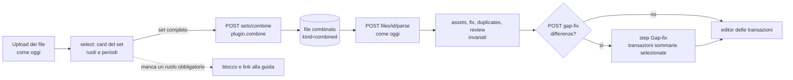

# Design — BRIM «report set»: un import da più export della stessa banca

**Stato**: bozza **v4** per la revisione del developer. È il gate dello step 2 del [piano](plan-phase00BrimDanskeBank.prompt.md): nessun codice dei set prima dell'approvazione.
**Data**: 2026-09-28. Rivista il 2026-09-29 tre volte:
- **v2**: limiti di profondità degli export (risposte dell'autore nella #26) e semantica delle commissioni (#25);
- **v3**: punti di verità, step «Gap-fix» nel wizard e confronto con CA e Intesa (§17), su indicazione del developer;
- **v4**: perimetro del set (D-S22) e più periodi con buchi (§10.8, D-S23), approvati dal developer.

**Workstream**: L · **Pilota**: Danske Bank · **Dopo il pilota**: Crédit Agricole, Intesa Sanpaolo.
**Analisi degli export Danske**: [analysis-phase00BrimDanskeBank.md](analysis-phase00BrimDanskeBank.md).

## 1. Il problema

Oggi LibreFolio assume che **un export = un import autosufficiente**: ogni file ha un broker, un plugin, un parse e un risultato. Le banche che fanno anche da broker, però, spezzano lo stesso conto in più export, che in parte si sovrappongono e in parte si completano.

| Banca | Export (ruolo) | Profondità massima | Si sovrappongono su | Solo in uno dei due |
|---|---|---|---|---|
| Danske (FI) | titoli: transazioni del deposito (XLSX); cassa: estratto del conto OST (CSV) | titoli **1 anno**, filtrato per data dell'operazione; cassa **5 anni** | acquisti, vendite, dividendi (l'importo) | quantità e prezzo (XLSX); versamenti, prelievi, tasse, canoni, saldo progressivo (CSV) |
| Crédit Agricole | cassa: estratto conto; titoli: lista movimenti titoli | cassa **2 anni**, con un tetto di righe per export; titoli molti anni | trade, cedole | quantità (titoli); la cassa reale e il saldo iniziale (conto) |
| Intesa Sanpaolo | movimenti; patrimonio (istantanea) | movimenti **circa 1 anno**; patrimonio alla data di oggi | — | posizioni e costo fiscale (patrimonio) |

**Nessuna delle tre banche permette di esportare tutti i ruoli sullo stesso periodo.** Il set deve funzionare con profondità diverse da un export all'altro (§10).

Con un file alla volta, il plugin è costretto a indovinare:
- la lista titoli CA aggiunge gambe di cassa sintetiche (`auto_cash`);
- l'estratto conto CA lascia dei trade bloccati perché manca la quantità;
- la guida CA chiede all'utente di tagliare a mano i periodi.

## 2. Obiettivi e non-obiettivi

**Obiettivi**
1. L'utente carica **tutti** gli export che il plugin richiede. Senza quelli obbligatori non si procede.
2. Il sistema li **combina** in un risultato unico e **conserva sia gli originali sia il combinato**. Il wizard lavora **solo sul combinato**.
3. Dentro il periodo coperto da tutti i file, una riga che deve avere una controparte nell'altro file e non la trova **è esclusa**. L'esclusione è dichiarata, con la riga d'origine.
4. Prima di quel periodo, dove arrivano solo alcuni file, le righe non si importano una per una: servono a dichiarare **punti di verità** su cassa e posizioni. Il sistema propone **da solo**, in uno step visibile e dove serve, le transazioni sommarie che chiudono il gap. L'utente non deve sapere nulla: importa i suoi export nel tempo e il salto a `T0` non si ripete.
5. Interfaccia e guida spiegano come esportare i file, quanto indietro arriva ciascuno e cosa succede ai bordi.
6. I plugin di oggi non cambiano.

**Non-obiettivi**
- Il BRIM continua a non scrivere transazioni: resta valida la decisione *parser-only*.
- Niente set fra broker diversi o fra plugin diversi.
- Niente FX e nessun ricalcolo: la regola verbatim resta.
- La migrazione di CA viene dopo il pilota.

## 3. Stato attuale (verificato sul codice il 2026-09-28)

- **Storage**: `broker_reports/{uploaded|parsed|failed}/broker_{id}/{uuid}{ext}`, più il sidecar `{uuid}.json` con `file_id`, `filename`, `extension`, `size_bytes`, `status`, `uploaded_at`, `processed_at`, `compatible_plugins`, `error_message`, `uploaded_by_user_id`, `target_broker_id`, `last_parse_result`, `parsed_plugin_code`, `parsed_plugin_version`. Le scritture sono atomiche (`_write_metadata_atomic` in `backend/app/services/brim_provider.py`).
- **Upload**: un file per chiamata, con il broker preso dal form. `compatible_plugins` si calcola subito con `can_parse`, in ordine di priorità.
- **Parse** (`POST /brokers/import/files/{id}/parse`, in `backend/app/api/v1/brokers.py`):
  1. auto-detect, se richiesto;
  2. `parse_file_offloaded`: process pool `forkserver`, fallback su thread, nessun timeout;
  3. ricerca dei candidati asset;
  4. rilevamento dei duplicati;
  5. `move_to_parsed` e `save_parse_result`.

  `BRIMParseError` e `ValueError` spostano il file in `failed`.
- **Schemi** (`backend/app/schemas/brim.py`): evidenze, notice, todo e validation issue **non hanno provenienza**, solo numeri di riga del singolo file. `file_id` esiste solo su `BRIMParseResponse` e su `BRIMFileInfo`.
- **Wizard** (`ImportWizardModal.svelte`):
  - passi `upload → select → analyze → assets → fix → duplicates → review`;
  - una `FileSelection {fileId, fileName, brokerId, pluginCode}` per file;
  - un parse per file, con concorrenza 4;
  - `buildMergedTransactions` (`importMerge.ts`) rimappa gli ID finti file per file e marca ogni riga con `sourceFileId`;
  - i bottoni «riga N nel file» aprono `FilePreviewModal` sul `fileId` del risultato.
- **Pagina file** (`/files`, tab brim): nome, uploader, broker, stato, dimensione, data; anteprima, link, download, elimina. Nessun raggruppamento.

## 4. Due architetture possibili

**A — Manifest del set più `parse_set`.** Un record `sets/{id}.json` elenca i membri con il loro ruolo. Il plugin espone `parse_set(membri)`. Il risultato combinato vive solo come cache JSON del set.

**C — File combinato derivato (consigliata).** Il plugin **combina** i membri in una **tabella di join**, un CSV generato dal sistema. La tabella si salva come un nuovo file BRIM con `kind=combined`, collegato agli originali. Da lì in poi è un file come gli altri: si analizza con `POST /files/{id}/parse`, lo legge lo stesso plugin, il wizard lo tratta come un file normale.

| Criterio | A · manifest | C · file combinato |
|---|---|---|
| «Salva originali e combinato, lavora solo sul combinato» | il combinato è solo una cache JSON | ✅ il combinato è un file vero, scaricabile e con anteprima |
| Provenienza delle righe | serve un campo nuovo su evidenze, notice, todo e issue, più la mappatura nel wizard | ✅ arriva gratis: ogni riga del combinato ha le colonne `lf_source*`, e le evidenze puntano al combinato |
| Wizard dopo `analyze` | un tipo di risultato «multi-file» nuovo | ✅ nessuna modifica: è un file |
| Cache, stale, duplicati, ID finti | da rifare per il set | ✅ esistono già per i file |
| Cosa vede l'utente | solo il risultato | ✅ apre il combinato e vede come sono state accoppiate le righe e perché alcune sono escluse |
| Costo | storage, API e ciclo di vita del manifest | due endpoint (`preview`, `combine`) e la scrittura del file derivato |
| Rischio | provenienza in quattro schemi e nel wizard | un formato di file in più, interno e versionato |

La C corrisponde meglio a quello che hai chiesto e tocca meno superfici. **Il resto del documento descrive la C** (D-S1).

## 5. Concetti

| Termine | Significato |
|---|---|
| **Ruolo** | Un tipo di export che il plugin conosce. Danske ne ha due: `custody` (XLSX) e `cash` (CSV). Ogni ruolo ha `required`, `multiple`, le estensioni e una descrizione. |
| **Set** | I file di **un** broker e di **un** plugin, ciascuno col suo ruolo. È **completo** quando ci sono tutti i ruoli obbligatori. |
| **Riga accoppiata** | Una riga che per natura ha una controparte nell'altro ruolo. Per Danske: un trade dell'XLSX e il suo `Osto`/`Myynti` nel CSV. |
| **Riga autonoma** | Una riga che esiste in un ruolo solo. Per Danske: versamenti, prelievi, tasse e canoni nel CSV; la scissione nell'XLSX. |
| **Combinato** | Il file derivato: una riga per ogni coppia, riga autonoma, riga esclusa o punto di verità, con i valori originali verbatim e le colonne `lf_*`. |
| **Transazioni estese** | Il risultato del parse del combinato: le coppie e le autonome. Le righe escluse non diventano transazioni; i punti di verità vanno allo step Gap-fix. |
| **Copertura** | Il periodo che un file copre davvero, ricavato dalle date delle sue righe. Ogni ruolo dichiara anche la sua profondità massima nota, per l'interfaccia e la guida. |
| **Finestra completa** | Il periodo `[T0, T1]` coperto da tutti i ruoli che si abbinano. Lì valgono le regole di abbinamento (S1–S9). Con più file dei titoli le finestre possono essere più d'una: i **segmenti**, separati da buchi (§10.8). |
| **Buco** | Lo spazio fra due segmenti in cui il CSV mostra trade o dividendi senza la riga nell'XLSX (§10.8). |
| **Checkpoint** | L'inizio di un segmento: lì il core confronta la banca con LibreFolio e propone le differenze. |
| **Inizio della storia (`H0`)** | La data da cui LibreFolio ha la storia di quel broker: la correzione `gap_fix` più vecchia o, al primo import, il primo checkpoint del set (§10.8). |
| **Zona precedente** | Il periodo prima di `H0`. Le sue righe non si importano una per una: il plugin le usa per i punti di verità (Danske) o le importa secondo una sua politica (CA). |
| **Punto di verità** | Quello che la banca afferma a una data su cassa o posizioni. La posizione è *esatta* se la banca dice la quantità, *minima* se c'è solo un indizio (S12). |
| **Gap-fix** | Una transazione sommaria, proposta dal core, che porta LibreFolio a coincidere con un punto di verità. Ha il tag `gap_fix`. |

## 6. Il flusso



## 7. Contratto del plugin

Tutto è opzionale: `report_roles == []`, il valore di default, indica un plugin a file singolo come quelli di oggi.

```python
class BRIMReportRole(StrictModel):
    code: str                 # "custody", "cash"
    required: bool = True
    multiple: bool = False    # several files for this role, with non-overlapping periods
    extensions: List[str]
    description: str          # English; the wizard shows an i18n key when one exists
    max_history: Optional[str] = None  # e.g. "P1Y": the bank's own limit, shown by the UI and the guide

class BRIMProvider:
    @property
    def report_roles(self) -> List[BRIMReportRole]: return []
    def detect_role(self, file_path: Path) -> Optional[str]: ...
    def describe_member(self, file_path: Path) -> BRIMMemberSummary: ...  # role, rows, min/max date per basis
    def combine(self, members: Dict[str, List[Path]], *, history_start: Optional[date] = None) -> BRIMCombinedTable: ...  # history_start = H0, from the core (§10.8)
```

- `can_parse` resta la porta d'ingresso. Vale `True` sia per i membri, così il plugin compare fra i compatibili già all'upload, sia per i combinati di questo plugin.
- `parse(path)`:
  - su un **combinato** restituisce l'output completo;
  - su un **membro** di un plugin che richiede il set solleva `BRIMSetRequiredError` («carica anche l'export X»). L'API risponde 422 e **non** sposta il file in `failed` (D-S4).
- `plugin_version` copre sia `combine` sia `parse`. Un combinato prodotto da una versione vecchia risulta stale e si può ricombinare.
- `BRIMParseOutput` e `BRIMParseResponse` guadagnano un campo facoltativo `truth_points`, vuoto per i plugin di oggi. Ogni punto contiene data, tipo (cassa o posizione), valuta e importo oppure ID finto dell'asset e quantità, esattezza (`exact` / `at_least`), costo per unità se noto, ed evidenza con la riga d'origine.

## 8. Il file combinato

- **Formato**: CSV UTF-8 con BOM, separatore `;`, virgolette dove servono (D-S2).
- **Ordine**: per data valuta, poi per riga d'origine. Deterministico.
- **Colonne**:

| Colonna | Contenuto |
|---|---|
| `lf_row_kind` | `pair`, `standalone`, `excluded`, `truth_cash`, `truth_position` o `summarized` (riga della zona precedente, usata per i punti di verità) |
| `lf_zone` | `before` (prima di `H0`), `window` (dentro un segmento), `gap` (in un buco dopo `H0`) o `after` (dopo l'ultimo segmento) |
| `lf_reason` | solo per le escluse: `no_counterpart`, `ambiguous`, `status`, `unknown_type`, `invalid`, `not_yet_settled` |
| `lf_source` | ruolo e riga del file originale, per esempio `custody:12 + cash:40` |
| `lf_match_key` | la chiave usata per l'abbinamento: data valuta, importo, valuta |
| `custody:<colonna>` … | i valori verbatim del file custody; un header vuoto diventa la lettera di colonna |
| `cash:<colonna>` … | i valori verbatim del file cash |

- **Nome del file**: generato, del tipo `<plugin> — combinato <data_min>…<data_max>.csv`.
- **Sidecar del combinato**: aggiunge `kind: "combined"`, `derived_from: [{file_id, role, filename}]`, `combine_plugin_code`, `combine_plugin_version` e `combine_summary`. Il riepilogo contiene la copertura di ogni file, la finestra `T0…T1`, i conteggi per `lf_row_kind`, `lf_zone` e `lf_reason`, la riconciliazione e i punti di verità.
- **Sidecar di ogni membro**: aggiunge `combined_into: [file_id]`.
- **Idempotenza**: se esiste già un combinato con gli stessi membri, la stessa versione del plugin e lo stesso `H0`, `combine` restituisce quello invece di crearne un altro (D-S6).

## 9. Le regole di selezione delle righe

Il cuore della tua richiesta: *se una riga si aspetta una controparte e non la trova, si esclude*.

| # | Regola |
|---|---|
| S1 | **Classificazione.** Il plugin assegna ogni riga di ogni ruolo a una classe: `paired` (chiede la controparte nel ruolo X), `standalone`, `ignored` (stato non contabilizzato) oppure `unknown`. Nel CSV Danske sono `paired` le righe `Osto …`/`Myynti …` e quelle col riferimento numerico dei proventi. |
| S2 | **Chiave.** Per Danske: data valuta + importo al centesimo + valuta, più una direzione coerente: `Osto` con quantità > 0, `Myynti` con quantità < 0, provento con importo > 0. |
| S3 | **Nome.** È un controllo di coerenza, non parte della chiave. Dopo la normalizzazione, il testo del CSV (troncato a circa 24 caratteri) deve essere prefisso del nome nell'XLSX o viceversa. Se la chiave è unica su entrambi i lati ma il nome non torna, si accoppia comunque e lo si segnala. |
| S4 | **Uno a uno.** Candidati identici (stesso nome, quantità e importo) si accoppiano nell'ordine dei file. Candidati diversi e non distinguibili si escludono **tutti** (`ambiguous`). Mai indovinare. |
| S5 | **Senza controparte, dentro la finestra: esclusa** (`no_counterpart`). La riga d'origine resta nel combinato e una notice la elenca. |
| S6 | **Le autonome dentro la finestra si includono sempre.** |
| S7 | **Righe sconosciute o errate: escluse** con un warning (`unknown_type`, `invalid`). Mai in silenzio. |
| S8 | **Assemblaggio.** Una coppia diventa **una** transazione: quantità e asset dal custody, la cassa (uguale sui due lati), la data valuta, una descrizione deterministica. Con una descrizione stabile, i re-import vengono riconosciuti come duplicati. |
| S9 | **Riconciliazione.** Se un ruolo ha un saldo progressivo (per Danske, `Saldo`), il riepilogo confronta la cassa importata con il saldo della banca e mostra la differenza dovuta alle righe escluse. |
| S10 | **Finestre e segmenti.** `T0` è l'inizio della copertura del ruolo più corto fra quelli che si abbinano, `T1` la fine della copertura comune. Per Danske, `T0` è l'inizio dell'XLSX, spostato sulla data valuta come dice S14. Più file dei titoli che si sovrappongono o si toccano formano un solo segmento; fra due segmenti c'è un buco (S16). Ogni segmento ha il suo `T0` e il suo `T1`. |
| S11 | **Zona precedente: la politica è del plugin.** Per Danske le righe prima di `H0` non diventano transazioni: servono solo a calcolare i punti di verità del primo checkpoint, e restano visibili nel combinato come `summarized`. Per CA, invece, la lista titoli più vecchia continua a produrre i trade cash-neutral di oggi (§17). |
| S12 | **Punti di verità.** Il plugin non crea transazioni di stato iniziale. Dichiara quello che la banca afferma a una certa data: la cassa (Danske: il `Saldo`) e, dove il file lo dimostra, le posizioni. Una posizione è **esatta** quando la banca ne dice la quantità (i trade della zona precedente, la quantità di un `Tuotto`, la linea vecchia di una scissione, un patrimonio) oppure **minima** quando c'è solo un indizio (una vendita che supera gli acquisti del file). Un punto di verità può stare a qualsiasi data, non solo a `T0`. |
| S13 | **Gap-fix calcolato dal core.** Dopo la revisione, il core confronta ogni punto di verità con quello che LibreFolio saprà a quella data (il database più le transazioni selezionate) e propone solo le differenze, come transazioni sommarie con il tag `gap_fix`, in uno step dedicato del wizard (§10.7). Al primo import propone tutto lo stato; a un import successivo sovrapposto la differenza è zero e non propone nulla; con un buco o con dati incoerenti propone solo la correzione. |
| S14 | **`T0` sulla data valuta.** `T0` parte dalla prima data dell'XLSX e si sposta in avanti solo quanto serve (al massimo 5 giorni lavorativi) per lasciare fuori le righe di cassa dei trade fatti prima dell'inizio dell'XLSX. Così ogni riga del CSV da `T0` in poi trova la sua controparte (§10.5). A fine finestra resta `not_yet_settled`: il trade arriva col prossimo import. |
| S15 | **Commissioni.** Si importa l'importo regolato così com'è, commissione compresa. Su ogni trade in cui la commissione non è dichiarata compare lo split della correzione (`split_hint: "trade_charges"`, come CA), con un suggerimento dove si può calcolare (§10.6). |
| S16 | **Buchi.** Dopo `H0`, in un buco le righe autonome si importano con la loro data; i trade e i dividendi senza controparte non diventano transazioni (`summarized`, zona `gap`), e la loro cassa la riallinea il checkpoint successivo. Un buco senza trade né dividendi non produce differenze. Dopo l'ultimo segmento le autonome si importano, mentre i trade senza controparte arrivano col prossimo import (§10.8). |

## 10. Finestre temporali, punti di verità e gap-fix

### 10.1 Il problema

Ogni banca ha profondità diverse da un export all'altro (§1). Per Danske l'XLSX dei titoli arriva al massimo a un anno, il CSV della cassa a cinque. La regola «esporta tutti i file sullo stesso periodo» vale solo per l'ultimo anno. Più indietro:
- i trade del CSV non trovano la loro riga nell'XLSX;
- chi ha comprato un titolo da più di un anno e lo vende adesso vede in LibreFolio una posizione negativa, perché l'acquisto non è in nessun file;
- se si tengono i versamenti vecchi ma si escludono gli acquisti vecchi, la cassa risulta gonfiata.

E l'utente non deve sapere nulla di tutto questo: nel tempo scarica i suoi export e li importa, e il sistema, **da solo**, crea le transazioni giuste senza rimettere ogni volta il salto a `T0`.

### 10.2 Il modello: movimenti, punti di verità e gap-fix

Ogni import di un set produce due cose:
1. i **movimenti** da `T0` in poi, abbinati fra i file con le regole S1–S9;
2. i **punti di verità**: quello che la banca afferma, a certe date, su cassa e posizioni (S12).

Il plugin **non** decide se lo stato iniziale serve. Lo decide il core, dopo la revisione, confrontando ogni punto di verità con quello che LibreFolio sa già a quella data. Propone solo le differenze, in uno step visibile (§10.7).

```text
                 zona precedente              finestra completa
cassa (CSV)   |=============================|=======================|
titoli (XLSX)                               |=======================|
                                            T0                      T1
                                            └ punto di verità: cassa dal `Saldo`, posizioni esatte o minime
```

| Caso | Cosa sa già LibreFolio a `T0` | Differenza | Cosa succede, senza che l'utente sappia nulla |
|---|---|---|---|
| Primo import | niente | tutto lo stato | lo step Gap-fix propone il saldo iniziale e le posizioni |
| Import successivo sovrapposto (il caso normale) | lo stato giusto, dagli import precedenti | zero | lo step Gap-fix non compare; i movimenti già presenti sono duplicati e restano deselezionati |
| Buco fra due import, o dati incoerenti | uno stato diverso | la differenza | lo step Gap-fix propone solo la correzione e mostra lo scarto |
| Più periodi con buchi, in un import o in più import | a ogni checkpoint, lo stato lasciato dai checkpoint precedenti | la differenza di ogni buco | una sezione per checkpoint, in ordine di data (§10.8) |

### 10.3 I punti di verità per banca

| Banca | `T0` | Cassa | Posizioni |
|---|---|---|---|
| Danske (pilota) | inizio dell'XLSX, spostato al massimo di 5 giorni lavorativi sulla data valuta (S14) | `Saldo` del CSV a `T0`: esatta | esatte dai trade della zona precedente, dal `Tuotto` e dalle scissioni; minime dalle vendite |
| Crédit Agricole (dopo) | inizio dell'estratto conto | saldo iniziale e finale dell'estratto (da verificare sull'export reale: i campioni del repo non li hanno) | ricostruite dalla lista titoli più vecchia, come oggi |
| Intesa (dopo) | data del patrimonio, che sta alla **fine** del periodo dei movimenti | liquidità del patrimonio: esatta | esatte, con il costo fiscale, dal patrimonio |

Il confronto completo con CA e Intesa è nel §17.

### 10.4 Import successivi e continuità

- **Danske**: l'XLSX non va oltre un anno, quindi **bisogna importare almeno una volta all'anno**. Se si salta, lo step Gap-fix vede il buco e propone la correzione di cassa e posizioni, ma i singoli trade del buco non si recuperano più (§10.8). La guida lo dice in chiaro.
- **Import sovrapposti**: i movimenti già presenti tornano come duplicati e il wizard li deseleziona da solo, grazie alle descrizioni deterministiche (S8). I punti di verità danno differenza zero.
- **Import di un periodo più vecchio dopo uno più recente** (possibile con CA, non con Danske): le transazioni `gap_fix` già importate si riconoscono dal tag, e il core propone di correggerle o toglierle (D-S21).

### 10.5 Bordi della finestra: perché `T0` sulla data valuta

- L'XLSX è filtrato per **data dell'operazione**; il CSV registra la **data valuta**, 1–4 giorni lavorativi dopo. LibreFolio data le transazioni con la data valuta.
- **Esempio, a inizio finestra.** L'XLSX parte dal 1 ottobre. Un acquisto del 29 settembre si regola il 1 ottobre: la riga `Osto` è nel CSV (1 ottobre), ma il trade non è nell'XLSX, perché è del 29 settembre.
  - Con `T0` = 1 ottobre, quella riga di cassa cadrebbe nella finestra senza controparte: esclusa, e la cassa di LibreFolio sbaglierebbe di quell'importo, a ogni primo import.
  - Con `T0` spostato subito dopo l'ultima di queste righe (qui il 2 ottobre; al massimo 5 giorni lavorativi), la riga cade prima di `T0`. Il suo importo è già dentro il `Saldo` a `T0`, cioè nel punto di verità della cassa. E ogni riga di cassa da `T0` in poi appartiene a un trade fatto dal 1 ottobre in poi, quindi presente nell'XLSX.
  - Il prezzo da pagare: i trade fatti fra l'inizio dell'XLSX e `T0` entrano nello stato iniziale come posizioni esatte, con il costo noto, invece che come trade singoli. Succede solo al primo import: in quelli successivi quei giorni li ha già importati l'import precedente. Se non ci sono righe orfane, `T0` non si sposta affatto.
- **A fine finestra**: un trade dell'ultimo giorno dell'XLSX si regola 2–4 giorni dopo. Se il CSV finisce prima, manca la riga di cassa → `not_yet_settled`, e il trade arriva col prossimo import. La guida consiglia di esportare il CSV fino a qualche giorno dopo la fine dell'XLSX.

### 10.6 Le commissioni (#26 e #25)

- **Cosa esporta la banca**: l'importo effettivamente regolato, **commissione compresa**. Un acquisto da 100 con 5 di commissione dà `Summa` −105; una vendita da 100 con 5 di commissione dà +95. La commissione da sola non si esporta (`Palkkio` vale sempre 0): si vede solo nel dettaglio web del trade, dove `kurssiarvo` è il controvalore senza commissione. La tariffa OST è 0,20 % con un minimo di 8 €.
- **Importare `Summa` così com'è è corretto** sia per la cassa sia per il costo: la commissione entra nel costo d'acquisto e riduce il ricavo della vendita. Manca solo la commissione come voce separata, per le statistiche sulle spese.
- **Per separarla bisogna scorporarla**, e lo strumento c'è già: la zona di split della correzione (`split_hint: "trade_charges"`, riferimento CA). L'utente scrive la commissione; il wizard crea una FEE e lascia il resto sul trade. Le due righe sommano sempre alla riga d'origine, in acquisto (−105 = −100 − 5) come in vendita (+95 = +100 − 5).
- **Decisione (D-S17)**:
  - nessuno split automatico (regola verbatim);
  - su **ogni trade in cui la commissione non è dichiarata** compare lo split della correzione, come `warning` (non bloccante), riusando i flag di CA;
  - per i titoli quotati in euro, il suggerimento mostra `|Summa| − Määrä × Kurssi`, che è la commissione; per le altre valute non si può, perché servirebbe il cambio.

  Si attende la conferma dell'autore che gli importi esportati siano sempre totali.
- **Allineamento con la #25**: l'helper che creerà BUY + FEE collegati è previsto per la 1.3.0. Quando arriva, le righe create dallo split potranno essere collegate nello stesso modo.

### 10.7 Lo step «Gap-fix» nel wizard

- **Quando**: dopo la revisione (`review`), prima di passare le transazioni all'editor. È **facoltativo**: compare solo se il core trova almeno una differenza.
- **Cosa calcola il core** (§11, `POST /gap-fix`): per ogni broker e ogni punto di verità, lo stato che LibreFolio avrà a quella data con le transazioni appena selezionate (database più selezione), e la differenza con quello che dice la banca. Tolleranza per la cassa: 0,01.
- **Cosa mostra**: per ogni broker, una frase del tipo «con queste transazioni, al 〈data〉 mancano 〈X〉», e le **transazioni sommarie** che chiudono il gap:
  - cassa: un DEPOSIT o un WITHDRAWAL della differenza;
  - posizioni: un ADJUSTMENT per asset con la quantità mancante. Il costo per unità viene dai trade del file quando è noto (per esempio i trade della zona precedente); altrimenti resta un todo bloccante sul costo, che il bulk editor gestisce già.
- **Aspetto**: la stessa tabella dello step finale, con le checkbox **selezionate di default**; l'utente può toglierle una per una.
- **Tag**: `gap_fix`, più la data del punto di verità nella descrizione, così dopo si riconoscono (D-S20).
- **Solo automatiche**: le transazioni di gap-fix le genera il sistema; l'utente sceglie solo se importarle.
- **Posizione minima**: la proposta scatta solo se LibreFolio ne ha meno del minimo; in quel caso propone solo la parte mancante.

### 10.8 Più periodi e buchi

Approvato dal developer il 2026-09-29 (D-S22, D-S23). Esempio: tre periodi dei titoli, e un CSV che li copre tutti.

```text
cassa (CSV)    |================================================================|
titoli (XLSX)             |==P1==|             |==P2==|             |==P3==|
                 buco 0   C1        buco 1     C2        buco 2     C3
               (prima di H0)
```

- **Segmento**: un tratto continuo coperto dai file dei titoli. Più XLSX che si sovrappongono o si toccano formano un segmento solo; una riga identica compare tante volte quante nel file che ne ha di più (D-S22).
- **Checkpoint**: l'inizio di ogni segmento, cioè il suo `T0` spostato come dice S14. Ha i suoi punti di verità:
  - la cassa, esatta, dal `Saldo` del CSV;
  - le posizioni che il segmento dimostra: esatte da un `Tuotto` o da una scissione, minime da una vendita che supera gli acquisti. Valgono all'inizio del segmento, perché dentro il segmento i dati sono completi.
- **Buco**: lo spazio fra due segmenti. È un buco vero solo se il CSV vi mostra trade o dividendi senza la riga nell'XLSX; altrimenti non c'è niente da correggere.
- **Inizio della storia (`H0`)**: la data della correzione `gap_fix` più vecchia di quel broker; al primo import, il primo checkpoint del set. Il core la ricava dal database e la passa a `combine`. `H0` decide solo cosa si mostra riga per riga e cosa si riassume: lo stato ai checkpoint è giusto in ogni caso, perché il gap-fix confronta sempre con il database.

| Zona | Righe autonome del CSV (versamenti, prelievi, tasse, canoni) | Trade e dividendi senza controparte |
|---|---|---|
| prima di `H0` | riassunte nel primo checkpoint | riassunti nel primo checkpoint |
| dentro un segmento | importate (S6) | esclusi, `no_counterpart` (S5) |
| buco dopo `H0` | **importate con la loro data** (D-S23) | `summarized`: la loro cassa la riallinea il checkpoint successivo |
| dopo l'ultimo segmento | importate | non importati: arrivano col prossimo import |

- **Calcolo**: il core calcola i checkpoint in ordine di data. A ognuno confronta la banca con il database, le transazioni selezionate e le proposte dei checkpoint precedenti, e propone solo la differenza. È lo stesso calcolo di un buco fra due import separati: con i periodi in ordine, il risultato non cambia se arrivano in un import solo o in più import.
- **Cosa non si recupera** (limite della banca): i singoli trade di un buco, perché il CSV non ha la quantità.
  - Un titolo comprato nel buco e poi mai mosso resta invisibile; uno venduto nel buco resta in LibreFolio.
  - Il CSV però ne dà il nome (`Osto`/`Myynti <nome>`): la pagina Gap-fix li elenca sotto il checkpoint, da verificare.
- **Correzione di cassa di un buco**: un DEPOSIT o un WITHDRAWAL `gap_fix`, con una descrizione che dice cosa riassume, per esempio «trade e dividendi dal … al … senza dati titoli, N righe».
- **Correzione deselezionata** (D-S24, proposta): le proposte si calcolano supponendo accettate quelle precedenti. Se l'utente ne toglie una, i checkpoint successivi non la compensano, e la verifica di fine segmento (D-S19) segnala lo scarto.
- **Ruoli invertiti**: in CA i buchi sono nella cassa, fra un blocco e l'altro dell'estratto, e li chiuderebbe il saldo iniziale di ogni blocco, se l'export reale lo contiene (§17).
- **Dopo il pilota**:
  - ricostruire un trade del buco quando il caso è univoco: per esempio un solo `Osto X` nel buco e un `Tuotto` dopo che dice quante azioni, che insieme danno un BUY completo;
  - oppure far scrivere la quantità all'utente, come nei trade bloccati di CA.

## 11. API (router `/brokers/import`)

| Metodo e percorso | Richiesta → risposta | Permesso | Cosa fa |
|---|---|---|---|
| `POST /sets/preview` | `{plugin_code, broker_id, file_ids}` → `BRIMSetPreview` | EDITOR sul broker | Per ogni file: ruolo e copertura. Poi la finestra `T0…T1`, i ruoli mancanti o doppi e gli avvisi. Non scrive nulla. |
| `POST /sets/combine` | la stessa richiesta → `{combined: BRIMFileInfo, summary, reused}` | EDITOR | Valida (stesso broker, set completo, ruoli unici), ricava `H0` dal database (la `gap_fix` più vecchia del broker), chiama `combine` fuori dall'event loop, scrive il combinato e il suo sidecar, aggiorna `combined_into`. |
| `POST /files/{id}/parse` | invariato | invariato | Sul combinato funziona come oggi. Su un membro di un plugin a set risponde 422, senza `failed`. |
| `GET /plugins` | `BRIMPluginInfo` più `report_roles` | invariato | Il wizard sa quali plugin vogliono un set. |
| `GET /files` | `BRIMFileInfo` più `kind`, `derived_from`, `combined_into`, `combine_is_stale` | invariato | La pagina file può mostrare i legami. |
| `POST /gap-fix` | `{broker_id, truth_points (asset già risolti), transactions (la selezione dopo la revisione)}` → `{checkpoints: [{date, proposals: [TXCreateItem con tag gap_fix], explanations, gap_summary}]}` | EDITOR sul broker | Calcola i checkpoint in ordine di data: a ognuno, lo stato di LibreFolio (database, selezione e proposte dei checkpoint precedenti) e le differenze con la banca (§10.8). Non scrive nulla. |

Il client si rigenera da solo.

## 12. Interfaccia

**Wizard, passo `select`**
- Se il plugin scelto per un file ha `report_roles`, i file dello stesso broker e plugin compaiono in una **card del set**, con:
  - uno slot per ruolo, con ✅ o ⛔ e il nome del file;
  - per ogni file la copertura (dal… al…) e la profondità massima nota del ruolo (per Danske: titoli 1 anno);
  - la **finestra completa** `T0…T1` che ne risulta, e cosa succede prima di `T0`: «prima di questa data i file servono solo a verificare cassa e posizioni; le eventuali differenze te le proponiamo alla fine»;
  - un avviso se il file di cassa non copre tutta la finestra dei titoli: quei trade resterebbero senza controparte;
  - i buchi fra i segmenti, se ci sono: «manca l'XLSX dal … al …: se la banca lo ha ancora, esportalo» (§10.8);
  - il link alla guida del plugin (`docs_url`).
- **Continua** resta disabilitato finché manca un ruolo obbligatorio.

**Wizard, passo `analyze`**
- Per ogni set completo, il wizard chiama `sets/combine` e poi analizza il combinato. I membri non si analizzano da soli.
- Nell'elenco dei risultati il set occupa **una sola riga**, del tipo «Danske Bank — combinato, 2 file».
- Le notice del set (esclusioni, riconciliazione, finestra) hanno codici stabili e testi i18n in `importWizard.reportSet.*` (D-S11).
- I punti di verità non sono righe da importare: il wizard li conserva per lo step Gap-fix.

**Passi successivi** (`assets` → `review`): invariati.

**Nuovo step facoltativo `gapFix`**, dopo `review` e prima dell'editor (§10.7):
- compare solo se `POST /gap-fix` restituisce almeno una proposta;
- ha la stessa tabella dello step finale, per broker e per checkpoint in ordine di data, con le checkbox selezionate di default;
- sotto ogni checkpoint che chiude un buco, i titoli che il CSV mostra comprati o venduti nel buco, da verificare (§10.8);
- sopra la tabella, la spiegazione («con queste transazioni, al 〈data〉 mancano 〈X〉») e il link alla guida;
- le transazioni selezionate si aggiungono al lotto che va all'editor, con il tag `gap_fix`;
- le posizioni senza costo noto arrivano con il todo bloccante sul costo, che il bulk editor gestisce già.

**Pagina file**, nel pilota solo il minimo:
- sul file combinato, un badge «combinato» con i nomi degli originali;
- sugli originali, un badge «usato in un combinato».

Il raggruppamento espandibile arriva dopo (D-S9).

## 13. Guida utente (pagina Danske)

- **Cosa serve**: il file dei titoli, `Transactions.xlsx`, e l'estratto del conto OST, `Osakesäästötili-…csv`. L'interfaccia della banca è solo in finlandese; i percorsi di menu vanno ancora raccolti.
- **Periodo**:
  - l'XLSX per tutto l'anno disponibile;
  - il CSV per lo stesso periodo o più lungo, fino ad almeno qualche giorno dopo la fine dell'XLSX. Un CSV più lungo non fa danni: la parte più vecchia serve solo al saldo iniziale.
- **Importa almeno una volta all'anno.** I periodi possono sovrapporsi; un buco oltre l'anno fa perdere i singoli trade (lo step Gap-fix corregge solo i totali). Versamenti e prelievi del buco restano, con la loro data; i titoli comprati o venduti nel buco vanno verificati (§10.8).
- **Primo import**: alla fine il wizard propone da solo il saldo iniziale e le posizioni mancanti (step Gap-fix, già selezionati). Per le posizioni senza costo noto va scritto il costo medio. I titoli posseduti da prima, che nel file non lasciano tracce, vanno aggiunti a mano.
- **Commissioni**: sono dentro gli importi. Su ogni trade la correzione permette di scorporarle, leggendole dal dettaglio del trade sul sito della banca.
- **Scissioni** (`Jakautuminen`): il wizard chiede il PMC delle azioni nuove; con rapporto 1:1 è il PMC vecchio per la percentuale pubblicata da vero.fi. Limite: capitale investito e guadagno risultano sfalsati del costo della linea vecchia (D4 del piano).
- **Righe escluse**: quelle senza controparte e i trade non ancora regolati alla fine dell'export. Vengono elencate con la riga d'origine.

Nella guida sviluppatore va aggiunta una sezione «Plugin multi-report» (ruoli, finestra, punti di verità, gap-fix).

## 14. Test

| Livello | Cosa si verifica | Chi |
|---|---|---|
| Framework | un plugin finto a due ruoli: preview, combine, idempotenza, formato del combinato, stale, errori | test-author, test rossi prima |
| Suite generica | i plugin con `report_roles` dichiarano i gruppi di campioni; la suite esegue combine → parse e applica i controlli di sempre | test-author |
| Danske | campioni sintetici: regole S1–S16, Latin-1, header HTML, colonna senza nome, `Tuotto`, scissione; CSV più lungo dell'XLSX (zona precedente); punti di verità esatti e minimi; `T0` spostato dalla riga di cassa di un trade precedente e `T0` fermo quando non ce ne sono; `not_yet_settled`; contesto dello split delle commissioni su ogni trade; più XLSX con buchi (autonome del buco importate, trade del buco `summarized`, righe identiche fra file sovrapposti) | test-author |
| API | preview e combine: permessi, broker diversi, set incompleto (422); parse di un membro (422, senza `failed`); parse del combinato; `POST /gap-fix`: primo import (tutto), import sovrapposto (nessuna proposta), buco (solo la differenza), posizione minima già coperta (nessuna proposta), costo noto e ignoto; tre segmenti con due buchi (un checkpoint per segmento, in ordine); stesso risultato in un import solo e in tre import; buco senza trade (nessuna proposta); `H0` dalla `gap_fix` più vecchia | test-author |
| Frontend | Vitest per la logica pura di raggruppamento; Playwright per card, blocco, combine, parse e step Gap-fix (compare, selezionato di default, deselezionabile, tag) | test-author (K è già entrato in `dev_release2`) |

## 15. Fasi

1. **Framework backend**: schemi (ruoli con `max_history`, `truth_points`), contratto, `combine` con zone e punti di verità, storage del file derivato, API (`sets/*`, `gap-fix`), test con il plugin finto.
2. **Plugin Danske**: `combine` e `parse` del combinato, campioni sintetici, test.
3. **Wizard e pagina file**: card del set, step Gap-fix, badge.
4. **Documentazione**: pagina utente, guida sviluppatore, registrazioni.
5. **Crédit Agricole**, dopo il pilota (§17).
6. **Intesa**, dopo CA (§17).

## 16. Decisioni aperte

| # | Decisione | Proposta |
|---|---|---|
| D-S1 | Architettura | **C, il file combinato** |
| D-S2 | Formato del combinato | CSV UTF-8 con BOM, `;`, colonne `lf_*` più le colonne verbatim prefissate dal ruolo |
| D-S3 | Esclusioni | dentro la finestra solo per mancanza di controparte; prima di `T0` le righe servono ai punti di verità (§10). Sostituisce D1 e le versioni precedenti di questa decisione. |
| D-S4 | Parse di un membro da solo | 422; il file resta `uploaded` |
| D-S5 | Stato dei membri dopo il combine | invariato, più `combined_into` |
| D-S6 | Stesso set combinato di nuovo | riuso del combinato esistente se membri, versione e `H0` coincidono |
| D-S7 | Più file per ruolo | ✅ previsto dal contratto (`multiple`) e usato anche nel pilota Danske, per esempio con più XLSX annuali; la deduplica è quella di D-S22 |
| D-S8 | Dove si calcolano ruolo e periodo | al volo con `sets/preview`, senza toccare l'upload |
| D-S9 | Pagina file | badge nel pilota, raggruppamento dopo |
| D-S10 | Avviso sui periodi | solo se il file di cassa non copre tutta la finestra dei titoli (sostituisce la tolleranza di 7 giorni della v1) |
| D-S11 | Lingua delle notice del set | i18n del wizard tramite `code`; le notice specifiche del plugin restano nella lingua del report |
| D-S12 | Dove vive il motore di abbinamento | dentro Danske; diventa un helper comune quando arriva CA (regola del secondo utilizzatore) |
| D-S13 | Come si trova `T0` | dalle date delle righe: l'inizio dell'XLSX, spostato sulla data valuta solo quanto serve per lasciare fuori le righe di cassa dei trade precedenti (al massimo 5 giorni lavorativi, S14). Nel pilota niente periodo dichiarato dall'utente. |
| D-S14 | Cassa iniziale | ✅ punto di verità dal saldo della banca; il DEPOSIT lo propone lo step Gap-fix solo se serve. Solo automatico (developer, 2026-09-29). |
| D-S15 | Stato iniziale una volta sola | ✅ **sostituita** dal gap-fix calcolato dal core (S13, §10.7): la differenza rispetto a quello che LibreFolio sa già. Approvata dal developer il 2026-09-29. |
| D-S16 | Posizioni iniziali | ✅ punti di verità esatti o minimi; le transazioni di fix le genera solo il sistema, e le posizioni senza costo noto portano il todo bloccante sul costo |
| D-S17 | Commissioni | ✅ split `warning` su ogni trade con commissione non dichiarata, riusando i flag CA; suggerimento per i titoli in euro. In attesa della conferma dell'autore che gli importi siano totali. |
| D-S18 | Righe di bordo | ✅ a inizio finestra le assorbe D-S13; a fine finestra restano `not_yet_settled`, escluse e dichiarate |
| D-S19 | Punto di verità a fine finestra (Danske: l'ultimo `Saldo`; CA: il saldo finale) | ✅ **solo verifica**, con una notice se non torna. Niente gap-fix automatico a fine finestra: la differenza nasce di solito da righe escluse, che l'utente deve vedere. Approvata dal developer il 2026-09-29. |
| D-S20 | Tag e descrizione delle transazioni sommarie | `gap_fix` (snake_case, come `auto_cash`), più la data del punto di verità e il nome del set nella descrizione |
| D-S21 | Import di un periodo più vecchio dopo uno più recente (CA) | ⏸ **rimandata**: il developer la considera un caso limite, da riprendere dopo il pilota. Idea di partenza: le `gap_fix` si riconoscono dal tag e il core propone di correggerle o toglierle. |
| D-S22 | Perimetro del set | ✅ **i file scelti in un import**: quelli caricati adesso più quelli già caricati, selezionati insieme nello step `select` (che oggi elenca già i file esistenti). Il wizard li raggruppa da solo per broker, plugin e ruolo; all'upload non si dichiara nulla. Più file per ruolo si concatenano, e una riga identica compare tante volte quante nel file che ne ha di più. Fra un import e l'altro la memoria è il database. Niente pool globale dei file del broker e niente n-upla dichiarata all'upload. Approvata dal developer il 2026-09-29. |
| D-S23 | Righe autonome nei buchi | ✅ **importate con la loro data**; il checkpoint successivo riallinea solo la cassa dei trade e dei dividendi del buco. Prima di `H0` tutto resta riassunto (§10.8). Approvata dal developer il 2026-09-29. |
| D-S24 | Correzione di un checkpoint deselezionata | proposta: le proposte si calcolano supponendo accettate quelle precedenti; i checkpoint successivi non la compensano, e la verifica di fine segmento (D-S19) segnala lo scarto |

Decisioni del piano per il plugin Danske, tutte chiuse:
- D4: rettifiche senza cassa marcate per la revisione manuale, con il blocco sul PMC delle linee nuove e un avviso sulla linea vecchia; resta un limite noto sul capitale investito (dettaglio nel piano);
- D5: data valuta, coerente con S14;
- D6: `Tuotto` come DIVIDEND, confermato dall'autore;
- D7: notice in finlandese, perché la banca ha solo il finlandese;
- D9: il saldo iniziale è ora un punto di verità più il gap-fix;
- D14: superata dalla D-S17.

## 17. Si può migrare a Crédit Agricole e Intesa? Analisi preliminare

Fatti presi dal codice (`broker_credit_agricole.py`, `broker_intesa.py`) e dalle pagine utente, verificati il 2026-09-29.

| Aspetto | Danske (pilota) | Crédit Agricole | Intesa Sanpaolo |
|---|---|---|---|
| Ruoli | titoli XLSX (1 anno), cassa CSV (5 anni) | conto: estratto con la cassa reale (2 anni, a blocchi per il tetto di righe); titoli: lista movimenti (molti anni, senza ISIN, senza cassa) | movimenti: circa 1 anno, solo cedole e canoni di custodia, niente trade, niente ISIN; patrimonio: istantanea con ISIN, quantità, costo fiscale e liquidità |
| Abbinamento fra file | trade e dividendi, XLSX ↔ CSV | compravendite e cedole, conto ↔ titoli | nessuno: i due export non si sovrappongono |
| `T0` | inizio dell'XLSX, sulla data valuta (S14) | inizio dell'estratto conto | data del patrimonio, che sta alla **fine** del periodo dei movimenti |
| Zona precedente | righe del CSV usate solo per la verità di cassa | lista titoli più vecchia: trade cash-neutral (`auto_cash`), come oggi | movimenti prima del patrimonio |
| Punti di verità | cassa esatta (`Saldo`); posizioni esatte o minime | cassa: saldo iniziale in testa all'estratto e saldo finale in coda (il plugin oggi riconosce il piè di pagina «SALDO FINALE» e lo salta); posizioni: dalla lista titoli | cassa e posizioni esatte, con il costo fiscale, alla data del patrimonio |
| Cosa migliora rispetto a oggi | tutto è nuovo | spariscono il taglio manuale dei periodi, il deposito del saldo iniziale fatto a mano e, dentro la finestra, le gambe `auto_cash` e i trade bloccati senza quantità | un secondo patrimonio oggi rigenera il seed completo (non è un duplicato, perché ha un'altra data) e, se importato, raddoppia le posizioni. Col gap-fix propone solo le differenze. E si possono importare anche le cedole prima del patrimonio, perché il gap-fix sottrae quello che già spiegano. |
| Rischi | posizioni che nel file non lasciano tracce | dati già importati col modello attuale (`auto_cash`, deposito iniziale a mano): serve un piano di migrazione; il saldo iniziale e finale va verificato sull'export reale, perché i campioni del repo non lo contengono | i trade fatti fra due patrimoni non stanno nei movimenti: il gap-fix li propone come ADJUSTMENT, e il costo per unità va ricavato dalla differenza dei costi fiscali |
| Verdetto preliminare | — | **migrabile**, ed è il caso che guadagna di più | **migrabile senza motore di abbinamento**: usa solo i punti di verità e lo step Gap-fix |

**Cosa deve garantire il framework, anche se Danske ne usa solo una parte:**
1. punti di verità a **qualsiasi data**, non solo a `T0` (Intesa: il patrimonio sta alla fine);
2. **politica della zona precedente decisa dal plugin** (Danske: solo verità; CA: trade cash-neutral);
3. ruoli `multiple` (CA: i blocchi dell'estratto conto);
4. posizioni **esatte** e **minime**;
5. gap-fix calcolato sul database **più** le transazioni selezionate, per broker, nel core;
6. più segmenti in un set, con un checkpoint per segmento e `H0` ricavato dal database (§10.8).

Il pilota Danske li implementa tutti nel framework; CA e Intesa diventano poi lavori sul plugin, più il piano di migrazione dei dati già importati.
