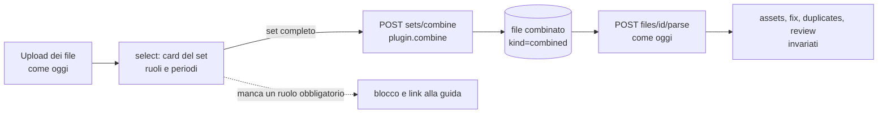

# Design — BRIM «report set»: un import da più export della stessa banca

**Stato**: bozza per la revisione del developer. È il gate dello step 2 del [piano](plan-phase00BrimDanskeBank.prompt.md): nessun codice dei set prima dell'approvazione.
**Data**: 2026-09-28 · **Workstream**: L · **Pilota**: Danske Bank · **Secondo utilizzatore**: Crédit Agricole, dopo il pilota.
**Analisi degli export Danske**: [analysis-phase00BrimDanskeBank.md](analysis-phase00BrimDanskeBank.md).

## 1. Il problema

Oggi LibreFolio assume che **un export = un import autosufficiente**: ogni file ha un broker, un plugin, un parse e un risultato. Le banche che fanno anche da broker, però, spezzano lo stesso conto in più export, che in parte si sovrappongono e in parte si completano.

| Banca | Export | Si sovrappongono su | Solo in uno dei due |
|---|---|---|---|
| Danske (FI) | transazioni del deposito titoli (XLSX), estratto del conto cassa (CSV) | acquisti, vendite, proventi (l'importo) | quantità e prezzo (XLSX); versamenti, prelievi, tasse, canoni (CSV) |
| Crédit Agricole | estratto conto, lista movimenti titoli | trade, cedole | quantità (titoli); la cassa reale (conto) |
| Intesa Sanpaolo | lista movimenti, patrimonio | — | l'istantanea delle posizioni |

Con un file alla volta, il plugin è costretto a indovinare:
- la lista titoli CA aggiunge gambe di cassa sintetiche (`auto_cash`);
- l'estratto conto CA lascia dei trade bloccati perché manca la quantità;
- la guida CA chiede all'utente di tagliare a mano i periodi.

## 2. Obiettivi e non-obiettivi

**Obiettivi**
1. L'utente carica **tutti** gli export che il plugin richiede. Senza quelli obbligatori non si procede.
2. Il sistema li **combina** in un risultato unico e **conserva sia gli originali sia il combinato**. Il wizard lavora **solo sul combinato**.
3. Una riga che deve avere una controparte nell'altro file e non la trova **è esclusa**. L'esclusione è dichiarata, con la riga d'origine.
4. Interfaccia e guida spiegano come esportare i file e che **i periodi devono coincidere**.
5. I plugin di oggi non cambiano.

**Non-obiettivi**
- Il BRIM continua a non scrivere transazioni: resta valida la decisione *parser-only*.
- Niente set fra broker diversi o fra plugin diversi.
- Niente FX e nessun ricalcolo: la regola verbatim resta.
- La migrazione di CA viene dopo il pilota.

## 3. Stato attuale (verificato sul codice il 2026-09-28)

- **Storage**: `broker_reports/{uploaded|parsed|failed}/broker_{id}/{uuid}{ext}`, più il sidecar `{uuid}.json` con `file_id`, `filename`, `extension`, `size_bytes`, `status`, `uploaded_at`, `processed_at`, `compatible_plugins`, `error_message`, `uploaded_by_user_id`, `target_broker_id`, `last_parse_result`, `parsed_plugin_code`, `parsed_plugin_version`. Le scritture sono atomiche (`_write_metadata_atomic` in `backend/app/services/brim_provider.py`).
- **Upload**: un file per chiamata, con il broker preso dal form. `compatible_plugins` si calcola subito con `can_parse`, in ordine di priorità.
- **Parse** (`POST /brokers/import/files/{id}/parse`, in `backend/app/api/v1/brokers.py`):
  1. auto-detect, se richiesto;
  2. `parse_file_offloaded`: process pool `forkserver`, fallback su thread, nessun timeout;
  3. ricerca dei candidati asset;
  4. rilevamento dei duplicati;
  5. `move_to_parsed` e `save_parse_result`.

  `BRIMParseError` e `ValueError` spostano il file in `failed`.
- **Schemi** (`backend/app/schemas/brim.py`): evidenze, notice, todo e validation issue **non hanno provenienza**, solo numeri di riga del singolo file. `file_id` esiste solo su `BRIMParseResponse` e su `BRIMFileInfo`.
- **Wizard** (`ImportWizardModal.svelte`):
  - passi `upload → select → analyze → assets → fix → duplicates → review`;
  - una `FileSelection {fileId, fileName, brokerId, pluginCode}` per file;
  - un parse per file, con concorrenza 4;
  - `buildMergedTransactions` (`importMerge.ts`) rimappa gli ID finti file per file e marca ogni riga con `sourceFileId`;
  - i bottoni «riga N nel file» aprono `FilePreviewModal` sul `fileId` del risultato.
- **Pagina file** (`/files`, tab brim): nome, uploader, broker, stato, dimensione, data; anteprima, link, download, elimina. Nessun raggruppamento.

## 4. Due architetture possibili

**A — Manifest del set più `parse_set`.** Un record `sets/{id}.json` elenca i membri con il loro ruolo. Il plugin espone `parse_set(membri)`. Il risultato combinato vive solo come cache JSON del set.

**C — File combinato derivato (consigliata).** Il plugin **combina** i membri in una **tabella di join**, un CSV generato dal sistema. La tabella si salva come un nuovo file BRIM con `kind=combined`, collegato agli originali. Da lì in poi è un file come gli altri: si analizza con `POST /files/{id}/parse`, lo legge lo stesso plugin, il wizard lo tratta come un file normale.

| Criterio | A · manifest | C · file combinato |
|---|---|---|
| «Salva originali e combinato, lavora solo sul combinato» | il combinato è solo una cache JSON | ✅ il combinato è un file vero, scaricabile e con anteprima |
| Provenienza delle righe | serve un campo nuovo su evidenze, notice, todo e issue, più la mappatura nel wizard | ✅ arriva gratis: ogni riga del combinato ha le colonne `lf_source*`, e le evidenze puntano al combinato |
| Wizard dopo `analyze` | un tipo di risultato «multi-file» nuovo | ✅ nessuna modifica: è un file |
| Cache, stale, duplicati, ID finti | da rifare per il set | ✅ esistono già per i file |
| Cosa vede l'utente | solo il risultato | ✅ apre il combinato e vede come sono state accoppiate le righe e perché alcune sono escluse |
| Costo | storage, API e ciclo di vita del manifest | due endpoint (`preview`, `combine`) e la scrittura del file derivato |
| Rischio | provenienza in quattro schemi e nel wizard | un formato di file in più, interno e versionato |

La C corrisponde meglio a quello che hai chiesto e tocca meno superfici. **Il resto del documento descrive la C** (D-S1).

## 5. Concetti

| Termine | Significato |
|---|---|
| **Ruolo** | Un tipo di export che il plugin conosce. Danske ne ha due: `custody` (XLSX) e `cash` (CSV). Ogni ruolo ha `required`, `multiple`, le estensioni e una descrizione. |
| **Set** | I file di **un** broker e di **un** plugin, ciascuno col suo ruolo. È **completo** quando ci sono tutti i ruoli obbligatori. |
| **Riga accoppiata** | Una riga che per natura ha una controparte nell'altro ruolo. Per Danske: un trade dell'XLSX e il suo `Osto`/`Myynti` nel CSV. |
| **Riga autonoma** | Una riga che esiste in un ruolo solo. Per Danske: versamenti, prelievi, tasse e canoni nel CSV; la scissione nell'XLSX. |
| **Combinato** | Il file derivato: una riga per ogni coppia, riga autonoma o riga esclusa, con i valori originali verbatim e le colonne `lf_*`. |
| **Transazioni estese** | Il risultato del parse del combinato: le coppie più le autonome. Le righe escluse non diventano transazioni. |

## 6. Il flusso



## 7. Contratto del plugin

Tutto è opzionale: `report_roles == []`, il valore di default, indica un plugin a file singolo come quelli di oggi.

```python
class BRIMReportRole(StrictModel):
    code: str                 # "custody", "cash"
    required: bool = True
    multiple: bool = False    # several files for this role, with non-overlapping periods
    extensions: List[str]
    description: str          # English; the wizard shows an i18n key when one exists

class BRIMProvider:
    @property
    def report_roles(self) -> List[BRIMReportRole]: return []
    def detect_role(self, file_path: Path) -> Optional[str]: ...
    def describe_member(self, file_path: Path) -> BRIMMemberSummary: ...  # role, rows, min/max date per basis
    def combine(self, members: Dict[str, List[Path]]) -> BRIMCombinedTable: ...
```

- `can_parse` resta la porta d'ingresso. Vale `True` sia per i membri, così il plugin compare fra i compatibili già all'upload, sia per i combinati di questo plugin.
- `parse(path)`:
  - su un **combinato** restituisce l'output completo;
  - su un **membro** di un plugin che richiede il set solleva `BRIMSetRequiredError` («carica anche l'export X»). L'API risponde 422 e **non** sposta il file in `failed` (D-S4).
- `plugin_version` copre sia `combine` sia `parse`. Un combinato prodotto da una versione vecchia risulta stale e si può ricombinare.

## 8. Il file combinato

- **Formato**: CSV UTF-8 con BOM, separatore `;`, virgolette dove servono (D-S2).
- **Ordine**: per data valuta, poi per riga d'origine. Deterministico.
- **Colonne**:

| Colonna | Contenuto |
|---|---|
| `lf_row_kind` | `pair`, `standalone` o `excluded` |
| `lf_reason` | solo per le escluse: `no_counterpart`, `ambiguous`, `status`, `unknown_type`, `invalid` |
| `lf_source` | ruolo e riga del file originale, per esempio `custody:12 + cash:40` |
| `lf_match_key` | la chiave usata per l'abbinamento: data valuta, importo, valuta |
| `custody:<colonna>` … | i valori verbatim del file custody; un header vuoto diventa la lettera di colonna |
| `cash:<colonna>` … | i valori verbatim del file cash |

- **Nome del file**: generato, del tipo `<plugin> — combinato <data_min>…<data_max>.csv`.
- **Sidecar del combinato**: aggiunge `kind: "combined"`, `derived_from: [{file_id, role, filename}]`, `combine_plugin_code`, `combine_plugin_version` e `combine_summary`. Il riepilogo contiene i periodi, i conteggi per `lf_row_kind` e `lf_reason`, la riconciliazione e il saldo iniziale.
- **Sidecar di ogni membro**: aggiunge `combined_into: [file_id]`.
- **Idempotenza**: se esiste già un combinato con gli stessi membri e la stessa versione del plugin, `combine` restituisce quello invece di crearne un altro (D-S6).

## 9. Le regole di selezione delle righe

Il cuore della tua richiesta: *se una riga si aspetta una controparte e non la trova, si esclude*.

| # | Regola |
|---|---|
| S1 | **Classificazione.** Il plugin assegna ogni riga di ogni ruolo a una classe: `paired` (chiede la controparte nel ruolo X), `standalone`, `ignored` (stato non contabilizzato) oppure `unknown`. Nel CSV Danske sono `paired` le righe `Osto …`/`Myynti …` e quelle col riferimento numerico dei proventi. |
| S2 | **Chiave.** Per Danske: data valuta + importo al centesimo + valuta, più una direzione coerente: `Osto` con quantità > 0, `Myynti` con quantità < 0, provento con importo > 0. |
| S3 | **Nome.** È un controllo di coerenza, non parte della chiave. Dopo la normalizzazione, il testo del CSV (troncato a circa 24 caratteri) deve essere prefisso del nome nell'XLSX o viceversa. Se la chiave è unica su entrambi i lati ma il nome non torna, si accoppia comunque e lo si segnala. |
| S4 | **Uno a uno.** Candidati identici (stesso nome, quantità e importo) si accoppiano nell'ordine dei file. Candidati diversi e non distinguibili si escludono **tutti** (`ambiguous`). Mai indovinare. |
| S5 | **Senza controparte, esclusa** (`no_counterpart`). La riga d'origine resta nel combinato e una notice la elenca. |
| S6 | **Le autonome si includono sempre.** I periodi servono a informare, non a escludere (§10). |
| S7 | **Righe sconosciute o errate: escluse** con un warning (`unknown_type`, `invalid`). Mai in silenzio. |
| S8 | **Assemblaggio.** Una coppia diventa **una** transazione: quantità e asset dal custody, la cassa (uguale sui due lati), la data valuta, una descrizione deterministica. Con una descrizione stabile, i re-import vengono riconosciuti come duplicati. |
| S9 | **Riconciliazione.** Se un ruolo ha un saldo progressivo (per Danske, `Saldo`), il riepilogo confronta la cassa importata con il saldo della banca e mostra la differenza dovuta alle righe escluse. Il saldo prima della prima riga compare come «saldo iniziale», senza creare transazioni. |

## 10. I periodi

- Gli export Danske non dichiarano il periodo scelto: si ricava dalle date delle righe.
- **Le righe autonome fuori dal periodo comune non si escludono.** Il primo versamento arriva quasi sempre prima del primo trade: con un periodo ricavato dalle righe verrebbe escluso, e la cassa partirebbe negativa. Per questo rovescio la proposta D1 del piano.
- Si esclude solo per mancanza di controparte (S5), come hai chiesto.
- Prima del parse, la card del set mostra il periodo di ogni file e avvisa se l'inizio o la fine differiscono di più di 7 giorni (D-S10).
- Ai bordi del periodo alcune esclusioni sono normali: un trade dell'ultimo giorno si regola dopo la fine dell'export di cassa. La guida lo spiega. Il re-import successivo recupera quelle righe e i duplicati vengono riconosciuti.
- Un'estensione possibile, fuori dal pilota: l'utente dichiara il periodo esportato e il sistema esclude tutto quello che sta fuori.

## 11. API (router `/brokers/import`)

| Metodo e percorso | Richiesta → risposta | Permesso | Cosa fa |
|---|---|---|---|
| `POST /sets/preview` | `{plugin_code, broker_id, file_ids}` → `BRIMSetPreview` | EDITOR sul broker | Per ogni file: ruolo e periodo. Poi i ruoli mancanti o doppi e gli avvisi. Non scrive nulla. |
| `POST /sets/combine` | la stessa richiesta → `{combined: BRIMFileInfo, summary, reused}` | EDITOR | Valida (stesso broker, set completo, ruoli unici), chiama `combine` fuori dall'event loop, scrive il combinato e il suo sidecar, aggiorna `combined_into`. |
| `POST /files/{id}/parse` | invariato | invariato | Sul combinato funziona come oggi. Su un membro di un plugin a set risponde 422, senza `failed`. |
| `GET /plugins` | `BRIMPluginInfo` più `report_roles` | invariato | Il wizard sa quali plugin vogliono un set. |
| `GET /files` | `BRIMFileInfo` più `kind`, `derived_from`, `combined_into`, `combine_is_stale` | invariato | La pagina file può mostrare i legami. |

Il client si rigenera da solo.

## 12. Interfaccia

**Wizard, passo `select`**
- Se il plugin scelto per un file ha `report_roles`, i file dello stesso broker e plugin compaiono in una **card del set**, con:
  - uno slot per ruolo, con ✅ o ⛔ e il nome del file;
  - il periodo di ogni file, più un avviso se i periodi non coincidono;
  - il testo «Questo import richiede N file: …. Esportali per lo stesso periodo: le righe senza controparte non vengono importate», con il link alla guida del plugin (`docs_url`).
- **Continua** resta disabilitato finché manca un ruolo obbligatorio.

**Wizard, passo `analyze`**
- Per ogni set completo, il wizard chiama `sets/combine` e poi analizza il combinato. I membri non si analizzano da soli.
- Nell'elenco dei risultati il set occupa **una sola riga**, del tipo «Danske Bank — combinato, 2 file».
- Le notice del set (esclusioni, riconciliazione, saldo iniziale) hanno codici stabili e testi i18n in `importWizard.reportSet.*` (D-S11).

**Passi successivi** (`assets` → `review`): invariati.

**Pagina file**, nel pilota solo il minimo:
- sul file combinato, un badge «combinato» con i nomi degli originali;
- sugli originali, un badge «usato in un combinato».

Il raggruppamento espandibile arriva dopo (D-S9).

## 13. Guida utente (pagina Danske)

- Cosa serve: i due export, e da quale menu si scaricano. I percorsi li fornirà l'autore della issue.
- **Lo stesso periodo per tutti e due i file**. Per il primo import, dall'apertura del conto.
- Cosa succede alle righe senza controparte: vengono elencate e non importate.
- Le operazioni non ancora regolate alla data dell'export arrivano con il prossimo import.
- Reimportare periodi sovrapposti è sicuro: i duplicati vengono riconosciuti.
- Il saldo iniziale, se non si parte dall'apertura del conto.

Nella guida sviluppatore va aggiunta una sezione «Plugin multi-report».

## 14. Test

| Livello | Cosa si verifica | Chi |
|---|---|---|
| Framework | un plugin finto a due ruoli: preview, combine, idempotenza, formato del combinato, stale, errori | test-author, test rossi prima |
| Suite generica | i plugin con `report_roles` dichiarano i gruppi di campioni; la suite esegue combine → parse e applica i controlli di sempre | test-author |
| Danske | campioni sintetici: regole S1–S9, Latin-1, header HTML, colonna senza nome, `Tuotto`, scissione | test-author |
| API | preview e combine: permessi, broker diversi, set incompleto (422); parse di un membro (422, senza `failed`); parse del combinato | test-author |
| Frontend | Vitest per la logica pura di raggruppamento; Playwright per card, blocco, combine e parse | test-author, dopo il merge di K |

## 15. Fasi

1. **Framework backend**: schemi, contratto, `combine`, storage del file derivato, API, test con il plugin finto.
2. **Plugin Danske**: `combine` e `parse` del combinato, campioni, test.
3. **Wizard e pagina file**, dopo il merge di K.
4. **Documentazione**: pagina utente, guida sviluppatore, registrazioni.
5. **Crédit Agricole**, dopo il pilota:
   - ruoli `conto` (obbligatorio, `multiple`) e `titoli` (facoltativo);
   - con tutti e due i file spariscono le gambe `auto_cash` e i tagli di periodo manuali;
   - resta da decidere cosa fare dei dati già importati.

## 16. Decisioni aperte

| # | Decisione | Proposta |
|---|---|---|
| D-S1 | Architettura | **C, il file combinato** |
| D-S2 | Formato del combinato | CSV UTF-8 con BOM, `;`, colonne `lf_*` più le colonne verbatim prefissate dal ruolo |
| D-S3 | Esclusioni | solo per mancanza di controparte; i periodi sono solo informativi. Sostituisce D1. |
| D-S4 | Parse di un membro da solo | 422; il file resta `uploaded` |
| D-S5 | Stato dei membri dopo il combine | invariato, più `combined_into` |
| D-S6 | Stesso set combinato di nuovo | riuso del combinato esistente se membri e versione coincidono |
| D-S7 | Più file per ruolo | previsto dal contratto (`multiple`); nel pilota Danske, un file per ruolo |
| D-S8 | Dove si calcolano ruolo e periodo | al volo con `sets/preview`, senza toccare l'upload |
| D-S9 | Pagina file | badge nel pilota, raggruppamento dopo |
| D-S10 | Tolleranza per l'avviso sui periodi | 7 giorni |
| D-S11 | Lingua delle notice del set | i18n del wizard tramite `code`; le notice specifiche del plugin restano nella lingua del report |
| D-S12 | Dove vive il motore di abbinamento | dentro Danske; diventa un helper comune quando arriva CA (regola del secondo utilizzatore) |

Per il plugin Danske restano aperte, dal piano: D4 (costo della scissione), D5 (data valuta), D6 (`Tuotto`), D7 (lingua), D9 (saldo iniziale), D14 (`Palkkio`).
