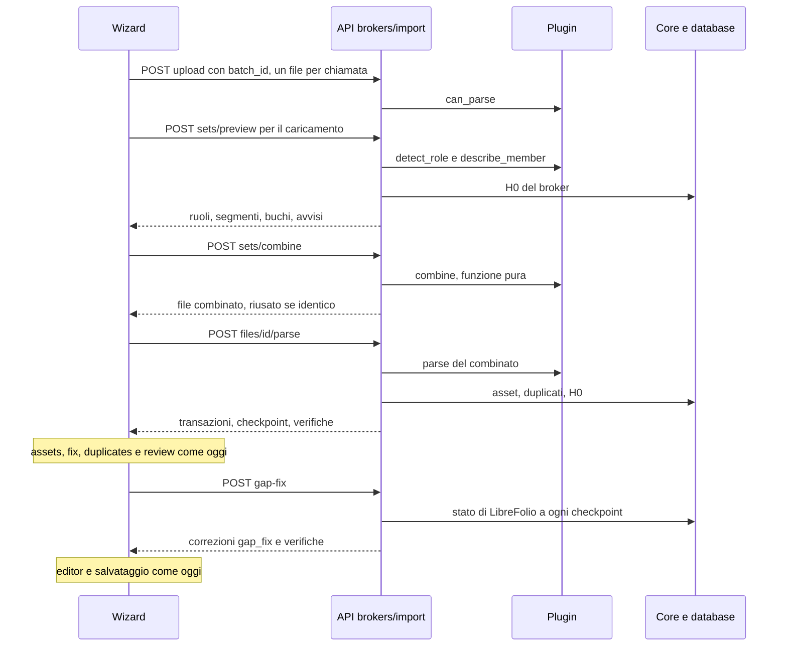

# Design — BRIM «report set»: un import da più export della stessa banca

**Stato**: bozza **v5** per la revisione del developer. È il gate dello step 2 del [piano](plan-phase00BrimDanskeBank.prompt.md): nessun codice dei set prima dell'approvazione.

**v5 (2026-09-29)**: riscrittura completa, su richiesta del developer:
- si parte dalla nuova API e si risale verso il wizard, la pagina file e le guide;
- ogni capitolo ha i casi limite, con il comportamento atteso, e la migrazione funzionale: *oggi → pilota (Danske) → a regime (CA, Intesa)*;
- in fondo c'è l'analisi logica (§11).

Le versioni precedenti sono nella storia di git (v4: `e3244095e`). Le novità di sostanza rispetto alla v4 sono segnate **[v5]**. Le spiega il §11.4, e quelle che toccano decisioni già prese vanno confermate (§10).

**v5.1 (2026-09-30)**: il §4 è riscritto con i disegni di ogni passo del wizard. Si adeguano §3.3, §3.8, §8, §10 e §11. Le novità sono segnate **[v5.1]**.

**v5.2 (2026-09-30)**: il set nasce dal caricamento (D-S22, decisa dal developer): i file caricati insieme formano il set, e se ne manca uno lo si carica nello stesso set. Il completamento automatico della v5.1 (D-S31) è ritirato, perché trasformava l'archivio dei file in una memoria nascosta (A16). Le novità sono segnate **[v5.2]**.

**Workstream**: L · **Pilota**: Danske Bank · **Dopo il pilota**: Crédit Agricole, Intesa Sanpaolo.
**Analisi degli export Danske**: [analysis-phase00BrimDanskeBank.md](analysis-phase00BrimDanskeBank.md).

## 0. Come si legge

| § | Contenuto |
|---|---|
| 1 | Il problema e gli obiettivi, in breve |
| 2 | Il vocabolario, con un disegno |
| 3 | **La nuova API**, endpoint per endpoint: cosa fa, cosa chiede al plugin e al core, i casi limite |
| 4–6 | Risalendo: il wizard, la pagina file, le guide |
| 7 | La migrazione banca per banca: Danske, Crédit Agricole, Intesa |
| 8–10 | Test, fasi, decisioni |
| 11 | L'analisi logica: invarianti, copertura dei casi, scenari, incongruenze trovate, tensioni che restano |

Ogni capitolo chiude con un riquadro **Migrazione**: com'è oggi, cosa cambia col pilota Danske, com'è a regime.

## 1. Il problema, in breve

Oggi LibreFolio assume che un export sia un import autosufficiente: un file, un plugin, un risultato. Le banche che fanno anche da broker spezzano però lo stesso conto in più export, che in parte si sovrappongono e in parte si completano, e che arrivano indietro nel tempo in modo diverso.

| Banca | Export (ruolo) | Profondità | In comune | Solo in uno |
|---|---|---|---|---|
| Danske (FI) | titoli: transazioni del deposito (XLSX); cassa: estratto del conto OST (CSV) | titoli **1 anno**, filtrato per data dell'operazione; cassa **5 anni** | acquisti, vendite, dividendi (l'importo) | quantità e prezzo (XLSX); versamenti, prelievi, tasse, canoni e **saldo progressivo** (CSV) |
| Crédit Agricole | conto: estratto con saldo iniziale e finale; titoli: lista movimenti | conto **2 anni**, a blocchi per il tetto di righe; titoli molti anni | trade, cedole | quantità (titoli); cassa vera e saldi (conto) |
| Intesa Sanpaolo | movimenti; patrimonio (istantanea) | movimenti circa 1 anno; patrimonio alla data di oggi | — | posizioni e costo fiscale (patrimonio) |

**Nessuna delle tre banche permette di esportare tutti i ruoli sullo stesso periodo.**

**Obiettivi**
1. L'utente carica gli export che il plugin chiede. Senza quelli obbligatori non si procede.
2. Il sistema li combina in un **file combinato**, conserva sia gli originali sia il combinato, e il wizard lavora solo sul combinato.
3. Dove i file si sovrappongono, una riga che si aspetta una controparte e non la trova si esclude, e l'esclusione è dichiarata.
4. L'utente non sa nulla: importa i suoi export nel tempo, e il sistema, **da solo**, porta LibreFolio a coincidere con quello che la banca afferma su saldi e posizioni, senza ripetere ogni volta il salto iniziale.
5. I plugin di oggi non cambiano.

**Non-obiettivi**
- Il BRIM continua a non scrivere transazioni (*parser-only*): scrive l'editor, come oggi.
- Niente set fra broker diversi o fra plugin diversi.
- Niente FX e nessun ricalcolo: resta la regola verbatim.
- CA e Intesa vengono dopo il pilota.

## 2. Vocabolario

```text
cassa (CSV)   |======================================================================|
titoli (XLSX)             |=== segmento 1 ===|                |=== segmento 2 ===|
                prima     C1    finestra 1        buco        C2    finestra 2    V     dopo
               (di H0)    ↑ checkpoint                        ↑ checkpoint        ↑ verifica
```

| Termine | Significato |
|---|---|
| **Ruolo** | Un tipo di export che il plugin conosce. Danske: `custody` (XLSX dei titoli) e `cash` (CSV della cassa). Ha `required`, `multiple`, le estensioni e la profondità massima nota. |
| **Caricamento** | **[v5.2]** Un'azione di upload dell'utente: una sessione del passo ① del wizard, oppure una sola azione dalla pagina file o dalla pagina del broker. Ogni file ne porta l'identificativo (`batch_id`). |
| **Set** | **[v5.2]** I file **caricati insieme** per lo stesso broker e riconosciuti dallo stesso plugin a set, ciascuno col suo ruolo. È un'unità: si seleziona, si analizza e si importa per intero (D-S22). |
| **Membro** | Un file del set. |
| **Combinato** | Il file che il plugin produce dal set: una riga per ogni coppia, riga autonoma, esclusa o riassunta, con i valori originali verbatim e le colonne `lf_*`. |
| **Data** | Tutte le transazioni hanno la **data valuta** (D5). La data dell'operazione dell'XLSX serve solo a misurare la copertura. |
| **Riga accoppiata** | Una riga che per natura ha una controparte nell'altro ruolo: un trade dell'XLSX e il suo `Osto`/`Myynti` nel CSV, oppure un provento. |
| **Riga autonoma** | Una riga che esiste in un ruolo solo: versamenti, prelievi, tasse e canoni nel CSV; la scissione nell'XLSX. |
| **Segmento** | Un tratto continuo coperto dai file dei titoli, dal primo all'ultimo giorno di operazioni (`S`…`E`). Più XLSX che si sovrappongono o si toccano fanno un solo segmento. |
| **Finestra** | Il tratto di un segmento sull'asse della data valuta, da `S` a `E` più il ritardo massimo di regolamento. Lì valgono le regole di abbinamento. |
| **Buco** | Lo spazio fra due segmenti, se il CSV dimostra che lì ci sono stati trade o proventi. Senza prova non c'è buco: i due file fanno un segmento solo. |
| **Dopo** | Il tratto del CSV oltre l'ultima finestra: un buco ancora aperto, che chiuderà il prossimo import. |
| **Punto di verità** | Ciò che la banca afferma a una data: la cassa (esatta, dal saldo progressivo) oppure una posizione (esatta o minima, da una prova nel file). |
| **Checkpoint** (il vecchio `T0`) | La vigilia di un segmento: `C = S − 1`. Lì i punti di verità si confrontano con LibreFolio, e il core propone le **correzioni** che chiudono la differenza. |
| **Verifica** | Un punto di verità che si confronta ma non corregge. Per Danske è la fine dell'ultimo segmento (`V`, D-S19). |
| **Correzione (gap-fix)** | Una transazione sommaria che il core propone per chiudere la differenza a un checkpoint. Ha il tag `gap_fix`. |
| **Orfano di bordo** | Una riga di cassa accoppiata, nei primi giorni di un segmento, senza controparte: è il regolamento di un trade fatto prima dell'inizio dell'XLSX. La sua cassa entra nel checkpoint **[v5]**. |
| **Inizio della storia (`H0`)** | Il giorno da cui LibreFolio ha già la storia di quel broker, costruita da import precedenti. Quello che viene prima è già rappresentato e non si importa più (§3.5). |

## 3. La nuova API

Il router resta `/brokers/import`. Nasce qualcosa, qualcosa cambia, il resto resta com'è.

| Endpoint | Stato | Ruolo nel flusso |
|---|---|---|
| `GET /plugins` | cambia | dice quali plugin vogliono un set, e con quali ruoli |
| `POST /upload`, `GET /files` | **[v5.2]** upload con `batch_id`; `files` con campi nuovi | i file caricati insieme formano un set; i combinati si riconoscono |
| `POST /sets/preview` | **nuovo** | riconosce ruoli, periodi, segmenti e buchi; non scrive nulla |
| `POST /sets/combine` | **nuovo** | produce e salva il file combinato |
| `POST /files/{id}/parse` | cambia | sul combinato restituisce anche checkpoint e verifiche; su un membro da solo risponde 422 |
| `POST /gap-fix` | **nuovo** | calcola le correzioni ai checkpoint e le verifiche; non scrive nulla |
| `POST /duplicates`, `POST /asset-candidates` | invariati | lavorano sulle righe del combinato come su quelle di un file qualsiasi |
| `POST /brokers/{id}/transactions/bulk` | invariato | l'editor salva anche le correzioni, che sono transazioni normali con un tag |



Gli endpoint nuovi chiedono il permesso EDITOR sul broker, come il parse, e fanno girare il codice del plugin fuori dall'event loop.

### 3.1 `GET /plugins`: i ruoli

- `BRIMPluginInfo` guadagna `report_roles`: per ogni ruolo `code`, `required`, `multiple`, le estensioni, una descrizione e la profondità massima (`max_history`). La lista è vuota per i plugin a file singolo, cioè per tutti quelli di oggi.
- Danske: `custody` (XLSX, obbligatorio, 1 anno) e `cash` (CSV, obbligatorio, 5 anni), **tutti e due `multiple`** **[v5, D-S7]**.

| Caso limite | Comportamento |
|---|---|
| Plugin senza ruoli | tutto come oggi |
| Plugin a set scelto per un file solo | il file forma un set incompleto, e la card chiede quello che manca (§4.1) |

**Migrazione**
- *Oggi*: nessun plugin ha ruoli.
- *Pilota*: Danske.
- *A regime*: CA, con il conto obbligatorio e multiplo e i titoli facoltativi e multipli; Intesa, con movimenti e patrimonio tutti e due facoltativi.

### 3.2 `POST /upload` e `GET /files`

- **Upload**: un file per chiamata, con il broker preso dal form, come oggi. `compatible_plugins` si calcola con `can_parse`, che per un plugin a set vale `True` sia per i membri sia per i suoi combinati.
- **[v5.2] `batch_id`**: un campo facoltativo del form, un UUID generato dal client per ogni caricamento, cioè per una sessione del passo ① o per un'azione della pagina file o della pagina del broker. Il server lo scrive nel sidecar. «Carica il file mancante» riusa il `batch_id` del set.
- **`GET /files`**: `BRIMFileInfo` guadagna `batch_id`, `kind` (`original` o `combined`), `derived_from` (file, ruolo e nome di ogni originale), `combined_into` e `combine_is_stale`.

| Caso limite | Comportamento |
|---|---|
| **[v5.2]** Upload senza `batch_id` (client vecchio, file caricati prima di questa funzione) | il file è un caricamento a sé |
| **[v5.2]** Stesso `batch_id` con broker diversi | un set per broker: la chiave del set è caricamento, broker e plugin |
| Lo stesso file caricato due volte nello stesso caricamento | due file, che nel set contano una volta sola (§3.4, regola M) |
| Un originale eliminato dopo il combine | il combinato resta usabile, perché contiene i valori verbatim; il badge dice «originale eliminato» |
| Il combinato eliminato | gli originali restano; il prossimo import lo rigenera |
| Un combinato scaricato e ricaricato come file nuovo | si analizza come un file qualsiasi, perché è autosufficiente, ma senza legami |

**Migrazione**
- *Oggi*: file indipendenti, caricati da tre punti: il wizard, la pagina file e la pagina del broker (`BrokerImportFilesModal`).
- *Pilota*: tutti e tre mandano il `batch_id`; i combinati sono collegati agli originali.
- *A regime*: il set come riga raggruppata nella pagina file (D-S9).

### 3.3 `POST /sets/preview`: cosa c'è nel set

**Richiesta**: `{broker_id, plugin_code, batch_id}` **[v5.2]**. Il server raccoglie da solo i membri: i file di quel caricamento, di quel broker e compatibili con quel plugin.

**Risposta** (`BRIMSetPreview`):
- per file: il ruolo riconosciuto, il numero di righe, la copertura (prima e ultima data, per ciascun asse);
- per ruolo: presente, mancante o in eccesso;
- `missing`: per ogni ruolo obbligatorio scoperto, il periodo che il file mancante deve coprire, quando si può calcolare (`must_cover`, §3.8). La card lo mostra accanto a «Carica il file mancante» (§4.1);
- i segmenti e i buchi dimostrati;
- `history_start` (`H0`) e quante righe cadrebbero prima;
- gli avvisi, con codici stabili per l'i18n;
- `complete`: il set si può combinare.

Non scrive nulla. Chiama `detect_role` e `describe_member` del plugin sui membri del set, e solo su quelli: leggono l'intestazione e le date. Dal database legge `H0`. **[v5.2]** Gli altri file del broker non si guardano mai.

| Caso limite | Comportamento |
|---|---|
| Un file senza ruolo riconosciuto | `complete=false`; il file è segnalato e il wizard lo toglie dal set |
| Manca un ruolo obbligatorio | `complete=false`; il ruolo va in `missing`, con il periodo quando si può calcolare, e il messaggio rimanda alla guida |
| **[v5.2]** Nessun file per quel caricamento, broker e plugin | 404 |
| Più file per un ruolo che non è `multiple` | `complete=false` (con Danske non succede) |
| Plugin senza ruoli | 400 |
| Depositi titoli diversi nello stesso set (colonna `Säilytystili`) | `complete=false`, `mixed_accounts`. Il confronto si fa in memoria: il numero non si mostra e non si salva |
| Due file dello stesso ruolo che non coincidono nei giorni in comune | avviso `overlap_mismatch`: per quei giorni vale il file che arriva più avanti nel tempo (D-S28) |
| Il CSV inizia dopo l'XLSX | avviso `cash_starts_late`: i trade prima dell'inizio del CSV verranno esclusi; «esporta il CSV dal 〈data〉» |
| Il CSV finisce prima dell'XLSX | avviso `cash_ends_early`: i trade degli ultimi giorni arriveranno col prossimo import |
| Un buco dimostrato fra due XLSX | avviso `gap`: «manca l'XLSX dal … al …: se la banca lo ha ancora, esportalo». Si può continuare |
| Righe prima di `H0` | informazione `before_history`: sono già rappresentate in LibreFolio e non si importano |
| Un segmento tutto prima di `H0` | avviso `before_history_segment`: non si importa (D-S21) |
| Una correzione `gap_fix` già presente dentro un segmento del set | avviso `covers_gap_fix`: dopo l'import va tolta a mano (D-S21) |
| Un file vuoto o con la sola intestazione | ruolo riconosciuto, zero righe: non conta per la copertura; avviso |

**Migrazione**
- *Oggi*: niente di simile. Il wizard sceglie un plugin per file, e l'utente deve sapere da solo quali file vanno insieme e su quali periodi (per CA lo spiega la guida).
- *Pilota*: Danske, un set per caricamento.
- *A regime*: lo stesso endpoint per CA e Intesa, senza modifiche.

### 3.4 `POST /sets/combine`: il file combinato

**Richiesta**: come per la preview. **Risposta**: `{combined: BRIMFileInfo, summary, reused}`.

Cosa fa l'endpoint:
1. rifà i controlli della preview; se il set non è completo, risponde 422;
2. se esiste già un combinato con gli stessi membri e la stessa versione del plugin, restituisce quello (`reused=true`, D-S6);
3. chiama `combine` del plugin fuori dall'event loop;
4. scrive il combinato e il suo sidecar in modo atomico, e aggiorna `combined_into` sui membri.

**[v5] `combine` è una funzione pura** dei membri e della versione del plugin: non legge il database. Quello che dipende dalla storia del broker (`H0`) lo decide il core al parse (§3.5). Così il combinato è riproducibile, si può riusare e si può confrontare (D-S26).

#### 3.4.1 Cosa fa il plugin, in ordine

1. **Unisce i file dello stesso ruolo** (regola M, D-S28). Nei giorni coperti da due file, le righe identiche si tengono una volta; una riga ripetuta nello stesso file, per esempio due eseguiti parziali uguali, resta ripetuta. Se nei giorni in comune i due file non coincidono, vale quello che arriva più avanti nel tempo, e una notice elenca le differenze.
2. **Classifica ogni riga** (S1).
   - Titoli: trade (acquisto o vendita, dal segno della quantità), provento (`Tuotto`), scissione (`Jakautuminen`), stato non eseguito, tipo sconosciuto, riga non valida.
   - Cassa: accoppiata (`Osto`, `Myynti`, proventi col riferimento numerico), autonoma, stato non contabilizzato, sconosciuta.
3. **Costruisce i segmenti** dalla copertura dei titoli (data dell'operazione) e **i buchi** dimostrati dal CSV.
4. **Accoppia** (S2–S4): la chiave è data valuta, importo al centesimo e valuta, con una direzione coerente; il nome è un controllo di coerenza; l'abbinamento è uno a uno; candidati che non si distinguono si escludono tutti (`ambiguous`).
5. **Dà a ogni riga una zona e un esito** (§3.4.2).
6. **Calcola i punti di verità** (§3.4.3).
7. **Scrive il riepilogo**: i conteggi per esito, zona e motivo; per ogni checkpoint le righe che assorbe; l'esito del controllo della catena dei saldi.

Le regole di abbinamento conservano i nomi della v4:

| Regola | Contenuto |
|---|---|
| S1 | ogni riga di ogni ruolo ha una classe (passo 2) |
| S2 | la chiave: data valuta, importo al centesimo, valuta, direzione coerente (`Osto` con quantità positiva, `Myynti` con quantità negativa, provento con importo positivo) |
| S3 | il nome è un controllo di coerenza, non parte della chiave: con una chiave unica e un nome diverso, si accoppia con un avviso |
| S4 | uno a uno: candidati identici nell'ordine dei file; candidati diversi che non si distinguono, tutti esclusi (`ambiguous`). Mai indovinare |
| S5 | una riga accoppiata senza controparte, dentro la finestra, si esclude (`no_counterpart`) e resta visibile nel combinato |
| S6 | le righe autonome dentro la finestra si includono sempre |
| S7 | righe sconosciute o non valide: escluse con un warning, mai in silenzio |
| S8 | una coppia diventa **una** transazione: quantità e asset dai titoli, la cassa, la data valuta, una descrizione deterministica |
| S9 | riconciliazione: la cassa importata si confronta con il saldo progressivo della banca |
| S11 | la politica prima del primo checkpoint è del plugin (§3.8) |

Le altre regole della v4 sono diventate capitoli: S10 e S16 la tabella delle zone (§3.4.2), S12 i punti di verità (§3.4.3), S13 le correzioni (§3.6), S14 gli orfani di bordo (D-S13), S15 lo split delle commissioni (D-S17).

#### 3.4.2 Zone ed esiti: la tabella delle regole

Le zone stanno sull'asse della data valuta:
- **prima**: prima del primo segmento;
- **finestra**: da `S` a `E` più il ritardo massimo di regolamento (`lag`, 5 giorni lavorativi per Danske);
- **buco**: fra la fine di una finestra e l'inizio del segmento successivo;
- **dopo**: oltre l'ultima finestra.

| Riga | prima | finestra | buco | dopo |
|---|---|---|---|---|
| Cassa autonoma (versamento, prelievo, tassa, canone, interesse) | `standalone`: se diventa una transazione lo decide `H0` (§3.5) | `standalone` | `standalone`, importata con la sua data (D-S23) | `standalone` |
| Cassa accoppiata con controparte | — | `pair`: **una** transazione (S8) | — | — |
| Cassa accoppiata senza controparte | `summarized` nel primo checkpoint | nei primi `lag` giorni: orfano di bordo, `summarized` nel checkpoint del segmento **[v5]**; oltre `E`: trade fatto dopo la fine dell'XLSX, segue la zona successiva; altrove: `excluded` (`no_counterpart`, S5) | `summarized` nel checkpoint successivo (D-S23) | `deferred`: arriva col prossimo import |
| Titoli: trade o provento con controparte | — | `pair` | — | — |
| Titoli: trade o provento senza controparte | — | regolato dopo la fine del CSV: `excluded` (`not_yet_settled`); regolato prima dell'inizio del CSV: `excluded` (`outside_cash_coverage`); altrove: `excluded` (`no_counterpart`) | — | — |
| Titoli: scissione | — | `standalone`: rettifiche senza cassa (D4) | — | — |
| Stato non eseguito o non contabilizzato | `excluded` (`status`) | idem | idem | idem |
| Tipo sconosciuto o riga non valida | `excluded` (`unknown_type`, `invalid`), con un warning | idem | idem | idem |

Le righe dei titoli stanno solo nelle finestre, perché i segmenti sono proprio la copertura dei titoli. «—» indica una combinazione impossibile.

Nella zona «dopo» si importano le righe autonome ma non i trade. Finché non arriva il prossimo import, la cassa di LibreFolio può quindi differire da quella della banca per quei trade **[v5]**.

**Esempio a inizio segmento [v5]**. L'XLSX parte dal 1 ottobre (`S`); il checkpoint è il 30 settembre (`C`).
- Un acquisto del 29 settembre si regola il 1 ottobre. La riga `Osto` è nel CSV, il trade non è nell'XLSX: è un orfano di bordo, e la sua cassa entra nel checkpoint (il saldo al 30 settembre meno l'acquisto).
- Un acquisto del 1 ottobre si regola il 3: è una coppia, e si importa.
- Risultato: dal 1 ottobre la cassa di LibreFolio coincide con quella della banca. L'unica differenza è che l'acquisto del 29 risulta pagato il 30 settembre invece che il 1 ottobre. Nessuna riga dell'XLSX va persa: è la differenza rispetto alla v4 (A1).

**Esempio a fine segmento**. Un trade dell'ultimo giorno dell'XLSX si regola 2–4 giorni dopo. Se il CSV finisce prima, la riga di cassa manca: il trade è `not_yet_settled` e arriva col prossimo import. La guida consiglia di esportare il CSV fino a qualche giorno dopo la fine dell'XLSX.

#### 3.4.3 I punti di verità

Per ogni segmento il plugin produce un **checkpoint** alla vigilia (`C`), con:
- **la cassa, esatta**: il saldo progressivo del CSV alla fine del giorno `C`, più la cassa degli orfani di bordo del segmento;
- **le posizioni**, dalle prove dentro il segmento. Ogni prova si riporta all'inizio del segmento togliendo i movimenti importati di quel titolo fra `C` e la prova:
  - **E1** `Tuotto`: la quantità è la posizione alla data di stacco, che il file non dice. È una prova **esatta** solo se nei 30 giorni prima non ci sono trade dello stesso titolo; altrimenti si scarta, con una notice **[v5]**;
  - **E2** `Jakautuminen, vanha`: la quantità è la posizione intera prima della scissione, quindi **esatta**;
  - **E3** se in un momento del segmento le vendite di un titolo superano gli acquisti fatti dall'inizio del segmento, all'inizio se ne aveva **almeno** la differenza più grande;
  - **E4** se fra `C` e la prova ci sono righe escluse dello stesso titolo, la prova si scarta, con una notice **[v5]**;
- **le righe assorbite**: quelle che il checkpoint riassume (la zona precedente, gli orfani di bordo), con la loro somma. Servono alla spiegazione nel passo Gap-fix.

Poi produce una **verifica** (`V`) alla fine dell'ultimo giorno di operazioni dell'ultimo segmento: la cassa esatta, dal saldo del CSV. Si confronta e non si corregge (D-S19, §3.6).

Il primo checkpoint c'è sempre. I checkpoint successivi ci sono solo se c'è un buco dimostrato, perché senza prova i segmenti si uniscono.

**Se il CSV inizia dopo l'XLSX [v5]**: il checkpoint va alla vigilia della prima riga del CSV, e la cassa è il saldo prima di quella riga. I trade dell'XLSX regolati prima sono `outside_cash_coverage`; quelli regolati dopo si accoppiano normalmente.

**Catena dei saldi**. Nel CSV ogni riga ha saldo = saldo precedente + importo. Il plugin lo controlla: se la catena si rompe, per esempio per righe mancanti o stati particolari, i punti di verità di cassa diventano solo verifiche, con una notice.

**[v5] Regola di sicurezza dei checkpoint** (D-S27). Un punto di verità diventa un checkpoint, cioè può produrre correzioni, **solo se nessun import futuro porterà una per una le righe che riassume**. Altrimenti resta una verifica.
- Danske, inizio di un segmento: sì. Il checkpoint riassume solo trade e proventi che nessun XLSX del set copre: un import futuro li porterebbe uno per uno solo con l'XLSX di quel periodo, cioè estendendo la storia, che è il caso rimandato D-S21 (segnalato con un avviso). Le righe autonome di un buco non le riassume: si importano con la loro data (D-S23). Al primo import, il primo checkpoint riassume anche le righe autonome precedenti, che non si importeranno mai perché cadono prima di `H0` (§3.5).
- Danske, fine dell'ultimo segmento: no. Il prossimo import porterà i trade `not_yet_settled` e `deferred`, e una correzione lì li conterebbe due volte.
- CA: il saldo iniziale di un blocco dell'estratto sì, quello finale no.
- Intesa: il patrimonio sì, perché nessun import porta i trade uno per uno.

#### 3.4.4 Il formato del combinato

- **Formato**: CSV UTF-8 con BOM, separatore `;`, virgolette dove servono (D-S2). Ordine per data valuta, poi per riga d'origine.
- **Colonne**:

| Colonna | Contenuto |
|---|---|
| `lf_row_kind` | `pair`, `standalone`, `excluded`, `summarized`, `deferred`, `truth_cash`, `truth_position` o `verification` |
| `lf_zone` | `before`, `window`, `gap` o `after` |
| `lf_reason` | solo per le escluse: `no_counterpart`, `ambiguous`, `status`, `unknown_type`, `invalid`, `not_yet_settled`, `outside_cash_coverage` |
| `lf_checkpoint` | per le righe assorbite: la data del checkpoint che le riassume |
| `lf_source` | ruolo e riga del file originale, per esempio `custody:12 + cash:40` |
| `lf_match_key` | la chiave dell'abbinamento: data valuta, importo, valuta |
| `custody:<colonna>` … | i valori verbatim del file dei titoli; un header vuoto diventa la lettera della colonna |
| `cash:<colonna>` … | i valori verbatim del file di cassa |

- **Nome**: generato, del tipo `<plugin> — combinato <data_min>…<data_max>.csv`. Mai il nome originale del CSV, che per Danske contiene l'IBAN.
- **Sidecar del combinato**: `kind: "combined"`, `derived_from`, `combine_plugin_code`, `combine_plugin_version`, `combine_summary`. **Sidecar dei membri**: `combined_into`.
- **Riservatezza**: il combinato contiene gli stessi dati degli originali, compresi i nomi delle controparti del CSV. Sta nello stesso posto, con gli stessi permessi.

| Caso limite | Comportamento |
|---|---|
| Stessi membri e stessa versione del plugin | riuso (`reused=true`) |
| Versione del plugin cambiata | nuovo combinato; il vecchio resta, segnato stale |
| Due combine concorrenti dello stesso set | scrittura atomica; nel caso peggiore due combinati identici, e il wizard usa il più recente |
| Due eseguiti parziali identici nello stesso file | due righe, due transazioni |
| Coppia ambigua | tutte le candidate escluse (`ambiguous`) |
| Chiave unica ma nome diverso | accoppiata, con un avviso (S3) |
| Valuta di `Summa` diversa da EUR | l'abbinamento chiede la stessa valuta: senza controparte, esclusa |
| Tipo di riga sconosciuto nell'XLSX | escluso con un warning; la sua riga di cassa resta senza controparte ed è esclusa anche lei |
| Errore del plugin | 422 con il messaggio; i membri restano `uploaded` |
| Formato della descrizione cambiato in una versione nuova | i re-import diventano duplicati «possibili» invece che «probabili», e l'utente li arbitra. Il formato va tenuto stabile |

**Migrazione**
- *Oggi*: Danske non si può importare. CA richiede due import, il taglio manuale dei periodi, le gambe `auto_cash` e i trade bloccati senza quantità.
- *Pilota*: `combine` di Danske, con il motore di abbinamento dentro il plugin (D-S12).
- *A regime*: `combine` di CA (conto ↔ titoli), con il motore spostato in un helper comune alla seconda banca che lo usa; Intesa senza abbinamento, solo punti di verità.

### 3.5 `POST /files/{id}/parse`

- **File singolo**: invariato.
- **Membro di un plugin a set, da solo**: 422 (`BRIMSetRequiredError`, «carica anche l'export X»). Il file resta `uploaded` (D-S4).
- **Combinato**: il plugin restituisce:
  - le transazioni: una per coppia, una per riga autonoma, le rettifiche della scissione;
  - le notice e i todo: lo split delle commissioni, il costo della scissione;
  - gli asset, anche quelli che compaiono solo nei punti di verità;
  - i **checkpoint** e le **verifiche**.

  Poi il core fa quello che fa già oggi (candidati degli asset, duplicati) e in più applica `H0`.

**[v5] `H0`, l'inizio della storia** (D-S25). È il giorno da cui LibreFolio ha già la storia di quel broker, costruita dagli import dei set. Il core la ricava dal database a ogni parse:
- **se il broker ha transazioni col tag di questo plugin** (per Danske `danske_bank`): la data della più vecchia. Per una correzione `gap_fix` si conta il giorno dopo la sua data, perché riassume tutto fino a quel giorno compreso;
- **altrimenti è il primo import**: `H0` è il giorno dopo il primo checkpoint (per Danske, il primo giorno del primo segmento). Se il plugin importa anche le righe precedenti (politica `import`, CA), `H0` è la data della più vecchia di quelle righe.

Con `H0` il core:
- segna le righe datate prima di `H0` come «già rappresentate»: si vedono, ma non si possono selezionare, come oggi le righe prima dell'apertura del broker;
- tiene solo i checkpoint dalla vigilia di `H0` in poi. Così resta il checkpoint di apertura del primo import, e un segmento tutto prima della storia si scarta (D-S21).

Perché funziona, con Danske: al primo import tutto quello che precede il primo segmento finisce nella correzione di apertura. Agli import successivi quello che viene prima di `H0` è già rappresentato da quella correzione; quello che sta fra `H0` e il primo segmento del nuovo set è fatto di duplicati oppure di un buco vero (D-S23).

| Caso limite | Comportamento |
|---|---|
| Primo import su un broker vuoto | `H0` = il primo giorno dell'XLSX; le righe precedenti finiscono nell'apertura |
| Broker con una storia inserita a mano, senza tag | come un primo import: tutto quello che precede il primo segmento è riassunto, e il gap-fix confronta con la storia a mano, proponendo solo la differenza |
| Import successivo | `H0` resta quella del primo import: prima, niente; fra `H0` e il nuovo segmento, duplicati o buco |
| Tag tolti a mano, o correzione di apertura cancellata | `H0` si sposta: le righe di un buco possono venire riassunte invece che importate una per una, o tornare selezionabili per un giorno. Il checkpoint successivo corregge la cassa: si perde dettaglio, non correttezza |
| Segmento tutto prima di `H0` (un XLSX più vecchio caricato dopo) | righe e checkpoint scartati, con una notice: estendere la storia all'indietro non è ancora supportato (D-S21) |
| Segmento che scavalca `H0` | la parte prima di `H0` si scarta; il resto è normale, e di solito sono duplicati |
| Correzione prima della data d'apertura del broker (`opened_at`) | vale la regola di oggi: il wizard chiede di correggere la data d'apertura |
| Parse di un combinato stale | funziona, perché il file è autosufficiente; il wizard ricombina se i membri ci sono ancora |

**Migrazione**
- *Oggi*: un file, un risultato. L'unica soglia nel tempo è la data d'apertura del broker, che si mette a mano. Intesa la usa per non contare due volte i movimenti che precedono il patrimonio.
- *Pilota*: il combinato con checkpoint, verifiche e `H0`.
- *A regime*: lo stesso per CA e Intesa; la soglia messa a mano non serve più.

### 3.6 `POST /gap-fix`: le correzioni

**Richiesta**: `{broker_id, checkpoints, verifications, selection, pending_creates, pending_delete_tx_ids}`.
- `checkpoints` e `verifications` vengono dal parse, con gli asset già risolti dal wizard.
- `selection` sono le transazioni che il wizard sta per passare all'editor.
- `pending_creates` e `pending_delete_tx_ids` sono le modifiche non ancora salvate nell'editor, che il wizard riceve già oggi per i duplicati.

**Risposta**: per ogni checkpoint, in ordine di data, per la cassa e per ogni posizione il valore della banca, quello di LibreFolio e la differenza; poi le **proposte** e la **spiegazione**. Per ogni verifica, banca, LibreFolio, differenza e righe sospette. Non scrive nulla.

**Come calcola**
1. Ordina i checkpoint per data.
2. Per ogni checkpoint `C`, lo stato di LibreFolio è la somma di:
   - le transazioni del broker nel database fino a `C`, senza quelle che l'editor sta cancellando;
   - le righe in attesa nell'editor;
   - la selezione;
   - le proposte dei checkpoint precedenti, considerate accettate (D-S24).
3. **Cassa**, per ogni valuta: se la differenza supera 0,01, un DEPOSIT (differenza positiva) o un WITHDRAWAL (negativa), con data `C`.
4. **Posizioni**:
   - prova esatta con differenza diversa da zero: un ADJUSTMENT della differenza, positivo o negativo;
   - prova minima: solo se LibreFolio ne ha meno del minimo, per la parte mancante;
   - se è positivo, il costo per unità è un todo bloccante, che il bulk editor gestisce già; se è negativo, non ha costo, ed è un limite noto (§11.4, A6).
5. **Spiegazione**:
   - il valore della banca e da dove viene (il saldo del CSV al 〈data〉), e il valore di LibreFolio;
   - le righe che il checkpoint riassume e che LibreFolio non ha già (stessa data e stesso importo), con la loro somma; al primo import anche il saldo all'inizio del CSV;
   - la parte della differenza che quelle righe non spiegano, con le cause possibili: righe escluse nel segmento precedente, modifiche a mano nel database, una storia inserita a mano **[v5]**.
6. **Verifica** alla fine: stesso calcolo, nessuna proposta (D-S19, D-S27).

Le proposte sono transazioni normali:
- tipo, data `C`, importo o quantità, valuta, asset;
- tag `import`, il codice del plugin e `gap_fix`;
- una descrizione del tipo «Gap-fix 〈data〉 — Danske Bank: saldo e posizioni prima del 〈data〉».

| Caso limite | Comportamento |
|---|---|
| Nessuna differenza, e verifiche a posto | nessuna proposta: il passo non compare |
| Primo import | la proposta di apertura: la cassa e le posizioni che hanno una prova |
| Import sovrapposto al precedente | differenze zero |
| Buco | la correzione di cassa dei trade riassunti, le posizioni con una prova, e l'elenco dei titoli comprati o venduti nel buco, da verificare |
| Tre periodi e due buchi | tre checkpoint, calcolati in ordine; lo stesso risultato con un import solo o con tre in ordine di tempo |
| Posizione minima già coperta | nessuna proposta |
| LibreFolio ha più titoli di quanti dice la banca | ADJUSTMENT negativo senza costo (A6) |
| Titolo senza nessuna prova | nessuna proposta: LibreFolio tiene quello che ha. La guida dice di controllare le posizioni sul sito della banca |
| Asset lasciato irrisolto nel wizard | la sua prova si scarta, con una notice |
| L'utente toglie una proposta | non la compensano i checkpoint successivi di questo import (D-S24); il prossimo import la riproporrà, perché la banca dice diversamente |
| L'utente deseleziona una riga normale prima di un checkpoint | il checkpoint successivo ne compensa la cassa, come parte non spiegata: per la banca quella riga c'è stata |
| Righe escluse nel segmento precedente | il loro effetto finisce nella parte non spiegata del checkpoint successivo, con l'elenco: «se le aggiungi a mano, togli la correzione» (D-S30) |
| L'utente cambia il lotto nell'editor dopo il wizard | le proposte non si ricalcolano; il prossimo import corregge la differenza (convergenza, §11.1) |
| Catena dei saldi rotta | nessuna proposta di cassa; resta la verifica |
| Correzione `gap_fix` già presente dentro un segmento del set (un buco colmato dopo) | avviso: va tolta a mano, altrimenti la cassa conta due volte (D-S21) |
| Valute diverse | una correzione per valuta (Danske ha solo EUR) |
| Errore del server | il wizard mostra l'errore e permette di continuare senza correzioni |

**Migrazione**
- *Oggi*: il saldo iniziale e le posizioni di partenza li mette l'utente a mano (guida CA, step 4), oppure li crea un seed del plugin senza guardare il database (patrimonio Intesa: un DEPOSIT più un ADJUSTMENT per titolo, alla data dell'istantanea).
- *Pilota*: correzioni calcolate come differenza, per Danske.
- *A regime*: CA e Intesa senza passi a mano e senza seed. Anche un plugin a file singolo con un saldo progressivo potrebbe dichiarare un checkpoint e ricevere l'apertura automatica.

### 3.7 Quello che non cambia

- `POST /duplicates` e `POST /asset-candidates`: le righe del combinato sono righe come le altre.
- Il salvataggio (`POST /brokers/{id}/transactions/bulk`): le correzioni sono transazioni normali con il tag `gap_fix`.
- Il rilevamento dei duplicati confronta tipo, data, quantità e importo, e per i «probabili» anche la descrizione. Per questo le descrizioni del plugin sono deterministiche (S8).

### 3.8 Cosa chiede l'API al plugin: il contratto

```python
class BRIMReportRole(StrictModel):
    code: str                           # "custody", "cash"
    required: bool = True
    multiple: bool = False              # several files, possibly overlapping (rule M)
    extensions: List[str]
    description: str
    max_history: Optional[str] = None   # e.g. "P1Y"
    must_cover: Optional[str] = None    # [v5.1] role whose period this role must cover: Danske cash -> "custody"

class BRIMProvider:
    @property
    def report_roles(self) -> List[BRIMReportRole]: return []  # [] = single-file plugin
    def detect_role(self, file_path: Path) -> Optional[str]: ...
    def describe_member(self, file_path: Path) -> BRIMMemberSummary: ...  # role, rows, date ranges, account check
    def combine(self, members: Dict[str, List[Path]]) -> BRIMCombinedTable: ...  # pure: no database
```

- `can_parse` vale `True` per i membri e per i combinati del plugin.
- **[v5.1]** `must_cover` dice quale periodo deve coprire un ruolo rispetto a un altro. Per Danske, la cassa deve coprire i titoli dal giorno prima alla fine; il margine dei regolamenti viene da `lag`. **[v5.2]** Serve al periodo di `missing` e agli avvisi `cash_starts_late` e `cash_ends_early`, non a cercare file.
- `parse` del combinato restituisce `BRIMParseOutput` con i campi nuovi `checkpoints` e `verifications`, vuoti per i plugin di oggi. Un checkpoint ha la data, la cassa per valuta, le posizioni (ID finto dell'asset, quantità, `exact` o `at_least`, costo per unità se noto), le righe assorbite e le evidenze.
- **Politica prima del primo checkpoint** (S11): `summarize` (Danske, Intesa) oppure `import` (CA: la lista titoli più vecchia produce trade a cassa neutra).
- **Tag**: ogni transazione ha `import` e il codice del plugin, perché `H0` li usa.
- `plugin_version` copre `combine` e `parse`.
- Il ritardo massimo di regolamento (`lag`) è un parametro del plugin: 5 giorni lavorativi per Danske.

**Migrazione**
- *Oggi*: `can_parse` e `parse` su un file.
- *Pilota*: Danske implementa ruoli, `combine`, checkpoint e verifiche.
- *A regime*: CA e Intesa. Gli altri plugin restano a file singolo e non cambiano.

## 4. Il wizard

**[v5.1]** Capitolo riscritto con i disegni dei passi, su richiesta del developer (2026-09-30). Nei disegni date, importi e nomi dei titoli sono inventati.
**[v5.2]** Il set nasce dal caricamento (D-S22, decisa dal developer il 2026-09-30). Il completamento automatico della v5.1 è ritirato: il §11.4 spiega perché (A16).

| Passo | Oggi | Col pilota |
|---|---|---|
| ① Carica | l'utente trascina i file e sceglie il broker | invariato per l'utente; i file caricati insieme formano un set, e lo si vede già qui |
| ② Seleziona file | per ogni broker, la tabella dei suoi file; quelli appena caricati sono già spuntati; un plugin per file | ogni set è **una riga**, con la sua card; i file singoli restano come oggi |
| ③ Analizza | un'analisi per file | per ogni set, il combine e l'analisi del combinato: il set resta una riga sola |
| Unifica asset, Correzioni, Duplicati | compaiono solo se servono | invariati; in Correzioni arriva anche lo split delle commissioni |
| ④ Revisione | l'utente sceglie le righe da importare | in più, il conteggio delle righe già in LibreFolio |
| Allinea con la banca | — | **nuovo**, compare solo se serve: le correzioni `gap_fix` |
| Editor | salvataggio | invariato: correzioni e costi da inserire arrivano come i todo di oggi |

### 4.1 Il nodo: il set nasce dal caricamento

**Nessuno dichiara quali file vanno insieme, e il sistema non va a cercarli fra i file vecchi.** Il set è quello che l'utente carica insieme.

1. **Un caricamento, un set.** Formano un set i file caricati insieme per lo stesso broker e riconosciuti dallo stesso plugin a set. «Insieme» vuol dire nella stessa sessione del passo ①, oppure con una sola azione dalla pagina file o dalla pagina del broker. Ogni file porta nel sidecar l'identificativo del suo caricamento (`batch_id`).
2. **Il ruolo lo riconosce il plugin** dal contenuto: titoli o cassa. L'utente non dichiara nulla.
3. **Il set è un'unità.** Nel passo ② e nella pagina file è una riga sola; si seleziona, si analizza e si importa per intero. File di caricamenti diversi non si mescolano mai.
4. **Set incompleto.** La card dice quale export manca e per quale periodo, e offre «Carica il file mancante»: il file entra in quel set, con lo stesso `batch_id`, anche giorni dopo. In alternativa si ricarica tutto insieme.
5. **Un set nuovo si fa con file nuovi.** I set vecchi restano nella lista, come righe non spuntate. Fra un import e l'altro la memoria è il database (`H0`, duplicati, correzioni), non l'archivio dei file.
6. **Un set incompleto non blocca gli altri.** Continua resta disattivato finché un set spuntato è incompleto. La card offre «Escludi dall'import», e gli altri file e set proseguono.

**I casi tipici, con Danske**

| # | Cosa succede | Comportamento |
|---|---|---|
| A | primo import: XLSX e CSV caricati insieme | un set completo |
| B | l'utente carica solo l'XLSX | set incompleto: la card chiede il CSV, con il periodo, e offre «Carica il file mancante» |
| C | un anno dopo: XLSX e CSV nuovi, caricati insieme | un set nuovo; quello dell'anno prima resta nella lista, già importato e non spuntato |
| D | il CSV era stato caricato da solo, giorni prima | quel CSV è un set a sé, incompleto; i due set non si uniscono da soli. L'utente carica il CSV nel set dell'XLSX con «Carica il file mancante», e il set rimasto incompleto si può eliminare |
| E | nello stesso caricamento, file di due broker | due set, uno per broker: il broker si assegna file per file, come oggi |
| F | nello stesso caricamento, due XLSX di anni diversi e un CSV | un set con due file dei titoli; se fra i due c'è un buco, la card lo dice |

### 4.2 ① Carica

Per l'utente non cambia nulla: trascina i file e sceglie il broker, per tutti o file per file. Finiti i caricamenti, i file che formano un set si vedono già raggruppati.

```text
 ① CARICA ─── ② Seleziona file ─── ③ Analizza ─── … ─── ④ Revisione
 ─────────────────────────────────────────────────────────────────────
 ┌ - - - - - - - - - - - - - - - - - - - - - - - - - - - - - - - - - ┐
 |          Trascina qui i file, oppure clicca per sceglierli          |
 └ - - - - - - - - - - - - - - - - - - - - - - - - - - - - - - - - - ┘
 Broker per i file caricati:  [ Danske OST                      ▾ ]

   File                        Broker         Stato
   Transactions.xlsx           Danske OST     Caricato  ┐ set Danske Bank
   Osakesäästötili-….csv       Danske OST     Caricato  ┘ titoli + cassa
   Fineco_2031.xlsx            Fineco         Caricato

                                            [ Indietro ]  [ Continua ]
```

### 4.3 ② Seleziona file: il set è una riga

Nel pannello del broker ogni set è una riga, che si apre nella sua card. I file singoli, cioè quelli dei plugin senza ruoli, restano righe come oggi.

**Caso A: primo import, set completo**

```text
 ① Carica ─── ② SELEZIONA FILE ─── ③ Analizza ─── … ─── ④ Revisione
 ─────────────────────────────────────────────────────────────────────
 1 set e 1 file selezionati da 2 broker

 ▼ Danske OST                                          1 set di export
   [x] ▼ Set caricato il 07.10.2031 · Danske Bank ··········· COMPLETO
   │     Titoli · XLSX · la banca esporta al massimo 1 anno
   │        Transactions.xlsx         01.10.2030 → 30.09.2031
   │     Cassa · CSV · al massimo 5 anni
   │        Osakesäästötili-….csv     01.10.2026 → 06.10.2031
   │
   │               2027      2028      2029      2030      2031
   │       Titoli                                   ├──────────┤
   │       Cassa   ├─────────────────────────────────────────────┤
   │               └── riassunto nel saldo iniziale ──┘└ riga per riga ┘
   │
   │     Primo import di questo broker: alla fine ti proponiamo il saldo
   │     e le posizioni al 30.09.2030; da lì in poi importiamo ogni
   │     movimento.                          » Come esportare i due file

 ▼ Fineco                                                        1 file
   [x]   Fineco_2031.xlsx          Fineco ▾        07.10.2031   Caricato

                                            [ Indietro ]  [ Continua ]
```

**Caso B: manca un file**

```text
 ▼ Danske OST                                          1 set di export
   [x] ▼ Set caricato il 07.10.2031 · Danske Bank ······ MANCA UN FILE
   │     Titoli   Transactions.xlsx       01.10.2030 → 30.09.2031
   │     Cassa    MANCA l'estratto del conto OST (CSV),
   │              almeno dal 30.09.2030 al 30.09.2031, meglio fino a
   │              qualche giorno dopo.
   │              [ Carica il file mancante ]    » Come esportarlo
   │
   │     [ Escludi dall'import ]
   Continua è disattivato finché questo set è incompleto.
```

**Caso C: un anno dopo, un set nuovo**

```text
 ▼ Danske OST                                          2 set di export
   [x] ▼ Set caricato il 06.10.2032 · Danske Bank ··········· COMPLETO
   │     Titoli   Transactions.xlsx       01.10.2031 → 30.09.2032
   │     Cassa    Osakesäästötili-….csv   01.10.2027 → 07.10.2032
   │
   │               2028      2029      2030      2031      2032
   │       LibreFolio                        ░░░░░░░░░░░
   │       Titoli                                        ├──────────┤
   │       Cassa   ├──────────────────────────────────────────────────┤
   │
   │     LibreFolio ha già questo broker dal 01.10.2030 al 06.10.2031 (░):
   │     quei movimenti risulteranno duplicati, e quelli prima non si
   │     reimportano.
   [ ] ▶ Set caricato il 07.10.2031 · Danske Bank · 2 file ·· IMPORTATO
```

**Caso D: due file caricati in momenti diversi**

```text
 ▼ Danske OST                                          2 set di export
   [x] ▼ Set caricato il 07.10.2031 · Danske Bank ······ MANCA UN FILE
   │     Titoli   Transactions.xlsx       01.10.2030 → 30.09.2031
   │     Cassa    MANCA l'estratto del conto OST (CSV) …
   │              [ Carica il file mancante ]
   [ ] ▶ Set caricato il 02.10.2031 · Danske Bank · 1 file · MANCA UN FILE
```

L'utente carica di nuovo il CSV con «Carica il file mancante»: entra nel primo set, che diventa completo. Il secondo set resta incompleto, e si può eliminare.

**Variante: un buco fra due file dei titoli caricati insieme (caso F)**

```text
   │               2030      2031      2032
   │       Titoli  ├───────┤                 ├──────────┤
   │       Cassa   ├───────────────────────────────────────┤
   │     ATTENZIONE: mancano i titoli dal 01.04.2031 al 30.09.2031. La
   │     banca esporta solo l'ultimo anno. Se non li hai più, di quel
   │     periodo importiamo versamenti e prelievi, e alla fine
   │     riallineiamo saldo e posizioni.                     » Perché
```

### 4.4 ③ Analizza

Per ogni set completo e spuntato il wizard chiama `sets/combine` (o riusa il combinato che c'è già) e poi analizza il combinato. I file del set non si analizzano da soli.

```text
 ① Carica ─── ② Seleziona file ─── ③ ANALIZZA ─── … ─── ④ Revisione
 ─────────────────────────────────────────────────────────────────────
 Analisi completata                                               2/2
 █████████████████████████████████████████████████████████████████████
 File                                     Plugin        Stato      Tx
 Set del 07.10.2031 · combinato (2 file)  Danske Bank   Fatto      87
   Transactions.xlsx + Osakesäästötili-….csv
 Fineco_2031.xlsx                         Fineco        Fatto      40
 ─────────────────────────────────────────────────────────────────────
 127 transazioni · 14 asset (2 da risolvere) · 3 da completare · 4 avvisi
```

Il dettaglio della riga del set, che oggi è il dettaglio dell'analisi di un file, guadagna la parte sull'abbinamento:

```text
 ┌─ Set del 07.10.2031 · combinato · dettaglio ──────────────────────
 │ Abbinamento titoli ↔ cassa
 │    52 coppie                31 movimenti di sola cassa   1 scissione
 │     1 senza controparte      2 non ancora regolati
 │   214 righe riassunte nel saldo iniziale
 │ Righe escluse
 │   Cassa riga 40    Osto …      −10,00   nessun trade corrispondente
 │   Titoli riga 3    Titolo A    +100     regolato dopo la fine del CSV
 │ [ Apri il combinato ]   [ Scarica ]
 └───────────────────────────────────────────────────────────────────
```

Se il combine o l'analisi di un set falliscono, l'errore compare sulla sua riga e gli altri file proseguono.

### 4.5 Da «Unifica asset» a «Revisione»

Sono i passi di oggi, con due aggiunte.

**Correzioni**: lo split delle commissioni, su ogni trade in cui la commissione non è dichiarata (D-S17). È un avviso, quindi non blocca: Continua resta attivo.

```text
 ┌─ Titoli riga 12 · Acquisto Titolo A · −1.008,00 EUR ────── avviso ──
 │ La commissione è compresa nell'importo. Vuoi separarla?
 │ Suggerita: 8,00 EUR                       [ Separa ]  [ Lascia così ]
 └───────────────────────────────────────────────────────────────────
```

**Revisione**: le righe prima dell'inizio della storia del broker (`H0`) ci sono già in LibreFolio. Oggi le righe prima dell'apertura del broker restano nella tabella, in grigio; queste possono essere centinaia, quindi restano nascoste dietro un contatore, che le mostra se l'utente vuole.

```text
 85 di 87 selezionate  ·  2 duplicati  ·  214 già in LibreFolio (nascoste) [ mostra ]
```

### 4.6 Nuovo: «Allinea con la banca»

Dopo la revisione il wizard chiama `POST /gap-fix`. Nel codice il passo si chiama `gapFix`. Compare **solo** se c'è almeno una correzione da proporre o una verifica che non torna. In un import sovrapposto al precedente, il caso normale, non compare affatto.

**Primo import**

```text
 … ─── ④ Revisione ─── ⑤ ALLINEA CON LA BANCA
 ─────────────────────────────────────────────────────────────────────
 Confrontiamo quello che LibreFolio avrà dopo l'import con quello che
 dice la banca, e ti proponiamo le transazioni che chiudono la differenza.

 ▼ Danske OST
 ┌─ Punto di partenza · 30.09.2030 ──────────────────────────────────
 │                        LibreFolio        Banca       Differenza
 │   Cassa EUR                  0,00     2.000,00        +2.000,00
 │   Titolo A                      0          100             +100
 │   Titolo B                      0    almeno 50              +50
 │ Da dove viene: il saldo dell'estratto al 30.09.2030 e le prove
 │ nel file dei titoli · 214 movimenti precedenti riassunti [ mostra ]
 │
 │  [x] Versamento   30.09.2030   +2.000,00 EUR               gap_fix
 │  [x] Rettifica    30.09.2030   Titolo A  +100   costo da inserire
 │  [x] Rettifica    30.09.2030   Titolo B   +50   costo da inserire
 └───────────────────────────────────────────────────────────────────
 ┌─ Verifica a fine periodo · 30.09.2031 ─────────────────── TORNA ──
 └───────────────────────────────────────────────────────────────────
 i  Un titolo che nel file non si è mosso e non ha pagato dividendi
    non si vede: controlla le posizioni sul sito della banca.

                     3 correzioni selezionate   [ Indietro ]  [ Continua ]
```

**Dopo un buco**

```text
 ┌─ Dopo il buco · 30.09.2032 ───────────────────────────────────────
 │                        LibreFolio        Banca       Differenza
 │   Cassa EUR              3.500,00     1.500,00        −2.000,00
 │   Titolo C                      0    almeno 30              +30
 │ Da dove viene: nel buco (01.10.2031 → 30.09.2032) il CSV ha 6 trade
 │ e 2 dividendi senza i dati dei titoli: −2.000,00 in tutto [ mostra ]
 │
 │  [x] Prelievo     30.09.2032   −2.000,00 EUR               gap_fix
 │  [x] Rettifica    30.09.2032   Titolo C   +30   costo da inserire
 │
 │ Da verificare: nel buco risultano anche movimenti su Titolo A, che
 │ il file non permette di ricostruire.
 └───────────────────────────────────────────────────────────────────
```

**Una verifica che non torna**

```text
 ┌─ Verifica a fine periodo · 30.09.2031 ─────────────── NON TORNA ──
 │   Cassa EUR     LibreFolio 2.010,00    Banca 2.000,00     −10,00
 │ Probabile causa: 1 riga esclusa perché senza controparte
 │   Cassa riga 40 · Osto … · −10,00
 │ Non la correggiamo: se aggiungi a mano il trade, la cassa torna.
 └───────────────────────────────────────────────────────────────────
```

- Le correzioni sono selezionate di default, e l'utente sceglie solo se importarle (D-S14, D-S16).
- Se l'utente torna alla revisione e cambia la selezione, le correzioni si ricalcolano.
- Se il gap-fix va in errore, il messaggio lo dice e si può proseguire senza correzioni.

### 4.7 Il passaggio all'editor

Il wizard passa all'editor, come oggi, le transazioni con i loro todo, e aggiunge le correzioni selezionate. L'editor non cambia: un costo mancante blocca il salvataggio, un avviso chiede una conferma.

```text
 Editor · Danske OST · 90 nuove transazioni
   30.09.2030   Versamento   +2.000,00 EUR           gap_fix
 ! 30.09.2030   Rettifica    Titolo A  +100          gap_fix · costo per azione?
 ! 14.03.2031   Rettifica    Titolo C  +100          scissione · costo per azione?
 ? 14.03.2031   Rettifica    Titolo B  −100          scissione · da verificare
   …
 [ Salva ] disattivato: 2 costi da inserire
```

Il costo delle azioni nuove di una scissione si scrive qui, come oggi per il CSV generico (D4).

| Caso limite | Comportamento |
|---|---|
| L'utente cambia a mano il plugin di un file del set | il file esce dal set e si analizza da solo; se il suo ruolo era obbligatorio, il set diventa incompleto |
| Nello stesso caricamento, file di due broker | due set, uno per broker |
| File con ruolo non riconosciuto | segnalato nella card e tolto dal set |
| Un file del set eliminato | se il suo ruolo era obbligatorio, il set diventa incompleto e la card chiede il file |
| L'utente spunta un set vecchio, già importato | si analizza di nuovo: i movimenti risultano duplicati, e il combinato si riusa |
| Lo stesso file caricato due volte | nello stesso set conta una volta sola (regola M); in set diversi, ogni set lo usa per conto suo |
| L'utente carica il file mancante dalla card | va allo stesso broker e allo stesso caricamento, entra nel set, e la card si aggiorna |
| File caricati prima di questa funzione, senza `batch_id` | ognuno è un set a sé. Per Danske non ce ne sono; per CA se ne parla nella sua fase (§7.2) |
| Avvisi della preview | stanno nella card; bloccano solo i ruoli mancanti e `mixed_accounts` |
| L'utente chiude il wizard a metà | nel database non cambia nulla; il combinato resta e la volta dopo si riusa |
| L'utente torna a Seleziona file e cambia i set spuntati | per ogni set, un nuovo combine oppure il riuso di quello già fatto |
| L'editor ha righe non salvate | entrano nei duplicati e nel calcolo delle correzioni |

**Migrazione**
- *Oggi*: un'analisi per file. L'utente deve capire da solo quali file vanno insieme e su quali periodi (la guida CA lo spiega), e fare a mano i passi che mancano.
- *Pilota*: il set che nasce dal caricamento, la sua card con «Carica il file mancante», il combine e il passo «Allinea con la banca».
- *A regime*: i due import di CA diventano un set, e i due modi d'uso di Intesa diventano uno.

Le chiavi i18n nuove stanno in `importWizard.reportSet.*`, compreso il passo «Allinea con la banca».

## 5. La pagina file

- **[v5.2]** Quando carica, la pagina file manda un `batch_id` per ogni azione, come il wizard e la pagina del broker (§3.2). I membri di un set hanno un badge con la data del caricamento, e un set incompleto lo dice.
- Il combinato ha il badge «combinato» e i nomi degli originali; download e anteprima come ogni file.
- Gli originali hanno il badge «usato in un combinato».
- Un combinato stale ha il badge «da ricombinare».
- Per le eliminazioni vale il §3.2.

**Migrazione**
- *Oggi*: file indipendenti.
- *Pilota*: badge del set, del combinato e dei legami.
- *A regime*: il set come riga espandibile, e «Carica il file mancante» anche da qui (D-S9).

## 6. Le guide

**Pagina utente Danske** (`mkdocs_src/docs/user/transactions/import/danske_bank.en.md`, solo in inglese):
- cosa esportare: `Transactions.xlsx` (titoli) e l'estratto del conto OST (CSV). L'interfaccia della banca è solo in finlandese;
- il periodo: l'XLSX per tutto l'anno disponibile; il CSV per lo stesso periodo o più lungo, fino a qualche giorno dopo la fine dell'XLSX;
- **[v5.2]** caricare i due file **insieme**. Se ne manca uno, il wizard lo chiede e lo aggiunge a quel set; due file caricati in momenti diversi non si uniscono da soli;
- importare **almeno una volta all'anno**; i periodi si possono sovrapporre;
- il primo import: alla fine il wizard propone il saldo iniziale e le posizioni (passo Gap-fix, già selezionati); per le posizioni va scritto il costo medio, preso dal sito della banca;
- le commissioni sono dentro gli importi, e lo split è facoltativo;
- le scissioni: il wizard chiede il costo per azione delle linee nuove, con le percentuali di vero.fi;
- i buchi: versamenti e prelievi restano con la loro data, i trade no; i titoli comprati o venduti nel buco vanno controllati;
- i limiti:
  - un titolo che nell'anno non si muove e non paga dividendi non si vede;
  - le correzioni negative e la linea vecchia di una scissione sfalsano il capitale investito;
  - fra un import e l'altro la cassa può differire da quella della banca per i trade degli ultimi giorni, che arrivano col prossimo import.

**Guida sviluppatore**: una sezione «Plugin multi-report» in `brim_plugin_guide.md`, su ruoli, `combine` puro, zone ed esiti, punti di verità e regola di sicurezza, politica prima del primo checkpoint, tag e test.

**Migrazione**
- *Oggi*: la guida CA spiega a mano i periodi e il saldo iniziale.
- *Pilota*: la pagina Danske e la sezione per gli sviluppatori.
- *A regime*: la guida CA perde il taglio dei periodi e il deposito a mano.

## 7. Le banche: la migrazione funzionale

### 7.1 Danske (pilota)

| Aspetto | Comportamento |
|---|---|
| Ruoli | `custody` (XLSX, 1 anno) e `cash` (CSV, 5 anni), obbligatori e multipli |
| Abbinamento | trade e proventi, XLSX ↔ CSV |
| Checkpoint | la vigilia di ogni segmento: la cassa esatta dal saldo; le posizioni dalle prove E1–E4 |
| Verifica | la fine dell'ultimo segmento |
| Prima del primo checkpoint | `summarize` |
| Oggi | non si può importare |
| Limiti | titoli fermi e senza dividendi invisibili; trade dei buchi non recuperabili; A6 |
| Dopo il pilota | ricostruire un trade del buco quando il caso è univoco (per esempio un solo `Osto X` nel buco, e dopo un `Tuotto` che dice quante azioni), oppure far scrivere la quantità all'utente, come nei trade bloccati di CA |

### 7.2 Crédit Agricole (dopo il pilota)

**Oggi**, dal codice e dalla guida utente:
- due import separati:
  - l'estratto conto porta la cassa vera; le compravendite restano bloccate, perché manca la quantità;
  - la lista titoli porta le quantità, e la cassa resta neutra grazie alle gambe `auto_cash`;
- la guida chiede di tagliare a mano la lista titoli perché finisca il giorno prima dell'inizio dell'estratto, e di creare a mano il deposito del saldo iniziale;
- l'estratto si esporta a blocchi, per il tetto di righe: ogni blocco finisce nel giorno in cui comincia il successivo, quindi i blocchi si sovrappongono di un giorno;
- il saldo iniziale c'è: sta in testa all'XLSX dell'estratto e sulla pagina web, come dice la guida utente **[v5, corregge la v4]**. Il plugin oggi non lo legge; per il CSV va verificato.

**A regime**:
- ruoli: conto (obbligatorio e multiplo: i blocchi, caricati insieme, si uniscono con la regola M) e titoli (facoltativo e multiplo);
- dentro la finestra dell'estratto: coppie conto ↔ titoli; spariscono le gambe `auto_cash` e i trade bloccati;
- prima della finestra: la lista titoli produce i trade a cassa neutra di oggi (politica `import`);
- checkpoint: il saldo iniziale del blocco più vecchio, e di ogni blocco dopo un buco; verifica: il saldo finale;
- spariscono il taglio manuale dei periodi e il deposito a mano.

**Da decidere nella fase CA**:
- **i dati già importati col modello vecchio**. `H0` li tratta come storia, grazie al tag `credit_agricole`. Ma dove il primo set si sovrappone agli import vecchi, un BUY nuovo può coincidere con un BUY vecchio che ha accanto la sua gamba `auto_cash`: il duplicato si riconosce, la gamba resta e la cassa sbaglia. Serve un passo di migrazione che proponga di togliere le gambe `auto_cash` dei trade ora accoppiati;
- il saldo iniziale nel CSV;
- la lista titoli aggiunta dopo il primo set: è un'estensione all'indietro (D-S21);
- **[v5.2]** i file CA caricati prima dei set non hanno un `batch_id`, quindi ognuno è un set a sé: per unirli si ricaricano insieme.

### 7.3 Intesa Sanpaolo (dopo CA)

**Oggi**:
- il patrimonio diventa un seed senza guardare il database: un DEPOSIT della liquidità più un ADJUSTMENT per titolo, col costo fiscale, alla data dell'istantanea;
- i movimenti (cedole, canoni) si importano a parte. Per non contarli due volte, l'utente mette la data d'apertura del broker alla data del patrimonio;
- un secondo patrimonio rigenera il seed completo: non è un duplicato, perché ha un'altra data, e se lo si importa raddoppia le posizioni.

**A regime**:
- ruoli: movimenti e patrimonio, tutti e due facoltativi, almeno uno;
- nessun abbinamento. Il patrimonio è un checkpoint alla sua data, con la cassa e le posizioni esatte e il costo fiscale noto. Sta alla **fine** del periodo dei movimenti;
- prima del primo checkpoint la politica è `summarize`, come oggi con la data d'apertura. Importare anche le cedole precedenti resta un'opzione da valutare, perché mostrerebbe proventi senza posizioni **[v5, corregge la v4]**;
- un secondo patrimonio propone solo le differenze: i trade fatti fra i due patrimoni diventano ADJUSTMENT, col costo ricavato dalla differenza dei costi fiscali;
- non serve più mettere a mano la data d'apertura.

## 8. Test

| Livello | Cosa si verifica | Chi |
|---|---|---|
| Framework | un plugin finto a due ruoli: preview, combine (puro, idempotente, regola M, formato), stale, errori; parse del combinato e del membro da solo (422); i casi di `H0` | test-author, test rossi prima |
| Suite generica | i plugin con `report_roles` dichiarano i gruppi di campioni; la suite esegue combine e poi parse, con i controlli di sempre | test-author |
| Danske | campioni sintetici: ogni cella della tabella §3.4.2; orfani di bordo; `not_yet_settled`, `outside_cash_coverage`, `deferred`; CSV che inizia dopo l'XLSX; prove E1–E4; catena dei saldi rotta; più XLSX con un buco; file sovrapposti uguali e diversi; Latin-1, header HTML, colonna senza nome; split delle commissioni; scissione | test-author |
| API | preview e combine: permessi, broker diversi, set incompleto, depositi misti; **[v5.2]** upload con `batch_id`, set per caricamento (casi A–F del §4.1), caricamento con file di due broker, `missing` con il periodo, «Carica il file mancante» nello stesso caricamento, file senza `batch_id`, altri file del broker mai letti dalla preview. `POST /gap-fix`: primo import, import sovrapposto, buco, tre segmenti in un import e in tre, prova minima coperta, correzione negativa, proposta tolta, righe in attesa nell'editor, verifica che non torna | test-author |
| Frontend | Vitest per il raggruppamento dei set e per le righe prima di `H0`; Playwright per card, blocco, **[v5.2]** set come riga unica, raggruppamento già al passo ①, «Carica il file mancante», «Escludi dall'import», combine, parse e passo «Allinea con la banca» (compare, selezionato di default, deselezionabile, ricalcolo tornando indietro, tag) | test-author |

Gli scenari del §11.3 diventano test API end-to-end.

## 9. Fasi

1. **Framework backend**: schemi (ruoli, checkpoint, verifiche), contratto, `combine` e storage del combinato, `H0`, API (`sets/*`, `gap-fix`), test col plugin finto.
2. **Plugin Danske**: `combine` e `parse` del combinato, campioni sintetici, test.
3. **Wizard e pagina file**: card del set, righe prima di `H0`, passo `gapFix`, badge.
4. **Documentazione**: pagina utente, guida sviluppatore, registrazioni.
5. **Crédit Agricole** (§7.2), con il passo di migrazione dei dati vecchi.
6. **Intesa** (§7.3).

## 10. Decisioni

| # | Decisione | Stato |
|---|---|---|
| D-S1 | Architettura: file combinato derivato | proposta, invariata |
| D-S2 | Formato del combinato (§3.4.4) | proposta |
| D-S3 | Esclusioni solo per mancanza di controparte, dentro la finestra | proposta |
| D-S4 | Parse di un membro da solo: 422, e il file resta `uploaded` | proposta |
| D-S5 | Stato dei membri dopo il combine: invariato, più `combined_into` | proposta |
| D-S6 | Riuso del combinato se membri e versione coincidono | proposta; **[v5]** senza `H0` (D-S26) |
| D-S7 | Più file per ruolo | ✅ sì, anche nel pilota: per Danske tutti e due i ruoli |
| D-S8 | Ruolo e periodo di un file | proposta: li calcola la preview al volo, solo sui membri del set, anche al passo ① appena finiti i caricamenti. **[v5.2]** Non serve più la cache nel sidecar della v5.1 |
| D-S9 | Pagina file | proposta, **[v5.2]**: nel pilota, il badge del set con la data del caricamento; a regime, il set come riga espandibile con «Carica il file mancante» |
| D-S10 | Avvisi sui periodi: CSV che inizia dopo o finisce prima dell'XLSX (§3.3) | proposta |
| D-S11 | Notice del set con codici i18n; quelle del plugin nella lingua del report | proposta |
| D-S12 | Motore di abbinamento dentro Danske fino a CA | proposta |
| D-S13 | Inizio del segmento | **[v5] da confermare**: il checkpoint è la vigilia del primo giorno dell'XLSX; la cassa dei trade precedenti che si regolano nei primi giorni (gli orfani di bordo, al massimo 5 giorni lavorativi) entra nel checkpoint; tutte le righe dell'XLSX si importano. Sostituisce lo spostamento in avanti di `T0` della v4 (A1) |
| D-S14 | Cassa iniziale: punto di verità, correzione proposta dal sistema | ✅ developer |
| D-S15 | Stato iniziale: la differenza rispetto a quello che LibreFolio sa già | ✅ developer |
| D-S16 | Posizioni: prove esatte o minime; correzioni solo automatiche; costo come todo | ✅ developer |
| D-S17 | Commissioni: split facoltativo su ogni trade | ✅ developer; si attende la conferma dell'autore che gli importi siano totali |
| D-S18 | Righe di bordo | ✅ all'inizio vale D-S13; alla fine `not_yet_settled` |
| D-S19 | Fine dell'ultimo segmento: solo verifica | ✅ developer; **[v5]** la motivazione ora è D-S27 |
| D-S20 | Tag `gap_fix` e descrizione | proposta |
| D-S21 | Estendere la storia all'indietro | ⏸ rimandata. Nel pilota: il segmento prima di `H0` si scarta con una notice, e una correzione già presente dentro un segmento genera un avviso |
| D-S22 | Perimetro del set | ✅ **[v5.2] il set nasce dal caricamento**: i file caricati insieme per lo stesso broker e riconosciuti dallo stesso plugin. È un'unità nel passo ② e nella pagina file; «Carica il file mancante» lo completa; caricamenti diversi non si mescolano. Decisa dal developer il 2026-09-30; sostituisce la versione del 2026-09-29 («i file scelti in un import») |
| D-S23 | Righe autonome nei buchi, importate con la loro data | ✅ developer |
| D-S24 | Proposta tolta: non compensata in questo import, riproposta al prossimo | proposta, **[v5]** precisata |
| D-S25 | `H0`: la transazione più vecchia col tag del plugin (le correzioni contano dal giorno dopo); al primo import, il giorno dopo il primo checkpoint, o la riga più vecchia se il plugin importa anche quelle precedenti | **[v5] da confermare** (A2, A3, A14) |
| D-S26 | `combine` puro; `H0` applicato al parse | **[v5] da confermare** (A4) |
| D-S27 | Regola di sicurezza dei checkpoint | **[v5] da confermare** (A5) |
| D-S28 | File dello stesso ruolo sovrapposti: se uguali si uniscono; se diversi, vale il più recente, con una notice | **[v5] da confermare** (A9) |
| D-S29 | Prove di posizione: E1 (30 giorni senza trade) ed E4 (nessuna riga esclusa in mezzo) | **[v5] da confermare** (A8) |
| D-S30 | La parte non spiegata ai checkpoint intermedi si propone, selezionata, con la spiegazione | **[v5] da confermare** (A5) |
| D-S31 | Completamento automatico del set con i file già caricati (v5.1) | ❌ **ritirata** il 2026-09-30, su obiezione del developer: trasformava l'archivio dei file in una memoria nascosta (A16). Sostituita dalla D-S22 |

Decisioni del piano per il plugin Danske, tutte chiuse:
- D4: rettifiche senza cassa marcate per la revisione manuale, con il blocco sul costo delle linee nuove e un avviso sulla linea vecchia; resta il limite A6;
- D5: data valuta;
- D6: `Tuotto` come DIVIDEND, confermato dall'autore;
- D7: notice in finlandese, perché la banca ha solo il finlandese;
- D9: il saldo iniziale è un punto di verità più la correzione;
- D14: superata dalla D-S17.

## 11. Analisi logica

Metodo: prima le proprietà che il design deve garantire (§11.1), poi la verifica che ogni caso abbia un comportamento (§11.2), poi una sequenza di import reali (§11.3). Le incongruenze trovate stanno nel §11.4, le tensioni che restano nel §11.5.

### 11.1 Invarianti

| # | Invariante | Vale? |
|---|---|---|
| I1 | **Cassa ai checkpoint**: accettate le correzioni, a ogni checkpoint la cassa di LibreFolio è quella della banca | sì, per costruzione (§3.6). Non vale se l'utente toglie una correzione (D-S24) o se la catena dei saldi è rotta. Fra un checkpoint e l'altro può differire di poco: gli orfani di bordo anticipati di qualche giorno, la zona «dopo» |
| I2 | **Nessun doppio conteggio**: ogni movimento entra una volta sola | sì: coppie e righe autonome passano dal controllo dei duplicati; le righe riassunte non diventano mai transazioni; le correzioni stanno solo dove nessun import futuro porterà quelle righe (D-S27); prima di `H0` non entra nulla. Due eccezioni, segnalate: un buco colmato dopo (D-S21) e i tag tolti a mano, che il checkpoint successivo compensa |
| I3 | **Determinismo**: stessi file e stessa versione danno lo stesso combinato | sì, con `combine` puro (D-S26). Il parse dipende anche dal database, come oggi |
| I4 | **Nessuna perdita silenziosa**: ogni riga finisce in un solo esito, con un motivo, e i conteggi tornano | sì: nella tabella §3.4.2 ogni classe ha un esito in ogni zona |
| I5 | **Capitale**: il capitale investito cambia solo per i flussi esterni | **no**, in tre casi noti: le correzioni di un buco (trade che diventano versamenti o prelievi), gli ADJUSTMENT negativi e la linea vecchia di una scissione (A6, R1) |
| I6 | **Convergenza**: import dopo import, LibreFolio torna a coincidere con la banca a ogni checkpoint | sì: ogni import confronta col database, quindi una correzione tolta o una modifica nell'editor tornano come differenza al checkpoint successivo |

### 11.2 Ogni caso ha un comportamento?

- **Righe**: ogni classe di riga ha un esito in ogni zona (§3.4.2). Dove la combinazione è impossibile, la tabella lo dice.
- **Esiti**: ognuno ha un destinatario.
  - `pair` e `standalone` diventano transazioni;
  - `excluded` diventa una notice con l'evidenza;
  - `summarized` entra nella spiegazione di un checkpoint;
  - `deferred` arriva col prossimo import;
  - `truth_cash` e `truth_position` vanno al gap-fix;
  - `verification` va al passo `gapFix`.
- **Punti di verità**: ognuno è un checkpoint o una verifica, secondo D-S27.
- **[v5.2] Ruoli del set**: ognuno è coperto da un file del set, oppure la card lo chiede, con il periodo (`missing`) e «Carica il file mancante».
- **Avvisi della preview**: ognuno ha un effetto nel wizard (§4.3 e la tabella dei casi limite del §4).
- **Endpoint nuovi**: ognuno ha i suoi errori e la loro resa nel wizard (§3.3–§3.6, §4).

### 11.3 Scenari Danske, un import dopo l'altro

| # | Import | `H0` | Cosa succede | Invarianti |
|---|---|---|---|---|
| 1 | Primo: XLSX 2025 e CSV 2021–2025 | il primo giorno dell'XLSX 2025 | 2021–2024 riassunti nell'apertura (cassa e posizioni con prova); 2025: coppie e righe autonome | I1, I2 |
| 2 | Un anno dopo: XLSX 2026 e CSV 2022–2026 | invariata: la correzione di apertura conta dal giorno dopo | prima di `H0`, niente; 2025: righe autonome duplicate, trade riassunti ma già presenti, quindi differenza zero; 2026: coppie nuove | I2, I6 |
| 3 | Un anno saltato: XLSX 2028 e CSV 2024–2028 | invariata | 2027: righe autonome importate con la loro data, trade riassunti; correzione di cassa al checkpoint 2028, più le posizioni con prova; elenco dei titoli da verificare | I1; limite dei buchi (R1) |
| 4 | Lo stesso set di nuovo | invariata | combinato riusato; tutto duplicato; nessuna proposta | I3, I2 |
| 5 | Un XLSX 2024 caricato dopo lo scenario 1 | invariata | segmento prima di `H0`: scartato con una notice | I2, a costo di non importarlo (D-S21) |
| 6 | Apertura tolta nello scenario 1 | la data della prima coppia del 2025 | la differenza torna al primo checkpoint successivo, con una data più tarda | I6 |
| 7 | Broker con una storia inserita a mano, senza tag | il primo giorno dell'XLSX | tutto quello che precede è riassunto; il gap-fix propone solo la differenza con la storia a mano | I1 |

### 11.4 Incongruenze trovate e come le risolve la v5

| # | Dove | Incongruenza | Conseguenza | Nella v5 |
|---|---|---|---|---|
| A1 | v4: S14, §10.3, §10.5 | Spostando `T0` in avanti, i trade dell'XLSX fra il suo inizio e `T0` diventavano «posizioni esatte con costo noto». Ma un trade dice di quanto cambia una posizione, non quanto vale: non è una prova esatta. E un dividendo in quei giorni finiva nel versamento iniziale | posizioni sbagliate se c'era già qualcosa; dividendi persi come reddito | nessuno spostamento: gli orfani di bordo entrano nel checkpoint e l'XLSX si importa tutto (D-S13, da confermare) |
| A2 | v4: tabella del §10.8 | «Prima di `H0`: riassunte nel primo checkpoint» valeva anche agli import successivi: il loro checkpoint di apertura avrebbe riproposto il saldo iniziale | cassa contata due volte | prima di `H0` non entra nulla; l'apertura c'è solo al primo import (D-S25) |
| A3 | v4: `H0` nel §10.8 | `H0` veniva solo dalle correzioni `gap_fix`. Se al primo import la storia era già giusta e non serviva nessuna correzione, `H0` scivolava in avanti | le righe autonome di un buco finivano riassunte invece che importate, contro D-S23 | `H0` viene da ogni transazione col tag del plugin (D-S25) |
| A4 | v4: §7, D-S6 | `combine` riceveva `H0` dal database | il combinato non era riproducibile, e il riuso dipendeva anche da `H0` | `combine` puro; `H0` al parse (D-S26) |
| A5 | v4: D-S19 | La motivazione («la differenza a fine finestra nasce da righe escluse, che l'utente deve vedere») valeva anche per i checkpoint intermedi, che invece correggevano | regola incoerente fra la fine e i punti intermedi | la ragione vera è la sicurezza (D-S27): alla fine, una correzione conterebbe due volte i trade che il prossimo import porterà. Ai checkpoint intermedi la parte non spiegata si propone, con la spiegazione (D-S30) |
| A6 | v4: §10.7 e D4 | Gli ADJUSTMENT negativi (le correzioni, la linea vecchia della scissione) tolgono il costo dal WAC ma non dal capitale: il motore lo fa solo se hanno un costo, e l'editor lo toglie | capitale investito e guadagno sfalsati | limite noto, accettato per il pilota; il difetto è nel backlog del coordinatore |
| A7 | v4: §17, Intesa | Si diceva che le cedole prima del patrimonio si potevano importare; con la politica di riassunto non entrano | promessa non mantenuta | chiarito come opzione della politica del plugin (§7.3) |
| A8 | v4: §10.3, S12 | «Quantità del `Tuotto` = posizione esatta»: vale alla data di stacco, non a quella del pagamento | prova sbagliata se c'è un trade fra le due date | regole E1 ed E4 (D-S29) |
| A9 | v4: commento su `multiple` nel §7 | «Periodi non sovrapposti» contraddiceva D-S22, che ammette file sovrapposti | — | regola M (D-S28) |
| A10 | v4: §17, CA | «Saldo iniziale da verificare: i campioni non lo hanno». La guida utente CA dice che sta in testa all'XLSX dell'estratto e sulla pagina web | analisi incompleta | §7.2 aggiornato; resta da verificare il CSV |
| A11 | v4: §10.7, D-S19 | La verifica di fine finestra era una «notice», ma per calcolarla serve lo stato di LibreFolio, che il parse non conosce | non si poteva produrre dove era prevista | la calcola `POST /gap-fix`, e il passo `gapFix` compare anche solo per una verifica che non torna |
| A12 | v5, trovata scrivendo il §3.6 | Una spiegazione fatta sommando tutte le righe riassunte, agli import successivi, avrebbe mostrato una differenza inesistente: quelle righe sono spesso già in LibreFolio | spiegazione falsa | si contano solo le righe riassunte che LibreFolio non ha già |
| A13 | v5, trovata rileggendo il §3.4.3 | Se il CSV inizia dopo l'XLSX, il checkpoint alla vigilia dell'XLSX non ha un saldo | checkpoint senza cassa | il checkpoint va alla vigilia della prima riga del CSV; i trade regolati prima sono `outside_cash_coverage` |
| A14 | v5, trovata rileggendo il §3.5 | La prima formulazione di `H0` metteva le correzioni prima delle altre transazioni del plugin: una correzione successiva avrebbe spostato `H0` in avanti. E «il primo giorno del primo segmento» non vale per Intesa (niente segmenti) né per CA (righe importate prima del checkpoint) | `H0` sbagliata in tre casi | una regola sola sulle transazioni col tag del plugin; al primo import, il giorno dopo il primo checkpoint, o la riga più vecchia con la politica `import` (D-S25) |
| A15 | v5: §4.1, trovata dal developer | La card raggruppava solo i file già spuntati, ma non diceva come entrano nel set i file già caricati che servono: l'utente avrebbe dovuto sapere da solo quali spuntare | contro l'obiettivo 4 (l'utente non deve sapere nulla) | **[v5.2]** il set nasce dal caricamento, e quello che manca si chiede con il periodo e si carica nello stesso set (§4.1, D-S22) |
| A16 | v5.1: §4.1 e D-S31, trovata dal developer | Il completamento automatico cercava fra tutti i file già caricati del broker. L'archivio dei file diventava una seconda memoria, nascosta accanto al database: il risultato di un import dipendeva da file vecchi, magari dimenticati, e cancellarne uno lo cambiava | comportamento poco prevedibile, e una seconda fonte di verità | ritirato: il set nasce dal caricamento (D-S22) e la preview guarda solo i membri del set |

### 11.5 Tensioni che restano

| # | Tensione | Proposta |
|---|---|---|
| R1 | Le correzioni di un buco contano come versamenti o prelievi: il rendimento di quel periodo è falsato (I5) | inevitabile senza le quantità; la guida lo dice. Dopo il pilota, ricostruire i trade univoci del buco (§7.1) |
| R2 | Per Danske, un titolo fermo e senza dividendi non ha prove, e resta invisibile | chiedere all'autore se la banca ha un export delle posizioni, come il patrimonio di Intesa: darebbe posizioni esatte a ogni import |
| R3 | `H0` dipende da tag che l'utente può cambiare | accettabile: sbagliando si perde dettaglio, non correttezza (§3.5) |
| R4 | Le modifiche fatte nell'editor dopo il passo `gapFix` non si ricontrollano | le recupera il prossimo import (I6). In alternativa, rifare il gap-fix al salvataggio, che però vuol dire toccare l'editor |
| R5 | Il costo delle posizioni corrette è sconosciuto: un todo bloccante per titolo | dopo il pilota, suggerire il prezzo di mercato al checkpoint |
| R6 | Il ritardo massimo di regolamento (5 giorni lavorativi) è un'euristica: un regolamento più lento diventa `no_counterpart` | la verifica finale lo rivela; il valore è un parametro del plugin |
| R7 | Colmare un buco già corretto, o estendere la storia all'indietro (D-S21) | nel pilota, avviso o scarto; a regime, proporre di togliere o rifare le correzioni coinvolte |
| R8 | I dati CA importati col modello vecchio (gambe `auto_cash` dove il primo set si sovrappone) | un passo di migrazione nella fase CA (§7.2) |
| R9 | Nella zona «dopo» la cassa può differire da quella della banca fino al prossimo import | dichiarato nella guida; è il prezzo di non contare due volte i trade in arrivo (D-S27) |
| R10 | **[v5.2]** Chi carica i file in momenti diversi (per esempio uno dal wizard e uno dalla pagina file) crea due set incompleti, che non si uniscono da soli | la card chiede il file mancante e lo carica nel set; il set rimasto incompleto si elimina. È il prezzo della prevedibilità (D-S22) |
