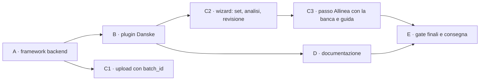

# Piano d'implementazione — report set BRIM e importer Danske (step 4–8)

**Stato**: ✅ via del coordinatore sulle superfici condivise; decisioni D-I1…D-I3 prese dal developer (2026-09-30). Il design è approvato (v5.3). **Le fasi A e B possono partire; C2 e C3 aspettano la voce 0 di K** (§7).
**Riferimenti**:
- [design v5.3](design-phase00BrimReportSets.md), che è la fonte di verità delle regole;
- [piano principale](plan-phase00BrimDanskeBank.prompt.md), step 4–8;
- [analisi degli export](analysis-phase00BrimDanskeBank.md).

**Workstream**: L · **Corsia**: porta 6156, `--data-dir /tmp/librefolio-r2-l` · **Coordinatore**: `c8328a01-f208-4ade-a352-0486d1f14de2`.

## 0. Regole di lavoro

- **Test rossi prima**: li scrive il test-author per ogni fase, e il codice arriva dopo. Un test verde prima della cura va spiegato.
- **Comandi**: `PIPENV_CUSTOM_VENV_NAME=LibreFolio-SAUMUTtc pipenv run python dev.py …`, nella corsia di L, un comando alla volta. Mai `./dev.py` da solo, mai `npx` (si usano i binari in `frontend/node_modules/.bin/`), mai installazioni.
- **Git**: solo comandi in lettura. Ogni fase si chiude con un `CHECKPOINT READY`: lo script lo prepara il coordinatore e lo lancia il developer. Dopo, FROZEN.
- **Dati**: nessun valore reale degli export. I campioni sono sintetici, e il controllo `/tmp/libreFolio_l_mockcheck.py` va esteso ai campioni.
- **Superfici condivise**: prima di toccarle, il via del coordinatore (§7).
- **Progressi**: dopo ogni passo si aggiorna questo file, con la data, `Note implementazione` e `Fuori pista`.

## 1. Fatti del codice che il piano usa (verificati il 2026-09-30)

| Area | Fatto | Dove |
|---|---|---|
| Storage | sidecar JSON accanto al file; `save_uploaded_file`, `_write_metadata_atomic`, `_build_file_info_from_metadata` (unico punto sidecar → `BRIMFileInfo`), `parse_is_stale` dalla versione del plugin | `backend/app/services/brim_provider.py:578`, `:523`, `:662`, `:680` |
| Nessun DB | i file BRIM non hanno tabelle né migrazioni: basta il sidecar | `models.py`, `alembic/versions` |
| Plugin | `BRIMProvider` e `to_plugin_info()`; registro con `get_compatible_plugins` ordinato per `detection_priority` (specifici ≥ 100, CSV generico 0–49) | `brim_provider.py:95`, `:394`; `provider_registry.py:374`, `:432` |
| Parse | `POST /files/{id}/parse`: auto-detect → `parse_file_offloaded` (process pool) → candidati asset → duplicati → `move_to_parsed` → risposta → `save_parse_result`. Con `BRIMParseError` o `ValueError` il file va in `failed` | `brokers.py:801–957`; `brim_parse_pool.py:85` |
| Upload | `broker_id: int = Form(...)`; i tre chiamanti usano `axiosInstance` con `FormData` | `brokers.py:570`; wizard `:2935`; `BrokerImportFilesModal.svelte:108`; `files/+page.svelte:495` |
| Salvataggio | l'editor salva con `POST /transactions/validate` e `/commit`, cioè `execute_batch`. `/brokers/{id}/transactions/bulk` non esiste (il design è corretto nella v5.3) | `backend/app/api/v1/transactions.py:62`, `:121`; `transaction_service.py:861` |
| Stato a una data | `_get_balances_before_date(broker_id, before_date)` restituisce cassa per valuta e quantità per asset, con somme SQL, **solo dal DB** | `transaction_service.py:439` |
| Tag | `Transaction.tags` è testo separato da virgole; il filtro esistente è `contains`, per sottostringa | `models.py:794`; `transaction_service.py:272` |
| Wizard | `StepId`/`STEP_DEFS` (`:126`), `stepIsActive` (`:2754`), `goNext`/`goBack` (`:2843`/`:2873`), `doParseAll` (`:3374`), `buildMergedTransactions` (`:716`), consegna `onImportBatch(buildFinalTxList(), …)` (`:1291`), tabella della revisione `step4Columns` (`:1780`) | `ImportWizardModal.svelte` |
| Righe prima dell'apertura | predicati puri già estratti (`isBeforeOpening`), da imitare per `H0` | `frontend/src/lib/utils/transactions/importRowState.ts` |
| Guida d'onboarding | l'import è una guida a step versionata: `IMPORT_GUIDE: 1`, con step da `import.upload` a `import.bulk`; catalogo e overlay nel frontend | `onboarding_service.py:33`, `:52–61`; `onboardingGuideCatalog.ts`; `OnboardingOverlayHost.svelte:498` |
| Test | `api brim` → `test_brim_api.py`; `external brim-providers` → `test_brim_providers.py`; `front tx-unit` è una **lista esplicita** di percorsi; gli E2E dell'import stanno in `frontend/e2e/transactions/tx-import-*.spec.ts`, registrati in `_frontend_transaction.py:530–555`. Un file di test nuovo va registrato: l'inventario segnala gli orfani | `scripts/test_runner/_backend_api.py:715`; `_backend_external.py:270`; `_frontend_transaction.py:10`, `:573`; `_inventory.py:361` |

## 2. Fasi e checkpoint

| Fase | Contenuto | Checkpoint e commit proposti | Complessità |
|---|---|---|---|
| A | schemi, contratto, storage, `batch_id` all'upload, API dei set, `H0`, gap-fix | A1 `feat(brim): add report-set schemas and storage` · A2 `feat(brim): add report-set preview and combine API` · A3 `feat(brim): add gap-fix endpoint` | alta |
| B | campioni sintetici, `broker_danske_bank`, suite generica per i plugin a set | B `feat(brim): add Danske Bank report-set importer` | alta |
| C1 | `batch_id` nei tre chiamanti | può entrare con A2 | bassa |
| C2 | passi ①–④: set, combine e analisi, righe prima di `H0` | C2 `feat(import): report sets in the import wizard` | molto alta |
| C3 | passo «Allinea con la banca», guida d'onboarding, badge nella pagina file | C3 `feat(import): align imports with bank truth` | alta |
| D | pagina utente Danske, registrazioni, guida sviluppatore | D `docs(brim): Danske Bank and report sets` | media |
| E | gate finali, CHANGELOG proposto, consegna | — | — |

## 3. Fase A — framework backend

### A1. Schemi, contratto e storage

**Schemi** (`backend/app/schemas/brim.py`). Sono tutti aggiuntivi, con un default, quindi i plugin di oggi non cambiano:
- `BRIMReportRole` (`code`, `required`, `multiple`, `extensions`, `description`, `max_history`, `must_cover`) e `BRIMPluginInfo.report_roles` (lista vuota di default);
- `BRIMMemberSummary` (ruolo, righe, copertura per asse). Il controllo sul deposito titoli (`mixed_accounts`) si fa in memoria: il numero non esce mai;
- `BRIMCheckpoint`: data, cassa per valuta, posizioni con ID finto, quantità, `exact`/`at_least` e costo per unità facoltativo, più le righe assorbite (quante e somma per valuta) e le evidenze. `BRIMVerification`: data e cassa;
- `BRIMParseOutput` e `BRIMParseResponse` guadagnano `checkpoints` e `verifications`; `BRIMParseResponse` anche `history_start`;
- `BRIMFileInfo` guadagna `batch_id`, `kind`, `derived_from`, `combined_into`, `combine_is_stale`;
- richieste e risposte dei set e del gap-fix (§3.3–§3.6 del design).

**Contratto** (`BRIMProvider`, tutto facoltativo):
- `report_roles` (vuoto di default);
- `detect_role`, `describe_member` e `describe_set`. **Precisazione del design**: la preview chiede al plugin segmenti e buchi dimostrati, senza combinare;
- `combine(members)`, **puro**, che restituisce una tabella: intestazione, righe e riepilogo;
- `settlement_lag` (5 giorni lavorativi per Danske) e `pre_checkpoint_policy` (`summarize` o `import`);
- l'eccezione `BRIMSetRequiredError`.

**Storage** (`brim_provider.py`):
- `batch_id` nel sidecar all'upload;
- `save_combined_file` scrive il CSV (UTF-8 con BOM, `;`) e il sidecar in modo atomico; aggiorna `combined_into` dei membri; riusa il combinato se membri e versione coincidono (D-S6);
- `combine_is_stale` nel builder del `BRIMFileInfo`.

La scrittura del CSV la fa il core, non il plugin, così il formato D-S2 è uno solo.

**Test rossi** (test-author):
- un **plugin finto a due ruoli**, solo per i test, registrato nel registro durante il test;
- casi: storage, riuso, file stale, `batch_id`, file eliminato (A17), schemi retrocompatibili (i plugin di oggi producono lo stesso output).

### A2. API dei set, `H0` e parse

- `POST /upload`: `batch_id: Optional[str] = Form(None)`, validato come UUID.
- **Servizio nuovo** `backend/app/services/brim_report_sets.py`:
  - `collect_members(broker_id, plugin_code, batch_id)`: membri originali di quel caricamento, broker e plugin;
  - `preview_set`: ruoli, `missing` con il periodo (da `must_cover` e `lag`), segmenti e buchi (`describe_set`), avvisi con codici;
  - `history_start(session, broker_id, plugin_code)`: D-S25. Filtro SQL `contains`, poi confronto esatto dei tag separati da virgole; per una `gap_fix` si conta il giorno dopo;
  - `combine_set`: riuso, oppure `plugin.combine` fuori dall'event loop, poi `save_combined_file`.
- **Route**: `POST /sets/preview` e `POST /sets/combine` (EDITOR sul broker).
- **Parse**:
  - un membro di un plugin a set, da solo, risponde 422 senza passare a `failed` (D-S4);
  - sul combinato: `checkpoints` e `verifications` dal plugin; `H0` dal DB; i checkpoint prima di `H0` si scartano, tranne quello d'apertura del primo import; nella risposta va `history_start`.
- **Test rossi**:
  - `test_brim_api.py` (`api brim`): upload con `batch_id`, preview e combine (permessi, 404, set incompleto, `missing`, file di due broker), membro da solo → 422 e stato `uploaded`, combinato → checkpoint;
  - `test_services/test_brim_report_sets.py`, **file nuovo** da registrare: `H0` nei casi D-S25, il combine puro, la regola M con il plugin finto.

### A3. Gap-fix

- **Stato di LibreFolio a una data**: `_get_balances_before_date(broker_id, C + 1 giorno)`, esteso con `exclude_tx_ids` per le cancellazioni in attesa nell'editor, più le somme in memoria di selezione, righe in attesa e proposte dei checkpoint precedenti.
  - Tocca `transaction_service.py`: **superficie da confermare** (§7).
  - Alternativa: una query nel servizio gap-fix, con le stesse somme.
- **Servizio nuovo** `backend/app/services/brim_gap_fix.py`:
  - checkpoint in ordine di data;
  - cassa: DEPOSIT o WITHDRAWAL oltre 0,01;
  - posizioni: con prova esatta, un ADJUSTMENT della differenza; con prova minima, solo la parte mancante;
  - costo: dal checkpoint se noto, altrimenti un todo bloccante nella risposta;
  - spiegazione: le righe assorbite che LibreFolio non ha, e la parte non spiegata;
  - verifiche: solo il confronto;
  - tag `import`, il codice del plugin e `gap_fix`.
- **Route**: `POST /gap-fix` (EDITOR sul broker). Non scrive nulla.
- **Test rossi**: `test_services/test_brim_gap_fix.py`, **file nuovo** da registrare, più i casi API in `test_brim_api.py`:
  - primo import, import sovrapposto (nessuna proposta), buco, tre segmenti in un import solo e in tre import;
  - prova minima già coperta, correzione negativa;
  - proposta tolta (D-S24), cancellazioni e righe in attesa nell'editor, verifica che non torna;
  - lo scenario 8 del design.

**Chiusura della fase A**:
- verdi `services brim-*`, le azioni nuove, `api brim` ed `external brim-providers` (i plugin di oggi restano invariati);
- lint e format secondo la skill `lint-format`;
- `git diff --check`.

## 4. Fase B — plugin Danske

### B1. Campioni sintetici

In `backend/app/services/brim_providers/sample_reports/`:
- **titoli**: un XLSX con date come testo, ` ` in un'intestazione e la colonna H senza nome;
- **cassa**: un CSV Latin-1 con `;`, LF, ordinato dal più recente;
- **varianti**: un secondo XLSX per il buco, e file che si sovrappongono.

Nomi e valori sono inventati, e il nome del CSV non contiene nessun IBAN. Il generatore resta fuori dal repository; nel README dei campioni vanno le righe che descrivono il contenuto. Il controllo dei valori va lanciato anche sui campioni.

Il campione copre ogni cella della tabella §3.4.2: coppie, righe autonome, orfani di bordo, `not_yet_settled`, `outside_cash_coverage`, `deferred`, `Tuotto`, scissione, eseguiti parziali identici, tipo sconosciuto, stato non contabilizzato, catena dei saldi.

### B2. Il plugin `broker_danske_bank.py`

- **Identità**: ruoli `custody` e `cash`, tutti e due obbligatori e `multiple`; priorità ≥ 100. `can_parse` riconosce i membri (intestazioni finlandesi) e i propri combinati.
- **`combine`**:
  - classificazione (S1);
  - segmenti e zone (§3.4.2);
  - abbinamento (S2–S4);
  - punti di verità (E1–E4, catena dei saldi, orfani di bordo);
  - regola M.

  Il motore di abbinamento resta dentro il plugin (D-S12).
- **`parse` del combinato**:
  - una coppia diventa BUY o SELL, con la cassa da `Summa`;
  - `Tuotto` diventa DIVIDEND con quantità 0;
  - le righe autonome diventano DEPOSIT, WITHDRAWAL, TAX o FEE, con una mappa esplicita delle etichette;
  - la scissione diventa rettifiche (D4);
  - lo split delle commissioni è un avviso con `split_hint: "trade_charges"` e il suggerimento per i titoli in euro;
  - notice in finlandese con i codici; evidenze da `lf_source`; ID finti da `FAKE_ASSET_ID_BASE`; tag `import` e `danske_bank`; descrizioni deterministiche (S8).

### B3. Test

- **Suite generica** `test_brim_providers.py` (del perimetro BRIM): supporto ai gruppi di campioni per i plugin con ruoli. Esegue combine e poi parse, e applica i controlli di sempre, compreso il contratto con il frontend.
- **Test di dettaglio**: `test_external/test_brim_danske_bank.py`, **file nuovo** da registrare, con le regole S1–S16 cella per cella, E1–E4, la catena dei saldi, il Latin-1 e l'intestazione HTML.
- **Registrazione del plugin**: auto-discovery, `docs_url` e icona, secondo la guida sviluppatore dei plugin BRIM.

## 5. Fase C — frontend

### C1. `batch_id` nei tre chiamanti

- **Wizard**: un UUID per sessione del passo ①, rigenerato al reset.
- **Pagina file**: un UUID per ogni conferma.
- **Modale del broker**: un UUID per ogni caricamento.

Tutti e tre con `crypto.randomUUID()`, come campo del `FormData`.

### C2. Passi ①–④

- **Modulo puro** `frontend/src/lib/utils/transactions/importReportSets.ts`, con i suoi `*.test.ts`:
  - raggruppa per caricamento, broker e plugin a set;
  - un file che un plugin a set riconosce entra nel suo set (A18);
  - dice se il set è completo e quali ruoli mancano.
- **① Carica**: finiti i caricamenti, per ogni set la preview; si vedono il raggruppamento e l'avviso del file mancante (§4.2).
- **② Seleziona file**:
  - componente `frontend/src/lib/components/transactions/import/ReportSetCard.svelte`: il set è una riga con la sua card;
  - «Carica il file mancante», con lo stesso `batch_id`, e «Escludi dall'import»;
  - Continua disattivato se un set spuntato è incompleto.
- **③ Analizza**: per un set, prima `sets/combine`, poi il parse del combinato. In `ParsedFileResult` c'è anche il set, per l'etichetta della riga; il dettaglio della riga ha la parte sull'abbinamento.
- **④ Revisione**: il predicato `isBeforeHistory` in `importRowState.ts`, accanto a `isBeforeOpening`. Le righe prima di `H0` restano nascoste dietro un contatore.

### C3. «Allinea con la banca», guida e pagina file

- **Il passo nuovo**:
  - `StepId` `gapFix`, dopo `review`. Sul pulsante finale della revisione il wizard chiama `POST /gap-fix`: se non c'è niente da mostrare consegna direttamente, altrimenti apre il passo;
  - il componente `GapFixStep.svelte` ha la stessa tabella della revisione, con le correzioni già selezionate;
  - il modulo puro `gapFixModel.ts` costruisce la richiesta (ID finti → asset risolti, righe in attesa, cancellazioni) e ricalcola quando l'utente torna indietro;
  - le correzioni selezionate, con i loro todo, si aggiungono a `onImportBatch`.
- **La guida d'onboarding** (skill `onboarding-guide`):
  - nuovo step `import.gapFix` fra `import.review` e `import.bulk`, nel backend e nel catalogo e overlay del frontend;
  - IMPORT_GUIDE passa alla **versione 2**, perché il contenuto cambia. Si aggiorna anche il testo di `import.select`, per i set;
  - l'ancora solo su elementi davvero visibili; E2E della guida su desktop e mobile.
- **Pagina file e modale del broker**: badge del set, del combinato e di «incompleto» (D-S9, nel pilota il minimo).
- **i18n**: `importWizard.reportSet.*` via `dev.py i18n`, in 4 lingue; le chiavi della guida nel loro namespace (§7).
- **`api sync`**: solo nella corsia di L.
- **Test**:
  - Vitest per i due moduli puri e per `isBeforeHistory`, aggiunti alla lista di `front tx-unit`;
  - Playwright `tx-import-report-set.spec.ts`, **spec nuovo** da registrare: set completo, set incompleto con «Carica il file mancante», combinato come riga unica, righe prima di `H0`, passo «Allinea» selezionato di default, consegna con `gap_fix`;
  - aggiornamento di `onboarding-guides.spec.ts`.

## 6. Fase D — documentazione (docs-writer, solo in inglese)

- **Pagina utente** `mkdocs_src/docs/user/transactions/import/danske_bank.en.md`: gli export, il caricarli insieme, la profondità, l'import annuale, il passo «Allinea con la banca», le commissioni, le scissioni e i limiti (§6 del design).
- **Registrazioni**, solo in aggiunta:
  - nav di `mkdocs.yml`;
  - card e riga nell'indice ×4;
  - `providers_list.md`;
  - README dei campioni.
- **Documentazione sviluppatore**:
  - in `brim_plugin_guide.md`, la sezione «Plugin multi-report»;
  - in `import-wizard.md`, i set e il passo nuovo;
  - la tabella dei flussi nella pagina utente delle preferenze, se lo step della guida cambia.
- **Verifica**: `mkdocs build` (strict) e `mkdocs check-links`.

## 7. Superfici condivise: da chiedere al coordinatore prima di toccarle

| Superficie | Perché | Esito del coordinatore (2026-09-30) |
|---|---|---|
| `scripts/test_runner/_backend_services.py` | azioni per `test_brim_report_sets.py` e `test_brim_gap_fix.py` | ✅ ma **solo subito dopo l'`add_test` di `brim-provider-base`** (`:1036` in `dev_release2`). D, Risk, A e F toccano altre righe (116–137, 927–975, 70, 82, 993) |
| `scripts/test_runner/_backend_external.py` | azione per `test_brim_danske_bank.py` | ✅ solo aggiunte |
| `scripts/test_runner/_frontend_transaction.py` | percorsi in più nella lista di `tx-unit` e nuova azione `tx-import-report-set` | ✅ solo aggiunte |
| `backend/app/services/transaction_service.py` | `exclude_tx_ids` nella somma a una data | ✅ nessun altro lo tocca; D-I3 deciso dal developer |
| `backend/app/services/onboarding_service.py`, `frontend/src/lib/features/onboarding/`, `components/onboarding/`, `onboarding-guides.spec.ts` | step `import.gapFix` e versione 2 | ✅ secondo la skill `onboarding-guide`; D-I1 deciso dal developer |
| i18n fuori da `importWizard.reportSet.*` | testi della guida | ✅ via `dev.py i18n`, 4 lingue |
| `FilesTable.svelte` | badge nella pagina file | ✅ solo nel tipo `brim` |
| documentazione: nav di `mkdocs.yml`, `user/transactions/import/index.{en,it,fr,es}.md`, `providers_list.md`, `brim_plugin_guide.md`, `import-wizard.md` | pagina e registrazioni | ✅ solo aggiunte. Il docs-writer scrive in inglese; le card negli indici it/fr/es sono una modifica minima, seguita da `translate-stamp`. **`mkdocs build` ritimbra `frontend/static/sw.js`, che non va committato** |
| **`ImportWizardModal.svelte` e `TransactionBulkModal.svelte`** (mancavano nella prima stesura) | card del set, analisi, passo nuovo | ⚠️ K ha modifiche non committate (audit XSS, voce 0): nel wizard le righe ~12, 1396–1525, 2016–2068, 2169–2182, 3454–3482 e 5064; nel bulk, righe sparse fra 69 e 3117. **C1**: nel wizard solo la riga del `FormData` (~`:2951`), che il coordinatore simula al checkpoint. **C2 e C3**: solo dopo che la voce 0 di K è entrata in `dev_release2` e la base di L è aggiornata, su segnale del coordinatore |

## 8. Rischi

| Rischio | Mitigazione |
|---|---|
| Gap-fix incoerente col motore: trasferimenti, coppie collegate, split | somme grezze di quantità e cassa, come `_get_balances_before_date`; casi di test con trasferimenti e rettifiche |
| Il wizard ha già più di 5 100 righe | la logica nuova sta in moduli puri e componenti nuovi; nel modale solo il collegamento |
| Tempi degli E2E (limite di 120 s del runner) | `front build --debug` prima; spec nuovo separato; niente attese fisse |
| La versione 2 della guida la ripropone a chi l'aveva già finita | è la regola della skill; va confermata dal developer (D-I1) |
| Il combinato contiene i nomi delle controparti del CSV | stesso posto e stessi permessi degli originali; nessun log dei valori |
| Campioni troppo simili ai dati reali | valori inventati; controllo automatico prima del checkpoint B |

## 9. Decisioni del developer

| # | Decisione | Esito (2026-09-30, ask_user) |
|---|---|---|
| D-I1 | Guida dell'import: step `import.gapFix` e versione 2, che la ripropone a chi l'aveva già finita | ✅ «Sì: nuovo step e versione 2, la guida ricompare anche a chi l'aveva finita» |
| D-I2 | Commit per fase | ✅ «Sì: un commit per fase, con C1 insieme ad A2»: A1, A2 con C1, A3, B, C2, C3, D |
| D-I3 | Stato a una data | ✅ il parametro facoltativo `exclude_tx_ids` in `transaction_service.py`, che è libero. Il developer: «mi aspetto che sfrutti la lista che hai già quando si apre l'import wizard». Il wizard riceve già dall'editor `pendingDeleteTxIds` (oggi serve a scartare i duplicati di righe in cancellazione, `pendingDeleteSet` in `importMerge.ts`) e `pendingCreateTransactions`. Il gap-fix riceve le stesse due liste: gli ID vanno a `exclude_tx_ids`, le righe non salvate si sommano in memoria |

## 10. Definition of done

- Un set Danske sintetico si importa dal wizard: un set per caricamento, la card, il combinato come riga unica, le esclusioni dichiarate, il passo «Allinea con la banca» con le correzioni giuste, la consegna all'editor.
- I plugin di oggi non cambiano: la suite `external brim-providers` è verde.
- Test rossi prima, poi verdi, per ogni fase; nessun test nuovo senza registrazione.
- Documentazione EN e registrazioni fatte; `mkdocs build` in strict verde.
- Nessun dato reale nel repository; porta 6156 libera; `CHECKPOINT READY` per ogni fase.

## 11. Avanzamento

- ✅ **Piano scritto il 2026-09-30.** Il coordinatore ha dato il via sulle superfici del §7, aggiungendo i due modali condivisi con K; il developer ha deciso D-I1…D-I3.
- ⏳ Prossimo passo: `CHECKPOINT READY` del journal, cioè design, piano principale e questo piano. Dopo il commit si parte con **A1**.
- ⏸ C2 e C3 aspettano la voce 0 di K in `dev_release2` e l'aggiornamento della base di L.

### A1 — ⏳ in corso (2026-09-30)

- Journal della pianificazione committato: `f6f0d2637`. Il coordinatore dà il via ad A1 e conferma che la base va bene così: fuori dal journal, `dev_release2` ha in più solo le righe del CHANGELOG.
- Test rossi affidati al test-author, sull'interfaccia fissata qui:
  - file nuovo `test_services/test_brim_report_sets.py`;
  - registrazione `services brim-report-sets`, subito dopo `brim-provider-base`;
  - venti punti: schemi, contratto, plugin finto a due ruoli, storage.
- La cura è pronta come script e si applica solo dopo la prova del rosso.

> **Note implementazione (2026-09-30)**:
> - **Rosso** (test-author): 107 test raccolti, 106 falliscono, ciascuno con «not implemented yet (BRIM report sets, phase A1)» sul pezzo che manca (31 pezzi distinti). Passa solo il controllo del plugin finto, che non usa niente di A1. `brim-provider-base` resta 34/34; `check-orphans` è pulito (224 file registrati).
> - **Cura**, applicata dopo il rosso:
>   - `schemas/brim.py`:
>     - `BRIMReportRole`, `BRIMCoverage`, `BRIMMemberSummary` (con `account_fingerprint` escluso dalla serializzazione);
>     - `BRIMSetShape`, `BRIMCombinedTable` (con le colonne obbligatorie `lf_row_kind` e `lf_source`), `BRIMDerivedRef`;
>     - i punti di verità: `BRIMTruthCash`, `BRIMTruthPosition`, `BRIMAbsorbed`, `BRIMCheckpoint`, `BRIMVerification`;
>     - i campi nuovi di `BRIMFileInfo`, `BRIMPluginInfo`, `BRIMParseOutput` e `BRIMParseResponse`;
>     - corretto il commento sull'endpoint `…/bulk`.
>   - `brim_provider.py`:
>     - `BRIMSetRequiredError` e il contratto dei set, con tutti i default;
>     - `batch_id` all'upload; `write_combined_csv`, `save_combined_file`, `find_reusable_combined`;
>     - `combine_is_stale`; `delete_file` mantiene i collegamenti.
> - **Verde**: `services brim-report-sets` 107/107; `brim-provider-base` 34, `brim-parse-error` 4, `brim-parse-pool` 8, `brim-parse-race` 6, `brim-create-transaction` 14, `brim-versioning` 5.
> - **Lint**: `dev.py lint` pulito. Black su `brim_provider.py` ha unito su una riga una mia condizione su più righe; ora i 4 file sono puliti.
>
> **⚠️ Fuori pista**: `external brim-providers` dava 4 rossi in `TestCreditAgricoleCanonicalCharacterization`. Il test congela l'elenco dei campi di `BRIMParseOutput` e l'intero output in un letterale, e le due chiavi nuove, vuote, `checkpoints` e `verifications`, lo facevano fallire. È un cambio di contratto voluto e il contenuto di CA non cambia: la riparazione (chiavi aggiunte al letterale, non filtrate) è affidata al test-author.
>
> **Note implementazione (2026-09-30), chiusura di A1**:
> - Test-author: +7 righe in `test_brim_providers.py`. Le due chiavi entrano nell'elenco congelato dei campi e nei due letterali `EXPECTED_OUTPUTS`, con un commento, così un punto di verità inatteso da CA fa ancora fallire il test.
> - `external brim-providers`: 537 passati, 2 saltati (gli stessi di prima, `TestWindows1252Invariance` sul campione Degiro).
> - `api brim`: 30 passati; le risposte con i campi nuovi funzionano.
> - `git diff --check` pulito; black pulito sui 5 file Python; porta 6156 libera.
>
> ### A1 — ✅ pronta per il checkpoint (2026-09-30)
