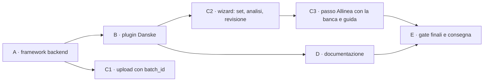

# Piano d'implementazione — report set BRIM e importer Danske (step 4–8)

**Stato**: ✅ via del coordinatore sulle superfici condivise; decisioni D-I1…D-I3 prese dal developer (2026-09-30). Il design è approvato (v5.3). **Le fasi A e B possono partire; C2 e C3 aspettano la voce 0 di K** (§7).
**Riferimenti**:
- [design v5.3](design-phase00BrimReportSets.md), che è la fonte di verità delle regole;
- [piano principale](plan-phase00BrimDanskeBank.prompt.md), step 4–8;
- [analisi degli export](analysis-phase00BrimDanskeBank.md).

**Workstream**: L · **Corsia**: porta 6156, `--data-dir /tmp/librefolio-r2-l` · **Coordinatore**: `c8328a01-f208-4ade-a352-0486d1f14de2`.

## 0. Regole di lavoro

- **Test rossi prima**: li scrive il test-author per ogni fase, e il codice arriva dopo. Un test verde prima della cura va spiegato.
- **Comandi**: `PIPENV_CUSTOM_VENV_NAME=LibreFolio-SAUMUTtc pipenv run python dev.py …`, nella corsia di L, un comando alla volta. Mai `./dev.py` da solo, mai `npx` (si usano i binari in `frontend/node_modules/.bin/`), mai installazioni.
- **Git**: solo comandi in lettura. Ogni fase si chiude con un `CHECKPOINT READY`: lo script lo prepara il coordinatore e lo lancia il developer. Dopo, FROZEN.
- **Dati**: nessun valore reale degli export. I campioni sono sintetici, e il controllo `/tmp/libreFolio_l_mockcheck.py` va esteso ai campioni.
- **Superfici condivise**: prima di toccarle, il via del coordinatore (§7).
- **Progressi**: dopo ogni passo si aggiorna questo file, con la data, `Note implementazione` e `Fuori pista`.

## 1. Fatti del codice che il piano usa (verificati il 2026-09-30)

| Area | Fatto | Dove |
|---|---|---|
| Storage | sidecar JSON accanto al file; `save_uploaded_file`, `_write_metadata_atomic`, `_build_file_info_from_metadata` (unico punto sidecar → `BRIMFileInfo`), `parse_is_stale` dalla versione del plugin | `backend/app/services/brim_provider.py:578`, `:523`, `:662`, `:680` |
| Nessun DB | i file BRIM non hanno tabelle né migrazioni: basta il sidecar | `models.py`, `alembic/versions` |
| Plugin | `BRIMProvider` e `to_plugin_info()`; registro con `get_compatible_plugins` ordinato per `detection_priority` (specifici ≥ 100, CSV generico 0–49) | `brim_provider.py:95`, `:394`; `provider_registry.py:374`, `:432` |
| Parse | `POST /files/{id}/parse`: auto-detect → `parse_file_offloaded` (process pool) → candidati asset → duplicati → `move_to_parsed` → risposta → `save_parse_result`. Con `BRIMParseError` o `ValueError` il file va in `failed` | `brokers.py:801–957`; `brim_parse_pool.py:85` |
| Upload | `broker_id: int = Form(...)`; i tre chiamanti usano `axiosInstance` con `FormData` | `brokers.py:570`; wizard `:2935`; `BrokerImportFilesModal.svelte:108`; `files/+page.svelte:495` |
| Salvataggio | l'editor salva con `POST /transactions/validate` e `/commit`, cioè `execute_batch`. `/brokers/{id}/transactions/bulk` non esiste (il design è corretto nella v5.3) | `backend/app/api/v1/transactions.py:62`, `:121`; `transaction_service.py:861` |
| Stato a una data | `_get_balances_before_date(broker_id, before_date)` restituisce cassa per valuta e quantità per asset, con somme SQL, **solo dal DB** | `transaction_service.py:439` |
| Tag | `Transaction.tags` è testo separato da virgole; il filtro esistente è `contains`, per sottostringa | `models.py:794`; `transaction_service.py:272` |
| Wizard | `StepId`/`STEP_DEFS` (`:126`), `stepIsActive` (`:2754`), `goNext`/`goBack` (`:2843`/`:2873`), `doParseAll` (`:3374`), `buildMergedTransactions` (`:716`), consegna `onImportBatch(buildFinalTxList(), …)` (`:1291`), tabella della revisione `step4Columns` (`:1780`) | `ImportWizardModal.svelte` |
| Righe prima dell'apertura | predicati puri già estratti (`isBeforeOpening`), da imitare per `H0` | `frontend/src/lib/utils/transactions/importRowState.ts` |
| Guida d'onboarding | l'import è una guida a step versionata: `IMPORT_GUIDE: 1`, con step da `import.upload` a `import.bulk`; catalogo e overlay nel frontend | `onboarding_service.py:33`, `:52–61`; `onboardingGuideCatalog.ts`; `OnboardingOverlayHost.svelte:498` |
| Test | `api brim` → `test_brim_api.py`; `external brim-providers` → `test_brim_providers.py`; `front tx-unit` è una **lista esplicita** di percorsi; gli E2E dell'import stanno in `frontend/e2e/transactions/tx-import-*.spec.ts`, registrati in `_frontend_transaction.py:530–555`. Un file di test nuovo va registrato: l'inventario segnala gli orfani | `scripts/test_runner/_backend_api.py:715`; `_backend_external.py:270`; `_frontend_transaction.py:10`, `:573`; `_inventory.py:361` |

## 2. Fasi e checkpoint

| Fase | Contenuto | Checkpoint e commit proposti | Complessità |
|---|---|---|---|
| A | schemi, contratto, storage, `batch_id` all'upload, API dei set, `H0`, gap-fix | A1 `feat(brim): add report-set schemas and storage` · A2 `feat(brim): add report-set preview and combine API` · A3 `feat(brim): add gap-fix endpoint` | alta |
| B | campioni sintetici, `broker_danske_bank`, suite generica per i plugin a set | B `feat(brim): add Danske Bank report-set importer` | alta |
| C1 | `batch_id` nei tre chiamanti | può entrare con A2 | bassa |
| C2 | passi ①–④: set, combine e analisi, righe prima di `H0` | C2 `feat(import): report sets in the import wizard` | molto alta |
| C3 | passo «Allinea con la banca», guida d'onboarding, badge nella pagina file | C3 `feat(import): align imports with bank truth` | alta |
| D | pagina utente Danske, registrazioni, guida sviluppatore | D `docs(brim): Danske Bank and report sets` | media |
| E | gate finali, CHANGELOG proposto, consegna | — | — |

## 3. Fase A — framework backend

### A1. Schemi, contratto e storage

**Schemi** (`backend/app/schemas/brim.py`). Sono tutti aggiuntivi, con un default, quindi i plugin di oggi non cambiano:
- `BRIMReportRole` (`code`, `required`, `multiple`, `extensions`, `description`, `max_history`, `must_cover`) e `BRIMPluginInfo.report_roles` (lista vuota di default);
- `BRIMMemberSummary` (ruolo, righe, copertura per asse). Il controllo sul deposito titoli (`mixed_accounts`) si fa in memoria: il numero non esce mai;
- `BRIMCheckpoint`: data, cassa per valuta, posizioni con ID finto, quantità, `exact`/`at_least` e costo per unità facoltativo, più le righe assorbite (quante e somma per valuta) e le evidenze. `BRIMVerification`: data e cassa;
- `BRIMParseOutput` e `BRIMParseResponse` guadagnano `checkpoints` e `verifications`; `BRIMParseResponse` anche `history_start`;
- `BRIMFileInfo` guadagna `batch_id`, `kind`, `derived_from`, `combined_into`, `combine_is_stale`;
- richieste e risposte dei set e del gap-fix (§3.3–§3.6 del design).

**Contratto** (`BRIMProvider`, tutto facoltativo):
- `report_roles` (vuoto di default);
- `detect_role`, `describe_member` e `describe_set`. **Precisazione del design**: la preview chiede al plugin segmenti e buchi dimostrati, senza combinare;
- `combine(members)`, **puro**, che restituisce una tabella: intestazione, righe e riepilogo;
- `settlement_lag` (5 giorni lavorativi per Danske) e `pre_checkpoint_policy` (`summarize` o `import`);
- l'eccezione `BRIMSetRequiredError`.

**Storage** (`brim_provider.py`):
- `batch_id` nel sidecar all'upload;
- `save_combined_file` scrive il CSV (UTF-8 con BOM, `;`) e il sidecar in modo atomico; aggiorna `combined_into` dei membri; riusa il combinato se membri e versione coincidono (D-S6);
- `combine_is_stale` nel builder del `BRIMFileInfo`.

La scrittura del CSV la fa il core, non il plugin, così il formato D-S2 è uno solo.

**Test rossi** (test-author):
- un **plugin finto a due ruoli**, solo per i test, registrato nel registro durante il test;
- casi: storage, riuso, file stale, `batch_id`, file eliminato (A17), schemi retrocompatibili (i plugin di oggi producono lo stesso output).

### A2. API dei set, `H0` e parse

- `POST /upload`: `batch_id: Optional[str] = Form(None)`, validato come UUID.
- **Servizio nuovo** `backend/app/services/brim_report_sets.py`:
  - `collect_members(broker_id, plugin_code, batch_id)`: membri originali di quel caricamento, broker e plugin;
  - `preview_set`: ruoli, `missing` con il periodo (da `must_cover` e `lag`), segmenti e buchi (`describe_set`), avvisi con codici;
  - `history_start(session, broker_id, plugin_code)`: D-S25. Filtro SQL `contains`, poi confronto esatto dei tag separati da virgole; per una `gap_fix` si conta il giorno dopo;
  - `combine_set`: riuso, oppure `plugin.combine` fuori dall'event loop, poi `save_combined_file`.
- **Route**: `POST /sets/preview` e `POST /sets/combine` (EDITOR sul broker).
- **Parse**:
  - un membro di un plugin a set, da solo, risponde 422 senza passare a `failed` (D-S4);
  - sul combinato: `checkpoints` e `verifications` dal plugin; `H0` dal DB; i checkpoint prima di `H0` si scartano, tranne quello d'apertura del primo import; nella risposta va `history_start`.
- **Test rossi**:
  - `test_brim_api.py` (`api brim`): upload con `batch_id`, preview e combine (permessi, 404, set incompleto, `missing`, file di due broker), membro da solo → 422 e stato `uploaded`, combinato → checkpoint;
  - `test_services/test_brim_report_sets.py`, **file nuovo** da registrare: `H0` nei casi D-S25, il combine puro, la regola M con il plugin finto.

### A3. Gap-fix

- **Stato di LibreFolio a una data**: `_get_balances_before_date(broker_id, C + 1 giorno)`, esteso con `exclude_tx_ids` per le cancellazioni in attesa nell'editor, più le somme in memoria di selezione, righe in attesa e proposte dei checkpoint precedenti.
  - Tocca `transaction_service.py`: **superficie da confermare** (§7).
  - Alternativa: una query nel servizio gap-fix, con le stesse somme.
- **Servizio nuovo** `backend/app/services/brim_gap_fix.py`:
  - checkpoint in ordine di data;
  - cassa: DEPOSIT o WITHDRAWAL oltre 0,01;
  - posizioni: con prova esatta, un ADJUSTMENT della differenza; con prova minima, solo la parte mancante;
  - costo: dal checkpoint se noto, altrimenti un todo bloccante nella risposta;
  - spiegazione: le righe assorbite che LibreFolio non ha, e la parte non spiegata;
  - verifiche: solo il confronto;
  - tag `import`, il codice del plugin e `gap_fix`.
- **Route**: `POST /gap-fix` (EDITOR sul broker). Non scrive nulla.
- **Test rossi**: `test_services/test_brim_gap_fix.py`, **file nuovo** da registrare, più i casi API in `test_brim_api.py`:
  - primo import, import sovrapposto (nessuna proposta), buco, tre segmenti in un import solo e in tre import;
  - prova minima già coperta, correzione negativa;
  - proposta tolta (D-S24), cancellazioni e righe in attesa nell'editor, verifica che non torna;
  - lo scenario 8 del design.

**Chiusura della fase A**:
- verdi `services brim-*`, le azioni nuove, `api brim` ed `external brim-providers` (i plugin di oggi restano invariati);
- lint e format secondo la skill `lint-format`;
- `git diff --check`.

## 4. Fase B — plugin Danske

### B0. Specifica di dettaglio (2026-09-30)

Scritta prima dei test rossi: è l'interfaccia che il test-author usa. Le regole vengono dal design v5.3 (§3.4, §3.8, §7.1); qui ci sono le scelte d'implementazione.

**Identità** (`broker_danske_bank.py`):
- codice `broker_danske_bank`, nome `Danske Bank`, estensioni `.xlsx` e `.csv`, priorità 100, versione `1.0.0`;
- `icon_url` `https://danskebank.fi/favicon.ico` (verificato: 200, `image/x-icon`, nessun `cross-origin-resource-policy`); `docs_url` `/mkdocs/user/transactions/import/danske-bank/` (la pagina arriva nella fase D);
- ruoli: `custody` (`.xlsx`, obbligatorio, multiplo, `P1Y`) e `cash` (`.csv`, obbligatorio, multiplo, `P5Y`, `must_cover="custody"`);
- `settlement_lag_business_days` 5; `pre_checkpoint_policy` `summarize`; `history_tag` `danske_bank` (il default);
- `test_file_pattern` `danske_bank`; **nuova proprietà di test del contratto**, `test_sample_sets`: una lista di set, ognuno `{ruolo: [nomi dei campioni]}`. Default `[]`, come `test_file_patterns`.

**Riconoscimento**:
- `can_parse`: l'XLSX con le intestazioni dei titoli (fino alla riga 20); il CSV con `Pvm`, `Saaja/Maksaja`, `Määrä`, `Saldo`, `Tila`; il proprio combinato (`lf_row_kind`, `lf_source`, `custody:Toimeksiantotyyppi`, `cash:Saaja/Maksaja`). Un file illeggibile dà `False`, mai un'eccezione.
- `detect_role`: `custody`, `cash`, oppure `None` (anche per il combinato).
- `describe_member`: righe di dati; copertura sull'asse `trade` (titoli) o `value` (cassa), dalle date valide; per i titoli l'impronta del deposito (sha256 dei valori di `Säilytystili`, solo in memoria). La cassa non ha impronta: se l'avesse, il framework la confronterebbe con quella dei titoli e segnerebbe sempre `mixed_accounts`.
- `parse` di un membro da solo: `BRIMSetRequiredError` (il core lo rifiuta già prima; questo è un secondo livello).

**Lettura**:
- XLSX: colonne per nome; `Palkkio sis. Alv` riconosciuta anche con ` ` o con uno spazio; la valuta è la prima colonna senza intestazione dopo `Summa` (in alternativa `Valuutta`), vuota = `EUR`, perché `Summa` è l'importo del conto cassa in euro. Date come testo `dd.mm.yyyy` **o** come celle data; numeri come celle **o** come testo finlandese (spazio o NBSP per le migliaia, virgola decimale, `−` Unicode).
- CSV: Latin-1 o cp1252 via `_open_text`; `;`; numeri finlandesi con gli spazi tolti (F4).
- Nel combinato le celle si copiano verbatim, tranne **`Säilytystili`, che non si copia**: serve solo al controllo dei depositi, fatto sui membri (minimizzazione del dato: è un numero di conto).

**Classi (S1)**:

| Ruolo | Riga | Classe |
|---|---|---|
| titoli | `Tila` ≠ `Toteutettu` | `excluded` (`status`) |
| titoli | `Rajakurssi`, `Päivän kurssi`, `Pikakauppa` | trade: acquisto se `Määrä` > 0 e `Summa` < 0, vendita se `Määrä` < 0 e `Summa` > 0; altrimenti `invalid` |
| titoli | `Tuotto` | provento: `Määrä` > 0 (azioni possedute), `Summa` > 0 |
| titoli | `Jakautuminen, vanha` / `uusi` | scissione: `Määrä` < 0 / > 0, senza `Summa` (con una `Summa` è `invalid`) |
| titoli | altro tipo | `excluded` (`unknown_type`) |
| titoli | date, nome o quantità mancanti; `Arvopäivä` < `Kauppapäivä` | `excluded` (`invalid`) |
| cassa | `Tila` ≠ `Toteutunut`, oppure etichetta `Varaus` | `excluded` (`status`), fuori dalla catena dei saldi |
| cassa | `Osto <nome>` con importo < 0; `Myynti <nome>` con importo > 0; `<nome> <10 cifre>` con importo > 0 | accoppiabile: acquisto, vendita, provento |
| cassa | `Nosto osakesäästötililtä` < 0 → WITHDRAWAL; `Vero osakesäästötililtä` < 0 → TAX; `Palvelumaksu…` < 0 → FEE; `Korko…` > 0 → INTEREST | autonoma |
| cassa | altra etichetta con importo > 0 | autonoma DEPOSIT (nell'OST entra solo denaro del titolare), con una notice informativa |
| cassa | altra etichetta con importo < 0, o una famiglia col segno sbagliato | `excluded` (`unknown_type`) |
| cassa | data o importo non validi, importo zero | `excluded` (`invalid`) |

**Regola M** (D-S28), per ruolo: i file si ordinano per fine copertura, inizio, ordine d'ingresso; per ogni giorno vince l'ultimo file che lo copre. Righe uguali: una sola copia. Giorni diversi: le righe dei file perdenti diventano `excluded` con il motivo nuovo **`superseded`** (I4: nessuna perdita silenziosa), e `describe_set` dà `overlap_mismatch`.

**Abbinamento (S2–S4)**: la chiave è data valuta, importo al centesimo, valuta e direzione (acquisto, vendita, provento). Il nome è un controllo: compatibile se, normalizzato (casefold, spazi), uno è prefisso dell'altro, perché il CSV tronca a ~24 caratteri. Per ogni chiave:
- una riga per parte: coppia, con la notice `name_mismatch` se i nomi non sono compatibili (S3);
- più righe: fra gli abbinamenti di cardinalità massima si prendono quelli col maggior numero di nomi compatibili. Se danno tutti le stesse transazioni (stessi titoli, quantità e prezzi abbinati), si abbina nell'ordine dei file; altrimenti tutte le righe della chiave sono `excluded` (`ambiguous`). Oltre 8 candidati per parte: `ambiguous`.

**Segmenti, buchi e zone**:
- segmenti grezzi: le coperture dei file dei titoli, fuse se si toccano o si sovrappongono;
- un buco fra due segmenti è **dimostrato** se una riga di cassa accoppiabile, rimasta senza controparte, ha la data valuta fra la fine del primo e l'inizio del secondo più il ritardo; altrimenti i due segmenti si fondono;
- checkpoint del segmento *i*: `C_i` = vigilia del suo inizio. Per il primo, `C_1` = vigilia di max(inizio dei titoli, prima riga contabilizzata del CSV) (A13);
- finestra *i*: da `C_i`+1 a min(`E_i` + 5 giorni lavorativi, `C_{i+1}`); bordo: da `C_i`+1 a `C_i` + 5 giorni lavorativi. Giorni lavorativi: lunedì–venerdì, senza festività.

| Riga | Esito |
|---|---|
| coppia | `pair` |
| cassa accoppiabile senza controparte | ≤ `C_1`: `summarized` in `C_1`; nel bordo di *i*: `summarized` in `C_i` (orfano di bordo); oltre `E_i` nella finestra: la zona successiva (`summarized` in `C_{i+1}`, oppure `deferred` dopo l'ultimo); altrove nella finestra: `excluded` (`no_counterpart`); nel buco: `summarized` in `C_{i+1}`; dopo: `deferred` |
| titoli trade o provento senza controparte | data valuta oltre l'ultima riga di cassa: `not_yet_settled`; prima della prima riga di cassa o in un buco della cassa: `outside_cash_coverage`; altrimenti `no_counterpart` |
| scissione | `standalone` |
| cassa autonoma | `standalone` in ogni zona |

Tutte le righe di cassa contabilizzate con data ≤ `C_1` hanno `lf_checkpoint` = `C_1` (assorbite dall'apertura), qualunque sia l'esito.

**Punti di verità**:
- **catena dei saldi**: le righe contabilizzate, dalla più vecchia, per giorno: saldo di fine giorno = saldo precedente + somma del giorno, e deve comparire fra i `Saldo` di quel giorno. Una rottura dà la notice `balance_chain_broken`, e la cassa dei checkpoint diventa una verifica alla stessa data;
- **cassa di `C_i`**: il saldo di fine giorno a `C_i` (o il saldo prima della prima riga, se il CSV comincia dopo), più la cassa degli orfani di bordo del segmento;
- **posizioni**, una per titolo e checkpoint:
  - E1 `Tuotto`: esatta se nessuna riga di movimento di quel titolo (trade o scissione) ha la data d'operazione nei 30 giorni prima, e nessuna riga di cassa `Osto`/`Myynti` compatibile senza controparte ha la data valuta in quei giorni; se quei giorni cadono prima del CSV, la prova si scarta;
  - E2 `Jakautuminen, vanha`: esatta; un altro movimento dello stesso titolo nello stesso giorno la scarta;
  - E3: la somma progressiva dei movimenti importati del titolo nel segmento; se il minimo è negativo, `at_least` il suo opposto;
  - E4: una riga dei titoli esclusa dello stesso titolo, tranne `superseded`, fra `C_i` e la prova scarta la prova;
  - la posizione a `C_i` è la quantità della prova meno i movimenti importati fra `C_i` e la prova; prove esatte discordanti si scartano tutte (`conflict`); se c'è una prova esatta, E3 non si usa;
- **verifica finale**: a min(fine dell'ultimo segmento, ultima riga del CSV), la cassa di fine giorno.

**Combinato**: le colonne del design (`lf_row_kind`, `lf_zone`, `lf_reason`, `lf_checkpoint`, `lf_source`, `lf_match_key`) più tre per i punti di verità, che il design non specificava:

| Colonna | Contenuto |
|---|---|
| `lf_value` | la cassa (`truth_cash`, `verification`) o la quantità a `C_i` (`truth_position`), col punto decimale |
| `lf_currency` | la valuta della cassa |
| `lf_proof` | `exact:E1`, `exact:E2`, `at_least:E3`, oppure `discarded:<regola>:<motivo>` (`recent_trades`, `window_not_covered`, `excluded_rows`, `same_day_movement`, `conflict`) |

- le righe di verità copiano la riga d'origine (la riga di cassa del saldo, la riga dei titoli della prova), con `lf_checkpoint` = la data del punto e `lf_zone` = `before` per l'apertura, `gap` per i checkpoint successivi;
- `lf_source`: `custody:12`, oppure `custody#2:12` quando il ruolo ha più file (l'ordine è quello di `derived_from`); una coppia è `custody:12 + cash:40`;
- ordinamento per data valuta, poi ruolo e riga d'origine; `summary` con i conteggi per esito, zona e motivo, i segmenti, i checkpoint e la catena dei saldi.

**Parse del combinato**:
- `pair`: BUY o SELL (quantità da `custody:Määrä`, cassa e data da `cash:Pvm`/`cash:Määrä`), oppure DIVIDEND (quantità 0); `standalone` di cassa: il tipo della famiglia; `standalone` dei titoli: ADJUSTMENT senza cassa;
- tag `import`, `danske_bank` (+ `demerger` per la scissione); descrizioni deterministiche: `<etichetta di cassa> (<Toimeksiantotyyppi>)` per le coppie, l'etichetta per le righe autonome, `<Toimeksiantotyyppi>: <titolo>` per la scissione;
- asset: un ID finto per nome del titolo, anche per i titoli che compaiono solo nelle prove; `extracted_name` = il nome dei titoli;
- todo:
  - ogni BUY e SELL: `danske_trade_charges_included`, avviso su `cash`, con `split_hint: "trade_charges"`, `cash`, `currency`, `compare_nominal: false`, `row` e i suggerimenti. Per un titolo in euro (0 ≤ differenza ≤ max(15 €, 1 % del lordo)) il suggerimento dà la differenza fra `Summa` e `Määrä × Kurssi`; altrimenti dice che il prezzo può essere in un'altra valuta. L'autore ha confermato che la commissione è inclusa in `Summa` (#26, 2026-09-28);
  - linee nuove della scissione: `demerger`, bloccante su `cost_basis_override`; linea vecchia: `demerger_old_leg`, avviso su `quantity` (limite A6);
- notice in finlandese (D7), con i codici: `excluded_<motivo>` (una per motivo, con le evidenze), `deferred_rows`, `name_mismatch`, `proof_discarded`, `balance_chain_broken`, `deposit_assumed`;
- checkpoint: il più vecchio è `opening`, gli altri `gap`; le righe assorbite sono quelle col suo `lf_checkpoint`; `opening_cash` = cassa del checkpoint − somma delle righe assorbite, solo per l'apertura;
- evidenze: le righe del combinato (`row_numbers` = righe del combinato), senza `Säilytystili`.

**Due correzioni del framework** (A2/A3, trovate scrivendo questa specifica):
1. `apply_history`, in un import successivo (quando `H0` viene dal database): i checkpoint tenuti perdono `opening_cash` e le righe assorbite prima di `H0`, che sono già rappresentate. Altrimenti la spiegazione del gap-fix sottrarrebbe di nuovo il saldo iniziale;
2. `combine_set`: un errore del plugin (`BRIMParseError` o `ValueError`) diventa `BRIMSetCombineFailed`, 422, e i membri restano `uploaded`, come dice il design. Oggi è un 500.

### B1. Campioni sintetici

In `backend/app/services/brim_providers/sample_reports/`:
- **titoli**: un XLSX con date come testo, ` ` in un'intestazione e la colonna H senza nome;
- **cassa**: un CSV Latin-1 con `;`, LF, ordinato dal più recente;
- **varianti**: un secondo XLSX per il buco, e file che si sovrappongono.

Nomi e valori sono inventati, e il nome del CSV non contiene nessun IBAN. Il generatore resta fuori dal repository; nel README dei campioni vanno le righe che descrivono il contenuto. Il controllo dei valori va lanciato anche sui campioni.

Il campione copre ogni cella della tabella §3.4.2: coppie, righe autonome, orfani di bordo, `not_yet_settled`, `outside_cash_coverage`, `deferred`, `Tuotto`, scissione, eseguiti parziali identici, tipo sconosciuto, stato non contabilizzato, catena dei saldi.

### B2. Il plugin `broker_danske_bank.py`

- **Identità**: ruoli `custody` e `cash`, tutti e due obbligatori e `multiple`; priorità ≥ 100. `can_parse` riconosce i membri (intestazioni finlandesi) e i propri combinati.
- **`combine`**:
  - classificazione (S1);
  - segmenti e zone (§3.4.2);
  - abbinamento (S2–S4);
  - punti di verità (E1–E4, catena dei saldi, orfani di bordo);
  - regola M.

  Il motore di abbinamento resta dentro il plugin (D-S12).
- **`parse` del combinato**:
  - una coppia diventa BUY o SELL, con la cassa da `Summa`;
  - `Tuotto` diventa DIVIDEND con quantità 0;
  - le righe autonome diventano DEPOSIT, WITHDRAWAL, TAX o FEE, con una mappa esplicita delle etichette;
  - la scissione diventa rettifiche (D4);
  - lo split delle commissioni è un avviso con `split_hint: "trade_charges"` e il suggerimento per i titoli in euro;
  - notice in finlandese con i codici; evidenze da `lf_source`; ID finti da `FAKE_ASSET_ID_BASE`; tag `import` e `danske_bank`; descrizioni deterministiche (S8).

### B3. Test

- **Suite generica** `test_brim_providers.py` (del perimetro BRIM): supporto ai gruppi di campioni per i plugin con ruoli. Esegue combine e poi parse, e applica i controlli di sempre, compreso il contratto con il frontend.
- **Test di dettaglio**: `test_external/test_brim_danske_bank.py`, **file nuovo** da registrare, con le regole S1–S16 cella per cella, E1–E4, la catena dei saldi, il Latin-1 e l'intestazione HTML.
- **Registrazione del plugin**: auto-discovery, `docs_url` e icona, secondo la guida sviluppatore dei plugin BRIM.

## 5. Fase C — frontend

### C1. `batch_id` nei tre chiamanti

- **Wizard**: un UUID per sessione del passo ①, rigenerato al reset.
- **Pagina file**: un UUID per ogni conferma.
- **Modale del broker**: un UUID per ogni caricamento.

Tutti e tre con `crypto.randomUUID()`, come campo del `FormData`.

### C2. Passi ①–④

- **Modulo puro** `frontend/src/lib/utils/transactions/importReportSets.ts`, con i suoi `*.test.ts`:
  - raggruppa per caricamento, broker e plugin a set;
  - un file che un plugin a set riconosce entra nel suo set (A18);
  - dice se il set è completo e quali ruoli mancano.
- **① Carica**: finiti i caricamenti, per ogni set la preview; si vedono il raggruppamento e l'avviso del file mancante (§4.2).
- **② Seleziona file**:
  - componente `frontend/src/lib/components/transactions/import/ReportSetCard.svelte`: il set è una riga con la sua card;
  - «Carica il file mancante», con lo stesso `batch_id`, e «Escludi dall'import»;
  - Continua disattivato se un set spuntato è incompleto.
- **③ Analizza**: per un set, prima `sets/combine`, poi il parse del combinato. In `ParsedFileResult` c'è anche il set, per l'etichetta della riga; il dettaglio della riga ha la parte sull'abbinamento.
- **④ Revisione**: il predicato `isBeforeHistory` in `importRowState.ts`, accanto a `isBeforeOpening`. Le righe prima di `H0` restano nascoste dietro un contatore.

### C3. «Allinea con la banca», guida e pagina file

- **Il passo nuovo**:
  - `StepId` `gapFix`, dopo `review`. Sul pulsante finale della revisione il wizard chiama `POST /gap-fix`: se non c'è niente da mostrare consegna direttamente, altrimenti apre il passo;
  - il componente `GapFixStep.svelte` ha la stessa tabella della revisione, con le correzioni già selezionate;
  - il modulo puro `gapFixModel.ts` costruisce la richiesta (ID finti → asset risolti, righe in attesa, cancellazioni) e ricalcola quando l'utente torna indietro;
  - le correzioni selezionate, con i loro todo, si aggiungono a `onImportBatch`.
- **La guida d'onboarding** (skill `onboarding-guide`):
  - nuovo step `import.gapFix` fra `import.review` e `import.bulk`, nel backend e nel catalogo e overlay del frontend;
  - IMPORT_GUIDE passa alla **versione 2**, perché il contenuto cambia. Si aggiorna anche il testo di `import.select`, per i set;
  - l'ancora solo su elementi davvero visibili; E2E della guida su desktop e mobile.
- **Pagina file e modale del broker**: badge del set, del combinato e di «incompleto» (D-S9, nel pilota il minimo).
- **i18n**: `importWizard.reportSet.*` via `dev.py i18n`, in 4 lingue; le chiavi della guida nel loro namespace (§7).
- **`api sync`**: solo nella corsia di L.
- **Test**:
  - Vitest per i due moduli puri e per `isBeforeHistory`, aggiunti alla lista di `front tx-unit`;
  - Playwright `tx-import-report-set.spec.ts`, **spec nuovo** da registrare: set completo, set incompleto con «Carica il file mancante», combinato come riga unica, righe prima di `H0`, passo «Allinea» selezionato di default, consegna con `gap_fix`;
  - aggiornamento di `onboarding-guides.spec.ts`.

## 6. Fase D — documentazione (docs-writer, solo in inglese)

- **Pagina utente** `mkdocs_src/docs/user/transactions/import/danske-bank.en.md`: gli export, il caricarli insieme, la profondità, l'import annuale, il passo «Allinea con la banca», le commissioni, le scissioni e i limiti (§6 del design). Il nome segue il `docs_url` del plugin (`/mkdocs/user/transactions/import/danske-bank/`), fissato dai test della fase B; nessun test controlla che la pagina esista.
- **Registrazioni**, solo in aggiunta:
  - nav di `mkdocs.yml`;
  - card e riga nell'indice ×4;
  - `providers_list.md`;
  - README dei campioni.
- **Documentazione sviluppatore**:
  - in `brim_plugin_guide.md`, la sezione «Plugin multi-report»;
  - in `brim_plugin_guide.md`, la regola che `provider_code` restituisce una **stringa letterale**, mai una costante o un'espressione, con il motivo: il test R13 (`optionFilter.test.ts`, in `front-utility core-unit`) e il runner (`_PROVIDER_CODE_RE` in `scripts/test_runner/_backend_external.py`) lo leggono dal sorgente, senza importare il modulo;
  - in `import-wizard.md`, i set e il passo nuovo;
  - la tabella dei flussi nella pagina utente delle preferenze, se lo step della guida cambia.
- **Verifica**: `mkdocs build` (strict) e `mkdocs check-links`.

## 7. Superfici condivise: da chiedere al coordinatore prima di toccarle

| Superficie | Perché | Esito del coordinatore (2026-09-30) |
|---|---|---|
| `scripts/test_runner/_backend_services.py` | azioni per `test_brim_report_sets.py` e `test_brim_gap_fix.py` | ✅ ma **solo subito dopo l'`add_test` di `brim-provider-base`** (`:1036` in `dev_release2`). D, Risk, A e F toccano altre righe (116–137, 927–975, 70, 82, 993) |
| `scripts/test_runner/_backend_external.py` | azione per `test_brim_danske_bank.py` | ✅ solo aggiunte |
| `scripts/test_runner/_frontend_transaction.py` | percorsi in più nella lista di `tx-unit` e nuova azione `tx-import-report-set` | ✅ solo aggiunte |
| `backend/app/services/transaction_service.py` | `exclude_tx_ids` nella somma a una data | ✅ nessun altro lo tocca; D-I3 deciso dal developer |
| `backend/app/services/onboarding_service.py`, `frontend/src/lib/features/onboarding/`, `components/onboarding/`, `onboarding-guides.spec.ts` | step `import.gapFix` e versione 2 | ✅ secondo la skill `onboarding-guide`; D-I1 deciso dal developer |
| i18n fuori da `importWizard.reportSet.*` | testi della guida | ✅ via `dev.py i18n`, 4 lingue |
| `FilesTable.svelte` | badge nella pagina file | ✅ solo nel tipo `brim` |
| documentazione: nav di `mkdocs.yml`, `user/transactions/import/index.{en,it,fr,es}.md`, `providers_list.md`, `brim_plugin_guide.md`, `import-wizard.md` | pagina e registrazioni | ✅ solo aggiunte. Il docs-writer scrive in inglese; le card negli indici it/fr/es sono una modifica minima, seguita da `translate-stamp`. **`mkdocs build` ritimbra `frontend/static/sw.js`, che non va committato** |
| **`ImportWizardModal.svelte` e `TransactionBulkModal.svelte`** (mancavano nella prima stesura) | card del set, analisi, passo nuovo | ⚠️ K ha modifiche non committate (audit XSS, voce 0): nel wizard le righe ~12, 1396–1525, 2016–2068, 2169–2182, 3454–3482 e 5064; nel bulk, righe sparse fra 69 e 3117. **C1**: nel wizard solo la riga del `FormData` (~`:2951`), che il coordinatore simula al checkpoint. **C2 e C3**: solo dopo che la voce 0 di K è entrata in `dev_release2` e la base di L è aggiornata, su segnale del coordinatore |

## 8. Rischi

| Rischio | Mitigazione |
|---|---|
| Gap-fix incoerente col motore: trasferimenti, coppie collegate, split | somme grezze di quantità e cassa, come `_get_balances_before_date`; casi di test con trasferimenti e rettifiche |
| Il wizard ha già più di 5 100 righe | la logica nuova sta in moduli puri e componenti nuovi; nel modale solo il collegamento |
| Tempi degli E2E (limite di 120 s del runner) | `front build --debug` prima; spec nuovo separato; niente attese fisse |
| La versione 2 della guida la ripropone a chi l'aveva già finita | è la regola della skill; va confermata dal developer (D-I1) |
| Il combinato contiene i nomi delle controparti del CSV | stesso posto e stessi permessi degli originali; nessun log dei valori |
| Campioni troppo simili ai dati reali | valori inventati; controllo automatico prima del checkpoint B |

## 9. Decisioni del developer

| # | Decisione | Esito (2026-09-30, ask_user) |
|---|---|---|
| D-I1 | Guida dell'import: step `import.gapFix` e versione 2, che la ripropone a chi l'aveva già finita | ✅ «Sì: nuovo step e versione 2, la guida ricompare anche a chi l'aveva finita» |
| D-I2 | Commit per fase | ✅ «Sì: un commit per fase, con C1 insieme ad A2»: A1, A2 con C1, A3, B, C2, C3, D |
| D-I3 | Stato a una data | ✅ il parametro facoltativo `exclude_tx_ids` in `transaction_service.py`, che è libero. Il developer: «mi aspetto che sfrutti la lista che hai già quando si apre l'import wizard». Il wizard riceve già dall'editor `pendingDeleteTxIds` (oggi serve a scartare i duplicati di righe in cancellazione, `pendingDeleteSet` in `importMerge.ts`) e `pendingCreateTransactions`. Il gap-fix riceve le stesse due liste: gli ID vanno a `exclude_tx_ids`, le righe non salvate si sommano in memoria |

## 10. Definition of done

- Un set Danske sintetico si importa dal wizard: un set per caricamento, la card, il combinato come riga unica, le esclusioni dichiarate, il passo «Allinea con la banca» con le correzioni giuste, la consegna all'editor.
- I plugin di oggi non cambiano: la suite `external brim-providers` è verde.
- Test rossi prima, poi verdi, per ogni fase; nessun test nuovo senza registrazione.
- Documentazione EN e registrazioni fatte; `mkdocs build` in strict verde.
- Nessun dato reale nel repository; porta 6156 libera; `CHECKPOINT READY` per ogni fase.

## 11. Avanzamento

- ✅ **Piano scritto il 2026-09-30.** Il coordinatore ha dato il via sulle superfici del §7, aggiungendo i due modali condivisi con K; il developer ha deciso D-I1…D-I3.
- ⏳ Prossimo passo: `CHECKPOINT READY` del journal, cioè design, piano principale e questo piano. Dopo il commit si parte con **A1**.
- ⏸ C2 e C3 aspettano la voce 0 di K in `dev_release2` e l'aggiornamento della base di L.

### A1 — ⏳ in corso (2026-09-30)

- Journal della pianificazione committato: `f6f0d2637`. Il coordinatore dà il via ad A1 e conferma che la base va bene così: fuori dal journal, `dev_release2` ha in più solo le righe del CHANGELOG.
- Test rossi affidati al test-author, sull'interfaccia fissata qui:
  - file nuovo `test_services/test_brim_report_sets.py`;
  - registrazione `services brim-report-sets`, subito dopo `brim-provider-base`;
  - venti punti: schemi, contratto, plugin finto a due ruoli, storage.
- La cura è pronta come script e si applica solo dopo la prova del rosso.

> **Note implementazione (2026-09-30)**:
> - **Rosso** (test-author): 107 test raccolti, 106 falliscono, ciascuno con «not implemented yet (BRIM report sets, phase A1)» sul pezzo che manca (31 pezzi distinti). Passa solo il controllo del plugin finto, che non usa niente di A1. `brim-provider-base` resta 34/34; `check-orphans` è pulito (224 file registrati).
> - **Cura**, applicata dopo il rosso:
>   - `schemas/brim.py`:
>     - `BRIMReportRole`, `BRIMCoverage`, `BRIMMemberSummary` (con `account_fingerprint` escluso dalla serializzazione);
>     - `BRIMSetShape`, `BRIMCombinedTable` (con le colonne obbligatorie `lf_row_kind` e `lf_source`), `BRIMDerivedRef`;
>     - i punti di verità: `BRIMTruthCash`, `BRIMTruthPosition`, `BRIMAbsorbed`, `BRIMCheckpoint`, `BRIMVerification`;
>     - i campi nuovi di `BRIMFileInfo`, `BRIMPluginInfo`, `BRIMParseOutput` e `BRIMParseResponse`;
>     - corretto il commento sull'endpoint `…/bulk`.
>   - `brim_provider.py`:
>     - `BRIMSetRequiredError` e il contratto dei set, con tutti i default;
>     - `batch_id` all'upload; `write_combined_csv`, `save_combined_file`, `find_reusable_combined`;
>     - `combine_is_stale`; `delete_file` mantiene i collegamenti.
> - **Verde**: `services brim-report-sets` 107/107; `brim-provider-base` 34, `brim-parse-error` 4, `brim-parse-pool` 8, `brim-parse-race` 6, `brim-create-transaction` 14, `brim-versioning` 5.
> - **Lint**: `dev.py lint` pulito. Black su `brim_provider.py` ha unito su una riga una mia condizione su più righe; ora i 4 file sono puliti.
>
> **⚠️ Fuori pista**: `external brim-providers` dava 4 rossi in `TestCreditAgricoleCanonicalCharacterization`. Il test congela l'elenco dei campi di `BRIMParseOutput` e l'intero output in un letterale, e le due chiavi nuove, vuote, `checkpoints` e `verifications`, lo facevano fallire. È un cambio di contratto voluto e il contenuto di CA non cambia: la riparazione (chiavi aggiunte al letterale, non filtrate) è affidata al test-author.
>
> **Note implementazione (2026-09-30), chiusura di A1**:
> - Test-author: +7 righe in `test_brim_providers.py`. Le due chiavi entrano nell'elenco congelato dei campi e nei due letterali `EXPECTED_OUTPUTS`, con un commento, così un punto di verità inatteso da CA fa ancora fallire il test.
> - `external brim-providers`: 537 passati, 2 saltati (gli stessi di prima, `TestWindows1252Invariance` sul campione Degiro).
> - `api brim`: 30 passati; le risposte con i campi nuovi funzionano.
> - `git diff --check` pulito; black pulito sui 5 file Python; porta 6156 libera.
>
> ### A1 — ✅ pronta per il checkpoint (2026-09-30)

**Commit di A1**: `b271faaa2` feat(brim): add report-set schemas and storage (5 file) e `796db3f61` docs(journal): record report-set phase A1.

### A2 e C1 — ⏳ in corso (2026-09-30)

- Il coordinatore dà il via ad A2 insieme a C1. Nel wizard, per C1, solo le righe dell'upload: lì ci sono le modifiche non committate di K.
- Test rossi affidati al test-author:
  - servizio `brim_report_sets.py`: membri, `H0` (D-S25), preview, combine, `ensure_parseable`, `apply_history`, con il plugin finto;
  - API: `batch_id` all'upload, `sets/preview` e `sets/combine` (permessi ed errori), parse invariato per i plugin a file singolo;
  - E2E di C1: `batch_id` condiviso dai file caricati insieme, nei tre punti di upload.
- Cura pronta come script, da applicare dopo il rosso.
- **Scelte d'implementazione**:
  - la logica dei set sta nel servizio, e le route sono sottili. Il parse gira in un process pool, quindi il plugin finto è affidabile solo nei test di servizio;
  - il contratto guadagna `history_tag`: di default il codice del plugin senza `broker_`, cioè il tag che i plugin esistenti già scrivono (per esempio `credit_agricole`).

> **⚠️ Fuori pista**: il piano diceva `crypto.randomUUID()`. Funziona solo in un contesto sicuro (HTTPS o localhost), mentre LibreFolio self-hosted può girare in HTTP su rete locale. Si usa invece `generateUUID()` di `$lib/utils/core/uuid`, che il wizard già usa e che su HTTP ripiega su `crypto.getRandomValues`.

> **Note implementazione (2026-09-30), A2 e C1**:
> - **Rosso** (test-author):
>   - `services brim-report-sets`: 102 falliti e 112 passati (i 107 di A1 e 5 verifiche del setup);
>   - `api brim`: 16 falliti e 32 passati;
>   - E2E di C1: 3 falliti, perché `batch_id` è nullo.
>
>   Tutti falliscono per un pezzo di A2 o di C1 che manca.
> - **Cura**:
>   - servizio `brim_report_sets.py`: errori con `status_code`, `get_set_plugin`, `collect_members`, `history_start` e `gap_fix_dates` con confronto esatto dei tag, `build_preview`, `preview_set`, `combine_set` con riuso e nome generato, `ensure_parseable`, `apply_history`;
>   - route `POST /sets/preview` e `/sets/combine` (EDITOR sul broker, prima di tutto il resto); `batch_id` all'upload, validato come UUID;
>   - parse: un membro da solo risponde 422 senza passare a `failed`; il combinato porta checkpoint, verifiche e `history_start`;
>   - `history_tag` e `read_combine_summary` in `brim_provider.py`;
>   - C1: `generateUUID()` nei tre punti di upload.
> - **Verde**:
>   - `services brim-report-sets` 214/214; `api brim` 48/48;
>   - E2E di C1 1/1 per ciascuno dei tre spec. Azioni complete: `front-broker detail` 29 passati e 1 fallito (GrowthChart, preesistente, di I); `front-utility files` 22/22; `front-transaction tx-import-upload` 9/9;
>   - `external brim-providers` 537 passati e 2 saltati; le 6 azioni BRIM dei servizi verdi;
>   - `dev.py lint` pulito; black pulito sui 6 file Python; prettier pulito sui 6 file frontend; `git diff --check` pulito; porta 6156 libera.
>
> **⚠️ Fuori pista**:
> - ruff segnalava `parse_file` troppo complessa (12 > 10) dopo le mie aggiunte. Invece di un `noqa`, la guardia dei set e i punti di verità sono passati in due funzioni d'appoggio (`_refuse_report_set_member`, `_report_set_truth`), più un costruttore dell'errore 422. Test rilanciati: servizio 214, API 48.
> - Il test-author, per i test rossi, ha lanciato `dev.py format`, che passa black su tutto il backend: ha riformattato 6 file estranei. Li ha ripristinati byte per byte e ha verificato gli altri con gli hash; nel worktree non ne resta traccia. **Regola**: black solo sui file toccati (`python -m black <file>`), mai `dev.py format`.

**Commit di A2 e C1**: `b70e9ecce` feat(brim): add report-set preview and combine API (12 file) e `f480b5688` docs(journal): record report-set phase A2. **Regola del coordinatore**: niente `dev.py format`; black e prettier solo sui file toccati; un file estraneo toccato per errore va segnalato, non ripristinato.

### A3 — ⏳ in corso (2026-09-30)

- Test rossi affidati al test-author:
  - `transaction_service` con `exclude_tx_ids` e `get_balances_at_end_of`;
  - schemi del gap-fix;
  - servizio nuovo `brim_gap_fix.py`, con i casi del §3.6 del design;
  - `POST /gap-fix`;
  - file nuovo `test_brim_gap_fix.py`, con l'azione `services brim-gap-fix` subito dopo `brim-report-sets`.
- **Scelte d'implementazione**:
  - il gap-fix accetta **qualsiasi plugin registrato**, perché usa solo `history_tag` e `provider_name`. Così le API si provano per davvero già ora, con `broker_generic_csv`, e in futuro un plugin a file singolo con un saldo progressivo potrà dichiarare un checkpoint (§3.6 del design, migrazione);
  - per la spiegazione della differenza (A12 del design) `BRIMAbsorbed` guadagna `rows` (data valuta, valuta, importo) e `opening_cash`, tutti e due con default. Una riga riassunta conta come «già in LibreFolio» se c'è una transazione con la stessa data, valuta e importo, e ogni transazione vale per una sola riga.
- Cura pronta come script, da applicare dopo il rosso.

> **Note implementazione (2026-09-30), A3**:
> - **Rosso** (test-author):
>   - `services brim-gap-fix` (file nuovo, 99 test): 93 falliti, ciascuno sul pezzo mancante; passano 6 verifiche del setup;
>   - `api brim`: 14 falliti nuovi e 48 passati;
>   - `services brim-report-sets` resta 214.
>
>   Il test-author ha controllato che i test si possano far passare con un'implementazione di riferimento, rimossa dopo (file identico, stesso sha256), e che colgano 13 mutanti.
> - **Cura**:
>   - `transaction_service.py`: `exclude_tx_ids` in `_get_balances_before_date` e il metodo pubblico `get_balances_at_end_of`;
>   - `schemas/brim.py`: `BRIMAbsorbedRow`; `rows` e `opening_cash` in `BRIMAbsorbed`; le 7 classi del gap-fix;
>   - servizio nuovo `brim_gap_fix.py` (`compute_gap_fix`);
>   - route `POST /gap-fix`, con EDITOR verificato prima di tutto.
> - **Verde**:
>   - `services brim-gap-fix` 99/99; `api brim` 62/62;
>   - regressioni: `services transaction` 68; `api tx-balance-walk` 9; `api transactions` 22 passati e 1 saltato; `services brim-report-sets` 214; le 6 azioni BRIM dei servizi; `external brim-providers` 537 passati e 2 saltati.
>
>   Il test saltato è `test_delete_linked_without_pair`: lo salta la fixture `test_asset_id` («Could not create test asset»), che dipende dallo stato del database della corsia, non dalla modifica.
> - `dev.py lint` pulito; black pulito sui 7 file Python toccati; `git diff --check` pulito; porta 6156 libera.

**Commit di A3**: `75579a13b` feat(brim): add gap-fix endpoint e `bf589e339` docs(journal): record report-set phase A3.

### B — ⏳ in corso (2026-09-30)

- Via del coordinatore alle 17:25. Nella regressione di B: `api transactions` dopo un `db populate --force` nella corsia, perché `test_delete_linked_without_pair` era stato saltato dalla fixture.
- **B0 scritta**: specifica di dettaglio nel §4, prima dei test rossi.

> **⚠️ Fuori pista**:
> - Il builder dei casi `TestWindows1252Invariance` decodifica ogni campione CSV come UTF-8 già alla raccolta: un campione Latin-1, come il CSV vero di Danske, farebbe fallire la raccolta dell'intero modulo. Il campione resta Latin-1, e il test-author adatta le due letture a `BRIMProvider._read_text`.
> - Due buchi del framework (A2/A3), trovati scrivendo la specifica: `apply_history` negli import successivi e gli errori del plugin in `combine_set` (B0, ultime righe). Si chiudono in B, con i test rossi prima.
> - L'autore ha già confermato che la commissione è inclusa in `Summa` (commento del 2026-09-28): la condizione di D-S17 è soddisfatta.

> **Note implementazione (2026-09-30), B1 e rosso di B**:
> - **B1, campioni**: cinque file sintetici in `sample_reports/`, con valori inventati:
>   - set principale: `danske_bank-custody.xlsx` e `danske_bank-cash.csv`;
>   - set col buco: `danske_bank-gap-custody-1.xlsx`, `danske_bank-gap-custody-2.xlsx` e `danske_bank-gap-cash.csv`.
>
>   Il generatore sta fuori dal repository (`/tmp/libreFolio_l_danske_samples.py`). Il controllo `/tmp/libreFolio_l_samplecheck.py` confronta ogni cella con gli export reali, ammettendo solo le parole di servizio della banca: 554 celle, 0 collisioni, dopo aver cambiato un prezzo che coincideva. Righe aggiunte al README dei campioni.
> - **Rosso** (test-author), nella corsia, un comando alla volta:
>   - `external brim-danske-bank` (file nuovo, registrato): 324 raccolti, 311 falliti, 13 passati. Tutti i falliti dicono «no BRIM plugin is registered as broker_danske_bank»; i 13 passati sono verifiche dei generatori di file dei test;
>   - `external brim-providers`: 562 raccolti, 17 falliti, 535 passati, 10 saltati. I falliti: 12 contratti col frontend sui due set, 1 guardia (nessun plugin dichiara set di campioni), 4 perché i campioni Danske non hanno ancora un plugin. Gli 8 saltati nuovi sono la classe dei plugin a set, senza plugin su cui girare;
>   - `services brim-report-sets`: 222 raccolti, 6 falliti: `test_sample_sets` (2), la correzione di `apply_history` (2), `BRIMSetCombineFailed` (2);
>   - `api brim`: 63 raccolti, 1 fallito, il flusso completo Danske, perché il backend di test non ha il plugin;
>   - `check-orphans` pulito: 226 file raggiungibili.
>
>   Nessun test verde prima è diventato rosso. Un'implementazione di riferimento del test-author, fuori dal repository, passa 323 dei 324 test Danske; l'unico mancante è `test_sample_sets` nella classe base.
> - **Scelte fissate dai test**, tutte coerenti con la B0:
>   - le commissioni di una vendita valgono lordo − |`Summa`|;
>   - E3 vale anche dopo le prove esatte scartate;
>   - con la catena dei saldi rotta, ogni checkpoint diventa una verifica alla sua data;
>   - `custody#1`/`custody#2` solo con più file;
>   - una coppia si ordina come riga dei titoli;
>   - gli orfani di bordo stanno nella zona `window`;
>   - ogni riga di cassa contabilizzata fino a `C_1` è assorbita, anche se esclusa;
>   - `cash` nel todo dello split ha due decimali (`"718.00"`).
>
> **⚠️ Fuori pista**:
> - Nei fatti che avevo dato al test-author il checkpoint del buco aveva due posizioni: le posizioni sono tre, perché la vendita di Kaamos del 2021-01-05 dà anche una prova E3. L'ho corretto io prima della cura.
> - `_backend_external.py` non è pulito per black già a HEAD (113 righe cambierebbero): il test-author non ci ha lanciato black, e le aggiunte seguono lo stile del file.
> - Prima della modifica di questa fase, il campione CSV Latin-1 impediva la raccolta dell'intero `test_brim_providers.py`: le 4 righe rosse sui campioni Danske erano già vere, solo invisibili.

> **Note implementazione (2026-09-30), cura e verde di B**:
> - **Cura**, applicata dopo il rosso con lo script `/tmp/libreFolio_l_b_patch.py`:
>   - `broker_danske_bank.py` (nuovo): ruoli, riconoscimento, lettura robusta, classi S1, regola M, abbinamento S2–S4, segmenti e zone, catena dei saldi, prove E1–E4, combinato con le colonne `lf_*`, parse del combinato con todo, notice finlandesi e punti di verità;
>   - `brim_provider.py`: la proprietà di test `test_sample_sets`, default `[]`;
>   - `brim_report_sets.py`: `BRIMSetCombineFailed` (422, `combine_failed`) intorno a `plugin.combine`; `apply_history` negli import successivi toglie `opening_cash` e le righe assorbite prima di `H0`.
> - **Verde**, nella corsia, un comando alla volta:
>   - `external brim-danske-bank` 324/324; `external brim-providers` 574 passati e 2 saltati (i due Degiro di sempre);
>   - `services brim-report-sets` 222/222; `api brim` 63/63, compreso il flusso Danske completo (caricamento, preview, combine e riuso, 422 sul membro da solo, parse, gap-fix);
>   - regressioni: `services brim-gap-fix` 99, `brim-provider-base` 34, `brim-parse-error` 4, `brim-parse-pool` 8, `brim-parse-race` 6, `brim-create-transaction` 14, `brim-versioning` 5;
>   - `db populate --force` nella corsia, poi `api transactions`: 22 passati e 1 saltato (vedi sotto);
>   - `check-orphans` pulito (226 file); `dev.py lint` pulito; black e ruff puliti sui file Python toccati; `git diff --check` pulito; porta 6156 libera.
> - **Controllo dei dati**: nessuna cella dei campioni coincide con gli export reali; il combinato non contiene `Säilytystili`, e l'impronta del deposito non esce da `describe_member`.
>
> **⚠️ Fuori pista**:
> - Un solo rosso dopo la cura: con più di 8 esecuzioni identiche per parte la bozza le abbinava lo stesso, perché controllava le righe identiche prima del limite. La B0 dice «oltre 8 candidati per parte: `ambiguous`», e così dice il test: ho invertito i due controlli.
> - `test_delete_linked_without_pair` resta saltato anche dopo `db populate --force`, e non dipende dal database: la fixture `test_asset_id` di `test_transactions_api.py` chiama `GET /assets` senza gli `asset_ids` obbligatori (422) e si aspetta 200 da `POST /assets`, che risponde 201 dal 2025-11-21. È un difetto del test, fuori dal perimetro di L: lo segnalo al coordinatore.
> - I codici dei todo Danske non hanno una chiave `importWizard.brimNotice.*`, come quelli degli altri plugin (oggi ne esiste una sola): il wizard mostra il messaggio finlandese del plugin (D7). Le chiavi localizzate, se servono, vanno in C2.
>
> ### B — ✅ pronta per il checkpoint (2026-09-30)

**Commit di B**: `fda716b46` feat(brim): add Danske Bank report-set importer (14 file) e `2cb29faf1` docs(journal): record report-set phase B.

### Aggiornamento della base e correzione R13 (2026-09-30 → 2026-10-01)

- **Merge di `dev_release2` (`8f18416df`) in L**: aperto dallo script del coordinatore. I 7 conflitti sono stati risolti con la versione di L: i 6 previsti più `test_brim_providers.py`, perché dal lato di `dev_release2` quei file avevano solo i cherry-pick dei commit di L. L'albero è `4873e78e1`, come atteso.
  - Validato a merge aperto, nella corsia 6156, un comando alla volta:
    - `front build --debug` ok; `front check` 3 errori, il pavimento, in file non di L; `component-unit` 2182; `check-orphans` pulito;
    - E2E: `files` 22, `tx-import-upload` 9, `front-broker detail` 29 passati e 1 fallito (`:713` GrowthChart, di I);
    - backend: le 8 suite BRIM dei servizi, `services transaction` 68, `brim-providers` 574 passati e 2 saltati, `brim-danske-bank` 324, `api brim` 63.
  - Commit del merge: `5d48c668f`, genitori `2cb29faf1` e `8f18416df`.

> **⚠️ Fuori pista**: `core-unit` è rosso dal commit di B (`fda716b46`), non dal merge. Fallisce `optionFilter.test.ts › ranking › on the real import-plugin list (R13)`, con «broker_danske_bank.py, provider_code: the return is not a string literal».
> - Il test legge i sorgenti di tutti i plugin BRIM e vuole che `provider_code` restituisca una stringa letterale; il plugin restituiva la costante `PROVIDER_CODE`.
> - Per la stessa ragione `_PROVIDER_CODE_RE` del runner (`_backend_external.py`) non trovava Danske: l'aiuto di `--providers`/`--exclude-providers` elencava 30 plugin BRIM invece di 31. Il filtro funzionava lo stesso, perché non ha `choices`.
> - **Lezione**: una modifica a un plugin BRIM fa girare anche `front-utility core-unit`. Una fase «solo backend» non lo è, se un test del frontend legge i sorgenti.

> **Note implementazione (2026-10-01), correzione R13**:
> - **Decisione del coordinatore**: chiudere il merge così com'è e correggere in un commit a sé. Lo script è `/tmp/libreFolio_l_fix_literal_code.py`: `return "broker_danske_bank"` e via la costante, che aveva lo stesso valore e non serviva altrove. Il comportamento non cambia.
> - **Prove**, nella corsia 6156, un comando alla volta:
>   - `front-utility core-unit`: 102 file e 2684 test passati. Prima la suite di R13 falliva intera e i suoi test non si contavano: 2681 passati e 3 saltati;
>   - `vitest` sul solo `optionFilter.test.ts`: 34/34, comprese le 3 prove di R13;
>   - aiuto del runner: 31 plugin BRIM, `broker_danske_bank` compreso;
>   - `external brim-danske-bank` 324/324; `external brim-providers` 574 passati e 2 saltati;
>   - ruff e black puliti sul file; `git diff --check` pulito; porta 6156 libera.
> - **Fase D** (§6 aggiornato):
>   - la guida sviluppatore dirà che `provider_code` è una stringa letterale, e perché;
>   - la pagina utente si chiamerà `danske-bank.en.md`, perché il `docs_url` del plugin è `…/danske-bank/` e le pagine prendono il nome dal `docs_url` (`credit_agricole/`, `generic-csv/`). Il piano diceva `danske_bank.en.md`.
