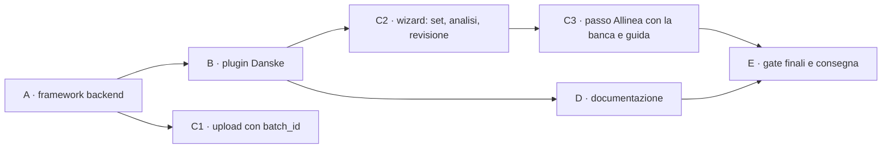

# Piano d'implementazione — report set BRIM e importer Danske (step 4–8)

**Stato**: ✅ **fasi A–E completate (2026-10-01)**, consegna finale al coordinatore. C3b annullata dal developer, A17 nel backlog (§11, E.0). Storia dello stato: via del coordinatore sulle superfici condivise; decisioni D-I1…D-I3 prese dal developer (2026-09-30), D-I1 rivisto il 2026-10-01; design approvato (v5.3).
**Riferimenti**:
- [design v5.3](design-phase00BrimReportSets.md), che è la fonte di verità delle regole;
- [piano principale](plan-phase00BrimDanskeBank.prompt.md), step 4–8;
- [analisi degli export](analysis-phase00BrimDanskeBank.md).

**Workstream**: L · **Corsia**: porta 6156, `--data-dir /tmp/librefolio-r2-l` · **Coordinatore**: `c8328a01-f208-4ade-a352-0486d1f14de2`.

## 0. Regole di lavoro

- **Test rossi prima**: li scrive il test-author per ogni fase, e il codice arriva dopo. Un test verde prima della cura va spiegato.
- **Comandi**: `PIPENV_CUSTOM_VENV_NAME=LibreFolio-SAUMUTtc pipenv run python dev.py …`, nella corsia di L, un comando alla volta. Mai `./dev.py` da solo, mai `npx` (si usano i binari in `frontend/node_modules/.bin/`), mai installazioni.
- **Git**: solo comandi in lettura. Ogni fase si chiude con un `CHECKPOINT READY`: lo script lo prepara il coordinatore e lo lancia il developer. Dopo, FROZEN.
- **Dati**: nessun valore reale degli export. I campioni sono sintetici, e il controllo `/tmp/libreFolio_l_mockcheck.py` va esteso ai campioni.
- **Superfici condivise**: prima di toccarle, il via del coordinatore (§7).
- **Progressi**: dopo ogni passo si aggiorna questo file, con la data, `Note implementazione` e `Fuori pista`.

## 1. Fatti del codice che il piano usa (verificati il 2026-09-30)

| Area | Fatto | Dove |
|---|---|---|
| Storage | sidecar JSON accanto al file; `save_uploaded_file`, `_write_metadata_atomic`, `_build_file_info_from_metadata` (unico punto sidecar → `BRIMFileInfo`), `parse_is_stale` dalla versione del plugin | `backend/app/services/brim_provider.py:578`, `:523`, `:662`, `:680` |
| Nessun DB | i file BRIM non hanno tabelle né migrazioni: basta il sidecar | `models.py`, `alembic/versions` |
| Plugin | `BRIMProvider` e `to_plugin_info()`; registro con `get_compatible_plugins` ordinato per `detection_priority` (specifici ≥ 100, CSV generico 0–49) | `brim_provider.py:95`, `:394`; `provider_registry.py:374`, `:432` |
| Parse | `POST /files/{id}/parse`: auto-detect → `parse_file_offloaded` (process pool) → candidati asset → duplicati → `move_to_parsed` → risposta → `save_parse_result`. Con `BRIMParseError` o `ValueError` il file va in `failed` | `brokers.py:801–957`; `brim_parse_pool.py:85` |
| Upload | `broker_id: int = Form(...)`; i tre chiamanti usano `axiosInstance` con `FormData` | `brokers.py:570`; wizard `:2935`; `BrokerImportFilesModal.svelte:108`; `files/+page.svelte:495` |
| Salvataggio | l'editor salva con `POST /transactions/validate` e `/commit`, cioè `execute_batch`. `/brokers/{id}/transactions/bulk` non esiste (il design è corretto nella v5.3) | `backend/app/api/v1/transactions.py:62`, `:121`; `transaction_service.py:861` |
| Stato a una data | `_get_balances_before_date(broker_id, before_date)` restituisce cassa per valuta e quantità per asset, con somme SQL, **solo dal DB** | `transaction_service.py:439` |
| Tag | `Transaction.tags` è testo separato da virgole; il filtro esistente è `contains`, per sottostringa | `models.py:794`; `transaction_service.py:272` |
| Wizard | `StepId`/`STEP_DEFS` (`:126`), `stepIsActive` (`:2754`), `goNext`/`goBack` (`:2843`/`:2873`), `doParseAll` (`:3374`), `buildMergedTransactions` (`:716`), consegna `onImportBatch(buildFinalTxList(), …)` (`:1291`), tabella della revisione `step4Columns` (`:1780`) | `ImportWizardModal.svelte` |
| Righe prima dell'apertura | predicati puri già estratti (`isBeforeOpening`), da imitare per `H0` | `frontend/src/lib/utils/transactions/importRowState.ts` |
| Guida d'onboarding | l'import è una guida a step versionata: `IMPORT_GUIDE: 1`, con step da `import.upload` a `import.bulk`; catalogo e overlay nel frontend | `onboarding_service.py:33`, `:52–61`; `onboardingGuideCatalog.ts`; `OnboardingOverlayHost.svelte:498` |
| Test | `api brim` → `test_brim_api.py`; `external brim-providers` → `test_brim_providers.py`; `front tx-unit` è una **lista esplicita** di percorsi; gli E2E dell'import stanno in `frontend/e2e/transactions/tx-import-*.spec.ts`, registrati in `_frontend_transaction.py:530–555`. Un file di test nuovo va registrato: l'inventario segnala gli orfani | `scripts/test_runner/_backend_api.py:715`; `_backend_external.py:270`; `_frontend_transaction.py:10`, `:573`; `_inventory.py:361` |

## 2. Fasi e checkpoint

| Fase | Contenuto | Checkpoint e commit proposti | Complessità |
|---|---|---|---|
| A | schemi, contratto, storage, `batch_id` all'upload, API dei set, `H0`, gap-fix | A1 `feat(brim): add report-set schemas and storage` · A2 `feat(brim): add report-set preview and combine API` · A3 `feat(brim): add gap-fix endpoint` | alta |
| B | campioni sintetici, `broker_danske_bank`, suite generica per i plugin a set | B `feat(brim): add Danske Bank report-set importer` | alta |
| C1 | `batch_id` nei tre chiamanti | può entrare con A2 | bassa |
| C2 | passi ①–④: set, combine e analisi, righe prima di `H0` | C2 `feat(import): report sets in the import wizard` | molto alta |
| C3 | passo «Allinea con la banca», guida d'onboarding, badge nella pagina file | C3 `feat(import): align imports with bank truth` | alta |
| D | pagina utente Danske, registrazioni, guida sviluppatore | D `docs(brim): Danske Bank and report sets` | media |
| E | gate finali, CHANGELOG proposto, consegna | — | — |

## 3. Fase A — framework backend

### A1. Schemi, contratto e storage

**Schemi** (`backend/app/schemas/brim.py`). Sono tutti aggiuntivi, con un default, quindi i plugin di oggi non cambiano:
- `BRIMReportRole` (`code`, `required`, `multiple`, `extensions`, `description`, `max_history`, `must_cover`) e `BRIMPluginInfo.report_roles` (lista vuota di default);
- `BRIMMemberSummary` (ruolo, righe, copertura per asse). Il controllo sul deposito titoli (`mixed_accounts`) si fa in memoria: il numero non esce mai;
- `BRIMCheckpoint`: data, cassa per valuta, posizioni con ID finto, quantità, `exact`/`at_least` e costo per unità facoltativo, più le righe assorbite (quante e somma per valuta) e le evidenze. `BRIMVerification`: data e cassa;
- `BRIMParseOutput` e `BRIMParseResponse` guadagnano `checkpoints` e `verifications`; `BRIMParseResponse` anche `history_start`;
- `BRIMFileInfo` guadagna `batch_id`, `kind`, `derived_from`, `combined_into`, `combine_is_stale`;
- richieste e risposte dei set e del gap-fix (§3.3–§3.6 del design).

**Contratto** (`BRIMProvider`, tutto facoltativo):
- `report_roles` (vuoto di default);
- `detect_role`, `describe_member` e `describe_set`. **Precisazione del design**: la preview chiede al plugin segmenti e buchi dimostrati, senza combinare;
- `combine(members)`, **puro**, che restituisce una tabella: intestazione, righe e riepilogo;
- `settlement_lag` (5 giorni lavorativi per Danske) e `pre_checkpoint_policy` (`summarize` o `import`);
- l'eccezione `BRIMSetRequiredError`.

**Storage** (`brim_provider.py`):
- `batch_id` nel sidecar all'upload;
- `save_combined_file` scrive il CSV (UTF-8 con BOM, `;`) e il sidecar in modo atomico; aggiorna `combined_into` dei membri; riusa il combinato se membri e versione coincidono (D-S6);
- `combine_is_stale` nel builder del `BRIMFileInfo`.

La scrittura del CSV la fa il core, non il plugin, così il formato D-S2 è uno solo.

**Test rossi** (test-author):
- un **plugin finto a due ruoli**, solo per i test, registrato nel registro durante il test;
- casi: storage, riuso, file stale, `batch_id`, file eliminato (A17), schemi retrocompatibili (i plugin di oggi producono lo stesso output).

### A2. API dei set, `H0` e parse

- `POST /upload`: `batch_id: Optional[str] = Form(None)`, validato come UUID.
- **Servizio nuovo** `backend/app/services/brim_report_sets.py`:
  - `collect_members(broker_id, plugin_code, batch_id)`: membri originali di quel caricamento, broker e plugin;
  - `preview_set`: ruoli, `missing` con il periodo (da `must_cover` e `lag`), segmenti e buchi (`describe_set`), avvisi con codici;
  - `history_start(session, broker_id, plugin_code)`: D-S25. Filtro SQL `contains`, poi confronto esatto dei tag separati da virgole; per una `gap_fix` si conta il giorno dopo;
  - `combine_set`: riuso, oppure `plugin.combine` fuori dall'event loop, poi `save_combined_file`.
- **Route**: `POST /sets/preview` e `POST /sets/combine` (EDITOR sul broker).
- **Parse**:
  - un membro di un plugin a set, da solo, risponde 422 senza passare a `failed` (D-S4);
  - sul combinato: `checkpoints` e `verifications` dal plugin; `H0` dal DB; i checkpoint prima di `H0` si scartano, tranne quello d'apertura del primo import; nella risposta va `history_start`.
- **Test rossi**:
  - `test_brim_api.py` (`api brim`): upload con `batch_id`, preview e combine (permessi, 404, set incompleto, `missing`, file di due broker), membro da solo → 422 e stato `uploaded`, combinato → checkpoint;
  - `test_services/test_brim_report_sets.py`, **file nuovo** da registrare: `H0` nei casi D-S25, il combine puro, la regola M con il plugin finto.

### A3. Gap-fix

- **Stato di LibreFolio a una data**: `_get_balances_before_date(broker_id, C + 1 giorno)`, esteso con `exclude_tx_ids` per le cancellazioni in attesa nell'editor, più le somme in memoria di selezione, righe in attesa e proposte dei checkpoint precedenti.
  - Tocca `transaction_service.py`: **superficie da confermare** (§7).
  - Alternativa: una query nel servizio gap-fix, con le stesse somme.
- **Servizio nuovo** `backend/app/services/brim_gap_fix.py`:
  - checkpoint in ordine di data;
  - cassa: DEPOSIT o WITHDRAWAL oltre 0,01;
  - posizioni: con prova esatta, un ADJUSTMENT della differenza; con prova minima, solo la parte mancante;
  - costo: dal checkpoint se noto, altrimenti un todo bloccante nella risposta;
  - spiegazione: le righe assorbite che LibreFolio non ha, e la parte non spiegata;
  - verifiche: solo il confronto;
  - tag `import`, il codice del plugin e `gap_fix`.
- **Route**: `POST /gap-fix` (EDITOR sul broker). Non scrive nulla.
- **Test rossi**: `test_services/test_brim_gap_fix.py`, **file nuovo** da registrare, più i casi API in `test_brim_api.py`:
  - primo import, import sovrapposto (nessuna proposta), buco, tre segmenti in un import solo e in tre import;
  - prova minima già coperta, correzione negativa;
  - proposta tolta (D-S24), cancellazioni e righe in attesa nell'editor, verifica che non torna;
  - lo scenario 8 del design.

**Chiusura della fase A**:
- verdi `services brim-*`, le azioni nuove, `api brim` ed `external brim-providers` (i plugin di oggi restano invariati);
- lint e format secondo la skill `lint-format`;
- `git diff --check`.

## 4. Fase B — plugin Danske

### B0. Specifica di dettaglio (2026-09-30)

Scritta prima dei test rossi: è l'interfaccia che il test-author usa. Le regole vengono dal design v5.3 (§3.4, §3.8, §7.1); qui ci sono le scelte d'implementazione.

**Identità** (`broker_danske_bank.py`):
- codice `broker_danske_bank`, nome `Danske Bank`, estensioni `.xlsx` e `.csv`, priorità 100, versione `1.0.0`;
- `icon_url` `https://danskebank.fi/favicon.ico` (verificato: 200, `image/x-icon`, nessun `cross-origin-resource-policy`); `docs_url` `/mkdocs/user/transactions/import/danske-bank/` (la pagina arriva nella fase D);
- ruoli: `custody` (`.xlsx`, obbligatorio, multiplo, `P1Y`) e `cash` (`.csv`, obbligatorio, multiplo, `P5Y`, `must_cover="custody"`);
- `settlement_lag_business_days` 5; `pre_checkpoint_policy` `summarize`; `history_tag` `danske_bank` (il default);
- `test_file_pattern` `danske_bank`; **nuova proprietà di test del contratto**, `test_sample_sets`: una lista di set, ognuno `{ruolo: [nomi dei campioni]}`. Default `[]`, come `test_file_patterns`.

**Riconoscimento**:
- `can_parse`: l'XLSX con le intestazioni dei titoli (fino alla riga 20); il CSV con `Pvm`, `Saaja/Maksaja`, `Määrä`, `Saldo`, `Tila`; il proprio combinato (`lf_row_kind`, `lf_source`, `custody:Toimeksiantotyyppi`, `cash:Saaja/Maksaja`). Un file illeggibile dà `False`, mai un'eccezione.
- `detect_role`: `custody`, `cash`, oppure `None` (anche per il combinato).
- `describe_member`: righe di dati; copertura sull'asse `trade` (titoli) o `value` (cassa), dalle date valide; per i titoli l'impronta del deposito (sha256 dei valori di `Säilytystili`, solo in memoria). La cassa non ha impronta: se l'avesse, il framework la confronterebbe con quella dei titoli e segnerebbe sempre `mixed_accounts`.
- `parse` di un membro da solo: `BRIMSetRequiredError` (il core lo rifiuta già prima; questo è un secondo livello).

**Lettura**:
- XLSX: colonne per nome; `Palkkio sis. Alv` riconosciuta anche con ` ` o con uno spazio; la valuta è la prima colonna senza intestazione dopo `Summa` (in alternativa `Valuutta`), vuota = `EUR`, perché `Summa` è l'importo del conto cassa in euro. Date come testo `dd.mm.yyyy` **o** come celle data; numeri come celle **o** come testo finlandese (spazio o NBSP per le migliaia, virgola decimale, `−` Unicode).
- CSV: Latin-1 o cp1252 via `_open_text`; `;`; numeri finlandesi con gli spazi tolti (F4).
- Nel combinato le celle si copiano verbatim, tranne **`Säilytystili`, che non si copia**: serve solo al controllo dei depositi, fatto sui membri (minimizzazione del dato: è un numero di conto).

**Classi (S1)**:

| Ruolo | Riga | Classe |
|---|---|---|
| titoli | `Tila` ≠ `Toteutettu` | `excluded` (`status`) |
| titoli | `Rajakurssi`, `Päivän kurssi`, `Pikakauppa` | trade: acquisto se `Määrä` > 0 e `Summa` < 0, vendita se `Määrä` < 0 e `Summa` > 0; altrimenti `invalid` |
| titoli | `Tuotto` | provento: `Määrä` > 0 (azioni possedute), `Summa` > 0 |
| titoli | `Jakautuminen, vanha` / `uusi` | scissione: `Määrä` < 0 / > 0, senza `Summa` (con una `Summa` è `invalid`) |
| titoli | altro tipo | `excluded` (`unknown_type`) |
| titoli | date, nome o quantità mancanti; `Arvopäivä` < `Kauppapäivä` | `excluded` (`invalid`) |
| cassa | `Tila` ≠ `Toteutunut`, oppure etichetta `Varaus` | `excluded` (`status`), fuori dalla catena dei saldi |
| cassa | `Osto <nome>` con importo < 0; `Myynti <nome>` con importo > 0; `<nome> <10 cifre>` con importo > 0 | accoppiabile: acquisto, vendita, provento |
| cassa | `Nosto osakesäästötililtä` < 0 → WITHDRAWAL; `Vero osakesäästötililtä` < 0 → TAX; `Palvelumaksu…` < 0 → FEE; `Korko…` > 0 → INTEREST | autonoma |
| cassa | altra etichetta con importo > 0 | autonoma DEPOSIT (nell'OST entra solo denaro del titolare), con una notice informativa |
| cassa | altra etichetta con importo < 0, o una famiglia col segno sbagliato | `excluded` (`unknown_type`) |
| cassa | data o importo non validi, importo zero | `excluded` (`invalid`) |

**Regola M** (D-S28), per ruolo: i file si ordinano per fine copertura, inizio, ordine d'ingresso; per ogni giorno vince l'ultimo file che lo copre. Righe uguali: una sola copia. Giorni diversi: le righe dei file perdenti diventano `excluded` con il motivo nuovo **`superseded`** (I4: nessuna perdita silenziosa), e `describe_set` dà `overlap_mismatch`.

**Abbinamento (S2–S4)**: la chiave è data valuta, importo al centesimo, valuta e direzione (acquisto, vendita, provento). Il nome è un controllo: compatibile se, normalizzato (casefold, spazi), uno è prefisso dell'altro, perché il CSV tronca a ~24 caratteri. Per ogni chiave:
- una riga per parte: coppia, con la notice `name_mismatch` se i nomi non sono compatibili (S3);
- più righe: fra gli abbinamenti di cardinalità massima si prendono quelli col maggior numero di nomi compatibili. Se danno tutti le stesse transazioni (stessi titoli, quantità e prezzi abbinati), si abbina nell'ordine dei file; altrimenti tutte le righe della chiave sono `excluded` (`ambiguous`). Oltre 8 candidati per parte: `ambiguous`.

**Segmenti, buchi e zone**:
- segmenti grezzi: le coperture dei file dei titoli, fuse se si toccano o si sovrappongono;
- un buco fra due segmenti è **dimostrato** se una riga di cassa accoppiabile, rimasta senza controparte, ha la data valuta fra la fine del primo e l'inizio del secondo più il ritardo; altrimenti i due segmenti si fondono;
- checkpoint del segmento *i*: `C_i` = vigilia del suo inizio. Per il primo, `C_1` = vigilia di max(inizio dei titoli, prima riga contabilizzata del CSV) (A13);
- finestra *i*: da `C_i`+1 a min(`E_i` + 5 giorni lavorativi, `C_{i+1}`); bordo: da `C_i`+1 a `C_i` + 5 giorni lavorativi. Giorni lavorativi: lunedì–venerdì, senza festività.

| Riga | Esito |
|---|---|
| coppia | `pair` |
| cassa accoppiabile senza controparte | ≤ `C_1`: `summarized` in `C_1`; nel bordo di *i*: `summarized` in `C_i` (orfano di bordo); oltre `E_i` nella finestra: la zona successiva (`summarized` in `C_{i+1}`, oppure `deferred` dopo l'ultimo); altrove nella finestra: `excluded` (`no_counterpart`); nel buco: `summarized` in `C_{i+1}`; dopo: `deferred` |
| titoli trade o provento senza controparte | data valuta oltre l'ultima riga di cassa: `not_yet_settled`; prima della prima riga di cassa o in un buco della cassa: `outside_cash_coverage`; altrimenti `no_counterpart` |
| scissione | `standalone` |
| cassa autonoma | `standalone` in ogni zona |

Tutte le righe di cassa contabilizzate con data ≤ `C_1` hanno `lf_checkpoint` = `C_1` (assorbite dall'apertura), qualunque sia l'esito.

**Punti di verità**:
- **catena dei saldi**: le righe contabilizzate, dalla più vecchia, per giorno: saldo di fine giorno = saldo precedente + somma del giorno, e deve comparire fra i `Saldo` di quel giorno. Una rottura dà la notice `balance_chain_broken`, e la cassa dei checkpoint diventa una verifica alla stessa data;
- **cassa di `C_i`**: il saldo di fine giorno a `C_i` (o il saldo prima della prima riga, se il CSV comincia dopo), più la cassa degli orfani di bordo del segmento;
- **posizioni**, una per titolo e checkpoint:
  - E1 `Tuotto`: esatta se nessuna riga di movimento di quel titolo (trade o scissione) ha la data d'operazione nei 30 giorni prima, e nessuna riga di cassa `Osto`/`Myynti` compatibile senza controparte ha la data valuta in quei giorni; se quei giorni cadono prima del CSV, la prova si scarta;
  - E2 `Jakautuminen, vanha`: esatta; un altro movimento dello stesso titolo nello stesso giorno la scarta;
  - E3: la somma progressiva dei movimenti importati del titolo nel segmento; se il minimo è negativo, `at_least` il suo opposto;
  - E4: una riga dei titoli esclusa dello stesso titolo, tranne `superseded`, fra `C_i` e la prova scarta la prova;
  - la posizione a `C_i` è la quantità della prova meno i movimenti importati fra `C_i` e la prova; prove esatte discordanti si scartano tutte (`conflict`); se c'è una prova esatta, E3 non si usa;
- **verifica finale**: a min(fine dell'ultimo segmento, ultima riga del CSV), la cassa di fine giorno.

**Combinato**: le colonne del design (`lf_row_kind`, `lf_zone`, `lf_reason`, `lf_checkpoint`, `lf_source`, `lf_match_key`) più tre per i punti di verità, che il design non specificava:

| Colonna | Contenuto |
|---|---|
| `lf_value` | la cassa (`truth_cash`, `verification`) o la quantità a `C_i` (`truth_position`), col punto decimale |
| `lf_currency` | la valuta della cassa |
| `lf_proof` | `exact:E1`, `exact:E2`, `at_least:E3`, oppure `discarded:<regola>:<motivo>` (`recent_trades`, `window_not_covered`, `excluded_rows`, `same_day_movement`, `conflict`) |

- le righe di verità copiano la riga d'origine (la riga di cassa del saldo, la riga dei titoli della prova), con `lf_checkpoint` = la data del punto e `lf_zone` = `before` per l'apertura, `gap` per i checkpoint successivi;
- `lf_source`: `custody:12`, oppure `custody#2:12` quando il ruolo ha più file (l'ordine è quello di `derived_from`); una coppia è `custody:12 + cash:40`;
- ordinamento per data valuta, poi ruolo e riga d'origine; `summary` con i conteggi per esito, zona e motivo, i segmenti, i checkpoint e la catena dei saldi.

**Parse del combinato**:
- `pair`: BUY o SELL (quantità da `custody:Määrä`, cassa e data da `cash:Pvm`/`cash:Määrä`), oppure DIVIDEND (quantità 0); `standalone` di cassa: il tipo della famiglia; `standalone` dei titoli: ADJUSTMENT senza cassa;
- tag `import`, `danske_bank` (+ `demerger` per la scissione); descrizioni deterministiche: `<etichetta di cassa> (<Toimeksiantotyyppi>)` per le coppie, l'etichetta per le righe autonome, `<Toimeksiantotyyppi>: <titolo>` per la scissione;
- asset: un ID finto per nome del titolo, anche per i titoli che compaiono solo nelle prove; `extracted_name` = il nome dei titoli;
- todo:
  - ogni BUY e SELL: `danske_trade_charges_included`, avviso su `cash`, con `split_hint: "trade_charges"`, `cash`, `currency`, `compare_nominal: false`, `row` e i suggerimenti. Per un titolo in euro (0 ≤ differenza ≤ max(15 €, 1 % del lordo)) il suggerimento dà la differenza fra `Summa` e `Määrä × Kurssi`; altrimenti dice che il prezzo può essere in un'altra valuta. L'autore ha confermato che la commissione è inclusa in `Summa` (#26, 2026-09-28);
  - linee nuove della scissione: `demerger`, bloccante su `cost_basis_override`; linea vecchia: `demerger_old_leg`, avviso su `quantity` (limite A6);
- notice in finlandese (D7), con i codici: `excluded_<motivo>` (una per motivo, con le evidenze), `deferred_rows`, `name_mismatch`, `proof_discarded`, `balance_chain_broken`, `deposit_assumed`;
- checkpoint: il più vecchio è `opening`, gli altri `gap`; le righe assorbite sono quelle col suo `lf_checkpoint`; `opening_cash` = cassa del checkpoint − somma delle righe assorbite, solo per l'apertura;
- evidenze: le righe del combinato (`row_numbers` = righe del combinato), senza `Säilytystili`.

**Due correzioni del framework** (A2/A3, trovate scrivendo questa specifica):
1. `apply_history`, in un import successivo (quando `H0` viene dal database): i checkpoint tenuti perdono `opening_cash` e le righe assorbite prima di `H0`, che sono già rappresentate. Altrimenti la spiegazione del gap-fix sottrarrebbe di nuovo il saldo iniziale;
2. `combine_set`: un errore del plugin (`BRIMParseError` o `ValueError`) diventa `BRIMSetCombineFailed`, 422, e i membri restano `uploaded`, come dice il design. Oggi è un 500.

### B1. Campioni sintetici

In `backend/app/services/brim_providers/sample_reports/`:
- **titoli**: un XLSX con date come testo, ` ` in un'intestazione e la colonna H senza nome;
- **cassa**: un CSV Latin-1 con `;`, LF, ordinato dal più recente;
- **varianti**: un secondo XLSX per il buco, e file che si sovrappongono.

Nomi e valori sono inventati, e il nome del CSV non contiene nessun IBAN. Il generatore resta fuori dal repository; nel README dei campioni vanno le righe che descrivono il contenuto. Il controllo dei valori va lanciato anche sui campioni.

Il campione copre ogni cella della tabella §3.4.2: coppie, righe autonome, orfani di bordo, `not_yet_settled`, `outside_cash_coverage`, `deferred`, `Tuotto`, scissione, eseguiti parziali identici, tipo sconosciuto, stato non contabilizzato, catena dei saldi.

### B2. Il plugin `broker_danske_bank.py`

- **Identità**: ruoli `custody` e `cash`, tutti e due obbligatori e `multiple`; priorità ≥ 100. `can_parse` riconosce i membri (intestazioni finlandesi) e i propri combinati.
- **`combine`**:
  - classificazione (S1);
  - segmenti e zone (§3.4.2);
  - abbinamento (S2–S4);
  - punti di verità (E1–E4, catena dei saldi, orfani di bordo);
  - regola M.

  Il motore di abbinamento resta dentro il plugin (D-S12).
- **`parse` del combinato**:
  - una coppia diventa BUY o SELL, con la cassa da `Summa`;
  - `Tuotto` diventa DIVIDEND con quantità 0;
  - le righe autonome diventano DEPOSIT, WITHDRAWAL, TAX o FEE, con una mappa esplicita delle etichette;
  - la scissione diventa rettifiche (D4);
  - lo split delle commissioni è un avviso con `split_hint: "trade_charges"` e il suggerimento per i titoli in euro;
  - notice in finlandese con i codici; evidenze da `lf_source`; ID finti da `FAKE_ASSET_ID_BASE`; tag `import` e `danske_bank`; descrizioni deterministiche (S8).

### B3. Test

- **Suite generica** `test_brim_providers.py` (del perimetro BRIM): supporto ai gruppi di campioni per i plugin con ruoli. Esegue combine e poi parse, e applica i controlli di sempre, compreso il contratto con il frontend.
- **Test di dettaglio**: `test_external/test_brim_danske_bank.py`, **file nuovo** da registrare, con le regole S1–S16 cella per cella, E1–E4, la catena dei saldi, il Latin-1 e l'intestazione HTML.
- **Registrazione del plugin**: auto-discovery, `docs_url` e icona, secondo la guida sviluppatore dei plugin BRIM.

## 5. Fase C — frontend

### C1. `batch_id` nei tre chiamanti

- **Wizard**: un UUID per sessione del passo ①, rigenerato al reset.
- **Pagina file**: un UUID per ogni conferma.
- **Modale del broker**: un UUID per ogni caricamento.

Tutti e tre con `crypto.randomUUID()`, come campo del `FormData`.

### C2. Passi ①–④

- **Modulo puro** `frontend/src/lib/utils/transactions/importReportSets.ts`, con i suoi `*.test.ts`:
  - raggruppa per caricamento, broker e plugin a set;
  - un file che un plugin a set riconosce entra nel suo set (A18);
  - dice se il set è completo e quali ruoli mancano.
- **① Carica**: finiti i caricamenti, per ogni set la preview; si vedono il raggruppamento e l'avviso del file mancante (§4.2).
- **② Seleziona file**:
  - componente `frontend/src/lib/components/transactions/import/ReportSetCard.svelte`: il set è una riga con la sua card;
  - «Carica il file mancante», con lo stesso `batch_id`, e «Escludi dall'import»;
  - Continua disattivato se un set spuntato è incompleto.
- **③ Analizza**: per un set, prima `sets/combine`, poi il parse del combinato. In `ParsedFileResult` c'è anche il set, per l'etichetta della riga; il dettaglio della riga ha la parte sull'abbinamento.
- **④ Revisione**: il predicato `isBeforeHistory` in `importRowState.ts`, accanto a `isBeforeOpening`. Le righe prima di `H0` restano nascoste dietro un contatore.

#### C2.0 Specifica di dettaglio (2026-10-01)

Scritta prima dei test rossi: è l'interfaccia per il test-author. Le regole vengono dal design v5.3 (§4.1–§4.5, §4.7); qui ci sono le scelte d'implementazione e i punti in cui il codice obbliga a precisare il design.

**Fatti del codice che cambiano il disegno**
- **Il wizard carica i file solo su «Continua» del passo ①** (`goNext` → `uploadAllPendingFiles`). Al passo ① il ruolo dei file non si conosce finché non sono caricati. Quindi l'avviso del file mancante (§4.2, v5.3) compare dopo il primo «Continua»: il wizard carica, chiede la preview dei set nati da quel caricamento e, se un set è incompleto, **resta al passo ①** con l'avviso. Il file trascinato dopo entra nello stesso set; un secondo «Continua» prosegue comunque (caso B).
- **Il `batch_id` del wizard diventa uno per sessione**, come diceva il piano C1, e si rigenera in `resetState`. Oggi è uno per chiamata di `uploadAllPendingFiles`, quindi il file aggiunto dopo l'avviso finirebbe in un altro set.
- **Il passo Correzioni chiede una decisione per ogni riga**, anche per gli avvisi con `split_hint`: «Continua» è disattivato finché ne resta una in sospeso, e «Accetta tutti» le chiude in un clic. Il design (§4.5) diceva «non blocca»: vale il comportamento di oggi, lo stesso di CA.
- **La preview e il combine del backend non conoscono il plugin scelto a mano**: raccolgono tutti i file del caricamento che il plugin sa leggere. Quindi la seconda frase di A18 («se l'utente cambia il plugin a mano, il file esce dal set») non si realizza nel pilota: nella card non c'è la scelta del plugin per i membri. Servirebbe un `exclude_file_ids` in `BRIMSetRequest`; resta nel backlog.

**Modulo puro** `frontend/src/lib/utils/transactions/importReportSets.ts`, test in `importReportSets.test.ts`, registrato nella lista di `front-transaction tx-unit`:

| Funzione | Contratto |
|---|---|
| `isReportSetPlugin(plugin)` | `true` se il plugin dichiara almeno un ruolo |
| `setPluginFor(file, plugins, override?)` | il plugin a set di un file, oppure `null`. `null` per un combinato (`kind: "combined"`) e per un file senza `batch_id`. Con `override`: l'override stesso se è un plugin a set, altrimenti `null`. Senza: il primo di `compatible_plugins` (già in ordine di priorità) che sia un plugin a set (A18) |
| `reportSetKey(brokerId, pluginCode, batchId)` | `set:<broker>:<plugin>:<batch>` |
| `groupBrokerFiles(brokerId, files, plugins, overrides?)` | `{sets, singles}`. I combinati non stanno in nessuna delle due liste. Un set per (broker, plugin a set, `batch_id`); i file del set in ordine di `uploaded_at`, poi di nome; `uploadedAt` del set = il più vecchio dei suoi; i set dal più recente. I singoli restano nell'ordine d'ingresso |
| `setSelectionState(set, selectedIds)` | `all`, `some` o `none` |
| `combinedFileForSet(set, files)` | il combinato dello stesso broker, `batch_id` e plugin (`compatible_plugins` lo contiene), il più recente; `null` se manca |
| `buildParseUnits(selected, sets)` | le unità d'analisi: i file selezionati di un set, col plugin del set, diventano **una** unità `set`, nella posizione del primo; ogni altro file è un'unità `file` |
| `setBlocksAnalysis(set, selectedIds, state?)` | `true` se il set ha almeno un file selezionato e la sua preview non è pronta, è in errore o dice `complete: false` |
| `parseIsoPeriod(value)` | `P1Y`, `P6M`, `P90D`, `P1Y6M` → `{years, months, days}`; altrimenti `null` |
| `dayBefore(isoDate)` | il giorno prima, in `YYYY-MM-DD` |
| `buildSetTimeline(preview, roleOrder)` | una riga per ruolo, nell'ordine del plugin; una barra per copertura di ogni file, in percentuale dell'intervallo fra la data più vecchia e la più recente, compresa `H0`; la barra della storia di LibreFolio da `H0` alla fine. `null` se nessun file ha una copertura |

**`importRowState.ts`**: `RowBrokerSource` guadagna `response?: {history_start?: string | null} | null`.
- `historyStartFor(mt, parseResults)` restituisce la `history_start` della risposta da cui viene la riga.
- `isBeforeHistory(mt, parseResults)` è vero se la data della riga è **strettamente** prima di `H0`: le righe del giorno `H0` sono nella storia, e il controllo dei duplicati le giudica.
- `shouldAutoSelectOnRecheck` non riseleziona mai una riga prima di `H0`.

**`importMerge.ts`**: in `buildMergedTransactions` una riga prima di `H0` nasce deselezionata, come una riga prima dell'apertura del broker.

**Wizard**
- **Catalogo dei plugin**: caricato all'apertura (`list_plugins`), e messo nella cache condivisa di `ImportPluginSelect`.
- **① Carica**:
  - dopo il caricamento, i file della sessione si raggruppano con `groupBrokerFiles`, partendo dalle risposte dell'upload, e per ogni set parte `POST /sets/preview`;
  - se un set è incompleto, il passo resta il ① e mostra `import-wizard-step1-set-warning`, uno per ruolo mancante (`data-plugin-code`, `data-role`): il plugin, il ruolo, le estensioni, il periodo di `missing` e il link «Come esportarlo» (`docs_url`);
  - il secondo «Continua», senza file nuovi, va al passo ②.
- **② Seleziona file**:
  - nel pannello di ogni broker, una `ReportSetCard` per set, sopra la tabella; la tabella mostra solo i singoli;
  - i set nati dal caricamento della sessione sono selezionati, gli altri no; un membro selezionato ha come plugin quello del set (A18, in `pickBestPlugin`);
  - `handleSelectionChange` della tabella non deve mai togliere i membri di un set;
  - il pulsante d'analisi conta le unità (un set conta 1); è disattivato se un set selezionato blocca (`setBlocksAnalysis`), con il messaggio `import-wizard-set-blocks`;
  - `data-busy` del passo è vero anche mentre una preview è in corso.
- **`ReportSetCard.svelte`** (`frontend/src/lib/components/transactions/import/`). È testo Svelte, senza `{@html}` (gate di K). Radice `report-set-card` con `data-set-key`, `data-batch-id`, `data-plugin-code`, `data-set-status` (`loading`, `complete`, `incomplete`, `error`), `data-selected` (`all`, `some`, `none`), `data-analysed`.
  - Intestazione: la casella `report-set-select`, l'apertura `report-set-toggle`, «Set caricato il ‹data› · ‹plugin›», il numero di file, lo stato.
  - Corpo:
    - per ruolo, il nome localizzato (`importWizard.reportSet.roleName.<ruolo>`, altrimenti la descrizione del plugin), le estensioni e la profondità («al massimo 1 anno»);
    - per file, `report-set-member` (`data-file-id`, `data-role`): nome, copertura, righe, anteprima ed eliminazione;
    - per ruolo mancante, `report-set-missing` (`data-role`), con il periodo, `report-set-upload-missing` (un `<input type=file>` nascosto, `report-set-upload-input`, che accetta le estensioni del ruolo) e «Come esportarlo»;
    - gli avvisi della preview, `report-set-warning` (`data-code`), localizzati con `importWizard.reportSet.warning.<codice>` e, se la chiave manca, il messaggio inglese;
    - la nota sulla storia, `report-set-history` (`data-kind` `first` o `later`);
    - la linea del tempo, `report-set-timeline`;
    - per un set che blocca, «Escludi dall'import» (`report-set-exclude`), che lo deseleziona.
  - «Carica il file mancante»: carica con lo stesso broker e lo stesso `batch_id`, rilegge i file del broker, rifà la preview del set e, se il set era selezionato, seleziona anche il file nuovo. Un errore di caricamento dà un toast (`notify`, `tx.import.set.upload_failed`).
- **③ Analizza**:
  - un set è una riga sola (`ParsedFileResult.set`), con l'etichetta «Set del ‹data› · combinato (N file)» e i nomi dei file sotto, escapati, in `parse-row-set`. All'inizio la riga ha come `fileId` la chiave del set; dopo il combine, quello del combinato;
  - `doParseAll` per un set fa prima `POST /sets/combine`, poi il parse del combinato col plugin del set. Un errore del combine va sulla riga, e le altre proseguono;
  - il dettaglio della riga ha la sezione `parse-detail-pairing`: i conteggi di `summary.outcomes` e `summary.reasons`, con `data-*` per E2E, più «Apri il combinato» e «Scarica».
- **④ Revisione**:
  - le righe prima di `H0` non si selezionano mai; un `$effect` le deseleziona come quelle prima dell'apertura;
  - restano fuori dalle Correzioni e dai gruppi di duplicati fra file (scenario 8: due set dello stesso broker importati insieme);
  - sono nascoste dietro il contatore `import-wizard-before-history-count` (`data-count`) e il pulsante `import-wizard-before-history-toggle`. Mostrate, sono grigie, col badge «Già in LibreFolio» e la casella disattivata. Non contano nel totale.
- **i18n**: le chiavi nuove stanno in `importWizard.reportSet.*`, nelle 4 lingue, via `dev.py i18n`.

**E2E**: `frontend/e2e/transactions/tx-import-report-set.spec.ts`, spec nuovo, azione `front-transaction tx-import-report-set`. Ogni test ha il suo broker e i campioni sintetici Danske; alla fine cancella file e broker.
- **R1**: XLSX e CSV insieme → passo ② con un set completo e selezionato, 2 file coi loro ruoli e la nota `first` → ③ una riga sola, con le coppie nel dettaglio → revisione con 7 righe prima di `H0` (2020-02-03) nascoste; mostrate, hanno la casella disattivata.
- **R2**: solo l'XLSX → l'avviso al passo ① per il ruolo `cash` → si trascina il CSV → «Continua» → passo ② con un set completo, e i due file hanno lo stesso `batch_id`.
- **R3**: solo l'XLSX, poi due volte «Continua» → set incompleto, selezionato, con l'analisi bloccata → «Carica il file mancante» col CSV → set completo, analisi possibile.
- **R4**: un set incompleto più un singolo CSV generico → «Escludi dall'import» deseleziona il set e sblocca l'analisi del singolo.

### C3. «Allinea con la banca», guida e pagina file

- **Il passo nuovo**:
  - `StepId` `gapFix`, dopo `review`. Sul pulsante finale della revisione il wizard chiama `POST /gap-fix`: se non c'è niente da mostrare consegna direttamente, altrimenti apre il passo;
  - il componente `GapFixStep.svelte` ha la stessa tabella della revisione, con le correzioni già selezionate;
  - il modulo puro `gapFixModel.ts` costruisce la richiesta (ID finti → asset risolti, righe in attesa, cancellazioni) e ricalcola quando l'utente torna indietro;
  - le correzioni selezionate, con i loro todo, si aggiungono a `onImportBatch`.
- **La guida d'onboarding** (skill `onboarding-guide`):
  - nuovo step `import.gapFix` fra `import.review` e `import.bulk`, nel backend e nel catalogo e overlay del frontend;
  - ~~IMPORT_GUIDE passa alla **versione 2**~~ → **resta alla versione 1** (D-I1 rivisto il 2026-10-01: le guide non sono mai state rilasciate). Si aggiorna anche il testo di `import.select`, per i set;
  - l'ancora solo su elementi davvero visibili; E2E della guida su desktop e mobile.
- **Pagina file e modale del broker**: badge del set, del combinato e di «incompleto» (D-S9, nel pilota il minimo).
- **i18n**: `importWizard.reportSet.*` via `dev.py i18n`, in 4 lingue; le chiavi della guida nel loro namespace (§7).
- **`api sync`**: solo nella corsia di L.
- **Test**:
  - Vitest per i due moduli puri e per `isBeforeHistory`, aggiunti alla lista di `front tx-unit`;
  - Playwright `tx-import-report-set.spec.ts`, **spec nuovo** da registrare: set completo, set incompleto con «Carica il file mancante», combinato come riga unica, righe prima di `H0`, passo «Allinea» selezionato di default, consegna con `gap_fix`;
  - aggiornamento di `onboarding-guides.spec.ts`.

#### C3.0 Specifica di dettaglio (2026-10-01)

Scritta prima dei test rossi: è l'interfaccia per il test-author. Le regole vengono dal design v5.3 (§3.6, §4.6, §4.7, §5) e dalla skill `onboarding-guide`; qui ci sono le scelte d'implementazione e i punti in cui il codice obbliga a precisare il piano.

**Fatti del codice che cambiano il disegno**
- **Lo step della guida segue il passo da solo.** L'id dello step è `import.${StepId}` (`importGuideStep`), quindi il passo `gapFix` porta lo step `import.gapFix`. Il `$effect` del wizard avvia lo step del passo corrente quando non c'è una guida attiva: il clic su «Importa» (ancora `import.action.review`) chiude lo step della revisione, e il passo nuovo avvia `import.gapFix`. Nessun codice di guida nuovo nel wizard, solo l'ancora `import.action.gapFix` sul «Continua» del passo.
- **D-I1, rivisto il 2026-10-01: la guida resta alla versione 1.** Le guide non sono mai state rilasciate (capitolo Unreleased; la v1.1.0 non le ha), e il Round 4 dell'onboarding ha deciso «tutti i flow restano unreleased/v1, nessun bump simulato», bloccato dal test «Every unreleased Round 5 flow must remain at version 1» (`test_settings_service.py:702`, `:741`). Lo step nuovo compare comunque a tutti: il frontend considera da fare uno step `pending` (`isOnboardingStepProgressDue`), e per gli utenti esistenti `ensure` crea la sua riga `pending`. Lo step nuovo nasce `pending` per tutti (`ensure`). Come Unifica, Correzioni e Duplicati, resta in sospeso finché un import non mostra il passo. Gli utenti E2E canonici restano in regola: il grandfathering segue `ONBOARDING_FLOW_VERSIONS`/`STEPS`, e ogni invocazione E2E ripopola il database.
- **Le posizioni dei punti di verità hanno gli ID finti del plugin, per file.** `buildMergedTransactions` li rimappa (`fakeRemap`) solo per gli ID che compaiono nelle righe, e solo dentro la funzione. Gli ID finti del plugin e quelli globali stanno nello stesso intervallo (≥ 2147473647, a scendere), quindi un ID del plugin che non compare nelle righe **non va mai cercato** fra i globali: resta finto, e il backend lo salta con la nota `unresolved_asset`.
- **La tabella delle correzioni è per punto, non quella della revisione.** Il piano diceva «la stessa tabella della revisione». Il mock del §4.6 però raggruppa per punto, ciascuno con il suo confronto e la sua spiegazione, e la DataTable della revisione è globale e paginata. Le colonne restano quelle della revisione: tipo, data, asset, quantità, cassa, tag.
- **Il messaggio del todo `gap_fix_cost` arriva in inglese**, e l'editor mostra `todo.message` così com'è. Il wizard lo localizza quando converte il todo: `importWizard.reportSet.gapFix.todo.<reason_code>`, e il messaggio del backend se la chiave manca.
- **`step4CanImport` comprende già `!importPreparing`**: il pulsante della revisione resta disattivato mentre il gap-fix gira.
- **`FilesTable` serve sia la pagina file sia il modale del broker**: i badge stanno solo lì, nel tipo `brim`. `files/+page.svelte` e `BrokerImportFilesModal.svelte` non cambiano.
- **Nessuna modifica all'API**, quindi niente `api sync`.

**Modulo puro** `frontend/src/lib/utils/transactions/gapFixModel.ts`, test in `gapFixModel.test.ts`, registrato nella lista di `front-transaction tx-unit`. I tipi sono strutturali: i campi che i tipi generati allargano si leggono come `unknown` e si restringono dentro (lezione di C2). I decimali arrivano come stringhe.

| Funzione | Contratto |
|---|---|
| `truthSourcesOf(parseResults)` | una fonte `{fileId, brokerId, pluginCode, checkpoints, verifications}` per ogni risultato `done` con una risposta che ha almeno un checkpoint o una verifica; `pluginCode` = `response.plugin_code`. Nell'ordine d'ingresso |
| `resolveTruthAssetId(fileId, assetId, ctx)` | `ctx = {fakeRemapByFile, survivorOf, resolutions}`. Un ID reale resta com'è. Un ID finto del plugin: il globale del suo file (`fakeRemapByFile.get(fileId)?.get(id)`); **se manca, l'ID del plugin com'è**. Poi il sopravvissuto dell'unificazione (`survivorOf.get(globale) ?? globale`), poi il suo `resolvedAssetId` se è un numero; altrimenti il sopravvissuto, che resta finto |
| `buildGapFixRequests(sources, selection, pendingCreates, pendingDeleteTxIds, resolveAsset)` | una richiesta per (broker, plugin), nell'ordine della prima fonte. `checkpoints` e `verifications` sono l'unione delle fonti (scenario 8: due set dello stesso broker). Ogni checkpoint è copiato con `positions[].asset_id = resolveAsset(fileId, asset_id)`, il resto invariato. `selection` e `pending_creates` sono filtrati su `broker_id` del gruppo; `pending_delete_tx_ids` passa intero. Nessuna fonte → `[]` |
| `buildGapFixView(outcomes, localizeTodo)` | `outcomes`: `{brokerId, pluginCode, response?, error?}` per richiesta. Un gruppo per esito, con chiave `<broker>:<plugin>`; checkpoint `<gruppo>:cp:<i>`, proposte `<checkpoint>:p:<j>`, verifiche `<gruppo>:v:<i>`. I todo della risposta (`tx_index` = indice nelle `proposals` del checkpoint) diventano `ImportTodo {field, severity, reasonCode, message: localizeTodo(reason_code, message), evidence: evidence ?? [], context: context ?? undefined}` della proposta giusta. `needsCost` = la proposta ha un todo bloccante su `cost_basis_override`. Un esito con `error` dà un gruppo senza righe, con l'errore |
| `gapFixHasSomethingToShow(view)` | `true` se c'è almeno una proposta, una verifica con `ok: false` o un gruppo in errore. Le sole note (`unresolved_asset`) non aprono il passo |
| `defaultGapFixSelection(view)` | tutte le chiavi delle proposte: le correzioni sono selezionate di default (D-S14) |
| `selectedGapFixCreates(view, selected)` | `Array<{tx, todos}>` delle proposte selezionate, per gruppo, punto e proposta |
| `gapFixSelectedCount(view, selected)` | quante proposte della vista sono selezionate |

**`importMerge.ts`**: `MergeResult` guadagna `fakeRemapByFile: Map<fileId, Map<idDelPlugin, idGlobale>>`, in aggiunta e con le stesse regole di oggi.

**Wizard** (`ImportWizardModal.svelte`)
- `StepId` `gapFix`, dopo `review` in `STEP_DEFS`, con `titleKey` `reportSet.gapFix.stepTitle`. `stepIsActive('gapFix')` è vero solo se c'è la vista del gap-fix, e `enterNextActiveStep` non lo raggiunge mai, perché la revisione è sempre attiva.
- **`handleImport`**, dopo i controlli di oggi:
  - le fonti (`truthSourcesOf`); se non ce ne sono, consegna come oggi, **senza chiamare** `POST /gap-fix`;
  - altrimenti una `POST /gap-fix` per richiesta, una dopo l'altra, con la lista finale (`buildFinalTxList`), `pendingCreateTransactions` e `pendingDeleteTxIds`;
  - se nel frattempo il wizard si è chiuso, i dati sono cambiati o la sessione non è più quella, si ferma;
  - se `gapFixHasSomethingToShow`, la vista, la selezione di default e `currentStepId = 'gapFix'`; altrimenti consegna.
- **Errore** di una richiesta: il suo gruppo mostra il messaggio, e «Continua» resta attivo; consegna le proposte degli altri gruppi.
- **«Continua»** del passo: `onImportBatch([...buildFinalTxList(), ...selectedGapFixCreates(...)], progresso)`, e `guideHandedOff` come oggi.
- **Ricalcolo**: la vista e la selezione si cancellano tornando indietro dal passo, andando a un passo precedente, in `resetDownstreamState`, in `resetState` e a ogni `mergeAllTransactions`. Il clic successivo su «Importa» ricalcola.
- **Piede del passo**: «Indietro» (`import-wizard-back`); il conteggio `import-wizard-gapfix-count` (`data-count`), «N correzioni selezionate»; «Continua» `import-wizard-gapfix-continue`, con l'ancora `import.action.gapFix`.

**`GapFixStep.svelte`** (`frontend/src/lib/components/transactions/import/`). È testo Svelte, senza `{@html}` (gate di K). La cassa passa per `CurrencyAmount`; le quantità **delle posizioni** passano per `maskableQuantity` (D5′: una posizione accanto ai prezzi); quelle delle proposte sono transazioni e restano visibili.
- Prop: `view`, `selected`, `onToggle(key)`, `assetName(assetId)`, `brokerName(brokerId)`.
- Radice `import-wizard-gapfix` (`data-proposal-count`, `data-selected-count`), con l'introduzione del §4.6.
- Per gruppo, `gapfix-group` (`data-broker-id`, `data-plugin-code`), col nome del broker; in errore, `gapfix-error`.
- Per checkpoint, `gapfix-checkpoint` (`data-as-of`, `data-kind`): «Punto di partenza · ‹data›» oppure «Dopo il buco · ‹data›».
  - `gapfix-cash-row` (`data-currency`, `data-difference`): LibreFolio, Banca, Differenza;
  - `gapfix-position-row` (`data-asset-id`, `data-exactness`), con «almeno» se `at_least`;
  - la spiegazione `gapfix-explanation`: i movimenti riassunti e quelli che mancano in LibreFolio, il saldo d'apertura, la parte non spiegata, le note `gapfix-note` (`data-code`), localizzate con `importWizard.reportSet.gapFix.note.<codice>` e, se la chiave manca, il messaggio del backend;
  - le proposte `gapfix-proposal` (`data-key`, `data-type`, `data-date`, `data-selected`), con la casella `gapfix-proposal-toggle`: tipo, data, asset, quantità, cassa, e «costo da inserire» se `needsCost`.
- Per verifica, `gapfix-verification` (`data-as-of`, `data-ok`): «TORNA» o «NON TORNA», con le righe di cassa se non torna.
- In fondo, la riga `gapfix-info-hidden-titles`: un titolo che nel file non si è mosso e non ha pagato dividendi non si vede.

**Guida d'onboarding** (skill `onboarding-guide`)
- Backend, `onboarding_service.py`: `import.gapFix` fra `import.review` e `import.bulk`; `import_guide` resta alla versione 1 (D-I1 rivisto).
- Frontend:
  - `IMPORT_GUIDE_STEP_IDS`, con la stessa aggiunta;
  - l'overlay, con `importPresentation`, l'ancora `import.action.gapFix`, le chiavi `onboarding.importGuide.steps.gapFix.{title,description}`, `/transactions` e profondità 2;
  - l'etichetta nella sezione di Impostazioni.
- Testi: lo step nuovo, e la descrizione di `import.select`, che spiega i set. Nessun testo annuncia un'altra guida.
- Test esistenti, con le concessioni del coordinatore (sotto): solo la versione e l'id dello step.

**Badge nella pagina file** (`FilesTable.svelte`, solo nel tipo `brim`)
- Nel modulo puro `importReportSets.ts` (test in `importReportSets.test.ts`):
  - `setsOfFiles(files, plugins)` → `Map<fileId, ReportSetGroup>`, con `groupBrokerFiles` per broker;
  - `fileSetBadges(file, ctx)` → i badge nell'ordine fisso `combined`, `stale`, `usedInCombined`, `set`, `incomplete`:
    - `combined`, per `kind: "combined"`, con i nomi di `derived_from` e quelli eliminati;
    - `stale`, per `combine_is_stale`;
    - `usedInCombined`, per un originale con `combined_into` non vuoto;
    - `set`, per un membro di un set, con la data del set;
    - `incomplete`, per un membro di un set la cui preview dice `complete: false`, con i ruoli mancanti; **non** se il set ha un combinato aggiornato (v5.3).
- Una colonna `reportSet` col componente `FileSetBadges.svelte` (`frontend/src/lib/components/files/`): `file-set-badge` con `data-kind`.
- Il catalogo dei plugin si carica una volta, in una cache del modulo. Una preview per set, in cache per chiave del set e file. Un errore non mostra il badge `incomplete`.

**i18n**: le chiavi nuove in `importWizard.reportSet.gapFix.*` e `importWizard.reportSet.badge.*`, più quelle della guida, nelle 4 lingue, via `dev.py i18n`.

**Test** (test-author; tutti rossi prima)
- **Vitest**, in `tx-unit`:
  - `gapFixModel.test.ts` (nuovo) e `GapFixStep.test.ts` (nuovo, jsdom), da registrare nella lista;
  - i badge, in `importReportSets.test.ts`;
  - `fakeRemapByFile`, in `importMerge.test.ts` (in `core-unit`).
- **Onboarding**: gli unit che leggono la costante del catalogo si adattano da soli. Una riga in `OnboardingCoachmark.test.ts` se la sua tabella deve essere completa.
- **E2E**, in `tx-import-report-set.spec.ts`:
  - **R5**: set principale su un broker nuovo → revisione → «Importa» → passo `gapFix`. Il punto `opening` del 2020-02-02 ha la proposta di versamento di 2.699,50 EUR, selezionata; c'è la verifica del 2020-06-26. «Indietro» e di nuovo «Importa» ricalcolano: due `POST /gap-fix`. «Continua» porta nell'editor tante righe col tag `gap_fix` quante proposte selezionate;
  - **R6**: tutte le proposte tolte → conteggio 0 → nell'editor nessuna riga `gap_fix`;
  - **R7**: un CSV generico da solo non chiama mai `POST /gap-fix` e va diritto all'editor;
  - **R8**: badge, con file caricati e combinati via API: `combined` sul combinato; `set` e `usedInCombined` sugli originali; `set` e `incomplete` su un XLSX da solo;
  - **R9**, in uno **spec separato**, `tx-import-report-set-guide.spec.ts`, con l'azione `tx-import-report-set-guide` (`project=""`): `tx-import-report-set` gira solo su desktop, la guida va provata anche su mobile. Un account usa e getta (`fixtures/onboarding-accounts.ts`); gli step d'import prima di `gapFix` si chiudono via API; al passo il coachmark è ancorato su `import-wizard-gapfix-continue`.
- **Liste a mano**, con le concessioni: `test_settings_service.py`, `test_settings_api.py`, `onboarding-tour.spec.ts:764` e `settings.spec.ts:735`.

#### C3b.0 Le bozze incomplete dell'editor (2026-10-01) — ❌ non eseguita: il developer l'ha annullata (vedi §11, C3b)

Decisione del developer, riportata dal coordinatore: «Correggerlo subito, prima della fase D». Una bozza incompleta dell'editor non deve più far fallire tutto il gap-fix.

**Il problema.** Il wizard manda al gap-fix le righe non salvate dell'editor dello stesso broker (`pending_creates`, D-I3). Oggi FastAPI valida tutta la richiesta come `List[TXCreateItem]`, quindi una sola bozza incompleta (per esempio un acquisto senza asset: «{type} requires asset_id») fa rispondere 422 a tutta la richiesta. Il gruppo mostra l'errore, e si perdono tutte le correzioni.

**Il comportamento** (quello predefinito del coordinatore):
- una bozza incompleta resta fuori da ogni calcolo del gap-fix: la cassa, le quantità e le righe «presenti» della spiegazione;
- il passo lo dice: quali righe (data, tipo, importo o quantità, asset) e perché, con gli stessi messaggi della validazione dell'editor;
- il resto prosegue: le bozze valide contano come prima;
- il passo si apre anche quando c'è solo questo da dire. Altrimenti l'utente non saprebbe che il confronto le ha ignorate.

**Backend**
- `BRIMGapFixRequest.pending_creates`: ogni elemento è `TXCreateItem | dict`, provato da sinistra a destra (`union_mode="left_to_right"`, esplicito sul tipo dell'elemento: il default di pydantic sarebbe «smart», e un `dict` preferirebbe il ramo `dict`). Una bozza valida diventa `TXCreateItem`, come oggi; una incompleta resta un `dict` e non fa più fallire la richiesta. Un elemento che non è un oggetto resta un 422. `extra="forbid"` resta: un campo sconosciuto diventa un'esclusione col suo motivo.
  - **Perché l'unione e non `List[dict]`** come il precedente di `/transactions/validate` e `/commit` (`transactions.py:708-717`). Scelta confermata col coordinatore il 2026-10-01:
    - i test di A3 fissano il contratto di oggi: `type(request.pending_creates[0]) is TXCreateItem` (`test_brim_gap_fix.py:723`), e il costruttore delle richieste dei test di servizio passa istanze di `TXCreateItem`, che un `dict` non accetta;
    - l'OpenAPI tiene lo schema dell'elemento, quindi il client generato resta tipizzato. Il precedente deve documentarlo a mano, con `openapi_extra` sulla rotta;
    - le bozze valide le legge FastAPI una volta sola; solo quelle incomplete passano da `_parse_lenient`. È lo stesso helper del precedente, quindi i motivi sono identici.

    Il costo è un secondo percorso di lettura, limitato alle bozze che FastAPI non ha potuto leggere.
- `compute_gap_fix`: le bozze `dict` si validano una per una con `_parse_lenient` (`transaction_batch_stages.py`), lo stesso helper di `/transactions/validate` e `/commit`. Le bozze valide vanno nei calcoli; i problemi delle altre vanno nella risposta, con l'indice originale.
- `BRIMGapFixResponse.excluded_pending: List[TXValidationIssue]`: un problema per voce, `operation="create"`, `index` nella lista `pending_creates` della richiesta, `code`, `params`, `field` ed `error` come li produce `_parse_lenient`.
- `selection` resta `List[TXCreateItem]`: le righe del wizard vengono dal parse e sono valide per costruzione. Una riga non valida sarebbe un difetto del wizard, e il 422 resta il segnale giusto.
- Contratto: cambia, quindi `api sync` nella corsia di L (i file generati sono ignorati).

**Frontend**
- `gapFixModel.ts`:
  - `GapFixOutcome` riceve `pendingCreates`, la lista mandata con la richiesta;
  - ogni gruppo ha `excluded: Array<{index, tx, issues}>`: un elemento per bozza, in ordine di indice, `tx` = la bozza mandata a quell'indice;
  - `gapFixHasSomethingToShow` è vero anche con sole bozze escluse.

  Gli elementi di `excluded` non hanno `key`, così le chiavi della vista non cambiano.
- `GapFixStep.svelte`: nel gruppo, il blocco `gapfix-excluded` (`data-count`), con una riga `gapfix-excluded-row` (`data-index`) per bozza: la data, il tipo, l'importo o la quantità, l'asset, poi i motivi. I motivi si risolvono con `resolveIssueMessage`, che produce HTML escapato, e passano da `{@html sanitizeHtml(…)}`, la forma ammessa dal gate di K. Una frase dice che le correzioni proposte non tengono conto di quelle righe.
- Wizard: a ogni esito passa la `pending_creates` della sua richiesta.
- i18n: `importWizard.reportSet.gapFix.excludedTitle` (plurale) ed `excludedHint`, nelle 4 lingue.

**Test** (test-author, rossi prima):
- `services brim-gap-fix`:
  - la lettura di un corpo JSON con una bozza valida e una incompleta dà i tipi (`TXCreateItem`, `dict`);
  - il calcolo conta solo la bozza valida, e `excluded_pending` dà indice e codice (`assetRequired`; data mancante → campo `date`);
  - le proposte sono le stesse della richiesta senza la bozza incompleta;
  - senza bozze incomplete, `excluded_pending == []`.
- `api brim`: `POST /gap-fix` con una bozza incompleta risponde 200, non 422, con `excluded_pending`, e non scrive nulla.
- `gapFixModel.test.ts`: `excluded` raggruppato per indice con la bozza giusta; il passo si apre con sole esclusioni; i gruppi in errore hanno `excluded: []`.
- `GapFixStep.test.ts`: il blocco e le sue righe.
- E2E, se l'editor permette di costruire una bozza incompleta dall'interfaccia: R10 apre l'editor con una bozza incompleta del broker, poi «Importa» dall'editor e il set. Il passo mostra la riga esclusa e propone ancora il versamento d'apertura. Se non è praticabile, il test-author lo dice e lo spiega.

## 6. Fase D — documentazione (docs-writer, solo in inglese)

- **Pagina utente** `mkdocs_src/docs/user/transactions/import/danske-bank.en.md`: gli export, il caricarli insieme, la profondità, l'import annuale, il passo «Allinea con la banca», le commissioni, le scissioni e i limiti (§6 del design). Il nome segue il `docs_url` del plugin (`/mkdocs/user/transactions/import/danske-bank/`), fissato dai test della fase B; nessun test controlla che la pagina esista.
- **Registrazioni**, solo in aggiunta:
  - nav di `mkdocs.yml`;
  - card e riga nell'indice ×4;
  - `providers_list.md`;
  - README dei campioni.
- **Documentazione sviluppatore**:
  - in `brim_plugin_guide.md`, la sezione «Plugin multi-report»;
  - in `brim_plugin_guide.md`, la regola che `provider_code` restituisce una **stringa letterale**, mai una costante o un'espressione, con il motivo: il test R13 (`optionFilter.test.ts`, in `front-utility core-unit`) e il runner (`_PROVIDER_CODE_RE` in `scripts/test_runner/_backend_external.py`) lo leggono dal sorgente, senza importare il modulo;
  - in `import-wizard.md`, i set e il passo nuovo;
  - la tabella dei flussi nella pagina utente delle preferenze, se lo step della guida cambia.
- **Verifica**: `mkdocs build` (strict) e `mkdocs check-links`.

## 7. Superfici condivise: da chiedere al coordinatore prima di toccarle

| Superficie | Perché | Esito del coordinatore (2026-09-30) |
|---|---|---|
| `scripts/test_runner/_backend_services.py` | azioni per `test_brim_report_sets.py` e `test_brim_gap_fix.py` | ✅ ma **solo subito dopo l'`add_test` di `brim-provider-base`** (`:1036` in `dev_release2`). D, Risk, A e F toccano altre righe (116–137, 927–975, 70, 82, 993) |
| `scripts/test_runner/_backend_external.py` | azione per `test_brim_danske_bank.py` | ✅ solo aggiunte |
| `scripts/test_runner/_frontend_transaction.py` | percorsi in più nella lista di `tx-unit` e nuova azione `tx-import-report-set` | ✅ solo aggiunte |
| `backend/app/services/transaction_service.py` | `exclude_tx_ids` nella somma a una data | ✅ nessun altro lo tocca; D-I3 deciso dal developer |
| `backend/app/services/onboarding_service.py`, `frontend/src/lib/features/onboarding/`, `components/onboarding/`, `onboarding-guides.spec.ts` | step `import.gapFix` e versione 2 | ✅ secondo la skill `onboarding-guide`; D-I1 deciso dal developer |
| i18n fuori da `importWizard.reportSet.*` | testi della guida | ✅ via `dev.py i18n`, 4 lingue |
| `FilesTable.svelte` | badge nella pagina file | ✅ solo nel tipo `brim` |
| documentazione: nav di `mkdocs.yml`, `user/transactions/import/index.{en,it,fr,es}.md`, `providers_list.md`, `brim_plugin_guide.md`, `import-wizard.md` | pagina e registrazioni | ✅ solo aggiunte. Il docs-writer scrive in inglese; le card negli indici it/fr/es sono una modifica minima, seguita da `translate-stamp`. **`mkdocs build` ritimbra `frontend/static/sw.js`, che non va committato** |
| **C3 (2026-10-01)**: `backend/test_scripts/test_services/test_settings_service.py` (`:610`, `:633-641`), `backend/test_scripts/test_api/test_settings_api.py` (`:423-431`), `frontend/e2e/onboarding-tour.spec.ts:764`, `frontend/e2e/settings.spec.ts:735` | liste a mano degli step della guida d'import, e la sua versione | ✅ **solo** la versione 1→2 e l'id `import.gapFix` fra `import.review` e `import.bulk`, nient'altro; le modifiche le fa il test-author |
| **C3 (2026-10-01)**: `frontend/e2e/transactions/tx-import-report-set-guide.spec.ts` e la nuova azione `tx-import-report-set-guide` in `_frontend_transaction.py` | E2E della guida (R9) su desktop e mobile: l'azione `tx-import-report-set` gira solo su desktop | ✅ solo R9, con un account usa e getta; azione con `project=""` come `onboarding-tour`, solo aggiunte; `check-orphans` e lo spec sui due progetti fra i controlli di C3 |
| **Fase D (2026-10-01)**: `mkdocs_src/docs/user/settings/preferences.en.md` | la frase sugli step facoltativi dell'import | ✅ via docs-writer. È un fatto nuovo nell'EN di una pagina tradotta: debito di traduzione vero, quindi **niente stamp**; va nella lista di traduzione di fine round |
| **`ImportWizardModal.svelte` e `TransactionBulkModal.svelte`** (mancavano nella prima stesura) | card del set, analisi, passo nuovo | ⚠️ K ha modifiche non committate (audit XSS, voce 0): nel wizard le righe ~12, 1396–1525, 2016–2068, 2169–2182, 3454–3482 e 5064; nel bulk, righe sparse fra 69 e 3117. **C1**: nel wizard solo la riga del `FormData` (~`:2951`), che il coordinatore simula al checkpoint. **C2 e C3**: solo dopo che la voce 0 di K è entrata in `dev_release2` e la base di L è aggiornata, su segnale del coordinatore |

## 8. Rischi

| Rischio | Mitigazione |
|---|---|
| Gap-fix incoerente col motore: trasferimenti, coppie collegate, split | somme grezze di quantità e cassa, come `_get_balances_before_date`; casi di test con trasferimenti e rettifiche |
| Il wizard ha già più di 5 100 righe | la logica nuova sta in moduli puri e componenti nuovi; nel modale solo il collegamento |
| Tempi degli E2E (limite di 120 s del runner) | `front build --debug` prima; spec nuovo separato; niente attese fisse |
| La versione 2 della guida la ripropone a chi l'aveva già finita | superato: D-I1 rivisto, la guida resta alla versione 1 finché non è rilasciata |
| Il combinato contiene i nomi delle controparti del CSV | stesso posto e stessi permessi degli originali; nessun log dei valori |
| Campioni troppo simili ai dati reali | valori inventati; controllo automatico prima del checkpoint B |

## 9. Decisioni del developer

| # | Decisione | Esito (2026-09-30, ask_user) |
|---|---|---|
| D-I1 | Guida dell'import: step `import.gapFix` e versione 2, che la ripropone a chi l'aveva già finita | ✅ «Sì: nuovo step e versione 2, la guida ricompare anche a chi l'aveva finita». **Rivisto il 2026-10-01** (ask_user): «Resta alla versione 1, aggiungo solo lo step». Le guide non sono mai state rilasciate, e un test blocca la regola «unreleased = versione 1»; lo step nuovo compare comunque a tutti, e nel CHANGELOG non c'è la riga sulla guida che ricompare |
| D-I2 | Commit per fase | ✅ «Sì: un commit per fase, con C1 insieme ad A2»: A1, A2 con C1, A3, B, C2, C3, D |
| D-I3 | Stato a una data | ✅ il parametro facoltativo `exclude_tx_ids` in `transaction_service.py`, che è libero. Il developer: «mi aspetto che sfrutti la lista che hai già quando si apre l'import wizard». Il wizard riceve già dall'editor `pendingDeleteTxIds` (oggi serve a scartare i duplicati di righe in cancellazione, `pendingDeleteSet` in `importMerge.ts`) e `pendingCreateTransactions`. Il gap-fix riceve le stesse due liste: gli ID vanno a `exclude_tx_ids`, le righe non salvate si sommano in memoria |

## 10. Definition of done

- Un set Danske sintetico si importa dal wizard: un set per caricamento, la card, il combinato come riga unica, le esclusioni dichiarate, il passo «Allinea con la banca» con le correzioni giuste, la consegna all'editor.
- I plugin di oggi non cambiano: la suite `external brim-providers` è verde.
- Test rossi prima, poi verdi, per ogni fase; nessun test nuovo senza registrazione.
- Documentazione EN e registrazioni fatte; `mkdocs build` in strict verde.
- Nessun dato reale nel repository; porta 6156 libera; `CHECKPOINT READY` per ogni fase.

## 11. Avanzamento

- ✅ **Piano scritto il 2026-09-30.** Il coordinatore ha dato il via sulle superfici del §7, aggiungendo i due modali condivisi con K; il developer ha deciso D-I1…D-I3.
- ⏳ Prossimo passo: `CHECKPOINT READY` del journal, cioè design, piano principale e questo piano. Dopo il commit si parte con **A1**.
- ⏸ C2 e C3 aspettano la voce 0 di K in `dev_release2` e l'aggiornamento della base di L.

### A1 — ⏳ in corso (2026-09-30)

- Journal della pianificazione committato: `f6f0d2637`. Il coordinatore dà il via ad A1 e conferma che la base va bene così: fuori dal journal, `dev_release2` ha in più solo le righe del CHANGELOG.
- Test rossi affidati al test-author, sull'interfaccia fissata qui:
  - file nuovo `test_services/test_brim_report_sets.py`;
  - registrazione `services brim-report-sets`, subito dopo `brim-provider-base`;
  - venti punti: schemi, contratto, plugin finto a due ruoli, storage.
- La cura è pronta come script e si applica solo dopo la prova del rosso.

> **Note implementazione (2026-09-30)**:
> - **Rosso** (test-author): 107 test raccolti, 106 falliscono, ciascuno con «not implemented yet (BRIM report sets, phase A1)» sul pezzo che manca (31 pezzi distinti). Passa solo il controllo del plugin finto, che non usa niente di A1. `brim-provider-base` resta 34/34; `check-orphans` è pulito (224 file registrati).
> - **Cura**, applicata dopo il rosso:
>   - `schemas/brim.py`:
>     - `BRIMReportRole`, `BRIMCoverage`, `BRIMMemberSummary` (con `account_fingerprint` escluso dalla serializzazione);
>     - `BRIMSetShape`, `BRIMCombinedTable` (con le colonne obbligatorie `lf_row_kind` e `lf_source`), `BRIMDerivedRef`;
>     - i punti di verità: `BRIMTruthCash`, `BRIMTruthPosition`, `BRIMAbsorbed`, `BRIMCheckpoint`, `BRIMVerification`;
>     - i campi nuovi di `BRIMFileInfo`, `BRIMPluginInfo`, `BRIMParseOutput` e `BRIMParseResponse`;
>     - corretto il commento sull'endpoint `…/bulk`.
>   - `brim_provider.py`:
>     - `BRIMSetRequiredError` e il contratto dei set, con tutti i default;
>     - `batch_id` all'upload; `write_combined_csv`, `save_combined_file`, `find_reusable_combined`;
>     - `combine_is_stale`; `delete_file` mantiene i collegamenti.
> - **Verde**: `services brim-report-sets` 107/107; `brim-provider-base` 34, `brim-parse-error` 4, `brim-parse-pool` 8, `brim-parse-race` 6, `brim-create-transaction` 14, `brim-versioning` 5.
> - **Lint**: `dev.py lint` pulito. Black su `brim_provider.py` ha unito su una riga una mia condizione su più righe; ora i 4 file sono puliti.
>
> **⚠️ Fuori pista**: `external brim-providers` dava 4 rossi in `TestCreditAgricoleCanonicalCharacterization`. Il test congela l'elenco dei campi di `BRIMParseOutput` e l'intero output in un letterale, e le due chiavi nuove, vuote, `checkpoints` e `verifications`, lo facevano fallire. È un cambio di contratto voluto e il contenuto di CA non cambia: la riparazione (chiavi aggiunte al letterale, non filtrate) è affidata al test-author.
>
> **Note implementazione (2026-09-30), chiusura di A1**:
> - Test-author: +7 righe in `test_brim_providers.py`. Le due chiavi entrano nell'elenco congelato dei campi e nei due letterali `EXPECTED_OUTPUTS`, con un commento, così un punto di verità inatteso da CA fa ancora fallire il test.
> - `external brim-providers`: 537 passati, 2 saltati (gli stessi di prima, `TestWindows1252Invariance` sul campione Degiro).
> - `api brim`: 30 passati; le risposte con i campi nuovi funzionano.
> - `git diff --check` pulito; black pulito sui 5 file Python; porta 6156 libera.
>
> ### A1 — ✅ pronta per il checkpoint (2026-09-30)

**Commit di A1**: `b271faaa2` feat(brim): add report-set schemas and storage (5 file) e `796db3f61` docs(journal): record report-set phase A1.

### A2 e C1 — ⏳ in corso (2026-09-30)

- Il coordinatore dà il via ad A2 insieme a C1. Nel wizard, per C1, solo le righe dell'upload: lì ci sono le modifiche non committate di K.
- Test rossi affidati al test-author:
  - servizio `brim_report_sets.py`: membri, `H0` (D-S25), preview, combine, `ensure_parseable`, `apply_history`, con il plugin finto;
  - API: `batch_id` all'upload, `sets/preview` e `sets/combine` (permessi ed errori), parse invariato per i plugin a file singolo;
  - E2E di C1: `batch_id` condiviso dai file caricati insieme, nei tre punti di upload.
- Cura pronta come script, da applicare dopo il rosso.
- **Scelte d'implementazione**:
  - la logica dei set sta nel servizio, e le route sono sottili. Il parse gira in un process pool, quindi il plugin finto è affidabile solo nei test di servizio;
  - il contratto guadagna `history_tag`: di default il codice del plugin senza `broker_`, cioè il tag che i plugin esistenti già scrivono (per esempio `credit_agricole`).

> **⚠️ Fuori pista**: il piano diceva `crypto.randomUUID()`. Funziona solo in un contesto sicuro (HTTPS o localhost), mentre LibreFolio self-hosted può girare in HTTP su rete locale. Si usa invece `generateUUID()` di `$lib/utils/core/uuid`, che il wizard già usa e che su HTTP ripiega su `crypto.getRandomValues`.

> **Note implementazione (2026-09-30), A2 e C1**:
> - **Rosso** (test-author):
>   - `services brim-report-sets`: 102 falliti e 112 passati (i 107 di A1 e 5 verifiche del setup);
>   - `api brim`: 16 falliti e 32 passati;
>   - E2E di C1: 3 falliti, perché `batch_id` è nullo.
>
>   Tutti falliscono per un pezzo di A2 o di C1 che manca.
> - **Cura**:
>   - servizio `brim_report_sets.py`: errori con `status_code`, `get_set_plugin`, `collect_members`, `history_start` e `gap_fix_dates` con confronto esatto dei tag, `build_preview`, `preview_set`, `combine_set` con riuso e nome generato, `ensure_parseable`, `apply_history`;
>   - route `POST /sets/preview` e `/sets/combine` (EDITOR sul broker, prima di tutto il resto); `batch_id` all'upload, validato come UUID;
>   - parse: un membro da solo risponde 422 senza passare a `failed`; il combinato porta checkpoint, verifiche e `history_start`;
>   - `history_tag` e `read_combine_summary` in `brim_provider.py`;
>   - C1: `generateUUID()` nei tre punti di upload.
> - **Verde**:
>   - `services brim-report-sets` 214/214; `api brim` 48/48;
>   - E2E di C1 1/1 per ciascuno dei tre spec. Azioni complete: `front-broker detail` 29 passati e 1 fallito (GrowthChart, preesistente, di I); `front-utility files` 22/22; `front-transaction tx-import-upload` 9/9;
>   - `external brim-providers` 537 passati e 2 saltati; le 6 azioni BRIM dei servizi verdi;
>   - `dev.py lint` pulito; black pulito sui 6 file Python; prettier pulito sui 6 file frontend; `git diff --check` pulito; porta 6156 libera.
>
> **⚠️ Fuori pista**:
> - ruff segnalava `parse_file` troppo complessa (12 > 10) dopo le mie aggiunte. Invece di un `noqa`, la guardia dei set e i punti di verità sono passati in due funzioni d'appoggio (`_refuse_report_set_member`, `_report_set_truth`), più un costruttore dell'errore 422. Test rilanciati: servizio 214, API 48.
> - Il test-author, per i test rossi, ha lanciato `dev.py format`, che passa black su tutto il backend: ha riformattato 6 file estranei. Li ha ripristinati byte per byte e ha verificato gli altri con gli hash; nel worktree non ne resta traccia. **Regola**: black solo sui file toccati (`python -m black <file>`), mai `dev.py format`.

**Commit di A2 e C1**: `b70e9ecce` feat(brim): add report-set preview and combine API (12 file) e `f480b5688` docs(journal): record report-set phase A2. **Regola del coordinatore**: niente `dev.py format`; black e prettier solo sui file toccati; un file estraneo toccato per errore va segnalato, non ripristinato.

### A3 — ⏳ in corso (2026-09-30)

- Test rossi affidati al test-author:
  - `transaction_service` con `exclude_tx_ids` e `get_balances_at_end_of`;
  - schemi del gap-fix;
  - servizio nuovo `brim_gap_fix.py`, con i casi del §3.6 del design;
  - `POST /gap-fix`;
  - file nuovo `test_brim_gap_fix.py`, con l'azione `services brim-gap-fix` subito dopo `brim-report-sets`.
- **Scelte d'implementazione**:
  - il gap-fix accetta **qualsiasi plugin registrato**, perché usa solo `history_tag` e `provider_name`. Così le API si provano per davvero già ora, con `broker_generic_csv`, e in futuro un plugin a file singolo con un saldo progressivo potrà dichiarare un checkpoint (§3.6 del design, migrazione);
  - per la spiegazione della differenza (A12 del design) `BRIMAbsorbed` guadagna `rows` (data valuta, valuta, importo) e `opening_cash`, tutti e due con default. Una riga riassunta conta come «già in LibreFolio» se c'è una transazione con la stessa data, valuta e importo, e ogni transazione vale per una sola riga.
- Cura pronta come script, da applicare dopo il rosso.

> **Note implementazione (2026-09-30), A3**:
> - **Rosso** (test-author):
>   - `services brim-gap-fix` (file nuovo, 99 test): 93 falliti, ciascuno sul pezzo mancante; passano 6 verifiche del setup;
>   - `api brim`: 14 falliti nuovi e 48 passati;
>   - `services brim-report-sets` resta 214.
>
>   Il test-author ha controllato che i test si possano far passare con un'implementazione di riferimento, rimossa dopo (file identico, stesso sha256), e che colgano 13 mutanti.
> - **Cura**:
>   - `transaction_service.py`: `exclude_tx_ids` in `_get_balances_before_date` e il metodo pubblico `get_balances_at_end_of`;
>   - `schemas/brim.py`: `BRIMAbsorbedRow`; `rows` e `opening_cash` in `BRIMAbsorbed`; le 7 classi del gap-fix;
>   - servizio nuovo `brim_gap_fix.py` (`compute_gap_fix`);
>   - route `POST /gap-fix`, con EDITOR verificato prima di tutto.
> - **Verde**:
>   - `services brim-gap-fix` 99/99; `api brim` 62/62;
>   - regressioni: `services transaction` 68; `api tx-balance-walk` 9; `api transactions` 22 passati e 1 saltato; `services brim-report-sets` 214; le 6 azioni BRIM dei servizi; `external brim-providers` 537 passati e 2 saltati.
>
>   Il test saltato è `test_delete_linked_without_pair`: lo salta la fixture `test_asset_id` («Could not create test asset»), che dipende dallo stato del database della corsia, non dalla modifica.
> - `dev.py lint` pulito; black pulito sui 7 file Python toccati; `git diff --check` pulito; porta 6156 libera.

**Commit di A3**: `75579a13b` feat(brim): add gap-fix endpoint e `bf589e339` docs(journal): record report-set phase A3.

### B — ⏳ in corso (2026-09-30)

- Via del coordinatore alle 17:25. Nella regressione di B: `api transactions` dopo un `db populate --force` nella corsia, perché `test_delete_linked_without_pair` era stato saltato dalla fixture.
- **B0 scritta**: specifica di dettaglio nel §4, prima dei test rossi.

> **⚠️ Fuori pista**:
> - Il builder dei casi `TestWindows1252Invariance` decodifica ogni campione CSV come UTF-8 già alla raccolta: un campione Latin-1, come il CSV vero di Danske, farebbe fallire la raccolta dell'intero modulo. Il campione resta Latin-1, e il test-author adatta le due letture a `BRIMProvider._read_text`.
> - Due buchi del framework (A2/A3), trovati scrivendo la specifica: `apply_history` negli import successivi e gli errori del plugin in `combine_set` (B0, ultime righe). Si chiudono in B, con i test rossi prima.
> - L'autore ha già confermato che la commissione è inclusa in `Summa` (commento del 2026-09-28): la condizione di D-S17 è soddisfatta.

> **Note implementazione (2026-09-30), B1 e rosso di B**:
> - **B1, campioni**: cinque file sintetici in `sample_reports/`, con valori inventati:
>   - set principale: `danske_bank-custody.xlsx` e `danske_bank-cash.csv`;
>   - set col buco: `danske_bank-gap-custody-1.xlsx`, `danske_bank-gap-custody-2.xlsx` e `danske_bank-gap-cash.csv`.
>
>   Il generatore sta fuori dal repository (`/tmp/libreFolio_l_danske_samples.py`). Il controllo `/tmp/libreFolio_l_samplecheck.py` confronta ogni cella con gli export reali, ammettendo solo le parole di servizio della banca: 554 celle, 0 collisioni, dopo aver cambiato un prezzo che coincideva. Righe aggiunte al README dei campioni.
> - **Rosso** (test-author), nella corsia, un comando alla volta:
>   - `external brim-danske-bank` (file nuovo, registrato): 324 raccolti, 311 falliti, 13 passati. Tutti i falliti dicono «no BRIM plugin is registered as broker_danske_bank»; i 13 passati sono verifiche dei generatori di file dei test;
>   - `external brim-providers`: 562 raccolti, 17 falliti, 535 passati, 10 saltati. I falliti: 12 contratti col frontend sui due set, 1 guardia (nessun plugin dichiara set di campioni), 4 perché i campioni Danske non hanno ancora un plugin. Gli 8 saltati nuovi sono la classe dei plugin a set, senza plugin su cui girare;
>   - `services brim-report-sets`: 222 raccolti, 6 falliti: `test_sample_sets` (2), la correzione di `apply_history` (2), `BRIMSetCombineFailed` (2);
>   - `api brim`: 63 raccolti, 1 fallito, il flusso completo Danske, perché il backend di test non ha il plugin;
>   - `check-orphans` pulito: 226 file raggiungibili.
>
>   Nessun test verde prima è diventato rosso. Un'implementazione di riferimento del test-author, fuori dal repository, passa 323 dei 324 test Danske; l'unico mancante è `test_sample_sets` nella classe base.
> - **Scelte fissate dai test**, tutte coerenti con la B0:
>   - le commissioni di una vendita valgono lordo − |`Summa`|;
>   - E3 vale anche dopo le prove esatte scartate;
>   - con la catena dei saldi rotta, ogni checkpoint diventa una verifica alla sua data;
>   - `custody#1`/`custody#2` solo con più file;
>   - una coppia si ordina come riga dei titoli;
>   - gli orfani di bordo stanno nella zona `window`;
>   - ogni riga di cassa contabilizzata fino a `C_1` è assorbita, anche se esclusa;
>   - `cash` nel todo dello split ha due decimali (`"718.00"`).
>
> **⚠️ Fuori pista**:
> - Nei fatti che avevo dato al test-author il checkpoint del buco aveva due posizioni: le posizioni sono tre, perché la vendita di Kaamos del 2021-01-05 dà anche una prova E3. L'ho corretto io prima della cura.
> - `_backend_external.py` non è pulito per black già a HEAD (113 righe cambierebbero): il test-author non ci ha lanciato black, e le aggiunte seguono lo stile del file.
> - Prima della modifica di questa fase, il campione CSV Latin-1 impediva la raccolta dell'intero `test_brim_providers.py`: le 4 righe rosse sui campioni Danske erano già vere, solo invisibili.

> **Note implementazione (2026-09-30), cura e verde di B**:
> - **Cura**, applicata dopo il rosso con lo script `/tmp/libreFolio_l_b_patch.py`:
>   - `broker_danske_bank.py` (nuovo): ruoli, riconoscimento, lettura robusta, classi S1, regola M, abbinamento S2–S4, segmenti e zone, catena dei saldi, prove E1–E4, combinato con le colonne `lf_*`, parse del combinato con todo, notice finlandesi e punti di verità;
>   - `brim_provider.py`: la proprietà di test `test_sample_sets`, default `[]`;
>   - `brim_report_sets.py`: `BRIMSetCombineFailed` (422, `combine_failed`) intorno a `plugin.combine`; `apply_history` negli import successivi toglie `opening_cash` e le righe assorbite prima di `H0`.
> - **Verde**, nella corsia, un comando alla volta:
>   - `external brim-danske-bank` 324/324; `external brim-providers` 574 passati e 2 saltati (i due Degiro di sempre);
>   - `services brim-report-sets` 222/222; `api brim` 63/63, compreso il flusso Danske completo (caricamento, preview, combine e riuso, 422 sul membro da solo, parse, gap-fix);
>   - regressioni: `services brim-gap-fix` 99, `brim-provider-base` 34, `brim-parse-error` 4, `brim-parse-pool` 8, `brim-parse-race` 6, `brim-create-transaction` 14, `brim-versioning` 5;
>   - `db populate --force` nella corsia, poi `api transactions`: 22 passati e 1 saltato (vedi sotto);
>   - `check-orphans` pulito (226 file); `dev.py lint` pulito; black e ruff puliti sui file Python toccati; `git diff --check` pulito; porta 6156 libera.
> - **Controllo dei dati**: nessuna cella dei campioni coincide con gli export reali; il combinato non contiene `Säilytystili`, e l'impronta del deposito non esce da `describe_member`.
>
> **⚠️ Fuori pista**:
> - Un solo rosso dopo la cura: con più di 8 esecuzioni identiche per parte la bozza le abbinava lo stesso, perché controllava le righe identiche prima del limite. La B0 dice «oltre 8 candidati per parte: `ambiguous`», e così dice il test: ho invertito i due controlli.
> - `test_delete_linked_without_pair` resta saltato anche dopo `db populate --force`, e non dipende dal database: la fixture `test_asset_id` di `test_transactions_api.py` chiama `GET /assets` senza gli `asset_ids` obbligatori (422) e si aspetta 200 da `POST /assets`, che risponde 201 dal 2025-11-21. È un difetto del test, fuori dal perimetro di L: lo segnalo al coordinatore.
> - I codici dei todo Danske non hanno una chiave `importWizard.brimNotice.*`, come quelli degli altri plugin (oggi ne esiste una sola): il wizard mostra il messaggio finlandese del plugin (D7). Le chiavi localizzate, se servono, vanno in C2.
>
> ### B — ✅ pronta per il checkpoint (2026-09-30)

**Commit di B**: `fda716b46` feat(brim): add Danske Bank report-set importer (14 file) e `2cb29faf1` docs(journal): record report-set phase B.

### Aggiornamento della base e correzione R13 (2026-09-30 → 2026-10-01)

- **Merge di `dev_release2` (`8f18416df`) in L**: aperto dallo script del coordinatore. I 7 conflitti sono stati risolti con la versione di L: i 6 previsti più `test_brim_providers.py`, perché dal lato di `dev_release2` quei file avevano solo i cherry-pick dei commit di L. L'albero è `4873e78e1`, come atteso.
  - Validato a merge aperto, nella corsia 6156, un comando alla volta:
    - `front build --debug` ok; `front check` 3 errori, il pavimento, in file non di L; `component-unit` 2182; `check-orphans` pulito;
    - E2E: `files` 22, `tx-import-upload` 9, `front-broker detail` 29 passati e 1 fallito (`:713` GrowthChart, di I);
    - backend: le 8 suite BRIM dei servizi, `services transaction` 68, `brim-providers` 574 passati e 2 saltati, `brim-danske-bank` 324, `api brim` 63.
  - Commit del merge: `5d48c668f`, genitori `2cb29faf1` e `8f18416df`.

> **⚠️ Fuori pista**: `core-unit` è rosso dal commit di B (`fda716b46`), non dal merge. Fallisce `optionFilter.test.ts › ranking › on the real import-plugin list (R13)`, con «broker_danske_bank.py, provider_code: the return is not a string literal».
> - Il test legge i sorgenti di tutti i plugin BRIM e vuole che `provider_code` restituisca una stringa letterale; il plugin restituiva la costante `PROVIDER_CODE`.
> - Per la stessa ragione `_PROVIDER_CODE_RE` del runner (`_backend_external.py`) non trovava Danske: l'aiuto di `--providers`/`--exclude-providers` elencava 30 plugin BRIM invece di 31. Il filtro funzionava lo stesso, perché non ha `choices`.
> - **Lezione**: una modifica a un plugin BRIM fa girare anche `front-utility core-unit`. Una fase «solo backend» non lo è, se un test del frontend legge i sorgenti.

> **Note implementazione (2026-10-01), correzione R13**:
> - **Decisione del coordinatore**: chiudere il merge così com'è e correggere in un commit a sé. Lo script è `/tmp/libreFolio_l_fix_literal_code.py`: `return "broker_danske_bank"` e via la costante, che aveva lo stesso valore e non serviva altrove. Il comportamento non cambia.
> - **Prove**, nella corsia 6156, un comando alla volta:
>   - `front-utility core-unit`: 102 file e 2684 test passati. Prima la suite di R13 falliva intera e i suoi test non si contavano: 2681 passati e 3 saltati;
>   - `vitest` sul solo `optionFilter.test.ts`: 34/34, comprese le 3 prove di R13;
>   - aiuto del runner: 31 plugin BRIM, `broker_danske_bank` compreso;
>   - `external brim-danske-bank` 324/324; `external brim-providers` 574 passati e 2 saltati;
>   - ruff e black puliti sul file; `git diff --check` pulito; porta 6156 libera.
> - **Fase D** (§6 aggiornato):
>   - la guida sviluppatore dirà che `provider_code` è una stringa letterale, e perché;
>   - la pagina utente si chiamerà `danske-bank.en.md`, perché il `docs_url` del plugin è `…/danske-bank/` e le pagine prendono il nome dal `docs_url` (`credit_agricole/`, `generic-csv/`). Il piano diceva `danske_bank.en.md`.

**Commit della correzione R13**: `791db7fee` fix(brim): return a literal Danske provider code e `fb90a8697` docs(journal): record the base merge and the R13 fix.

### C2 — ⏳ in corso (2026-10-01)

- Via del coordinatore, da `fb90a8697`: la voce 0 di K è nella base dal merge `5d48c668f`.
- **C2.0 scritta**, nel §5: la specifica di dettaglio prima dei test rossi.

> **⚠️ Fuori pista** (dalla lettura del wizard):
> - Il wizard carica i file solo su «Continua» del passo ①, quindi l'avviso del file mancante compare dopo il primo «Continua»: il passo resta il ①, e un secondo «Continua» prosegue.
> - Il `batch_id` del wizard passa a uno per sessione, come diceva il piano C1: con uno per chiamata, il file aggiunto dopo l'avviso finirebbe in un altro set.
> - Il passo Correzioni chiede una decisione anche per gli avvisi con `split_hint` («Accetta tutti» le chiude). Il §4.5 del design diceva «non blocca».
> - La preview e il combine del backend non conoscono il plugin scelto a mano: la seconda frase di A18 resta nel backlog (serve `exclude_file_ids` in `BRIMSetRequest`). Nella card non c'è la scelta del plugin per i membri.
> - I test dei componenti (`component-unit`) si registrano in `_frontend_utility.py`, che non è fra le superfici approvate: la logica sta nei moduli puri (`tx-unit`), e la card si prova con gli E2E.

> **Note implementazione (2026-10-01), rosso di C2** (test-author, corsia 6156, un comando alla volta):
> - **`front-transaction tx-unit`**: 9 file. `importReportSets.test.ts`, file nuovo, registrato: 65 test, 65 falliti, ognuno sul modulo che manca, perché il modulo si carica dentro ogni test. Gli altri 8 file: 375/375 verdi.
> - **`front-utility core-unit`**: 2700 test, 12 falliti, 2688 passati; tutti i 2684 di prima restano verdi.
>   - `importRowState.test.ts`: 10 falliti: `historyStartFor` (3), `isBeforeHistory` (6), `shouldAutoSelectOnRecheck`, che riseleziona una riga prima di `H0` (1);
>   - `importMerge.test.ts`: 2 falliti, le righe prima di `H0` nascono selezionate.
>
>   4 test nuovi passano già, ed è voluto: proteggono il comportamento che non deve cambiare.
> - **E2E `front-transaction tx-import-report-set`** (spec nuovo, registrato): 4/4 falliti in circa 10 s ciascuno, sul primo elemento che manca:
>   - R1 arriva al passo ② e si ferma su `report-set-card`;
>   - R2, R3 e R4 si fermano su `import-wizard-step1-set-warning`.
> - **Gate**: `check-orphans` pulito; `tx-import-upload` 9/9 (C1 invariato); `svelte-check` dà solo l'errore atteso del modulo mancante, più i 3 del pavimento.
> - **Precisazioni dei test**:
>   - R1 vuole un solo `POST /sets/combine` e un solo parse, quello del combinato col plugin Danske;
>   - il broker di R1 ha come predefinito il CSV generico, quindi R1 copre A18 in `pickBestPlugin`;
>   - nella revisione: 20 righe importabili, poi 27 col pulsante, 7 disattivate.
>
> **⚠️ Fuori pista** (test-author):
> - I file BRIM della corsia sopravvivono al ripopolamento del database, quindi un broker nuovo con un id già usato eredita i file di prove vecchie. Il primo giro di E2E, con la pulizia larga del C1, ha cancellato un file rimasto (`parse_test.csv`); poi la pulizia è stata limitata ai file caricati dal test.
> - Un aggiornamento senza filtro della tabella dei todo è stato corretto dal test-author stesso.

> **Note implementazione (2026-10-01), cura di C2** (gli script in `/tmp/libreFolio_l_c2_*`):
> - **Moduli puri**: `importReportSets.ts`, nuovo; `isBeforeHistory` e `historyStartFor` in `importRowState.ts`; in `importMerge.ts` le righe prima di `H0` nascono deselezionate.
> - **Card e tipi**: `ReportSetCard.svelte`, nuovo; i tipi `BrimSetPreview` e `BrimSetCombineResponse` in `types/files.ts`.
> - **`ParseDetailModal.svelte`**: la sezione dell'abbinamento, con lo scaricamento del combinato.
> - **`ImportWizardModal.svelte`**:
>   - un `batch_id` per sessione e l'avviso al passo ①;
>   - le card al passo ②, con A18 in `pickBestPlugin`, la selezione per set e «Carica il file mancante»;
>   - al passo ③ prima il combine, poi il parse in `parseResultInPlace`, una funzione sola anche per il parse di un solo file;
>   - alla revisione le righe prima di `H0`, escluse anche dalle Correzioni e dai duplicati fra file.
> - **i18n**: 63 chiavi `importWizard.reportSet.*` nelle 4 lingue, con `dev.py i18n add`; diff di +79/−1 per lingua.
>
> **⚠️ Fuori pista**:
> - Il primo `front check` ha dato 16 errori nuovi:
>   - i tipi generati allargano i campi nullabili (`T | null | Array<T | null>`), quindi i tipi dei moduli puri ora accettano `unknown` e restringono dentro;
>   - nella card, una prop chiamata `state` trasformava `$state` in una sottoscrizione a uno store: rinominata in `previewState`.
>
>   Dopo le correzioni, gli errori sono i 3 del pavimento.
> - **`component-unit` si bloccava** (un worker al 100 % di CPU per 6 minuti, fermato da me). `ensureImportPlugins()` leggeva `importPlugins` dentro l'effetto d'apertura, attraverso `loadBrokers()`, e poi la riscriveva dopo l'`await`. Col mock del test, che risponde con un catalogo vuoto, l'effetto ripartiva all'infinito; in produzione sarebbe ripartito una volta sola. Cura: la richiesta si memorizza in una variabile normale, non reattiva. Il file del wizard: 21/21.

> **Note implementazione (2026-10-01), verde di C2** (corsia 6156, un comando alla volta):
> - **Unit**: `front-transaction tx-unit` 440/440, di cui `importReportSets.test.ts` 65; `front-utility core-unit` 2700/2700, compresi i gate XSS di K; `front-utility component-unit` 2182/2182.
> - **Statici**: `front check` 3 errori e 41 avvisi, il pavimento; prettier pulito sui 15 file toccati; `dev.py lint` pulito; `check-orphans` pulito (93 E2E, 272 Vitest, 227 backend); `git diff --check` pulito; i18n con le stesse 3481 chiavi in tutte e 4 le lingue.
> - **E2E nuovi**: `tx-import-report-set` 4/4 al primo giro (R1–R4), dopo `front build --debug`.
> - **Regressione E2E del wizard**: verdi `tx-import-upload` 9, `tx-import-flow` 10, `tx-import-duplicate-precedence` 6, `tx-asset-identity` 9, `tx-import-resolution` 12, `tx-import-matching` 6, `front-utility onboarding-tour` 10.
>
> **⚠️ Fuori pista: quattro rossi che c'erano già** (triage con la skill `test-triage`). Per confrontare ho esportato `HEAD` (`fb90a8697`, senza C2) con `git archive` in `/tmp`, e ho fatto girare gli stessi spec nella stessa corsia e con lo stesso stato. Poi ho cancellato la copia.
>
> | Spec | Con C2 | Base senza C2 | Verdetto |
> |---|---|---|---|
> | `tx-brim-import` T1 | rosso | rosso | **orologio** (assunzione del test). L'helper usa `isVisible({timeout})`, che in Playwright non aspetta, e analizza «il primo file disponibile» della corsia |
> | `tx-ca-contract` CAC-011 e CAC-012 | rossi | rossi | **orologio**. Lo stesso `isVisible({timeout})` in `walkToReview`: se il passo Correzioni arriva dopo il controllo, il test non preme «Accetta tutti» e resta fermo lì (l'ho visto nell'istantanea) |
> | `tx-import-file-selection` «existing files» | rosso | rosso | **ambiente**. Il broker di controllo ha una riga in più: un file di una prova vecchia. La corsia ricrea il database (`db populate --force`, e le suite dei servizi che lo ricreano) senza `--clean`: i broker spariscono, ma i loro file BRIM restano su disco in `broker_<id>`. SQLite riusa gli id (max+1), quindi un broker nuovo eredita i file di uno sparito. La cancellazione via API invece li toglie (`_delete_brim_files_for_brokers`). Il raggruppamento di C2 può solo togliere righe (set e combinati), mai aggiungerne |
> | `tx-import-asset-inspector` E2-001 | 1 passato su 4 | 1 passato su 3 | **intermittente anche senza C2**. Il secondo clic sulla valuta, dopo l'annullamento del cambio di valuta, non apre la lista; non tocca codice di C2 |
>
> Non sono nel perimetro di L: vanno al coordinatore. I file orfani non sono un difetto di produzione, perché lì il database non si ricrea senza i file: sono un problema del setup dei test, che dovrebbe pulire `broker_reports` quando ricrea il database.
>
> ### C2 — ✅ pronta per il checkpoint (2026-10-01)

**Commit di C2**: `8c3271235` feat(import): report sets in the import wizard e `918693ed9` docs(journal): record report-set phase C2.

### C3 — ⏳ in corso (2026-10-01)

- Via del coordinatore, da `918693ed9`, nella corsia 6156.
- **Base dei controlli**: `front-utility onboarding-component-unit` su `918693ed9`, 408/408 verde (contiene `ImportWizardModal.test.ts`).
- **Concessioni del coordinatore**: nel §7 (le liste a mano della guida, `preferences.en.md` per la fase D).
- **C3.0 scritta**, nel §5: la specifica di dettaglio prima dei test rossi.

> **⚠️ Fuori pista**:
> - C2 non aveva lanciato `onboarding-component-unit`, che contiene `ImportWizardModal.test.ts`: l'ho lanciato ora, 408/408, e da C3 entra fra i controlli.
> - D-I1 regge col solo aumento della versione: la verifica è nella C3.0. Il coordinatore chiede una riga nel CHANGELOG, perché la guida d'import ricompare a tutti quelli che l'avevano finita. *(Superato: D-I1 rivisto più sotto, la guida resta alla versione 1 e la riga non serve.)*
> - Le liste a mano degli step della guida stanno in quattro test fuori dal §7: due backend e due E2E. Concessi con un vincolo: solo la versione e l'id dello step. Le liste simulate di altri quattro spec E2E non cambiano: rispondono «completed» e restano innocue.

> **Note implementazione (2026-10-01), rosso di C3** (test-author, corsia 6156, un comando alla volta):
> - **`front-transaction tx-unit`**: 440 verdi (la base di C2) e 55 rossi, tutti nuovi:
>   - `gapFixModel.test.ts` (nuovo, 32 test): «gapFixModel.ts cannot be loaded»;
>   - `GapFixStep.test.ts` (nuovo, 9 test, jsdom): componente assente;
>   - `importReportSets.test.ts`: `setsOfFiles` (4) e `fileSetBadges` (10), «not implemented yet».
> - **`front-utility core-unit`**: 2700 verdi e 4 rossi, `fakeRemapByFile` in `importMerge.test.ts`.
> - **`front-utility onboarding-component-unit`**: 408 verdi e 1 rosso, la riga `import.gapFix` aggiunta alla tabella delle presentazioni di `OnboardingCoachmark.test.ts`: l'ancora non riceve `aria-describedby`.
> - **Backend**: `services settings` 20/3 e `api settings` 37/2; rossi solo sulle liste concesse (versione 2 e `import.gapFix`).
> - **E2E `tx-import-report-set`**: R1–R4 verdi, R7 verde per costruzione (protegge il comportamento di oggi), R5, R6 e R8 rossi sul primo elemento nuovo: il passo resta `review`, e il badge `combined` manca.
> - **E2E `tx-import-report-set-guide`** (nuovo, desktop e mobile): 0/2, «the import guide has the step import.gapFix».
> - **E2E con le liste concesse**: `onboarding-tour` 0/2 e `settings` 0/1, sulla lista degli step.
> - `check-orphans`: pulito, dopo la registrazione dello spec della guida.
>
> **Scelte del test-author dove la C3.0 taceva**: le `resolutions` sono l'array `assetResolutions` del wizard; una selezione è un `ReadonlySet<string>`; il contesto dei badge è `{sets, files, previews}`. Negli E2E, «Importa» si abilita lasciando selezionate solo le 5 righe di cassa senza asset (deseleziona tutto, filtro «nessun asset», seleziona le visibili): così niente da risolvere e nessun asset creato. L'editor si chiude con «Chiudi» e «Scarta», mai «Salva tutto».

> **Note implementazione (2026-10-01), cura di C3** (script in `/tmp/libreFolio_l_c3_*`):
> - **Moduli puri**:
>   - `gapFixModel.ts`, nuovo: fonti, risoluzione degli asset, richieste, vista con chiavi, selezione;
>   - `importMerge.ts`: `MergeResult.fakeRemapByFile`;
>   - `importReportSets.ts`: `setsOfFiles`, `fileSetBadges` e `formatIsoDay`, il formattatore del giorno che stava nella card di C2 (la card ora lo importa).
> - **Componenti**:
>   - `GapFixStep.svelte`, nuovo, senza `{@html}`: la cassa con `CurrencyAmount`, le quantità delle posizioni con `maskableQuantity`; le righe ripetute hanno chiave per indice;
>   - `FileSetBadges.svelte`, nuovo;
>   - `FilesTable.svelte`: la colonna `reportSet` nel tipo `brim`, il catalogo dei plugin dalla cache condivisa di `ImportPluginSelect`, una preview per set (le richieste fallite tolgono solo il badge).
> - **Wizard**:
>   - il passo `gapFix` dopo `review`;
>   - in `handleImport`, con fonti di verità, una `POST /gap-fix` per broker e plugin, poi il passo o la consegna;
>   - «Continua» consegna la lista finale più le correzioni scelte;
>   - la vista si cancella tornando indietro, in `goToStep`, in `resetDownstreamState`, in `resetState` e a ogni merge.
> - **Guida**: lo step `import.gapFix` (la versione resta 1, D-I1 rivisto più sotto) nel backend, nel catalogo, nell'overlay (ancora `import.action.gapFix` sul «Continua» del passo) e nella sezione delle Impostazioni.
> - **i18n**: 38 chiavi nuove e il testo nuovo di `import.select`, nelle 4 lingue, con `dev.py i18n`. Parità: 3519 chiavi in ogni lingua.
>   - I badge usano chiavi letterali, così l'audit non le conta fra le inutilizzate;
>   - `reportSet.gapFix.stepTitle` resta segnalata come `importWizard.step4Title`: i titoli dei passi si leggono con `importWizard.${titleKey}`.
>
> **⚠️ Fuori pista**:
> - In `GapFixStep.test.ts` il caricamento pigro del componente (`import.meta.glob`, scelto per il rosso) ora avviene dentro il primo test. La trasformazione a freddo dura circa 7,7 s, oltre i 5 s del test: il primo test scade, e il suo montaggio tardivo rompe il secondo.
>   - Prova: il file da solo dà 3 rossi e 6 verdi; con `--testTimeout=30000` dà 9/9.
>   - Verdetto della skill `test-triage`: **assunzione sul tempo**, del test. La correzione (caricamento in un `beforeAll`) va al test-author; prodotto e configurazione restano invariati.

> **⚠️ Fuori pista: D-I1 rivisto (2026-10-01).** Con la versione 2, `services settings` restava rosso su due asserzioni che la concessione non copriva: «Every unreleased Round 5 flow must remain at version 1» (`test_settings_service.py:702`) e le righe degli step alla versione 1 (`:741`).
> - Le guide non sono mai state rilasciate: sono nel capitolo Unreleased, la v1.1.0 non le ha, e il dossier dell'onboarding lo dice («onboarding never shipped in 1.1.0»). Il Round 4 aveva deciso «tutti i flow restano unreleased/v1, nessun bump simulato».
> - Lo step nuovo compare comunque a tutti: per gli utenti esistenti `ensure` crea la riga `pending`, e uno step `pending` è da fare.
> - Domanda al developer (ask_user), risposta: «Resta alla versione 1, aggiungo solo lo step». Quindi:
>   - `onboarding_service.py` torna a `IMPORT_GUIDE: 1`;
>   - il test-author annulla il suo 1→2 a `test_settings_service.py:610`, l'unica modifica di versione che la concessione permetteva;
>   - le liste degli step restano con `import.gapFix`;
>   - nella proposta per il CHANGELOG non c'è la riga sulla guida che ricompare.

> **Note implementazione (2026-10-01), riparazioni dei test** (test-author; il prodotto non cambia):
> - `GapFixStep.test.ts`: il modello e il componente si caricano una volta in un `beforeAll` (timeout del hook 60 s). Un modulo assente fa ancora fallire ogni test da solo, col suo messaggio.
> - R6 (`tx-import-report-set.spec.ts`): l'editor mostra sempre la barra di paginazione (`alwaysShowPagination={true}`, `TransactionBulkModal.svelte:3395`). R6 ora mostra tutte le righe come R5, e prova che non c'è un'altra pagina con «precedente» e «successiva» disattivati. Verdetto: assunzione del test, e il prodotto era giusto (lo screenshot: 5 righe, nessuna `gap_fix`).
> - `test_settings_service.py:610`: annullato l'1→2 (D-I1 rivisto). Commento di R9 senza «version 2».

> **Note implementazione (2026-10-01), verde di C3** (corsia 6156, un comando alla volta):
> - **Unit**:
>   - `front-transaction tx-unit` 495/495, di cui `gapFixModel` 32, `GapFixStep` 9 e i badge 14;
>   - `front-utility core-unit` 2704/2704, compresi i gate XSS di K, la copia delle guide e R13;
>   - `front-utility onboarding-component-unit` 409/409;
>   - `front-utility component-unit` 2182/2182.
> - **Backend**: `services settings` 23/23, `api settings` 39/39, `db referential-integrity` 17/17.
> - **Statici**:
>   - `front check` al pavimento: 3 errori e 41 avvisi, negli stessi 3 file di prima;
>   - prettier pulito sui 24 file del frontend toccati; black e ruff puliti su `onboarding_service.py`; `dev.py lint` pulito;
>   - `check-orphans` pulito (94 E2E, 274 Vitest, 227 backend); `git diff --check` pulito;
>   - i18n: 3519 chiavi complete in ogni lingua.
> - **E2E nuovi**, dopo `front build --debug`:
>   - `tx-import-report-set` 8/8 (R1–R8, desktop);
>   - `tx-import-report-set-guide` 2/2 (R9, desktop e mobile).
> - **Regressione E2E**: verdi `onboarding-tour` 10, `onboarding-guides` 24, `settings` 45, `files` 22, `tx-import-flow` 10, `tx-import-upload` 9, `tx-import-duplicate-precedence` 6, `tx-asset-identity` 9, `tx-import-resolution` 12 e `tx-import-matching` 6. `front-broker detail` 29/30: l'unico rosso è `brokers-detail.spec.ts:713`, il rosso noto del workstream I (GrowthChart). I test del modale dei file importati, che usa `FilesTable`, sono verdi.
> - Porta 6156 libera alla fine.
>
> **Limite noto, da documentare in D**: le righe non salvate dell'editor dello stesso broker vanno al gap-fix così come sono. Una bozza incompleta (per esempio un acquisto senza asset) fa rispondere 422 a tutta la richiesta. Il gruppo mostra l'errore, e si prosegue senza correzioni.

### C3 — ✅ pronta per il checkpoint (2026-10-01)

**Commit di C3**: `9336c0e9b` feat(import): align imports with bank truth e `8ec9f46e0` docs(journal): record report-set phase C3.

### C3b — ⏳ in corso (2026-10-01)

- Decisione del developer, riportata dal coordinatore: correggere subito il limite delle bozze incomplete, prima della fase D.
- Base `8ec9f46e0`. Prima di ogni modifica, nella corsia 6156: `services brim-gap-fix` 99/99 e `api brim` 63/63.
- **C3b.0 scritta**, nel §5. Il comportamento è quello predefinito del coordinatore. Le scelte d'implementazione: la validazione riga per riga nel backend, con lo stesso helper dell'editor; l'unione `TXCreateItem | dict` sulle sole `pending_creates`; il passo che si apre anche con sole esclusioni.
- **Via del coordinatore** su C3b come descritta: la validazione nel backend con `_parse_lenient`, `excluded_pending: List[TXValidationIssue]`, il passo che si apre anche con sole esclusioni, `selection` rigida.
  - Scelta fra unione e `List[dict]`: resta l'unione con `union_mode="left_to_right"` esplicito; il motivo è nella C3b.0.
  - `api sync` solo nella corsia di L; il client va rigenerato all'integrazione in `dev_release2`, e il coordinatore lo annota.
- **Rosso di C3b** (test-author, corsia 6156): `services brim-gap-fix` 12 rossi e 106 verdi (99 vecchi e 7 guardie), `front-transaction tx-unit` 10 rossi e 495 verdi, `api brim` 1 rosso e 65 verdi (63 vecchi e 2 guardie). Tutti rossi sul pezzo mancante; `check-orphans` pulito.

> **⚠️ Fuori pista: il limite noto non si raggiunge dall'interfaccia.** Il test-author non è riuscito a scrivere l'E2E R10: l'editor non permette di creare una bozza incompleta. L'ho verificato nel codice:
> - nel form di aggiunta e di modifica, «Applica» (`tx-form-save`) resta disattivato finché la riga non è completa (`!commitOnSave && !isFormComplete`, `TransactionFormModal.svelte`), con le stesse regole del backend;
> - le celle della griglia sono in sola lettura;
> - `addRow()`, l'unica funzione che aggiunge una riga vuota, non è collegata all'interfaccia (`void addRow;`, `TransactionBulkModal.svelte`);
> - i cloni copiano righe già valide, e le righe del wizard vengono dal parse.
>
> Il 422 che avevo descritto nel verde di C3 («un acquisto senza asset») quindi si produce solo se le regole del form e quelle del backend divergono. La mia segnalazione esagerava la probabilità.
>
> Domanda al developer (ask_user), risposta: «Lascio perdere C3b: annullo i test rossi, tengo il comportamento di oggi (errore nel gruppo, si prosegue senza correzioni) e lo documento in D». Quindi:
> - il test-author riporta i quattro file di test a `HEAD` (`git show HEAD:…`, senza `checkout`);
> - nessuna modifica al prodotto;
> - la fase D documenta il comportamento: se il gap-fix fallisce, il gruppo mostra l'errore e l'import prosegue senza correzioni.

### C3b — ❌ annullata dal developer (2026-10-01)

### D — ⏳ in corso (2026-10-01)

- Via del coordinatore da `8ec9f46e0`. Nessun altro ramo tocca `mkdocs.yml`, le pagine dell'import, `user/files`, `preferences.en.md` e `patterns/brim_plugin_guide.md`. La nota di C3b entra nel commit del journal di D.
- **Traduzioni**: un fatto nuovo in una pagina tradotta è debito vero, **senza stamp**; la lista di `translate-validate` va nella consegna. La card e la riga degli indici it/fr/es le scrivo io, come il §7 e la guida dei plugin prevedono, poi lo stamp dell'indice.
- **Basi prima delle modifiche**:
  - `mkdocs build` verde;
  - `mkdocs check-links` con un solo errore: manca `user/transactions/import/danske-bank`, la pagina del `docs_url` che D crea;
  - `mkdocs translate-validate` con 498 errori già presenti (LaTeX e blocchi di codice), registro in `/tmp/libreFolio_l_d_base_tv.log`.
- Docs-writer al lavoro: la pagina utente, nav, l'indice EN, i badge in `user/files`, la frase di `preferences`, la sezione «report set» e la regola del `provider_code` letterale nella guida dei plugin, `providers_list`, `import-wizard.md` e il README dei campioni.

> **Note implementazione (2026-10-01), D** (docs-writer in inglese; io i tre indici tradotti):
> - **Utente**:
>   - `user/transactions/import/danske-bank.en.md`, nuova e solo in inglese. Contiene gli export (Sijoitukset → Tapahtumat, l'estratto dell'osakesäästötili), il periodo, il caricarli insieme, il file mancante, l'import annuale con sovrapposizioni, la tabella dei tipi, le commissioni nelle Correzioni, le scissioni (vero.fi), il primo import e «Align with the bank», l'errore del confronto, i buchi, la verifica di fine periodo, i limiti e i badge.
>   - `mkdocs.yml`: «Danske Bank» fra 🏦 Banks & Neobrokers, dopo Crédit Agricole.
>   - `import/index.en.md`: la card e la riga delle capacità. Io le ho riportate in it/fr/es (`set di report`, `lot de rapports`, `conjunto de informes`, come l'interfaccia) e ho stampato l'indice con `translate-stamp`; cambia solo la voce dell'indice in `.translate-hashes.json`.
>   - `user/files/index.en.md`: la sezione «🧩 Report sets» con i cinque badge.
>   - `preferences.en.md`: «Align with the bank» fra gli step facoltativi, senza cambio di versione.
> - **Sviluppatore**:
>   - `brim_plugin_guide.md`: l'avviso «`provider_code` must `return` a string literal», col motivo (R13 legge anche `provider_name` e `description`; `_PROVIDER_CODE_RE`), e la sezione «🧺 Multi-report plugins (report sets)»: ruoli, API del set, `combine` puro, zone ed esiti, punti di verità e regola di sicurezza, H0, tag, `/gap-fix`, test;
>   - `providers_list.md`: la riga di Danske;
>   - `import-wizard.md`: la sezione «🧺 Report sets» (moduli puri, passi, `gapFix`, la catena degli ID degli asset, i badge) e lo step `import.gapFix`, che resta alla versione 1.
>
>   Il README dei campioni era già a posto dalla fase B.
> - **Verificato da me sul codice**: `Korko` → interesse, la finestra di prova di 30 giorni (`PROOF_WINDOW_DAYS`), i messaggi del plugin in finlandese, gli avvisi della card `before_history_segment` e `covers_gap_fix`, le etichette delle Correzioni. Nessun dato reale: solo nomi di colonna e parole di servizio.
> - **Controlli**:
>   - `mkdocs build` verde, strict: l'unico avviso è il banner di Material;
>   - `mkdocs check-links` verde: 81 link validi, i 3 🟡 noti, e la pagina del `docs_url` ora esiste;
>   - `git diff --check` pulito; `frontend/static/sw.js` intatto.
> - **Debito di traduzione nuovo** (`translate-validate`: da 498 a 513 errori, file mancanti da 63 a 66; nessuno stamp):
>   - `user/files/index.{it,fr,es}.md`: la sezione «Report sets» e il link a `danske-bank`, cioè 5 errori e 5 avvisi per lingua;
>   - `user/settings/preferences.{it,fr,es}.md`: la frase sugli step facoltativi. `translate-validate` non la rileva, e quelle traduzioni erano già segnalate come troncate (21–22 %);
>   - `user/transactions/import/danske-bank.{it,fr,es}.md`: non esistono, la pagina è solo in inglese per scelta.
>
>   Gli indici dell'import non hanno debito nuovo: riportati a mano e stampati.
>
> **⚠️ Fuori pista: design e codice divergono, e la documentazione segue il codice** (rilevato dal docs-writer):
> 1. lo slug è `danske-bank`, non `danske_bank`;
> 2. gli avvisi di copertura si chiamano `coverage_starts_late` / `coverage_ends_early`, e la preview non conta le righe prima di H0 (le conta solo la Revisione);
> 3. le Correzioni chiedono una decisione per ogni trade;
> 4. l'avviso del file mancante compare dopo il primo «Next: Select Files»;
> 5. la seconda metà di A18 non c'è: nessuna scelta del plugin per membro;
> 6. A17 non c'è nel wizard: un set con un originale eliminato resta bloccato finché l'export non si ricarica, e solo il badge della pagina file segue la v5.3;
> 7. le verifiche non elencano le righe sospette, e nessuno elenca i titoli scambiati in un buco;
> 8. un file caricato senza `batch_id` non è in nessun set, e il suo parse risponde 422 `set_required`;
> 9. il dettaglio dell'analisi offre solo lo scaricamento del combinato;
> 10. `settlement_lag_business_days` è nel contratto ma il framework non lo legge.
>
> **Da segnalare al coordinatore** (fuori dallo scope di D):
> - **UX**: dopo un anno saltato, la correzione compare sotto «Starting point» e non «After the gap». Il plugin marca `opening` il primo segmento di ogni set (`broker_danske_bank.py:718`): i numeri sono giusti, l'etichetta no.
> - **Pagine che citano il flusso d'import e non sono state toccate**: `user/transactions/import/how-to.en.md` (la tabella dei passi e «Guided First Import» non nominano «Align with the bank») e `user/brokers/import.en.md` («Uploaded Reports» non nomina la colonna dei set). Aggiornarle aggiunge debito di traduzione.

### D — ✅ pronta per il checkpoint (2026-10-01)

**Commit di D**: `b643afb31` docs(import): document Danske Bank and report sets e `cf5cb2e35` docs(journal): record phase D and the dropped C3b.

### E — ⏳ in corso (2026-10-01)

- Decisione del developer, riportata dal coordinatore: «Etichetta e due pagine in fase E; A17 nel backlog». Via da `cf5cb2e35`, corsia 6156.

#### E.0 Specifica (2026-10-01)

**1. L'etichetta del gap-fix dopo un anno saltato**
- Oggi dopo un anno saltato la correzione compare sotto «Starting point». Il plugin marca `opening` il primo segmento di ogni set (`broker_danske_bank.py:718`), e il parse ne ricava il tipo (`:1474`).
- Il plugin non può sapere se LibreFolio ha già una storia: `combine` è puro, e `H0` lo calcola il framework. In un import successivo, `apply_history` (`brim_report_sets.py`) toglie già le righe prima di `H0` e `opening_cash` (`_without_represented_rows`), quindi i numeri della spiegazione sono giusti. Resta sbagliato solo il tipo.
- **Correzione, nel framework**: in `apply_history`, in un import successivo, un checkpoint datato **da `H0` in poi** diventa `gap`. Chiude un buco in una storia che esiste già, e il passo lo mostra come «After the gap».
- Il checkpoint della vigilia di `H0` (`H0 − 1`, cioè il reimport del primo set) resta `opening`, come fissano due test di oggi. Il primo import non cambia.
- Il plugin non cambia. La regola vale per ogni plugin a set.
- **Test** (test-author, rossi prima):
  - in `services brim-report-sets` (`TestApplyHistoryLaterImport`), un import successivo col primo checkpoint `opening` dopo `H0` torna `gap`;
  - in `api brim`, se praticabile: una storia Danske già salvata, poi il parse del set principale e il gap-fix danno `kind == "gap"`.
- **Controlli**: `services brim-report-sets`, `services brim-gap-fix`, `external brim-danske-bank`, `api brim`.

**2. Le due pagine utente** (docs-writer, solo EN, **senza stamp**, il debito nella consegna):
- `user/transactions/import/how-to.en.md`: «Align with the bank» nella tabella dei passi e in «Guided First Import»;
- `user/brokers/import.en.md`: la colonna dei set in «Uploaded Reports».

**3. Backlog — A17** (da design v5.3, §4.7, riga «Un file del set eliminato»):
- Se l'originale di un set viene eliminato dopo il combine, e il combinato c'è ed è aggiornato, il set dovrebbe restare importabile, con «originale eliminato» nella card.
- Oggi il wizard blocca il set finché l'export non si ricarica: la preview dice `complete: false`, e `setBlocksAnalysis` la segue.
- Solo il badge della pagina file segue la v5.3 (`fileSetBadges`).
- Serve anche il backend: la preview, o il combine riusato, devono considerare un combinato aggiornato come sostituto dei membri eliminati.
- Decisione del developer: non ora.

**4. I controlli finali**, come da piano (§10): le suite del backend e del frontend toccate dal workstream, gli E2E del wizard e dei set, la documentazione, `check-orphans`, il controllo dei dati reali, la porta libera. Poi la consegna e la voce 🧪 per il CHANGELOG.

> **Note implementazione (2026-10-01), E.1 l'etichetta**:
> - **Rosso** (test-author, corsia 6156):
>   - in `test_brim_report_sets.py`, `TestApplyHistoryLaterImport`: dopo un anno saltato il primo checkpoint è un `gap` (con le politiche `summarize` e `import`); un checkpoint datato `H0` è un `gap`; e una guardia, il primo import con politica `import` tiene `opening` anche dopo `H0`;
>   - in `test_brim_api.py`, RS-E01: una storia Danske salvata prima del set principale, poi parse e gap-fix danno `kind == "gap"` e un versamento di 2599.50;
>   - risultati: `services brim-report-sets` 3 rossi e 223 verdi, `api brim` 1 rosso e 63 verdi, tutti sul tipo (`'opening'` invece di `'gap'`); `services brim-gap-fix` 99/99 e `external brim-danske-bank` 324/324 invariati.
> - **Cura** (`brim_report_sets.apply_history`): in un import successivo, un checkpoint tenuto e datato da `H0` in poi diventa `gap`. Il docstring dice perché: il plugin non può conoscere `H0`. Black e ruff puliti.
> - **Verde**: `services brim-report-sets` 226/226, `services brim-gap-fix` 99/99, `external brim-danske-bank` 324/324, `api brim` 64/64.
>
> **⚠️ Fuori pista** (dal test-author): ogni avvio del backend condiviso chiama `auto_build_mkdocs()`. Se una pagina è più recente del sito costruito, ricostruisce la documentazione e scrive file tracciati (`mkdocs_src/docs/static`, `frontend/static/sw.js`). Dopo ogni corsa nella corsia controllo `git status`: finora nessun file generato è comparso.

> **Note implementazione (2026-10-01), E.2 le due pagine** (docs-writer, solo EN, senza stamp):
> - `how-to.en.md`:
>   - la riga «⚖️ Align with the bank» nella tabella dei passi, e «four» passi facoltativi invece di «three»;
>   - una frase sui set al passo 2, una sul passo nuovo al passo 4, e «Align with the bank» in «Guided First Import».
> - `user/brokers/import.en.md`: la colonna **Report set** in «Uploaded Reports».
> - `danske-bank.en.md`: l'ancora esplicita `{: #first-import-align-with-the-bank }`, lo stesso id di prima. I link di `how-to` resteranno validi quando la pagina avrà le traduzioni, che dovranno tenere l'ancora.
> - `mkdocs build` (strict) e `check-links` verdi (81 link validi).
> - **Debito di traduzione nuovo** (`translate-validate` da 513 a 525 errori, avvisi da 376 a 382):
>   - `how-to.{it,fr,es}.md`: i link a `danske-bank`, 9 errori;
>   - `brokers/import.{it,fr,es}.md`: il link a `files/index.md#report-sets`, 3 errori e 6 avvisi.
>
>   Da tradurre: la tabella dei passi, la fine del passo 2, il paragrafo del passo 4, il punto di «Guided First Import» e il punto di «Uploaded Reports».

> **Note implementazione (2026-10-01), E.4 i controlli finali** (corsia 6156, un comando alla volta, script `/tmp/libreFolio_l_efinal.sh`, log `/tmp/libreFolio_l_efinal_*.log`):
> - **Statici**: `dev.py lint` pulito; `front check` al pavimento (3 errori, 41 avvisi, negli stessi file di sempre).
> - **Unit del frontend**: `tx-unit` 495/495, `core-unit` 2704/2704, `component-unit` 2182/2182, `onboarding-component-unit` 409/409.
> - **Backend**: `services brim-provider-base` 34, `brim-report-sets` 226, `brim-gap-fix` 99, `transaction` 68, `settings` 23; `external brim-danske-bank` 324, `brim-providers` 574 più 2 saltati (i plugin di oggi non cambiano); `api brim` 64, `api settings` 39; `api transactions` 22 più 1 saltato; `db referential-integrity` 17.
> - **E2E**, dopo `front build --debug`:
>   - verdi: `tx-import-report-set` 8/8, `tx-import-report-set-guide` 2/2 (desktop e mobile), `tx-import-upload` 9, `tx-import-flow` 10, `tx-import-duplicate-precedence` 6, `tx-asset-identity` 9, `tx-import-resolution` 12, `tx-import-matching` 6, `files` 22, `onboarding-tour` 10, `onboarding-guides` 24, `settings` 45;
>   - rossi, solo quelli noti dal triage di C2: `tx-brim-import` T1 (spec seriale: ne restano 7 non eseguiti), `tx-ca-contract` CAC-011 e CAC-012 (10 verdi), `brokers-detail.spec.ts:713` di I (29 verdi).
> - **Registrazioni e albero**: `check-orphans` pulito; `git diff --check` pulito; nessun file generato fra le modifiche; 6156 libera.
> - **Privacy**:
>   - i 5 campioni Danske non hanno valori in comune con gli export reali (554 celle);
>   - le 22.558 righe aggiunte dai 29 commit del workstream (prima linea, senza merge), più le modifiche non committate, non contengono nessuno dei 163 token distintivi degli export reali.
>
>   Lo script stampa solo un hash del token, mai il valore. Quattro parole generiche che gli export condividono con qualunque testo sono escluse: «number», «account», «holder», «maksaja».
> - **Documentazione**: `mkdocs build` (strict) e `check-links` verdi, nel giro di E.2.
>
> **⚠️ Fuori pista: `api transactions` salta ancora `test_delete_linked_without_pair`**, anche dopo `test db populate --force` nella corsia, come chiesto nella fase B. Lo salta la fixture `test_asset_id` (`test_transactions_api.py:127-162`): `pytest.skip("Could not create test asset")` quando `GET /assets` non le dà un asset e `POST /assets` non risponde 200. È una condizione del setup del test, fuori da L e indipendente dai dati della corsia; il suo proprietario dovrebbe fare un triage.

### E — ✅ completata (2026-10-01)

**Commit di E**: `1a3ba20f2` fix(brim): mark later-import checkpoints as gaps, `37abcd203` docs(import): mention report sets in import pages e `2d0923a4c` docs(journal): record phase E.

---

## 12. Fase F — la review del developer (2026-10-02)

### Review manuale (2026-10-02)

- **Server di review**:
  - porta 6166, `--data-dir /tmp/librefolio-r2-l-review`, DB nuovo popolato senza `--force`;
  - `front build --debug` prima;
  - server staccato, broker «Danske Bank (review)» creato via API.
- **Prova a secco**, prima di chiamare il developer: via API nella corsia 6156, su un broker usa e getta (cancellato con i suoi file).
  - Primo import, set principale, solo righe di cassa: `opening` 2020-02-02, versamento 2699.50.
  - Secondo import, set con buco: due checkpoint `gap`, 2020-08-31 e 2021-01-04.
- **Il developer** ha provato sia gli export reali dell'autore della issue, caricati da lui solo sul server di review, sia i campioni sintetici.
  - **Privacy**: niente dei file reali entra in test, campioni, log, piano o messaggi di commit. I difetti si riproducono coi dati sintetici. Alla fine la `--data-dir` di review si cancella.
- Esito: il flusso è corretto, «Dopo il buco» compare, la pagina File «mi pare sufficiente». Chiede miglioramenti grafici e ha trovato difetti.
- Via del coordinatore alla fase F, da `2d0923a4c`, nella corsia 6156. Superfici:
  - wizard, `ParseDetailModal`, `ReportSetCard`, `GapFixStep`, i18n `importWizard.*`;
  - per U2-B, la preview del backend più `api sync`;
  - **anche D4–D7**: `TransactionBulkModal.svelte`, `TransactionFormModal.svelte` se serve, i loro test, i testi dell'editor.

  Due checkpoint: **F1** per i difetti (D1, D2, D4–D7) e **F2** per la grafica (U1–U4).

#### F.0 Specifica (2026-10-02)

**Decisioni del developer** (testuali):
- **D3 / D7, la lingua del plugin**: «riguardo D3 non è un problema, so che il design prevede che, basandosi sulle intestazioni, il plugin risponda nella lingua del report»; «va bene che il plugin risponda in filandese, essendo il report in quella riga, io ti ho fatto i copia e incolla solo perchè non lo so leggere, ma in fondo sono il dev, non l'utente fillandese».
  - **D7 resta com'è.** Il meccanismo `importWizard.brimNotice.<code>` resta come riserva, ma per Danske non si aggiungono chiavi.
- **D4**: «D4 diciamo che va in tandem con il fatto che non si era fatto il primo validaate now, ci fosse stato sarebbe stato più chiaro».
- **D5**: «dopo un processo di import, indipendentemente dalla dimensione dell'import, un validate now è bene che parta in automatico, solo il primo però, gli altri sono in carico all'utente».
- **D6**: «se apro e chiudo non è sufficiente, devo fare manual->auto affinchè auto gli vada bene, se già lo apre è sufficiente direi».
- **U1**: «credo che la B sia più adatta, ma nel set potrebbe essere interessante raccogliere, in caso di più file da agglomerare, titoli e cassa in 2 liste ordinate nei periodi (rispetto lo start period)».
- **U2**: «credo B, le barre mi piacciono, ma serve mostrare bene le cose, magari aggiungendo anche un infobox che se ci si passa sopra ti dice inizio e fine di quel periodo e quante transazioni sono registrate nel mezzo (se si riesce ad avere con poco sforzo)».
- **U3**: «oltre allo scarica, anche la semplice preview non sarebbe male».
- **U4**: «anche riguardo U4 il design di B sembra più accattivante».
- **Domanda del developer**: «cosa succede se 2 file si sovrappongono parzialmente o completamente come periodo?»
  - Risposta (regola M, D-S28, `_RoleMerge` in `broker_danske_bank.py`): per ogni giorno valgono le righe del file più recente che lo copre, cioè quello che finisce per ultimo.
  - Se i file coincidono su quel giorno, le righe contano una volta sola, senza avvisi.
  - Se non coincidono, vince il più recente, e la card mostra `overlap_mismatch` col numero dei giorni in disaccordo.

**F1 · i difetti**
- **D1, il passo 1 perde il secondo «Avanti»** (`ImportWizardModal.svelte`).
  - Causa: l'effetto che chiude l'area di upload a ogni `mousedown` esterno. Dopo l'avviso del set incompleto, che riapre l'area, il `mousedown` su «Avanti» la richiude, la modale cambia altezza, il pulsante si sposta prima del `mouseup` e il clic si perde.
  - Correzione: niente chiusura automatica finché `step1SetWarnings` non è vuoto.
  - Test: con l'avviso visibile, un `mousedown` fuori dall'area la lascia aperta, e **un solo** «Avanti» porta al passo 2.
- **D2, i campi da completare nel dettaglio dell'analisi** (`ParseDetailModal.svelte`). Vale per ogni plugin. Per ogni todo:
  - riga, campo e messaggio: `importWizard.brimNotice.<reason_code>`, e se manca il messaggio del plugin, come in `FixFlaggedStep.todoMessage`;
  - le chiavi di contesto che l'interfaccia conosce, come fatti con etichetta: `charges` con la valuta, `cash`, `split_suggestions` in elenco (vedi «🗝️ context keys the frontend understands» nella guida dei plugin);
  - le evidenze con `BrimEvidenceTable`, chiudibili;
  - il resto del contesto in «Dettagli tecnici», chiuso.

  Nessun `JSON.stringify` in linea. Testid: `parse-detail-todo` (`data-reason-code`, `data-severity`) e `parse-detail-todo-technical`.
- **D4**, insieme a D5: nell'editor, ogni voce dei banner dei todo (bloccanti e avvisi) è un pulsante `tx-bulk-todo-goto` (`data-row-id`). Porta alla riga e la evidenzia (`tableRef.navigateToRowId`, come `jumpToIssue`). Il banner degli avvisi riceve lo stesso elenco.
- **D5, una validazione automatica dopo ogni import.** Definizione di «una volta»:
  - ogni volta che il wizard consegna righe all'editor (`onImportBatch`), l'editor lancia **una** validazione, la stessa di «Validate now», appena le righe nuove sono al loro posto e qualunque sia il numero di righe;
  - non torna: dopo valgono le regole di oggi (validazione automatica solo fino a `AUTO_VALIDATE_THRESHOLD`, 50 righe; sopra, «Validate now» a mano);
  - un nuovo import ne lancia un'altra;
  - se un'altra validazione è già in corso o in coda, quella dell'import la sostituisce: niente doppioni.

  Va fissata da un test.
- **D6, Auto (WAC)**: nei due filtri che chiudono i todo (`TransactionBulkModal.svelte:803` e `:2460`), un todo su `cost_basis_override` è risolto anche quando la riga è applicata con `cost_basis_mode === 'auto'`, che sia il default o una scelta. Test: una riga col todo, applicata senza toccare la modalità, non ha più il todo.
- **D7, il testo dell'avviso** `importWizard.todoWarningConfirmMessage`: si toglie l'esempio delle obbligazioni scadute e diventa generico («un valore ricavato dall'importer, non ancora verificato»). 4 lingue, con `dev.py i18n update`. Con D4 l'utente trova la riga.

**F2 · la grafica**
- **U1-B**: il set resta una card.
  - I file del set vanno in **una DataTable per ruolo**, «Titoli» e «Cassa», ordinate per inizio del periodo. Colonne: file, periodo, righe, anteprima, eliminazione.
  - I file non riconosciuti vanno a parte.
  - Sotto le card, la tabella dei singoli prende il titolo «Altri file di questo broker» quando il broker ha anche set.
- **U2-B**:
  - **Backend**: `BRIMSetPreview` riceve `history_end` (l'ultimo giorno della storia salvata, cioè la transazione più recente col tag di storia del plugin) e `history_count` (le transazioni col tag fra `H0` e `history_end`). `api sync` nella corsia.
  - **Linea del tempo**:
    - date sulle barre;
    - i buchi fra due file dello stesso ruolo, tratteggiati;
    - la barra di LibreFolio da `H0` a `history_end`, non più fino alla fine della linea;
    - una legenda;
    - al passaggio del mouse, inizio, fine e numero di righe del file, oppure le transazioni salvate per la barra di LibreFolio.
- **U3**: nel dettaglio dell'analisi, l'abbinamento ha:
  - i chip degli esiti (coppie, solo cassa, riassunti, rimandati, esclusi);
  - una tabella dei motivi coi conteggi;
  - i comandi «Anteprima» (`FilePreviewModal` sul combinato) e «Scarica».
- **U4-B, «Allinea con la banca»**:
  - in alto, una card di riepilogo per punto (tipo, data, differenza di cassa, numero di posizioni) e una per verifica (torna o non torna, differenza);
  - un clic su una card filtra la tabella; un secondo clic toglie il filtro;
  - la card si apre col confronto completo: cassa, posizioni con le quantità mascherabili, spiegazione, note;
  - sotto, **una sola DataTable** delle correzioni: selezione, Punto, Data, Tipo con icona, Asset, Qtà, Cassa, Tag o «costo da inserire»;
  - i comandi della revisione: seleziona tutto, deseleziona tutto, seleziona in vista.

  Testid: `gapfix-summary` (`data-key`, `data-kind`, `data-as-of`), `gapfix-table`, righe `tr[data-row-id=<chiave della proposta>]`, `gapfix-proposal-toggle` (`aria-pressed`), `gapfix-select-all`, `gapfix-deselect-all` e `gapfix-select-visible`. Restano la radice `import-wizard-gapfix` coi conteggi, `gapfix-group`, `gapfix-error` e `gapfix-info-hidden-titles`.

**Test** (test-author, rossi prima, solo dati sintetici): un giro per F1 e uno per F2. Registrazioni solo in aggiunta, in `_frontend_transaction.py`. Gli E2E dell'editor vanno nelle specifiche `tx-bulk-*` o `tx-wac-bulk`, se servono.

### F1 — ⏳ in corso (2026-10-02)

- **Fine della review**, sul via del developer («Ho finito: spegni il server e cancella i dati della review»):
  - il server della 6166 è fermo, e `lsof` non mostra listener;
  - `/tmp/librefolio-r2-l-review` è cancellata, e `ls` dà «No such file or directory»;
  - è cancellato anche il log del server, perché poteva contenere i nomi dei file reali;
  - l'istantanea del DB nel `.testLog` è del `db populate`, presa prima dell'avvio del server: contiene solo dati finti.
- Il coordinatore conferma D3: «the developer has decided, twice … D7 holds».
- **Rosso di F1** affidato al test-author (D1, D2, D4, D5, D6), nella corsia 6156, con soli dati sintetici.

> **Note implementazione — il rosso (2026-10-02)**, test-author, corsia 6156, solo dati inventati:
> - **D1**: un test nuovo in `tx-import-report-set.spec.ts` (ora 9). Rosso: col set incompleto, il primo «Avanti» non porta al passo 2.
> - **D2**: `ParseDetailModal.test.ts`, nuovo, 11 test rossi. Il test registra da sé la chiave `importWizard.brimNotice.probe_localized_blocker`, così «la chiave esiste» non dipende dal catalogo.
> - **D6**: `bulkTodos.test.ts`, nuovo, 11 test rossi, sulla funzione pura `remainingTodos` (il modulo non esisteva).
> - **D4 e D5**: `tx-bulk-import-handoff.spec.ts`, nuovo, 2 test rossi, con l'azione nuova `tx-bulk-import-handoff`.
> - `tx-unit`: 517 test, 22 rossi. `check-orphans` pulito.
>
> **Note implementazione — la cura**:
> - **D1** (`ImportWizardModal.svelte`): l'effetto che chiude l'area di upload a ogni `mousedown` esterno esce subito se `step1SetWarnings` non è vuoto.
> - **D6**: modulo nuovo `frontend/src/lib/utils/transactions/bulkTodos.ts`, con `remainingTodos(todos, fields)`.
>   - Un todo resta finché il suo campo è vuoto (`null`, `undefined` o `''`). Un todo su `cost_basis_override` è risolto anche da `cost_basis_mode === 'auto'`.
>   - L'ordine resta quello di prima, e l'elenco in ingresso non cambia.
>   - I due filtri di `TransactionBulkModal.svelte` (`patchRowFromForm` e `patchDualRowFromForm`) chiamano la funzione. La modalità è già scritta da `applyFormPayload` prima del filtro.
> - **D5** (`onImportBatch`): `scheduler.trigger('change')` diventa `scheduler.trigger('manual')`.
>   - `manual` ignora la soglia di 50 righe e l'anti-rimbalzo, cancella il debounce in coda e parte subito: una validazione per import, senza doppioni.
>   - Dopo, valgono le regole di prima. `validateFn` non guarda il motivo, quindi «manual» non ha effetti in più sull'interfaccia.
> - **D4** (`TransactionBulkModal.svelte`):
>   - ogni voce dei due banner è un pulsante `tx-bulk-todo-goto` (`data-row-id`) che chiama `jumpToTodoRow`;
>   - `jumpToTodoRow` fa come `jumpToIssue`: se la riga è nascosta dai filtri, mostra il toast `transactions.bulk.issueRowsHidden`; altrimenti `navigateToRowId`, che sceglie la pagina ed evidenzia la riga;
>   - il banner degli avvisi diventa un contenitore `tx-bulk-todo-warnings` con l'interruttore `tx-bulk-todo-warnings-toggle`, chiuso come quello dei bloccanti, e l'elenco dei todo;
>   - l'id di destinazione è la riga visibile: `op.pairedWith ?? op.tempId`, così il todo di una gamba nascosta porta alla sua coppia.
> - **D2** (`ParseDetailModal.svelte`): ogni todo è un `parse-detail-todo` (`data-reason-code`, `data-severity`) con:
>   - riga, campo e messaggio, con la regola di `FixFlaggedStep.todoMessage`;
>   - i fatti in un `<dl>`: riga del file, importo (`cash`), commissioni (`charges`), nominale (solo con `compare_nominal`). Gli importi passano da `formatCurrencyAmountPlain`, quindi seguono la privacy;
>   - `split_suggestions` in un `<ul>`;
>   - le evidenze con `BrimEvidenceTable` chiudibile;
>   - il resto del contesto in `
`, chiuso, col JSON indentato in un `<pre>`.
>
>   Una chiave conosciuta che non si può mostrare (per esempio un importo senza valuta) non sparisce: finisce nei dettagli tecnici. `split_hint` e `compare_nominal` sono istruzioni per il passo di correzione e non si mostrano.
> - **D7**: `importWizard.todoWarningConfirmMessage` senza l'esempio delle obbligazioni, in 4 lingue, con `dev.py i18n update`.
> - **i18n nuove** (`dev.py i18n add`, 4 lingue): `importWizard.parseDetail.{sourceRow, charges, suggestions, technical}` e `importWizard.todoGoto`. Riusate: `importWizard.fixStep.splitRowAmountLabel` e `splitNominalLabel`.
>
> **Evidenze** (corsia 6156, un comando per volta):
>
> | Verifica | Esito |
> |---|---|
> | `front-transaction tx-unit` | `517 passed` (i 22 rossi sono verdi) |
> | `front check` | 3 errori e 41 avvisi, il pavimento: tutti in `BrokerSharingPanel`, `GlobalSettingsTab`, `TransactionFormModal.test.ts` e `ToolExecutionMetrics`; nessuno nei file toccati |
> | `front-utility core-unit` (con i gate della privacy e degli sink HTML) | `2704 passed` |
> | `front-utility component-unit` | `2182 passed` |
> | `front-utility onboarding-component-unit` | `409 passed` |
> | `front build --debug` | ok |
> | E2E `tx-bulk-import-handoff` (D4, D5) | `2 passed` |
> | E2E `tx-import-report-set` (D1 compreso) | `9 passed` |
> | E2E `tx-import-flow` / `tx-import-upload` / `tx-import-report-set-guide` | `10` / `9` / `2 passed` |
> | E2E `tx-wac-bulk` / `tx-bulk-diagnostics` / `tx-bulk-operations` | `10` / `2` / `10 passed` |
> | E2E `tx-paired-edit` / `tx-import-resolution` | `4` / `12 passed` |
> | E2E `tx-ca-contract` | `10 passed`, rossi CAC-011 e CAC-012, già noti |
> | E2E `tx-brim-import` | rosso T1, già noto |
> | E2E `tx-import-file-selection` | `1 passed`, 1 rosso: vedi «Fuori pista» |
> | prettier sui file toccati e sui test nuovi | pulito, nessuna riformattazione |
> | `check-orphans` | pulito |
> | `dev.py lint` | verde |
> | `git diff --check` | pulito |
> | porta 6156 | libera |
>
> **⚠️ Fuori pista**:
> - **`tx-import-file-selection.spec.ts:198`**, rosso: il broker di controllo, appena creato con id 10, mostra 3 file invece di 1. Non viene da F1:
>   - ogni invocazione del runner ripopola il DB con `--force --with-reports`, senza `--clean`, e gli id dei broker ripartono;
>   - i file BRIM restano su disco: nella corsia ci sono file `ca-contract-*` lasciati dai rossi CAC-011/012 (del 01/10 e di oggi) e file dei test API del 01/10, sotto i broker 9–46;
>   - un broker nuovo con un id riusato eredita quei file. La pulizia del test, che cancella il broker tramite l'API, li ha poi rimossi: ora in `broker_10` resta solo il file `ca-contract` di oggi, scritto dopo;
>   - l'asserzione riguarda il conteggio dei file al passo 2, che arriva dal backend; D1 cambia solo l'area di upload del passo 1, e solo con un avviso di set.
>
>   È il caso già nel backlog del coordinatore («`broker_<id>` files surviving a DB rebuild without `--clean`»). Per riavere la spec verde nella corsia serve un `test db populate --force --clean` sulla mia data dir, che il piano non prevede: lo chiedo al coordinatore.
> - **`scripts/test_runner/_frontend_transaction.py`**: black vorrebbe riformattarlo e ruff trova 4 errori, ma è identico su HEAD: il file ha uno stile suo, scritto a mano. Non lo tocco.

### F1 — ✅ pronta per il checkpoint (2026-10-02)
