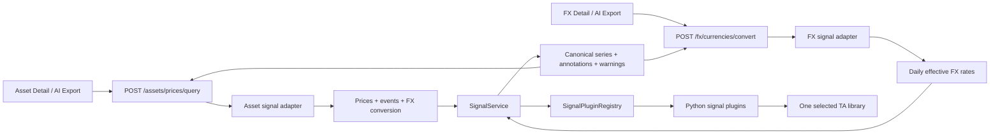

# Phase 0 — Analisi Architettura Segnali Backend

**Stato**: baseline architetturale concordata; scelta libreria rinviata allo spike.

**Piano**: [plan-phase00SignalsBackendMigration.prompt.md](./plan-phase00SignalsBackendMigration.prompt.md)

**Ricerca librerie**: [research-phase00IndicatorLibrarySelection.md](./research-phase00IndicatorLibrarySelection.md)

## Fonti analizzate

- Tutti i documenti in `Release_2/Ai_ideas/`.
- Base, registry e classi concrete dei segnali frontend.
- Componenti chart, Asset/FX Detail, settings e AI Export tecnico.
- `AssetSourceManager`, servizio FX, registri provider, schemi price/event e router.
- Test provider/API rilevanti.
- devWiki: backend-only calculations e provider auto-discovery.
- Vincoli dipendenze Python e Docker.

## Scope confermato

### Dentro Phase 0

- Nuovo layer Python dei segnali, indipendente da Asset e FX.
- Accesso tramite API Asset e FX esistenti.
- Nessun endpoint pubblico generico per array arbitrari.
- Interfaccia interna con array OHLCV compatibili e array eventi.
- FX adattato allo stesso formato: solo `close` valorizzato.
- Migrazione di EMA, RSI, MACD, Bollinger.
- Estensione iniziale: SMA, ROC, StochRSI, ATR, ADX, OBV.
- Spike tra librerie prima della dipendenza definitiva.
- Catalogo backend con chiavi i18n.
- Backend Asset+FX insieme; frontend Asset+FX insieme.
- AI Export alimentato da calcoli backend.

### Fuori scope

- `linear`, `compound`, `sine` restano frontend.
- `fx-pair` e `asset-comparison` restano frontend.
- Measure resta interattivo frontend.
- Config segnali resta session-local.
- Nessuna persistenza risultati.
- Risk metrics, Monte Carlo, watchlist e rolling return hanno piani separati.

## Stato attuale

### Frontend

- `ChartSignal` mescola calcolo, metadata, serializzazione, conversione percentuale e
  output chart-ready.
- EMA produce una linea primaria.
- RSI produce un oscillatore 0-100 con segmentazione colore.
- MACD produce due linee e un istogramma.
- Bollinger produce una banda upper/middle/lower.
- Comparison signal iniettano dati runtime nei params transient.
- Stile, ordine e config vivono in `chartSettingsStore.svelte.ts`.
- AI Export ricalcola separatamente EMA20/50/200, RSI14 e MACD, filtra i punti
  backward-filled, usa warm-up lungo e rileva eventi tecnici.

### Backend

- `AssetSourceManager.get_prices_bulk()` è il punto d'innesto Asset: load bulk, fill,
  eventi, FX conversion, response.
- Trasporto Asset: `POST /api/v1/assets/prices/query`.
- Trasporto FX: `POST /api/v1/fx/currencies/convert`.
- `provider_registry.py` offre già decorator + filesystem auto-discovery.
- `FAPricePoint` possiede OHLCV opzionali; gli eventi hanno schema stabile.
- Nessuna modifica DB necessaria.

## Architettura target



## Regole dei confini

### Plugin

- puri, deterministici, stateless;
- niente DB, rete, filesystem, FastAPI o frontend;
- `compute()` sincrono;
- esecuzione batch tramite `asyncio.to_thread`;
- solo i plugin importano la libreria terza;
- failure esplicita per singolo segnale, senza perdere altri risultati.

### Adapter Asset/FX

- possiedono data retrieval, fill, conversione e identificatori;
- convertono in modelli neutrali;
- chiedono il warm-up massimo prima del load;
- calcolano su range esteso e tagliano sul range visibile;
- preservano il comportamento corrente senza richieste segnali.

### Frontend

- possiede stile, ordine, markers, visibilità e conversione view mode;
- riceve serie matematiche + metadata semantici;
- mantiene UX dei selettori;
- continua a calcolare solo benchmark/comparison/Measure locali.

## Input neutro proposto

```python
class SignalPricePoint(BaseModel):
    date: date
    open: Decimal | None = None
    high: Decimal | None = None
    low: Decimal | None = None
    close: Decimal
    volume: Decimal | None = None
    backward_fill_info: BackwardFillInfo | None = None


class SignalEventPoint(BaseModel):
    date: date
    type: str
    value: Decimal | None = None
    metadata: dict[str, object] = Field(default_factory=dict)
```

Mapping FX:

```python
SignalPricePoint(
    date=result.conversion_date,
    open=None,
    high=None,
    low=None,
    close=result.rate or Decimal("1"),
    volume=None,
    backward_fill_info=result.backward_fill_info,
)
```

`close=1` copre conversioni identità.

## Classe astratta proposta

```python
class SignalPlugin(ABC):
    signal_code: ClassVar[str]
    implementation_version: ClassVar[str]
    category: ClassVar[SignalCategory]
    display_name_key: ClassVar[str]
    icon: ClassVar[str]
    docs_path: ClassVar[str | None]
    params_model: ClassVar[type[BaseModel]]
    required_price_fields: ClassVar[frozenset[SignalPriceField]]
    output_specs: ClassVar[tuple[SignalOutputSpec, ...]]

    @classmethod
    @abstractmethod
    def warmup_requirement(
        cls,
        params: BaseModel,
        context: SignalExecutionContext,
    ) -> SignalWarmupRequirement:
        """Return minimum and stabilization history required before visible start."""

    @abstractmethod
    def compute(
        self,
        price_points: Sequence[SignalPricePoint],
        event_points: Sequence[SignalEventPoint],
        params: BaseModel,
        context: SignalExecutionContext,
    ) -> SignalComputation:
        """Return canonical series and annotations for the full supplied range."""
```

`SignalExecutionContext` contiene dominio, range richiesto, cadence, data policy,
source reference, target currency opzionale e rappresentazione columnar/DataFrame
cache interna.

`SignalWarmupRequirement` separa:

- `minimum_points`;
- `stabilization_points`;
- `total_points`.

Il plugin calcola l'intero range esteso. `SignalService` esegue lo slicing finale.

## Output canonico

Pydantic discriminated union:

- `line`: date/value;
- `bar`: date/value;
- `band`: date/upper/middle/lower.

Composite = più serie flat:

- MACD: 2 linee + histogram;
- StochRSI: `%K` + `%D`;
- ADX: ADX + `+DI` + `-DI`.

Ogni risultato include:

- instance ID;
- signal code/version;
- params normalizzati;
- status `ok|partial|unavailable|failed`;
- serie;
- annotations opzionali;
- warning/errore strutturato;
- metadata warm-up.

Metadata serie:

- key + i18n key;
- kind;
- axis role/bounds;
- unit;
- view transform.

Nessuno stile grafico viene restituito dal backend. NaN/infinity non superano il
confine plugin.

## Registry

1. Estrarre `AbstractPluginRegistry` dalle meccaniche correnti.
2. Conservare `AbstractProviderRegistry` come specializzazione compatibile.
3. Non cambiare `@register_provider(...)`.
4. Aggiungere `SignalPluginRegistry`.
5. Aggiungere `@register_plugin(...)`.
6. Scansionare `backend/app/services/signal_plugins/*.py`.
7. Rifiutare code duplicati.
8. Tracciare import/discovery error.

Un plugin backend funzionale richiede un solo file Python. L'esposizione UI completa
richiede anche chiavi EN/IT/FR/ES e documentazione.

## Catalogo

Nessun endpoint compute generico.

Due thin route sullo stesso registry:

- `GET /api/v1/assets/prices/signals`
- `GET /api/v1/fx/currencies/signals`

Asset espone tutti i plugin e i campi richiesti. FX filtra i plugin che richiedono
`high`, `low` o `volume`.

Metadata:

- code/version/category;
- i18n keys;
- icon/docs;
- JSON Schema params;
- input richiesti;
- output specs;
- capability/domain.

## Arricchimento API

### Asset

```python
FAPriceQueryItem.signals: list[FASignalRequest] = []
FAPriceQueryResult.signals: list[FASignalResult] = []
```

Pipeline:

1. validazione/dedup;
2. warm-up massimo;
3. range esteso;
4. load DB + eventi richiesti;
5. fill + target currency;
6. mapping neutro;
7. compute batch;
8. slicing;
9. fan-out verso instance ID.

### FX

`FXConversionRequest` riceve `signals` opzionali.

`FXConversionResult` daily resta invariato.

```python
FXConvertResponse.signal_results: list[FXSignalQueryResult] = []
```

Il risultato aggregato include request index, pair, range e array segnali completi,
evitando duplicazioni su ogni giorno.

## Catalogo iniziale

| Plugin | Input | Output | Disponibilità |
|---|---|---|---|
| EMA | close | line | Asset + FX |
| RSI | close | 0-100 | Asset + FX |
| MACD | close | 2 line + histogram | Asset + FX |
| Bollinger | close | band | Asset + FX |
| SMA | close | line | Asset + FX |
| ROC | close | percent line | Asset + FX |
| StochRSI | close | `%K` + `%D` | Asset + FX |
| ATR | high, low, close | line | Asset |
| ADX | high, low, close | 3 line | Asset |
| OBV | close, volume | line | Asset |

Campi mancanti producono `MISSING_INPUT_FIELDS` o
`INSUFFICIENT_INPUT_COVERAGE`; nessun OHLCV sintetico.

## Warm-up e data policy

- UI: serie daily allineata/backward-filled, per continuità.
- AI Export: observed-only, come oggi.
- Warm-up per plugin+params, non `+100 giorni` globale.
- Un solo load esteso sul massimo richiesto.
- Compute esteso, poi trim per data.
- History insufficiente: `warmup_complete=false` + warning.
- Nessuna mutazione di stato globale della libreria per request.

## Frontend

`SignalConfig` resta stabile: `id`, `signalType`, `params`, `style`.

Registry diviso in:

- `SignalDefinition`;
- definizioni locali;
- catalogo backend;
- renderer locale;
- adapter remoto unico verso `RenderedSignal[]`.

UI e settings non cambiano visivamente.

Una POST bulk per range e tutti i segnali tecnici. Re-fetch su range/params change.
Stile e percent transform restano frontend.

Dopo cutover Asset+FX, rimuovere i calcoli TS tecnici. Niente doppio engine permanente.

## AI Export

- richiede EMA20/50/200, RSI14, MACD dal backend;
- conserva observed-only, sampling e formato payload;
- sposta cross/threshold detection in `SignalEventService`;
- rimuove import diretti delle classi tecniche TS dopo parity snapshot.

## Performance/errori

- un frame/column set per input;
- un batch worker-thread per serie;
- concorrenza limitata tra serie indipendenti;
- dedup code+params;
- cache solo dopo benchmark;
- 422 per shape HTTP;
- failure/unavailable/partial espliciti per segnale;
- import error visibile, mai omissione silenziosa.

## DB

Nessuna persistenza config/output; nessuna migration Alembic.

