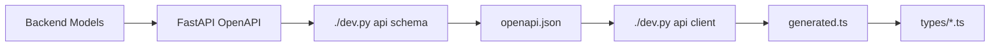

# Plan: TypeScript Types Library

**Status**: ✅ TYPES COMPLETED / 🔄 ZODIOS MIGRATION IN PROGRESS  
**Durata effettiva**: ~3 ore  
**Priorità**: P0 (Infrastruttura)  
**Dipendenze**: Nessuna

---

## 📋 Obiettivo

Centralizzare tutti i tipi TypeScript del frontend in una libreria organizzata (`$lib/types/`) che deriva i tipi dai Zod schemas generati automaticamente (`$lib/api/generated.ts`).

### Benefici

1. **Type Safety**: Tipi sincronizzati automaticamente con il backend
2. **Single Source of Truth**: Niente più interfacce duplicate nei componenti
3. **Manutenibilità**: Cambi nel backend si propagano automaticamente
4. **DX migliorata**: Import semplici da `$lib/types`
5. **Runtime validation disponibile**: Zod schemas per validazione quando necessario

---

## 🏗️ Architettura

### Struttura Directory

```
frontend/src/lib/
├── api/
│   ├── client.ts          # HTTP client con auth/language headers
│   ├── generated.ts       # Auto-generato da openapi-zod-client
│   ├── openapi.json       # Schema OpenAPI dal backend
│   └── index.ts           # Re-export client + schemas
│
└── types/
    ├── index.ts           # Barrel export di tutti i tipi
    ├── common.ts          # Tipi condivisi (Currency, UserRole, etc.)
    ├── user.ts            # Auth e user types
    ├── settings.ts        # User/Global settings
    ├── broker.ts          # Broker entity types
    ├── transaction.ts     # Transaction types
    ├── files.ts           # Upload e BRIM file types
    └── asset.ts           # Financial asset types
```

### Pattern di Derivazione Tipi

```typescript
// Esempio da types/broker.ts

import { z } from 'zod';
import { schemas } from '$lib/api/generated';

// Tipo derivato dallo schema Zod (sync con backend)
export type Broker = z.infer<typeof schemas.BRReadItem>;

// Tipo frontend-only (estensione per UI state)
export interface BrokerWithUIState extends Broker {
    isSelected?: boolean;
    isLoading?: boolean;
}
```

---

## 🔄 Flusso di Sync Backend → Frontend



### Comandi

- `./dev.py api schema` - Esporta OpenAPI schema
- `./dev.py api client` - Genera client TypeScript con Zod
- `./dev.py api sync` - Esegue entrambi
- `./dev.py front build` - **Esegue sync automaticamente prima della build**

---

## 📁 Contenuto dei File

### `$lib/api/index.ts`

```typescript
/**
 * API Module Exports
 *
 * Questo modulo fornisce:
 * - api: Client HTTP con gestione automatica di auth cookies e language headers
 * - ApiError: Classe errore custom per errori API
 * - schemas: Zod schemas per derivare tipi TypeScript e validazione runtime
 *
 * Architettura:
 * - L'autenticazione è gestita dal backend via HTTP-only session cookies
 * - Il browser invia automaticamente i cookies con credentials: 'include'
 * - Questo wrapper gestisce redirect 401 e aggiunge Accept-Language header
 */

export { api, apiCall, ApiError } from './client';
export type { ApiCallOptions } from './client';
export { schemas } from './generated';
```

### `$lib/types/index.ts`

```typescript
/**
 * LibreFolio Frontend Type Library
 *
 * Tipi TypeScript centralizzati per tutte le entità di dominio.
 * I tipi sono derivati dagli Zod schemas in generated.ts per restare sincronizzati col backend.
 *
 * Usage:
 *   import type { Broker, BrokerSummary } from '$lib/types';
 *   import type { AuthUser, UserSettings } from '$lib/types';
 */

export * from './common';
export * from './user';
export * from './settings';
export * from './broker';
export * from './transaction';
export * from './files';
export * from './asset';
```

---

## ✅ Checklist Implementazione

### Step 1: Infrastruttura ✅

- [x] Creare directory `$lib/types/`
- [x] Creare file base: `index.ts`, `common.ts`, `user.ts`, `settings.ts`, `broker.ts`, `transaction.ts`, `files.ts`, `asset.ts`
- [x] Aggiornare `$lib/api/index.ts` per re-esportare schemas
- [x] Verificare che `./dev.py front build` esegua api sync

### Step 2: Migrare Stores ✅

- [x] `auth.ts`: Usare `AuthUser` da `$lib/types` invece di interface inline
- [x] `settings.ts`: Usare `UserSettings` da `$lib/types` invece di interface inline

### Step 3: Migrare Componenti Routes ✅

| File | Interfacce rimosse | Import aggiunto |
|------|-------------------|-----------------|
| `brokers/+page.svelte` | `Broker`, `BrokerSummary` | `import type { Broker, BrokerSummary } from '$lib/types'` |
| `brokers/[id]/+page.svelte` | `BrokerSummary`, `Transaction` | `import type { BrokerSummary, Transaction } from '$lib/types'` |
| `files/+page.svelte` | `UploadedFile`, `BrimFile`, `Broker` | `import type { UploadedFile, BrimFile, BrokerInfo, Broker } from '$lib/types'` |

### Step 4: Migrare Componenti Lib ✅

| File | Modifiche |
|------|-----------|
| `BrokerSelect.svelte` | Creato `BrokerSelectItem` interface locale (subset di Broker) |
| `FilesTable.svelte` | Usa tipi da `$lib/types` + `safeNumber` helper |
| `ImportPluginSelect.svelte` | Usa `BrimPlugin` da `$lib/types` |
| `GlobalSettingsTab.svelte` | `GlobalSetting` da `$lib/types` |
| `BrokerForm.svelte` | Fix: `base_currency` invece di `default_currency` |

### Step 5: Verifiche Finali ✅

- [x] `./dev.py front build` passa senza errori
- [x] `./dev.py front check` passa senza errori (0 errors, 0 warnings)
- [x] Interfacce inline rimosse dove possibile

---

## ⚠️ Note Importanti

### Tipi da NON migrare

Alcuni tipi sono **frontend-only** e devono restare nei componenti:

- `Props` interfaces (Svelte component props)
- `SelectOption` (UI generici)
- `Category` (UI navigation)
- Layout/styling types

### Naming Conventions

| Backend Schema | Frontend Type | Motivo |
|----------------|---------------|--------|
| `BRReadItem` | `Broker` | Nome più intuitivo |
| `BRSummary` | `BrokerSummary` | Consistente |
| `TXReadItem` | `Transaction` | Nome più intuitivo |
| `BRIMFileInfo` | `BrimFile` | Più corto |
| `BRIMPluginInfo` | `BrimPlugin` | Più corto |

### Quando cambia il Backend

Se il backend modifica uno schema:

1. Esegui `./dev.py api sync` o `./dev.py front build`
2. TypeScript mostrerà errori dove i campi sono cambiati
3. Aggiorna il codice frontend di conseguenza

---

## 🔄 Migrazione a Zodios (Fase 2)

### Obiettivo

Sostituire il client `api` manuale (fetch-based) con `zodiosApi` (Axios-based) per:
- Type-safety completa con autocomplete
- Validazione runtime delle risposte via Zod
- Gestione errori più robusta

### Stato Attuale

| Componente | Stato |
|------------|-------|
| `zodios-client.ts` | ✅ Creato con Axios + interceptors |
| `auth.ts` store | ✅ Migrato |
| `settings.ts` store | ✅ Migrato |
| Componenti settings | ⏳ Da migrare (5 file) |
| Componenti brokers | ⏳ Da migrare (5 file) |
| Route pages | ⏳ Da migrare (3 file) |
| Altri componenti | ⏳ Da migrare (2 file) |
| `client.ts` legacy | ⏳ Da rimuovere dopo migrazione |

### Come migrare un componente

```typescript
// PRIMA (legacy fetch client)
import { api, ApiError } from '$lib/api';

const response = await api.get<Broker[]>('/brokers');

// DOPO (Zodios client)
import { zodiosApi } from '$lib/api';
import { isAxiosError } from 'axios';

const response = await zodiosApi.list_brokers_api_v1_brokers_get();
// ^ Type-safe! Autocomplete mostra tutti gli endpoint
```

### Gestione Errori

```typescript
// PRIMA
if (error instanceof ApiError) {
    if (error.status === 401) { ... }
}

// DOPO
import { isAxiosError } from 'axios';

if (isAxiosError(error)) {
    if (error.response?.status === 401) { ... }
}
```

---

## 🧪 Verifica Post-Migrazione

### Comandi da eseguire

```bash
# 1. Rigenerare tipi
./dev.py api sync

# 2. Type-check
./dev.py front check

# 3. Build completa
./dev.py front build

# 4. Dev server (verifica runtime)
./dev.py front dev
```

### Test manuali ✅

- [x] Login funziona
- [x] Settings si caricano, modificano e salvano
- [x] Dettaglio broker si carica
- [x] Upload file funziona (sia risorse statiche che report broker)
- [x] Tabelle file si vedono correttamente

---

## 🐛 Problemi Riscontrati e Soluzioni

### 1. Tipi Union Errati nel Generatore

**Problema**: `openapi-zod-client` genera tipi union incorretti come:
```typescript
portal_url?: ((string | null) | Array<string | null>) | undefined;
```
invece di:
```typescript
portal_url?: string | null | undefined;
```

**Causa**: Probabilmente un bug nel parsing di OpenAPI schema con `anyOf`/`oneOf`.

**Soluzione Temporanea**: Creati helper in `$lib/types/common.ts`:
- `safeString(value)` - Estrae string da union problematico
- `safeNumber(value)` - Estrae number da union problematico
- `safeCurrency(value)` - Estrae Currency object da union problematico

**TODO Futuro**: Investigare il root cause nell'OpenAPI schema o considerare generatore alternativo.

### 2. Decimal → String

**Problema**: Backend usa `Decimal` per precisione finanziaria, ma viene serializzato come `string` in JSON.

**Soluzione**: Mantenuto `string` nel tipo `Currency.amount` per preservare precisione. 
Aggiunto helper `parseCurrencyAmount(amount)` solo per display formatting.

### 3. Field Names Mismatch

**Problema**: Alcuni nomi campi diversi tra frontend legacy e backend:
- `content_type` → `mime_type` (in UploadFileInfo)
- `default_currency` → `base_currency` (in UserSettings)

**Soluzione**: Aggiornati tutti i riferimenti per usare i nomi corretti del backend.

---

## 📚 Riferimenti

- [openapi-zod-client](https://github.com/astahmer/openapi-zod-client) - Generatore usato
- [Zod Documentation](https://zod.dev/) - Schema validation library
- `backend/app/schemas/*.py` - Sorgente degli schemi Pydantic
