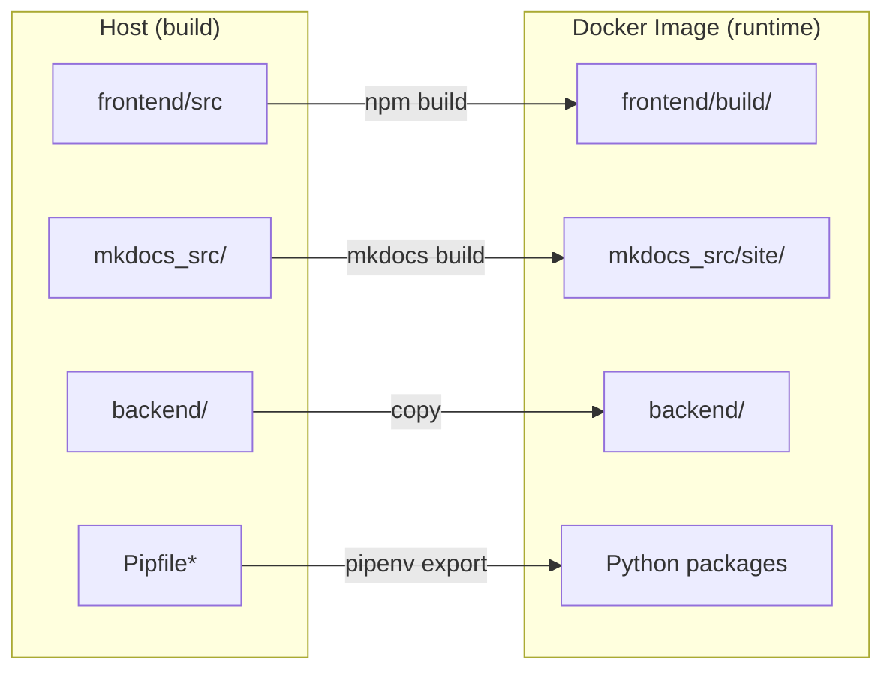
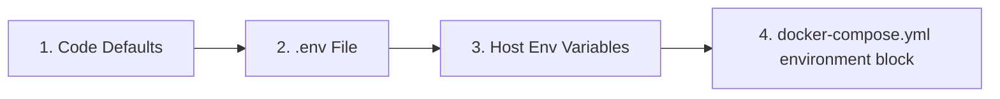

# 🐳 Advanced Docker Guide

This guide provides a deeper look into the Docker configuration for LibreFolio, intended for users who want to customize their deployment.

## ⚠️ Prerequisites

!!! warning "Docker group (Linux)"

    On Linux, your user must be in the `docker` group to run Docker commands without `sudo`:

    ```bash
    sudo usermod -aG docker $USER
    ```

    Then **log out and log back in**, or run `newgrp docker` to activate the group in the current session. Without this, all `docker` and `docker compose` commands will fail with a permission error.

!!! warning "`.env` file required"

    LibreFolio requires a `.env` file in the project root. If it's missing, `./dev.py docker build` will refuse to proceed.

    ```bash
    cp .env.example .env
    $EDITOR .env          # review and customize parameters
    ```

## 🏗️ Architecture

LibreFolio uses a **runtime-only Docker image**. The frontend (SvelteKit) and documentation (MkDocs) are built on the host and then copied into the image. The `./dev.py docker build` command handles this automatically.



### 🌐 Build-Time Resource Cache (Fonts & JS)

LibreFolio downloads a few external resources at build time and keeps a versioned local cache, so the shipped application works fully offline:

- **Noto Color Emoji** font (from Google Fonts) → `frontend/static/fonts/noto-color-emoji/` — makes flag emojis render correctly on Windows.
- **MathJax** (from a CDN) → `mkdocs_src/docs/javascripts/vendor/` — renders LaTeX formulas in the documentation.

The cache is refreshed automatically by `./dev.py server`, `./dev.py front build`, and `./dev.py docker build`. You can also refresh it manually with `./dev.py cache js` (`--force` to re-download everything).

!!! warning "A failed download fails the build — on purpose"

    If a resource **cannot be downloaded and no cached copy exists yet**, the build stops instead of silently shipping a broken image (a past Docker image shipped for months with a 404 on the emoji font, so flags rendered as plain letters on Windows). Expect an error like:

    ```text
    ❌ Resource cache incomplete — the build would ship without these:
       - noto-color-emoji: ...
    ```

    This means the **first build requires internet access** (or a pre-warmed cache). The failure is self-healing: once the network is back, just re-run the build and the cache fills in. The development server (`./dev.py server`) stays non-blocking instead — with a warm cache it works offline, otherwise it warns and falls back to the CDN.

## 📄 `docker-compose.yml`

The `docker-compose.yml` file defines the service and persistent data directory.

### 🔝 Resolution Priority {: #resolution-priority }

When resolving configuration variables, LibreFolio respects the following order of precedence (from lowest to highest priority):



### 🔧 Service: `librefolio`

- 🏗️ **`build: .`**: Builds from the `Dockerfile` in the project root.
- 🔌 **`ports`**: Maps the host port (`${PORT:-6040}`) to the container's port `6040`, and `${TEST_PORT:-6041}` to `6041` for test mode.
- 📂 **`volumes`**: A bind mount `./LibreFolio-data` → `/app/backend/data/prod-docker` persists database, uploads, broker reports, and logs **in the same directory as `docker-compose.yml`**.
- 📝 **`env_file: .env`**: Loads all configuration from the `.env` file (copied from `.env.example`).
- 🌍 **`environment`**: Overrides only Docker-specific values: `LIBREFOLIO_DATA_DIR` (container path) and `HOST=0.0.0.0`.
- 🩺 **`healthcheck`**: Polls `GET /api/v1/system/health` every 30 seconds.

### 💾 Data Directory: `LibreFolio-data/`

A **bind mount** directory created alongside `docker-compose.yml`. Contains the SQLite database, custom uploads, broker reports, and log files. Data survives container stop/restart/removal. You can back it up directly from the host filesystem.

### 👤 User & Permissions

The LibreFolio container runs as a **non-root user** for security. The default UID/GID is `1000:1000`. Files created by the application in `LibreFolio-data/` will be owned by this UID/GID on the host.

#### Choosing the right UID and GID

Set `UID` and `GID` in your `.env` file to match the **host user** (or dedicated user) that should own the data files:

```bash
UID=1000
GID=1000
```


!!! note "How `ls -l` shows ownership"

    On the **host**, `ls -l LibreFolio-data/` shows your chosen user/group name (resolved from UID/GID via `/etc/passwd`).

    **Inside the container**, the same files show as `librefolio:librefolio` — it's the same numeric UID/GID, just resolved against the container's own `/etc/passwd`.

??? tip "Linux cheatsheet: users, groups, and IDs"

    **Discover your current UID and GID:**

    ```bash
    id -u              # your user ID (e.g. 1000)
    id -g              # your primary group ID (e.g. 1000)
    id                 # full info: uid, gid, groups
    ```

    **Find the UID/GID of any user:**

    ```bash
    id -u username     # UID of 'username'
    id -g username     # primary GID of 'username'
    ```

    **Create a new group:**

    ```bash
    sudo groupadd librefolio          # create group (auto-assigns GID)
    sudo groupadd -g 1500 librefolio  # create group with specific GID
    ```

    **Create a new user:**

    ```bash
    # System user (no home, no login — ideal for services)
    sudo useradd --system --no-create-home --gid librefolio --shell /usr/sbin/nologin librefolio

    # Regular user with home directory
    sudo useradd -m -g librefolio librefolio
    ```

    **Check the assigned IDs:**

    ```bash
    id librefolio
    # → uid=998(librefolio) gid=998(librefolio) groups=998(librefolio)
    ```

    **Add your existing user to a group:**

    ```bash
    sudo usermod -aG librefolio $USER
    newgrp librefolio    # activate in current session (or log out/in)
    ```

    **Verify group membership:**

    ```bash
    groups $USER         # list all groups for your user
    ```

    **Set ownership of the data directory:**

    ```bash
    sudo chown -R librefolio:librefolio ./LibreFolio-data
    ```

    Then set the matching UID/GID in `.env`.

## 🛠️ CLI Commands

All Docker operations are available through `dev.py`:

```bash
./dev.py docker build          # Build image (auto-builds frontend + docs)
./dev.py docker build --light  # Light variant: no documentation screenshots (tagged *-light)
./dev.py docker build --no-cache  # Full rebuild without Docker cache
./dev.py docker rebuild        # Build → stop → restart (one-step deploy)
./dev.py docker up             # Start containers
./dev.py docker down           # Stop containers
./dev.py docker logs -f        # Follow container logs
./dev.py docker status         # Show container status
./dev.py docker exec <cmd>     # Run a dev.py command inside the container
```

The `--light` variant ships the same application without the bundled documentation screenshots (they are loaded on demand from the online docs site instead). `./dev.py docker build` tags the full image `librefolio:<version>` and `librefolio:latest`, and the light one `librefolio:<version>-light` and `librefolio:latest-light` (`<version>` is the git version of your checkout). These are local names only: on the registry, `latest` is itself the light variant and there is no `latest-light` tag. See [Image Variants](../user/installation.md#image-variants-full-and-light) in the user installation guide.

!!! warning "A debug frontend build fails the image build — on purpose"

    The image must ship the production build of the web app. If `frontend/build/` was last built in debug mode (for example by `./dev.py server --test`, `./dev.py server --debug` or the test runner) or instrumented for coverage, the image build stops with an error like:

    ```text
    ERROR: /build is not a production frontend build: it is a debug build (.build-debug = 1)
    Rebuild it with './dev.py front build', then build the image again.
    ```

    Run `./dev.py front build`, then build the image again. `./dev.py docker build` rebuilds the frontend on its own only when its sources have changed, not when the last build was a debug one.

!!! tip "Documentation with screenshots"

    A full image contains the documentation screenshots only if they were generated, and the documentation rebuilt with them, **before** the image build — otherwise a local full image and a light one are the same apart from their tag. The complete sequence is:

    ```bash
    ./dev.py mkdocs gallery   # generate the screenshots
    ./dev.py front build      # the gallery leaves a debug frontend build: rebuild it for production
    ./dev.py mkdocs build     # rebuild the documentation with the screenshots
    ./dev.py docker build     # build the full image
    ```

    `./dev.py mkdocs gallery` requires a fully installed environment (with `pipenv`) and Playwright browsers. The command starts its own test server and populates the test database automatically (use `--no-populate` to skip reseeding). Be patient — gallery generation takes a few minutes.

### 📡 `docker exec` — Running Commands Inside the Container

The `docker exec` subcommand forwards any `dev.py` command into the running container:

```bash
./dev.py docker exec user create admin admin@example.com Pass123!
./dev.py docker exec user list
./dev.py docker exec db upgrade
./dev.py docker exec server --test
```

This is equivalent to running `docker compose exec librefolio python dev.py <cmd>`.

## 🩹 Post-Migration Fixes {: #post-migration-fixes }

Every time the server starts, right after applying any pending database migration, it runs the **post-migration fixes**: repairs that a migration cannot make.

1. **Integrity check** — a database that fails SQLite's integrity check is never touched; the log warns about it.
2. **Detection** — each fix looks for the anomaly it corrects. If there is none, nothing is written and nothing is logged.
3. **Backup** — a copy of the database is saved next to it, in `LibreFolio-data/sqlite/`, named after the fix and the UTC time: for example `app.db.pre-autoincrement-20261008T101500Z.bak`. If the copy cannot be made, no fix runs.
4. **Fix and verify** — each fix runs in a single transaction and is verified before it is committed: no broken references between tables, the same number of rows in every table, plus the fix's own checks.
5. **Outcome** — all verified: the copy is deleted and the log says `Post-migration fixes applied and verified`. Anything failed: the fix is rolled back, leaving the database exactly as it was, the copy is **kept**, and the `Post-migration fix failed` warning in the log gives its path and the error. Both lines also say how long the run took, in `seconds`: on a large database, the start that applies a fix takes longer, but only once.

Either way the server starts normally. A fix that did not complete is tried again at the next start, and a kept copy stays until you delete it. The log is the container output (`./dev.py docker logs`), also saved in `LibreFolio-data/logs/`.

If the server runs several Uvicorn workers, each one runs the fixes as it starts, and they take turns: every run holds an exclusive lock on `app.db.post-migration.lock`, next to the database, so the others wait and, once the first has applied the fixes, find nothing left to do. The offline script below takes the same lock, even with `--dry-run`: started while the server is starting, it waits for its turn.

The first fix, **`autoincrement`**, stops LibreFolio from reusing ids. Without it, deleting the newest broker would let the next broker created take its id, together with whatever still pointed at that id: a saved link, a benchmark remembered by the browser, the folder of the broker's uploaded reports. With it, the id of a deleted user, broker, asset, transaction, FX conversion route or asset event is never given out again, and every existing id stays the same. New databases are created with this protection; an existing one is converted once, at the first start after the upgrade, and from then on the fix finds nothing to do. During the conversion, the uploaded-report folders whose broker no longer exists (`broker_reports/<uploaded|parsed|failed>/broker_<n>`) are first renamed in place to `.quarantine-autoincrement-<UTC time>-broker_<n>`, which the app does not list, so that a new broker cannot inherit them; they are deleted once the conversion is verified, or get their name back if it fails.

### ⏹️ Running the Fixes with the Server Stopped

To preview the fixes, or to retry one that failed at startup and read its error, run them by hand with the server stopped. `docker exec` needs the running container, so use `docker compose run` instead: the command you pass replaces the server in a one-off container. Always preview with `--dry-run` first:

```bash
docker compose stop librefolio
docker compose run --rm librefolio python -m backend.app.db.post_migration --dry-run   # preview: changes nothing
docker compose run --rm librefolio python -m backend.app.db.post_migration             # apply the fixes
docker compose start librefolio
```

The script works on the same database and data directory as the server and reports what it found, for example:

```text
Database: /app/backend/data/prod-docker/sqlite/app.db
Integrity check: ok
Fix autoincrement: would_apply
Orphan broker folder: broker_reports/uploaded/broker_7
```

Each fix is `clean` (nothing to do), `would_apply` (dry run), `applied` or `failed`; a kept backup and any error are listed as well. The exit code is `0` when nothing failed, a dry run included, and `1` when a fix or the integrity check failed.

## 🧪 Test Mode

The Docker Compose configuration exposes **two ports**:

| Port | Purpose | Database |
|------|---------|----------|
| `6040` | Production server (started by container CMD) | `prod-docker/sqlite/app.db` (persistent volume) |
| `6041` | Test server (started manually via `docker exec`) | `test/sqlite/app.db` (ephemeral) |

### Starting the Test Server

1. **Start the container** (production server starts automatically on `:6040`):

    ```bash
    docker compose up -d
    ```

2. **Populate the test database** with mock data:

    ```bash
    ./dev.py docker exec test db populate --force --with-static
    ```

3. **Start the test server** on port 6041:

    ```bash
    ./dev.py docker exec server --test
    ```

4. **Access** at **`http://localhost:6041`**

    Test credentials:

    | Username | Password |
    |----------|----------|
    | `e2e_test_user` | `E2eTestPass123!` |
    | `e2e_test_admin` | `E2eAdminPass123!` |

!!! warning "Test data is ephemeral"

    The test database lives inside the container's **writable layer**, not on a persistent bind mount. This means:

    - ✅ Data survives `docker compose stop` / `docker compose start` (container is paused, not removed).
    - ❌ Data is **lost** with `docker compose down` (container is removed and recreated).

    If you need persistent test data, add a dedicated bind mount in `docker-compose.yml`:

    ```yaml
    volumes:
      - ./LibreFolio-data:/app/backend/data/prod-docker
      - ./LibreFolio-test-data:/app/backend/data/test    # ← add this
    ```

## 🏭 Production Considerations

### 🎮 1. Customizing `docker-compose.yml`

The repository includes a ready-to-use `docker-compose.yml`. Here is the full file with annotations showing what you can customize:

```yaml
services:
  librefolio:
    image: librefolio:latest           # Built by ./dev.py docker build
    build:
      context: .
      args:
        UID: ${UID:-1000}              # (1) Match host user UID
        GID: ${GID:-1000}              # (1) Match host user GID
    container_name: librefolio
    # No 'user:' directive — entrypoint starts as root, fixes permissions,
    # then drops to 'librefolio' user via gosu (same pattern as postgres/redis).
    restart: unless-stopped
    ports:
      - "${PORT:-6040}:6040"           # (2) Production port — change via PORT in .env
      - "${TEST_PORT:-6041}:6041"      # (3) Test server port (optional)
    volumes:
      - ./LibreFolio-data:/app/backend/data/prod-docker  # (4) Persistent data (bind mount)
    env_file: .env                     # (5) All config from .env file
    environment:
      - LIBREFOLIO_DATA_DIR=/app/backend/data/prod-docker  # Docker-specific override
      - HOST=0.0.0.0
    healthcheck:
      test: ["CMD", "python", "-c", "import urllib.request; urllib.request.urlopen('http://localhost:6040/api/v1/system/health')"]
      interval: 30s
      timeout: 10s
      start_period: 15s
      retries: 3
```

**Common customizations:**

| # | What | How |
|---|------|-----|
| (1) | Match host UID/GID | Set `UID=1001` and `GID=1001` in `.env`, then rebuild |
| (2) | Change production port | Set `PORT=3000` in `.env` |
| (3) | Disable test port | Remove the `TEST_PORT` line from `ports:` |
| (4) | Custom data path | Change bind mount: `./my-data:/app/backend/data/prod-docker` |
| (5) | All configuration | Edit `.env` file (copied from `.env.example`) |

!!! tip "First user"

    The first time you access LibreFolio in the browser, you'll see a registration page. Create your account directly — the first user automatically becomes the administrator. No CLI needed.

### 🔒 2. Security and Exposure (Tailscale and Reverse Proxy)

It is highly recommended to expose LibreFolio securely using **Tailscale** (recommended and simplest choice) or behind a classic reverse proxy like **Nginx** or **Traefik**.

*   **Tailscale (Recommended)**: Allows you to expose LibreFolio securely with automatic HTTPS, without opening router ports or setting up public DNS records. See the detailed **[Tailscale Exposure Guide](service_exposure.md)**.
*   **Classic Reverse Proxy (Nginx/Traefik)**: Useful if you already have an existing web infrastructure or want to:
    - 🔐 Manage custom SSL/TLS certificates for HTTPS.
    - 🖥️ Serve multiple applications on the same server.
    - 🛡️ Add custom security headers and rate limiting.

LibreFolio compresses its own responses: the API's JSON, the web app's JavaScript and CSS, and the documentation pages are sent gzip-compressed to clients that accept it, while already-compressed images (PNG, JPEG, WebP) and the live asset-search stream are sent as they are. A reverse proxy in front of LibreFolio therefore does not need to compress them again.

### 💾 3. Database Backup

The database is stored in the `LibreFolio-data/` directory alongside `docker-compose.yml`. No `docker cp` needed — the data directory is a bind mount accessible from the host.

!!! warning "Do not copy `app.db` from a running container"

    LibreFolio runs SQLite in **WAL mode** (`PRAGMA journal_mode=WAL`): recent transactions live in the `app.db-wal` sidecar file, so a plain `cp` of `app.db` alone while the server is up can produce an inconsistent or stale backup. Use one of the two safe procedures below.

**Option A — Stop the container, then copy** (simplest):

```bash
#!/bin/bash
docker compose stop librefolio
cp ./LibreFolio-data/sqlite/app.db /path/to/backups/app.db-$(date +%F)
docker compose start librefolio
```

**Option B — Online backup with the SQLite CLI** (no downtime, requires the `sqlite3` tool on the host):

```bash
#!/bin/bash
sqlite3 ./LibreFolio-data/sqlite/app.db ".backup '/path/to/backups/app.db-$(date +%F)'"
```

SQLite's `.backup` command uses the online backup API, which is safe against a live WAL database.

For the full list of what is worth backing up (uploaded files, original broker reports), see the [Filesystem Layout](filesystem.md) page.

A file named `app.db.pre-<fix>-<UTC time>.bak` next to the database is a copy kept by a [post-migration fix](#post-migration-fixes) that failed.

The empty file `app.db.post-migration.lock` next to the database is the lock of the [post-migration fixes](#post-migration-fixes), reused at every start: it is harmless, so leave it in place — deleting it while the server is starting could let two runs overlap.

### 🔑 4. Environment Variables

All configuration is managed in the `.env` file (copied from `.env.example`). The Docker-specific overrides in the `environment:` block should not be changed.

For a complete list of all configurable environment variables (including those in the `.env` file and system parameters managed by Docker/CLI) and to understand how each one affects the application's behavior, see the detailed **[Configuration Guide](configuration.md)**.
