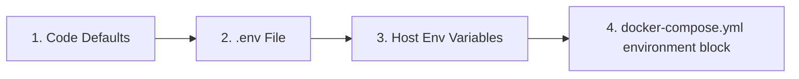

# 🐳 Advanced Docker Guide

This guide is for administrators who customize their Docker deployment, build their own image, or run maintenance on the container. For a first installation, start from the [Installation guide](../user/installation.md).

LibreFolio comes with two Compose files:

- **`docker-compose.prod.yml`** runs the official image from GHCR: the installation guide saves it as `docker-compose.yml`.
- **`docker-compose.yml`**, in the repository, runs an image you build yourself with `./dev.py docker build`, and also maps the test port `6041`.

## ⚠️ Prerequisites

**Docker group (Linux).** Your user must be in the `docker` group to run Docker commands without `sudo`:

```bash
sudo usermod -aG docker $USER
```

Then **log out and log back in**, or run `newgrp docker` to activate the group in the current session. Without this, all `docker` and `docker compose` commands fail with a permission error.

**`.env` file.** LibreFolio requires a `.env` file next to the Compose file, and `./dev.py docker build` refuses to proceed without it. In a checkout of the repository:

```bash
cp .env.example .env
$EDITOR .env          # review and customize parameters
```

## 🏗️ Architecture

The image is **runtime-only**: the web app (SvelteKit) and the documentation (MkDocs) are built on the host and copied into it, and `./dev.py docker build` runs those builds for you. Build stages, image contents and startup sequence: [Architecture overview → Docker image](../developer/architecture/overview.md#docker-image).

## 📄 `docker-compose.yml`

The Compose file defines the `librefolio` service and its persistent data directory.

### 🔝 Resolution Priority {: #resolution-priority }

When resolving configuration variables, LibreFolio respects the following order of precedence (from lowest to highest priority):



In Docker, `.env` reaches the container through `env_file`, and the `environment:` block overrides it. For the `${…}` placeholders of the Compose file, such as `${PORT:-6040}`, a variable set in your shell wins over `.env`.

### 🔧 Service: `librefolio`

- 🏷️ **`image`**: the official `ghcr.io/librefolio/librefolio:latest` (production file) or your local `librefolio:latest` (repository file); `LIBREFOLIO_IMAGE` in `.env` picks another tag.
- 🏗️ **`build`** (repository file only): builds the root `Dockerfile` with the `UID`, `GID` and `DOCS_VARIANT` arguments.
- 🔌 **`ports`**: host `${PORT:-6040}` → container `6040`; the repository file also maps `${TEST_PORT:-6041}` → `6041` for [test mode](#test-mode).
- 📂 **`volumes`**: the bind mount `./LibreFolio-data` → `/app/backend/data/prod-docker`.
- 📝 **`env_file: .env`**: loads your configuration (copied from `.env.example`).
- 🌍 **`environment`**: the Docker-specific `LIBREFOLIO_DATA_DIR` (container path) and `HOST=0.0.0.0`; leave them as they are.
- 🩺 **`healthcheck`**: polls `GET /api/v1/system/health` every 30 seconds.

### 💾 Data Directory: `LibreFolio-data/`

A **bind mount** directory next to the Compose file, holding the SQLite database, custom uploads, broker reports and log files. It survives container stop, restart and removal, and you back it up straight from the host.

### 👤 User & Permissions

The container starts as root only to hand the data directory over to the LibreFolio user, then runs the server as that **non-root** user: files it creates in `LibreFolio-data/` belong to that UID/GID on the host. The hand-over runs at every start and covers everything in the directory.

That UID/GID comes from the `UID` and `GID` **build arguments**: the image keeps them as `LIBREFOLIO_UID` and `LIBREFOLIO_GID`, which the entrypoint reads at every start. The official GHCR image is built with `1000:1000`. `./dev.py docker build` uses the ids of the user who runs it, whatever `.env` says, while `docker compose build` reads `UID` and `GID` from `.env` (default `1000`): set them to match the host user, or dedicated user, that should own the data files:

```bash
UID=1000
GID=1000
```

Changing them in `.env` takes effect only when `docker compose build` rebuilds the image: `.env` also reaches the container through `env_file`, but a restart does not change the ids. With the official image, which you do not build, these two lines have no effect.

- On the **host**, `ls -l LibreFolio-data/` shows the user and group that own that UID/GID on the host (resolved via `/etc/passwd` and `/etc/group`).
- **Inside the container**, the same files usually show as `librefolio:librefolio`: the same numeric UID/GID, resolved against the container's own `/etc/passwd` and `/etc/group`.

??? tip "Linux cheatsheet: users, groups, and IDs"

    **Discover your current UID and GID:**

    ```bash
    id -u              # your user ID (e.g. 1000)
    id -g              # your primary group ID (e.g. 1000)
    id                 # full info: uid, gid, groups
    ```

    **Find the UID/GID of any user:**

    ```bash
    id -u username     # UID of 'username'
    id -g username     # primary GID of 'username'
    ```

    **Create a new group:**

    ```bash
    sudo groupadd librefolio          # create group (auto-assigns GID)
    sudo groupadd -g 1500 librefolio  # create group with specific GID
    ```

    **Create a new user:**

    ```bash
    # System user (no home, no login — ideal for services)
    sudo useradd --system --no-create-home --gid librefolio --shell /usr/sbin/nologin librefolio

    # Regular user with home directory
    sudo useradd -m -g librefolio librefolio
    ```

    **Check the assigned IDs:**

    ```bash
    id librefolio
    # → uid=998(librefolio) gid=998(librefolio) groups=998(librefolio)
    ```

    **Add your existing user to a group:**

    ```bash
    sudo usermod -aG librefolio $USER
    newgrp librefolio    # activate in current session (or log out/in)
    ```

    **Verify group membership:**

    ```bash
    groups $USER         # list all groups for your user
    ```

    **Set ownership of the data directory:**

    ```bash
    sudo chown -R librefolio:librefolio ./LibreFolio-data
    ```

    Then set the matching UID/GID in `.env` and rebuild the image with `docker compose build`: at every start the container hands the directory back to the image's UID/GID.

## 🛠️ CLI Commands

In a checkout of the repository, `dev.py` wraps the Docker operations:

```bash
./dev.py docker build          # Build image (auto-builds frontend + docs)
./dev.py docker build --light  # Light variant: no documentation screenshots (tagged *-light)
./dev.py docker build --no-cache  # Full rebuild without Docker cache
./dev.py docker rebuild        # Build → stop → restart (one-step deploy)
./dev.py docker up             # Start containers
./dev.py docker down           # Stop containers
./dev.py docker logs -f        # Follow container logs
./dev.py docker status         # Show container status
./dev.py docker exec <cmd>     # Run a dev.py command inside the container
```

Without a checkout, the plain commands do the day-to-day work: `docker compose up -d`, `docker compose down`, `docker compose logs -f` and `docker compose ps`.

- `--light` builds the image without the documentation screenshots, which then load from the online docs site (see [Image Variants](../user/installation.md#image-variants-full-and-light)).
- Local tags: `librefolio:<version>` and `librefolio:latest` for the full image, `librefolio:<version>-light` and `librefolio:latest-light` for the light one, `<version>` being the git version of your checkout. On the registry instead, `latest` is the light variant and there is no `latest-light`.
- To run your light build with the repository's Compose file, set `LIBREFOLIO_IMAGE=librefolio:latest-light` in `.env`.

??? warning "🧱 When `./dev.py docker build` stops"

    **A resource cannot be downloaded.** The build caches a few external resources, such as the Noto Color Emoji font (flags on Windows) and MathJax (formulas in the documentation), so that the image works fully offline. If one cannot be downloaded and no cached copy exists yet, the build stops instead of shipping a broken image:

    ```text
    ❌ Resource cache incomplete — the build would ship without these:
       - noto-color-emoji: ...
    ```

    The **first build requires internet access** (or a pre-warmed cache). Once the network is back, run the build again; `./dev.py cache js` refreshes the cache by hand (`--force` re-downloads everything).

    **The frontend is a debug build.** The image must ship the production build of the web app. If `frontend/build/` was last built in debug mode (for example by `./dev.py server --test`, `./dev.py server --debug` or the test runner) or instrumented for coverage, the image build stops with an error like:

    ```text
    ERROR: /build is not a production frontend build: it is a debug build (.build-debug = 1)
    Rebuild it with './dev.py front build', then build the image again.
    ```

    Run `./dev.py front build`, then build the image again: `./dev.py docker build` rebuilds the frontend on its own only when its sources have changed, not when the last build was a debug one.

??? tip "🖼️ Building a full image with the documentation screenshots"

    A full image contains the documentation screenshots only if they were generated, and the documentation rebuilt with them, **before** the image build: otherwise a local full image and a light one are the same apart from their tag. The complete sequence is:

    ```bash
    ./dev.py mkdocs gallery   # generate the screenshots
    ./dev.py front build      # the gallery leaves a debug frontend build: rebuild it for production
    ./dev.py mkdocs build     # rebuild the documentation with the screenshots
    ./dev.py docker build     # build the full image
    ```

    `./dev.py mkdocs gallery` requires a fully installed environment (with `pipenv`) and Playwright browsers. It starts its own test server and populates the test database automatically (`--no-populate` skips reseeding). Gallery generation takes a few minutes.

### 📡 `docker exec` — Running Commands Inside the Container {: #docker-exec }

`./dev.py docker exec <cmd>` runs a `dev.py` command inside the **running** container: it is the same as `docker compose exec librefolio python dev.py <cmd>`. For example, to manage users:

```bash
./dev.py docker exec user create admin admin@example.com Pass123!
./dev.py docker exec user list
```

In the image, `user`, `db` and `info` work. The development commands (`test`, `i18n`, `mkdocs translate` and `mkdocs translate-validate`) are listed too, but they only answer that they are *not available in this installation*: the image ships the application, not the development tree.

The test-mode commands do not run in the container either; like `./dev.py mkdocs gallery`, they belong to a development checkout:

- `./dev.py docker exec test db populate` gets the same *not available* answer as every `test` command;
- `./dev.py docker exec server --test` stops with `Frontend build failed. Server not started.`: test mode first tries to rebuild the web app in debug mode, which needs Node.js and the web app's sources, while the image ships only the production build, without Node.js.

**Database migrations need no command.** The server applies pending migrations every time it starts: after `docker compose pull` and `docker compose up -d` there is nothing else to run, and `docker compose restart librefolio` retries them after a failure. Do not use `./dev.py docker exec db upgrade`: `db upgrade` needs the server stopped, and in the container the server is the main process, always running.

## 🩹 Post-Migration Fixes {: #post-migration-fixes }

Every time the server starts, right after applying any pending database migration, it runs the **post-migration fixes**: repairs that a migration cannot make. What they repair, and what the log says about them, is explained in [Command-Line Tools → Post-Migration Fixes](cli_tools.md#post-migration-fixes). In Docker:

- the log is the container output (`./dev.py docker logs` or `docker compose logs`), also saved in `LibreFolio-data/logs/`;
- a copy kept by a failed fix sits next to the database, in `LibreFolio-data/sqlite/`, for example `app.db.pre-autoincrement-20261008T101500Z.bak`.

### ⏹️ Running the Fixes with the Server Stopped

To preview the fixes, or to retry one that failed at startup and read its error, run them by hand with the server stopped. `docker exec` needs the running container, so use `docker compose run` instead: the command you pass replaces the server in a one-off container. Always preview with `--dry-run` first:

```bash
docker compose stop librefolio
docker compose run --rm librefolio python -m backend.app.db.post_migration --dry-run   # preview: changes nothing
docker compose run --rm librefolio python -m backend.app.db.post_migration             # apply the fixes
docker compose start librefolio
```

The script works on the same database and data directory as the server and reports what it found, for example:

```text
Database: /app/backend/data/prod-docker/sqlite/app.db
Integrity check: ok
Fix autoincrement: would_apply
Orphan broker folder: broker_reports/uploaded/broker_7
```

Each fix is `clean` (nothing to do), `would_apply` (dry run), `applied` or `failed`; a kept backup and any error are listed as well. The exit code is `0` when nothing failed, a dry run included, and `1` when a fix or the integrity check failed.

## 🧪 Test Mode

The repository's `docker-compose.yml` exposes **two ports**:

| Port | Purpose | Database |
|------|---------|----------|
| `6040` | Production server, started with the container | `LibreFolio-data/sqlite/app.db` (persistent bind mount) |
| `6041` | Test server, a developer tool | None: the test server does not start in the container. In a development checkout it uses `backend/data/test/sqlite/app.db` by default, which `./dev.py test db populate --force` deletes and recreates with mock data |

The test server is meant for developers: how to start it, and why it does not start with the current image, is in the [Developer Workflow](../developer/dev_workflow.md#docker-test-mode). `docker-compose.prod.yml` has no test port; in the repository's file, remove the `TEST_PORT` line from `ports:` to close it.

## 🏭 Production Considerations

### 🎮 1. Customizing `docker-compose.yml`

The most common changes:

| # | What | How |
|---|------|-----|
| (1) | Match host UID/GID | Rebuild the image with them: run `./dev.py docker build` as the user who should own the files, or set `UID=1001` and `GID=1001` in `.env` and run `docker compose build` |
| (2) | Change production port | Set `PORT=3000` in `.env` |
| (3) | Disable test port | Remove the `TEST_PORT` line from `ports:` |
| (4) | Custom data path | Change bind mount: `./my-data:/app/backend/data/prod-docker` |
| (5) | All configuration | Edit `.env` file (copied from `.env.example`) |
| (6) | Run another image tag | Set `LIBREFOLIO_IMAGE` in `.env`, for example `LIBREFOLIO_IMAGE=ghcr.io/librefolio/librefolio:1.1.0` |

The first account created in the browser automatically becomes the administrator: no command needed.

??? example "📄 The repository's `docker-compose.yml`, annotated"

    ```yaml
    services:
      librefolio:
        image: ${LIBREFOLIO_IMAGE:-librefolio:latest}  # (6) Built by ./dev.py docker build
        build:
          context: .
          args:
            UID: ${UID:-1000}              # (1) UID owning the data files (build time only)
            GID: ${GID:-1000}              # (1) GID owning the data files (build time only)
            DOCS_VARIANT: ${DOCS_VARIANT:-full}  # light = no documentation screenshots
        container_name: librefolio
        # No 'user:' directive — entrypoint starts as root, fixes permissions,
        # then drops to 'librefolio' user via gosu (same pattern as postgres/redis).
        restart: unless-stopped
        ports:
          - "${PORT:-6040}:6040"           # (2) Production port — change via PORT in .env
          - "${TEST_PORT:-6041}:6041"      # (3) Test server port (optional)
        volumes:
          - ./LibreFolio-data:/app/backend/data/prod-docker  # (4) Persistent data (bind mount)
        env_file: .env                     # (5) All config from .env file
        environment:
          - LIBREFOLIO_DATA_DIR=/app/backend/data/prod-docker  # Docker-specific override
          - HOST=0.0.0.0
        healthcheck:
          test: ["CMD", "python", "-c", "import urllib.request; urllib.request.urlopen('http://localhost:6040/api/v1/system/health')"]
          interval: 30s
          timeout: 10s
          start_period: 15s
          retries: 3
    ```

    `docker-compose.prod.yml` has the same service without `build:` and without the test port, and its image defaults to `ghcr.io/librefolio/librefolio:latest`.

### 🔒 2. Security and Exposure (Tailscale and Reverse Proxy)

Expose LibreFolio securely through **Tailscale** (recommended, and the simplest choice) or behind a classic reverse proxy such as **Nginx** or **Traefik**:

- **Tailscale (recommended)**: secure access with automatic HTTPS, without opening router ports or setting up public DNS records. See the detailed **[Tailscale Exposure Guide](service_exposure.md)**.
- **Classic reverse proxy (Nginx/Traefik)**: useful if you already have a web infrastructure, or want to manage custom SSL/TLS certificates, serve several applications on one server, or add custom security headers and rate limiting.

LibreFolio already gzip-compresses its responses (API JSON, the web app's JavaScript and CSS, documentation pages) and sends images and the live asset-search stream as they are: the proxy does not need to compress them again.

### 💾 3. Database Backup

The database is stored in the `LibreFolio-data/` directory alongside `docker-compose.yml`. No `docker cp` needed — the data directory is a bind mount accessible from the host.

!!! warning "Do not copy `app.db` from a running container"

    LibreFolio runs SQLite in **WAL mode** (`PRAGMA journal_mode=WAL`): recent transactions live in the `app.db-wal` sidecar file, so a plain `cp` of `app.db` alone while the server is up can produce an inconsistent or stale backup. Use one of the two safe procedures below.

**Option A — Stop the container, then copy** (simplest):

```bash
#!/bin/bash
docker compose stop librefolio
cp ./LibreFolio-data/sqlite/app.db /path/to/backups/app.db-$(date +%F)
docker compose start librefolio
```

**Option B — Online backup with the SQLite CLI** (no downtime, requires the `sqlite3` tool on the host):

```bash
#!/bin/bash
sqlite3 ./LibreFolio-data/sqlite/app.db ".backup '/path/to/backups/app.db-$(date +%F)'"
```

SQLite's `.backup` command uses the online backup API, which is safe against a live WAL database.

For the full list of what is worth backing up (uploaded files, original broker reports), see the [Filesystem Layout](filesystem.md) page.

Files you may find next to the database:

- `app.db.pre-<fix>-<UTC time>.bak`: a copy kept by a [post-migration fix](#post-migration-fixes) that failed; delete it when you no longer need it.
- `app.db.post-migration.lock`: the empty lock file of the [post-migration fixes](#post-migration-fixes), reused at every start. It is harmless: leave it in place, since deleting it while the server is starting could let two runs overlap.

### 🔑 4. Environment Variables

All configuration is managed in the `.env` file (copied from `.env.example`); leave the Docker-specific overrides of the `environment:` block as they are. For every variable and its effect, see the **[Configuration Guide](configuration.md)**.

🔐 **Keep users signed in across restarts**: set `JWT_SECRET` in `.env` to a long random string, for example the output of `openssl rand -hex 32`. Without it, LibreFolio generates a new key at every start, so each restart or update of the container signs every user out.
