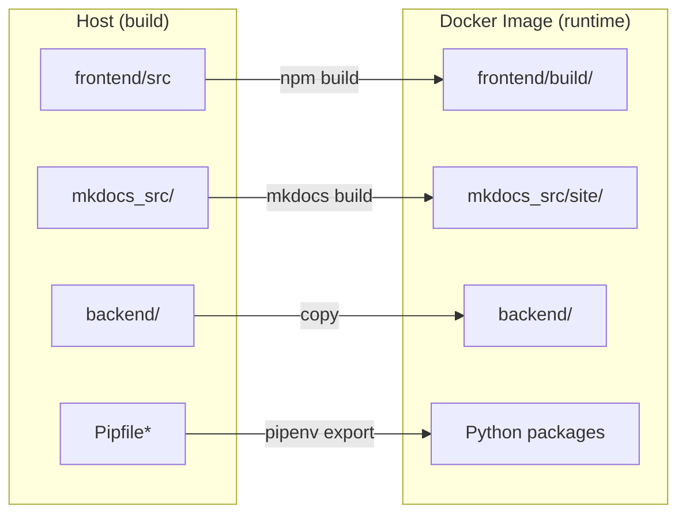
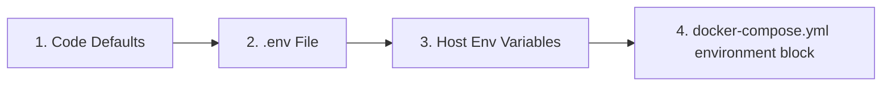

# 🐳 Guía avanzada de Docker

Esta guía ofrece una mirada más profunda a la configuración de Docker para LibreFolio, pensada para usuarios que quieran personalizar su despliegue.

## ⚠️ Requisitos previos

!!! warning "Grupo Docker (Linux)"

    En Linux, tu usuario debe estar en el grupo `docker` para ejecutar comandos de Docker sin `sudo`:

    ```bash
    sudo usermod -aG docker $USER
    ```

    Luego **cierra sesión y vuelve a iniciarla**, o ejecuta `newgrp docker` para activar el grupo en la sesión actual. Sin esto, todos los comandos de `docker` y `docker compose` fallarán con un error de permisos.

!!! warning "Archivo `.env` obligatorio"

    LibreFolio requiere un archivo `.env` en la raíz del proyecto. Si falta, `./dev.py docker build` se negará a continuar.

    ```bash
    cp .env.example .env
    $EDITOR .env # review and customize parameters
    ```

## 🏗️ Arquitectura

LibreFolio utiliza una **imagen Docker de solo ejecución**. El frontend (SvelteKit) y la documentación (MkDocs) se compilan en el host y luego se copian en la imagen. El comando `./dev.py docker build` se encarga de esto automáticamente.



### 🌐 Caché de recursos en tiempo de construcción (fuentes y JS)

LibreFolio descarga algunos recursos externos en tiempo de construcción y mantiene una caché local versionada, de modo que la aplicación distribuida funciona completamente sin conexión:

- Fuente **Noto Color Emoji** (de Google Fonts) → `frontend/static/fonts/noto-color-emoji/` — hace que los emojis de banderas se muestren correctamente en Windows.
- **MathJax** (desde un CDN) → `mkdocs_src/docs/javascripts/vendor/` — renderiza fórmulas LaTeX en la documentación.

La caché se actualiza automáticamente con `./dev.py server`, `./dev.py front build` y `./dev.py docker build`. También puedes actualizarla manualmente con `./dev.py cache js` (`--force` para volver a descargarlo todo).

!!! warning "Una descarga fallida detiene la construcción — a propósito"

    Si un recurso **no puede descargarse y aún no existe una copia en caché**, la construcción se detiene en lugar de distribuir silenciosamente una imagen dañada (en el pasado, una imagen de Docker se distribuyó durante meses con un 404 en la fuente de emojis, por lo que las banderas se mostraban como letras simples en Windows). Espera un error como:

    ```text
    ❌ Resource cache incomplete — the build would ship without these:
    - noto-color-emoji: ...
    ```

    Esto significa que la **primera construcción requiere acceso a internet** (o una caché precalentada). El fallo se autocorrige: cuando la red se restablezca, solo hay que volver a ejecutar la construcción y la caché se rellena. El servidor de desarrollo (`./dev.py server`), en cambio, no bloquea: con la caché lista funciona sin conexión; de lo contrario, avisa y recurre al CDN.

## 📄 `docker-compose.yml`

El archivo `docker-compose.yml` define el servicio y el directorio de datos persistentes.

### 🔝 Prioridad de resolución {: #resolution-priority }

Al resolver las variables de configuración, LibreFolio respeta el siguiente orden de precedencia (de menor a mayor prioridad):



### 🔧 Servicio: `librefolio`

- 🏗️ **`build: .`**: Construye desde el `Dockerfile` en la raíz del proyecto.
- 🔌 **`ports`**: Mapea el puerto del host (`${PORT:-6040}`) al puerto `6040` del contenedor, y `${TEST_PORT:-6041}` a `6041` para el modo de prueba.
- 📂 **`volumes`**: Un bind mount `./LibreFolio-data` → `/app/backend/data/prod-docker` persiste la base de datos, las subidas, los informes de bróker y los registros **en el mismo directorio que `docker-compose.yml`**.
- 📝 **`env_file: .env`**: Carga toda la configuración desde el archivo `.env` (copiado de `.env.example`).
- 🌍 **`environment`**: Sobrescribe solo los valores específicos de Docker: `LIBREFOLIO_DATA_DIR` (ruta del contenedor) y `HOST=0.0.0.0`.
- 🩺 **`healthcheck`**: Consulta `GET /api/v1/system/health` cada 30 segundos.

### 💾 Directorio de datos: `LibreFolio-data/`

Un directorio de **bind mount** creado junto a `docker-compose.yml`. Contiene la base de datos SQLite, las subidas personalizadas, los informes de bróker y los archivos de registro. Los datos sobreviven a la detención, el reinicio o la eliminación del contenedor. Puedes hacer una copia de seguridad directamente desde el sistema de archivos del host.

### 👤 Usuario y permisos

El contenedor de LibreFolio se ejecuta como un **usuario no root** por seguridad. El UID/GID predeterminado es `1000:1000`. Los archivos creados por la aplicación en `LibreFolio-data/` serán propiedad de este UID/GID en el host.

#### Elegir el UID y GID correctos

Establece `UID` y `GID` en tu archivo `.env` para que coincidan con el **usuario del host** (o usuario dedicado) que debe ser propietario de los archivos de datos:

```bash
UID=1000
GID=1000
```

!!! note "Cómo `ls -l` muestra la propiedad de los archivos"

    En el **host**, `ls -l LibreFolio-data/` muestra el nombre de usuario/grupo que hayas elegido (resuelto a partir de UID/GID mediante `/etc/passwd`).

    **Dentro del contenedor**, los mismos archivos aparecen como `librefolio:librefolio` — es el mismo UID/GID numérico, solo que resuelto contra el `/etc/passwd` del propio contenedor.

??? tip "Hoja de referencia de Linux: usuarios, grupos e IDs"

    **Descubre tu UID y GID actuales:**

    ```bash
    id -u # your user ID (e.g. 1000)
    id -g # your primary group ID (e.g. 1000)
    id # full info: uid, gid, groups
    ```

    **Encuentra el UID/GID de cualquier usuario:**

    ```bash
    id -u username # UID of 'username'
    id -g username # primary GID of 'username'
    ```

    **Crea un nuevo grupo:**

    ```bash
    sudo groupadd librefolio # create group (auto-assigns GID)
    sudo groupadd -g 1500 librefolio # create group with specific GID
    ```

    **Crea un nuevo usuario:**

    ```bash
    # System user (no home, no login — ideal for services)
    sudo useradd --system --no-create-home --gid librefolio --shell /usr/sbin/nologin librefolio

    # Regular user with home directory
    sudo useradd -m -g librefolio librefolio
    ```

    **Comprueba los IDs asignados:**

    ```bash
    id librefolio
    # → uid=998(librefolio) gid=998(librefolio) groups=998(librefolio)
    ```

    **Añade tu usuario existente a un grupo:**

    ```bash
    sudo usermod -aG librefolio $USER
    newgrp librefolio # activate in current session (or log out/in)
    ```

    **Verifica la pertenencia al grupo:**

    ```bash
    groups $USER # list all groups for your user
    ```

    **Establece la propiedad del directorio de datos:**

    ```bash
    sudo chown -R librefolio:librefolio ./LibreFolio-data
    ```

    Luego establece el UID/GID correspondiente en `.env`.

## 🛠️ Comandos CLI

Todas las operaciones de Docker están disponibles a través de `dev.py`:

```bash
./dev.py docker build # Build image (auto-builds frontend + docs)
./dev.py docker build --light # Light variant: no documentation images (tag *-light, ~1.5 GB vs ~2.9 GB full)
./dev.py docker build --no-cache # Full rebuild without Docker cache
./dev.py docker rebuild # Build → stop → restart (one-step deploy)
./dev.py docker up # Start containers
./dev.py docker down # Stop containers
./dev.py docker logs -f # Follow container logs
./dev.py docker status # Show container status
./dev.py docker exec <cmd> # Run a dev.py command inside the container
```

La variante `--light` incluye la misma aplicación, pero sin empaquetar las capturas de pantalla de la documentación (en su lugar, se cargan bajo demanda desde el sitio de documentación en línea), y está etiquetada con el sufijo `-light`. Consulta [Variantes de imagen](../user/installation.md#image-variants-full-and-light) en la guía de instalación para usuarios.

!!! tip "Documentación con capturas de pantalla"

    Si estás generando la documentación y quieres capturas de pantalla completas en la galería, ejecuta:

    ```bash
    ./dev.py mkdocs gallery
    ```

    Esto requiere un entorno completamente instalado (con `pipenv`) y los navegadores de Playwright. El comando inicia su propio servidor de prueba y rellena automáticamente la base de datos de prueba (usa `--no-populate` para omitir la repoblación). Ten paciencia — la generación de la galería tarda unos minutos.

### 📡 `docker exec` — Ejecutar comandos dentro del contenedor

El subcomando `docker exec` reenvía cualquier comando `dev.py` al contenedor en ejecución:

```bash
./dev.py docker exec user create admin admin@example.com Pass123!
./dev.py docker exec user list
./dev.py docker exec db upgrade
./dev.py docker exec server --test
```

Esto equivale a ejecutar `docker compose exec librefolio python dev.py <cmd>`.

## 🧪 Modo de prueba

La configuración de Docker Compose expone **dos puertos**:

| Puerto | Propósito | Base de datos |
|------|---------|----------|
| `6040` | Servidor de producción (iniciado por el CMD del contenedor) | `prod-docker/sqlite/app.db` (volumen persistente) |
| `6041` | Servidor de prueba (iniciado manualmente mediante `docker exec`) | `test/sqlite/app.db` (efímera) |

### Iniciar el servidor de prueba

1. **Inicia el contenedor** (el servidor de producción se inicia automáticamente en `:6040`):

 ```bash
 docker compose up -d
 ```

2. **Rellena la base de datos de prueba** con datos simulados:

 ```bash
 ./dev.py docker exec test db populate --force --with-static
 ```

3. **Inicia el servidor de prueba** en el puerto 6041:

 ```bash
 ./dev.py docker exec server --test
 ```

4. **Accede** en **`http://localhost:6041`**

 Credenciales de prueba:

 | Usuario | Contraseña |
 |----------|----------|
 | `e2e_test_user` | `E2eTestPass123!` |
 | `e2e_test_admin` | `E2eAdminPass123!` |

!!! warning "Los datos de prueba son efímeros"

    La base de datos de prueba reside dentro de la **capa de escritura** del contenedor, no en un bind mount persistente. Esto significa:

    - ✅ Los datos sobreviven a `docker compose stop` / `docker compose start` (el contenedor se pausa, no se elimina).
    - ❌ Los datos se **pierden** con `docker compose down` (el contenedor se elimina y se recrea).

    Si necesitas datos de prueba persistentes, añade un bind mount dedicado en `docker-compose.yml`:

    ```yaml
    volumes:
    - ./LibreFolio-data:/app/backend/data/prod-docker
    - ./LibreFolio-test-data:/app/backend/data/test # ← add this
    ```

## 🏭 Consideraciones de producción

### 🎮 1. Personalizar `docker-compose.yml`

El repositorio incluye un `docker-compose.yml` listo para usar. Aquí está el archivo completo con anotaciones que muestran qué puedes personalizar:

```yaml
services:
 librefolio:
 image: librefolio:latest # Built by ./dev.py docker build
 build:
 context: .
 args:
 UID: ${UID:-1000} # (1) Match host user UID
 GID: ${GID:-1000} # (1) Match host user GID
 container_name: librefolio
 # No 'user:' directive — entrypoint starts as root, fixes permissions,
 # then drops to 'librefolio' user via gosu (same pattern as postgres/redis).
 restart: unless-stopped
 ports:
 - "${PORT:-6040}:6040" # (2) Production port — change via PORT in .env
 - "${TEST_PORT:-6041}:6041" # (3) Test server port (optional)
 volumes:
 - ./LibreFolio-data:/app/backend/data/prod-docker # (4) Persistent data (bind mount)
 env_file: .env # (5) All config from .env file
 environment:
 - LIBREFOLIO_DATA_DIR=/app/backend/data/prod-docker # Docker-specific override
 - HOST=0.0.0.0
 healthcheck:
 test: ["CMD", "python", "-c", "import urllib.request; urllib.request.urlopen('http://localhost:6040/api/v1/system/health')"]
 interval: 30s
 timeout: 10s
 start_period: 15s
 retries: 3
```

**Personalizaciones más comunes:**

| # | Qué | Cómo |
|---|------|-----|
| (1) | Hacer coincidir el UID/GID del host | Establece `UID=1001` y `GID=1001` en `.env` y reconstruye la imagen |
| (2) | Cambiar el puerto de producción | Establece `PORT=3000` en `.env` |
| (3) | Deshabilitar el puerto de prueba | Elimina la línea `TEST_PORT` de `ports:` |
| (4) | Ruta de datos personalizada | Cambia el bind mount: `./my-data:/app/backend/data/prod-docker` |
| (5) | Toda la configuración | Edita el archivo `.env` (copiado de `.env.example`) |

!!! tip "Primer usuario"

    La primera vez que accedas a LibreFolio en el navegador, verás una página de registro. Crea tu cuenta directamente — el primer usuario se convierte automáticamente en administrador. No se necesita CLI.

### 🔒 2. Seguridad y exposición (Tailscale y proxy inverso)

Se recomienda encarecidamente exponer LibreFolio de forma segura usando **Tailscale** (la opción recomendada y más sencilla) o detrás de un proxy inverso clásico como **Nginx** o **Traefik**.

* **Tailscale (recomendado)**: Te permite exponer LibreFolio de forma segura con HTTPS automático, sin abrir puertos del router ni configurar registros DNS públicos. Consulta la detallada **[Guía de exposición con Tailscale](service_exposure.md)**.
* **Proxy inverso clásico (Nginx/Traefik)**: Útil si ya tienes una infraestructura web existente o quieres:
 - 🔐 Gestionar certificados SSL/TLS personalizados para HTTPS.
 - 🖥️ Servir múltiples aplicaciones en el mismo servidor.
 - 🛡️ Añadir cabeceras de seguridad personalizadas y limitación de velocidad.

### 💾 3. Copia de seguridad de la base de datos

La base de datos se almacena en el directorio `LibreFolio-data/`, junto a `docker-compose.yml`. No se necesita `docker cp` — el directorio de datos es un bind mount accesible desde el host.

!!! warning "No copies `app.db` de un contenedor en ejecución"

    LibreFolio ejecuta SQLite en **modo WAL** (`PRAGMA journal_mode=WAL`): las transacciones recientes residen en el archivo auxiliar `app.db-wal`, por lo que un `cp` simple de `app.db` mientras el servidor está activo puede producir una copia de seguridad inconsistente u obsoleta. Usa uno de los dos procedimientos seguros que se indican a continuación.

**Opción A — detener el contenedor y luego copiar** (la más sencilla):

```bash
#!/bin/bash
docker compose stop librefolio
cp ./LibreFolio-data/sqlite/app.db /path/to/backups/app.db-$(date +%F)
docker compose start librefolio
```

**Opción B — copia de seguridad en línea con la CLI de SQLite** (sin tiempo de inactividad, requiere la herramienta `sqlite3` en el host):

```bash
#!/bin/bash
sqlite3 ./LibreFolio-data/sqlite/app.db ".backup '/path/to/backups/app.db-$(date +%F)'"
```

El comando `.backup` de SQLite utiliza la API de copia de seguridad en línea, que es segura para una base de datos WAL activa.

Para ver la lista completa de lo que vale la pena respaldar (archivos subidos, informes de bróker originales), consulta la página [Estructura del sistema de archivos](filesystem.md).

### 🔑 4. Variables de entorno

Toda la configuración se gestiona en el archivo `.env` (copiado de `.env.example`). Las sobrescrituras específicas de Docker en el bloque `environment:` no deben modificarse.

Para ver una lista completa de todas las variables de entorno configurables (incluidas las del archivo `.env` y los parámetros del sistema gestionados por Docker/CLI) y entender cómo afecta cada una al comportamiento de la aplicación, consulta la detallada **[Guía de configuración](configuration.md)**.
