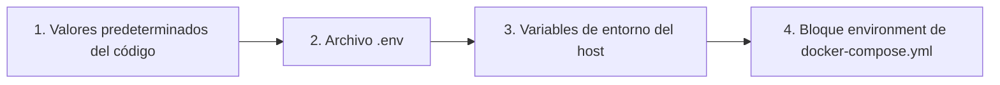

# 🐳 Guía avanzada de Docker

Esta guía está dirigida a administradores que personalizan su despliegue de Docker, compilan su propia imagen o realizan tareas de mantenimiento en el contenedor. Para una primera instalación, comienza por la [guía de instalación](../user/installation.md).

LibreFolio incluye dos archivos Compose:

- **`docker-compose.prod.yml`** ejecuta la imagen oficial de GHCR: la guía de instalación lo guarda como `docker-compose.yml`.
- **`docker-compose.yml`**, en el repositorio, ejecuta una imagen que compilas tú mismo con `./dev.py docker build`, y también asigna el puerto de pruebas `6041`.

## ⚠️ Requisitos previos

**Grupo de Docker (Linux).** Tu usuario debe pertenecer al grupo `docker` para ejecutar comandos de Docker sin `sudo`:

```bash
sudo usermod -aG docker $USER
```

Después, **cierra sesión y vuelve a iniciar sesión**, o ejecuta `newgrp docker` para activar el grupo en la sesión actual. Sin esto, todos los comandos `docker` y `docker compose` fallan con un error de permisos.

**Archivo `.env`.** LibreFolio requiere un archivo `.env` junto al archivo Compose, y `./dev.py docker build` se niega a continuar sin él. En una copia local del repositorio:

```bash
cp .env.example .env
$EDITOR .env          # review and customize parameters
```

## 🏗️ Arquitectura

La imagen es **solo para tiempo de ejecución**: la aplicación web (SvelteKit) y la documentación (MkDocs) se compilan en el host y se copian en ella, y `./dev.py docker build` ejecuta esas compilaciones por ti. Etapas de compilación, contenido de la imagen y secuencia de inicio: [Resumen de la arquitectura → Imagen de Docker](../developer/architecture/overview.md#docker-image).

## 📄 `docker-compose.yml`

El archivo Compose define el servicio `librefolio` y su directorio de datos persistente.

### 🔝 Prioridad de resolución {: #resolution-priority }

Al resolver variables de configuración, LibreFolio respeta el siguiente orden de precedencia (de menor a mayor prioridad):


```mermaid
graph LR
    CodeDefaults[1. Valores predeterminados del código] --> EnvFile[2. Archivo .env]
    HostShell[3. Variables de entorno del host]
    DockerCompose[4. Bloque environment de docker-compose.yml]

    EnvFile --> HostShell
    HostShell --> DockerCompose
```

En Docker, `.env` llega al contenedor a través de `env_file`, y el bloque `environment:` tiene prioridad sobre él. Para los marcadores de posición `${…}` del archivo Compose, como `${PORT:-6040}`, una variable definida en tu shell prevalece sobre `.env`.

### 🔧 Servicio: `librefolio`

- 🏷️ **`image`**: la oficial `ghcr.io/librefolio/librefolio:latest` (archivo de producción) o tu `librefolio:latest` local (archivo del repositorio); `LIBREFOLIO_IMAGE` en `.env` selecciona otra etiqueta.
- 🏗️ **`build`** (solo archivo del repositorio): compila el `Dockerfile` raíz con los argumentos `UID`, `GID` y `DOCS_VARIANT`.
- 🔌 **`ports`**: host `${PORT:-6040}` → contenedor `6040`; el archivo del repositorio también asigna `${TEST_PORT:-6041}` → `6041` para el [modo de prueba](#test-mode).
- 📂 **`volumes`**: el bind mount `./LibreFolio-data` → `/app/backend/data/prod-docker`.
- 📝 **`env_file: .env`**: carga tu configuración (copiada de `.env.example`).
- 🌍 **`environment`**: los específicos de Docker `LIBREFOLIO_DATA_DIR` (ruta del contenedor) y `HOST=0.0.0.0`; déjalos como están.
- 🩺 **`healthcheck`**: consulta `GET /api/v1/system/health` cada 30 segundos.

### 💾 Directorio de datos: `LibreFolio-data/`

Un directorio de **bind mount** junto al archivo Compose, que contiene la base de datos SQLite, las cargas personalizadas, los informes de brókeres y los archivos de log. Sobrevive a la detención, el reinicio y la eliminación del contenedor, y puedes hacer copias de seguridad directamente desde el host.

### 👤 Usuario y permisos

El contenedor se inicia como root solo para transferir el directorio de datos al usuario de LibreFolio, y luego ejecuta el servidor como ese usuario **no root**: los archivos que crea en `LibreFolio-data/` pertenecen a ese UID/GID en el host. La transferencia se ejecuta en cada inicio y cubre todo el contenido del directorio.

Ese UID/GID proviene de los **argumentos de compilación** `UID` y `GID`: la imagen los conserva como `LIBREFOLIO_UID` y `LIBREFOLIO_GID`, que el entrypoint lee en cada inicio. La imagen oficial de GHCR se compila con `1000:1000`. `./dev.py docker build` usa los IDs del usuario que lo ejecuta, sin importar lo que diga `.env`, mientras que `docker compose build` lee `UID` y `GID` de `.env` (predeterminado `1000`): configúralos para que coincidan con el usuario del host, o el usuario dedicado, que debe ser propietario de los archivos de datos:

```bash
UID=1000
GID=1000
```

Cambiarlos en `.env` solo surte efecto cuando `docker compose build` reconstruye la imagen: `.env` también llega al contenedor a través de `env_file`, pero un reinicio no cambia los IDs. Con la imagen oficial, que no compilas, estas dos líneas no tienen efecto.

- En el **host**, `ls -l LibreFolio-data/` muestra el usuario y el grupo propietarios de ese UID/GID en el host (resueltos mediante `/etc/passwd` y `/etc/group`).
- **Dentro del contenedor**, los mismos archivos suelen mostrarse como `librefolio:librefolio`: el mismo UID/GID numérico, resuelto con los propios `/etc/passwd` y `/etc/group` del contenedor.

??? tip "Chuleta de Linux: usuarios, grupos e IDs"

    **Descubre tu UID y GID actuales:**

    ```bash
    id -u              # your user ID (e.g. 1000)
    id -g              # your primary group ID (e.g. 1000)
    id                 # full info: uid, gid, groups
    ```

    **Encuentra el UID/GID de cualquier usuario:**

    ```bash
    id -u username     # UID of 'username'
    id -g username     # primary GID of 'username'
    ```

    **Crea un nuevo grupo:**

    ```bash
    sudo groupadd librefolio          # create group (auto-assigns GID)
    sudo groupadd -g 1500 librefolio  # create group with specific GID
    ```

    **Crea un nuevo usuario:**

    ```bash
    # System user (no home, no login — ideal for services)
    sudo useradd --system --no-create-home --gid librefolio --shell /usr/sbin/nologin librefolio

    # Regular user with home directory
    sudo useradd -m -g librefolio librefolio
    ```

    **Comprueba los IDs asignados:**

    ```bash
    id librefolio
    # → uid=998(librefolio) gid=998(librefolio) groups=998(librefolio)
    ```

    **Añade tu usuario existente a un grupo:**

    ```bash
    sudo usermod -aG librefolio $USER
    newgrp librefolio    # activate in current session (or log out/in)
    ```

    **Verifica la pertenencia al grupo:**

    ```bash
    groups $USER         # list all groups for your user
    ```

    **Establece la propiedad del directorio de datos:**

    ```bash
    sudo chown -R librefolio:librefolio ./LibreFolio-data
    ```

    Luego configura el UID/GID correspondiente en `.env` y reconstruye la imagen con `docker compose build`: en cada inicio el contenedor devuelve el directorio al UID/GID de la imagen.

## 🛠️ Comandos CLI

En una copia local del repositorio, `dev.py` encapsula las operaciones de Docker:

```bash
./dev.py docker build          # Build image (auto-builds frontend + docs)
./dev.py docker build --light  # Light variant: no documentation screenshots (tagged *-light)
./dev.py docker build --no-cache  # Full rebuild without Docker cache
./dev.py docker rebuild        # Build → stop → restart (one-step deploy)
./dev.py docker up             # Start containers
./dev.py docker down           # Stop containers
./dev.py docker logs -f        # Follow container logs
./dev.py docker status         # Show container status
./dev.py docker exec <cmd>     # Run a dev.py command inside the container
```

Sin una copia local, los comandos simples hacen el trabajo diario: `docker compose up -d`, `docker compose down`, `docker compose logs -f` y `docker compose ps`.

- `--light` compila la imagen sin las capturas de pantalla de la documentación, que luego se cargan desde el sitio de documentación en línea (consulta [Variantes de imagen](../user/installation.md#image-variants-full-and-light)).
- Etiquetas locales: `librefolio:<version>` y `librefolio:latest` para la imagen completa, `librefolio:<version>-light` y `librefolio:latest-light` para la ligera, siendo `<version>` la versión git de tu copia local. En el registro, en cambio, `latest` es la variante ligera y no hay `latest-light`.
- Para ejecutar tu compilación ligera con el archivo Compose del repositorio, configura `LIBREFOLIO_IMAGE=librefolio:latest-light` en `.env`.

??? warning "🧱 Cuando `./dev.py docker build` se detiene"

    **No se puede descargar un recurso.** La compilación almacena en caché algunos recursos externos, como la fuente Noto Color Emoji (banderas en Windows) y MathJax (fórmulas en la documentación), para que la imagen funcione completamente sin conexión. Si uno no se puede descargar y aún no existe una copia en caché, la compilación se detiene en lugar de entregar una imagen rota:

    ```text
    ❌ Resource cache incomplete — the build would ship without these:
       - noto-color-emoji: ...
    ```

    La **primera compilación requiere acceso a internet** (o una caché precalentada). Cuando vuelva la red, ejecuta la compilación de nuevo; `./dev.py cache js` actualiza la caché manualmente (`--force` vuelve a descargar todo).

    **El frontend es una compilación de depuración.** La imagen debe incluir la compilación de producción de la aplicación web. Si `frontend/build/` se compiló por última vez en modo de depuración (por ejemplo, con `./dev.py server --test`, `./dev.py server --debug` o el ejecutor de pruebas) o se instrumentó para cobertura, la compilación de la imagen se detiene con un error como:

    ```text
    ERROR: /build is not a production frontend build: it is a debug build (.build-debug = 1)
    Rebuild it with './dev.py front build', then build the image again.
    ```

    Ejecuta `./dev.py front build` y luego compila la imagen de nuevo: `./dev.py docker build` reconstruye el frontend por sí solo únicamente cuando sus fuentes han cambiado, no cuando la última compilación fue de depuración.

??? tip "🖼️ Compilar una imagen completa con las capturas de pantalla de la documentación"

    Una imagen completa contiene las capturas de pantalla de la documentación solo si se generaron, y la documentación se reconstruyó con ellas, **antes** de compilar la imagen; de lo contrario, una imagen completa local y una ligera son iguales salvo por su etiqueta. La secuencia completa es:

    ```bash
    ./dev.py mkdocs gallery   # generate the screenshots
    ./dev.py front build      # the gallery leaves a debug frontend build: rebuild it for production
    ./dev.py mkdocs build     # rebuild the documentation with the screenshots
    ./dev.py docker build     # build the full image
    ```

    `./dev.py mkdocs gallery` requiere un entorno completamente instalado (con `pipenv`) y los navegadores de Playwright. Inicia su propio servidor de pruebas y rellena la base de datos de pruebas automáticamente (`--no-populate` omite volver a sembrar los datos). La generación de la galería tarda unos minutos.

### 📡 `docker exec` — Ejecutar comandos dentro del contenedor {: #docker-exec }

`./dev.py docker exec <cmd>` ejecuta un comando `dev.py` dentro del contenedor **en ejecución**: es lo mismo que `docker compose exec librefolio python dev.py <cmd>`. Por ejemplo, para gestionar usuarios:

```bash
./dev.py docker exec user create admin admin@example.com Pass123!
./dev.py docker exec user list
```

En la imagen, `user`, `db` e `info` funcionan. Los comandos de desarrollo (`test`, `i18n`, `mkdocs translate` y `mkdocs translate-validate`) también aparecen listados, pero solo responden que *no están disponibles en esta instalación*: la imagen incluye la aplicación, no el árbol de desarrollo.

Los comandos de modo de prueba tampoco se ejecutan en el contenedor; al igual que `./dev.py mkdocs gallery`, pertenecen a una copia local de desarrollo:

- `./dev.py docker exec test db populate` obtiene la misma respuesta de *no disponible* que todos los comandos `test`;
- `./dev.py docker exec server --test` se detiene con `Frontend build failed. Server not started.`: el modo de prueba primero intenta reconstruir la aplicación web en modo de depuración, lo que necesita Node.js y las fuentes de la aplicación web, mientras que la imagen solo incluye la compilación de producción, sin Node.js.

**Las migraciones de base de datos no necesitan ningún comando.** El servidor aplica las migraciones pendientes cada vez que se inicia: después de `docker compose pull` y `docker compose up -d` no hay nada más que ejecutar, y `docker compose restart librefolio` las reintenta después de un fallo. No uses `./dev.py docker exec db upgrade`: `db upgrade` necesita que el servidor esté detenido, y en el contenedor el servidor es el proceso principal, que siempre está en ejecución.

## 🩹 Correcciones posteriores a la migración {: #post-migration-fixes }

Cada vez que el servidor se inicia, justo después de aplicar cualquier migración de base de datos pendiente, ejecuta las **correcciones posteriores a la migración**: reparaciones que una migración no puede realizar. Lo que reparan, y lo que el log dice sobre ellas, se explica en [Herramientas de línea de comandos → Correcciones posteriores a la migración](cli_tools.md#post-migration-fixes). En Docker:

- el log es la salida del contenedor (`./dev.py docker logs` o `docker compose logs`), que también se guarda en `LibreFolio-data/logs/`;
- una copia conservada por una corrección fallida se encuentra junto a la base de datos, en `LibreFolio-data/sqlite/`, por ejemplo `app.db.pre-autoincrement-20261008T101500Z.bak`.

### ⏹️ Ejecutar las correcciones con el servidor detenido

Para previsualizar las correcciones, o para reintentar una que falló al iniciarse y leer su error, ejecútalas manualmente con el servidor detenido. `docker exec` necesita el contenedor en ejecución, así que usa `docker compose run` en su lugar: el comando que pasas reemplaza al servidor en un contenedor de un solo uso. Previsualiza siempre con `--dry-run` primero:

```bash
docker compose stop librefolio
docker compose run --rm librefolio python -m backend.app.db.post_migration --dry-run   # preview: changes nothing
docker compose run --rm librefolio python -m backend.app.db.post_migration             # apply the fixes
docker compose start librefolio
```

El script trabaja sobre la misma base de datos y directorio de datos que el servidor e informa lo que encontró, por ejemplo:

```text
Database: /app/backend/data/prod-docker/sqlite/app.db
Integrity check: ok
Fix autoincrement: would_apply
Orphan broker folder: broker_reports/uploaded/broker_7
```

Cada corrección es `clean` (nada que hacer), `would_apply` (simulación), `applied` o `failed`; también se listan una copia de seguridad conservada y cualquier error. El código de salida es `0` cuando no falló nada, incluida una simulación, y `1` cuando falló una corrección o la comprobación de integridad.

## 🧪 Modo de prueba {: #test-mode }

El `docker-compose.yml` del repositorio expone **dos puertos**:

| Puerto | Propósito | Base de datos |
|------|---------|----------|
| `6040` | Servidor de producción, iniciado con el contenedor | `LibreFolio-data/sqlite/app.db` (bind mount persistente) |
| `6041` | Servidor de pruebas, una herramienta de desarrollo | Ninguna: el servidor de pruebas no se inicia en el contenedor. En una copia local de desarrollo usa `backend/data/test/sqlite/app.db` de forma predeterminada, que `./dev.py test db populate --force` elimina y recrea con datos simulados |

El servidor de pruebas está pensado para desarrolladores: cómo iniciarlo, y por qué no se inicia con la imagen actual, se explica en el [Flujo de trabajo de desarrollo](../developer/dev_workflow.md#docker-test-mode). `docker-compose.prod.yml` no tiene puerto de pruebas; en el archivo del repositorio, elimina la línea `TEST_PORT` de `ports:` para cerrarlo.

## 🏭 Consideraciones de producción

### 🎮 1. Personalizar `docker-compose.yml`

Los cambios más comunes:

| # | Qué | Cómo |
|---|------|-----|
| (1) | Coincidir con el UID/GID del host | Reconstruye la imagen con ellos: ejecuta `./dev.py docker build` como el usuario que debe ser propietario de los archivos, o configura `UID=1001` y `GID=1001` en `.env` y ejecuta `docker compose build` |
| (2) | Cambiar el puerto de producción | Configura `PORT=3000` en `.env` |
| (3) | Deshabilitar el puerto de pruebas | Elimina la línea `TEST_PORT` de `ports:` |
| (4) | Ruta de datos personalizada | Cambia el bind mount: `./my-data:/app/backend/data/prod-docker` |
| (5) | Toda la configuración | Edita el archivo `.env` (copiado de `.env.example`) |
| (6) | Ejecutar otra etiqueta de imagen | Configura `LIBREFOLIO_IMAGE` en `.env`, por ejemplo `LIBREFOLIO_IMAGE=ghcr.io/librefolio/librefolio:1.1.0` |

La primera cuenta creada en el navegador se convierte automáticamente en administrador: no se necesita ningún comando.

??? example "📄 El `docker-compose.yml` del repositorio, anotado"

    ```yaml
    services:
      librefolio:
        image: ${LIBREFOLIO_IMAGE:-librefolio:latest}  # (6) Built by ./dev.py docker build
        build:
          context: .
          args:
            UID: ${UID:-1000}              # (1) UID owning the data files (build time only)
            GID: ${GID:-1000}              # (1) GID owning the data files (build time only)
            DOCS_VARIANT: ${DOCS_VARIANT:-full}  # light = no documentation screenshots
        container_name: librefolio
        # No 'user:' directive — entrypoint starts as root, fixes permissions,
        # then drops to 'librefolio' user via gosu (same pattern as postgres/redis).
        restart: unless-stopped
        ports:
          - "${PORT:-6040}:6040"           # (2) Production port — change via PORT in .env
          - "${TEST_PORT:-6041}:6041"      # (3) Test server port (optional)
        volumes:
          - ./LibreFolio-data:/app/backend/data/prod-docker  # (4) Persistent data (bind mount)
        env_file: .env                     # (5) All config from .env file
        environment:
          - LIBREFOLIO_DATA_DIR=/app/backend/data/prod-docker  # Docker-specific override
          - HOST=0.0.0.0
        healthcheck:
          test: ["CMD", "python", "-c", "import urllib.request; urllib.request.urlopen('http://localhost:6040/api/v1/system/health')"]
          interval: 30s
          timeout: 10s
          start_period: 15s
          retries: 3
    ```

    `docker-compose.prod.yml` tiene el mismo servicio sin `build:` y sin el puerto de pruebas, y su imagen predeterminada es `ghcr.io/librefolio/librefolio:latest`.

### 🔒 2. Seguridad y exposición (Tailscale y proxy inverso)

Expón LibreFolio de forma segura a través de **Tailscale** (recomendado, y la opción más sencilla) o detrás de un proxy inverso clásico como **Nginx** o **Traefik**:

- **Tailscale (recomendado)**: acceso seguro con HTTPS automático, sin abrir puertos del router ni configurar registros DNS públicos. Consulta la **[Guía de exposición con Tailscale](service_exposure.md)**.
- **Proxy inverso clásico (Nginx/Traefik)**: útil si ya tienes una infraestructura web, o quieres gestionar certificados SSL/TLS personalizados, servir varias aplicaciones en un solo servidor, o añadir encabezados de seguridad personalizados y limitación de velocidad.

LibreFolio ya comprime sus respuestas con gzip (JSON de la API, JavaScript y CSS de la aplicación web, páginas de documentación) y envía las imágenes y el flujo de búsqueda de activos en vivo tal cual: el proxy no necesita volver a comprimirlos.

### 💾 3. Copia de seguridad de la base de datos

La base de datos se almacena en el directorio `LibreFolio-data/` junto a `docker-compose.yml`. No se necesita `docker cp`: el directorio de datos es un bind mount accesible desde el host.

!!! warning "No copies `app.db` desde un contenedor en ejecución"

    LibreFolio ejecuta SQLite en **modo WAL** (`PRAGMA journal_mode=WAL`): las transacciones recientes viven en el archivo auxiliar `app.db-wal`, por lo que un `cp` simple de `app.db` solo, mientras el servidor está activo, puede producir una copia de seguridad inconsistente u obsoleta. Usa uno de los dos procedimientos seguros a continuación.

**Opción A — Detener el contenedor y luego copiar** (la más sencilla):

```bash
#!/bin/bash
docker compose stop librefolio
cp ./LibreFolio-data/sqlite/app.db /path/to/backups/app.db-$(date +%F)
docker compose start librefolio
```

**Opción B — Copia de seguridad en línea con la CLI de SQLite** (sin tiempo de inactividad, requiere la herramienta `sqlite3` en el host):

```bash
#!/bin/bash
sqlite3 ./LibreFolio-data/sqlite/app.db ".backup '/path/to/backups/app.db-$(date +%F)'"
```

El comando `.backup` de SQLite usa la API de copia de seguridad en línea, que es segura frente a una base de datos WAL activa.

Para obtener la lista completa de lo que merece una copia de seguridad (archivos subidos, informes de brókeres originales), consulta la página [Estructura del sistema de archivos](filesystem.md).

Archivos que puedes encontrar junto a la base de datos:

- `app.db.pre-<fix>-<UTC time>.bak`: una copia conservada por una [corrección posterior a la migración](#post-migration-fixes) que falló; bórrala cuando ya no la necesites.
- `app.db.post-migration.lock`: el archivo de bloqueo vacío de las [correcciones posteriores a la migración](#post-migration-fixes), reutilizado en cada inicio. Es inofensivo: déjalo en su sitio, ya que borrarlo mientras el servidor se inicia podría permitir que dos ejecuciones se solapen.

### 🔑 4. Variables de entorno

Toda la configuración se gestiona en el archivo `.env` (copiado de `.env.example`); deja como están las sobrescrituras específicas de Docker del bloque `environment:`. Para cada variable y su efecto, consulta la **[Guía de configuración](configuration.md)**.

🔐 **Mantén a los usuarios con sesión iniciada entre reinicios**: configura `JWT_SECRET` en `.env` con una cadena aleatoria larga, por ejemplo la salida de `openssl rand -hex 32`. Sin ella, LibreFolio genera una nueva clave en cada inicio, por lo que cada reinicio o actualización del contenedor cierra la sesión de todos los usuarios.
