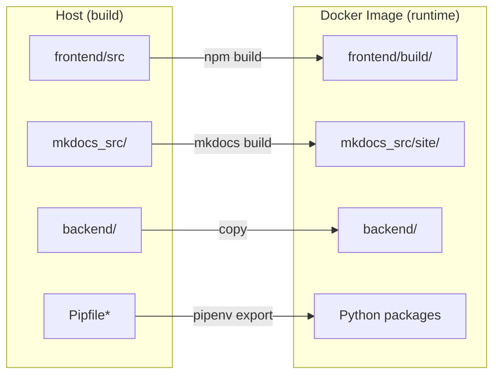
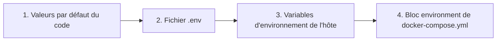

# 🐳 Guide Docker avancé

Ce guide offre un aperçu plus approfondi de la configuration Docker de LibreFolio, destiné aux utilisateurs qui souhaitent personnaliser leur déploiement.

## ⚠️ Prérequis

!!! warning "Groupe Docker (Linux)"

    Sous Linux, votre utilisateur doit appartenir au groupe `docker` pour exécuter les commandes Docker sans `sudo` :

    ```bash
    sudo usermod -aG docker $USER
    ```

    Ensuite, **déconnectez-vous puis reconnectez-vous**, ou exécutez `newgrp docker` pour activer le groupe dans la session en cours. Sans cela, toutes les commandes `docker` et `docker compose` échoueront avec une erreur de permission.

!!! warning "Fichier `.env` requis"

    LibreFolio nécessite un fichier `.env` à la racine du projet. S'il est manquant, `./dev.py docker build` refusera de continuer.

    ```bash
    cp .env.example .env
    $EDITOR .env # vérifiez et personnalisez les paramètres
    ```

## 🏗️ Architecture

LibreFolio utilise une **image Docker d'exécution uniquement**. Le frontend (SvelteKit) et la documentation (MkDocs) sont compilés sur l'hôte puis copiés dans l'image. La commande `./dev.py docker build` gère cela automatiquement.



### 🌐 Cache de ressources à la compilation (polices et JS)

LibreFolio télécharge quelques ressources externes au moment de la compilation et conserve un cache local versionné, afin que l'application livrée fonctionne entièrement hors ligne :

- **Noto Color Emoji** (depuis Google Fonts) → `frontend/static/fonts/noto-color-emoji/` — permet aux emojis de drapeaux de s'afficher correctement sur Windows.
- **MathJax** (depuis un CDN) → `mkdocs_src/docs/javascripts/vendor/` — affiche les formules LaTeX dans la documentation.

Le cache est rafraîchi automatiquement par `./dev.py server`, `./dev.py front build` et `./dev.py docker build`. Vous pouvez également le rafraîchir manuellement avec `./dev.py cache js` (`--force` pour tout retélécharger).

!!! warning "Un téléchargement échoué fait échouer la compilation — c'est voulu"

    Si une ressource **ne peut pas être téléchargée et qu'aucune copie en cache n'existe encore**, la compilation s'arrête au lieu de livrer silencieusement une image défectueuse (une ancienne image Docker a été livrée pendant des mois avec une erreur 404 sur la police d'emoji, si bien que les drapeaux s'affichaient comme de simples lettres sur Windows). Attendez-vous à une erreur comme :

    ```text
    ❌ Resource cache incomplete — the build would ship without these:
    - noto-color-emoji: ...
    ```

    Cela signifie que la **première compilation nécessite un accès à Internet** (ou un cache prérempli). L'échec est auto-réparateur : une fois le réseau rétabli, il suffit de relancer la compilation et le cache se remplit. Le serveur de développement (`./dev.py server`) reste quant à lui non bloquant — avec un cache chaud, il fonctionne hors ligne ; sinon, il émet un avertissement et se rabat sur le CDN.

## 📄 `docker-compose.yml`

Le fichier `docker-compose.yml` définit le service et le répertoire de données persistantes.

### 🔝 Priorité de résolution {: #resolution-priority }

Lors de la résolution des variables de configuration, LibreFolio respecte l'ordre de priorité suivant (de la priorité la plus basse à la plus haute) :



### 🔧 Service : `librefolio`

- 🏗️ **`build: .`** : Construit à partir du `Dockerfile` à la racine du projet.
- 🔌 **`ports`** : Mappe le port hôte (`${PORT:-6040}`) vers le port `6040` du conteneur, et `${TEST_PORT:-6041}` vers `6041` pour le mode test.
- 📂 **`volumes`** : Un montage lié `./LibreFolio-data` → `/app/backend/data/prod-docker` persiste la base de données, les téléversements, les rapports de courtier et les journaux **dans le même répertoire que `docker-compose.yml`**.
- 📝 **`env_file: .env`** : Charge toute la configuration depuis le fichier `.env` (copié depuis `.env.example`).
- 🌍 **`environment`** : Ne remplace que les valeurs spécifiques à Docker : `LIBREFOLIO_DATA_DIR` (chemin dans le conteneur) et `HOST=0.0.0.0`.
- 🩺 **`healthcheck`** : Interroge `GET /api/v1/system/health` toutes les 30 secondes.

### 💾 Répertoire de données : `LibreFolio-data/`

Un répertoire en **montage lié** créé à côté de `docker-compose.yml`. Il contient la base de données SQLite, les téléversements personnalisés, les rapports de courtier et les fichiers journaux. Les données survivent à l'arrêt, au redémarrage et à la suppression du conteneur. Vous pouvez le sauvegarder directement depuis le système de fichiers de l'hôte.

### 👤 Utilisateur et permissions

Le conteneur LibreFolio s'exécute en tant qu'**utilisateur non root** pour des raisons de sécurité. L'UID/GID par défaut est `1000:1000`. Les fichiers créés par l'application dans `LibreFolio-data/` appartiendront à cet UID/GID sur l'hôte.

#### Choisir le bon UID et le bon GID

Définissez `UID` et `GID` dans votre fichier `.env` pour correspondre à l'**utilisateur hôte** (ou à l'utilisateur dédié) qui doit posséder les fichiers de données :

```bash
UID=1000
GID=1000
```

!!! note "Comment `ls -l` affiche la propriété"

    Sur l'**hôte**, `ls -l LibreFolio-data/` affiche le nom d'utilisateur/groupe que vous avez choisi (résolu à partir de l'UID/GID via `/etc/passwd`).

    **À l'intérieur du conteneur**, les mêmes fichiers apparaissent comme `librefolio:librefolio` — c'est le même UID/GID numérique, simplement résolu avec le `/etc/passwd` propre au conteneur.

??? tip "Aide-mémoire Linux : utilisateurs, groupes et identifiants"

    **Découvrez votre UID et votre GID actuels :**

    ```bash
    id -u # votre ID utilisateur (p. ex. 1000)
    id -g # votre ID de groupe principal (p. ex. 1000)
    id # informations complètes : uid, gid, groupes
    ```

    **Trouvez l'UID/GID d'un utilisateur :**

    ```bash
    id -u username # UID de 'username'
    id -g username # GID principal de 'username'
    ```

    **Créez un nouveau groupe :**

    ```bash
    sudo groupadd librefolio # crée un groupe (attribue automatiquement un GID)
    sudo groupadd -g 1500 librefolio # crée un groupe avec un GID spécifique
    ```

    **Créez un nouvel utilisateur :**

    ```bash
    # Utilisateur système (sans répertoire personnel, sans connexion — idéal pour les services)
    sudo useradd --system --no-create-home --gid librefolio --shell /usr/sbin/nologin librefolio

    # Utilisateur classique avec répertoire personnel
    sudo useradd -m -g librefolio librefolio
    ```

    **Vérifiez les identifiants attribués :**

    ```bash
    id librefolio
    # → uid=998(librefolio) gid=998(librefolio) groups=998(librefolio)
    ```

    **Ajoutez votre utilisateur existant à un groupe :**

    ```bash
    sudo usermod -aG librefolio $USER
    newgrp librefolio # active dans la session en cours (ou déconnexion/reconnexion)
    ```

    **Vérifiez l'appartenance à un groupe :**

    ```bash
    groups $USER # liste tous les groupes de votre utilisateur
    ```

    **Définissez la propriété du répertoire de données :**

    ```bash
    sudo chown -R librefolio:librefolio ./LibreFolio-data
    ```

    Ensuite, définissez l'UID/GID correspondant dans `.env`.

## 🛠️ Commandes CLI

Toutes les opérations Docker sont disponibles via `dev.py` :

```bash
./dev.py docker build # Construit l'image (compile automatiquement le frontend + la doc)
./dev.py docker build --light # Variante allégée : pas d'images de documentation (tag *-light, ~1,5 Go vs ~2,9 Go pour la version complète)
./dev.py docker build --no-cache # Reconstruction complète sans cache Docker
./dev.py docker rebuild # Compilation → arrêt → redémarrage (déploiement en une étape)
./dev.py docker up # Démarre les conteneurs
./dev.py docker down # Arrête les conteneurs
./dev.py docker logs -f # Suit les journaux du conteneur
./dev.py docker status # Affiche l'état des conteneurs
./dev.py docker exec <cmd> # Exécute une commande dev.py dans le conteneur
```

La variante `--light` livre la même application mais sans les captures d'écran de documentation incluses dans l'image (elles sont alors chargées à la demande depuis le site de documentation en ligne), et porte un suffixe `-light`. Voir [Variantes d'image](../user/installation.md#image-variants-full-and-light) dans le guide d'installation utilisateur.

!!! tip "Documentation avec captures d'écran"

    Si vous compilez la documentation et souhaitez des captures d'écran complètes dans la galerie, exécutez :

    ```bash
    ./dev.py mkdocs gallery
    ```

    Cela nécessite un environnement entièrement installé (avec `pipenv`) et les navigateurs Playwright. La commande démarre son propre serveur de test et remplit automatiquement la base de données de test (utilisez `--no-populate` pour ne pas repopuler). Soyez patient — la génération de la galerie prend quelques minutes.

### 📡 `docker exec` — Exécuter des commandes dans le conteneur

La sous-commande `docker exec` transmet n'importe quelle commande `dev.py` au conteneur en cours d'exécution :

```bash
./dev.py docker exec user create admin admin@example.com Pass123!
./dev.py docker exec user list
./dev.py docker exec db upgrade
./dev.py docker exec server --test
```

Cela équivaut à exécuter `docker compose exec librefolio python dev.py <cmd>`.

## 🧪 Mode test

La configuration Docker Compose expose **deux ports** :

| Port | Objectif | Base de données |
|------|----------|-----------------|
| `6040` | Serveur de production (démarré par la commande CMD du conteneur) | `prod-docker/sqlite/app.db` (volume persistant) |
| `6041` | Serveur de test (démarré manuellement via `docker exec`) | `test/sqlite/app.db` (éphémère) |

### Démarrage du serveur de test

1. **Démarrez le conteneur** (le serveur de production démarre automatiquement sur `:6040`) :

 ```bash
 docker compose up -d
 ```

2. **Remplissez la base de données de test** avec des données simulées :

 ```bash
 ./dev.py docker exec test db populate --force --with-static
 ```

3. **Démarrez le serveur de test** sur le port 6041 :

 ```bash
 ./dev.py docker exec server --test
 ```

4. **Accédez** à **`http://localhost:6041`**

 Identifiants de test :

 | Nom d'utilisateur | Mot de passe |
 |-------------------|--------------|
 | `e2e_test_user` | `E2eTestPass123!` |
 | `e2e_test_admin` | `E2eAdminPass123!` |

!!! warning "Les données de test sont éphémères"

    La base de données de test se trouve dans la **couche en écriture** du conteneur, et non sur un montage lié persistant. Cela signifie :

    - ✅ Les données survivent à `docker compose stop` / `docker compose start` (le conteneur est arrêté, pas supprimé).
    - ❌ Les données sont **perdues** avec `docker compose down` (le conteneur est supprimé puis recréé).

    Si vous avez besoin de données de test persistantes, ajoutez un montage lié dédié dans `docker-compose.yml` :

    ```yaml
    volumes:
    - ./LibreFolio-data:/app/backend/data/prod-docker
    - ./LibreFolio-test-data:/app/backend/data/test # ← ajoutez ceci
    ```

## 🏭 Considérations pour la production

### 🎮 1. Personnalisation de `docker-compose.yml`

Le dépôt inclut un `docker-compose.yml` prêt à l'emploi. Voici le fichier complet avec des annotations montrant ce que vous pouvez personnaliser :

```yaml
services:
 librefolio:
 image: librefolio:latest # Construite par ./dev.py docker build
 build:
 context: .
 args:
 UID: ${UID:-1000} # (1) Correspond à l'UID de l'utilisateur hôte
 GID: ${GID:-1000} # (1) Correspond au GID de l'utilisateur hôte
 container_name: librefolio
 # Pas de directive 'user:' — l'entrypoint démarre en root, corrige les permissions,
 # puis passe à l'utilisateur 'librefolio' via gosu (même modèle que postgres/redis).
 restart: unless-stopped
 ports:
 - "${PORT:-6040}:6040" # (2) Port de production — modifiable via PORT dans .env
 - "${TEST_PORT:-6041}:6041" # (3) Port du serveur de test (facultatif)
 volumes:
 - ./LibreFolio-data:/app/backend/data/prod-docker # (4) Données persistantes (montage lié)
 env_file: .env # (5) Toute la configuration depuis le fichier .env
 environment:
 - LIBREFOLIO_DATA_DIR=/app/backend/data/prod-docker # Remplacement spécifique à Docker
 - HOST=0.0.0.0
 healthcheck:
 test: ["CMD", "python", "-c", "import urllib.request; urllib.request.urlopen('http://localhost:6040/api/v1/system/health')"]
 interval: 30s
 timeout: 10s
 start_period: 15s
 retries: 3
```

**Personnalisations courantes :**

| # | Quoi | Comment |
|---|------|---------|
| (1) | Faire correspondre l'UID/GID de l'hôte | Définissez `UID=1001` et `GID=1001` dans `.env`, puis recompilez |
| (2) | Changer le port de production | Définissez `PORT=3000` dans `.env` |
| (3) | Désactiver le port de test | Supprimez la ligne `TEST_PORT` de `ports:` |
| (4) | Chemin de données personnalisé | Modifiez le montage lié : `./my-data:/app/backend/data/prod-docker` |
| (5) | Toute la configuration | Modifiez le fichier `.env` (copié depuis `.env.example`) |

!!! tip "Premier utilisateur"

    La première fois que vous accédez à LibreFolio dans le navigateur, vous verrez une page d'inscription. Créez votre compte directement — le premier utilisateur devient automatiquement l'administrateur. Aucune CLI n'est nécessaire.

### 🔒 2. Sécurité et exposition (Tailscale et proxy inverse)

Il est vivement recommandé d'exposer LibreFolio de manière sécurisée en utilisant **Tailscale** (choix recommandé et le plus simple) ou derrière un proxy inverse classique comme **Nginx** ou **Traefik**.

* **Tailscale (recommandé)** : Permet d'exposer LibreFolio de manière sécurisée avec HTTPS automatique, sans ouvrir de ports sur le routeur ni configurer d'enregistrements DNS publics. Voir le **[Guide d'exposition Tailscale](service_exposure.md)** détaillé.
* **Proxy inverse classique (Nginx/Traefik)** : Utile si vous disposez déjà d'une infrastructure web existante ou si vous souhaitez :
 - 🔐 Gérer des certificats SSL/TLS personnalisés pour HTTPS.
 - 🖥️ Servir plusieurs applications sur le même serveur.
 - 🛡️ Ajouter des en-têtes de sécurité personnalisés et une limitation de débit.

### 💾 3. Sauvegarde de la base de données

La base de données est stockée dans le répertoire `LibreFolio-data/` à côté de `docker-compose.yml`. Aucun `docker cp` n'est nécessaire — le répertoire de données est un montage lié accessible depuis l'hôte.

!!! warning "Ne copiez pas `app.db` depuis un conteneur en cours d'exécution"

    LibreFolio exécute SQLite en **mode WAL** (`PRAGMA journal_mode=WAL`) : les transactions récentes se trouvent dans le fichier auxiliaire `app.db-wal`, donc un simple `cp` de `app.db` seul pendant que le serveur est actif peut produire une sauvegarde incohérente ou obsolète. Utilisez l'une des deux procédures sûres ci-dessous.

**Option A — Arrêtez le conteneur, puis copiez** (la plus simple) :

```bash
#!/bin/bash
docker compose stop librefolio
cp ./LibreFolio-data/sqlite/app.db /path/to/backups/app.db-$(date +%F)
docker compose start librefolio
```

**Option B — Sauvegarde en ligne avec la CLI SQLite** (aucune interruption de service, nécessite l'outil `sqlite3` sur l'hôte) :

```bash
#!/bin/bash
sqlite3 ./LibreFolio-data/sqlite/app.db ".backup '/path/to/backups/app.db-$(date +%F)'"
```

La commande `.backup` de SQLite utilise l'API de sauvegarde en ligne, qui est sûre face à une base WAL active.

Pour la liste complète de ce qu'il vaut la peine de sauvegarder (fichiers téléversés, rapports de courtier d'origine), consultez la page [Structure du système de fichiers](filesystem.md).

### 🔑 4. Variables d'environnement

Toute la configuration est gérée dans le fichier `.env` (copié depuis `.env.example`). Les remplacements spécifiques à Docker dans le bloc `environment:` ne doivent pas être modifiés.

Pour une liste complète de toutes les variables d'environnement configurables (y compris celles du fichier `.env` et les paramètres système gérés par Docker/CLI) et pour comprendre comment chacune affecte le comportement de l'application, consultez le **[Guide de configuration](configuration.md)** détaillé.
