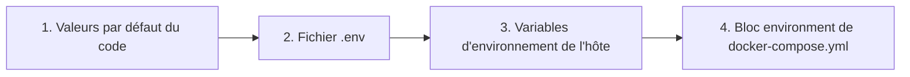

# 🐳 Guide Docker avancé

Ce guide s'adresse aux administrateurs qui personnalisent leur déploiement Docker, construisent leur propre image, ou effectuent la maintenance du conteneur. Pour une première installation, commencez par le [Guide d'installation](../user/installation.md).

LibreFolio est livré avec deux fichiers Compose :

- **`docker-compose.prod.yml`** exécute l'image officielle depuis GHCR : le guide d'installation l'enregistre sous le nom `docker-compose.yml`.
- **`docker-compose.yml`**, dans le dépôt, exécute une image que vous construisez vous-même avec `./dev.py docker build`, et mappe également le port de test `6041`.

## ⚠️ Prérequis

**Groupe Docker (Linux).** Votre utilisateur doit appartenir au groupe `docker` pour exécuter les commandes Docker sans `sudo` :

```bash
sudo usermod -aG docker $USER
```

Ensuite, **déconnectez-vous et reconnectez-vous**, ou exécutez `newgrp docker` pour activer le groupe dans la session en cours. Sans cela, toutes les commandes `docker` et `docker compose` échouent avec une erreur de permission.

**Fichier `.env`.** LibreFolio nécessite un fichier `.env` à côté du fichier Compose, et `./dev.py docker build` refuse de continuer sans lui. Dans une copie locale du dépôt :

```bash
cp .env.example .env
$EDITOR .env          # review and customize parameters
```

## 🏗️ Architecture

L'image est **exclusivement destinée à l'exécution** : l'application web (SvelteKit) et la documentation (MkDocs) sont construites sur l'hôte et copiées dedans, et `./dev.py docker build` exécute ces constructions pour vous. Étapes de construction, contenu de l'image et séquence de démarrage : [Vue d'ensemble de l'architecture → Image Docker](../developer/architecture/overview.md#docker-image).

## 📄 `docker-compose.yml`

Le fichier Compose définit le service `librefolio` et son répertoire de données persistant.

### 🔝 Priorité de résolution {: #resolution-priority }

Lors de la résolution des variables de configuration, LibreFolio respecte l'ordre de priorité suivant (du plus faible au plus élevé) :


```mermaid
graph LR
    CodeDefaults[1. Valeurs par défaut du code] --> EnvFile[2. Fichier .env]
    HostShell[3. Variables d'environnement de l'hôte]
    DockerCompose[4. Bloc environment de docker-compose.yml]

    EnvFile --> HostShell
    HostShell --> DockerCompose
```

Dans Docker, `.env` parvient au conteneur via `env_file`, et le bloc `environment:` le remplace. Pour les espaces réservés `${…}` du fichier Compose, tels que `${PORT:-6040}`, une variable définie dans votre shell l'emporte sur `.env`.

### 🔧 Service : `librefolio`

- 🏷️ **`image`** : l'image officielle `ghcr.io/librefolio/librefolio:latest` (fichier de production) ou votre image locale `librefolio:latest` (fichier du dépôt) ; `LIBREFOLIO_IMAGE` dans `.env` sélectionne un autre tag.
- 🏗️ **`build`** (fichier du dépôt uniquement) : construit le `Dockerfile` à la racine avec les arguments `UID`, `GID` et `DOCS_VARIANT`.
- 🔌 **`ports`** : hôte `${PORT:-6040}` → conteneur `6040` ; le fichier du dépôt mappe également `${TEST_PORT:-6041}` → `6041` pour le [mode test](#test-mode).
- 📂 **`volumes`** : le bind mount `./LibreFolio-data` → `/app/backend/data/prod-docker`.
- 📝 **`env_file: .env`** : charge votre configuration (copiée depuis `.env.example`).
- 🌍 **`environment`** : le `LIBREFOLIO_DATA_DIR` propre à Docker (chemin dans le conteneur) et `HOST=0.0.0.0` ; laissez-les tels quels.
- 🩺 **`healthcheck`** : interroge `GET /api/v1/system/health` toutes les 30 secondes.

### 💾 Répertoire de données : `LibreFolio-data/`

Un répertoire **bind mount** à côté du fichier Compose, contenant la base de données SQLite, les téléversements personnalisés, les rapports de courtier et les fichiers de log. Il survit à l'arrêt, au redémarrage et à la suppression du conteneur, et vous le sauvegardez directement depuis l'hôte.

### 👤 Utilisateur et permissions

Le conteneur démarre en root uniquement pour transférer le répertoire de données à l'utilisateur LibreFolio, puis exécute le serveur sous cet utilisateur **non-root** : les fichiers qu'il crée dans `LibreFolio-data/` appartiennent à cet UID/GID sur l'hôte. Le transfert s'exécute à chaque démarrage et couvre tout le contenu du répertoire.

Cet UID/GID provient des **arguments de construction** `UID` et `GID` : l'image les conserve sous les noms `LIBREFOLIO_UID` et `LIBREFOLIO_GID`, que le point d'entrée lit à chaque démarrage. L'image officielle GHCR est construite avec `1000:1000`. `./dev.py docker build` utilise les identifiants de l'utilisateur qui l'exécute, quoi que dise `.env`, tandis que `docker compose build` lit `UID` et `GID` depuis `.env` (par défaut `1000`) : définissez-les pour correspondre à l'utilisateur de l'hôte, ou à l'utilisateur dédié, qui doit posséder les fichiers de données :

```bash
UID=1000
GID=1000
```

Les modifier dans `.env` ne prend effet que lorsque `docker compose build` reconstruit l'image : `.env` parvient aussi au conteneur via `env_file`, mais un redémarrage ne change pas les identifiants. Avec l'image officielle, que vous ne construisez pas, ces deux lignes n'ont aucun effet.

- Sur l'**hôte**, `ls -l LibreFolio-data/` affiche l'utilisateur et le groupe qui possèdent cet UID/GID sur l'hôte (résolus via `/etc/passwd` et `/etc/group`).
- **À l'intérieur du conteneur**, les mêmes fichiers apparaissent généralement comme `librefolio:librefolio` : le même UID/GID numérique, résolu face aux `/etc/passwd` et `/etc/group` propres au conteneur.

??? tip "Aide-mémoire Linux : utilisateurs, groupes et identifiants"

    **Découvrir votre UID et GID actuels :**

    ```bash
    id -u              # your user ID (e.g. 1000)
    id -g              # your primary group ID (e.g. 1000)
    id                 # full info: uid, gid, groups
    ```

    **Trouver l'UID/GID d'un utilisateur quelconque :**

    ```bash
    id -u username     # UID of 'username'
    id -g username     # primary GID of 'username'
    ```

    **Créer un nouveau groupe :**

    ```bash
    sudo groupadd librefolio          # create group (auto-assigns GID)
    sudo groupadd -g 1500 librefolio  # create group with specific GID
    ```

    **Créer un nouvel utilisateur :**

    ```bash
    # System user (no home, no login — ideal for services)
    sudo useradd --system --no-create-home --gid librefolio --shell /usr/sbin/nologin librefolio

    # Regular user with home directory
    sudo useradd -m -g librefolio librefolio
    ```

    **Vérifier les identifiants attribués :**

    ```bash
    id librefolio
    # → uid=998(librefolio) gid=998(librefolio) groups=998(librefolio)
    ```

    **Ajouter votre utilisateur existant à un groupe :**

    ```bash
    sudo usermod -aG librefolio $USER
    newgrp librefolio    # activate in current session (or log out/in)
    ```

    **Vérifier l'appartenance aux groupes :**

    ```bash
    groups $USER         # list all groups for your user
    ```

    **Définir la propriété du répertoire de données :**

    ```bash
    sudo chown -R librefolio:librefolio ./LibreFolio-data
    ```

    Définissez ensuite l'UID/GID correspondant dans `.env` et reconstruisez l'image avec `docker compose build` : à chaque démarrage, le conteneur transfère le répertoire à l'UID/GID de l'image.

## 🛠️ Commandes CLI

Dans une copie locale du dépôt, `dev.py` encapsule les opérations Docker :

```bash
./dev.py docker build          # Build image (auto-builds frontend + docs)
./dev.py docker build --light  # Light variant: no documentation screenshots (tagged *-light)
./dev.py docker build --no-cache  # Full rebuild without Docker cache
./dev.py docker rebuild        # Build → stop → restart (one-step deploy)
./dev.py docker up             # Start containers
./dev.py docker down           # Stop containers
./dev.py docker logs -f        # Follow container logs
./dev.py docker status         # Show container status
./dev.py docker exec <cmd>     # Run a dev.py command inside the container
```

Sans copie locale, les commandes simples suffisent au quotidien : `docker compose up -d`, `docker compose down`, `docker compose logs -f` et `docker compose ps`.

- `--light` construit l'image sans les captures d'écran de la documentation, qui sont alors chargées depuis le site de documentation en ligne (voir [Variantes d'image](../user/installation.md#image-variants-full-and-light)).
- Tags locaux : `librefolio:<version>` et `librefolio:latest` pour l'image complète, `librefolio:<version>-light` et `librefolio:latest-light` pour l'allégée, `<version>` étant la version git de votre copie locale. Sur le registre en revanche, `latest` est la variante allégée et il n'y a pas de `latest-light`.
- Pour exécuter votre version allégée avec le fichier Compose du dépôt, définissez `LIBREFOLIO_IMAGE=librefolio:latest-light` dans `.env`.

??? warning "🧱 Quand `./dev.py docker build` s'arrête"

    **Une ressource ne peut pas être téléchargée.** La construction met en cache quelques ressources externes, comme la police Noto Color Emoji (drapeaux sous Windows) et MathJax (formules dans la documentation), afin que l'image fonctionne entièrement hors ligne. Si l'une d'elles ne peut pas être téléchargée et qu'aucune copie en cache n'existe encore, la construction s'arrête au lieu de livrer une image défectueuse :

    ```text
    ❌ Resource cache incomplete — the build would ship without these:
       - noto-color-emoji: ...
    ```

    La **première construction nécessite un accès à Internet** (ou un cache prérempli). Une fois le réseau rétabli, relancez la construction ; `./dev.py cache js` rafraîchit le cache manuellement (`--force` re-télécharge tout).

    **Le frontend est une version de débogage.** L'image doit livrer la version de production de l'application web. Si `frontend/build/` a été construit pour la dernière fois en mode debug (par exemple par `./dev.py server --test`, `./dev.py server --debug` ou le lanceur de tests) ou instrumenté pour la couverture, la construction de l'image s'arrête avec une erreur du type :

    ```text
    ERROR: /build is not a production frontend build: it is a debug build (.build-debug = 1)
    Rebuild it with './dev.py front build', then build the image again.
    ```

    Exécutez `./dev.py front build`, puis reconstruisez l'image : `./dev.py docker build` ne reconstruit le frontend de lui-même que lorsque ses sources ont changé, pas lorsque la dernière construction était une version de débogage.

??? tip "🖼️ Construire une image complète avec les captures d'écran de la documentation"

    Une image complète ne contient les captures d'écran de la documentation que si elles ont été générées, et la documentation reconstruite avec elles, **avant** la construction de l'image : sinon une image complète locale et une image allégée sont identiques hormis leur tag. La séquence complète est :

    ```bash
    ./dev.py mkdocs gallery   # generate the screenshots
    ./dev.py front build      # the gallery leaves a debug frontend build: rebuild it for production
    ./dev.py mkdocs build     # rebuild the documentation with the screenshots
    ./dev.py docker build     # build the full image
    ```

    `./dev.py mkdocs gallery` nécessite un environnement entièrement installé (avec `pipenv`) et les navigateurs Playwright. Il démarre son propre serveur de test et alimente automatiquement la base de données de test (`--no-populate` saute le réensemencement). La génération de la galerie prend quelques minutes.

### 📡 `docker exec` — Exécuter des commandes dans le conteneur {: #docker-exec }

`./dev.py docker exec <cmd>` exécute une commande `dev.py` à l'intérieur du conteneur **en cours d'exécution** : c'est équivalent à `docker compose exec librefolio python dev.py <cmd>`. Par exemple, pour gérer les utilisateurs :

```bash
./dev.py docker exec user create admin admin@example.com Pass123!
./dev.py docker exec user list
```

Dans l'image, `user`, `db` et `info` fonctionnent. Les commandes de développement (`test`, `i18n`, `mkdocs translate` et `mkdocs translate-validate`) sont aussi listées, mais elles répondent seulement qu'elles ne sont *pas disponibles dans cette installation* : l'image livre l'application, pas l'arborescence de développement.

Les commandes du mode test ne s'exécutent pas non plus dans le conteneur ; comme `./dev.py mkdocs gallery`, elles appartiennent à une copie locale de développement :

- `./dev.py docker exec test db populate` obtient la même réponse *pas disponible* que toutes les commandes `test` ;
- `./dev.py docker exec server --test` s'arrête avec `Frontend build failed. Server not started.` : le mode test essaie d'abord de reconstruire l'application web en mode debug, ce qui nécessite Node.js et les sources de l'application web, alors que l'image ne livre que la version de production, sans Node.js.

**Les migrations de base de données ne nécessitent aucune commande.** Le serveur applique les migrations en attente à chaque démarrage : après `docker compose pull` et `docker compose up -d`, il n'y a rien d'autre à exécuter, et `docker compose restart librefolio` les réessaie après un échec. N'utilisez pas `./dev.py docker exec db upgrade` : `db upgrade` nécessite que le serveur soit arrêté, et dans le conteneur le serveur est le processus principal, toujours en cours d'exécution.

## 🩹 Correctifs post-migration {: #post-migration-fixes }

À chaque démarrage du serveur, juste après avoir appliqué toute migration de base de données en attente, il exécute les **correctifs post-migration** : des réparations qu'une migration ne peut pas effectuer. Ce qu'ils réparent, et ce que le log en dit, est expliqué dans [Outils en ligne de commande → Correctifs post-migration](cli_tools.md#post-migration-fixes). Dans Docker :

- le log correspond à la sortie du conteneur (`./dev.py docker logs` ou `docker compose logs`), également enregistrée dans `LibreFolio-data/logs/` ;
- une copie conservée par un correctif échoué se trouve à côté de la base de données, dans `LibreFolio-data/sqlite/`, par exemple `app.db.pre-autoincrement-20261008T101500Z.bak`.

### ⏹️ Exécuter les correctifs avec le serveur arrêté

Pour prévisualiser les correctifs, ou pour réessayer un correctif qui a échoué au démarrage et lire son erreur, exécutez-les manuellement avec le serveur arrêté. `docker exec` nécessite un conteneur en cours d'exécution, utilisez donc plutôt `docker compose run` : la commande que vous passez remplace le serveur dans un conteneur ponctuel. Prévisualisez toujours d'abord avec `--dry-run` :

```bash
docker compose stop librefolio
docker compose run --rm librefolio python -m backend.app.db.post_migration --dry-run   # preview: changes nothing
docker compose run --rm librefolio python -m backend.app.db.post_migration             # apply the fixes
docker compose start librefolio
```

Le script travaille sur la même base de données et le même répertoire de données que le serveur et signale ce qu'il a trouvé, par exemple :

```text
Database: /app/backend/data/prod-docker/sqlite/app.db
Integrity check: ok
Fix autoincrement: would_apply
Orphan broker folder: broker_reports/uploaded/broker_7
```

Chaque correctif est `clean` (rien à faire), `would_apply` (exécution à blanc), `applied` ou `failed` ; une sauvegarde conservée et toute erreur sont également listées. Le code de sortie est `0` quand rien n'a échoué, y compris lors d'une exécution à blanc, et `1` quand un correctif ou la vérification d'intégrité a échoué.

## 🧪 Mode test {: #test-mode }

Le `docker-compose.yml` du dépôt expose **deux ports** :

| Port | Objectif | Base de données |
|------|---------|----------|
| `6040` | Serveur de production, démarré avec le conteneur | `LibreFolio-data/sqlite/app.db` (bind mount persistant) |
| `6041` | Serveur de test, un outil de développeur | Aucune : le serveur de test ne démarre pas dans le conteneur. Dans une copie locale de développement, il utilise par défaut `backend/data/test/sqlite/app.db`, que `./dev.py test db populate --force` supprime et recrée avec des données simulées |

Le serveur de test est destiné aux développeurs : comment le démarrer, et pourquoi il ne démarre pas avec l'image actuelle, est expliqué dans le [Flux de travail développeur](../developer/dev_workflow.md#docker-test-mode). `docker-compose.prod.yml` n'a pas de port de test ; dans le fichier du dépôt, supprimez la ligne `TEST_PORT` de `ports:` pour le fermer.

## 🏭 Considérations de production

### 🎮 1. Personnaliser `docker-compose.yml`

Les modifications les plus courantes :

| # | Quoi | Comment |
|---|------|-----|
| (1) | Faire correspondre l'UID/GID de l'hôte | Reconstruire l'image avec eux : exécutez `./dev.py docker build` en tant qu'utilisateur qui doit posséder les fichiers, ou définissez `UID=1001` et `GID=1001` dans `.env` et exécutez `docker compose build` |
| (2) | Changer le port de production | Définissez `PORT=3000` dans `.env` |
| (3) | Désactiver le port de test | Supprimez la ligne `TEST_PORT` de `ports:` |
| (4) | Chemin de données personnalisé | Changez le bind mount : `./my-data:/app/backend/data/prod-docker` |
| (5) | Toute la configuration | Modifiez le fichier `.env` (copié depuis `.env.example`) |
| (6) | Exécuter un autre tag d'image | Définissez `LIBREFOLIO_IMAGE` dans `.env`, par exemple `LIBREFOLIO_IMAGE=ghcr.io/librefolio/librefolio:1.1.0` |

Le premier compte créé dans le navigateur devient automatiquement administrateur : aucune commande nécessaire.

??? example "📄 Le `docker-compose.yml` du dépôt, annoté"

    ```yaml
    services:
      librefolio:
        image: ${LIBREFOLIO_IMAGE:-librefolio:latest}  # (6) Built by ./dev.py docker build
        build:
          context: .
          args:
            UID: ${UID:-1000}              # (1) UID owning the data files (build time only)
            GID: ${GID:-1000}              # (1) GID owning the data files (build time only)
            DOCS_VARIANT: ${DOCS_VARIANT:-full}  # light = no documentation screenshots
        container_name: librefolio
        # No 'user:' directive — entrypoint starts as root, fixes permissions,
        # then drops to 'librefolio' user via gosu (same pattern as postgres/redis).
        restart: unless-stopped
        ports:
          - "${PORT:-6040}:6040"           # (2) Production port — change via PORT in .env
          - "${TEST_PORT:-6041}:6041"      # (3) Test server port (optional)
        volumes:
          - ./LibreFolio-data:/app/backend/data/prod-docker  # (4) Persistent data (bind mount)
        env_file: .env                     # (5) All config from .env file
        environment:
          - LIBREFOLIO_DATA_DIR=/app/backend/data/prod-docker  # Docker-specific override
          - HOST=0.0.0.0
        healthcheck:
          test: ["CMD", "python", "-c", "import urllib.request; urllib.request.urlopen('http://localhost:6040/api/v1/system/health')"]
          interval: 30s
          timeout: 10s
          start_period: 15s
          retries: 3
    ```

    `docker-compose.prod.yml` contient le même service sans `build:` et sans le port de test, et son image pointe par défaut vers `ghcr.io/librefolio/librefolio:latest`.

### 🔒 2. Sécurité et exposition (Tailscale et proxy inverse)

Exposez LibreFolio de manière sécurisée via **Tailscale** (recommandé, et le choix le plus simple) ou derrière un proxy inverse classique tel que **Nginx** ou **Traefik** :

- **Tailscale (recommandé)** : accès sécurisé avec HTTPS automatique, sans ouvrir de ports sur le routeur ni configurer d'enregistrements DNS publics. Voir le **[Guide d'exposition Tailscale](service_exposure.md)** détaillé.
- **Proxy inverse classique (Nginx/Traefik)** : utile si vous disposez déjà d'une infrastructure web, ou si vous souhaitez gérer des certificats SSL/TLS personnalisés, servir plusieurs applications sur un même serveur, ou ajouter des en-têtes de sécurité personnalisés et une limitation de débit.

LibreFolio compresse déjà ses réponses en gzip (JSON de l'API, JavaScript et CSS de l'application web, pages de documentation) et envoie les images et le flux de recherche d'actifs en direct tels quels : le proxy n'a pas besoin de les compresser à nouveau.

### 💾 3. Sauvegarde de la base de données

La base de données est stockée dans le répertoire `LibreFolio-data/` à côté de `docker-compose.yml`. Aucun `docker cp` nécessaire — le répertoire de données est un bind mount accessible depuis l'hôte.

!!! warning "Ne copiez pas `app.db` depuis un conteneur en cours d'exécution"

    LibreFolio exécute SQLite en **mode WAL** (`PRAGMA journal_mode=WAL`) : les transactions récentes résident dans le fichier annexe `app.db-wal`, donc une simple `cp` de `app.db` seul pendant que le serveur est actif peut produire une sauvegarde incohérente ou obsolète. Utilisez l'une des deux procédures sûres ci-dessous.

**Option A — Arrêter le conteneur, puis copier** (la plus simple) :

```bash
#!/bin/bash
docker compose stop librefolio
cp ./LibreFolio-data/sqlite/app.db /path/to/backups/app.db-$(date +%F)
docker compose start librefolio
```

**Option B — Sauvegarde en ligne avec la CLI SQLite** (sans interruption de service, nécessite l'outil `sqlite3` sur l'hôte) :

```bash
#!/bin/bash
sqlite3 ./LibreFolio-data/sqlite/app.db ".backup '/path/to/backups/app.db-$(date +%F)'"
```

La commande `.backup` de SQLite utilise l'API de sauvegarde en ligne, qui est sûre face à une base de données WAL active.

Pour la liste complète de ce qu'il vaut la peine de sauvegarder (fichiers téléversés, rapports de courtier originaux), voir la page [Organisation du système de fichiers](filesystem.md).

Fichiers que vous pouvez trouver à côté de la base de données :

- `app.db.pre-<fix>-<UTC time>.bak` : une copie conservée par un [correctif post-migration](#post-migration-fixes) qui a échoué ; supprimez-la quand vous n'en avez plus besoin.
- `app.db.post-migration.lock` : le fichier de verrouillage vide des [correctifs post-migration](#post-migration-fixes), réutilisé à chaque démarrage. Il est inoffensif : laissez-le en place, car le supprimer pendant le démarrage du serveur pourrait laisser deux exécutions se chevaucher.

### 🔑 4. Variables d'environnement

Toute la configuration est gérée dans le fichier `.env` (copié depuis `.env.example`) ; laissez les remplacements propres à Docker du bloc `environment:` tels quels. Pour chaque variable et son effet, voir le **[Guide de configuration](configuration.md)**.

🔐 **Maintenir les utilisateurs connectés entre les redémarrages** : définissez `JWT_SECRET` dans `.env` comme une longue chaîne aléatoire, par exemple la sortie de `openssl rand -hex 32`. Sans cela, LibreFolio génère une nouvelle clé à chaque démarrage, si bien que chaque redémarrage ou mise à jour du conteneur déconnecte tous les utilisateurs.
