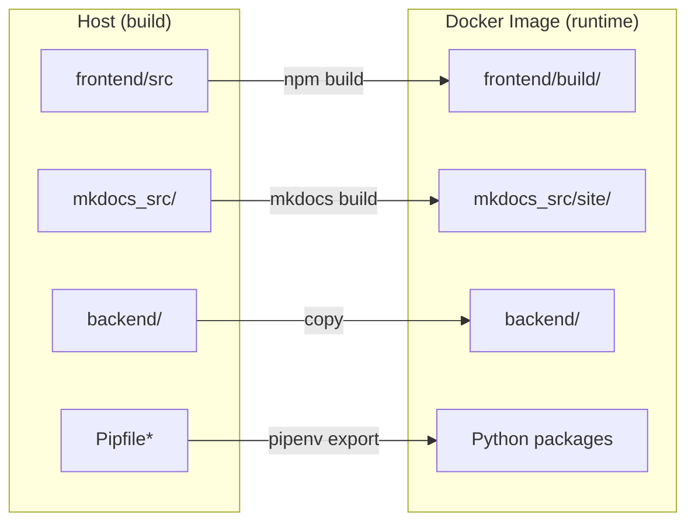
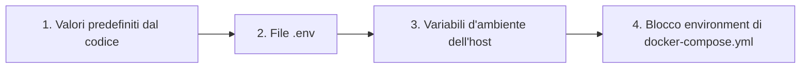

# 🐳 Guida Docker avanzata

Questa guida offre uno sguardo più approfondito sulla configurazione Docker di LibreFolio, pensata per gli utenti che vogliono personalizzare la propria distribuzione.

## ⚠️ Prerequisiti

!!! warning "Gruppo Docker (Linux)"

    Su Linux, il tuo utente deve appartenere al gruppo `docker` per eseguire i comandi Docker senza `sudo`:

    ```bash
    sudo usermod -aG docker $USER
    ```

    Poi **disconnettiti e riconnettiti**, oppure esegui `newgrp docker` per attivare il gruppo nella sessione corrente. In caso contrario, tutti i comandi `docker` e `docker compose` falliranno con un errore di autorizzazione.

!!! warning "File `.env` richiesto"

    LibreFolio richiede un file `.env` nella radice del progetto. Se manca, `./dev.py docker build` rifiuterà di procedere.

    ```bash
    cp .env.example .env
    $EDITOR .env # rivedi e personalizza i parametri
    ```

## 🏗️ Architettura

LibreFolio utilizza un'**immagine Docker di solo runtime**. Il frontend (SvelteKit) e la documentazione (MkDocs) vengono generati sull'host e poi copiati nell'immagine. Il comando `./dev.py docker build` gestisce tutto automaticamente.



### 🌐 Cache delle risorse in fase di build (font e JS)

LibreFolio scarica alcune risorse esterne in fase di build e mantiene una cache locale versionata, così l'applicazione distribuita funziona completamente offline:

- Il font **Noto Color Emoji** (da Google Fonts) → `frontend/static/fonts/noto-color-emoji/` — consente di visualizzare correttamente le emoji delle bandiere su Windows.
- **MathJax** (da una CDN) → `mkdocs_src/docs/javascripts/vendor/` — renderizza le formule LaTeX nella documentazione.

La cache viene aggiornata automaticamente da `./dev.py server`, `./dev.py front build` e `./dev.py docker build`. Puoi anche aggiornarla manualmente con `./dev.py cache js` (`--force` per riscaricare tutto).

!!! warning "Un download fallito interrompe la build — di proposito"

    Se una risorsa **non può essere scaricata e non esiste ancora una copia in cache**, la build si interrompe invece di distribuire silenziosamente un'immagine danneggiata (in passato un'immagine Docker è stata distribuita per mesi con un 404 sul font delle emoji, così le bandiere venivano visualizzate come semplici lettere su Windows). Aspettati un errore del tipo:

    ```text
    ❌ Resource cache incomplete — the build would ship without these:
    - noto-color-emoji: ...
    ```

    Questo significa che la **prima build richiede accesso a Internet** (o una cache pre-riscaldata). L'errore si risolve da solo: appena la rete torna disponibile, basta rilanciare la build e la cache si riempie. Il server di sviluppo (`./dev.py server`), invece, resta non bloccante — con una cache calda funziona offline, altrimenti avvisa e fa fallback sulla CDN.

## 📄 `docker-compose.yml`

Il file `docker-compose.yml` definisce il servizio e la directory dei dati persistenti.

### 🔝 Priorità di risoluzione {: #resolution-priority }

Quando risolve le variabili di configurazione, LibreFolio rispetta il seguente ordine di precedenza (dalla priorità più bassa alla più alta):



### 🔧 Servizio: `librefolio`

- 🏗️ **`build: .`**: Esegue la build a partire dal `Dockerfile` nella radice del progetto.
- 🔌 **`ports`**: Mappa la porta dell'host (`${PORT:-6040}`) sulla porta `6040` del container, e `${TEST_PORT:-6041}` sulla `6041` per la modalità di test.
- 📂 **`volumes`**: Un bind mount `./LibreFolio-data` → `/app/backend/data/prod-docker` rende persistenti database, upload, report dei broker e log **nella stessa directory in cui si trova `docker-compose.yml`**.
- 📝 **`env_file: .env`**: Carica tutta la configurazione dal file `.env` (copiato da `.env.example`).
- 🌍 **`environment`**: Sovrascrive solo i valori specifici di Docker: `LIBREFOLIO_DATA_DIR` (percorso nel container) e `HOST=0.0.0.0`.
- 🩺 **`healthcheck`**: Interroga `GET /api/v1/system/health` ogni 30 secondi.

### 💾 Directory dei dati: `LibreFolio-data/`

Una directory **bind mount** creata accanto a `docker-compose.yml`. Contiene il database SQLite, gli upload personalizzati, i report dei broker e i file di log. I dati sopravvivono all'arresto/riavvio/rimozione del container. Puoi eseguirne il backup direttamente dal filesystem dell'host.

### 👤 Utente e permessi

Il container LibreFolio viene eseguito come **utente non-root** per motivi di sicurezza. La UID/GID predefinita è `1000:1000`. I file creati dall'applicazione in `LibreFolio-data/` saranno di proprietà di questa UID/GID sull'host.

#### Scegliere la UID e la GID corrette

Imposta `UID` e `GID` nel tuo file `.env` in modo che corrispondano all'**utente host** (o all'utente dedicato) che dovrebbe possedere i file di dati:

```bash
UID=1000
GID=1000
```

!!! note "Come `ls -l` mostra la proprietà"

    Sull'**host**, `ls -l LibreFolio-data/` mostra il nome utente/gruppo scelto (risolto da UID/GID tramite `/etc/passwd`).

    **All'interno del container**, gli stessi file appaiono come `librefolio:librefolio` — è la stessa UID/GID numerica, risolta semplicemente tramite il `/etc/passwd` del container.

??? tip "Prontuario Linux: utenti, gruppi e ID"

    **Scopri le tue UID e GID correnti:**

    ```bash
    id -u # il tuo ID utente (es. 1000)
    id -g # il tuo ID di gruppo primario (es. 1000)
    id # informazioni complete: uid, gid, gruppi
    ```

    **Trova la UID/GID di qualsiasi utente:**

    ```bash
    id -u username # UID di 'username'
    id -g username # GID primario di 'username'
    ```

    **Crea un nuovo gruppo:**

    ```bash
    sudo groupadd librefolio # crea il gruppo (assegna automaticamente la GID)
    sudo groupadd -g 1500 librefolio # crea il gruppo con una GID specifica
    ```

    **Crea un nuovo utente:**

    ```bash
    # Utente di sistema (senza home, senza login — ideale per i servizi)
    sudo useradd --system --no-create-home --gid librefolio --shell /usr/sbin/nologin librefolio

    # Utente normale con directory home
    sudo useradd -m -g librefolio librefolio
    ```

    **Verifica gli ID assegnati:**

    ```bash
    id librefolio
    # → uid=998(librefolio) gid=998(librefolio) groups=998(librefolio)
    ```

    **Aggiungi il tuo utente esistente a un gruppo:**

    ```bash
    sudo usermod -aG librefolio $USER
    newgrp librefolio # attiva nella sessione corrente (o disconnettiti/riconnettiti)
    ```

    **Verifica l'appartenenza al gruppo:**

    ```bash
    groups $USER # elenca tutti i gruppi del tuo utente
    ```

    **Imposta la proprietà della directory dei dati:**

    ```bash
    sudo chown -R librefolio:librefolio ./LibreFolio-data
    ```

    Poi imposta la UID/GID corrispondente in `.env`.

## 🛠️ Comandi CLI

Tutte le operazioni Docker sono disponibili tramite `dev.py`:

```bash
./dev.py docker build # Crea l'immagine (build automatica di frontend e documentazione)
./dev.py docker build --light # Variante leggera: nessuna immagine della documentazione (tag *-light, ~1,5 GB contro ~2,9 GB della versione completa)
./dev.py docker build --no-cache # Ricostruzione completa senza cache Docker
./dev.py docker rebuild # Build → arresto → riavvio (distribuzione in un solo passaggio)
./dev.py docker up # Avvia i container
./dev.py docker down # Ferma i container
./dev.py docker logs -f # Segui i log dei container
./dev.py docker status # Mostra lo stato dei container
./dev.py docker exec <cmd> # Esegue un comando dev.py all'interno del container
```

La variante `--light` distribuisce la stessa applicazione ma senza gli screenshot della documentazione integrati (vengono invece caricati on demand dal sito di documentazione online), ed è etichettata con un suffisso `-light`. Consulta [Varianti dell'immagine](../user/installation.md#image-variants-full-and-light) nella guida all'installazione per l'utente.

!!! tip "Documentazione con screenshot"

    Se stai generando la documentazione e vuoi screenshot completi nella galleria, esegui:

    ```bash
    ./dev.py mkdocs gallery
    ```

    Questo richiede un ambiente completamente installato (con `pipenv`) e i browser Playwright. Il comando avvia un proprio server di test e popola automaticamente il database di test (usa `--no-populate` per saltare il ripopolamento). Abbi pazienza — la generazione della galleria richiede alcuni minuti.

### 📡 `docker exec` — Esecuzione di comandi all'interno del container

Il sottocomando `docker exec` inoltra qualsiasi comando `dev.py` nel container in esecuzione:

```bash
./dev.py docker exec user create admin admin@example.com Pass123!
./dev.py docker exec user list
./dev.py docker exec db upgrade
./dev.py docker exec server --test
```

Equivale a eseguire `docker compose exec librefolio python dev.py <cmd>`.

## 🧪 Modalità di test

La configurazione Docker Compose espone **due porte**:

| Porta | Scopo | Database |
|------|---------|----------|
| `6040` | Server di produzione (avviato dal CMD del container) | `prod-docker/sqlite/app.db` (volume persistente) |
| `6041` | Server di test (avviato manualmente tramite `docker exec`) | `test/sqlite/app.db` (effimero) |

### Avvio del server di test

1. **Avvia il container** (il server di produzione si avvia automaticamente su `:6040`):

 ```bash
 docker compose up -d
 ```

2. **Popola il database di test** con dati fittizi:

 ```bash
 ./dev.py docker exec test db populate --force --with-static
 ```

3. **Avvia il server di test** sulla porta 6041:

 ```bash
 ./dev.py docker exec server --test
 ```

4. **Accedi** a **`http://localhost:6041`**

 Credenziali di test:

 | Username | Password |
 |----------|----------|
 | `e2e_test_user` | `E2eTestPass123!` |
 | `e2e_test_admin` | `E2eAdminPass123!` |

!!! warning "I dati di test sono effimeri"

    Il database di test risiede nello **strato scrivibile** del container, non su un bind mount persistente. Questo significa:

    - ✅ I dati sopravvivono a `docker compose stop` / `docker compose start` (il container viene messo in pausa, non rimosso).
    - ❌ I dati vengono **persi** con `docker compose down` (il container viene rimosso e ricreato).

    Se hai bisogno di dati di test persistenti, aggiungi un bind mount dedicato in `docker-compose.yml`:

    ```yaml
    volumes:
    - ./LibreFolio-data:/app/backend/data/prod-docker
    - ./LibreFolio-test-data:/app/backend/data/test # ← aggiungi questa riga
    ```

## 🏭 Considerazioni per la produzione

### 🎮 1. Personalizzare `docker-compose.yml`

Il repository include un `docker-compose.yml` pronto all'uso. Ecco il file completo con annotazioni che mostrano cosa puoi personalizzare:

```yaml
services:
 librefolio:
 image: librefolio:latest # Creata da ./dev.py docker build
 build:
 context: .
 args:
 UID: ${UID:-1000} # (1) Allinea la UID all'utente host
 GID: ${GID:-1000} # (1) Allinea la GID all'utente host
 container_name: librefolio
 # Nessuna direttiva 'user:' — l'entrypoint parte come root, corregge i permessi,
 # poi passa all'utente 'librefolio' tramite gosu (stesso schema usato da postgres/redis).
 restart: unless-stopped
 ports:
 - "${PORT:-6040}:6040" # (2) Porta di produzione — modificala tramite PORT in .env
 - "${TEST_PORT:-6041}:6041" # (3) Porta del server di test (opzionale)
 volumes:
 - ./LibreFolio-data:/app/backend/data/prod-docker # (4) Dati persistenti (bind mount)
 env_file: .env # (5) Tutta la configurazione dal file .env
 environment:
 - LIBREFOLIO_DATA_DIR=/app/backend/data/prod-docker # Sovrascrittura specifica di Docker
 - HOST=0.0.0.0
 healthcheck:
 test: ["CMD", "python", "-c", "import urllib.request; urllib.request.urlopen('http://localhost:6040/api/v1/system/health')"]
 interval: 30s
 timeout: 10s
 start_period: 15s
 retries: 3
```

**Personalizzazioni comuni:**

| # | Cosa | Come |
|---|------|-----|
| (1) | Allineare la UID/GID all'host | Imposta `UID=1001` e `GID=1001` in `.env`, poi rilanci la build |
| (2) | Cambiare la porta di produzione | Imposta `PORT=3000` in `.env` |
| (3) | Disabilitare la porta di test | Rimuovi la riga `TEST_PORT` da `ports:` |
| (4) | Percorso dati personalizzato | Modifica il bind mount: `./my-data:/app/backend/data/prod-docker` |
| (5) | Tutta la configurazione | Modifica il file `.env` (copiato da `.env.example`) |

!!! tip "Primo utente"

    La prima volta che accedi a LibreFolio nel browser, vedrai una pagina di registrazione. Crea il tuo account direttamente — il primo utente diventa automaticamente l'amministratore. Nessuna CLI necessaria.

### 🔒 2. Sicurezza ed esposizione (Tailscale e reverse proxy)

È vivamente consigliato esporre LibreFolio in modo sicuro usando **Tailscale** (scelta consigliata e più semplice) o dietro un classico reverse proxy come **Nginx** o **Traefik**.

* **Tailscale (consigliato)**: Ti permette di esporre LibreFolio in modo sicuro con HTTPS automatico, senza aprire porte del router o configurare record DNS pubblici. Consulta la dettagliata **[Guida all'esposizione con Tailscale](service_exposure.md)**.
* **Reverse proxy classico (Nginx/Traefik)**: Utile se hai già un'infrastruttura web esistente o vuoi:
 - 🔐 Gestire certificati SSL/TLS personalizzati per HTTPS.
 - 🖥️ Servire più applicazioni sullo stesso server.
 - 🛡️ Aggiungere header di sicurezza personalizzati e rate limiting.

### 💾 3. Backup del database

Il database è conservato nella directory `LibreFolio-data/` accanto a `docker-compose.yml`. Non serve `docker cp` — la directory dei dati è un bind mount accessibile dall'host.

!!! warning "Non copiare `app.db` da un container in esecuzione"

    LibreFolio esegue SQLite in **modalità WAL** (`PRAGMA journal_mode=WAL`): le transazioni recenti risiedono nel file sidecar `app.db-wal`, quindi una semplice `cp` del solo `app.db` mentre il server è attivo può produrre un backup incoerente o obsoleto. Usa una delle due procedure sicure qui sotto.

**Opzione A — Ferma il container, poi copia** (la più semplice):

```bash
#!/bin/bash
docker compose stop librefolio
cp ./LibreFolio-data/sqlite/app.db /path/to/backups/app.db-$(date +%F)
docker compose start librefolio
```

**Opzione B — Backup online con la CLI di SQLite** (senza tempi di fermo, richiede lo strumento `sqlite3` sull'host):

```bash
#!/bin/bash
sqlite3 ./LibreFolio-data/sqlite/app.db ".backup '/path/to/backups/app.db-$(date +%F)'"
```

Il comando `.backup` di SQLite utilizza l'API di backup online, che è sicura anche in presenza di un database WAL attivo.

Per l'elenco completo di ciò che vale la pena salvare (file caricati, report originali dei broker), consulta la pagina [Struttura del filesystem](filesystem.md).

### 🔑 4. Variabili d'ambiente

Tutta la configurazione è gestita nel file `.env` (copiato da `.env.example`). Le sovrascritture specifiche di Docker nel blocco `environment:` non dovrebbero essere modificate.

Per un elenco completo di tutte le variabili d'ambiente configurabili (incluse quelle nel file `.env` e i parametri di sistema gestiti da Docker/CLI) e per capire come ciascuna di esse influisce sul comportamento dell'applicazione, consulta la dettagliata **[Guida alla configurazione](configuration.md)**.
