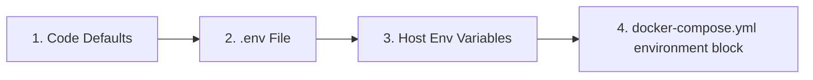

# 🐳 Guida Docker avanzata

Questa guida è per gli amministratori che personalizzano il proprio deployment Docker, creano la propria immagine o eseguono manutenzione sul container. Per una prima installazione, parti dalla [Guida all'installazione](../user/installation.md).

LibreFolio viene fornito con due file Compose:

- **`docker-compose.prod.yml`** esegue l'immagine ufficiale da GHCR: la guida all'installazione la salva come `docker-compose.yml`.
- **`docker-compose.yml`**, nel repository, esegue un'immagine che costruisci tu stesso con `./dev.py docker build`, e mappa anche la porta di test `6041`.

## ⚠️ Prerequisiti

**Gruppo Docker (Linux).** Il tuo utente deve essere nel gruppo `docker` per eseguire i comandi Docker senza `sudo`:

```bash
sudo usermod -aG docker $USER
```

Poi **disconnettiti e riconnettiti**, oppure esegui `newgrp docker` per attivare il gruppo nella sessione corrente. Senza questo, tutti i comandi `docker` e `docker compose` falliscono con un errore di autorizzazione.

**File `.env`.** LibreFolio richiede un file `.env` accanto al file Compose, e `./dev.py docker build` rifiuta di procedere senza di esso. In un checkout del repository:

```bash
cp .env.example .env
$EDITOR .env          # review and customize parameters
```

## 🏗️ Architettura

L'immagine è **solo runtime**: l'app web (SvelteKit) e la documentazione (MkDocs) vengono compilate sull'host e copiate al suo interno, e `./dev.py docker build` esegue quelle build per te. Fasi di build, contenuto dell'immagine e sequenza di avvio: [Panoramica dell'architettura → Immagine Docker](../developer/architecture/overview.md#docker-image).

## 📄 `docker-compose.yml`

Il file Compose definisce il servizio `librefolio` e la sua directory di dati persistenti.

### 🔝 Priorità di risoluzione {: #resolution-priority }

Quando risolve le variabili di configurazione, LibreFolio rispetta il seguente ordine di precedenza (dalla priorità più bassa alla più alta):


```mermaid
graph LR
    CodeDefaults[1. Code Defaults] --> EnvFile[2. .env File]
    HostShell[3. Host Env Variables]
    DockerCompose[4. docker-compose.yml environment block]

    EnvFile --> HostShell
    HostShell --> DockerCompose
```

In Docker, `.env` raggiunge il container tramite `env_file`, e il blocco `environment:` lo sovrascrive. Per i segnaposto `${…}` del file Compose, come `${PORT:-6040}`, una variabile impostata nella tua shell ha la precedenza su `.env`.

### 🔧 Servizio: `librefolio`

- 🏷️ **`image`**: l'immagine ufficiale `ghcr.io/librefolio/librefolio:latest` (file di produzione) o la tua `librefolio:latest` locale (file del repository); `LIBREFOLIO_IMAGE` in `.env` sceglie un altro tag.
- 🏗️ **`build`** (solo file del repository): compila il `Dockerfile` nella radice con gli argomenti `UID`, `GID` e `DOCS_VARIANT`.
- 🔌 **`ports`**: host `${PORT:-6040}` → container `6040`; il file del repository mappa anche `${TEST_PORT:-6041}` → `6041` per la [modalità test](#test-mode).
- 📂 **`volumes`**: il bind mount `./LibreFolio-data` → `/app/backend/data/prod-docker`.
- 📝 **`env_file: .env`**: carica la tua configurazione (copiata da `.env.example`).
- 🌍 **`environment`**: `LIBREFOLIO_DATA_DIR` specifico di Docker (percorso nel container) e `HOST=0.0.0.0`; lasciali così come sono.
- 🩺 **`healthcheck`**: interroga `GET /api/v1/system/health` ogni 30 secondi.

### 💾 Directory dei dati: `LibreFolio-data/`

Una directory **bind mount** accanto al file Compose, che contiene il database SQLite, gli upload personalizzati, i report dei broker e i file di log. Sopravvive all'arresto, al riavvio e alla rimozione del container, e puoi eseguirne il backup direttamente dall'host.

### 👤 Utente e autorizzazioni

Il container si avvia come root solo per affidare la directory dei dati all'utente LibreFolio, poi esegue il server come tale utente **non-root**: i file che crea in `LibreFolio-data/` appartengono a quell'UID/GID sull'host. L'affidamento avviene a ogni avvio e copre tutto ciò che è nella directory.

Quell'UID/GID proviene dagli **argomenti di build** `UID` e `GID`: l'immagine li conserva come `LIBREFOLIO_UID` e `LIBREFOLIO_GID`, che l'entrypoint legge a ogni avvio. L'immagine ufficiale GHCR è compilata con `1000:1000`. `./dev.py docker build` usa gli id dell'utente che lo esegue, qualunque cosa dica `.env`, mentre `docker compose build` legge `UID` e `GID` da `.env` (predefinito `1000`): impostali in modo che corrispondano all'utente host, o all'utente dedicato, che deve possedere i file di dati:

```bash
UID=1000
GID=1000
```

Modificarli in `.env` ha effetto solo quando `docker compose build` ricompila l'immagine: `.env` raggiunge anche il container tramite `env_file`, ma un riavvio non cambia gli id. Con l'immagine ufficiale, che non compili, queste due righe non hanno effetto.

- Sull'**host**, `ls -l LibreFolio-data/` mostra l'utente e il gruppo che possiedono quell'UID/GID sull'host (risolti tramite `/etc/passwd` e `/etc/group`).
- **All'interno del container**, gli stessi file di solito appaiono come `librefolio:librefolio`: lo stesso UID/GID numerico, risolto rispetto a `/etc/passwd` e `/etc/group` propri del container.

??? tip "Riferimento rapido Linux: utenti, gruppi e ID"

    **Scopri il tuo UID e GID attuali:**

    ```bash
    id -u              # your user ID (e.g. 1000)
    id -g              # your primary group ID (e.g. 1000)
    id                 # full info: uid, gid, groups
    ```

    **Trova l'UID/GID di qualsiasi utente:**

    ```bash
    id -u username     # UID of 'username'
    id -g username     # primary GID of 'username'
    ```

    **Crea un nuovo gruppo:**

    ```bash
    sudo groupadd librefolio          # create group (auto-assigns GID)
    sudo groupadd -g 1500 librefolio  # create group with specific GID
    ```

    **Crea un nuovo utente:**

    ```bash
    # System user (no home, no login — ideal for services)
    sudo useradd --system --no-create-home --gid librefolio --shell /usr/sbin/nologin librefolio

    # Regular user with home directory
    sudo useradd -m -g librefolio librefolio
    ```

    **Controlla gli ID assegnati:**

    ```bash
    id librefolio
    # → uid=998(librefolio) gid=998(librefolio) groups=998(librefolio)
    ```

    **Aggiungi il tuo utente esistente a un gruppo:**

    ```bash
    sudo usermod -aG librefolio $USER
    newgrp librefolio    # activate in current session (or log out/in)
    ```

    **Verifica l'appartenenza ai gruppi:**

    ```bash
    groups $USER         # list all groups for your user
    ```

    **Imposta la proprietà della directory dei dati:**

    ```bash
    sudo chown -R librefolio:librefolio ./LibreFolio-data
    ```

    Poi imposta l'UID/GID corrispondente in `.env` e ricompila l'immagine con `docker compose build`: a ogni avvio il container restituisce la directory all'UID/GID dell'immagine.

## 🛠️ Comandi CLI

In un checkout del repository, `dev.py` incapsula le operazioni Docker:

```bash
./dev.py docker build          # Build image (auto-builds frontend + docs)
./dev.py docker build --light  # Light variant: no documentation screenshots (tagged *-light)
./dev.py docker build --no-cache  # Full rebuild without Docker cache
./dev.py docker rebuild        # Build → stop → restart (one-step deploy)
./dev.py docker up             # Start containers
./dev.py docker down           # Stop containers
./dev.py docker logs -f        # Follow container logs
./dev.py docker status         # Show container status
./dev.py docker exec <cmd>     # Run a dev.py command inside the container
```

Senza un checkout, i comandi semplici svolgono il lavoro quotidiano: `docker compose up -d`, `docker compose down`, `docker compose logs -f` e `docker compose ps`.

- `--light` compila l'immagine senza gli screenshot della documentazione, che poi vengono caricati dal sito della documentazione online (vedi [Varianti dell'immagine](../user/installation.md#image-variants-full-and-light)).
- Tag locali: `librefolio:<version>` e `librefolio:latest` per l'immagine completa, `librefolio:<version>-light` e `librefolio:latest-light` per quella light, dove `<version>` è la versione git del tuo checkout. Sul registry invece, `latest` è la variante light e non esiste `latest-light`.
- Per eseguire la tua build light con il file Compose del repository, imposta `LIBREFOLIO_IMAGE=librefolio:latest-light` in `.env`.

??? warning "🧱 Quando `./dev.py docker build` si ferma"

    **Una risorsa non può essere scaricata.** La build memorizza nella cache alcune risorse esterne, come il font Noto Color Emoji (bandiere su Windows) e MathJax (formule nella documentazione), affinché l'immagine funzioni completamente offline. Se una non può essere scaricata e non esiste ancora una copia in cache, la build si ferma invece di distribuire un'immagine rotta:

    ```text
    ❌ Resource cache incomplete — the build would ship without these:
       - noto-color-emoji: ...
    ```

    La **prima build richiede accesso a Internet** (o una cache pre-riscaldata). Quando la rete è di nuovo disponibile, esegui di nuovo la build; `./dev.py cache js` aggiorna la cache manualmente (`--force` riscarica tutto).

    **Il frontend è una build di debug.** L'immagine deve distribuire la build di produzione dell'app web. Se `frontend/build/` è stata compilata l'ultima volta in modalità debug (per esempio da `./dev.py server --test`, `./dev.py server --debug` o dal test runner) o strumentata per la copertura, la build dell'immagine si ferma con un errore simile a:

    ```text
    ERROR: /build is not a production frontend build: it is a debug build (.build-debug = 1)
    Rebuild it with './dev.py front build', then build the image again.
    ```

    Esegui `./dev.py front build`, poi compila di nuovo l'immagine: `./dev.py docker build` ricompila il frontend automaticamente solo quando le sue sorgenti sono cambiate, non quando l'ultima build era di debug.

??? tip "🖼️ Compilare un'immagine completa con gli screenshot della documentazione"

    Un'immagine completa contiene gli screenshot della documentazione solo se sono stati generati, e la documentazione è stata ricompilata con essi, **prima** della build dell'immagine: altrimenti un'immagine completa locale e una light sono identiche a parte il tag. La sequenza completa è:

    ```bash
    ./dev.py mkdocs gallery   # generate the screenshots
    ./dev.py front build      # the gallery leaves a debug frontend build: rebuild it for production
    ./dev.py mkdocs build     # rebuild the documentation with the screenshots
    ./dev.py docker build     # build the full image
    ```

    `./dev.py mkdocs gallery` richiede un ambiente completamente installato (con `pipenv`) e i browser Playwright. Avvia il proprio server di test e popola automaticamente il database di test (`--no-populate` salta il ripopolamento). La generazione della galleria richiede alcuni minuti.

### 📡 `docker exec` — Eseguire comandi all'interno del container {: #docker-exec }

`./dev.py docker exec <cmd>` esegue un comando `dev.py` all'interno del container **in esecuzione**: equivale a `docker compose exec librefolio python dev.py <cmd>`. Per esempio, per gestire gli utenti:

```bash
./dev.py docker exec user create admin admin@example.com Pass123!
./dev.py docker exec user list
```

Nell'immagine, `user`, `db` e `info` funzionano. Anche i comandi di sviluppo (`test`, `i18n`, `mkdocs translate` e `mkdocs translate-validate`) sono elencati, ma rispondono solo che *non sono disponibili in questa installazione*: l'immagine distribuisce l'applicazione, non l'albero di sviluppo.

Anche i comandi della modalità test non vengono eseguiti nel container; come `./dev.py mkdocs gallery`, appartengono a un checkout di sviluppo:

- `./dev.py docker exec test db populate` riceve la stessa risposta *non disponibile* di ogni comando `test`;
- `./dev.py docker exec server --test` si ferma con `Frontend build failed. Server not started.`: la modalità test tenta prima di ricompilare l'app web in modalità debug, il che richiede Node.js e le sorgenti dell'app web, mentre l'immagine distribuisce solo la build di produzione, senza Node.js.

**Le migrazioni del database non richiedono alcun comando.** Il server applica le migrazioni in sospeso ogni volta che si avvia: dopo `docker compose pull` e `docker compose up -d` non c'è altro da eseguire, e `docker compose restart librefolio` le riprova dopo un errore. Non usare `./dev.py docker exec db upgrade`: `db upgrade` richiede che il server sia fermo, e nel container il server è il processo principale, sempre in esecuzione.

## 🩹 Correzioni post-migrazione {: #post-migration-fixes }

Ogni volta che il server si avvia, subito dopo aver applicato qualsiasi migrazione del database in sospeso, esegue le **correzioni post-migrazione**: riparazioni che una migrazione non può fare. Cosa riparano, e cosa dice il log al riguardo, è spiegato in [Strumenti da riga di comando → Correzioni post-migrazione](cli_tools.md#post-migration-fixes). In Docker:

- il log è l'output del container (`./dev.py docker logs` o `docker compose logs`), salvato anche in `LibreFolio-data/logs/`;
- una copia conservata da una correzione fallita si trova accanto al database, in `LibreFolio-data/sqlite/`, per esempio `app.db.pre-autoincrement-20261008T101500Z.bak`.

### ⏹️ Eseguire le correzioni con il server fermo

Per visualizzare in anteprima le correzioni, o per riprovare una che è fallita all'avvio e leggerne l'errore, eseguile manualmente con il server fermo. `docker exec` richiede il container in esecuzione, quindi usa invece `docker compose run`: il comando che passi sostituisce il server in un container temporaneo. Visualizza sempre prima l'anteprima con `--dry-run`:

```bash
docker compose stop librefolio
docker compose run --rm librefolio python -m backend.app.db.post_migration --dry-run   # preview: changes nothing
docker compose run --rm librefolio python -m backend.app.db.post_migration             # apply the fixes
docker compose start librefolio
```

Lo script lavora sullo stesso database e sulla stessa directory dei dati del server e riporta ciò che ha trovato, per esempio:

```text
Database: /app/backend/data/prod-docker/sqlite/app.db
Integrity check: ok
Fix autoincrement: would_apply
Orphan broker folder: broker_reports/uploaded/broker_7
```

Ogni correzione è `clean` (niente da fare), `would_apply` (dry run), `applied` o `failed`; vengono elencati anche un backup conservato e qualsiasi errore. Il codice di uscita è `0` quando non è fallito nulla, dry run incluso, e `1` quando una correzione o il controllo di integrità è fallito.

## 🧪 Modalità test {: #test-mode }

Il file `docker-compose.yml` del repository espone **due porte**:

| Porta | Scopo | Database |
|------|---------|----------|
| `6040` | Server di produzione, avviato con il container | `LibreFolio-data/sqlite/app.db` (bind mount persistente) |
| `6041` | Server di test, uno strumento per sviluppatori | Nessuno: il server di test non si avvia nel container. In un checkout di sviluppo usa per impostazione predefinita `backend/data/test/sqlite/app.db`, che `./dev.py test db populate --force` elimina e ricrea con dati fittizi |

Il server di test è pensato per gli sviluppatori: come avviarlo, e perché non si avvia con l'immagine attuale, è in [Flusso di lavoro dello sviluppatore](../developer/dev_workflow.md#docker-test-mode). `docker-compose.prod.yml` non ha porta di test; nel file del repository, rimuovi la riga `TEST_PORT` da `ports:` per chiuderla.

## 🏭 Considerazioni sulla produzione

### 🎮 1. Personalizzare `docker-compose.yml`

Le modifiche più comuni:

| # | Cosa | Come |
|---|------|-----|
| (1) | Far corrispondere UID/GID dell'host | Ricompila l'immagine con essi: esegui `./dev.py docker build` come l'utente che deve possedere i file, oppure imposta `UID=1001` e `GID=1001` in `.env` ed esegui `docker compose build` |
| (2) | Cambiare la porta di produzione | Imposta `PORT=3000` in `.env` |
| (3) | Disabilitare la porta di test | Rimuovi la riga `TEST_PORT` da `ports:` |
| (4) | Percorso dati personalizzato | Cambia il bind mount: `./my-data:/app/backend/data/prod-docker` |
| (5) | Tutta la configurazione | Modifica il file `.env` (copiato da `.env.example`) |
| (6) | Eseguire un altro tag dell'immagine | Imposta `LIBREFOLIO_IMAGE` in `.env`, per esempio `LIBREFOLIO_IMAGE=ghcr.io/librefolio/librefolio:1.1.0` |

Il primo account creato nel browser diventa automaticamente amministratore: non serve alcun comando.

??? example "📄 Il `docker-compose.yml` del repository, annotato"

    ```yaml
    services:
      librefolio:
        image: ${LIBREFOLIO_IMAGE:-librefolio:latest}  # (6) Built by ./dev.py docker build
        build:
          context: .
          args:
            UID: ${UID:-1000}              # (1) UID owning the data files (build time only)
            GID: ${GID:-1000}              # (1) GID owning the data files (build time only)
            DOCS_VARIANT: ${DOCS_VARIANT:-full}  # light = no documentation screenshots
        container_name: librefolio
        # No 'user:' directive — entrypoint starts as root, fixes permissions,
        # then drops to 'librefolio' user via gosu (same pattern as postgres/redis).
        restart: unless-stopped
        ports:
          - "${PORT:-6040}:6040"           # (2) Production port — change via PORT in .env
          - "${TEST_PORT:-6041}:6041"      # (3) Test server port (optional)
        volumes:
          - ./LibreFolio-data:/app/backend/data/prod-docker  # (4) Persistent data (bind mount)
        env_file: .env                     # (5) All config from .env file
        environment:
          - LIBREFOLIO_DATA_DIR=/app/backend/data/prod-docker  # Docker-specific override
          - HOST=0.0.0.0
        healthcheck:
          test: ["CMD", "python", "-c", "import urllib.request; urllib.request.urlopen('http://localhost:6040/api/v1/system/health')"]
          interval: 30s
          timeout: 10s
          start_period: 15s
          retries: 3
    ```

    `docker-compose.prod.yml` ha lo stesso servizio senza `build:` e senza la porta di test, e la sua immagine predefinita è `ghcr.io/librefolio/librefolio:latest`.

### 🔒 2. Sicurezza ed esposizione (Tailscale e reverse proxy)

Esponi LibreFolio in modo sicuro tramite **Tailscale** (consigliato, e la scelta più semplice) o dietro un classico reverse proxy come **Nginx** o **Traefik**:

- **Tailscale (consigliato)**: accesso sicuro con HTTPS automatico, senza aprire porte del router o configurare record DNS pubblici. Vedi la dettagliata **[Guida all'esposizione con Tailscale](service_exposure.md)**.
- **Reverse proxy classico (Nginx/Traefik)**: utile se hai già un'infrastruttura web, o vuoi gestire certificati SSL/TLS personalizzati, servire più applicazioni su un server, o aggiungere header di sicurezza personalizzati e rate limiting.

LibreFolio comprime già le sue risposte con gzip (JSON dell'API, JavaScript e CSS dell'app web, pagine della documentazione) e invia immagini e stream di ricerca asset in tempo reale così come sono: il proxy non deve comprimerli di nuovo.

### 💾 3. Backup del database

Il database è memorizzato nella directory `LibreFolio-data/` accanto a `docker-compose.yml`. Non serve `docker cp` — la directory dei dati è un bind mount accessibile dall'host.

!!! warning "Non copiare `app.db` da un container in esecuzione"

    LibreFolio esegue SQLite in **modalità WAL** (`PRAGMA journal_mode=WAL`): le transazioni recenti risiedono nel file collaterale `app.db-wal`, quindi un semplice `cp` del solo `app.db` mentre il server è attivo può produrre un backup incoerente o obsoleto. Usa una delle due procedure sicure riportate sotto.

**Opzione A — Ferma il container, poi copia** (la più semplice):

```bash
#!/bin/bash
docker compose stop librefolio
cp ./LibreFolio-data/sqlite/app.db /path/to/backups/app.db-$(date +%F)
docker compose start librefolio
```

**Opzione B — Backup online con la CLI SQLite** (senza downtime, richiede lo strumento `sqlite3` sull'host):

```bash
#!/bin/bash
sqlite3 ./LibreFolio-data/sqlite/app.db ".backup '/path/to/backups/app.db-$(date +%F)'"
```

Il comando `.backup` di SQLite usa l'API di backup online, che è sicura con un database WAL attivo.

Per l'elenco completo di ciò che vale la pena includere nel backup (file caricati, report originali dei broker), vedi la pagina [Struttura del filesystem](filesystem.md).

File che potresti trovare accanto al database:

- `app.db.pre-<fix>-<UTC time>.bak`: una copia conservata da una [correzione post-migrazione](#post-migration-fixes) non riuscita; eliminala quando non ti serve più.
- `app.db.post-migration.lock`: il file di lock vuoto delle [correzioni post-migrazione](#post-migration-fixes), riutilizzato a ogni avvio. È innocuo: lascialo lì, perché eliminarlo mentre il server si avvia potrebbe permettere a due esecuzioni di sovrapporsi.

### 🔑 4. Variabili d'ambiente

Tutta la configurazione è gestita nel file `.env` (copiato da `.env.example`); lascia invariati gli override specifici di Docker nel blocco `environment:`. Per ogni variabile e il suo effetto, vedi la **[Guida alla configurazione](configuration.md)**.

🔐 **Mantieni gli utenti connessi tra un riavvio e l'altro**: imposta `JWT_SECRET` in `.env` su una lunga stringa casuale, per esempio l'output di `openssl rand -hex 32`. Senza di esso, LibreFolio genera una nuova chiave a ogni avvio, quindi ogni riavvio o aggiornamento del container disconnette tutti gli utenti.
