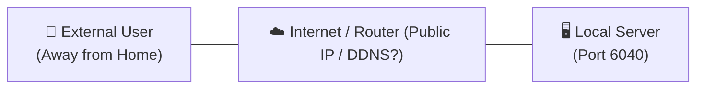
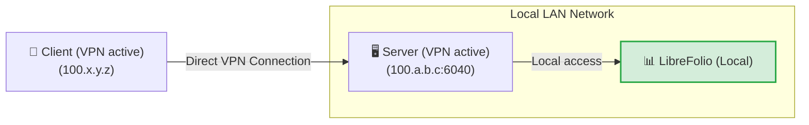
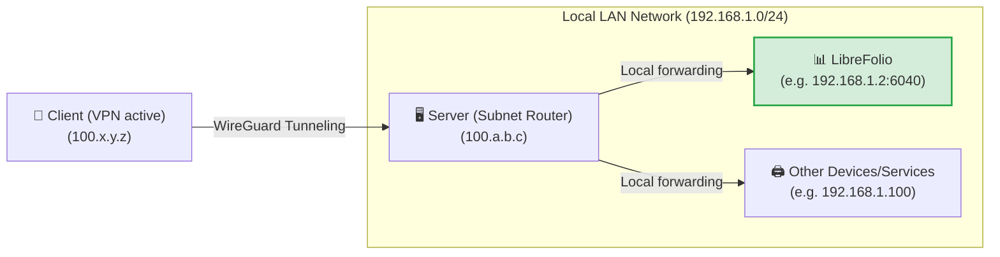
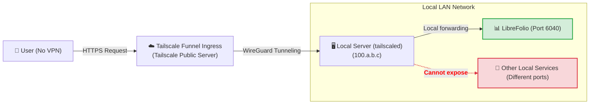
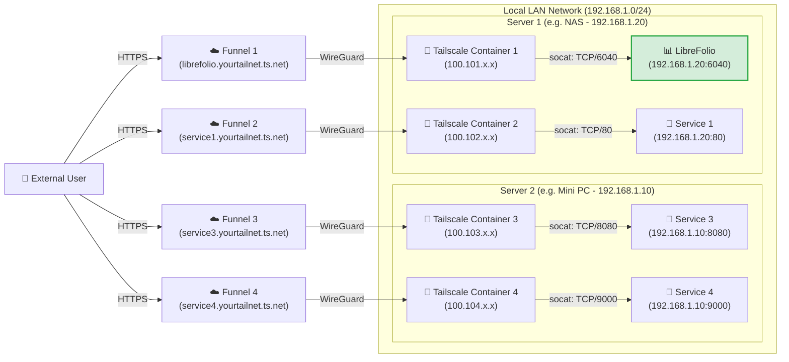

# 🌐 Exposing Securely

This guide shows how to reach LibreFolio away from home **without opening any port on your router**, using [Tailscale](https://tailscale.com/), a secure mesh VPN that is free for home use. The same steps work for any other service on your local network.

You need **Step 0** plus the one level that fits you. Levels 3 and 4 also need the one-time [Funnel setup on the console](#enabling-funnel-and-acls-on-the-console).

| Level | Best for | Tailscale on your phone/PC | Public HTTPS address |
|---|---|---|---|
| 🏃 1. Private VPN | Just you, with the quickest setup | Needed | No |
| 🥉 2. Subnet router | Every device of your home LAN, not only LibreFolio | Needed | No |
| 🥈 3. Funnel | A public address for LibreFolio, and installing it as an app | Not needed | Yes |
| 🥇 4. Multi-Funnel with Docker | One public address per service, each in its own container | Not needed | Yes |

!!! tip "⭐ Our recommendation: Level 4"

    Level 4 needs little more setup than Level 3, keeps every service isolated in its own container and gives each one its own public address. Levels 1–3 are simpler alternatives, and they show the path that leads there.

Everywhere below, `6040` is LibreFolio's default port: if you set a different `PORT` in your `.env`, use that number instead. LibreFolio serves the web app, its API and the built-in documentation on this one port, so it is the only port to expose.

---

## 🔒 Why not plain port forwarding?

The classic way is to open a port on your home router and point a dynamic DNS name (such as DuckDNS) at your public IP. It works, but:

- **The whole internet can see it**: anyone can scan your public IP and attack the open port.
- **HTTPS is your job**: you must run a reverse proxy (Nginx, Caddy…) and keep its SSL certificates renewed.
- **Without HTTPS, data travels in clear**: your password and financial data can be intercepted on the way.



Tailscale avoids all three: no router port is opened, the traffic between your devices is encrypted, and Funnel (Levels 3 and 4) adds HTTPS with certificates that Tailscale manages for you.

---

## 🏁 Step 0: Install Tailscale on your devices

[Tailscale](https://tailscale.com/) is a mesh VPN built on the **WireGuard** protocol: your devices join a private network (your *tailnet*) and talk to each other through encrypted tunnels. It runs on Linux, macOS, Windows, iOS and Android, on a NAS or inside Docker, and its free **Personal** plan is enough for home use (see [Tailscale pricing](https://tailscale.com/pricing) for the current limits).

Install it and log in on at least two devices: the **server** that runs LibreFolio and a **client**, such as your phone or laptop.

=== "Linux"

    Run the official installation command on the server:

    ```bash
    curl -fsSL https://tailscale.com/install.sh | sh
    sudo tailscale up
    ```

    For more details, see the [Generic Installation Guide](https://tailscale.com/docs/install).

=== "macOS"

    Install the official app from the **Mac App Store** or use Homebrew:

    ```bash
    brew install --cask tailscale
    sudo tailscale up
    ```

    For more details, see the [Generic Installation Guide](https://tailscale.com/docs/install).

=== "Windows"

    Download the official installer from the Tailscale portal and follow the login wizard.

    For details, see the [Windows Installation Guide](https://tailscale.com/docs/install/windows).

=== "Android"

    Install the official application from the [Google Play Store](https://play.google.com/store/apps/details?id=com.tailscale.ipn).

=== "iOS (iPhone/iPad)"

    Install the official application from the [Apple App Store](https://apps.apple.com/us/app/tailscale/id1470499037).

??? tip "🔑 Keep the server connected — disable key expiry"

    By default, Tailscale asks every device to log in again after 180 days. A server should not drop off your tailnet for that, so turn it off for the server:

    1. On the **Machines** page of the admin console, locate your server.
    2. Click the **three dots (...) icon** on the right of the device row.
    3. Select the **Disable Key Expiry** option.

---

## 🏃 Level 1: Private point-to-point VPN

**Best for you alone, with the quickest setup.** Your phone or laptop reaches LibreFolio through your private tailnet, and nothing is exposed to the internet.



### ▶️ Step 1: Check that LibreFolio answers on its port

Nothing to share: with Tailscale switched on on the server, LibreFolio's port `6040` is already
reachable from your tailnet at the server's Tailscale IP.

??? tip "Prefer an HTTPS address inside your tailnet?"

    Run this on the server, then open `https://<server-name>.your-tailnet.ts.net` instead of the IP:

    ```bash
    tailscale serve --bg 6040
    ```

    `--bg` keeps it running after you close the terminal; `tailscale serve reset` removes it. The
    first time, Tailscale may ask you to enable HTTPS certificates for your tailnet. The address is
    still private: only your tailnet devices can open it.

### 📱 Step 2: Open LibreFolio from your device

With Tailscale switched on on your phone or PC, type the server's Tailscale IP (or its MagicDNS name) followed by the port in the browser, for example `http://100.a.b.c:6040`.

⚠️ **Limits:** every device you connect from needs Tailscale switched on, and you reach only the server, not the rest of your home LAN (Level 2 adds that).

---

## 🥉 Level 2: Subnet router for your whole home LAN

**Best for reaching every device at home, not only LibreFolio.** The server becomes a *subnet router*: with Tailscale on, your client opens any local IP as if it were at home, for example `http://192.168.1.2:6040` for LibreFolio.



### 🔀 Step 1: Enable subnet routing on the server

=== "Linux"

    Enable IP forwarding at the kernel level:

    ```bash
    echo 'net.ipv4.ip_forward = 1' | sudo tee -a /etc/sysctl.d/99-tailscale.conf
    echo 'net.ipv6.conf.all.forwarding = 1' | sudo tee -a /etc/sysctl.d/99-tailscale.conf
    sudo sysctl -p /etc/sysctl.d/99-tailscale.conf
    ```

    Start advertising the subnet (replace the IP range with your local network, e.g., `192.168.1.0/24`):

    ```bash
    sudo tailscale up --advertise-routes=192.168.1.0/24
    ```

=== "macOS"

    Use the Tailscale executable path to advertise the local subnet:

    ```bash
    /Applications/Tailscale.app/Contents/MacOS/Tailscale up --advertise-routes=192.168.1.0/24
    ```

=== "Windows"

    Run Command Prompt (`cmd.exe`) or PowerShell as **Administrator** and advertise the local subnet:

    ```cmd
    tailscale up --advertise-routes=192.168.1.0/24
    ```

### ✅ Step 2: Approve the route in the admin console

1. Go to the [Tailscale Admin Console](https://login.tailscale.com/admin/machines).
2. Click the three dots next to your server -> **Edit route settings**.
3. Enable the advertised subnet.

A subnet router is part of your network's plumbing: if you skipped it, disable key expiry for the server now (tip at the end of Step 0).

⚠️ **Limits:** the client still needs Tailscale switched on, you must know the local IPs of your devices, and inside your LAN the traffic travels as plain HTTP.

---

## 🔑 Enabling Funnel and ACLs on the console {: #enabling-funnel-and-acls-on-the-console }

**One-time setup, needed by Levels 3 and 4.** It allows Funnel in the access control rules (ACLs) of your whole tailnet.

!!! warning "🔐 Before you go public"

    With Funnel, anyone on the internet can open your LibreFolio login page. Create your own account first: the first account registered becomes the administrator. Sign-ups stay open after that (**Enable Registration**, `enable_registration`, is on by default): turn it off in the **Global Settings** if you do not want strangers to register (see [Global Settings](settings.md)).

1. Visit the [Access Controls](https://login.tailscale.com/admin/acls) page in the Tailscale admin console.
2. Click the **Add node attribute** button.
3. Fill in the form:
    * **Targets**: the nodes allowed to use Funnel. **We suggest `tag:external_access`** (you will give this tag to the Docker containers of Level 4) or `autogroup:member` (all the devices registered under your personal account).
    * **Attributes**: enter `funnel`.
    * **Note**: a few words on why the rule exists.
    * **IP Pools, App, Capability, etc.**: not needed here; leave them empty or at their default values.


This rule is not an auth key: auth keys (Level 4) only register a new device or container in your tailnet.

??? example "📄 View the complete ACL JSON configuration to enable Funnel"

    If you prefer to edit the policy file directly, this working example enables Funnel for your own devices and for the containers tagged `tag:external_access`:

    ```json
    {
      // Declaration of authorized tags
      "tagOwners": {
        "tag:external_access": ["autogroup:admin"]
      },

      // Standard access rules
      "acls": [
        // Allows all nodes in your private network to communicate
        {"action": "accept", "src": ["*"], "dst": ["*:*"]}
      ],

      "ssh": [
        {
          "action": "check",
          "src":    ["autogroup:member"],
          "dst":    ["autogroup:self"],
          "users":  ["autogroup:nonroot", "root"]
        }
      ],

      // Enabling Funnel on specific nodes or tags
      "nodeAttrs": [
        {
          "target": ["autogroup:member"],
          "attr":   ["funnel"]
        },
        {
          "target": ["tag:external_access"],
          "attr":   ["funnel"]
        }
      ]
    }
    ```

---

## 🥈 Level 3: Public HTTPS address with Tailscale Funnel

**Best for a public address, with no VPN on the client.** Funnel publishes LibreFolio at a secure `https://<server-name>.your-tailnet.ts.net` address that anyone can open **without installing Tailscale**. HTTPS is also what lets you [install LibreFolio as an app (PWA)](../user/pwa.md) on your phone.

**Before you start:** complete the [one-time Funnel and ACL configuration on the console](#enabling-funnel-and-acls-on-the-console).



### ▶️ Step 1: Start the Funnel on the server

On the server, publish the local LibreFolio port:

```bash
tailscale funnel --bg 6040
```

Funnel serves it at `https://<server-name>.your-tailnet.ts.net` on port 443; `--bg` keeps it running
after you close the terminal, and `tailscale funnel reset` stops it. No auth key is needed here: the
server already joined your tailnet in Step 0.
Nothing to configure in LibreFolio either: Funnel sends `X-Forwarded-Proto: https`, so with the
default `SESSION_COOKIE_SECURE=auto` LibreFolio marks its
[session cookie](configuration.md) `Secure`. `never` is only for a proxy that
claims HTTPS to a browser on plain HTTP.

### ✅ Step 2: Approve and wait for propagation

The first time, the terminal warns that Funnel is not yet allowed for this node and shows a link like this one:

```text
Funnel is enabled, but the list of allowed nodes in the tailnet policy file does not include the one you are using.
To give access to this node you can edit the tailnet policy file, or visit:

         https://login.tailscale.com/f/funnel?node=xxxxxx
```

1. Open the link in your browser, log in to Tailscale and approve Funnel for this node.
2. The terminal then shows your public URL.
3. Wait a few minutes for the MagicDNS records to propagate before you open it from an outside network.

⚠️ **Limits:** one machine has one public name, which every service you publish from it must share. Level 4 gives each service its own.

---

## 🥇 Level 4: Multi-Funnel with Docker sidecars

**Best for Docker users who want one public address per service.** Each service gets a small Tailscale container (a *sidecar*) that joins your tailnet as its own node, with its own `https://<name>.your-tailnet.ts.net` address. A startup script installs **socat** in the sidecar, and socat forwards the Funnel traffic to the static LAN IP of the service.

**Before you start:** complete the [one-time Funnel and ACL configuration on the console](#enabling-funnel-and-acls-on-the-console).

??? info "🧰 What is socat?"

    **socat** (SOcket CAT) is a small command-line tool that relays data between two connections. Here it works as a **mini forwarder**: it listens on a port inside the Tailscale container and passes everything it receives to the real port of the service on your LAN.

Add one sidecar for every service you want to publish, on one host or several; the only limit is the number of tagged devices your [Tailscale plan](https://tailscale.com/pricing) allows. In this example, two hosts run two sidecars each:



### 📁 Step 1: Prepare the folder and the script

Create a folder on the server, for example where you keep your Docker persistent volumes:

```bash
# Create a folder for the Tailscale nodes and enter it
mkdir -p <path_chosen>/tailscale-nodes
cd <path_chosen>/tailscale-nodes
```

Then download the startup script <a href="https://raw.githubusercontent.com/Librefolio/LibreFolio/main/mkdocs_src/docs/static/tailscale-guide/custom_startup.sh" target="_blank" rel="noopener noreferrer">custom_startup.sh</a> into it:

```bash
# Download the script from the official repository
wget https://raw.githubusercontent.com/Librefolio/LibreFolio/main/mkdocs_src/docs/static/tailscale-guide/custom_startup.sh
# Make the script executable
chmod +x custom_startup.sh
```

??? info "🔄 Set up the sidecar before? Update your copy of the script"

    The current script also works as a **watchdog** and comes with a Docker health check (see Step 2). If your sidecar runs an older copy, update it:

    1. **Download the script again** into the same folder. The `-O custom_startup.sh` option overwrites the old file (without it, `wget` saves the download as `custom_startup.sh.1`). Then make sure the script is executable:

        ```bash
        cd <path_chosen>/tailscale-nodes
        wget -O custom_startup.sh https://raw.githubusercontent.com/Librefolio/LibreFolio/main/mkdocs_src/docs/static/tailscale-guide/custom_startup.sh
        chmod +x custom_startup.sh
        ```

    2. **Update your compose file**: add `TS_ENABLE_HEALTH_CHECK`, `TS_LOCAL_ADDR_PORT` and, optionally, `STARTUP_TIMEOUT` to the Tailscale service, together with the `healthcheck` block, exactly as in Step 2.

    3. **Recreate the container**: a restart does not apply compose changes. Run `docker compose up -d` in the folder of your `docker-compose.yml` (it recreates the services whose configuration changed), or use the *Recreate* / re-deploy action of Portainer or CasaOS.

    4. **Check the log** with `docker logs -f tailscale-librefolio`: you should see `Tailscale is running.`, then `Starting the funnel on port 6040...` and `Available on the internet:` with your public URL. Within the 2-minute `start_period` of the health check, Docker shows the container as **healthy** (`docker ps`, Portainer, CasaOS). If it keeps restarting instead, see the troubleshooting panel in [Step 3](#3-startup-and-approval).

### 🐳 Step 2: Configure Docker Compose

Add the Tailscale service to the **same `docker-compose.yml` as the service** it exposes (for example LibreFolio), so the two stay together:

```yaml
services:
  tailscale-librefolio:
    image: tailscale/tailscale:latest
    container_name: tailscale-librefolio
    hostname: tailscale-librefolio
    restart: unless-stopped
    privileged: false
    network_mode: bridge
    cap_add:
      - NET_ADMIN
      - NET_RAW
    devices:
      - /dev/net/tun:/dev/net/tun
    command:
      - /custom_startup.sh
    environment:
      - HOST_IP=192.168.1.20                # Local IP of the service to expose (e.g. Server 1)
      - HOST_PORT=6040                      # Real port of the service to expose
      - TAILSCALE_FUNNEL_PORT=6040          # Internal Funnel port
      - TS_HOSTNAME=librefolio              # Custom public hostname (e.g. librefolio)
      - TS_AUTHKEY=tskey-auth-...           # Authentication key generated by Tailscale
      - TS_ACCEPT_DNS=true
      - TS_STATE_DIR=/var/lib/tailscale
      - TS_USERSPACE=false
      - TS_ENABLE_HEALTH_CHECK=true         # Expose /healthz for the healthcheck below (Tailscale ≥ 1.78)
      - TS_LOCAL_ADDR_PORT=127.0.0.1:9002   # Where /healthz listens: inside the container only
      - STARTUP_TIMEOUT=180                 # Optional: seconds to reach the Running state (default 180)
    volumes:
      - <path_chosen>/tailscale-nodes/tailscale-librefolio/state:/var/lib/tailscale
      - <path_chosen>/tailscale-nodes/custom_startup.sh:/custom_startup.sh
      - /etc/localtime:/etc/localtime:ro
      - /etc/timezone:/etc/timezone:ro
    # Shows healthy/unhealthy in Docker, Portainer or CasaOS; the restart itself comes from custom_startup.sh exiting
    healthcheck:
      test: ["CMD", "wget", "-q", "-O", "/dev/null", "http://127.0.0.1:9002/healthz"]
      interval: 30s
      timeout: 5s
      retries: 3
      start_period: 120s
```

Then set these values for your network:

| Value | What to put |
|---|---|
| `<path_chosen>` | The absolute path chosen in Step 1, where the script and the state data live (e.g. `/home/user/docker`). |
| `HOST_IP` | The static LAN IP of the machine that runs the service. |
| `HOST_PORT` | The real port of the service on that machine: for LibreFolio, the `PORT` of your `.env` (`6040` by default). |
| `TAILSCALE_FUNNEL_PORT` | The port the container listens on and publishes through Funnel. Set it to the same value as `HOST_PORT`. |
| `TS_HOSTNAME` | The name of the node: the public address becomes `https://TS_HOSTNAME.your-tailnet.ts.net`. |
| `TS_AUTHKEY` | The auth key that registers the container in your tailnet (see below). |

To get the auth key for `TS_AUTHKEY`:

1. Go to [Tailscale Admin Settings Keys](https://login.tailscale.com/admin/settings/keys).
2. Under the **Auth keys** section (*not* under the API access tokens section), click the **Generate auth key...** button.
3. Turn on the **Tags** toggle and select your tag (e.g. `tag:external_access`). Add a description you will recognize, such as `docker-librefolio-funnel`.
4. Click **Generate** and copy the key (`tskey-auth-...`).

Once the container has started, the one-time key is used up: it disappears from the **Keys** list, and the new device appears in **Machines**.

??? info "🩺 Watchdog and health check — what the extra settings do"

    The startup script also works as a **watchdog**, while the `healthcheck` block makes the state of the container visible:

    * **Watchdog (automatic restart)**: if Tailscale cannot start (for example, no internet connection at boot or a wrong flag), does not reach the *Running* state within `STARTUP_TIMEOUT` seconds, or if Tailscale, socat or the Funnel stop later on, the script exits with an error and Docker restarts the container (`restart: unless-stopped`). The container never stays "running" with nothing behind it, and a `docker stop` still shuts everything down cleanly.
    * **Health check (status only)**: `TS_ENABLE_HEALTH_CHECK=true` turns on Tailscale's `/healthz` endpoint (Tailscale 1.78 or later), which answers `200` while the node has a Tailscale IP address and `503` otherwise. Docker queries it regularly and marks the container *healthy* or *unhealthy*; Portainer and CasaOS show the same status.

    Plain Docker (outside Swarm mode) does **not** restart a container marked *unhealthy*: the restart comes from the script exiting, so you need no extra "autoheal" container (such helpers also need the Docker socket, which means full control of the host).

    | Optional setting | What it does |
    |---|---|
    | `TS_LOCAL_ADDR_PORT` | Where `/healthz` listens. The endpoint needs no authentication, and Tailscale's default, `[::]:9002`, listens on all interfaces: `127.0.0.1:9002` keeps it inside the container. If you change it, update the URL of the `healthcheck` test too. |
    | `STARTUP_TIMEOUT` | Seconds the script waits for the *Running* state (default `180`) before it exits and Docker restarts the container. Raise it only on a very slow server. |
    | `DEBUG` | Not in the example above. `DEBUG=1` prints every command the script runs to the container log, for troubleshooting. Off by default to keep the log readable. |

??? example "📄 View the complete production Docker Compose file (LibreFolio + Tailscale)"

    A complete `docker-compose.yml`: the `librefolio` service of the official `docker-compose.prod.yml`, with the Tailscale sidecar next to it:

    ```yaml
    # =============================================================================
    # LibreFolio — Production Docker Compose
    # =============================================================================
    # Optimized for end-users running the official pre-built image from GHCR.
    # =============================================================================

    services:
      librefolio:
        image: ${LIBREFOLIO_IMAGE:-ghcr.io/librefolio/librefolio:latest}
        container_name: librefolio
        restart: unless-stopped
        ports:
          - "${PORT:-6040}:6040"
        volumes:
          - ./LibreFolio-data:/app/backend/data/prod-docker
        env_file: .env
        environment:
          - LIBREFOLIO_DATA_DIR=/app/backend/data/prod-docker
          - HOST=0.0.0.0
        healthcheck:
          test: ["CMD", "python", "-c", "import urllib.request; urllib.request.urlopen('http://localhost:6040/api/v1/system/health')"]
          interval: 30s
          timeout: 10s
          start_period: 15s
          retries: 3

      tailscale-librefolio:
        image: tailscale/tailscale:latest
        container_name: tailscale-librefolio
        hostname: tailscale-librefolio
        restart: unless-stopped
        privileged: false
        network_mode: bridge
        cap_add:
          - NET_ADMIN
          - NET_RAW
        devices:
          - /dev/net/tun:/dev/net/tun
        command:
          - /custom_startup.sh
        environment:
          - HOST_IP=192.168.1.20                # Local IP of the service to expose (e.g. Server 1)
          - HOST_PORT=6040                      # Real port of the service to expose
          - TAILSCALE_FUNNEL_PORT=6040          # Internal Funnel port
          - TS_HOSTNAME=librefolio              # Custom public hostname (e.g. librefolio)
          - TS_AUTHKEY=tskey-auth-...           # Replace with your generated key
          - TS_ACCEPT_DNS=true
          - TS_STATE_DIR=/var/lib/tailscale
          - TS_USERSPACE=false
          - TS_ENABLE_HEALTH_CHECK=true         # Expose /healthz for the healthcheck below (Tailscale ≥ 1.78)
          - TS_LOCAL_ADDR_PORT=127.0.0.1:9002   # Where /healthz listens: inside the container only
          - STARTUP_TIMEOUT=180                 # Optional: seconds to reach the Running state (default 180)
        volumes:
          - /DATA/AppData/tailscale-nodes/tailscale-librefolio/state:/var/lib/tailscale
          - /DATA/AppData/tailscale-nodes/custom_startup.sh:/custom_startup.sh
          - /etc/localtime:/etc/localtime:ro
          - /etc/timezone:/etc/timezone:ro
        # Shows healthy/unhealthy in Docker, Portainer or CasaOS; the restart itself comes from custom_startup.sh exiting
        healthcheck:
          test: ["CMD", "wget", "-q", "-O", "/dev/null", "http://127.0.0.1:9002/healthz"]
          interval: 30s
          timeout: 5s
          retries: 3
          start_period: 120s
    ```

### 🚀 Step 3: Start and approve the Funnel {: #3-startup-and-approval }

Start the stack, the service and its Tailscale sidecar together:

```bash
docker compose up -d
```

Then follow the log of the Tailscale container:

```bash
docker logs -f tailscale-librefolio
```

On the first start, the log shows the approval link for the new node:

```text
Funnel is enabled, but the list of allowed nodes in the tailnet policy file does not include the one you are using.
To give access to this node you can edit the tailnet policy file, or visit:

         https://login.tailscale.com/f/funnel?node=nsKGo6k9ZF11CNTRL
```

* Open the link in your browser, log in to Tailscale and approve the Funnel activation.
* Right after approval, the log confirms the public URL and the local proxy:

```text
Available on the internet:

https://librefolio.yourtailnet.ts.net/
|-- proxy http://127.0.0.1:6040

Press Ctrl+C to exit.
```

The service is now online: wait a few minutes for the MagicDNS records to propagate, then open the URL.
Nothing to configure in LibreFolio: Funnel sends `X-Forwarded-Proto: https` and socat passes it on,
so with the default `SESSION_COOKIE_SECURE=auto` LibreFolio marks its
[session cookie](configuration.md) `Secure`. `never` is only for a proxy that
claims HTTPS to a browser on plain HTTP.

??? question "🛠️ The container restarts in a loop or is marked unhealthy"

    A persistent problem shows up as a container that keeps restarting (Docker, Portainer or CasaOS may also mark it *unhealthy*), not as one that looks "running" but does not work. Read the log with `docker logs tailscale-librefolio`: before each restart, the script prints what went wrong, usually followed by `Exiting so Docker restarts the container.` The most common causes:

    * **A flag in `TS_EXTRA_ARGS` has no value.** This optional variable (not in the compose above) passes extra flags to `tailscale up`, split on spaces. A flag without its value makes `tailscale up` fail: the reason is on the line right after `Running 'tailscale up'`, above the help text that starts with `USAGE` (for example `flag needs an argument: -advertise-tags`), followed by `failed to auth tailscale: … tailscale up failed: exit status 2` and `containerboot exited before Tailscale was running.` Write each value as `--flag=value` or `--flag value`: `--advertise-tags=tag:container` and `--advertise-tags tag:container` both work.
    * **A management panel cut the value.** The environment-variable editor of CasaOS (and of similar panels) truncates a value at its second `=`: `TS_EXTRA_ARGS=--advertise-tags=tag:container` becomes `--advertise-tags`, which fails as described above. In these panels, write flag values with a space: `--advertise-tags tag:container`.
    * **A required variable is missing**: the script stops at once with `HOST_IP is not set` (or the same message for `HOST_PORT` or `TAILSCALE_FUNNEL_PORT`).
    * **No internet connection at boot**: the container keeps restarting until Tailscale can start, then works normally. This is expected.
    * **Very slow start**: the log shows `Tailscale is not running after 180s.`; increase `STARTUP_TIMEOUT`.
    * **Unhealthy, but not restarting**: the health check gets no successful answer from `/healthz`. If you have just added it, make sure that `TS_ENABLE_HEALTH_CHECK=true` is set and that the URL of the `healthcheck` test matches `TS_LOCAL_ADDR_PORT`; otherwise, the node has no Tailscale IP address at the moment.

    To trace every command of the script, add `DEBUG=1` to the `environment` section, recreate the container and read the log again.

Because its auth key carries a tag, Tailscale disables key expiry for the container by default. With an untagged key, disable it as for the server (tip at the end of Step 0).

⚠️ **Limits:** it takes a terminal and some editing of Docker Compose files.

---

## 🔮 MagicDNS and custom domains

**MagicDNS** gives each device of your tailnet a name: instead of an IP like `100.110.x.x`, you can type `http://your-server` in the browser. Public Funnel addresses end in `.ts.net` (for example, `https://librefolio.your-tailnet.ts.net`, where `librefolio` is the `TS_HOSTNAME` of Level 4).

Prefer your own domain, such as `librefolio.mydomain.com`? Two methods work for **private** access, through the VPN:

??? tip "🌍 Method 1 — A public DNS record pointing to the Tailscale IP (simplest)"

    1. Log into your domain registrar's console (e.g., Cloudflare, GoDaddy, Namecheap).
    2. Create a type **A** (or **AAAA** for IPv6) DNS record for the chosen subdomain (e.g., `librefolio.mydomain.com`).
    3. Point the record directly to the **private Tailscale IP** of your server (e.g., `100.77.x.x`).

    Addresses in the `100.64.0.0/10` network are not routable on the internet, so the name works **only** while you are connected to your tailnet: no outsider can reach or scan the service. For details, see the [Official documentation on DNS settings](https://tailscale.com/kb/1054/dns#public-dns).

??? tip "🧭 Method 2 — Split DNS with your own DNS server"

    For internal records that you manage yourself and never publish on the internet:

    1. Configure a private DNS server in your LAN (such as Pi-hole, AdGuard Home, or CoreDNS).
    2. Add local records of your domain pointing them to your Tailscale IPs.
    3. In the Tailscale admin console, go to *DNS -> Nameservers -> Add Nameserver* and add the Tailscale IP of your private DNS as a global nameserver or restricted to your domain. For details, see the [Official documentation on Split DNS](https://tailscale.com/kb/1054/dns#split-dns).

For **public** access, keep the `*.ts.net` address: Funnel serves it with a certificate signed for that name, so pointing your own domain at it (CNAME) causes SSL/TLS errors in browsers, unless you add your own reverse proxy (such as Caddy or Nginx) with certificates for your domain.

---

## 🔗 Useful links

* 🖥️ [Tailscale Administration Console (Machines)](https://login.tailscale.com/admin/machines)
* 🔐 [Access Controls Management (ACLs)](https://login.tailscale.com/admin/acls)
* 📖 [Official Guide to Tailscale Funnel (English Documentation)](https://tailscale.com/kb/1223/tailscale-funnel)
* 🐳 [Running Tailscale in Docker](https://tailscale.com/kb/1282/docker)
