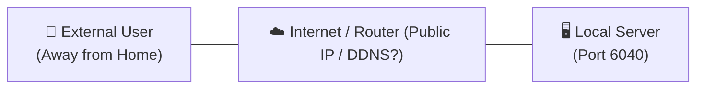
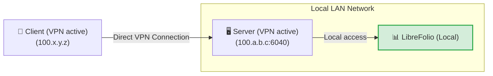
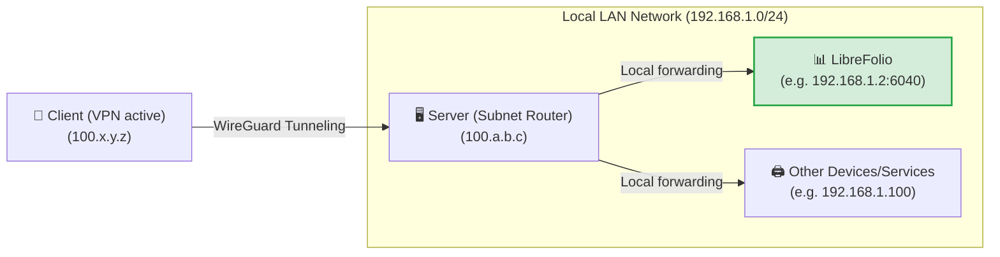
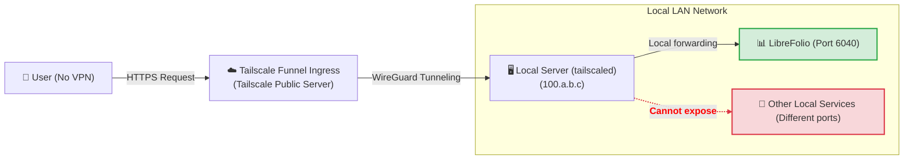
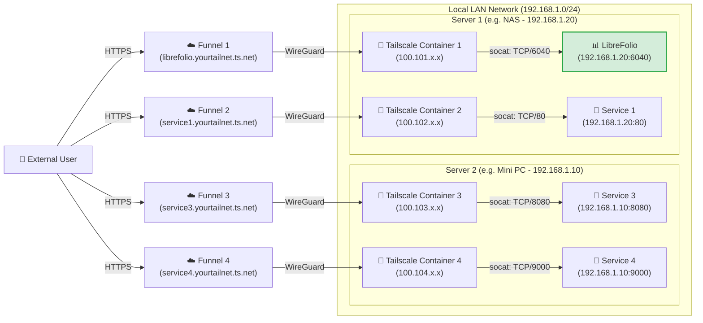

# 🌐 Exponer de forma segura

Esta guía muestra cómo acceder a LibreFolio fuera de casa **sin abrir ningún puerto en tu router**, usando [Tailscale](https://tailscale.com/), una VPN de malla segura que es gratuita para uso doméstico. Los mismos pasos funcionan para cualquier otro servicio en tu red local.

Necesitas el **Paso 0** más el nivel que te corresponda. Los niveles 3 y 4 también necesitan la [configuración única de Funnel en la consola](#enabling-funnel-and-acls-on-the-console).

| Nivel | Ideal para | Tailscale en tu teléfono/PC | Dirección HTTPS pública |
|---|---|---|---|
| 🏃 1. VPN privada | Solo para ti, con la configuración más rápida | Necesario | No |
| 🥉 2. Router de subred | Todos los dispositivos de tu LAN doméstica, no solo LibreFolio | Necesario | No |
| 🥈 3. Funnel | Una dirección pública para LibreFolio, e instalarlo como app | No necesario | Sí |
| 🥇 4. Multi-Funnel con Docker | Una dirección pública por servicio, cada uno en su propio contenedor | No necesario | Sí |

!!! tip "⭐ Nuestra recomendación: Nivel 4"

    El Nivel 4 necesita poco más de configuración que el Nivel 3, mantiene cada servicio aislado en su propio contenedor y le da a cada uno su propia dirección pública. Los niveles 1–3 son alternativas más sencillas y muestran el camino que lleva hasta allí.

En todo lo que sigue, `6040` es el puerto predeterminado de LibreFolio: si configuras un `PORT` diferente en tu `.env`, usa ese número en su lugar. LibreFolio sirve la aplicación web, su API y la documentación integrada en este único puerto, por lo que es el único puerto que hay que exponer.

---

## 🔒 ¿Por qué no usar simplemente el reenvío de puertos?

La forma clásica es abrir un puerto en tu router doméstico y apuntar un nombre de DNS dinámico (como DuckDNS) a tu IP pública. Funciona, pero:

- **Todo internet puede verlo**: cualquiera puede escanear tu IP pública y atacar el puerto abierto.
- **HTTPS es tu responsabilidad**: debes ejecutar un proxy inverso (Nginx, Caddy…) y mantener renovados sus certificados SSL.
- **Sin HTTPS, los datos viajan en claro**: tu contraseña y tus datos financieros pueden ser interceptados en el camino.



Tailscale evita las tres cosas: no se abre ningún puerto del router, el tráfico entre tus dispositivos está cifrado y Funnel (Niveles 3 y 4) añade HTTPS con certificados que Tailscale gestiona por ti.

---

## 🏁 Paso 0: Instalar Tailscale en tus dispositivos

[Tailscale](https://tailscale.com/) es una VPN de malla construida sobre el protocolo **WireGuard**: tus dispositivos se unen a una red privada (tu *tailnet*) y se comunican entre sí a través de túneles cifrados. Se ejecuta en Linux, macOS, Windows, iOS y Android, en un NAS o dentro de Docker, y su plan **Personal** gratuito es suficiente para uso doméstico (consulta los [precios de Tailscale](https://tailscale.com/pricing) para conocer los límites actuales).

Instálalo e inicia sesión en al menos dos dispositivos: el **servidor** que ejecuta LibreFolio y un **cliente**, como tu teléfono o portátil.

=== "Linux"

    Ejecuta el comando de instalación oficial en el servidor:

    ```bash
    curl -fsSL https://tailscale.com/install.sh | sh
    sudo tailscale up
    ```

    Para más detalles, consulta la [Guía de instalación genérica](https://tailscale.com/docs/install).

=== "macOS"

    Instala la aplicación oficial desde la **Mac App Store** o usa Homebrew:

    ```bash
    brew install --cask tailscale
    sudo tailscale up
    ```

    Para más detalles, consulta la [Guía de instalación genérica](https://tailscale.com/docs/install).

=== "Windows"

    Descarga el instalador oficial desde el portal de Tailscale y sigue el asistente de inicio de sesión.

    Para más detalles, consulta la [Guía de instalación para Windows](https://tailscale.com/docs/install/windows).

=== "Android"

    Instala la aplicación oficial desde [Google Play Store](https://play.google.com/store/apps/details?id=com.tailscale.ipn).

=== "iOS (iPhone/iPad)"

    Instala la aplicación oficial desde la [Apple App Store](https://apps.apple.com/us/app/tailscale/id1470499037).

??? tip "🔑 Mantén el servidor conectado — desactiva la caducidad de la clave"

    De forma predeterminada, Tailscale pide a cada dispositivo que vuelva a iniciar sesión después de 180 días. Un servidor no debería desconectarse de tu tailnet por eso, así que desactívalo para el servidor:

    1. En la página **Máquinas** de la consola de administración, localiza tu servidor.
    2. Haz clic en el **icono de tres puntos (...)** a la derecha de la fila del dispositivo.
    3. Selecciona la opción **Desactivar caducidad de clave**.

---

## 🏃 Nivel 1: VPN privada punto a punto

**Ideal solo para ti, con la configuración más rápida.** Tu teléfono o portátil accede a LibreFolio a través de tu tailnet privada y nada queda expuesto a internet.



### ▶️ Paso 1: Comprobar que LibreFolio responde en su puerto

No hay nada que compartir: con Tailscale activado en el servidor, el puerto `6040` de LibreFolio ya es accesible desde tu tailnet en la IP de Tailscale del servidor.

??? tip "¿Prefieres una dirección HTTPS dentro de tu tailnet?"

    Ejecuta esto en el servidor y luego abre `https://<server-name>.your-tailnet.ts.net` en lugar de la IP:

    ```bash
    tailscale serve --bg 6040
    ```

    `--bg` lo mantiene en ejecución después de cerrar la terminal; `tailscale serve reset` lo elimina. La primera vez, Tailscale puede pedirte que habilites los certificados HTTPS para tu tailnet. La dirección sigue siendo privada: solo los dispositivos de tu tailnet pueden abrirla.

### 📱 Paso 2: Abrir LibreFolio desde tu dispositivo

Con Tailscale activado en tu teléfono o PC, escribe la IP de Tailscale del servidor (o su nombre MagicDNS) seguida del puerto en el navegador, por ejemplo `http://100.a.b.c:6040`.

⚠️ **Límites:** cada dispositivo desde el que te conectes necesita Tailscale activado, y solo accedes al servidor, no al resto de tu LAN doméstica (el Nivel 2 añade eso).

---

## 🥉 Nivel 2: Router de subred para toda tu LAN doméstica

**Ideal para acceder a todos los dispositivos de casa, no solo a LibreFolio.** El servidor se convierte en un *router de subred*: con Tailscale activado, tu cliente abre cualquier IP local como si estuviera en casa, por ejemplo `http://192.168.1.2:6040` para LibreFolio.



### 🔀 Paso 1: Habilitar el enrutamiento de subred en el servidor

=== "Linux"

    Habilita el reenvío de IP a nivel del kernel:

    ```bash
    echo 'net.ipv4.ip_forward = 1' | sudo tee -a /etc/sysctl.d/99-tailscale.conf
    echo 'net.ipv6.conf.all.forwarding = 1' | sudo tee -a /etc/sysctl.d/99-tailscale.conf
    sudo sysctl -p /etc/sysctl.d/99-tailscale.conf
    ```

    Empieza a anunciar la subred (reemplaza el rango de IP por tu red local, p. ej., `192.168.1.0/24`):

    ```bash
    sudo tailscale up --advertise-routes=192.168.1.0/24
    ```

=== "macOS"

    Usa la ruta del ejecutable de Tailscale para anunciar la subred local:

    ```bash
    /Applications/Tailscale.app/Contents/MacOS/Tailscale up --advertise-routes=192.168.1.0/24
    ```

=== "Windows"

    Ejecuta el Símbolo del sistema (`cmd.exe`) o PowerShell como **Administrador** y anuncia la subred local:

    ```cmd
    tailscale up --advertise-routes=192.168.1.0/24
    ```

### ✅ Paso 2: Aprobar la ruta en la consola de administración

1. Ve a la [Consola de administración de Tailscale](https://login.tailscale.com/admin/machines).
2. Haz clic en los tres puntos junto a tu servidor -> **Editar configuración de ruta**.
3. Habilita la subred anunciada.

Un router de subred forma parte de la infraestructura de tu red: si te lo saltaste, desactiva ahora la caducidad de la clave para el servidor (consejo al final del Paso 0).

⚠️ **Límites:** el cliente sigue necesitando Tailscale activado, debes conocer las IP locales de tus dispositivos y, dentro de tu LAN, el tráfico viaja como HTTP sin cifrar.

---

## 🔑 Habilitar Funnel y ACLs en la consola {: #enabling-funnel-and-acls-on-the-console }

**Configuración única, necesaria para los Niveles 3 y 4.** Permite Funnel en las reglas de control de acceso (ACLs) de toda tu tailnet.

!!! warning "🔐 Antes de hacerlo público"

    Con Funnel, cualquiera en internet puede abrir tu página de inicio de sesión de LibreFolio. Crea tu propia cuenta primero: la primera cuenta registrada se convierte en administradora. Los registros permanecen abiertos después de eso (**Habilitar registro**, `enable_registration`, está activado de forma predeterminada): desactívalo en la **Configuración global** si no quieres que extraños se registren (consulta [Configuración global](settings.md)).

1. Visita la página [Controles de acceso](https://login.tailscale.com/admin/acls) en la consola de administración de Tailscale.
2. Haz clic en el botón **Añadir atributo de nodo**.
3. Completa el formulario:
    * **Objetivos**: los nodos autorizados a usar Funnel. **Sugerimos `tag:external_access`** (darás esta etiqueta a los contenedores Docker del Nivel 4) o `autogroup:member` (todos los dispositivos registrados en tu cuenta personal).
    * **Atributos**: introduce `funnel`.
    * **Nota**: unas palabras sobre por qué existe la regla.
    * **Grupos de IP, App, Capacidad, etc.**: no son necesarios aquí; déjalos vacíos o con sus valores predeterminados.


Esta regla no es una clave de autenticación: las claves de autenticación (Nivel 4) solo registran un nuevo dispositivo o contenedor en tu tailnet.

??? example "📄 Ver la configuración JSON completa de ACL para habilitar Funnel"

    Si prefieres editar el archivo de políticas directamente, este ejemplo funcional habilita Funnel para tus propios dispositivos y para los contenedores etiquetados con `tag:external_access`:

    ```json
    {
      // Declaration of authorized tags
      "tagOwners": {
        "tag:external_access": ["autogroup:admin"]
      },

      // Standard access rules
      "acls": [
        // Allows all nodes in your private network to communicate
        {"action": "accept", "src": ["*"], "dst": ["*:*"]}
      ],

      "ssh": [
        {
          "action": "check",
          "src":    ["autogroup:member"],
          "dst":    ["autogroup:self"],
          "users":  ["autogroup:nonroot", "root"]
        }
      ],

      // Enabling Funnel on specific nodes or tags
      "nodeAttrs": [
        {
          "target": ["autogroup:member"],
          "attr":   ["funnel"]
        },
        {
          "target": ["tag:external_access"],
          "attr":   ["funnel"]
        }
      ]
    }
    ```

---

## 🥈 Nivel 3: Dirección HTTPS pública con Tailscale Funnel

**Ideal para una dirección pública, sin VPN en el cliente.** Funnel publica LibreFolio en una dirección segura `https://<server-name>.your-tailnet.ts.net` que cualquiera puede abrir **sin instalar Tailscale**. HTTPS también es lo que te permite [instalar LibreFolio como app (PWA)](../user/pwa.md) en tu teléfono.

**Antes de empezar:** completa la [configuración única de Funnel y ACL en la consola](#enabling-funnel-and-acls-on-the-console).



### ▶️ Paso 1: Iniciar el Funnel en el servidor

En el servidor, publica el puerto local de LibreFolio:

```bash
tailscale funnel --bg 6040
```

Funnel lo sirve en `https://<server-name>.your-tailnet.ts.net` en el puerto 443; `--bg` lo mantiene en ejecución después de cerrar la terminal, y `tailscale funnel reset` lo detiene. Aquí no se necesita ninguna clave de autenticación: el servidor ya se unió a tu tailnet en el Paso 0.
Tampoco hay nada que configurar en LibreFolio: Funnel envía `X-Forwarded-Proto: https`, así que con el valor predeterminado `SESSION_COOKIE_SECURE=auto` LibreFolio marca su [cookie de sesión](configuration.md) como `Secure`. `never` es solo para un proxy que declara HTTPS a un navegador en HTTP sin cifrar.

### ✅ Paso 2: Aprobar y esperar la propagación

La primera vez, la terminal advierte de que Funnel todavía no está permitido para este nodo y muestra un enlace como este:

```text
Funnel is enabled, but the list of allowed nodes in the tailnet policy file does not include the one you are using.
To give access to this node you can edit the tailnet policy file, or visit:

         https://login.tailscale.com/f/funnel?node=xxxxxx
```

1. Abre el enlace en tu navegador, inicia sesión en Tailscale y aprueba Funnel para este nodo.
2. La terminal mostrará entonces tu URL pública.
3. Espera unos minutos a que se propaguen los registros MagicDNS antes de abrirla desde una red externa.

⚠️ **Límites:** una máquina tiene un solo nombre público, que deben compartir todos los servicios que publiques desde ella. El Nivel 4 le da a cada servicio el suyo.

---

## 🥇 Nivel 4: Multi-Funnel con sidecars de Docker

**Ideal para usuarios de Docker que quieren una dirección pública por servicio.** Cada servicio obtiene un pequeño contenedor de Tailscale (un *sidecar*) que se une a tu tailnet como su propio nodo, con su propia dirección `https://<name>.your-tailnet.ts.net`. Un script de inicio instala **socat** en el sidecar, y socat reenvía el tráfico de Funnel a la IP estática de la LAN del servicio.

**Antes de empezar:** completa la [configuración única de Funnel y ACL en la consola](#enabling-funnel-and-acls-on-the-console).

??? info "🧰 ¿Qué es socat?"

    **socat** (SOcket CAT) es una pequeña herramienta de línea de comandos que retransmite datos entre dos conexiones. Aquí funciona como un **mini reenviador**: escucha en un puerto dentro del contenedor de Tailscale y pasa todo lo que recibe al puerto real del servicio en tu LAN.

Añade un sidecar por cada servicio que quieras publicar, en un host o en varios; el único límite es el número de dispositivos etiquetados que permita tu [plan de Tailscale](https://tailscale.com/pricing). En este ejemplo, dos hosts ejecutan dos sidecars cada uno:



### 📁 Paso 1: Preparar la carpeta y el script

Crea una carpeta en el servidor, por ejemplo donde guardas tus volúmenes persistentes de Docker:

```bash
# Create a folder for the Tailscale nodes and enter it
mkdir -p <path_chosen>/tailscale-nodes
cd <path_chosen>/tailscale-nodes
```

Luego descarga el script de inicio <a href="https://raw.githubusercontent.com/Librefolio/LibreFolio/main/mkdocs_src/docs/static/tailscale-guide/custom_startup.sh" target="_blank" rel="noopener noreferrer">custom_startup.sh</a> en ella:

```bash
# Download the script from the official repository
wget https://raw.githubusercontent.com/Librefolio/LibreFolio/main/mkdocs_src/docs/static/tailscale-guide/custom_startup.sh
# Make the script executable
chmod +x custom_startup.sh
```

??? info "🔄 ¿Configuraste el sidecar antes? Actualiza tu copia del script"

    El script actual también funciona como **watchdog** e incluye una comprobación de estado de Docker (consulta el Paso 2). Si tu sidecar ejecuta una copia antigua, actualízala:

    1. **Descarga el script de nuevo** en la misma carpeta. La opción `-O custom_startup.sh` sobrescribe el archivo antiguo (sin ella, `wget` guarda la descarga como `custom_startup.sh.1`). Luego asegúrate de que el script sea ejecutable:

        ```bash
        cd <path_chosen>/tailscale-nodes
        wget -O custom_startup.sh https://raw.githubusercontent.com/Librefolio/LibreFolio/main/mkdocs_src/docs/static/tailscale-guide/custom_startup.sh
        chmod +x custom_startup.sh
        ```

    2. **Actualiza tu archivo compose**: añade `TS_ENABLE_HEALTH_CHECK`, `TS_LOCAL_ADDR_PORT` y, opcionalmente, `STARTUP_TIMEOUT` al servicio de Tailscale, junto con el bloque `healthcheck`, exactamente como en el Paso 2.

    3. **Vuelve a crear el contenedor**: reiniciar no aplica los cambios del compose. Ejecuta `docker compose up -d` en la carpeta de tu `docker-compose.yml` (vuelve a crear los servicios cuya configuración cambió), o usa la acción *Recreate* / volver a desplegar de Portainer o CasaOS.

    4. **Comprueba el registro** con `docker logs -f tailscale-librefolio`: deberías ver `Tailscale is running.`, luego `Starting the funnel on port 6040...` y `Available on the internet:` con tu URL pública. Dentro del `start_period` de 2 minutos de la comprobación de estado, Docker muestra el contenedor como **healthy** (`docker ps`, Portainer, CasaOS). Si en cambio se reinicia continuamente, consulta el panel de solución de problemas en el [Paso 3](#3-startup-and-approval).

### 🐳 Paso 2: Configurar Docker Compose

Añade el servicio de Tailscale al **mismo `docker-compose.yml` que el servicio** que expone (por ejemplo, LibreFolio), para que ambos permanezcan juntos:

```yaml
services:
  tailscale-librefolio:
    image: tailscale/tailscale:latest
    container_name: tailscale-librefolio
    hostname: tailscale-librefolio
    restart: unless-stopped
    privileged: false
    network_mode: bridge
    cap_add:
      - NET_ADMIN
      - NET_RAW
    devices:
      - /dev/net/tun:/dev/net/tun
    command:
      - /custom_startup.sh
    environment:
      - HOST_IP=192.168.1.20                # Local IP of the service to expose (e.g. Server 1)
      - HOST_PORT=6040                      # Real port of the service to expose
      - TAILSCALE_FUNNEL_PORT=6040          # Internal Funnel port
      - TS_HOSTNAME=librefolio              # Custom public hostname (e.g. librefolio)
      - TS_AUTHKEY=tskey-auth-...           # Authentication key generated by Tailscale
      - TS_ACCEPT_DNS=true
      - TS_STATE_DIR=/var/lib/tailscale
      - TS_USERSPACE=false
      - TS_ENABLE_HEALTH_CHECK=true         # Expose /healthz for the healthcheck below (Tailscale ≥ 1.78)
      - TS_LOCAL_ADDR_PORT=127.0.0.1:9002   # Where /healthz listens: inside the container only
      - STARTUP_TIMEOUT=180                 # Optional: seconds to reach the Running state (default 180)
    volumes:
      - <path_chosen>/tailscale-nodes/tailscale-librefolio/state:/var/lib/tailscale
      - <path_chosen>/tailscale-nodes/custom_startup.sh:/custom_startup.sh
      - /etc/localtime:/etc/localtime:ro
      - /etc/timezone:/etc/timezone:ro
    # Shows healthy/unhealthy in Docker, Portainer or CasaOS; the restart itself comes from custom_startup.sh exiting
    healthcheck:
      test: ["CMD", "wget", "-q", "-O", "/dev/null", "http://127.0.0.1:9002/healthz"]
      interval: 30s
      timeout: 5s
      retries: 3
      start_period: 120s
```

Luego establece estos valores para tu red:

| Valor | Qué poner |
|---|---|
| `<path_chosen>` | La ruta absoluta elegida en el Paso 1, donde viven el script y los datos de estado (p. ej., `/home/user/docker`). |
| `HOST_IP` | La IP estática de la LAN de la máquina que ejecuta el servicio. |
| `HOST_PORT` | El puerto real del servicio en esa máquina: para LibreFolio, el `PORT` de tu `.env` (`6040` de forma predeterminada). |
| `TAILSCALE_FUNNEL_PORT` | El puerto en el que escucha el contenedor y que publica a través de Funnel. Establécelo con el mismo valor que `HOST_PORT`. |
| `TS_HOSTNAME` | El nombre del nodo: la dirección pública pasa a ser `https://TS_HOSTNAME.your-tailnet.ts.net`. |
| `TS_AUTHKEY` | La clave de autenticación que registra el contenedor en tu tailnet (ver más abajo). |

Para obtener la clave de autenticación para `TS_AUTHKEY`:

1. Ve a [Claves de configuración de administración de Tailscale](https://login.tailscale.com/admin/settings/keys).
2. En la sección **Claves de autenticación** (*no* en la sección de tokens de acceso a la API), haz clic en el botón **Generar clave de autenticación...**.
3. Activa el interruptor **Etiquetas** y selecciona tu etiqueta (p. ej., `tag:external_access`). Añade una descripción que reconozcas, como `docker-librefolio-funnel`.
4. Haz clic en **Generar** y copia la clave (`tskey-auth-...`).

Una vez iniciado el contenedor, la clave de un solo uso se consume: desaparece de la lista **Claves** y el nuevo dispositivo aparece en **Máquinas**.

??? info "🩺 Watchdog y comprobación de estado — qué hace la configuración adicional"

    El script de inicio también funciona como **watchdog**, mientras que el bloque `healthcheck` hace visible el estado del contenedor:

    * **Watchdog (reinicio automático)**: si Tailscale no puede iniciarse (por ejemplo, no hay conexión a internet al arrancar o una opción incorrecta), no alcanza el estado *Running* dentro de `STARTUP_TIMEOUT` segundos, o si Tailscale, socat o el Funnel se detienen más tarde, el script sale con un error y Docker reinicia el contenedor (`restart: unless-stopped`). El contenedor nunca se queda "en ejecución" sin nada detrás, y un `docker stop` sigue apagando todo limpiamente.
    * **Comprobación de estado (solo estado)**: `TS_ENABLE_HEALTH_CHECK=true` activa el endpoint `/healthz` de Tailscale (Tailscale 1.78 o posterior), que responde `200` mientras el nodo tiene una dirección IP de Tailscale y `503` en caso contrario. Docker lo consulta regularmente y marca el contenedor como *healthy* o *unhealthy*; Portainer y CasaOS muestran el mismo estado.

    Docker simple (fuera del modo Swarm) **no** reinicia un contenedor marcado como *unhealthy*: el reinicio proviene de que el script salga, así que no necesitas un contenedor "autoheal" adicional (tales ayudantes también necesitan el socket de Docker, lo que implica control total del host).

    | Opción de configuración | Qué hace |
    |---|---|
    | `TS_LOCAL_ADDR_PORT` | Donde escucha `/healthz`. El endpoint no necesita autenticación, y el valor predeterminado de Tailscale, `[::]:9002`, escucha en todas las interfaces: `127.0.0.1:9002` lo mantiene dentro del contenedor. Si lo cambias, actualiza también la URL de la prueba `healthcheck`. |
    | `STARTUP_TIMEOUT` | Segundos que el script espera al estado *Running* (predeterminado `180`) antes de salir y que Docker reinicie el contenedor. Auméntalo solo en un servidor muy lento. |
    | `DEBUG` | No está en el ejemplo anterior. `DEBUG=1` imprime cada comando que ejecuta el script en el registro del contenedor, para solución de problemas. Desactivado de forma predeterminada para mantener el registro legible. |

??? example "📄 Ver el archivo Docker Compose de producción completo (LibreFolio + Tailscale)"

    Un `docker-compose.yml` completo: el servicio `librefolio` del `docker-compose.prod.yml` oficial, con el sidecar de Tailscale al lado:

    ```yaml
    # =============================================================================
    # LibreFolio — Production Docker Compose
    # =============================================================================
    # Optimized for end-users running the official pre-built image from GHCR.
    # =============================================================================

    services:
      librefolio:
        image: ${LIBREFOLIO_IMAGE:-ghcr.io/librefolio/librefolio:latest}
        container_name: librefolio
        restart: unless-stopped
        ports:
          - "${PORT:-6040}:6040"
        volumes:
          - ./LibreFolio-data:/app/backend/data/prod-docker
        env_file: .env
        environment:
          - LIBREFOLIO_DATA_DIR=/app/backend/data/prod-docker
          - HOST=0.0.0.0
        healthcheck:
          test: ["CMD", "python", "-c", "import urllib.request; urllib.request.urlopen('http://localhost:6040/api/v1/system/health')"]
          interval: 30s
          timeout: 10s
          start_period: 15s
          retries: 3

      tailscale-librefolio:
        image: tailscale/tailscale:latest
        container_name: tailscale-librefolio
        hostname: tailscale-librefolio
        restart: unless-stopped
        privileged: false
        network_mode: bridge
        cap_add:
          - NET_ADMIN
          - NET_RAW
        devices:
          - /dev/net/tun:/dev/net/tun
        command:
          - /custom_startup.sh
        environment:
          - HOST_IP=192.168.1.20                # Local IP of the service to expose (e.g. Server 1)
          - HOST_PORT=6040                      # Real port of the service to expose
          - TAILSCALE_FUNNEL_PORT=6040          # Internal Funnel port
          - TS_HOSTNAME=librefolio              # Custom public hostname (e.g. librefolio)
          - TS_AUTHKEY=tskey-auth-...           # Replace with your generated key
          - TS_ACCEPT_DNS=true
          - TS_STATE_DIR=/var/lib/tailscale
          - TS_USERSPACE=false
          - TS_ENABLE_HEALTH_CHECK=true         # Expose /healthz for the healthcheck below (Tailscale ≥ 1.78)
          - TS_LOCAL_ADDR_PORT=127.0.0.1:9002   # Where /healthz listens: inside the container only
          - STARTUP_TIMEOUT=180                 # Optional: seconds to reach the Running state (default 180)
        volumes:
          - /DATA/AppData/tailscale-nodes/tailscale-librefolio/state:/var/lib/tailscale
          - /DATA/AppData/tailscale-nodes/custom_startup.sh:/custom_startup.sh
          - /etc/localtime:/etc/localtime:ro
          - /etc/timezone:/etc/timezone:ro
        # Shows healthy/unhealthy in Docker, Portainer or CasaOS; the restart itself comes from custom_startup.sh exiting
        healthcheck:
          test: ["CMD", "wget", "-q", "-O", "/dev/null", "http://127.0.0.1:9002/healthz"]
          interval: 30s
          timeout: 5s
          retries: 3
          start_period: 120s
    ```

### 🚀 Paso 3: Iniciar y aprobar el Funnel {: #3-startup-and-approval }

Inicia el stack, el servicio y su sidecar de Tailscale juntos:

```bash
docker compose up -d
```

Luego sigue el registro del contenedor de Tailscale:

```bash
docker logs -f tailscale-librefolio
```

En el primer inicio, el registro muestra el enlace de aprobación para el nuevo nodo:

```text
Funnel is enabled, but the list of allowed nodes in the tailnet policy file does not include the one you are using.
To give access to this node you can edit the tailnet policy file, or visit:

         https://login.tailscale.com/f/funnel?node=nsKGo6k9ZF11CNTRL
```

* Abre el enlace en tu navegador, inicia sesión en Tailscale y aprueba la activación de Funnel.
* Justo después de la aprobación, el registro confirma la URL pública y el proxy local:

```text
Available on the internet:

https://librefolio.yourtailnet.ts.net/
|-- proxy http://127.0.0.1:6040

Press Ctrl+C to exit.
```

El servicio ya está en línea: espera unos minutos a que se propaguen los registros MagicDNS y luego abre la URL.
No hay nada que configurar en LibreFolio: Funnel envía `X-Forwarded-Proto: https` y socat lo transmite, así que con el valor predeterminado `SESSION_COOKIE_SECURE=auto` LibreFolio marca su [cookie de sesión](configuration.md) como `Secure`. `never` es solo para un proxy que declara HTTPS a un navegador en HTTP sin cifrar.

??? question "🛠️ El contenedor se reinicia en bucle o está marcado como unhealthy"

    Un problema persistente se manifiesta como un contenedor que se reinicia continuamente (Docker, Portainer o CasaOS también pueden marcarlo como *unhealthy*), no como uno que parece "en ejecución" pero no funciona. Lee el registro con `docker logs tailscale-librefolio`: antes de cada reinicio, el script imprime lo que salió mal, normalmente seguido de `Exiting so Docker restarts the container.` Las causas más comunes:

    * **Una opción en `TS_EXTRA_ARGS` no tiene valor.** Esta variable opcional (no está en el compose anterior) pasa opciones adicionales a `tailscale up`, divididas por espacios. Una opción sin su valor hace que `tailscale up` falle: el motivo está en la línea justo después de `Running 'tailscale up'`, encima del texto de ayuda que empieza por `USAGE` (por ejemplo, `flag needs an argument: -advertise-tags`), seguido de `failed to auth tailscale: … tailscale up failed: exit status 2` y `containerboot exited before Tailscale was running.` Escribe cada valor como `--flag=value` o `--flag value`: `--advertise-tags=tag:container` y `--advertise-tags tag:container` funcionan ambos.
    * **Un panel de gestión cortó el valor.** El editor de variables de entorno de CasaOS (y de paneles similares) trunca un valor en su segundo `=`: `TS_EXTRA_ARGS=--advertise-tags=tag:container` se convierte en `--advertise-tags`, lo que falla como se describió anteriormente. En estos paneles, escribe los valores de las opciones con un espacio: `--advertise-tags tag:container`.
    * **Falta una variable obligatoria**: el script se detiene de inmediato con `HOST_IP is not set` (o el mismo mensaje para `HOST_PORT` o `TAILSCALE_FUNNEL_PORT`).
    * **Sin conexión a internet al arrancar**: el contenedor se reinicia continuamente hasta que Tailscale puede iniciarse, y luego funciona con normalidad. Esto es esperado.
    * **Inicio muy lento**: el registro muestra `Tailscale is not running after 180s.`; aumenta `STARTUP_TIMEOUT`.
    * **Unhealthy, pero sin reiniciarse**: la comprobación de estado no obtiene una respuesta correcta de `/healthz`. Si acabas de añadirla, asegúrate de que `TS_ENABLE_HEALTH_CHECK=true` esté establecido y de que la URL de la prueba `healthcheck` coincida con `TS_LOCAL_ADDR_PORT`; de lo contrario, el nodo no tiene una dirección IP de Tailscale en ese momento.

    Para rastrear cada comando del script, añade `DEBUG=1` a la sección `environment`, vuelve a crear el contenedor y lee el registro de nuevo.

Como su clave de autenticación lleva una etiqueta, Tailscale desactiva la caducidad de la clave para el contenedor de forma predeterminada. Con una clave sin etiqueta, desactívala como para el servidor (consejo al final del Paso 0).

⚠️ **Límites:** requiere una terminal y algo de edición de archivos Docker Compose.

---

## 🔮 MagicDNS y dominios personalizados

**MagicDNS** da a cada dispositivo de tu tailnet un nombre: en lugar de una IP como `100.110.x.x`, puedes escribir `http://your-server` en el navegador. Las direcciones públicas de Funnel terminan en `.ts.net` (por ejemplo, `https://librefolio.your-tailnet.ts.net`, donde `librefolio` es el `TS_HOSTNAME` del Nivel 4).

¿Prefieres tu propio dominio, como `librefolio.mydomain.com`? Dos métodos funcionan para acceso **privado**, a través de la VPN:

??? tip "🌍 Método 1 — Un registro DNS público que apunta a la IP de Tailscale (el más simple)"

    1. Inicia sesión en la consola de tu registrador de dominios (p. ej., Cloudflare, GoDaddy, Namecheap).
    2. Crea un registro DNS de tipo **A** (o **AAAA** para IPv6) para el subdominio elegido (p. ej., `librefolio.mydomain.com`).
    3. Apunta el registro directamente a la **IP privada de Tailscale** de tu servidor (p. ej., `100.77.x.x`).

    Las direcciones de la red `100.64.0.0/10` no son enrutables en internet, por lo que el nombre funciona **solo** mientras estás conectado a tu tailnet: ningún externo puede alcanzar ni escanear el servicio. Para más detalles, consulta la [Documentación oficial sobre configuración de DNS](https://tailscale.com/kb/1054/dns#public-dns).

??? tip "🧭 Método 2 — Split DNS con tu propio servidor DNS"

    Para registros internos que gestionas tú mismo y nunca publicas en internet:

    1. Configura un servidor DNS privado en tu LAN (como Pi-hole, AdGuard Home o CoreDNS).
    2. Añade registros locales de tu dominio apuntándolos a tus IP de Tailscale.
    3. En la consola de administración de Tailscale, ve a *DNS -> Servidores de nombres -> Añadir servidor de nombres* y añade la IP de Tailscale de tu DNS privado como servidor de nombres global o restringido a tu dominio. Para más detalles, consulta la [Documentación oficial sobre Split DNS](https://tailscale.com/kb/1054/dns#split-dns).

Para acceso **público**, conserva la dirección `*.ts.net`: Funnel la sirve con un certificado firmado para ese nombre, así que apuntar tu propio dominio a ella (CNAME) provoca errores SSL/TLS en los navegadores, a menos que añadas tu propio proxy inverso (como Caddy o Nginx) con certificados para tu dominio.

---

## 🔗 Enlaces útiles

* 🖥️ [Consola de administración de Tailscale (Máquinas)](https://login.tailscale.com/admin/machines)
* 🔐 [Gestión de controles de acceso (ACLs)](https://login.tailscale.com/admin/acls)
* 📖 [Guía oficial de Tailscale Funnel (documentación en inglés)](https://tailscale.com/kb/1223/tailscale-funnel)
* 🐳 [Ejecutar Tailscale en Docker](https://tailscale.com/kb/1282/docker)
