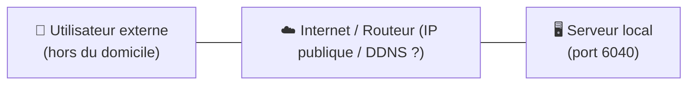
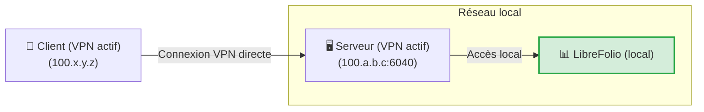
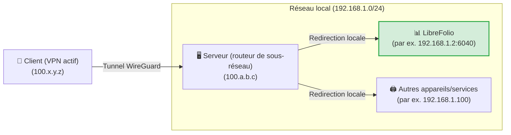
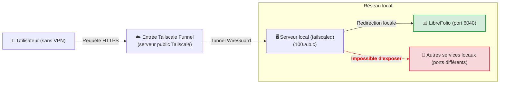
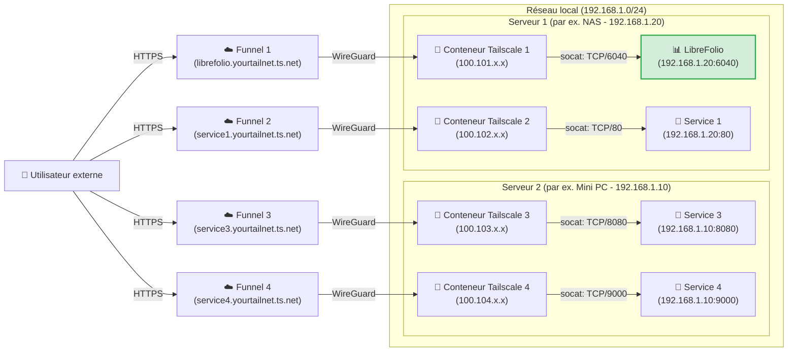

# 🌐 Exposer en toute sécurité

Ce guide explique comment accéder à LibreFolio depuis l'extérieur de chez vous **sans ouvrir aucun port sur votre routeur**, grâce à [Tailscale](https://tailscale.com/), un VPN maillé sécurisé et gratuit pour un usage domestique. Les mêmes étapes fonctionnent pour n'importe quel autre service de votre réseau local.

Vous avez besoin de l'**Étape 0**, plus du niveau qui vous correspond. Les niveaux 3 et 4 nécessitent en plus la [configuration unique de Funnel dans la console](#enabling-funnel-and-acls-on-the-console).

| Niveau | Idéal pour | Tailscale sur votre téléphone/PC | Adresse HTTPS publique |
|---|---|---|---|
| 🏃 1. VPN privé | Vous seul, avec la configuration la plus rapide | Nécessaire | Non |
| 🥉 2. Routeur de sous-réseau | Tous les appareils de votre réseau local, pas seulement LibreFolio | Nécessaire | Non |
| 🥈 3. Funnel | Une adresse publique pour LibreFolio, et son installation comme application | Non nécessaire | Oui |
| 🥇 4. Multi-Funnel avec Docker | Une adresse publique par service, chacun dans son propre conteneur | Non nécessaire | Oui |

!!! tip "⭐ Notre recommandation : le niveau 4"

    Le niveau 4 demande à peine plus de configuration que le niveau 3, garde chaque service isolé dans son propre conteneur et donne à chacun sa propre adresse publique. Les niveaux 1 à 3 sont des alternatives plus simples, qui montrent le chemin qui mène jusque-là.

Partout ci-dessous, `6040` est le port par défaut de LibreFolio : si vous avez défini un `PORT` différent dans votre `.env`, utilisez ce numéro à la place. LibreFolio sert l'application web, son API et la documentation intégrée sur ce seul port : c'est donc le seul port à exposer.

---

## 🔒 Pourquoi pas une simple redirection de port ?

La méthode classique consiste à ouvrir un port sur votre routeur domestique et à faire pointer un nom DNS dynamique (comme DuckDNS) vers votre IP publique. Cela fonctionne, mais :

- **Tout Internet peut le voir** : n'importe qui peut scanner votre IP publique et attaquer le port ouvert.
- **HTTPS est à votre charge** : vous devez faire tourner un reverse proxy (Nginx, Caddy…) et maintenir le renouvellement de ses certificats SSL.
- **Sans HTTPS, les données circulent en clair** : votre mot de passe et vos données financières peuvent être interceptés en chemin.



Tailscale évite ces trois problèmes : aucun port du routeur n'est ouvert, le trafic entre vos appareils est chiffré, et Funnel (niveaux 3 et 4) ajoute HTTPS avec des certificats que Tailscale gère pour vous.

---

## 🏁 Étape 0 : Installer Tailscale sur vos appareils

[Tailscale](https://tailscale.com/) est un VPN maillé basé sur le protocole **WireGuard** : vos appareils rejoignent un réseau privé (votre *tailnet*) et communiquent entre eux via des tunnels chiffrés. Il fonctionne sous Linux, macOS, Windows, iOS et Android, sur un NAS ou dans Docker, et son offre gratuite **Personal** suffit pour un usage domestique (voir la [tarification Tailscale](https://tailscale.com/pricing) pour les limites actuelles).

Installez-le et connectez-vous sur au moins deux appareils : le **serveur** qui exécute LibreFolio et un **client**, comme votre téléphone ou votre ordinateur portable.

=== "Linux"

    Exécutez la commande d'installation officielle sur le serveur :

    ```bash
    curl -fsSL https://tailscale.com/install.sh | sh
    sudo tailscale up
    ```

    Pour plus de détails, consultez le [Guide d'installation générique](https://tailscale.com/docs/install).

=== "macOS"

    Installez l'application officielle depuis le **Mac App Store** ou utilisez Homebrew :

    ```bash
    brew install --cask tailscale
    sudo tailscale up
    ```

    Pour plus de détails, consultez le [Guide d'installation générique](https://tailscale.com/docs/install).

=== "Windows"

    Téléchargez l'installateur officiel depuis le portail Tailscale et suivez l'assistant de connexion.

    Pour plus de détails, consultez le [Guide d'installation Windows](https://tailscale.com/docs/install/windows).

=== "Android"

    Installez l'application officielle depuis le [Google Play Store](https://play.google.com/store/apps/details?id=com.tailscale.ipn).

=== "iOS (iPhone/iPad)"

    Installez l'application officielle depuis l'[Apple App Store](https://apps.apple.com/us/app/tailscale/id1470499037).

??? tip "🔑 Gardez le serveur connecté — désactivez l'expiration des clés"

    Par défaut, Tailscale demande à chaque appareil de se reconnecter au bout de 180 jours. Un serveur ne devrait pas disparaître de votre tailnet pour cette raison ; désactivez donc cette option pour le serveur :

    1. Sur la page **Machines** de la console d'administration, repérez votre serveur.
    2. Cliquez sur l'**icône à trois points (...)** à droite de la ligne de l'appareil.
    3. Sélectionnez l'option **Disable Key Expiry**.

---

## 🏃 Niveau 1 : VPN privé point à point

**Idéal pour vous seul, avec la configuration la plus rapide.** Votre téléphone ou votre ordinateur portable atteint LibreFolio via votre tailnet privé, et rien n'est exposé à Internet.



### ▶️ Étape 1 : Vérifier que LibreFolio répond sur son port

Rien à partager : avec Tailscale activé sur le serveur, le port `6040` de LibreFolio est déjà
accessible depuis votre tailnet à l'adresse IP Tailscale du serveur.

??? tip "Vous préférez une adresse HTTPS à l'intérieur de votre tailnet ?"

    Exécutez ceci sur le serveur, puis ouvrez `https://<server-name>.your-tailnet.ts.net` au lieu de l'IP :

    ```bash
    tailscale serve --bg 6040
    ```

    `--bg` le maintient actif après la fermeture du terminal ; `tailscale serve reset` le supprime. La
    première fois, Tailscale peut vous demander d'activer les certificats HTTPS pour votre tailnet. L'adresse
    reste privée : seuls les appareils de votre tailnet peuvent l'ouvrir.

### 📱 Étape 2 : Ouvrir LibreFolio depuis votre appareil

Avec Tailscale activé sur votre téléphone ou votre PC, saisissez dans le navigateur l'adresse IP Tailscale du serveur (ou son nom MagicDNS) suivie du port, par exemple `http://100.a.b.c:6040`.

⚠️ **Limites :** chaque appareil depuis lequel vous vous connectez doit avoir Tailscale activé, et vous n'atteignez que le serveur, pas le reste de votre réseau local (le niveau 2 ajoute cela).

---

## 🥉 Niveau 2 : Routeur de sous-réseau pour tout votre réseau local

**Idéal pour atteindre tous les appareils de la maison, pas seulement LibreFolio.** Le serveur devient un *routeur de sous-réseau* : avec Tailscale activé, votre client ouvre n'importe quelle IP locale comme s'il était à la maison, par exemple `http://192.168.1.2:6040` pour LibreFolio.



### 🔀 Étape 1 : Activer le routage de sous-réseau sur le serveur

=== "Linux"

    Activez le forwarding IP au niveau du noyau :

    ```bash
    echo 'net.ipv4.ip_forward = 1' | sudo tee -a /etc/sysctl.d/99-tailscale.conf
    echo 'net.ipv6.conf.all.forwarding = 1' | sudo tee -a /etc/sysctl.d/99-tailscale.conf
    sudo sysctl -p /etc/sysctl.d/99-tailscale.conf
    ```

    Commencez à annoncer le sous-réseau (remplacez la plage d'IP par votre réseau local, par ex. `192.168.1.0/24`) :

    ```bash
    sudo tailscale up --advertise-routes=192.168.1.0/24
    ```

=== "macOS"

    Utilisez le chemin de l'exécutable Tailscale pour annoncer le sous-réseau local :

    ```bash
    /Applications/Tailscale.app/Contents/MacOS/Tailscale up --advertise-routes=192.168.1.0/24
    ```

=== "Windows"

    Lancez l'invite de commandes (`cmd.exe`) ou PowerShell en tant qu'**Administrateur** et annoncez le sous-réseau local :

    ```cmd
    tailscale up --advertise-routes=192.168.1.0/24
    ```

### ✅ Étape 2 : Approuver la route dans la console d'administration

1. Rendez-vous sur la [console d'administration Tailscale](https://login.tailscale.com/admin/machines).
2. Cliquez sur les trois points à côté de votre serveur -> **Modifier les paramètres de route**.
3. Activez le sous-réseau annoncé.

Un routeur de sous-réseau fait partie de la plomberie de votre réseau : si vous l'avez sauté, désactivez maintenant l'expiration des clés pour le serveur (astuce à la fin de l'Étape 0).

⚠️ **Limites :** le client doit toujours avoir Tailscale activé, vous devez connaître les IP locales de vos appareils, et à l'intérieur de votre réseau local le trafic circule en HTTP en clair.

---

## 🔑 Activer Funnel et les ACL dans la console {: #enabling-funnel-and-acls-on-the-console }

**Configuration unique, requise par les niveaux 3 et 4.** Elle autorise Funnel dans les règles de contrôle d'accès (ACL) de l'ensemble de votre tailnet.

!!! warning "🔐 Avant de passer en public"

    Avec Funnel, n'importe qui sur Internet peut ouvrir votre page de connexion LibreFolio. Créez d'abord votre propre compte : le premier compte enregistré devient l'administrateur. Les inscriptions restent ensuite ouvertes : l'option **Enable Registration** (`enable_registration`) est activée par défaut ; désactivez-la dans les **Paramètres globaux** si vous ne voulez pas que des inconnus s'inscrivent (voir [Paramètres globaux](settings.md)).

1. Rendez-vous sur la page [Contrôles d'accès](https://login.tailscale.com/admin/acls) de la console d'administration Tailscale.
2. Cliquez sur le bouton **Add node attribute**.
3. Remplissez le formulaire :
    * **Targets** : les nœuds autorisés à utiliser Funnel. **Nous suggérons `tag:external_access`** (vous donnerez ce tag aux conteneurs Docker du niveau 4) ou `autogroup:member` (tous les appareils enregistrés sous votre compte personnel).
    * **Attributes** : saisissez `funnel`.
    * **Note** : quelques mots expliquant pourquoi la règle existe.
    * **IP Pools, App, Capability, etc.** : non nécessaires ici ; laissez-les vides ou à leurs valeurs par défaut.


Cette règle n'est pas une clé d'authentification : les clés d'authentification (niveau 4) servent uniquement à enregistrer un nouvel appareil ou conteneur dans votre tailnet.

??? example "📄 Voir la configuration JSON complète des ACL pour activer Funnel"

    Si vous préférez modifier directement le fichier de politique, cet exemple fonctionnel active Funnel pour vos propres appareils et pour les conteneurs tagués `tag:external_access` :

    ```json
    {
      // Declaration of authorized tags
      "tagOwners": {
        "tag:external_access": ["autogroup:admin"]
      },

      // Standard access rules
      "acls": [
        // Allows all nodes in your private network to communicate
        {"action": "accept", "src": ["*"], "dst": ["*:*"]}
      ],

      "ssh": [
        {
          "action": "check",
          "src":    ["autogroup:member"],
          "dst":    ["autogroup:self"],
          "users":  ["autogroup:nonroot", "root"]
        }
      ],

      // Enabling Funnel on specific nodes or tags
      "nodeAttrs": [
        {
          "target": ["autogroup:member"],
          "attr":   ["funnel"]
        },
        {
          "target": ["tag:external_access"],
          "attr":   ["funnel"]
        }
      ]
    }
    ```

---

## 🥈 Niveau 3 : Adresse HTTPS publique avec Tailscale Funnel

**Idéal pour une adresse publique, sans VPN sur le client.** Funnel publie LibreFolio à une adresse sécurisée `https://<server-name>.your-tailnet.ts.net` que n'importe qui peut ouvrir **sans installer Tailscale**. HTTPS est aussi ce qui vous permet d'[installer LibreFolio comme application (PWA)](../user/pwa.md) sur votre téléphone.

**Avant de commencer :** effectuez la [configuration unique de Funnel et des ACL dans la console](#enabling-funnel-and-acls-on-the-console).



### ▶️ Étape 1 : Démarrer le Funnel sur le serveur

Sur le serveur, publiez le port local de LibreFolio :

```bash
tailscale funnel --bg 6040
```

Funnel le sert à l'adresse `https://<server-name>.your-tailnet.ts.net` sur le port 443 ; `--bg` le
maintient actif après la fermeture du terminal, et `tailscale funnel reset` l'arrête. Aucune clé
d'authentification n'est nécessaire ici : le serveur a déjà rejoint votre tailnet à l'Étape 0.
Rien à configurer dans LibreFolio non plus : Funnel envoie `X-Forwarded-Proto: https`, donc avec la
valeur par défaut `SESSION_COOKIE_SECURE=auto`, LibreFolio marque son
[cookie de session](configuration.md) comme `Secure`. `never` n'est destiné qu'à un proxy qui
prétend utiliser HTTPS alors que le navigateur parle en HTTP en clair.

### ✅ Étape 2 : Approuver et attendre la propagation

La première fois, le terminal avertit que Funnel n'est pas encore autorisé pour ce nœud et affiche un lien comme celui-ci :

```text
Funnel is enabled, but the list of allowed nodes in the tailnet policy file does not include the one you are using.
To give access to this node you can edit the tailnet policy file, or visit:

         https://login.tailscale.com/f/funnel?node=xxxxxx
```

1. Ouvrez le lien dans votre navigateur, connectez-vous à Tailscale et approuvez Funnel pour ce nœud.
2. Le terminal affiche alors votre URL publique.
3. Attendez quelques minutes que les enregistrements MagicDNS se propagent avant de l'ouvrir depuis un réseau extérieur.

⚠️ **Limites :** une machine n'a qu'un seul nom public, que tous les services que vous publiez depuis celle-ci doivent partager. Le niveau 4 donne à chaque service le sien.

---

## 🥇 Niveau 4 : Multi-Funnel avec des sidecars Docker

**Idéal pour les utilisateurs de Docker qui veulent une adresse publique par service.** Chaque service reçoit un petit conteneur Tailscale (un *sidecar*) qui rejoint votre tailnet comme un nœud à part entière, avec sa propre adresse `https://<name>.your-tailnet.ts.net`. Un script de démarrage installe **socat** dans le sidecar, et socat redirige le trafic Funnel vers l'IP LAN statique du service.

**Avant de commencer :** effectuez la [configuration unique de Funnel et des ACL dans la console](#enabling-funnel-and-acls-on-the-console).

??? info "🧰 Qu'est-ce que socat ?"

    **socat** (SOcket CAT) est un petit outil en ligne de commande qui relaie des données entre deux connexions. Ici, il joue le rôle d'un **mini redirecteur** : il écoute sur un port à l'intérieur du conteneur Tailscale et transmet tout ce qu'il reçoit vers le port réel du service sur votre réseau local.

Ajoutez un sidecar pour chaque service que vous souhaitez publier, sur un seul hôte ou plusieurs ; la seule limite est le nombre d'appareils tagués que votre [offre Tailscale](https://tailscale.com/pricing) autorise. Dans cet exemple, deux hôtes exécutent chacun deux sidecars :



### 📁 Étape 1 : Préparer le dossier et le script

Créez un dossier sur le serveur, par exemple à l'endroit où vous conservez vos volumes Docker persistants :

```bash
# Create a folder for the Tailscale nodes and enter it
mkdir -p <path_chosen>/tailscale-nodes
cd <path_chosen>/tailscale-nodes
```

Téléchargez ensuite le script de démarrage <a href="https://raw.githubusercontent.com/Librefolio/LibreFolio/main/mkdocs_src/docs/static/tailscale-guide/custom_startup.sh" target="_blank" rel="noopener noreferrer">custom_startup.sh</a> dans ce dossier :

```bash
# Download the script from the official repository
wget https://raw.githubusercontent.com/Librefolio/LibreFolio/main/mkdocs_src/docs/static/tailscale-guide/custom_startup.sh
# Make the script executable
chmod +x custom_startup.sh
```

??? info "🔄 Sidecar configuré auparavant ? Mettez à jour votre copie du script"

    Le script actuel fonctionne aussi comme un **watchdog** et est livré avec un health check Docker (voir l'Étape 2). Si votre sidecar exécute une copie plus ancienne, mettez-la à jour :

    1. **Téléchargez à nouveau le script** dans le même dossier. L'option `-O custom_startup.sh` écrase l'ancien fichier (sans elle, `wget` enregistre le téléchargement sous `custom_startup.sh.1`). Assurez-vous ensuite que le script est exécutable :

        ```bash
        cd <path_chosen>/tailscale-nodes
        wget -O custom_startup.sh https://raw.githubusercontent.com/Librefolio/LibreFolio/main/mkdocs_src/docs/static/tailscale-guide/custom_startup.sh
        chmod +x custom_startup.sh
        ```

    2. **Mettez à jour votre fichier compose** : ajoutez `TS_ENABLE_HEALTH_CHECK`, `TS_LOCAL_ADDR_PORT` et, éventuellement, `STARTUP_TIMEOUT` au service Tailscale, ainsi que le bloc `healthcheck`, exactement comme à l'Étape 2.

    3. **Recréez le conteneur** : un redémarrage n'applique pas les modifications du compose. Exécutez `docker compose up -d` dans le dossier de votre `docker-compose.yml` (cela recrée les services dont la configuration a changé), ou utilisez l'action *Recreate* / redéployer de Portainer ou CasaOS.

    4. **Vérifiez le journal** avec `docker logs -f tailscale-librefolio` : vous devriez voir `Tailscale is running.`, puis `Starting the funnel on port 6040...` et `Available on the internet:` avec votre URL publique. Dans les 2 minutes du `start_period` du health check, Docker affiche le conteneur comme **healthy** (`docker ps`, Portainer, CasaOS). S'il redémarre en boucle à la place, consultez le panneau de dépannage de l'[Étape 3](#3-startup-and-approval).

### 🐳 Étape 2 : Configurer Docker Compose

Ajoutez le service Tailscale dans le **même `docker-compose.yml` que le service** qu'il expose (par exemple LibreFolio), afin que les deux restent ensemble :

```yaml
services:
  tailscale-librefolio:
    image: tailscale/tailscale:latest
    container_name: tailscale-librefolio
    hostname: tailscale-librefolio
    restart: unless-stopped
    privileged: false
    network_mode: bridge
    cap_add:
      - NET_ADMIN
      - NET_RAW
    devices:
      - /dev/net/tun:/dev/net/tun
    command:
      - /custom_startup.sh
    environment:
      - HOST_IP=192.168.1.20                # Local IP of the service to expose (e.g. Server 1)
      - HOST_PORT=6040                      # Real port of the service to expose
      - TAILSCALE_FUNNEL_PORT=6040          # Internal Funnel port
      - TS_HOSTNAME=librefolio              # Custom public hostname (e.g. librefolio)
      - TS_AUTHKEY=tskey-auth-...           # Authentication key generated by Tailscale
      - TS_ACCEPT_DNS=true
      - TS_STATE_DIR=/var/lib/tailscale
      - TS_USERSPACE=false
      - TS_ENABLE_HEALTH_CHECK=true         # Expose /healthz for the healthcheck below (Tailscale ≥ 1.78)
      - TS_LOCAL_ADDR_PORT=127.0.0.1:9002   # Where /healthz listens: inside the container only
      - STARTUP_TIMEOUT=180                 # Optional: seconds to reach the Running state (default 180)
    volumes:
      - <path_chosen>/tailscale-nodes/tailscale-librefolio/state:/var/lib/tailscale
      - <path_chosen>/tailscale-nodes/custom_startup.sh:/custom_startup.sh
      - /etc/localtime:/etc/localtime:ro
      - /etc/timezone:/etc/timezone:ro
    # Shows healthy/unhealthy in Docker, Portainer or CasaOS; the restart itself comes from custom_startup.sh exiting
    healthcheck:
      test: ["CMD", "wget", "-q", "-O", "/dev/null", "http://127.0.0.1:9002/healthz"]
      interval: 30s
      timeout: 5s
      retries: 3
      start_period: 120s
```

Définissez ensuite ces valeurs pour votre réseau :

| Valeur | Ce qu'il faut mettre |
|---|---|
| `<path_chosen>` | Le chemin absolu choisi à l'Étape 1, où se trouvent le script et les données d'état (par ex. `/home/user/docker`). |
| `HOST_IP` | L'IP LAN statique de la machine qui exécute le service. |
| `HOST_PORT` | Le port réel du service sur cette machine : pour LibreFolio, le `PORT` de votre `.env` (`6040` par défaut). |
| `TAILSCALE_FUNNEL_PORT` | Le port sur lequel le conteneur écoute et qu'il publie via Funnel. Définissez-le sur la même valeur que `HOST_PORT`. |
| `TS_HOSTNAME` | Le nom du nœud : l'adresse publique devient `https://TS_HOSTNAME.your-tailnet.ts.net`. |
| `TS_AUTHKEY` | La clé d'authentification qui enregistre le conteneur dans votre tailnet (voir ci-dessous). |

Pour obtenir la clé d'authentification destinée à `TS_AUTHKEY` :

1. Rendez-vous sur [Clés des paramètres d'administration Tailscale](https://login.tailscale.com/admin/settings/keys).
2. Dans la section **Auth keys** (*pas* dans la section des jetons d'accès API), cliquez sur le bouton **Generate auth key...**.
3. Activez l'interrupteur **Tags** et sélectionnez votre tag (par ex. `tag:external_access`). Ajoutez une description que vous reconnaîtrez, comme `docker-librefolio-funnel`.
4. Cliquez sur **Generate** et copiez la clé (`tskey-auth-...`).

Une fois le conteneur démarré, la clé à usage unique est consommée : elle disparaît de la liste **Keys**, et le nouvel appareil apparaît dans **Machines**.

??? info "🩺 Watchdog et health check — ce que font les paramètres supplémentaires"

    Le script de démarrage fonctionne aussi comme un **watchdog**, tandis que le bloc `healthcheck` rend visible l'état du conteneur :

    * **Watchdog (redémarrage automatique)** : si Tailscale ne parvient pas à démarrer (par exemple, aucune connexion Internet au démarrage ou un flag erroné), n'atteint pas l'état *Running* dans les `STARTUP_TIMEOUT` secondes, ou si Tailscale, socat ou le Funnel s'arrêtent plus tard, le script se termine avec une erreur et Docker redémarre le conteneur (`restart: unless-stopped`). Le conteneur ne reste jamais « démarré » sans rien derrière, et un `docker stop` arrête toujours proprement l'ensemble.
    * **Health check (état uniquement)** : `TS_ENABLE_HEALTH_CHECK=true` active le point de terminaison `/healthz` de Tailscale (Tailscale 1.78 ou ultérieur), qui répond `200` tant que le nœud possède une adresse IP Tailscale, et `503` sinon. Docker l'interroge régulièrement et marque le conteneur *healthy* ou *unhealthy* ; Portainer et CasaOS affichent le même état.

    Docker simple (hors mode Swarm) ne redémarre **pas** un conteneur marqué *unhealthy* : le redémarrage provient de la sortie du script, vous n'avez donc pas besoin d'un conteneur « autoheal » supplémentaire (ces assistants nécessitent aussi le socket Docker, c'est-à-dire le contrôle total de l'hôte).

    | Paramètre facultatif | Ce qu'il fait |
    |---|---|
    | `TS_LOCAL_ADDR_PORT` | L'endroit où `/healthz` écoute. Le point de terminaison ne nécessite aucune authentification, et la valeur par défaut de Tailscale, `[::]:9002`, écoute sur toutes les interfaces : `127.0.0.1:9002` le maintient à l'intérieur du conteneur. Si vous le modifiez, mettez aussi à jour l'URL du test `healthcheck`. |
    | `STARTUP_TIMEOUT` | Nombre de secondes pendant lesquelles le script attend l'état *Running* (par défaut `180`) avant de se terminer et que Docker redémarre le conteneur. Augmentez-le uniquement sur un serveur très lent. |
    | `DEBUG` | Absent de l'exemple ci-dessus. `DEBUG=1` affiche dans le journal du conteneur chaque commande exécutée par le script, pour le dépannage. Désactivé par défaut pour garder le journal lisible. |

??? example "📄 Voir le fichier Docker Compose de production complet (LibreFolio + Tailscale)"

    Un `docker-compose.yml` complet : le service `librefolio` du `docker-compose.prod.yml` officiel, avec le sidecar Tailscale à côté :

    ```yaml
    # =============================================================================
    # LibreFolio — Production Docker Compose
    # =============================================================================
    # Optimized for end-users running the official pre-built image from GHCR.
    # =============================================================================

    services:
      librefolio:
        image: ${LIBREFOLIO_IMAGE:-ghcr.io/librefolio/librefolio:latest}
        container_name: librefolio
        restart: unless-stopped
        ports:
          - "${PORT:-6040}:6040"
        volumes:
          - ./LibreFolio-data:/app/backend/data/prod-docker
        env_file: .env
        environment:
          - LIBREFOLIO_DATA_DIR=/app/backend/data/prod-docker
          - HOST=0.0.0.0
        healthcheck:
          test: ["CMD", "python", "-c", "import urllib.request; urllib.request.urlopen('http://localhost:6040/api/v1/system/health')"]
          interval: 30s
          timeout: 10s
          start_period: 15s
          retries: 3

      tailscale-librefolio:
        image: tailscale/tailscale:latest
        container_name: tailscale-librefolio
        hostname: tailscale-librefolio
        restart: unless-stopped
        privileged: false
        network_mode: bridge
        cap_add:
          - NET_ADMIN
          - NET_RAW
        devices:
          - /dev/net/tun:/dev/net/tun
        command:
          - /custom_startup.sh
        environment:
          - HOST_IP=192.168.1.20                # Local IP of the service to expose (e.g. Server 1)
          - HOST_PORT=6040                      # Real port of the service to expose
          - TAILSCALE_FUNNEL_PORT=6040          # Internal Funnel port
          - TS_HOSTNAME=librefolio              # Custom public hostname (e.g. librefolio)
          - TS_AUTHKEY=tskey-auth-...           # Replace with your generated key
          - TS_ACCEPT_DNS=true
          - TS_STATE_DIR=/var/lib/tailscale
          - TS_USERSPACE=false
          - TS_ENABLE_HEALTH_CHECK=true         # Expose /healthz for the healthcheck below (Tailscale ≥ 1.78)
          - TS_LOCAL_ADDR_PORT=127.0.0.1:9002   # Where /healthz listens: inside the container only
          - STARTUP_TIMEOUT=180                 # Optional: seconds to reach the Running state (default 180)
        volumes:
          - /DATA/AppData/tailscale-nodes/tailscale-librefolio/state:/var/lib/tailscale
          - /DATA/AppData/tailscale-nodes/custom_startup.sh:/custom_startup.sh
          - /etc/localtime:/etc/localtime:ro
          - /etc/timezone:/etc/timezone:ro
        # Shows healthy/unhealthy in Docker, Portainer or CasaOS; the restart itself comes from custom_startup.sh exiting
        healthcheck:
          test: ["CMD", "wget", "-q", "-O", "/dev/null", "http://127.0.0.1:9002/healthz"]
          interval: 30s
          timeout: 5s
          retries: 3
          start_period: 120s
    ```

### 🚀 Étape 3 : Démarrer et approuver le Funnel {: #3-startup-and-approval }

Démarrez la stack, le service et son sidecar Tailscale ensemble :

```bash
docker compose up -d
```

Suivez ensuite le journal du conteneur Tailscale :

```bash
docker logs -f tailscale-librefolio
```

Au premier démarrage, le journal affiche le lien d'approbation du nouveau nœud :

```text
Funnel is enabled, but the list of allowed nodes in the tailnet policy file does not include the one you are using.
To give access to this node you can edit the tailnet policy file, or visit:

         https://login.tailscale.com/f/funnel?node=nsKGo6k9ZF11CNTRL
```

* Ouvrez le lien dans votre navigateur, connectez-vous à Tailscale et approuvez l'activation du Funnel.
* Juste après l'approbation, le journal confirme l'URL publique et le proxy local :

```text
Available on the internet:

https://librefolio.yourtailnet.ts.net/
|-- proxy http://127.0.0.1:6040

Press Ctrl+C to exit.
```

Le service est maintenant en ligne : attendez quelques minutes que les enregistrements MagicDNS se propagent, puis ouvrez l'URL.
Rien à configurer dans LibreFolio : Funnel envoie `X-Forwarded-Proto: https` et socat le transmet,
donc avec la valeur par défaut `SESSION_COOKIE_SECURE=auto`, LibreFolio marque son
[cookie de session](configuration.md) comme `Secure`. `never` n'est destiné qu'à un proxy qui
prétend utiliser HTTPS alors que le navigateur parle en HTTP en clair.

??? question "🛠️ Le conteneur redémarre en boucle ou est marqué unhealthy"

    Un problème persistant se manifeste par un conteneur qui redémarre sans cesse (Docker, Portainer ou CasaOS peuvent aussi le marquer *unhealthy*), et non par un conteneur qui semble « démarré » mais ne fonctionne pas. Lisez le journal avec `docker logs tailscale-librefolio` : avant chaque redémarrage, le script indique ce qui a échoué, généralement suivi de `Exiting so Docker restarts the container.` Les causes les plus fréquentes :

    * **Un flag dans `TS_EXTRA_ARGS` n'a pas de valeur.** Cette variable facultative (absente du compose ci-dessus) transmet des flags supplémentaires à `tailscale up`, découpés sur les espaces. Un flag sans sa valeur fait échouer `tailscale up` : la raison se trouve sur la ligne juste après `Running 'tailscale up'`, au-dessus du texte d'aide qui commence par `USAGE` (par exemple `flag needs an argument: -advertise-tags`), suivie de `failed to auth tailscale: … tailscale up failed: exit status 2` et `containerboot exited before Tailscale was running.` Écrivez chaque valeur sous la forme `--flag=value` ou `--flag value` : `--advertise-tags=tag:container` et `--advertise-tags tag:container` fonctionnent tous les deux.
    * **Un panneau d'administration a tronqué la valeur.** L'éditeur de variables d'environnement de CasaOS (et de panneaux similaires) tronque une valeur à son deuxième `=` : `TS_EXTRA_ARGS=--advertise-tags=tag:container` devient `--advertise-tags`, ce qui échoue comme décrit ci-dessus. Dans ces panneaux, écrivez les valeurs des flags avec un espace : `--advertise-tags tag:container`.
    * **Une variable requise est manquante** : le script s'arrête immédiatement avec `HOST_IP is not set` (ou le même message pour `HOST_PORT` ou `TAILSCALE_FUNNEL_PORT`).
    * **Aucune connexion Internet au démarrage** : le conteneur redémarre sans cesse jusqu'à ce que Tailscale puisse démarrer, puis fonctionne normalement. C'est attendu.
    * **Démarrage très lent** : le journal affiche `Tailscale is not running after 180s.` ; augmentez `STARTUP_TIMEOUT`.
    * **Unhealthy, mais sans redémarrage** : le health check n'obtient aucune réponse réussie de `/healthz`. Si vous venez de l'ajouter, vérifiez que `TS_ENABLE_HEALTH_CHECK=true` est bien défini et que l'URL du test `healthcheck` correspond à `TS_LOCAL_ADDR_PORT` ; sinon, le nœud n'a pas d'adresse IP Tailscale à cet instant.

    Pour tracer chaque commande du script, ajoutez `DEBUG=1` à la section `environment`, recréez le conteneur et relisez le journal.

Comme sa clé d'authentification porte un tag, Tailscale désactive par défaut l'expiration des clés pour le conteneur. Avec une clé sans tag, désactivez-la comme pour le serveur (astuce à la fin de l'Étape 0).

⚠️ **Limites :** cela demande un terminal et quelques modifications des fichiers Docker Compose.

---

## 🔮 MagicDNS et domaines personnalisés

**MagicDNS** donne un nom à chaque appareil de votre tailnet : au lieu d'une IP comme `100.110.x.x`, vous pouvez saisir `http://your-server` dans le navigateur. Les adresses Funnel publiques se terminent par `.ts.net` (par exemple, `https://librefolio.your-tailnet.ts.net`, où `librefolio` est le `TS_HOSTNAME` du niveau 4).

Vous préférez votre propre domaine, comme `librefolio.mydomain.com` ? Deux méthodes fonctionnent pour un accès **privé**, via le VPN :

??? tip "🌍 Méthode 1 — Un enregistrement DNS public pointant vers l'IP Tailscale (la plus simple)"

    1. Connectez-vous à la console de votre registrar de domaine (par ex. Cloudflare, GoDaddy, Namecheap).
    2. Créez un enregistrement DNS de type **A** (ou **AAAA** pour IPv6) pour le sous-domaine choisi (par ex. `librefolio.mydomain.com`).
    3. Faites pointer l'enregistrement directement vers l'**IP Tailscale privée** de votre serveur (par ex. `100.77.x.x`).

    Les adresses du réseau `100.64.0.0/10` ne sont pas routables sur Internet, le nom ne fonctionne donc **que** lorsque vous êtes connecté à votre tailnet : aucun tiers ne peut atteindre ou scanner le service. Pour plus de détails, consultez la [documentation officielle sur les paramètres DNS](https://tailscale.com/kb/1054/dns#public-dns).

??? tip "🧭 Méthode 2 — Split DNS avec votre propre serveur DNS"

    Pour des enregistrements internes que vous gérez vous-même et ne publiez jamais sur Internet :

    1. Configurez un serveur DNS privé dans votre réseau local (comme Pi-hole, AdGuard Home ou CoreDNS).
    2. Ajoutez des enregistrements locaux de votre domaine en les faisant pointer vers vos IP Tailscale.
    3. Dans la console d'administration Tailscale, allez dans *DNS -> Nameservers -> Add Nameserver* et ajoutez l'IP Tailscale de votre DNS privé comme serveur de noms global ou restreint à votre domaine. Pour plus de détails, consultez la [documentation officielle sur le Split DNS](https://tailscale.com/kb/1054/dns#split-dns).

Pour un accès **public**, conservez l'adresse `*.ts.net` : Funnel la sert avec un certificat signé pour ce nom, donc faire pointer votre propre domaine vers elle (CNAME) provoque des erreurs SSL/TLS dans les navigateurs, à moins d'ajouter votre propre reverse proxy (comme Caddy ou Nginx) avec des certificats pour votre domaine.

---

## 🔗 Liens utiles

* 🖥️ [Console d'administration Tailscale (Machines)](https://login.tailscale.com/admin/machines)
* 🔐 [Gestion des contrôles d'accès (ACL)](https://login.tailscale.com/admin/acls)
* 📖 [Guide officiel de Tailscale Funnel (documentation en anglais)](https://tailscale.com/kb/1223/tailscale-funnel)
* 🐳 [Exécuter Tailscale dans Docker](https://tailscale.com/kb/1282/docker)
