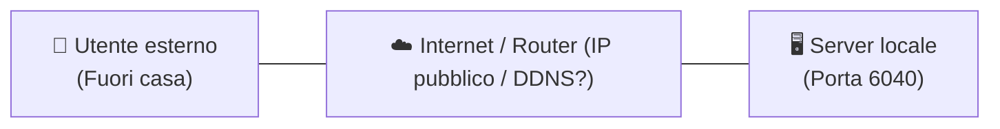
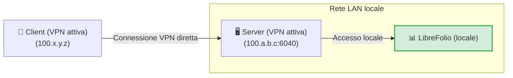
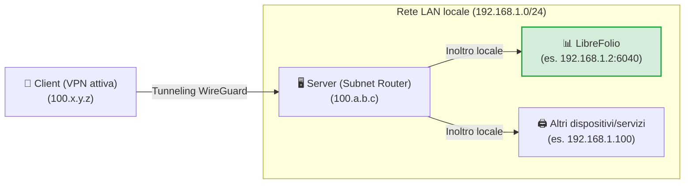
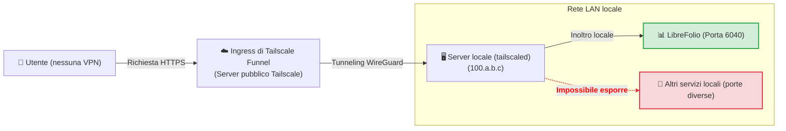
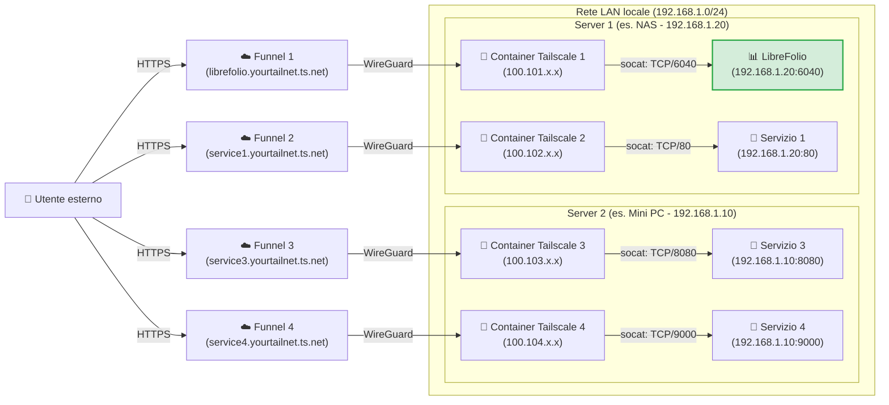

# 🌐 Esposizione sicura

Questa guida mostra come raggiungere LibreFolio fuori casa **senza aprire alcuna porta sul tuo router**, usando [Tailscale](https://tailscale.com/), una VPN mesh sicura e gratuita per uso domestico. Gli stessi passaggi valgono per qualsiasi altro servizio sulla tua rete locale.

Ti servono il **Passo 0** più il livello che fa per te. I livelli 3 e 4 richiedono anche la [configurazione una tantum di Funnel sulla console](#enabling-funnel-and-acls-on-the-console).

| Livello | Ideale per | Tailscale sul tuo telefono/PC | Indirizzo HTTPS pubblico |
|---|---|---|---|
| 🏃 1. VPN privata | Solo tu, con la configurazione più rapida | Necessario | No |
| 🥉 2. Subnet router | Ogni dispositivo della tua LAN domestica, non solo LibreFolio | Necessario | No |
| 🥈 3. Funnel | Un indirizzo pubblico per LibreFolio e installarlo come app | Non necessario | Sì |
| 🥇 4. Multi-Funnel con Docker | Un indirizzo pubblico per servizio, ciascuno nel proprio container | Non necessario | Sì |

!!! tip "⭐ La nostra raccomandazione: Livello 4"

    Il Livello 4 richiede solo poco più lavoro del Livello 3, mantiene ogni servizio isolato nel proprio container e assegna a ciascuno il proprio indirizzo pubblico. I Livelli 1–3 sono alternative più semplici e mostrano il percorso che porta fin lì.

Ovunque sotto, `6040` è la porta predefinita di LibreFolio: se hai impostato un `PORT` diverso nel tuo `.env`, usa quel numero. LibreFolio serve l'app web, la sua API e la documentazione integrata su questa unica porta, quindi è l'unica porta da esporre.

---

## 🔒 Perché non il semplice port forwarding?

Il modo classico consiste nell'aprire una porta sul router di casa e puntare un nome DNS dinamico (come DuckDNS) al tuo IP pubblico. Funziona, ma:

- **L'intera Internet può vederlo**: chiunque può scansionare il tuo IP pubblico e attaccare la porta aperta.
- **L'HTTPS è compito tuo**: devi gestire un reverse proxy (Nginx, Caddy…) e mantenerne rinnovati i certificati SSL.
- **Senza HTTPS, i dati viaggiano in chiaro**: la tua password e i tuoi dati finanziari possono essere intercettati lungo il tragitto.



Tailscale evita tutti e tre i problemi: nessuna porta del router viene aperta, il traffico tra i tuoi dispositivi è cifrato e Funnel (Livelli 3 e 4) aggiunge HTTPS con certificati gestiti da Tailscale per te.

---

## 🏁 Passo 0: installa Tailscale sui tuoi dispositivi

[Tailscale](https://tailscale.com/) è una VPN mesh basata sul protocollo **WireGuard**: i tuoi dispositivi entrano a far parte di una rete privata (la tua *tailnet*) e comunicano fra loro tramite tunnel cifrati. Funziona su Linux, macOS, Windows, iOS e Android, su un NAS o dentro Docker, e il suo piano **Personal** gratuito basta per uso domestico (vedi i [prezzi di Tailscale](https://tailscale.com/pricing) per i limiti attuali).

Installalo e accedi su almeno due dispositivi: il **server** che esegue LibreFolio e un **client**, come il tuo telefono o portatile.

=== "Linux"

    Esegui il comando di installazione ufficiale sul server:

    ```bash
    curl -fsSL https://tailscale.com/install.sh | sh
    sudo tailscale up
    ```

    Per maggiori dettagli, vedi la [Guida di installazione generica](https://tailscale.com/docs/install).

=== "macOS"

    Installa l'app ufficiale dal **Mac App Store** o usa Homebrew:

    ```bash
    brew install --cask tailscale
    sudo tailscale up
    ```

    Per maggiori dettagli, vedi la [Guida di installazione generica](https://tailscale.com/docs/install).

=== "Windows"

    Scarica il programma di installazione ufficiale dal portale Tailscale e segui la procedura guidata di accesso.

    Per i dettagli, vedi la [Guida di installazione per Windows](https://tailscale.com/docs/install/windows).

=== "Android"

    Installa l'applicazione ufficiale dal [Google Play Store](https://play.google.com/store/apps/details?id=com.tailscale.ipn).

=== "iOS (iPhone/iPad)"

    Installa l'applicazione ufficiale dall'[Apple App Store](https://apps.apple.com/us/app/tailscale/id1470499037).

??? tip "🔑 Mantieni il server connesso — disabilita la scadenza della chiave"

    Per impostazione predefinita, Tailscale chiede a ogni dispositivo di effettuare di nuovo l'accesso dopo 180 giorni. Un server non dovrebbe sparire dalla tua tailnet per questo motivo, quindi disattivalo per il server:

    1. Nella pagina **Machines** della console di amministrazione, individua il tuo server.
    2. Clicca l'**icona con i tre punti (...)** a destra della riga del dispositivo.
    3. Seleziona l'opzione **Disable Key Expiry**.

---

## 🏃 Livello 1: VPN privata point-to-point

**Ideale per te solo, con la configurazione più rapida.** Il tuo telefono o portatile raggiunge LibreFolio attraverso la tua tailnet privata e nulla è esposto a internet.



### ▶️ Passo 1: verifica che LibreFolio risponda sulla sua porta

Nulla da condividere: con Tailscale attivo sul server, la porta `6040` di LibreFolio è già
raggiungibile dalla tua tailnet all'IP Tailscale del server.

??? tip "Preferisci un indirizzo HTTPS dentro la tua tailnet?"

    Esegui questo sul server, poi apri `https://<server-name>.your-tailnet.ts.net` invece dell'IP:

    ```bash
    tailscale serve --bg 6040
    ```

    `--bg` lo mantiene attivo dopo che chiudi il terminale; `tailscale serve reset` lo rimuove. La
    prima volta, Tailscale potrebbe chiederti di abilitare i certificati HTTPS per la tua tailnet. L'indirizzo
    resta comunque privato: solo i dispositivi della tua tailnet possono aprirlo.

### 📱 Passo 2: apri LibreFolio dal tuo dispositivo

Con Tailscale attivo sul telefono o sul PC, digita l'IP Tailscale del server (o il suo nome MagicDNS) seguito dalla porta nel browser, ad esempio `http://100.a.b.c:6040`.

⚠️ **Limiti:** ogni dispositivo da cui ti connetti deve avere Tailscale attivo, e raggiungi solo il server, non il resto della tua LAN domestica (il Livello 2 aggiunge questo).

---

## 🥉 Livello 2: subnet router per l'intera LAN domestica

**Ideale per raggiungere ogni dispositivo di casa, non solo LibreFolio.** Il server diventa un *subnet router*: con Tailscale attivo, il tuo client apre qualsiasi IP locale come se fosse a casa, ad esempio `http://192.168.1.2:6040` per LibreFolio.



### 🔀 Passo 1: abilita il subnet routing sul server

=== "Linux"

    Abilita l'IP forwarding a livello di kernel:

    ```bash
    echo 'net.ipv4.ip_forward = 1' | sudo tee -a /etc/sysctl.d/99-tailscale.conf
    echo 'net.ipv6.conf.all.forwarding = 1' | sudo tee -a /etc/sysctl.d/99-tailscale.conf
    sudo sysctl -p /etc/sysctl.d/99-tailscale.conf
    ```

    Inizia ad annunciare la subnet (sostituisci l'intervallo IP con la tua rete locale, ad es. `192.168.1.0/24`):

    ```bash
    sudo tailscale up --advertise-routes=192.168.1.0/24
    ```

=== "macOS"

    Usa il percorso dell'eseguibile Tailscale per annunciare la subnet locale:

    ```bash
    /Applications/Tailscale.app/Contents/MacOS/Tailscale up --advertise-routes=192.168.1.0/24
    ```

=== "Windows"

    Esegui il Prompt dei comandi (`cmd.exe`) o PowerShell come **Amministratore** e annuncia la subnet locale:

    ```cmd
    tailscale up --advertise-routes=192.168.1.0/24
    ```

### ✅ Passo 2: approva la route nella console di amministrazione

1. Vai alla [Console di amministrazione Tailscale](https://login.tailscale.com/admin/machines).
2. Clicca i tre punti accanto al tuo server -> **Edit route settings**.
3. Abilita la subnet annunciata.

Un subnet router fa parte dell'infrastruttura della tua rete: se l'hai saltato, disabilita ora la scadenza della chiave per il server (suggerimento alla fine del Passo 0).

⚠️ **Limiti:** il client ha comunque bisogno di Tailscale attivo, devi conoscere gli IP locali dei tuoi dispositivi e, all'interno della tua LAN, il traffico viaggia come HTTP in chiaro.

---

## 🔑 Abilitare Funnel e le ACL sulla console {: #enabling-funnel-and-acls-on-the-console }

**Configurazione una tantum, necessaria per i Livelli 3 e 4.** Consente Funnel nelle regole di controllo degli accessi (ACL) dell'intera tua tailnet.

!!! warning "🔐 Prima di rendere pubblico il servizio"

    Con Funnel, chiunque su internet può aprire la tua pagina di accesso a LibreFolio. Crea prima il tuo account: il primo account registrato diventa l'amministratore. Dopodiché, le registrazioni restano aperte (**Enable Registration**, `enable_registration`, è attivo per impostazione predefinita): disattivalo nelle **Impostazioni globali** se non vuoi che estranei si registrino (vedi [Impostazioni globali](settings.md)).

1. Visita la pagina [Access Controls](https://login.tailscale.com/admin/acls) nella console di amministrazione Tailscale.
2. Clicca il pulsante **Add node attribute**.
3. Compila il modulo:
    * **Targets**: i nodi autorizzati a usare Funnel. **Suggeriamo `tag:external_access`** (assegnerai questo tag ai container Docker del Livello 4) oppure `autogroup:member` (tutti i dispositivi registrati sotto il tuo account personale).
    * **Attributes**: inserisci `funnel`.
    * **Note**: qualche parola sul perché esiste la regola.
    * **IP Pools, App, Capability, ecc.**: non servono qui; lasciali vuoti o ai valori predefiniti.


Questa regola non è una auth key: le auth key (Livello 4) registrano soltanto un nuovo dispositivo o container nella tua tailnet.

??? example "📄 Visualizza la configurazione JSON completa delle ACL per abilitare Funnel"

    Se preferisci modificare direttamente il file delle policy, questo esempio funzionante abilita Funnel per i tuoi dispositivi e per i container taggati `tag:external_access`:

    ```json
    {
      // Dichiarazione dei tag autorizzati
      "tagOwners": {
        "tag:external_access": ["autogroup:admin"]
      },

      // Regole di accesso standard
      "acls": [
        // Consente a tutti i nodi della tua rete privata di comunicare
        {"action": "accept", "src": ["*"], "dst": ["*:*"]}
      ],

      "ssh": [
        {
          "action": "check",
          "src":    ["autogroup:member"],
          "dst":    ["autogroup:self"],
          "users":  ["autogroup:nonroot", "root"]
        }
      ],

      // Abilitazione di Funnel su nodi o tag specifici
      "nodeAttrs": [
        {
          "target": ["autogroup:member"],
          "attr":   ["funnel"]
        },
        {
          "target": ["tag:external_access"],
          "attr":   ["funnel"]
        }
      ]
    }
    ```

---

## 🥈 Livello 3: indirizzo HTTPS pubblico con Tailscale Funnel

**Ideale per un indirizzo pubblico, senza VPN sul client.** Funnel pubblica LibreFolio a un indirizzo sicuro `https://<server-name>.your-tailnet.ts.net` che chiunque può aprire **senza installare Tailscale**. L'HTTPS è anche ciò che ti permette di [installare LibreFolio come app (PWA)](../user/pwa.md) sul tuo telefono.

**Prima di iniziare:** completa la [configurazione una tantum di Funnel e delle ACL sulla console](#enabling-funnel-and-acls-on-the-console).



### ▶️ Passo 1: avvia il Funnel sul server

Sul server, pubblica la porta locale di LibreFolio:

```bash
tailscale funnel --bg 6040
```

Funnel lo serve all'indirizzo `https://<server-name>.your-tailnet.ts.net` sulla porta 443; `--bg` lo mantiene attivo
dopo che chiudi il terminale, e `tailscale funnel reset` lo arresta. Qui non serve alcuna auth key: il
server è già entrato nella tua tailnet nel Passo 0.
Niente da configurare nemmeno in LibreFolio: Funnel invia `X-Forwarded-Proto: https`, quindi con il
valore predefinito `SESSION_COOKIE_SECURE=auto` LibreFolio contrassegna il suo
[cookie di sessione](configuration.md) come `Secure`. `never` è solo per un proxy che
dichiara HTTPS verso un browser su HTTP in chiaro.

### ✅ Passo 2: approva e attendi la propagazione

La prima volta, il terminale avverte che Funnel non è ancora consentito per questo nodo e mostra un link come questo:

```text
Funnel is enabled, but the list of allowed nodes in the tailnet policy file does not include the one you are using.
To give access to this node you can edit the tailnet policy file, or visit:

         https://login.tailscale.com/f/funnel?node=xxxxxx
```

1. Apri il link nel browser, accedi a Tailscale e approva Funnel per questo nodo.
2. Il terminale mostra quindi il tuo URL pubblico.
3. Attendi qualche minuto perché i record MagicDNS si propaghino prima di aprirlo da una rete esterna.

⚠️ **Limiti:** una macchina ha un solo nome pubblico, che ogni servizio pubblicato da essa deve condividere. Il Livello 4 assegna a ciascun servizio il proprio.

---

## 🥇 Livello 4: Multi-Funnel con sidecar Docker

**Ideale per utenti Docker che desiderano un indirizzo pubblico per servizio.** Ogni servizio riceve un piccolo container Tailscale (un *sidecar*) che entra nella tua tailnet come nodo autonomo, con il proprio indirizzo `https://<name>.your-tailnet.ts.net`. Uno script di avvio installa **socat** nel sidecar, e socat inoltra il traffico di Funnel all'IP statico LAN del servizio.

**Prima di iniziare:** completa la [configurazione una tantum di Funnel e delle ACL sulla console](#enabling-funnel-and-acls-on-the-console).

??? info "🧰 Cos'è socat?"

    **socat** (SOcket CAT) è un piccolo strumento da riga di comando che inoltra dati fra due connessioni. Qui funziona come un **mini forwarder**: ascolta su una porta dentro il container Tailscale e passa tutto ciò che riceve alla porta reale del servizio sulla tua LAN.

Aggiungi un sidecar per ogni servizio che vuoi pubblicare, su un host o su più host; l'unico limite è il numero di dispositivi taggati consentiti dal tuo [piano Tailscale](https://tailscale.com/pricing). In questo esempio, due host eseguono due sidecar ciascuno:



### 📁 Passo 1: prepara la cartella e lo script

Crea una cartella sul server, ad esempio dove tieni i tuoi volumi persistenti di Docker:

```bash
# Crea una cartella per i nodi Tailscale ed entraci
mkdir -p <path_chosen>/tailscale-nodes
cd <path_chosen>/tailscale-nodes
```

Poi scarica al suo interno lo script di avvio <a href="https://raw.githubusercontent.com/Librefolio/LibreFolio/main/mkdocs_src/docs/static/tailscale-guide/custom_startup.sh" target="_blank" rel="noopener noreferrer">custom_startup.sh</a>:

```bash
# Scarica lo script dal repository ufficiale
wget https://raw.githubusercontent.com/Librefolio/LibreFolio/main/mkdocs_src/docs/static/tailscale-guide/custom_startup.sh
# Rendi eseguibile lo script
chmod +x custom_startup.sh
```

??? info "🔄 Hai già configurato il sidecar? Aggiorna la tua copia dello script"

    Lo script attuale funziona anche come **watchdog** ed è dotato di un health check Docker (vedi Passo 2). Se il tuo sidecar esegue una copia vecchia, aggiornala:

    1. **Riscarica lo script** nella stessa cartella. L'opzione `-O custom_startup.sh` sovrascrive il file vecchio (senza di essa, `wget` salva il download come `custom_startup.sh.1`). Poi assicurati che lo script sia eseguibile:

        ```bash
        cd <path_chosen>/tailscale-nodes
        wget -O custom_startup.sh https://raw.githubusercontent.com/Librefolio/LibreFolio/main/mkdocs_src/docs/static/tailscale-guide/custom_startup.sh
        chmod +x custom_startup.sh
        ```

    2. **Aggiorna il tuo file compose**: aggiungi `TS_ENABLE_HEALTH_CHECK`, `TS_LOCAL_ADDR_PORT` e, facoltativamente, `STARTUP_TIMEOUT` al servizio Tailscale, insieme al blocco `healthcheck`, esattamente come nel Passo 2.

    3. **Ricrea il container**: un semplice riavvio non applica le modifiche al compose. Esegui `docker compose up -d` nella cartella del tuo `docker-compose.yml` (ricrea i servizi la cui configurazione è cambiata), oppure usa l'azione *Recreate* / re-deploy di Portainer o CasaOS.

    4. **Controlla il log** con `docker logs -f tailscale-librefolio`: dovresti vedere `Tailscale is running.`, poi `Starting the funnel on port 6040...` e `Available on the internet:` con il tuo URL pubblico. Entro i 2 minuti di `start_period` dell'health check, Docker mostra il container come **healthy** (`docker ps`, Portainer, CasaOS). Se invece continua a riavviarsi, vedi il pannello di troubleshooting nel [Passo 3](#3-startup-and-approval).

### 🐳 Passo 2: configura Docker Compose

Aggiungi il servizio Tailscale nello **stesso `docker-compose.yml` del servizio** che espone (ad esempio LibreFolio), così i due restano insieme:

```yaml
services:
  tailscale-librefolio:
    image: tailscale/tailscale:latest
    container_name: tailscale-librefolio
    hostname: tailscale-librefolio
    restart: unless-stopped
    privileged: false
    network_mode: bridge
    cap_add:
      - NET_ADMIN
      - NET_RAW
    devices:
      - /dev/net/tun:/dev/net/tun
    command:
      - /custom_startup.sh
    environment:
      - HOST_IP=192.168.1.20                # IP locale del servizio da esporre (es. Server 1)
      - HOST_PORT=6040                      # Porta reale del servizio da esporre
      - TAILSCALE_FUNNEL_PORT=6040          # Porta interna di Funnel
      - TS_HOSTNAME=librefolio              # Hostname pubblico personalizzato (es. librefolio)
      - TS_AUTHKEY=tskey-auth-...           # Chiave di autenticazione generata da Tailscale
      - TS_ACCEPT_DNS=true
      - TS_STATE_DIR=/var/lib/tailscale
      - TS_USERSPACE=false
      - TS_ENABLE_HEALTH_CHECK=true         # Espone /healthz per l'healthcheck sottostante (Tailscale ≥ 1.78)
      - TS_LOCAL_ADDR_PORT=127.0.0.1:9002   # Dove ascolta /healthz: solo dentro il container
      - STARTUP_TIMEOUT=180                 # Facoltativo: secondi per raggiungere lo stato Running (predefinito 180)
    volumes:
      - <path_chosen>/tailscale-nodes/tailscale-librefolio/state:/var/lib/tailscale
      - <path_chosen>/tailscale-nodes/custom_startup.sh:/custom_startup.sh
      - /etc/localtime:/etc/localtime:ro
      - /etc/timezone:/etc/timezone:ro
    # Mostra healthy/unhealthy in Docker, Portainer o CasaOS; il riavvio stesso deriva dall'uscita di custom_startup.sh
    healthcheck:
      test: ["CMD", "wget", "-q", "-O", "/dev/null", "http://127.0.0.1:9002/healthz"]
      interval: 30s
      timeout: 5s
      retries: 3
      start_period: 120s
```

Poi imposta questi valori per la tua rete:

| Valore | Cosa inserire |
|---|---|
| `<path_chosen>` | Il percorso assoluto scelto nel Passo 1, dove risiedono lo script e i dati di stato (es. `/home/user/docker`). |
| `HOST_IP` | L'IP statico LAN della macchina che esegue il servizio. |
| `HOST_PORT` | La porta reale del servizio su quella macchina: per LibreFolio, la `PORT` del tuo `.env` (`6040` per impostazione predefinita). |
| `TAILSCALE_FUNNEL_PORT` | La porta su cui il container ascolta e che pubblica tramite Funnel. Impostala allo stesso valore di `HOST_PORT`. |
| `TS_HOSTNAME` | Il nome del nodo: l'indirizzo pubblico diventa `https://TS_HOSTNAME.your-tailnet.ts.net`. |
| `TS_AUTHKEY` | La auth key che registra il container nella tua tailnet (vedi sotto). |

Per ottenere la auth key per `TS_AUTHKEY`:

1. Vai alla pagina [Tailscale Admin Settings Keys](https://login.tailscale.com/admin/settings/keys).
2. Nella sezione **Auth keys** (*non* nella sezione dei token di accesso API), clicca il pulsante **Generate auth key...**.
3. Attiva l'interruttore **Tags** e seleziona il tuo tag (es. `tag:external_access`). Aggiungi una descrizione che riconoscerai, come `docker-librefolio-funnel`.
4. Clicca **Generate** e copia la chiave (`tskey-auth-...`).

Una volta avviato il container, la chiave una tantum è consumata: scompare dall'elenco **Keys**, e il nuovo dispositivo appare in **Machines**.

??? info "🩺 Watchdog e health check — cosa fanno le impostazioni extra"

    Lo script di avvio funziona anche come **watchdog**, mentre il blocco `healthcheck` rende visibile lo stato del container:

    * **Watchdog (riavvio automatico)**: se Tailscale non riesce ad avviarsi (ad esempio, nessuna connessione internet al boot o un flag errato), non raggiunge lo stato *Running* entro `STARTUP_TIMEOUT` secondi, oppure se Tailscale, socat o il Funnel si fermano in seguito, lo script esce con un errore e Docker riavvia il container (`restart: unless-stopped`). Il container non resta mai "running" senza nulla dietro, e un `docker stop` arresta comunque tutto in modo pulito.
    * **Health check (solo stato)**: `TS_ENABLE_HEALTH_CHECK=true` attiva l'endpoint `/healthz` di Tailscale (Tailscale 1.78 o successivo), che risponde `200` mentre il nodo ha un indirizzo IP Tailscale e `503` altrimenti. Docker lo interroga regolarmente e contrassegna il container come *healthy* o *unhealthy*; Portainer e CasaOS mostrano lo stesso stato.

    Il semplice Docker (fuori dalla modalità Swarm) **non** riavvia un container contrassegnato come *unhealthy*: il riavvio deriva dall'uscita dello script, quindi non ti serve alcun container "autoheal" aggiuntivo (tali helper richiedono anche il socket Docker, ovvero il pieno controllo dell'host).

    | Impostazione facoltativa | Cosa fa |
    |---|---|
    | `TS_LOCAL_ADDR_PORT` | Dove ascolta `/healthz`. L'endpoint non richiede autenticazione, e il valore predefinito di Tailscale, `[::]:9002`, ascolta su tutte le interfacce: `127.0.0.1:9002` lo mantiene dentro il container. Se lo cambi, aggiorna anche l'URL del test `healthcheck`. |
    | `STARTUP_TIMEOUT` | Secondi che lo script attende per lo stato *Running* (predefinito `180`) prima di uscire e far riavviare il container a Docker. Aumentalo solo su un server molto lento. |
    | `DEBUG` | Non presente nell'esempio sopra. `DEBUG=1` stampa nel log del container ogni comando eseguito dallo script, per il troubleshooting. Disattivato per impostazione predefinita per mantenere il log leggibile. |

??? example "📄 Visualizza il file Docker Compose di produzione completo (LibreFolio + Tailscale)"

    Un `docker-compose.yml` completo: il servizio `librefolio` del `docker-compose.prod.yml` ufficiale, con accanto il sidecar Tailscale:

    ```yaml
    # =============================================================================
    # LibreFolio — Docker Compose di produzione
    # =============================================================================
    # Ottimizzato per utenti finali che eseguono l'immagine precompilata ufficiale da GHCR.
    # =============================================================================

    services:
      librefolio:
        image: ${LIBREFOLIO_IMAGE:-ghcr.io/librefolio/librefolio:latest}
        container_name: librefolio
        restart: unless-stopped
        ports:
          - "${PORT:-6040}:6040"
        volumes:
          - ./LibreFolio-data:/app/backend/data/prod-docker
        env_file: .env
        environment:
          - LIBREFOLIO_DATA_DIR=/app/backend/data/prod-docker
          - HOST=0.0.0.0
        healthcheck:
          test: ["CMD", "python", "-c", "import urllib.request; urllib.request.urlopen('http://localhost:6040/api/v1/system/health')"]
          interval: 30s
          timeout: 10s
          start_period: 15s
          retries: 3

      tailscale-librefolio:
        image: tailscale/tailscale:latest
        container_name: tailscale-librefolio
        hostname: tailscale-librefolio
        restart: unless-stopped
        privileged: false
        network_mode: bridge
        cap_add:
          - NET_ADMIN
          - NET_RAW
        devices:
          - /dev/net/tun:/dev/net/tun
        command:
          - /custom_startup.sh
        environment:
          - HOST_IP=192.168.1.20                # IP locale del servizio da esporre (es. Server 1)
          - HOST_PORT=6040                      # Porta reale del servizio da esporre
          - TAILSCALE_FUNNEL_PORT=6040          # Porta interna di Funnel
          - TS_HOSTNAME=librefolio              # Hostname pubblico personalizzato (es. librefolio)
          - TS_AUTHKEY=tskey-auth-...           # Sostituisci con la tua chiave generata
          - TS_ACCEPT_DNS=true
          - TS_STATE_DIR=/var/lib/tailscale
          - TS_USERSPACE=false
          - TS_ENABLE_HEALTH_CHECK=true         # Espone /healthz per l'healthcheck sottostante (Tailscale ≥ 1.78)
          - TS_LOCAL_ADDR_PORT=127.0.0.1:9002   # Dove ascolta /healthz: solo dentro il container
          - STARTUP_TIMEOUT=180                 # Facoltativo: secondi per raggiungere lo stato Running (predefinito 180)
        volumes:
          - /DATA/AppData/tailscale-nodes/tailscale-librefolio/state:/var/lib/tailscale
          - /DATA/AppData/tailscale-nodes/custom_startup.sh:/custom_startup.sh
          - /etc/localtime:/etc/localtime:ro
          - /etc/timezone:/etc/timezone:ro
        # Mostra healthy/unhealthy in Docker, Portainer o CasaOS; il riavvio stesso deriva dall'uscita di custom_startup.sh
        healthcheck:
          test: ["CMD", "wget", "-q", "-O", "/dev/null", "http://127.0.0.1:9002/healthz"]
          interval: 30s
          timeout: 5s
          retries: 3
          start_period: 120s
    ```

### 🚀 Passo 3: avvia e approva il Funnel {: #3-startup-and-approval }

Avvia lo stack, il servizio e il suo sidecar Tailscale insieme:

```bash
docker compose up -d
```

Poi segui il log del container Tailscale:

```bash
docker logs -f tailscale-librefolio
```

Al primo avvio, il log mostra il link di approvazione per il nuovo nodo:

```text
Funnel is enabled, but the list of allowed nodes in the tailnet policy file does not include the one you are using.
To give access to this node you can edit the tailnet policy file, or visit:

         https://login.tailscale.com/f/funnel?node=nsKGo6k9ZF11CNTRL
```

* Apri il link nel browser, accedi a Tailscale e approva l'attivazione di Funnel.
* Subito dopo l'approvazione, il log conferma l'URL pubblico e il proxy locale:

```text
Available on the internet:

https://librefolio.yourtailnet.ts.net/
|-- proxy http://127.0.0.1:6040

Press Ctrl+C to exit.
```

Il servizio è ora online: attendi qualche minuto perché i record MagicDNS si propaghino, poi apri l'URL.
Niente da configurare in LibreFolio: Funnel invia `X-Forwarded-Proto: https` e socat lo inoltra,
quindi con il valore predefinito `SESSION_COOKIE_SECURE=auto` LibreFolio contrassegna il suo
[cookie di sessione](configuration.md) come `Secure`. `never` è solo per un proxy che
dichiara HTTPS verso un browser su HTTP in chiaro.

??? question "🛠️ Il container si riavvia in un loop o è contrassegnato come unhealthy"

    Un problema persistente si manifesta come un container che continua a riavviarsi (Docker, Portainer o CasaOS possono anche contrassegnarlo come *unhealthy*), non come uno che sembra "running" ma non funziona. Leggi il log con `docker logs tailscale-librefolio`: prima di ogni riavvio, lo script stampa cosa è andato storto, di solito seguito da `Exiting so Docker restarts the container.` Le cause più comuni:

    * **Un flag in `TS_EXTRA_ARGS` non ha un valore.** Questa variabile facoltativa (non presente nel compose sopra) passa flag extra a `tailscale up`, separati da spazi. Un flag senza il suo valore fa fallire `tailscale up`: il motivo è sulla riga subito dopo `Running 'tailscale up'`, sopra il testo di aiuto che inizia con `USAGE` (ad esempio `flag needs an argument: -advertise-tags`), seguito da `failed to auth tailscale: … tailscale up failed: exit status 2` e `containerboot exited before Tailscale was running.` Scrivi ogni valore come `--flag=value` o `--flag value`: sia `--advertise-tags=tag:container` che `--advertise-tags tag:container` funzionano.
    * **Un pannello di gestione ha troncato il valore.** L'editor delle variabili d'ambiente di CasaOS (e di pannelli simili) tronca un valore al suo secondo `=`: `TS_EXTRA_ARGS=--advertise-tags=tag:container` diventa `--advertise-tags`, che fallisce come descritto sopra. In questi pannelli, scrivi i valori dei flag con uno spazio: `--advertise-tags tag:container`.
    * **Manca una variabile obbligatoria**: lo script si arresta subito con `HOST_IP is not set` (o lo stesso messaggio per `HOST_PORT` o `TAILSCALE_FUNNEL_PORT`).
    * **Nessuna connessione internet al boot**: il container continua a riavviarsi finché Tailscale non riesce ad avviarsi, poi funziona normalmente. Questo è previsto.
    * **Avvio molto lento**: il log mostra `Tailscale is not running after 180s.`; aumenta `STARTUP_TIMEOUT`.
    * **Unhealthy, ma senza riavvii**: l'health check non ottiene alcuna risposta positiva da `/healthz`. Se l'hai appena aggiunto, assicurati che `TS_ENABLE_HEALTH_CHECK=true` sia impostato e che l'URL del test `healthcheck` corrisponda a `TS_LOCAL_ADDR_PORT`; altrimenti, il nodo in quel momento non ha un indirizzo IP Tailscale.

    Per tracciare ogni comando dello script, aggiungi `DEBUG=1` alla sezione `environment`, ricrea il container e rileggi il log.

Poiché la sua auth key porta un tag, Tailscale disabilita la scadenza della chiave per il container per impostazione predefinita. Con una chiave senza tag, disabilitala come per il server (suggerimento alla fine del Passo 0).

⚠️ **Limiti:** richiede un terminale e un po' di editing dei file Docker Compose.

---

## 🔮 MagicDNS e domini personalizzati

**MagicDNS** assegna un nome a ogni dispositivo della tua tailnet: invece di un IP come `100.110.x.x`, puoi digitare `http://your-server` nel browser. Gli indirizzi Funnel pubblici terminano in `.ts.net` (ad esempio, `https://librefolio.your-tailnet.ts.net`, dove `librefolio` è il `TS_HOSTNAME` del Livello 4).

Preferisci il tuo dominio, come `librefolio.mydomain.com`? Due metodi funzionano per l'accesso **privato**, attraverso la VPN:

??? tip "🌍 Metodo 1 — Un record DNS pubblico che punta all'IP Tailscale (il più semplice)"

    1. Accedi alla console del tuo registrar di domini (ad es. Cloudflare, GoDaddy, Namecheap).
    2. Crea un record DNS di tipo **A** (o **AAAA** per IPv6) per il sottodominio scelto (ad es. `librefolio.mydomain.com`).
    3. Punta il record direttamente all'**IP Tailscale privato** del tuo server (ad es. `100.77.x.x`).

    Gli indirizzi nella rete `100.64.0.0/10` non sono instradabili su internet, quindi il nome funziona **solo** mentre sei connesso alla tua tailnet: nessun estraneo può raggiungere o scansionare il servizio. Per i dettagli, vedi la [documentazione ufficiale sulle impostazioni DNS](https://tailscale.com/kb/1054/dns#public-dns).

??? tip "🧭 Metodo 2 — Split DNS con il tuo server DNS"

    Per record interni che gestisci tu stesso e non pubblichi mai su internet:

    1. Configura un server DNS privato nella tua LAN (come Pi-hole, AdGuard Home o CoreDNS).
    2. Aggiungi record locali del tuo dominio puntandoli ai tuoi IP Tailscale.
    3. Nella console di amministrazione Tailscale, vai su *DNS -> Nameservers -> Add Nameserver* e aggiungi l'IP Tailscale del tuo DNS privato come nameserver globale o limitato al tuo dominio. Per i dettagli, vedi la [documentazione ufficiale sullo Split DNS](https://tailscale.com/kb/1054/dns#split-dns).

Per l'accesso **pubblico**, mantieni l'indirizzo `*.ts.net`: Funnel lo serve con un certificato firmato per quel nome, quindi puntare il tuo dominio ad esso (CNAME) provoca errori SSL/TLS nei browser, a meno che tu non aggiunga un tuo reverse proxy (come Caddy o Nginx) con certificati per il tuo dominio.

---

## 🔗 Link utili

* 🖥️ [Console di amministrazione Tailscale (Machines)](https://login.tailscale.com/admin/machines)
* 🔐 [Gestione del controllo degli accessi (ACL)](https://login.tailscale.com/admin/acls)
* 📖 [Guida ufficiale a Tailscale Funnel (documentazione in inglese)](https://tailscale.com/kb/1223/tailscale-funnel)
* 🐳 [Eseguire Tailscale in Docker](https://tailscale.com/kb/1282/docker)
