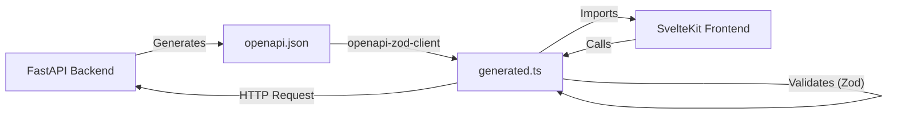

# 🌐 API & Frontend Communication

This section explains how the SvelteKit frontend communicates with the FastAPI backend, ensuring type safety and consistency across the stack.

## 🏗️ Architecture

LibreFolio uses a strict **OpenAPI-first** approach (generated from code) to synchronize the backend and frontend.



## 🔄 The Synchronization Workflow

The synchronization process is automated via `dev.py`:

1. **Backend Definition**: API endpoints and Pydantic models are defined in Python (`backend/app/api/`).
2. **Schema Export**: `./dev.py api schema` starts a temporary backend process to export the `openapi.json` file.
3. **Client Generation**: `./dev.py api client` uses `openapi-zod-client` to read the JSON schema and generate a TypeScript client (`frontend/src/lib/api/generated.ts`).

!!! tip "One-step sync"

    Use `./dev.py api sync` to run both steps (schema export + client generation) in a single command. This is the recommended workflow after any backend API change.

### 💻 CLI Commands

```bash
# Export OpenAPI schema only
./dev.py api schema

# Generate TypeScript client from existing schema
./dev.py api client

# Both in one step (recommended)
./dev.py api sync
```

### ⚡ Generated Client Features

The generated client provides:

- **TypeScript Interfaces**: Matching the Pydantic models (e.g., `AssetRead`, `TransactionCreate`).
- **Zod Schemas**: Runtime validation schemas for API responses.
- **API Functions**: Typed functions for each endpoint (e.g., `api.getAssets()`).

## 🖥️ Usage in Frontend

In the SvelteKit frontend, developers import the generated client to make API calls.

```typescript
import { api } from '$lib/api';

async function loadPortfolio() {
    // 'data' is fully typed as PortfolioResponse
    const data = await api.getPortfolio();
    return data;
}
```

This ensures that if the backend API changes (e.g., a field is renamed), the frontend build will fail with a type error, preventing runtime crashes.

---

## 📡 Notable Endpoints

### `POST /api/v1/assets/prices/current` — Bulk Current Price

Returns the **live current price** for a list of asset IDs. The response is designed for the `LiveTicker` frontend component.

**Request body**: `List[int]` — asset IDs.

**Response** (`FACurrentPriceResponse`):

```json
{
  "results": [
    {
      "asset_id": 1,
      "value": "123.45",
      "currency": "EUR",
      "source": "justetf",
      "timestamp": "2026-04-10T12:00:00Z",
      "error": null
    }
  ]
}
```

**Resolution strategy** (per asset):

1. Ask the assigned provider's `get_current_value()` (live quote from JustETF WebSocket, Yahoo Finance `ticker.info`, etc.)
2. **Fallback**: if the provider fails or has no live feed, return the latest close price from the database.

This endpoint is used by the `LiveTicker` component in the Dashboard and Asset Detail pages, and by the Asset List page for inline live prices in cards.

