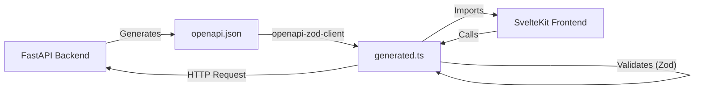

# API & Frontend Communication

This section explains how the SvelteKit frontend communicates with the FastAPI backend, ensuring type safety and consistency across the stack.

## Architecture

LibreFolio uses a strict **OpenAPI-first** approach (generated from code) to synchronize the backend and frontend.



## The Synchronization Workflow

The synchronization process is automated via the `dev.sh` script.

1.  **Backend Definition**: API endpoints and Pydantic models are defined in Python (`backend/app/api/`).
2.  **Schema Export**: `dev.sh api:schema` starts a temporary backend process to export the `openapi.json` file.
3.  **Client Generation**: `dev.sh api:client` uses `openapi-zod-client` to read the JSON schema and generate a TypeScript client (`frontend/src/lib/api/generated.ts`).

### Generated Client Features

The generated client provides:
-   **TypeScript Interfaces**: Matching the Pydantic models (e.g., `AssetRead`, `TransactionCreate`).
-   **Zod Schemas**: Runtime validation schemas for API responses.
-   **API Functions**: Typed functions for each endpoint (e.g., `api.getAssets()`).

## Usage in Frontend

In the SvelteKit frontend, developers import the generated client to make API calls.

```typescript
import { api } from '$lib/api';

async function loadPortfolio() {
    // 'data' is fully typed as PortfolioResponse
    const data = await api.getPortfolio();
    return data;
}
```

This ensures that if the backend API changes (e.g., a field is renamed), the frontend build will fail with a type error, preventing runtime crashes.
