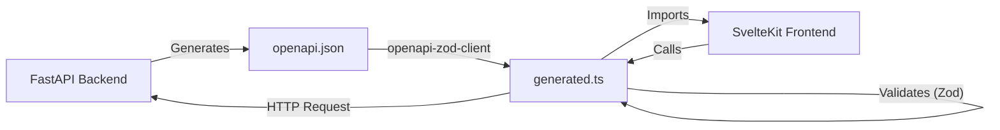

# 🌐 API & Frontend Communication

This section explains how the SvelteKit frontend communicates with the FastAPI backend, ensuring type safety and consistency across the stack.

## 🏗️ Architecture

LibreFolio uses a strict **OpenAPI-first** approach (generated from code) to synchronize the backend and frontend.


```mermaid
graph LR
    Backend[FastAPI Backend] -- "Generates" --> OpenAPI[openapi.json]
    OpenAPI -- "openapi-zod-client" --> TSClient[generated.ts]
    TSClient -- "Imports" --> Frontend[SvelteKit Frontend]
    
    Frontend -- "Calls" --> TSClient
    TSClient -- "Validates (Zod)" --> TSClient
    TSClient -- "HTTP Request" --> Backend
```

## 🔄 The Synchronization Workflow

The synchronization process is automated via `dev.py`:

1. **Backend Definition**: API endpoints and Pydantic models are defined in Python (`backend/app/api/`).
2. **Schema Export**: `./dev.py api schema` starts a temporary backend process to export the `openapi.json` file.
3. **Client Generation**: `./dev.py api client` uses `openapi-zod-client` to read the JSON schema and generate a TypeScript client (`frontend/src/lib/api/generated.ts`).

!!! tip "One-step sync"

    Use `./dev.py api sync` to run both steps (schema export + client generation) in a single command. This is the recommended workflow after any backend API change.

### 💻 CLI Commands

```bash
# Export OpenAPI schema only
./dev.py api schema

# Generate TypeScript client from existing schema
./dev.py api client

# Both in one step (recommended)
./dev.py api sync
```

### ⚡ Generated Client Features

The generated client provides:

- **TypeScript Interfaces**: Matching the Pydantic models (e.g., `AssetRead`, `TransactionCreate`).
- **Zod Schemas**: Runtime validation schemas for API responses.
- **API Functions**: Typed functions for each endpoint (e.g., `api.getAssets()`).

## 🖥️ Usage in Frontend

In the SvelteKit frontend, developers import the generated client to make API calls.

```typescript
import { api } from '$lib/api';

async function loadPortfolio() {
    // 'data' is fully typed as PortfolioResponse
    const data = await api.getPortfolio();
    return data;
}
```

This ensures that if the backend API changes (e.g., a field is renamed), the frontend build will fail with a type error, preventing runtime crashes.

---

## 📜 Contract Rules

Three rules the pipeline depends on. Breaking any of them fails the **frontend build**, not a
backend test — which is why they are written down here.

### 1. Every endpoint declares `response_model`

Every API endpoint declares an explicit `response_model` Pydantic schema: the generated client
is only as typed as the OpenAPI schema, and an endpoint without a model silently degrades to
`unknown`. The audit (08) closed the last stragglers; the deliberate exceptions are endpoints
that do not return JSON documents — the SSE stream (`GET /assets/provider/search/stream`),
binary file downloads (`FileResponse` under `/uploads/file/…`, `/brim/files/…/download`), and a
handful of legacy `dict` returns.

### 2. New discriminated-union members register in `fix-openapi-discriminators.mjs`

Pydantic discriminated unions (`Annotated[A | B, Field(discriminator="kind")]`) generate
correct OpenAPI, but `openapi-zod-client` exports each member as
`const Member: z.ZodType<Member> = …` — the exported `z.ZodType<T>` annotation **hides the
`ZodObject` methods** that `z.discriminatedUnion` needs, and the generated client fails to
compile. The post-processor `frontend/scripts/fix-openapi-discriminators.mjs` strips that
annotation for a hardcoded list of schemas (**40 today**), letting TypeScript infer the
concrete type while keeping the exported alias. It runs as part of `npm run generate-api`
(which `./dev.py api sync` / `./dev.py api client` wrap) and **throws** if a registered schema
is not found exactly once — a stale entry fails loud, never silently.

> When you add a new member to a discriminated union, add its schema name to
> `discriminatedSchemas` in `frontend/scripts/fix-openapi-discriminators.mjs`, then re-run
> `./dev.py api sync`.

### 3. Discriminator fields carry an explicit `enum`

The discriminator field of each union member must pin its value with
`Field(json_schema_extra={"enum": [...]})`:

```python
class SchedulerLogCurrentPriceEntry(BaseModel):
    job: Literal["current_price"] = Field(json_schema_extra={"enum": ["current_price"]})
```

Without the extra, the discriminator is emitted without an enum constraint and the generated
TypeScript client fails to compile (real incident, 03/09 — the scheduler log union). This
pattern is used across `schemas/signals.py`, `schemas/ai_export_runtime.py`, `schemas/risk.py`,
`schemas/risk_scenarios.py`, and `schemas/settings.py`.

---

## 🗜️ Response Compression

`backend/app/main.py` installs Starlette's `GZipMiddleware` on the whole application
(`minimum_size=1024`, `compresslevel=6`), so it covers API JSON as well as the SvelteKit
bundle and the documentation served by the same process.

- A response is compressed only when the request's `Accept-Encoding` header contains `gzip`.
  Browsers send it and decompress transparently, so frontend code never handles compressed
  bytes.
- A compressed response carries `Content-Encoding: gzip`. Its `Content-Length` is the
  compressed size; a streamed response drops the header.
- `Vary: Accept-Encoding` is added to every response eligible for compression — 1 KiB or
  more, or streamed — whether or not the client asked for gzip, so a cache keeps the two
  variants apart.
- Left untouched: bodies under 1 KiB sent in one piece, responses that already declare a
  `Content-Encoding`, `206 Partial Content` range replies, Server-Sent Events
  (`text/event-stream`, such as `GET /assets/provider/search/stream`), AVIF, GIF, JPEG, PNG,
  and WebP images, WOFF and WOFF2 fonts, audio, video, and gzip or zip archives. SVG is text
  and is compressed.
- A body chunk of 128 KiB or more is compressed in a worker thread, off the event loop.

`curl` sends no `Accept-Encoding` by default and therefore receives the uncompressed body.
With `--compressed` it asks for gzip and decompresses transparently:

```bash
# Print the response headers of the compressed variant (Content-Encoding, Vary)
curl -s --compressed -D - -o /dev/null http://localhost:6040/api/v1/openapi.json
```

---

## 📡 Notable Endpoints

### `POST /api/v1/assets/prices/current` — Bulk Current Price

Returns the **current price** of each asset in a list: the assigned provider's latest quote, or the last close stored in the database when no provider answers. The response is designed for the frontend's live-price polling.

**Request body**: `List[int]` — asset IDs.

**Response** (`FACurrentPriceResponse`, a `BaseBulkResponse`): one `results` item per requested ID, in request order; `success_count`, the number of items that carry a `value`; and `errors`, for operation-level errors, which this endpoint leaves empty — a per-asset problem goes in the item's `error`, and a failure of the whole call is an HTTP 500.

```json
{
  "results": [
    {
      "asset_id": 1,
      "value": "123.45",
      "currency": "EUR",
      "as_of_date": "2026-04-10",
      "source": "provider:justetf",
      "error": null
    },
    {
      "asset_id": 2,
      "value": "98.32",
      "currency": "USD",
      "as_of_date": "2026-04-09",
      "source": "db:last_known",
      "error": null
    },
    {
      "asset_id": 3,
      "value": null,
      "currency": null,
      "as_of_date": null,
      "source": null,
      "error": "No price data available"
    }
  ],
  "success_count": 2,
  "errors": []
}
```

`value` is a decimal string, and `as_of_date` is a date (`YYYY-MM-DD`), not a timestamp.

**Resolution strategy** (per asset, all assets in parallel — `get_current_prices_bulk` in `backend/app/services/asset_sources/price_query.py`):

1. If a provider is assigned, ask its `get_current_value()` — at most five calls at a time, ten seconds each — and answer with `source: "provider:<code>"`. A provider answer is cached for two minutes. What "current" means is up to the provider: JustETF answers EUR with a real-time gettex quote, kept up to date by a WebSocket feed per ISIN, and otherwise (other currencies, or no quote) with the latest daily quote of its chart API; Yahoo Finance reads `regularMarketPrice` from `ticker.info` (then `currentPrice` or `previousClose`).
2. **Fallback**: with no usable provider, or when its call fails or times out, return the latest close stored in `PriceHistory`, with `source: "db:last_known"`.
3. With no stored price either, `value` is `null` and `error` is `No price data available` (`Asset not found` for an unknown ID).

**Side effect**: the call is not read-only. A provider quote dated today creates today's `PriceHistory` row (open, high, low and close all equal to the quote) or extends it (`high` and `low` widened, `open` set if missing, `close` replaced). A database fallback is never written back.

This endpoint is used by the Assets list (inline live prices on cards and table rows) and by the asset detail page (price summary and chart head) — see [Live Prices](../frontend/components/features/live-ticker.md#polling).

