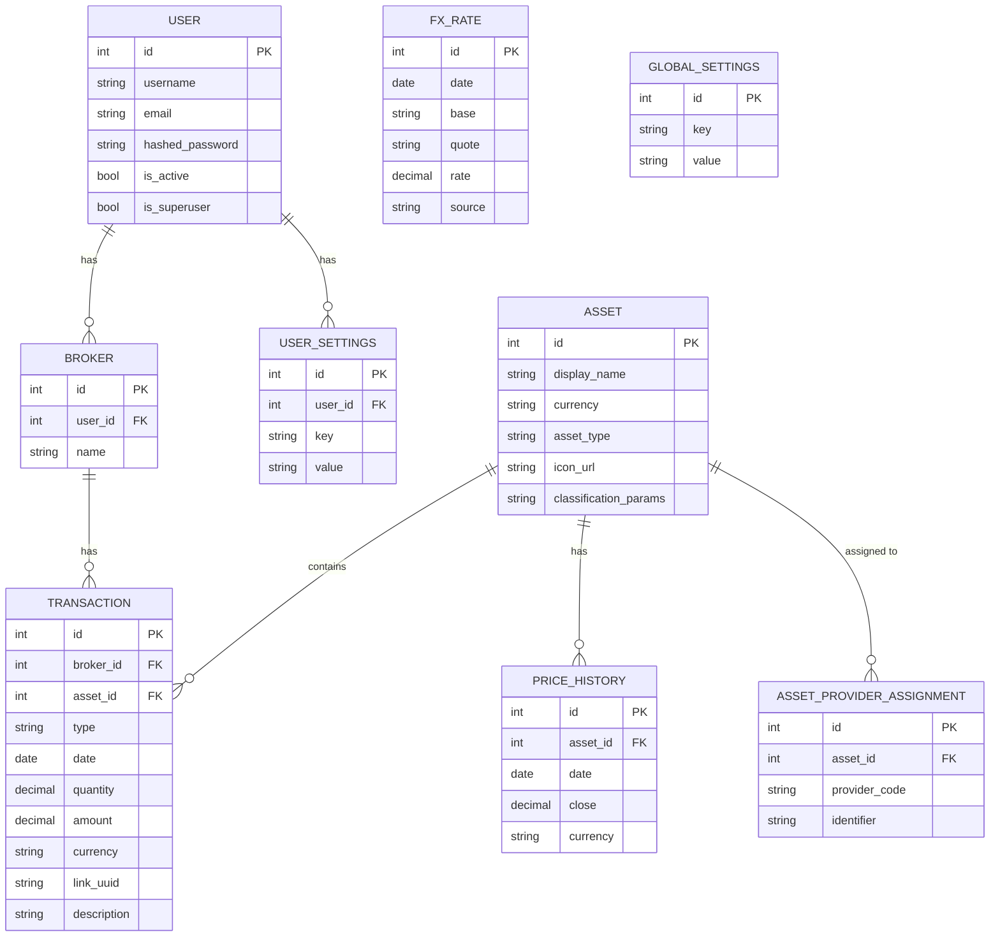

# 🗄️ Database Schema

The LibreFolio database is designed using SQLAlchemy with SQLModel, providing a clear and maintainable structure. The schema is stored in a single SQLite file.

## Entity-Relationship (ER) Diagram

## Key Tables and Relationships

### User & Auth Subsystem
-   **`USER`**: Stores user credentials and roles.
    -   A `USER` can have multiple `BROKER` accounts.
-   **`USER_SETTINGS`**: Stores user-specific preferences.

### Broker & Transactions
-   **`BROKER`**: Represents a brokerage account (e.g., "My Degiro Account").
    -   Each `BROKER` belongs to one `USER`.
    -   Each `BROKER` can have many `TRANSACTION`s.
-   **`TRANSACTION`**: The core table, representing a single financial event (buy, sell, dividend, etc.).
    -   Each `TRANSACTION` belongs to one `BROKER` and involves one `ASSET`.

### Asset Management
-   **`ASSET`**: Represents a financial instrument (e.g., Apple Inc. stock).
    -   Assets are global and not tied to a specific user.
    -   An `ASSET` can be part of many `TRANSACTION`s.
-   **`PRICE_HISTORY`**: Stores historical price data for assets.
    -   Used for charting and performance calculation.
-   **`ASSET_PROVIDER_ASSIGNMENT`**: Links an `ASSET` to a specific pricing provider (e.g., linking "AAPL" in the `ASSET` table to the "yfinance" provider).

### FX Subsystem
-   **`FX_RATE`**: Stores historical foreign exchange rates.
    -   Used for currency conversion.

### System Configuration
-   **`GLOBAL_SETTINGS`**: Stores system-wide settings, managed by administrators.

## Design Philosophy

-   **Normalization**: The schema is normalized to reduce data redundancy. For example, asset information is stored once in the `ASSET` table and referenced by many transactions.
-   **Data Integrity**: `CHECK` constraints and foreign keys are used to ensure data integrity (e.g., ensuring quantities and amounts have valid values).
-   **Flexibility**: The use of JSON fields (e.g., `classification_params` in `ASSET`) allows for storing semi-structured data without altering the schema.
