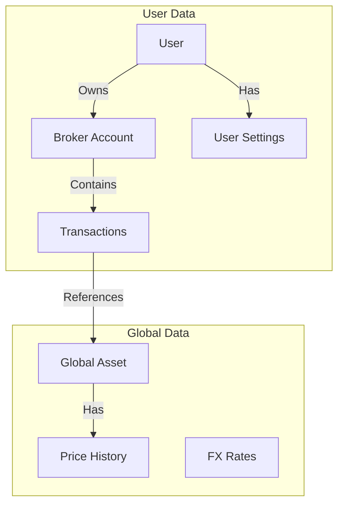
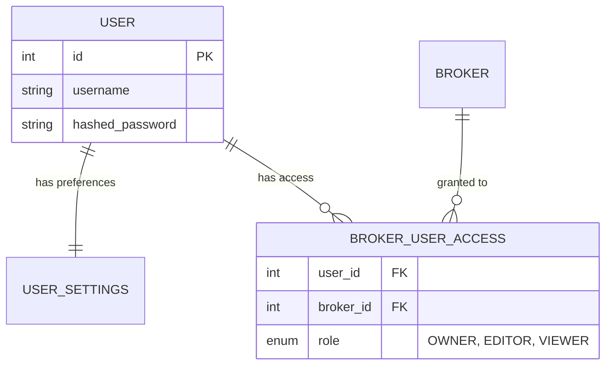
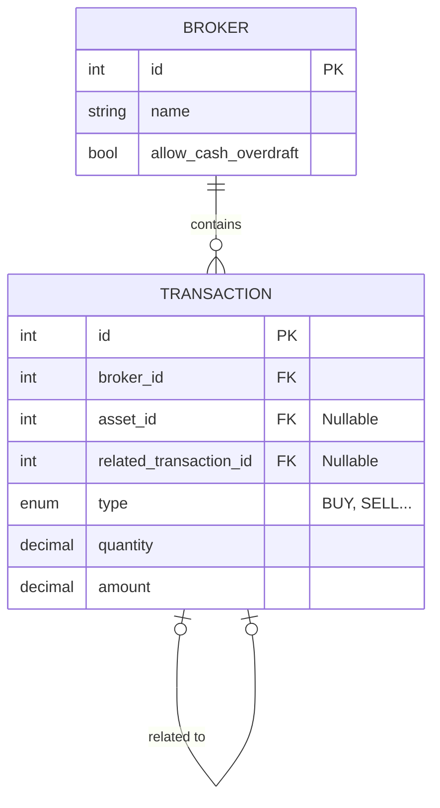
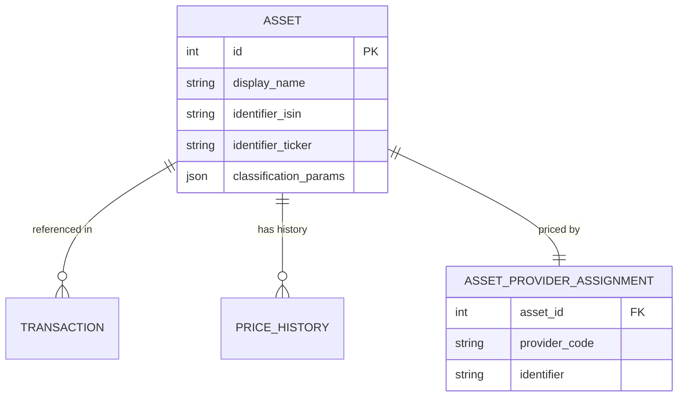
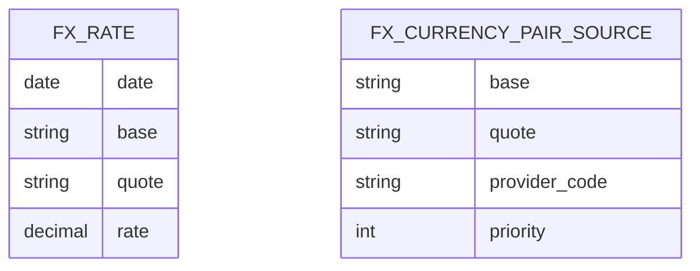

# 🗄️ Database Schema

The LibreFolio database is designed using SQLAlchemy with SQLModel. The schema is stored in a single SQLite file (`app.db`).

> 💡 **Tip**: To explore the live database schema interactively (including all constraints and indexes), we recommend using a tool like **DBeaver** or **DB Browser for SQLite** connected to your local `backend/data/sqlite/app.db` file.

## Logical Data Flow

This diagram illustrates how data flows from the User down to the financial records.

## Subsystems

### 1. User & Access Control

Manages authentication and the sharing of brokers between users.

-   **`BROKER_USER_ACCESS`**: The pivot table for the Many-to-Many relationship. It stores the `role` defining permissions.

### 2. Broker & Transactions

The core financial data structure.

-   **`TRANSACTION`**: The single source of truth.
    -   **`related_transaction_id`**: Self-reference for paired operations (Transfers, FX Conversions).

### 3. Asset Management

Global financial instruments and their pricing sources.

-   **`ASSET`**: Global definition. `classification_params` (JSON) stores metadata like Sector and Geography.
-   **`ASSET_PROVIDER_ASSIGNMENT`**: Decouples the asset from its data source (e.g., "Use Yahoo Finance for AAPL").

### 4. FX Subsystem

Currency exchange rates and routing configuration.

-   **`FX_RATE`**: Stores daily rates. Enforces `base < quote` (alphabetical) to prevent duplicates.
-   **`FX_CURRENCY_PAIR_SOURCE`**: Configures which provider (ECB, FED) to use for which pair.

## Design Philosophy

1.  **Normalization**: Assets are global; Transactions are broker-specific.
2.  **Strict Constraints**:
    -   `CHECK` constraints ensure logical consistency.
    -   Foreign Keys are enforced (`PRAGMA foreign_keys=ON`).
3.  **JSON for Flexibility**: Used for `classification_params` and `provider_params` to allow schema-less extension.
