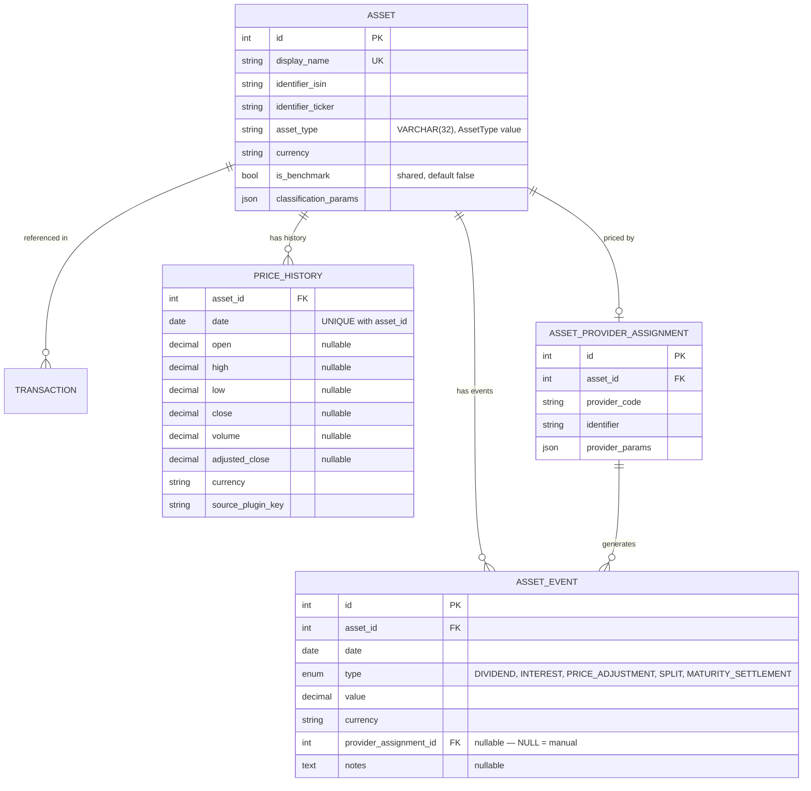

# 📊 Assets & Pricing

Global financial instruments and their pricing sources. Assets are shared across all users — only the transactions referencing them are user-specific.

## 📐 ER Diagram

## 📋 Tables

### 📦 `ASSET`

Global definition of a financial instrument. `display_name` is unique; the identifier columns (`identifier_isin`, `identifier_ticker`, …) are indexed but not unique. Each asset belongs to an [Asset Type](../../../financial-theory/instruments/asset-types/index.md).

- 📋 **`classification_params`** (JSON): Stores flexible metadata like Sector, Geography, and Industry without requiring schema changes.
    - **Distributions** (`FAClassificationParams.geographic_area` and `.sector_area`, `backend/app/schemas/assets.py:533-556`) store their weights as **fractions** that sum to exactly 1, with 4 decimals. The UI works in percent: the distribution editor and the distribution CSV import accept a total within 0.005 points of 100, and divide each weight by 100 before saving (`DistributionEditor.svelte:132,192`, `DistributionDataImportModal.svelte:35,42`).
    - **Backend check.** `BaseDistribution._validate_and_normalize_weights` (`assets.py:352-431`) rejects a sum farther than 0.01 from 1. Otherwise it renormalizes the weights, quantizes them to 4 decimals with `ROUND_HALF_EVEN`, and puts the rounding residue on the smallest weight.
- 💰 **`currency`**: The asset's native currency (e.g., USD for Apple, EUR for ASML).
- 🏷️ **`asset_type`**: One `AssetType` value — see [Asset types and subtypes](#asset-types) below.
- ⭐ **`is_benchmark`** (`BOOLEAN NOT NULL DEFAULT 0`): The asset is offered as a comparison benchmark. The risk benchmark selector (`BenchmarkSelect.svelte`) and the chart's comparison-asset picker (`SignalAssetParamControl.svelte`) list flagged assets in a section of their own, apart from the other assets; `GET /api/v1/assets/query?is_benchmark=true|false` filters on the flag (omitted = both).
    - **Shared, not per-user**: `assets` has no owner column, so the flag is the same for every user.
    - **Independent of `asset_type`**: any asset can be a benchmark, and an `INDEX` asset does not have to be one.
    - **Seeded once**: migration `004_release_1_2_0_schema` set the flag on the existing `INDEX` assets, only when it created the column — a flag the user cleared later is never restored.

#### 🏷️ Asset types and subtypes {: #asset-types }

`assets.asset_type` stores exactly one `AssetType` value (`backend/app/db/models.py`):

| Level | Values |
|-------|--------|
| Base types | `STOCK`, `ETF`, `BOND`, `CRYPTO`, `FUND`, `CROWDFUND`, `HOLD`, `COMMODITY`, `REAL_ESTATE`, `INDEX`, `OTHER` |
| ETF subtypes (family `ETF`) | `ETF_STOCK`, `ETF_BOND`, `ETF_COMMODITY`, `ETF_REAL_ESTATE`, `ETF_CRYPTO`, `ETF_MONETARY` |
| Crowdfunding subtype (family `CROWDFUND`) | `CROWDFUND_REAL_ESTATE` |

A subtype says which base type the instrument contains: `ETF_BOND` is an ETF that holds bonds, `CROWDFUND_REAL_ESTATE` a crowdfunding loan backed by property. `ETF_MONETARY` (money-market funds) is the one subtype with no base-type counterpart. The plain `ETF` and `CROWDFUND` values stay valid, as the residual for mixed or unstated content.

- 🗄️ **Stored as is.** The column keeps the exact value and nothing rolls up in the database; the backend aggregates by the stored value too (the allocation by type in `portfolio_engine.py`). Grouping a subtype with its family is a frontend concern: `ASSET_TYPE_FAMILY` / `assetTypeFamily()` in `frontend/src/lib/utils/assetTypes.ts` files every `ETF_*` value under `ETF` and `CROWDFUND_REAL_ESTATE` under `CROWDFUND`, for the asset-type select and for both allocation charts (see the [Allocation Panel](../../../user/dashboard/charts.md#allocation-panel)).
- 🚫 **`INDEX`** is the one value with backend behaviour: transactions on an `INDEX` asset are refused (`transaction_batch_stages.py`). It does not imply `is_benchmark`.
- ➕ **Adding a value** needs no migration: the column is a plain `VARCHAR(32)` with no `CHECK` constraint (databases created before 22/09/2026 still declare `VARCHAR(14)`, harmless on SQLite — see [Migrations](index.md#enum-column-length)). The frontend tables keyed on the enum must follow: `frontend/src/lib/utils/__tests__/assetTypeTables.test.ts` reads the enum from `backend/app/db/models.py` and fails when one of them misses the new value.

### 📈 `PRICE_HISTORY`

Daily OHLCV (Open, High, Low, Close, Volume) price data for each asset, one row per `(asset_id, date)`. Populated by asset pricing providers. `open`, `high`, `low` and `close` are all nullable: the [price resolver](../../backend/transactions/price_resolver.md) values a day from `close`, and uses the day's range only when `open`, `high` and `low` are all present.

### 🔌 `ASSET_PROVIDER_ASSIGNMENT`

Decouples the asset from its data source. This table configures which provider to use for fetching prices and metadata.

- 📋 Example: "Use Yahoo Finance (`yfinance`) for Apple (`AAPL`)"
- ⚙️ **`provider_params`** (JSON): Provider-specific configuration (e.g., exchange suffix, custom identifier).

The provider system uses the [Registry Pattern](../patterns/registry_pattern.md) for extensibility.

### 📅 `ASSET_EVENT`

Asset-level events that affect pricing or generate distributions. Events are distinct from transactions:

- **Events** describe what happens to the **asset globally** (e.g., a dividend, a stock split).
- **Transactions** describe what happens in a **user's portfolio** (e.g., buy, sell).

| Event Type | Effect on Price | Description |
|-----------|----------------|-------------|
| `DIVIDEND` | Price drops by event value (ex-date) | Cash distribution from equity/ETF |
| `INTEREST` | Price drops by event value | Interest payment from debt/loan |
| `PRICE_ADJUSTMENT` | Algebraic change (+/-) | Non-cash value change (write-down, haircut, re-rating) |
| `SPLIT` | Changes quantity, not total value | Stock/unit split |
| `MATURITY_SETTLEMENT` | Final capital return | Asset reaches maturity — no further calculations |

**Deduplication strategy**: events are upserted **in place**, per source, on `(asset_id, date, type)`: a sync matches only the events of its own assignment, and a matched row keeps its id, so the transactions linked to it stay linked. Manual events (`provider_assignment_id = NULL`) are edited by id or matched on date and type, and a sync never deletes them. See [Asset Events](../../backend/assets/events.md#dedup-strategy).

**Indexes**: `(asset_id, date)`, `(asset_id, type, date)`, `(provider_assignment_id)`.

## 🔗 Related Documentation

- 📚 [Asset Types (Financial Theory)](../../../financial-theory/instruments/asset-types/index.md) — Stock, ETF, Bond, Crypto, etc.
- ⚙️ [Asset Architecture](../../backend/assets/architecture.md) — How asset prices are fetched and managed
- 📋 [Asset Providers List](../../backend/assets/system_providers.md) — Available pricing providers
