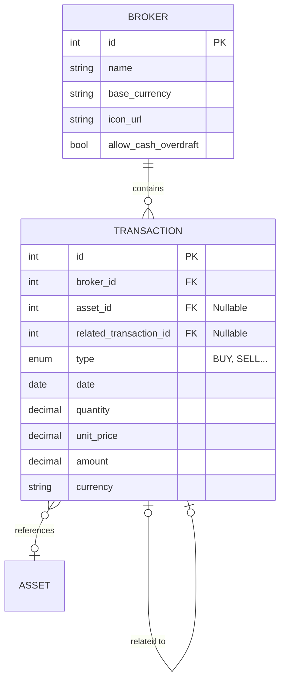

# 🏦 Brokers & Transactions

The core financial data structure. Brokers are containers for transactions, and transactions are the single source of truth for all portfolio calculations.

## ER Diagram

## Tables

### `BROKER`

Represents a brokerage account (e.g., Interactive Brokers, Degiro, a bank account). Each broker has a `base_currency` used for cash balance tracking and an optional `icon_url` for the UI.

- **`allow_cash_overdraft`**: When `false`, the system prevents transactions that would result in a negative cash balance.

### `TRANSACTION`

The single source of truth for all financial operations. Each transaction belongs to exactly one broker.

- **`type`**: One of the [Transaction Types](../../../financial-theory/transaction-types.md) (BUY, SELL, DIVIDEND, DEPOSIT, WITHDRAWAL, FX_CONVERSION, TRANSFER, etc.)
- **`asset_id`**: References a global [Asset](assets_pricing.md). Nullable for cash-only operations (DEPOSIT, WITHDRAWAL).
- **`related_transaction_id`**: Self-referencing foreign key for paired operations:
    - **Transfers**: Links the WITHDRAWAL from Broker A to the DEPOSIT in Broker B
    - **FX Conversions**: Links the sell-side to the buy-side of a currency exchange

## Related Documentation

- [Brokers (User Guide)](../../../user/brokers/index.md) — How to create and manage brokers
- [Broker Sharing](../../../user/brokers/sharing.md) — RBAC sharing system
- [Transaction Types (Financial Theory)](../../../financial-theory/transaction-types.md) — Definitions of all transaction types

