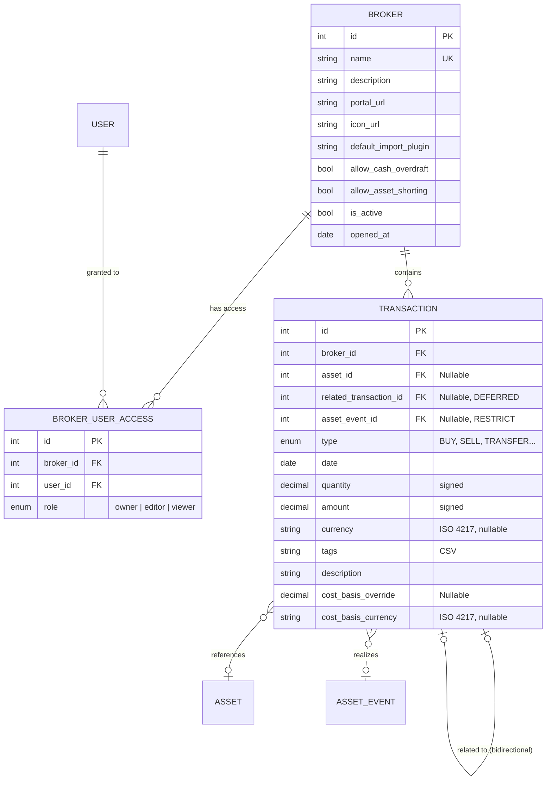

# 🏦 Brokers & Transactions

The core financial data structure. Brokers are containers for transactions, and transactions are the single source of truth for all portfolio calculations.

## 📐 ER Diagram


```mermaid
erDiagram
    BROKER ||--o{ BROKER_USER_ACCESS : "has access"
    USER ||--o{ BROKER_USER_ACCESS : "granted to"
    BROKER ||--o{ TRANSACTION : "contains"
    TRANSACTION |o--o| TRANSACTION : "related to (bidirectional)"
    TRANSACTION }o--o| ASSET : "references"
    TRANSACTION }o..o| ASSET_EVENT : "realizes"

    BROKER {
        int id PK
        string name UK
        string description
        string portal_url
        string icon_url
        string default_import_plugin
        bool allow_cash_overdraft
        bool allow_asset_shorting
        bool is_active
        date opened_at
    }

    BROKER_USER_ACCESS {
        int id PK
        int broker_id FK
        int user_id FK
        enum role "owner | editor | viewer"
    }

    TRANSACTION {
        int id PK
        int broker_id FK
        int asset_id FK "Nullable"
        int related_transaction_id FK "Nullable, DEFERRED"
        int asset_event_id FK "Nullable, RESTRICT"
        enum type "BUY, SELL, TRANSFER..."
        date date
        decimal quantity "signed"
        decimal amount "signed"
        string currency "ISO 4217, nullable"
        string tags "CSV"
        string description
        decimal cost_basis_override "Nullable"
        string cost_basis_currency "ISO 4217, nullable"
    }
```

## 📋 Tables

### 🏦 `brokers`

Represents a brokerage account (e.g., Interactive Brokers, Degiro, a bank account).

| Column | Description |
|--------|-------------|
| `name` | Unique identifier in the UI |
| `description` | Free-text notes |
| `portal_url` | Link to the broker's web portal |
| `icon_url` | Custom icon for the UI |
| `default_import_plugin` | Default BRIM plugin code for imports |
| `allow_cash_overdraft` | When `true`, permits negative cash balances (margin trading) |
| `allow_asset_shorting` | When `true`, permits negative asset quantities (short selling) |
| `is_active` | `false` = account closed (historical data preserved) |
| `opened_at` | Real-world account opening date |

!!! note "No base_currency"

    Unlike some portfolio trackers, brokers do **not** have a single base currency.
    A broker can hold positions in any number of currencies simultaneously.
    Cash balances are tracked per-currency via summation of transaction amounts.

### 🤝 `broker_user_access`

RBAC model — per-broker, per-user role grants.

| Role | Can view | Can edit | Can manage access |
|------|----------|----------|-------------------|
| `viewer` | ✅ | ❌ | ❌ |
| `editor` | ✅ | ✅ | ❌ |
| `owner` | ✅ | ✅ | ✅ |

The first user to create a broker is automatically `owner`. Owners can grant `editor`/`viewer` to other users, enabling shared household portfolios.

### 💰 `transactions`

The single source of truth for all financial operations. Each transaction belongs to exactly one broker.

| Column | Description |
|--------|-------------|
| `broker_id` | FK to broker — required |
| `asset_id` | FK to asset — nullable for cash-only ops (DEPOSIT, WITHDRAWAL) |
| `type` | Enum: BUY, SELL, DIVIDEND, INTEREST, DEPOSIT, WITHDRAWAL, FEE, TAX, TRANSFER, CASH_TRANSFER, FX_CONVERSION, ADJUSTMENT, OTHER |
| `date` | Settlement date |
| `quantity` | Signed asset delta (+in, −out). Default 0, NOT NULL |
| `amount` | Signed cash delta (+in, −out). Default 0, NOT NULL |
| `currency` | ISO 4217 code — required when amount ≠ 0 |
| `related_transaction_id` | Bidirectional self-FK for paired ops (TRANSFER, FX_CONVERSION, CASH_TRANSFER) |
| `tags` | Comma-separated user tags |
| `description` | Free-text |
| `cost_basis_override` | Frozen per-unit cost for incoming seeded lots: receiving `TRANSFER`s, positive `ADJUSTMENT`s, imported snapshots, inheritances (see below) |
| `cost_basis_currency` | ISO currency code for `cost_basis_override`; nullable with the amount |
| `asset_event_id` | FK to AssetEvent — links transaction to a global asset event |

**Design rules:**

- `quantity` and `amount` are **signed** and **NOT NULL** — enables simple `SUM()` for balance calculation
- Paired transactions are **bidirectional** (A→B and B→A) using `DEFERRABLE INITIALLY DEFERRED` FK
- `link_uuid` is accepted by create payloads only as transient batch correlation; it is not a `transactions` column
- Tags are stored as CSV for simple `LIKE` queries without a join table

---

## 🧊 `cost_basis_override` — Snapshot Architecture

The `cost_basis_override` field implements a **frozen acquisition cost** pattern for incoming lots that did not originate from a normal BUY in the same broker: asset transfers, positive ADJUSTMENT seeds, inheritances, and broker-import snapshots.

### ❓ Problem

When assets move from Broker A to Broker B, or when a broker-import plugin seeds a historical position from a snapshot/succession report, the receiving broker needs the historical cost basis (PMC — Prezzo Medio di Carico) for FIFO/tax calculations. Without a snapshot, the system would need to query unavailable history every time it calculates P&L.

### ⚙️ Solution

Create and update payloads can request backend WAC with
`cost_basis_mode="auto"` or `"auto-detail"`. After create-link resolution, the
batch service computes a per-unit WAC and writes its amount and currency to the
staged receiver row. A manual payload instead supplies the
`cost_basis_override` currency object directly.

Batch promote is a separate boundary: `TXPromoteBatchItem` has no
`cost_basis_mode`, and the promote stage does not calculate WAC. Its resolved
per-unit value comes from `resolved_fields.cost_basis_override`, normally
prepared by the frontend merge flow.

See **[📊 Weighted Average Cost (WAC)](../../../financial-theory/technical-analysis/performance-metrics/weighted-average-cost.md)** for the full formula, transaction effects, and examples.

### 📏 Rules

| Side | `cost_basis_override` |
|------|----------------------|
| Sender (qty < 0) | Not required; promote resolution explicitly clears it |
| Receiver (qty > 0) | Required for `TRANSFER` and `ADJUSTMENT`; supplied manually, resolved by promote, or computed for a create/update auto mode |

### 🧮 How batch auto-WAC is staged

- `compute_wac_and_fx_issues()` runs after create, promote, and create-link resolution.
- `_compute_wac_for_auto_items()` selects only parsed create/update rows whose
  `cost_basis_mode` is `auto` or `auto-detail`.
- A linked create resolves its source broker from the partner in the transient
  `link_uuid_map`; an unlinked row uses its own broker and excludes itself.
- `compute_wac_iterative()` reads session-visible transaction history and writes
  the resulting per-unit amount to `cost_basis_override`.
- Missing FX data becomes a `wacFxUnavailable` batch issue instead of silently
  persisting an unresolved cost.
- A split-linked `ADJUSTMENT` skips stored auto-WAC because the portfolio engine
  rescales total cost from the live split relationship.

The service only mutates and flushes the existing session. The
`/transactions/validate` caller always rolls it back; the
`/transactions/commit` caller commits only when `response.committed` is true.

### ✍️ Manual override cases

Exit Tax, inheritances, gifts, corporate actions — these require a user-specified value because the fiscal basis differs from the mathematical average. The frontend shows a warning when no override is set on an ADJUSTMENT with positive qty.

### 📥 BRIM import seeds

BRIM plugins may set `cost_basis_override` directly when the source report already contains the fiscal book value:

- Intesa Sanpaolo `patrimonio` snapshots create a cash `DEPOSIT` when non-zero liquidity is present plus one cashless `ADJUSTMENT` per holding. The plugin divides total *Controvalore di carico fiscale €* by quantity and stores the result as a **per-unit** override.
- Crédit Agricole succession rows (`GIRO ALTRO DOSSIER`, `VERS.TITOLI`) are cashless transfer-ins from an untracked dossier, so they are positive `ADJUSTMENT`s with per-unit override and no `DEPOSIT`.

### 🚪 `opened_at` and BRIM preview gate

`brokers.opened_at` is also used by the frontend BRIM wizard as an import-preview guard. The shipped check is frontend-only and strict: `txDate < info.openedAt`. Rows strictly before the opening date receive local status `before_opening`, are deselected, and cannot be imported; rows dated exactly on `opened_at` remain valid. Users can click **Edit broker date** and then refresh/re-check the preview.

---

## 💱 Currency & FX Integration

The `currency` field in `transactions` is an **ISO 4217 string** (e.g., `EUR`, `USD`, `JPY`). There is **no foreign key** to an FX table — currencies are standard codes validated using `pycountry` + a crypto dictionary.

The dotted line in the ER diagram represents a **logical relationship**, not a relational one:

- When the system needs to **convert between currencies** (e.g., aggregating a multi-currency portfolio), it queries the [FX Rates subsystem](fx_rates.md).
- The backend resolves conversion chains automatically — e.g., RON → JPY may route through EUR.

!!! info "Why no currency table?"

    Currencies are an international standard (ISO 4217) with a fixed, well-known list. Storing them as strings avoids unnecessary joins while keeping validation strict at the application layer.

### 💱 Implied FX Rate Derivation

For `FX_CONVERSION` paired transactions, the effective exchange rate applied by the broker can be derived from the two linked rows:

```
implied_rate = |amount_to| / |amount_from|
```

The frontend compares this with the market rate obtained via `POST /fx/currencies/convert` (amount=1, single date). The rate is cached in the `fxStoreRegistry` TimeSeriesStore — subsequent lookups for the same pair+date are instant.

This comparison is displayed in:

- The promote-suggest banner (BulkModal) — when two standalone TX are detected as a potential FX conversion
- The FX conversion form — as an info tooltip between the "From" and "To" panels

---

## 🔗 Related Documentation

- 📖 [Brokers (User Guide)](../../../user/brokers/index.md) — How to create and manage brokers
- 🤝 [Broker Sharing](../../../user/brokers/sharing.md) — RBAC sharing system
- 📚 [Transaction Types (Financial Theory)](../../../financial-theory/instruments/transaction-types/index.md) — Definitions of all transaction types
- 💱 [FX Architecture](../../backend/fx/architecture.md) — How FX conversion works
- 💱 [FX Configuration & Routing](../../backend/fx/configuration.md) — Provider fallback chain
