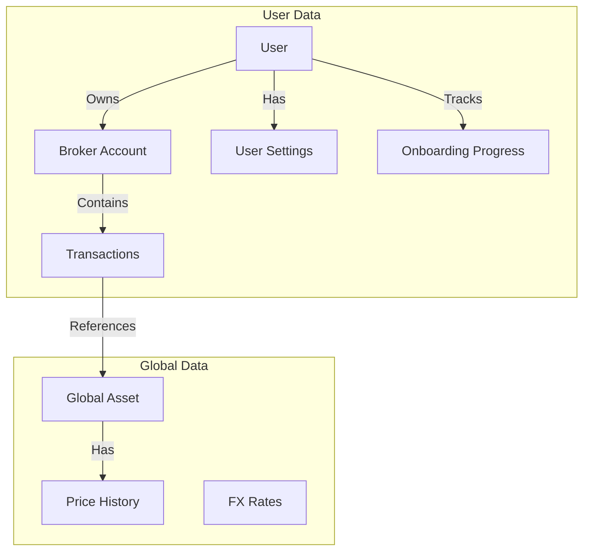

# 🗄️ Database Schema

The LibreFolio database is designed using SQLAlchemy with SQLModel. The schema is stored in a single SQLite file (`app.db`).

> 💡 **Tip**: To explore the live database schema interactively (including all constraints and indexes), we recommend using a tool like **DBeaver** or **DB Browser for SQLite**
> connected to your local `backend/data/prod/sqlite/app.db` file (`backend/data/test/sqlite/app.db` in test mode; `LIBREFOLIO_DATA_DIR` moves the production data directory).

## 🔄 Logical Data Flow

This diagram illustrates how data flows from the User down to the financial records.

## 📂 Subsystems

The database is organized into four logical subsystems. Each has its own detailed page:

- 👤 **[Users & Access](users_access.md)** — Authentication, user settings, onboarding progress, and broker sharing (RBAC)
- 🏦 **[Brokers & Transactions](brokers_transactions.md)** — The core financial data structure
- 📊 **[Assets & Pricing](assets_pricing.md)** — Global financial instruments and provider assignments
- 💱 **[FX Rates & Routes](fx_rates.md)** — Currency exchange rates and routing configuration

## 🏛️ Design Philosophy

1. 📐 **Normalization**: Assets are global; Transactions are broker-specific.
2. ✅ **Strict Constraints**:
    - `CHECK` constraints ensure logical consistency.
    - Foreign Keys are enforced (`PRAGMA foreign_keys=ON`).
3. 📦 **JSON for Flexibility**: Used for `classification_params` and `provider_params` to allow schema-less extension.

## 🧬 Migrations {: #migrations }

Schema changes ship as Alembic revisions in `backend/alembic/versions/` (workflow:
[Database Migrations](../patterns/alembic.md)). At startup, `ensure_database_exists()` in
`backend/app/main.py` builds a missing, empty or table-less database from scratch, and runs
`alembic upgrade head` when the revision stored in `alembic_version` is not the head of the scripts.

The chain is linear:

| File | Revision id | Revises | Change |
|------|-------------|---------|--------|
| `001_initial.py` | `001_initial` | — | Squashed baseline: the 12 original tables with their indexes and constraints |
| `002_identifier_other_json_list.py` | `002_identifier_other_json_list` | `001_initial` | Data only: `assets.identifier_other` becomes a JSON list |
| `003_scheduler_timezone.py` | `5b1333fa6b07` | `002_identifier_other_json_list` | Data only: the stored scheduler sync times move from UTC to `scheduler_timezone` wall-clock time |
| `004_release_1_2_0_schema.py` | `004_release_1_2_0_schema` | `5b1333fa6b07` | `assets.is_benchmark` and the two onboarding progress tables |

!!! warning "The revision id is the contract, not the filename"

    v1.1.0 shipped the scheduler migration as `5b1333fa6b07_scheduler_times_use_configured_timezone.py`.
    The file was later renamed `003_scheduler_timezone.py` so that the files sort in order, but its
    `revision` is still `5b1333fa6b07`: released databases store that id in `alembic_version`, and
    changing it would orphan them. Chain a new migration from the head's revision id
    (`down_revision`), never from a filename, and keep the graph linear — two revisions with the same
    `down_revision` create two heads, and `alembic upgrade head` refuses to choose between them.

### 🩹 Post-migration fixes {: #post-migration-fixes }

Some repairs cannot be Alembic revisions. Rebuilding a table that others reference with
`ON DELETE CASCADE` is one: the Alembic process imports `backend.app.db.session`, whose engine
listener turns foreign keys on, and dropping the old table would then empty the tables that point
at it. These repairs live in `backend/app/db/post_migration/` as ordered `PostMigrationFix`
subclasses (`FIXES`: a new fix is appended, never inserted before an older one). Right after
`ensure_database_exists()`, the lifespan calls `run_post_migration_fixes_at_startup()`, which never
lets an error stop the startup. `run_post_migration_fixes()` works on a direct `sqlite3`
connection:

1. It holds an exclusive `fcntl.flock` on `<db file>.post-migration.lock`, beside the database,
   from the integrity check to the cleanup, dry runs included: the workers of a multi-worker server
   and the offline script take turns, and the later runs find nothing to do. The lock file is never
   deleted. On a non-POSIX system the runs are not serialised.
2. It touches nothing unless `PRAGMA integrity_check` answers `ok`.
3. Every fix `detect()`s its anomaly without writing: nothing found, nothing written or logged.
4. It checkpoints the WAL (`wal_checkpoint(TRUNCATE)`) and copies the database with SQLite's
   backup API to `<db file>.pre-<fix ids>-<UTC %Y%m%dT%H%M%SZ>.bak`. No copy, no fix.
5. Each pending fix runs `prepare()` outside the transaction (filesystem work to undo on failure),
   then, with `foreign_keys = OFF` (SQLite switches it only outside a transaction),
   `BEGIN IMMEDIATE`, `apply()`, `verify()` and the common checks — `PRAGMA foreign_key_check`
   empty, the row count of every table unchanged — before `COMMIT`. Any problem rolls back.
   `finish()` runs after either outcome, and a failed fix stops the ones after it.
6. All applied: the backup is deleted and *Post-migration fixes applied and verified* is logged.
   Otherwise the backup is kept and *Post-migration fix failed: the database was left as it was*
   gives its path and the errors. Both lines carry `seconds`.

`python -m backend.app.db.post_migration [--db PATH] [--data-dir PATH] [--dry-run]`
(`__main__.py`) runs the same function with the server stopped, which it does not check. Each fix
reports `clean`, `would_apply` (dry run), `applied` or `failed` (`PostMigrationReport`); the exit
code is `1` when a fix or the integrity check failed.

The first fix, `autoincrement` (`autoincrement.py`), gives `AUTOINCREMENT` to the id of the tables
whose ids leave the backend (`AUTOINCREMENT_TABLES`: `users`, `brokers`, `assets`, `transactions`,
`fx_conversion_routes`, `asset_events`). Without it SQLite gives a new row `max(id) + 1`, so a row
created after the newest one was deleted inherits its id, and whatever outside the database still
points at it: a saved URL, a benchmark in `localStorage`, a `broker_<id>` report folder. New
databases get it from `001_initial.py`; the fix converts existing ones, once.

- Each table is rebuilt from its current `CREATE TABLE` text with that single change, so the
  columns added by later migrations stay: renamed aside under `legacy_alter_table = ON` (the
  foreign keys of the other tables keep naming it), recreated, rows copied as they are, old table
  dropped, indexes recreated. Any other shape of the id column stops the fix before anything is
  touched.
- Its own checks: the stored DDL and indexes match the plan, and `sqlite_sequence` is not behind
  `max(id)`.
- When `brokers` is converted and the database lies inside the data directory, the
  `broker_reports/<status>/broker_<n>` folders whose broker no longer exists are first renamed to
  `.quarantine-autoincrement-<UTC>-broker_<n>` (out of the listing's `broker_*` glob), deleted
  once the fix is verified, renamed back if it fails: the first broker created afterwards may
  reuse `<n>` once, and must not inherit them.

The admin side (log lines, the offline run) is in [Command-Line Tools](../../../admin/cli_tools.md).

### 📏 `asset_type` and `transactions.type` lengths {: #enum-column-length }

`assets.asset_type` and `transactions.type` are plain `VARCHAR` columns with no `CHECK`
constraint: the allowed values live in the Python enums (`AssetType` and `TransactionType` in
`backend/app/db/models.py`), so adding a value is a code change, not a migration. Since 22/09/2026,
`001_initial` declares both columns `VARCHAR(32)`. They were `VARCHAR(14)`, shorter than
`ETF_REAL_ESTATE` (15 characters).

Databases created before that change keep the `VARCHAR(14)` declaration, on purpose: no migration
rebuilds `assets` and `transactions` for it. SQLite does not enforce a declared length, so both
declarations accept the same values. A schema built from the migrations on an engine that enforces
lengths gets `VARCHAR(32)`.

## 📂 Data Directory on Disk {: #data-directory }

`get_data_dir()` (`backend/app/config.py`) picks the root: in test mode `LIBREFOLIO_TEST_DATA_DIR`
(default `backend/data/test`), otherwise `LIBREFOLIO_DATA_DIR` (default `backend/data/prod`); a
relative path resolves from the project root. At every startup `ensure_data_dirs()` creates
`sqlite/`, `custom-uploads/`, `broker_reports/{uploaded,parsed,failed}/` and `logs/` and, outside
test mode, writes the `.librefolio-production-data` marker: `validate_test_data_dir()` refuses a
test root that overlaps a production root, lies inside a marked one or aliases one of its paths.
The admin view of the same layout is [Filesystem Structure](../../../admin/filesystem.md).

| Path | Written by (under `backend/app/`) | Content |
|------|-----------------------------------|---------|
| `sqlite/app.db` (+ `-wal`, `-shm`) | the engines of `db/session.py` | The database; every connection sets `journal_mode=WAL` and `foreign_keys=ON` |
| `sqlite/app.db.post-migration.lock` | `db/post_migration/` | Empty lock of the [post-migration fixes](#post-migration-fixes), never deleted |
| `sqlite/app.db.pre-<fix ids>-<UTC>.bak` | `db/post_migration/` | Backup kept after a failed fix |
| `custom-uploads/<uuid>.<ext>` + `<uuid>.json` | `services/static_uploads.py` | Uploaded file and its sidecar: `id`, `original_name`, `extension`, `mime_type`, `size_bytes`, `uploaded_at`, `uploaded_by_user_id`, `description` ([File Upload](../../frontend/components/core-ui/file-upload.md)) |
| `custom-uploads/.avatars_seeded` | `seed_default_avatars()` in `services/static_uploads.py` | Marker: the PNGs of `backend/staticResources/Avatars/` were copied, uploader `0` (system); without it the next start copies them again |
| `broker_reports/` | `services/brim_provider.py` | Reports and sidecars by status and broker, plus `.locks/` ([File Lifecycle](../../backend/brim/architecture.md#file-lifecycle)) |
| `logs/librefolio.log` | `logging_config.py` | structlog `JSONRenderer` lines; `TimedRotatingFileHandler` (`when="W0"`, `utc=True`, `backupCount=52`) whose rotator gzips each archive to `librefolio.log.<date>.gz` |
| `scheduler_state.json` | `services/scheduler/state.py` | Last run of the `current_price` and `history_sync` jobs, written then renamed; a missing or corrupt file means a fresh state |
| `scenario_catalog/{historical,hypothetical}/` | the administrator | Optional host scenarios ([Scenario Catalogue](../../backend/risk/architecture.md#scenario-catalog)) |
