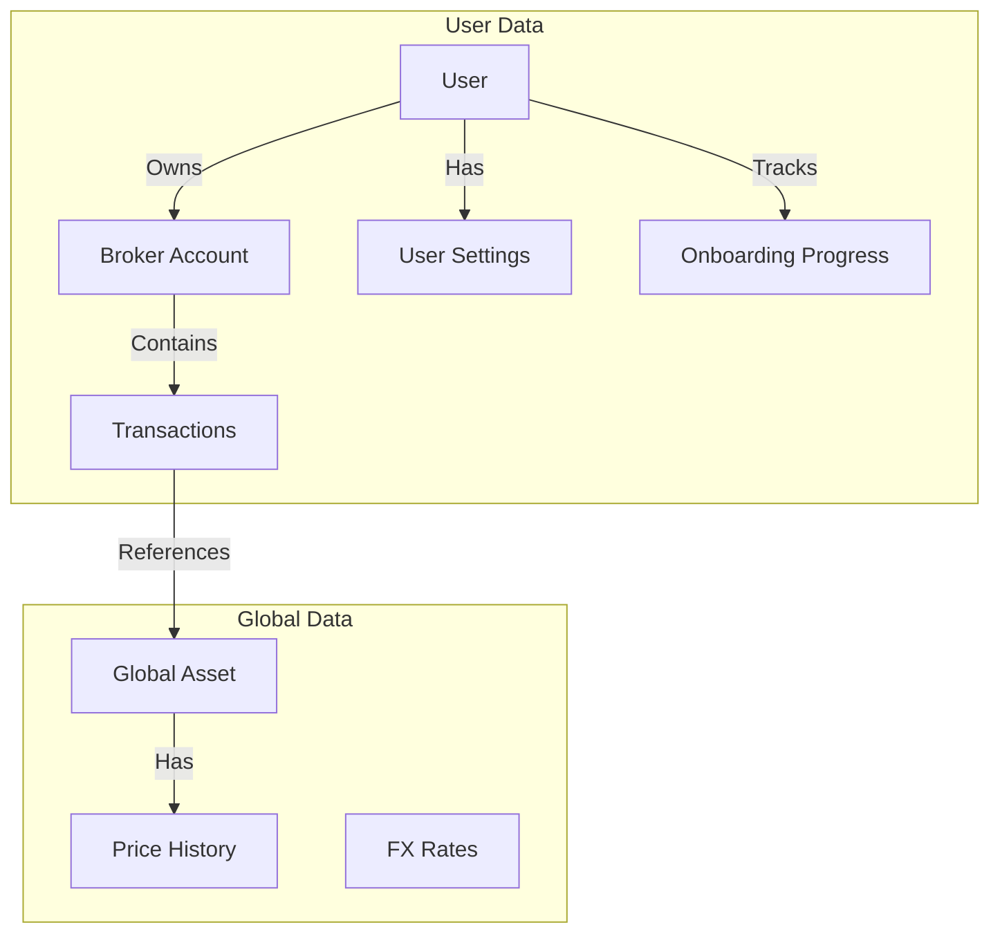

# 🗄️ Database Schema

The LibreFolio database is designed using SQLAlchemy with SQLModel. The schema is stored in a single SQLite file (`app.db`).

> 💡 **Tip**: To explore the live database schema interactively (including all constraints and indexes), we recommend using a tool like **DBeaver** or **DB Browser for SQLite**
> connected to your local `backend/data/prod/sqlite/app.db` file (`backend/data/test/sqlite/app.db` in test mode; `LIBREFOLIO_DATA_DIR` moves the production data directory).

## 🔄 Logical Data Flow

This diagram illustrates how data flows from the User down to the financial records.

## 📂 Subsystems

The database is organized into four logical subsystems. Each has its own detailed page:

- 👤 **[Users & Access](users_access.md)** — Authentication, user settings, onboarding progress, and broker sharing (RBAC)
- 🏦 **[Brokers & Transactions](brokers_transactions.md)** — The core financial data structure
- 📊 **[Assets & Pricing](assets_pricing.md)** — Global financial instruments and provider assignments
- 💱 **[FX Rates & Routes](fx_rates.md)** — Currency exchange rates and routing configuration

## 🏛️ Design Philosophy

1. 📐 **Normalization**: Assets are global; Transactions are broker-specific.
2. ✅ **Strict Constraints**:
    - `CHECK` constraints ensure logical consistency.
    - Foreign Keys are enforced (`PRAGMA foreign_keys=ON`).
3. 📦 **JSON for Flexibility**: Used for `classification_params` and `provider_params` to allow schema-less extension.

## 🧬 Migrations {: #migrations }

Schema changes ship as Alembic revisions in `backend/alembic/versions/` (workflow:
[Database Migrations](../patterns/alembic.md)). At startup, `ensure_database_exists()` in
`backend/app/main.py` builds a missing, empty or table-less database from scratch, and runs
`alembic upgrade head` when the revision stored in `alembic_version` is not the head of the scripts.

The chain is linear:

| File | Revision id | Revises | Change |
|------|-------------|---------|--------|
| `001_initial.py` | `001_initial` | — | Squashed baseline: the 12 original tables with their indexes and constraints |
| `002_identifier_other_json_list.py` | `002_identifier_other_json_list` | `001_initial` | Data only: `assets.identifier_other` becomes a JSON list |
| `003_scheduler_timezone.py` | `5b1333fa6b07` | `002_identifier_other_json_list` | Data only: the stored scheduler sync times move from UTC to `scheduler_timezone` wall-clock time |
| `004_release_1_2_0_schema.py` | `004_release_1_2_0_schema` | `5b1333fa6b07` | `assets.is_benchmark` and the two onboarding progress tables |

!!! warning "The revision id is the contract, not the filename"

    v1.1.0 shipped the scheduler migration as `5b1333fa6b07_scheduler_times_use_configured_timezone.py`.
    The file was later renamed `003_scheduler_timezone.py` so that the files sort in order, but its
    `revision` is still `5b1333fa6b07`: released databases store that id in `alembic_version`, and
    changing it would orphan them. Chain a new migration from the head's revision id
    (`down_revision`), never from a filename, and keep the graph linear — two revisions with the same
    `down_revision` create two heads, and `alembic upgrade head` refuses to choose between them.

### 📏 `asset_type` and `transactions.type` lengths {: #enum-column-length }

`assets.asset_type` and `transactions.type` are plain `VARCHAR` columns with no `CHECK`
constraint: the allowed values live in the Python enums (`AssetType` and `TransactionType` in
`backend/app/db/models.py`), so adding a value is a code change, not a migration. Since 22/09/2026,
`001_initial` declares both columns `VARCHAR(32)`. They were `VARCHAR(14)`, shorter than
`ETF_REAL_ESTATE` (15 characters).

Databases created before that change keep the `VARCHAR(14)` declaration, on purpose: no migration
rebuilds `assets` and `transactions` for it. SQLite does not enforce a declared length, so both
declarations accept the same values. A schema built from the migrations on an engine that enforces
lengths gets `VARCHAR(32)`.
