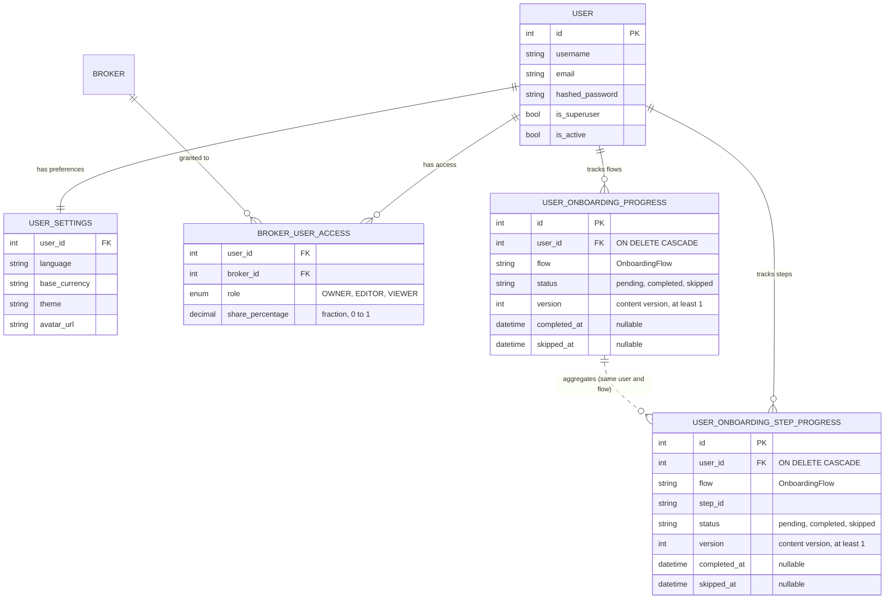

# 👤 Users & Access Control

Manages authentication, user preferences, onboarding progress, and the sharing of brokers between users.

## 📐 ER Diagram

## 📋 Tables

### 👤 `USER`

The core identity table. Each user has a unique `username` and `email`. The `hashed_password` is stored using `bcrypt`. The first user created automatically becomes the superuser (`is_superuser = true`).

### ⚙️ `USER_SETTINGS`

One-to-one with `USER`. Stores user-specific preferences: display language, base currency (`base_currency`), theme (`light`, `dark` or `auto`), and avatar URL. When a setting is not defined here, the system falls back to the corresponding `GLOBAL_SETTING`.

### 🌍 `GLOBAL_SETTING`

System-wide configuration managed by the admin. Includes settings like `session_ttl_hours`, `max_file_upload_mb`, and default values for user preferences.

### 🔑 `BROKER_USER_ACCESS`

The pivot table for the Many-to-Many relationship between Users and Brokers. It stores:

- 🛡️ **`role`**: One of `OWNER`, `EDITOR`, or `VIEWER` — see [Access Control (RBAC)](../access_control.md) for the full permission matrix.
- 📊 **`share_percentage`**: The ownership fraction, `NUMERIC(7, 6)` from 0 to 1 (`CHECK` constraint), used for aggregated portfolio calculations (e.g., `0.5` for a joint account). The API exchanges the fraction as-is; the frontend shows it as a percentage.

### 🧭 `USER_ONBOARDING_PROGRESS`

Table `user_onboarding_progress`: one row per user and guided onboarding flow, `UNIQUE (user_id, flow)`
(`uq_user_onboarding_progress_user_flow`). `user_id` references `users.id` with `ON DELETE CASCADE`.

- 🧭 **`flow`** (`VARCHAR(50)`): an `OnboardingFlow` value — `welcome`, `intro_tour`,
  `transactions_page_guide`, `transaction_create_guide`, `transaction_bulk_guide`, `import_guide`,
  `broker_page_guide`, `broker_guide`, `broker_detail_guide`, `fx_page_guide`, `fx_guide`,
  `fx_detail_guide`, `asset_page_guide`, `asset_guide`, `asset_detail_guide`.
- 🚦 **`status`** (`VARCHAR(20)`): an `OnboardingStatus` value — `pending`, `completed` or `skipped` —
  enforced by `CHECK` (`ck_user_onboarding_progress_status`). `completed_at` and `skipped_at` record
  the last terminal transition: the service sets one and clears the other.
- 🔢 **`version`**: the content version the status refers to, `CHECK (version >= 1)`
  (`ck_user_onboarding_progress_version`). The current version of every flow is
  `ONBOARDING_FLOW_VERSIONS` in `backend/app/services/onboarding_service.py`. A row behind it is
  reported with `update_available` (optional replay); a complete or skip request must send the
  current version as `expected_version`, or it gets `409` `onboarding_version_mismatch`.

Rows are created lazily: reading a user's progress (`GET /api/v1/settings/onboarding`), or any
transition, first inserts the missing flow and step rows as `pending` (`INSERT … ON CONFLICT DO NOTHING`)
and never rewrites an existing row.

### 🪜 `USER_ONBOARDING_STEP_PROGRESS`

Table `user_onboarding_step_progress`: per-step progress of the step-managed flows, those listed in
`ONBOARDING_FLOW_STEPS` — `transaction_bulk_guide` (`transaction.bulk.*` steps) and `import_guide`
(`import.*`, one step per import wizard step plus `import.bulk`). Same columns as the flow table plus
`step_id` (`VARCHAR(100)`), with `UNIQUE (user_id, flow, step_id)`
(`uq_user_onboarding_step_progress_user_flow_step`), the same `status` and `version` checks and the
same cascading foreign key to `users`.

There is no foreign key between the two onboarding tables: a step row belongs to its flow row through
`(user_id, flow)`. For a step-managed flow, the flow row is an aggregate that the service recomputes on
every step transition: `pending` until every registered step is `completed` or `skipped` at the current
version, then `skipped` if all of them were skipped, `completed` otherwise.

!!! note "Existing accounts are grandfathered"

    Migration `004_release_1_2_0_schema` seeds every user that already exists when it runs: `welcome` as
    `completed` (their settings are already configured), the fourteen other flows as `skipped`, and
    `skipped` rows for the steps the migration lists for `transaction_bulk_guide` and `import_guide`.
    `skipped` suppresses the automatic trigger like `completed`, but keeps "never shown this" distinct
    from "went through it", so a flow can still be offered later.

    Users created after the migration get no seeded rows: their `pending` rows appear on the first read
    of their progress. The same lazy insert adds any row the migration did not seed — such as the
    `import.gapFix` step, which is not in the migration's list — for every user.

## 🔗 Related Documentation

- 👥 [Users & Roles (Architecture)](../users_and_brokers.md) — Authentication flow, session management, user roles
- 🔐 [Access Control (RBAC)](../access_control.md) — Permission matrix for Owner/Editor/Viewer
- ⚙️ [Settings System](../settings.md) — Global vs user settings, fallback logic
- 🚪 [From login to the first guide](../../frontend/onboarding.md#layout-gate) — How the app loads onboarding progress, sends the user to Welcome while it is due, and completes or skips it
- 🧑‍🏫 [The contextual import guide](../../frontend/components/features/import-wizard.md#import-guide-wiring) — The step-managed `import_guide` flow in the Import Wizard
