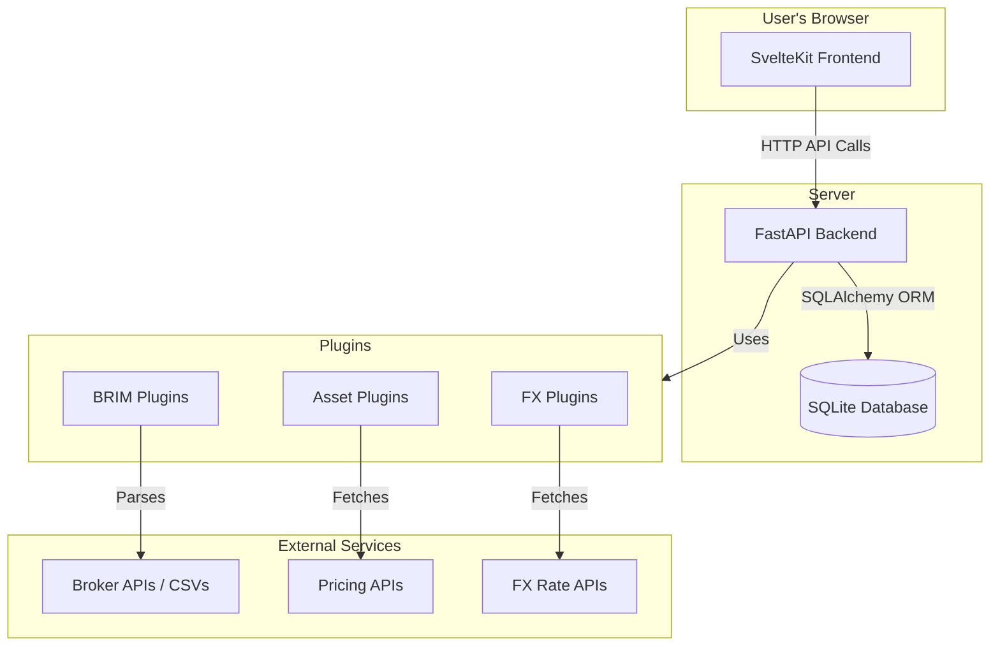

# 🏗️ System Architecture Overview

LibreFolio is designed as a modern web application with a clear separation between the backend API and the frontend user interface.

## High-Level Diagram

The architecture can be visualized as three main components:

### Components

1.  **Frontend (SvelteKit)**: A single-page application (SPA) that runs in the user's browser. It communicates with the backend via a RESTful API to fetch and display data.

2.  **Backend (FastAPI)**: A Python-based API server that handles all business logic, including:
    -   User authentication and authorization.
    -   Database operations (CRUD).
    -   Data import from brokers (BRIM).
    -   Fetching asset prices and FX rates from external sources.

3.  **Database (SQLite)**: A single-file database that stores all user data, including transactions, assets, user settings, and cached data.

4.  **Provider Plugins**: A system of pluggable modules that abstract the interaction with external data sources. This makes it easy to add support for new brokers, pricing APIs, or FX rate providers without modifying the core application logic.

## Request Flow Example: Displaying Portfolio

1.  User logs in and navigates to the dashboard.
2.  The **Frontend** makes an API request to `GET /api/v1/portfolio`.
3.  The **Backend** receives the request, authenticates the user, and queries the **Database** for the user's transactions.
4.  For each asset, the backend may need to fetch the latest price. It calls the appropriate **Asset Provider Plugin** (e.g., Yahoo Finance).
5.  If currency conversion is needed, the backend calls the **FX Provider Plugin** to get the latest exchange rate.
6.  The backend processes the data, calculates portfolio metrics, and returns a JSON response to the frontend.
7.  The **Frontend** receives the JSON data and renders the portfolio dashboard.
